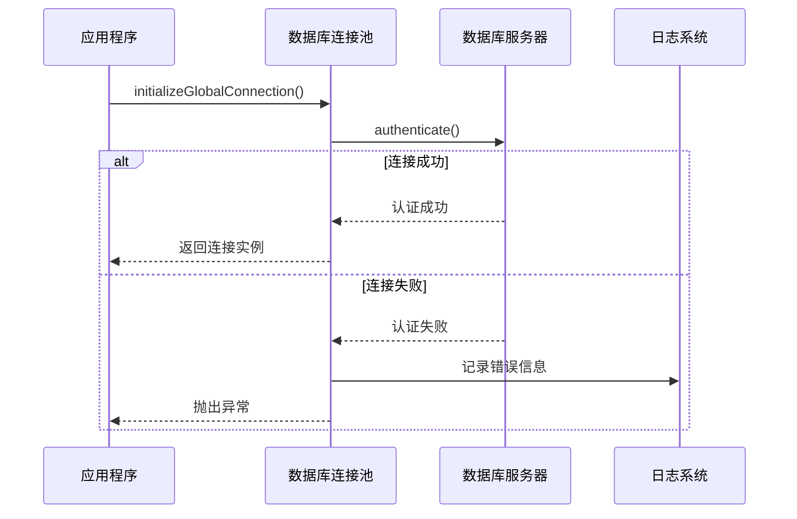
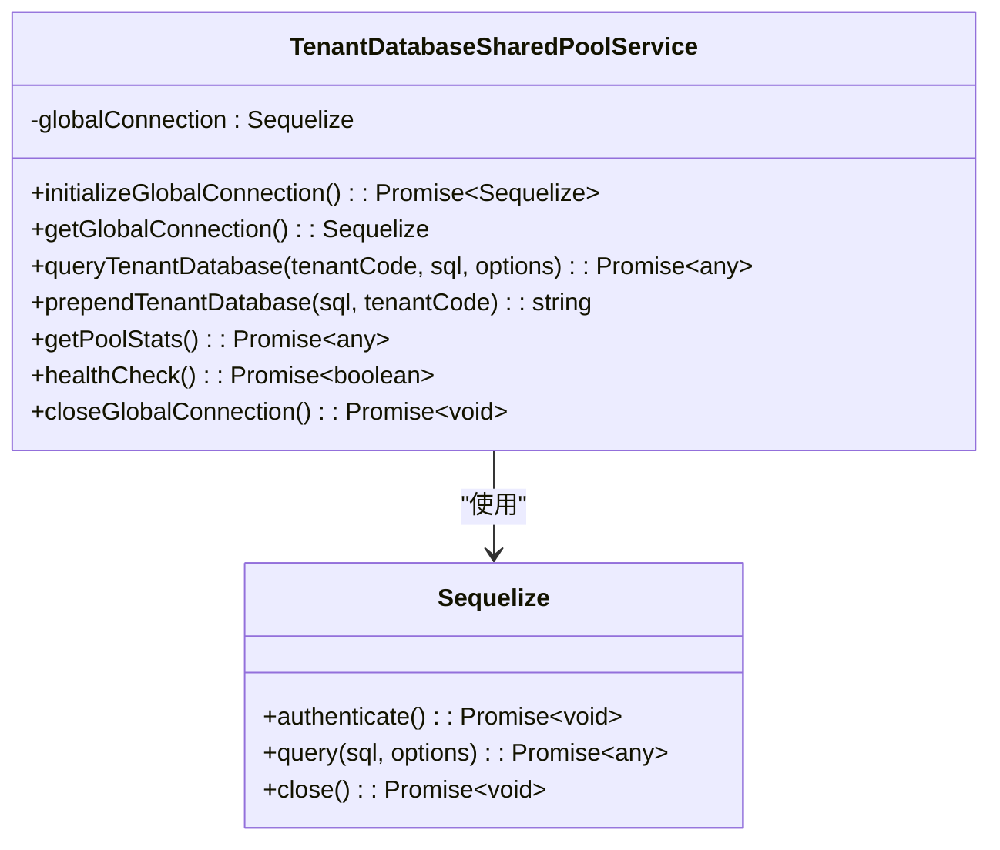
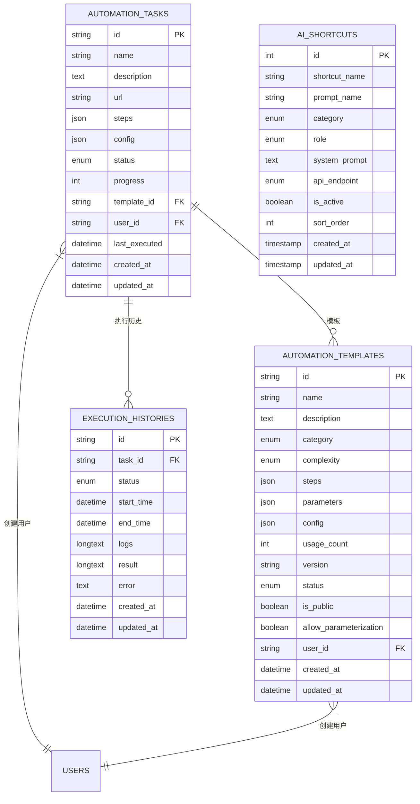
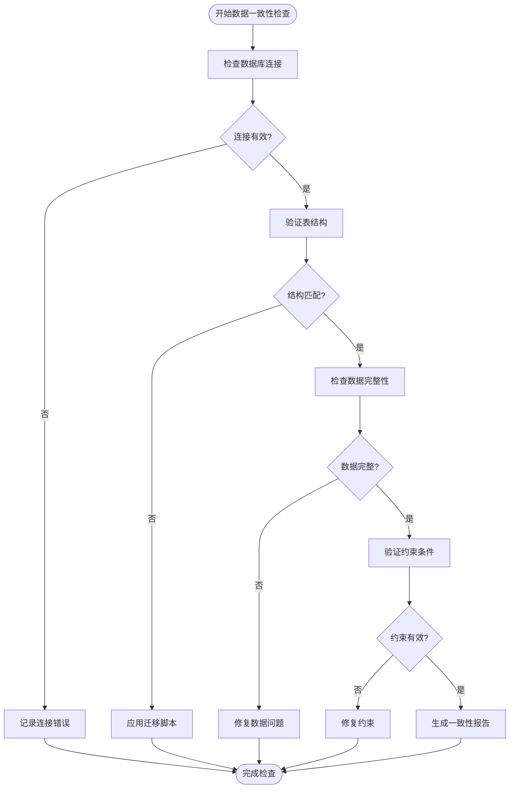

# 数据库调试

<cite>
**本文档引用的文件**
- [database-initialization.ts](file://database-initialization.ts)
- [tenant-database-shared-pool.service.ts](file://tenant-database-shared-pool.service.ts)
- [tenant-resolver-shared-pool.middleware.ts](file://tenant-resolver-shared-pool.middleware.ts)
- [20250815_create_website_automation_tables.sql](file://k.yyup.com/database/migrations/20250815_create_website_automation_tables.sql)
- [create_ai_shortcuts_table.sql](file://k.yyup.com/database/migrations/create_ai_shortcuts_table.sql)
- [logger.ts](file://k.yyup.com/server/src/utils/logger.ts)
</cite>

## 目录
1. [引言](#引言)
2. [数据库连接问题调试](#数据库连接问题调试)
3. [ORM模型调试技术](#orm模型调试技术)
4. [SQL查询调试方法](#sql查询调试方法)
5. [数据一致性检查技巧](#数据一致性检查技巧)
6. [数据库管理工具使用](#数据库管理工具使用)
7. [结论](#结论)

## 引言
本文档旨在为开发人员提供一套完整的数据库调试指南，涵盖从连接问题排查到数据一致性验证的各个方面。系统采用基于Sequelize的ORM框架和多租户架构，通过共享连接池实现高效的数据访问。文档将详细介绍如何调试数据库连接问题、ORM模型定义、SQL查询性能以及数据一致性问题。

**Section sources**
- [database-initialization.ts](file://database-initialization.ts#L1-L89)
- [tenant-database-shared-pool.service.ts](file://tenant-database-shared-pool.service.ts#L1-L177)

## 数据库连接问题调试

### 连接字符串验证
系统使用环境变量配置数据库连接参数，主要包含以下关键配置：
- `DB_HOST`: 数据库主机地址
- `DB_PORT`: 数据库端口（默认3306）
- `DB_USER`: 数据库用户名
- `DB_PASSWORD`: 数据库密码
- `DB_POOL_MAX`: 连接池最大连接数（默认30）
- `DB_POOL_MIN`: 连接池最小连接数（默认5）

连接字符串验证应检查`.env`文件中的这些配置项是否正确设置，并确保没有拼写错误或格式问题。

### 网络连通性测试
网络连通性测试可以通过以下步骤进行：
1. 使用`ping`命令测试数据库服务器的可达性
2. 使用`telnet`或`nc`命令测试数据库端口是否开放
3. 检查防火墙设置是否允许应用程序服务器访问数据库服务器

系统在初始化时会自动执行连接认证，相关代码位于`tenant-database-shared-pool.service.ts`中。

### 认证信息检查
认证信息检查应关注以下方面：
- 用户名和密码是否正确
- 数据库用户是否具有足够的权限
- 数据库是否配置了正确的访问控制

系统通过Sequelize的`authenticate()`方法验证连接，失败时会记录详细的错误信息。

**Diagram sources**
- [tenant-database-shared-pool.service.ts](file://tenant-database-shared-pool.service.ts#L15-L55)
- [database-initialization.ts](file://database-initialization.ts#L13-L39)

**Section sources**
- [tenant-database-shared-pool.service.ts](file://tenant-database-shared-pool.service.ts#L15-L55)
- [database-initialization.ts](file://database-initialization.ts#L13-L39)

## ORM模型调试技术

### Sequelize模型定义验证
系统采用Sequelize作为ORM框架，模型定义验证应关注以下方面：
- 模型字段类型是否正确
- 约束条件（如NOT NULL、UNIQUE）是否合理
- 索引配置是否恰当
- 关联关系定义是否正确

在多租户架构中，系统通过动态修改SQL语句中的表名为"tenant_xxx.table_name"格式来实现租户数据隔离。

### 关联关系调试
关联关系调试应检查：
- 外键约束是否正确设置
- 关联查询是否生成正确的SQL
- 懒加载和急加载行为是否符合预期

系统中的权限管理涉及多个关联表，如`roles`、`permissions`和`role_permissions`之间的关系。

### 查询生成分析
查询生成分析可以通过启用Sequelize的logging功能来实现。系统在开发环境中会记录所有执行的SQL语句，便于分析查询生成是否正确。

**Diagram sources**
- [tenant-database-shared-pool.service.ts](file://tenant-database-shared-pool.service.ts#L9-L177)
- [tenant-resolver-shared-pool.middleware.ts](file://tenant-resolver-shared-pool.middleware.ts#L7-L8)

**Section sources**
- [tenant-database-shared-pool.service.ts](file://tenant-database-shared-pool.service.ts#L9-L177)
- [tenant-resolver-shared-pool.middleware.ts](file://tenant-resolver-shared-pool.middleware.ts#L7-L8)

## SQL查询调试方法

### 慢查询识别
慢查询识别可以通过以下方式实现：
1. 启用数据库的慢查询日志功能
2. 监控执行时间超过阈值的查询
3. 分析查询执行计划

系统中的自动化任务表和执行历史表可能涉及大量数据，需要特别关注相关查询性能。

### 执行计划分析
执行计划分析应关注：
- 查询是否使用了正确的索引
- 是否存在全表扫描
- 连接操作的效率

例如，在`automation_tasks`表中，已为`user_id`、`status`和`created_at`字段创建了索引，以优化常见查询。

### 索引优化建议
根据数据库迁移文件分析，系统已为关键字段创建了适当的索引：

**Diagram sources**
- [20250815_create_website_automation_tables.sql](file://k.yyup.com/database/migrations/20250815_create_website_automation_tables.sql#L5-L77)
- [create_ai_shortcuts_table.sql](file://k.yyup.com/database/migrations/create_ai_shortcuts_table.sql#L2-L25)

**Section sources**
- [20250815_create_website_automation_tables.sql](file://k.yyup.com/database/migrations/20250815_create_website_automation_tables.sql#L5-L77)
- [create_ai_shortcuts_table.sql](file://k.yyup.com/database/migrations/create_ai_shortcuts_table.sql#L2-L25)

## 数据一致性检查技巧

### 事务完整性验证
事务完整性验证应确保：
- 相关操作在同一个事务中执行
- 异常情况下能够正确回滚
- 事务隔离级别设置合理

系统在处理关键业务逻辑时应使用事务来保证数据一致性。

### 数据迁移问题排查
数据迁移问题排查应关注：
- 迁移脚本是否正确执行
- 数据转换逻辑是否正确
- 约束条件是否仍然有效

系统中的数据库迁移文件包含了表结构定义和初始数据插入，需要确保这些脚本在不同环境中的一致性。

**Diagram sources**
- [database-initialization.ts](file://database-initialization.ts#L13-L39)
- [tenant-database-shared-pool.service.ts](file://tenant-database-shared-pool.service.ts#L128-L138)

**Section sources**
- [database-initialization.ts](file://database-initialization.ts#L13-L39)
- [tenant-database-shared-pool.service.ts](file://tenant-database-shared-pool.service.ts#L128-L138)

## 数据库管理工具使用

### 实时数据查看
系统提供了多种方式查看实时数据：
- 通过日志系统查看数据库操作记录
- 使用数据库客户端工具直接连接数据库
- 通过管理界面查看关键指标

日志系统会记录连接池状态、查询执行情况等重要信息。

### 数据修改
数据修改应遵循以下原则：
- 生产环境禁止直接修改数据
- 测试环境修改数据需记录原因
- 使用事务确保修改的原子性

系统通过`queryTenantDatabase`方法提供安全的数据访问接口，避免直接暴露数据库连接。

**Section sources**
- [tenant-database-shared-pool.service.ts](file://tenant-database-shared-pool.service.ts#L71-L92)
- [logger.ts](file://k.yyup.com/server/src/utils/logger.ts)

## 结论
本文档提供了全面的数据库调试指南，涵盖了连接问题、ORM模型、SQL查询和数据一致性等关键方面。系统采用多租户架构和共享连接池设计，通过Sequelize ORM框架实现高效的数据访问。开发人员应充分利用提供的调试技术和工具，确保数据库操作的正确性和性能。建议定期检查连接池状态、监控慢查询并验证数据一致性，以维护系统的稳定运行。