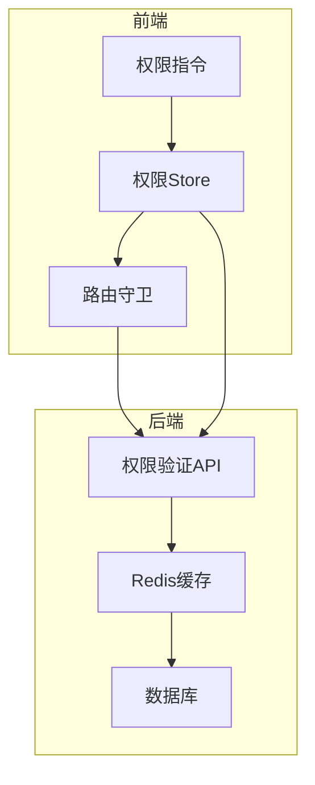
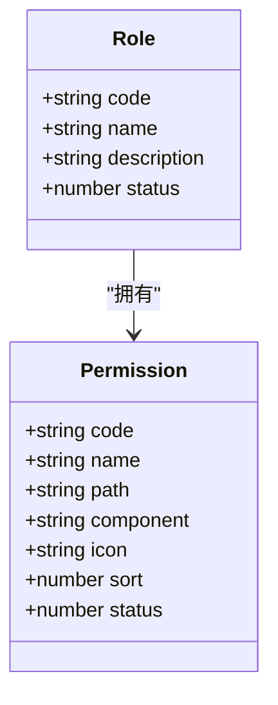
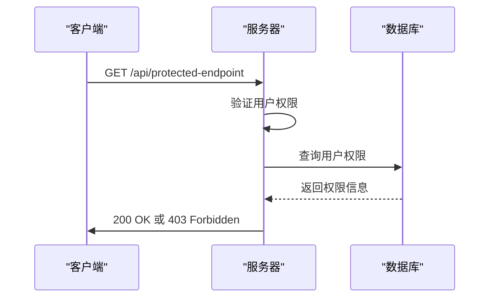
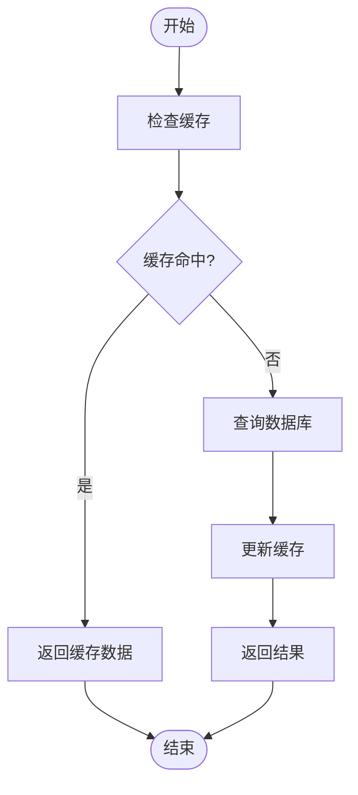

# 权限调试

<cite>
**本文档引用文件**  
- [permissions.ts](file://k.yyup.com/backup/permission-system/permissions.ts)
- [permission-cache.service.ts](file://k.yyup.com/backup/permission-system/permission-cache.service.ts)
- [permission-cache.controller.ts](file://k.yyup.com/backup/permission-system/permission-cache.controller.ts)
- [permission.ts](file://k.yyup.com/client/src/api/modules/permission.ts)
- [auth-permissions.ts](file://k.yyup.com/client/src/api/modules/auth-permissions.ts)
- [permission.guard.ts](file://k.yyup.com/client/src/guards/permission.guard.ts)
- [permission.ts](file://k.yyup.com/client/src/directives/permission.ts)
- [permissions.ts](file://k.yyup.com/client/src/stores/permissions.ts)
</cite>

## 目录
1. [引言](#引言)
2. [权限系统架构](#权限系统架构)
3. [用户权限分配验证](#用户权限分配验证)
4. [角色与权限映射调试](#角色与权限映射调试)
5. [菜单权限检查](#菜单权限检查)
6. [API权限验证](#api权限验证)
7. [页面访问权限调试](#页面访问权限调试)
8. [权限缓存调试技巧](#权限缓存调试技巧)
9. [权限继承与边界问题](#权限继承与边界问题)
10. [权限验证失败分析](#权限验证失败分析)
11. [常见配置错误与修复](#常见配置错误与修复)

## 引言

k.yyupgame系统的权限调试指南旨在为开发人员和系统管理员提供一套完整的RBAC（基于角色的访问控制）系统调试方法。本指南详细介绍了如何验证用户权限分配的正确性，调试角色与权限的映射关系，以及检查菜单权限、API权限和页面访问权限的步骤。通过本指南，用户可以有效地诊断和解决权限系统中的各种问题，确保系统的安全性和功能性。

## 权限系统架构

k.yyupgame的权限系统采用多层架构设计，包括前端权限管理、后端权限验证和缓存机制。前端通过Pinia store管理权限状态，后端通过Redis缓存提高权限验证的性能。

**Diagram sources**
- [permissions.ts](file://k.yyup.com/client/src/stores/permissions.ts)
- [permission-cache.service.ts](file://k.yyup.com/backup/permission-system/permission-cache.service.ts)

## 用户权限分配验证

验证用户权限分配的正确性是权限调试的基础。通过调用`getUserPermissions` API，可以获取用户的权限列表，并与预期的权限进行对比。

**Section sources**
- [auth-permissions.ts](file://k.yyup.com/client/src/api/modules/auth-permissions.ts)
- [permissions.ts](file://k.yyup.com/client/src/stores/permissions.ts)

## 角色与权限映射调试

角色与权限的映射关系是RBAC系统的核心。通过`getRolePermissions`方法，可以获取特定角色的权限列表，并验证其正确性。

**Diagram sources**
- [permission-cache.service.ts](file://k.yyup.com/backup/permission-system/permission-cache.service.ts)

## 菜单权限检查

菜单权限检查确保用户只能看到其有权限访问的菜单项。通过`getUserMenu` API获取用户的菜单列表，并在前端进行渲染。

**Section sources**
- [auth-permissions.ts](file://k.yyup.com/client/src/api/modules/auth-permissions.ts)
- [permissions.ts](file://k.yyup.com/client/src/stores/permissions.ts)

## API权限验证

API权限验证通过`checkPermission` API实现，确保用户只能访问其有权限的API端点。

**Diagram sources**
- [auth-permissions.ts](file://k.yyup.com/client/src/api/modules/auth-permissions.ts)
- [permission-cache.service.ts](file://k.yyup.com/backup/permission-system/permission-cache.service.ts)

## 页面访问权限调试

页面访问权限调试通过路由守卫实现，确保用户只能访问其有权限的页面。

**Section sources**
- [permission.guard.ts](file://k.yyup.com/client/src/guards/permission.guard.ts)
- [permissions.ts](file://k.yyup.com/client/src/stores/permissions.ts)

## 权限缓存调试技巧

权限缓存是提高系统性能的关键。通过`PermissionCacheController`，可以手动刷新权限缓存，查看缓存状态和统计信息。

**Diagram sources**
- [permission-cache.controller.ts](file://k.yyup.com/backup/permission-system/permission-cache.controller.ts)
- [permission-cache.service.ts](file://k.yyup.com/backup/permission-system/permission-cache.service.ts)

## 权限继承与边界问题

权限继承允许用户继承父路径的权限，简化权限管理。通过`checkPagePermission`方法，可以实现权限继承。

**Section sources**
- [permissions.ts](file://k.yyup.com/client/src/stores/permissions.ts)

## 权限验证失败分析

权限验证失败可能由多种原因引起，包括权限配置错误、缓存问题和角色映射错误。通过日志和调试工具，可以定位和解决这些问题。

**Section sources**
- [permissions.ts](file://k.yyup.com/client/src/stores/permissions.ts)
- [permission-cache.service.ts](file://k.yyup.com/backup/permission-system/permission-cache.service.ts)

## 常见配置错误与修复

常见的配置错误包括权限代码错误、角色映射错误和缓存配置错误。通过仔细检查配置文件和日志，可以快速修复这些问题。

**Section sources**
- [permission.ts](file://k.yyup.com/client/src/api/modules/permission.ts)
- [permission-cache.service.ts](file://k.yyup.com/backup/permission-system/permission-cache.service.ts)