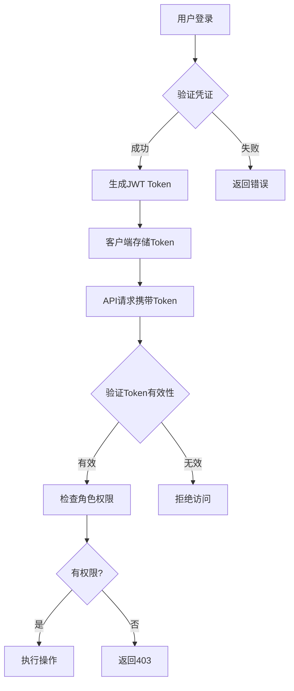

# 调试技巧

<cite>
**本文档引用的文件**  
- [package.json](file://k.yyup.com/package.json)
- [.env.development](file://k.yyup.com/.env.development)
- [.env.production](file://k.yyup.com/.env.production)
- [tsconfig.json](file://k.yyup.com/tsconfig.json)
- [cache-invalidation.middleware.ts](file://k.yyup.com/backup/permission-system/cache-invalidation.middleware.ts)
- [permission-cache.controller.ts](file://k.yyup.com/backup/permission-system/permission-cache.controller.ts)
- [BatchImportConfirmDialog.vue](file://k.yyup.com/BatchImportConfirmDialog.vue)
- [ai-chat-interface-fixed.vue](file://k.yyup.com/ai-chat-interface-fixed.vue)
- [client/aimobile/App.vue](file://k.yyup.com/client/aimobile/App.vue)
- [server](file://k.yyup.com/server)
- [client](file://k.yyup.com/client)
</cite>

## 目录
1. [简介](#简介)
2. [前端调试技巧](#前端调试技巧)
3. [后端调试方法](#后端调试方法)
4. [权限系统调试指南](#权限系统调试指南)
5. [主题与样式调试技巧](#主题与样式调试技巧)
6. [API调试步骤](#api调试步骤)
7. [常见Bug排查思路](#常见bug排查思路)
8. [总结](#总结)

## 简介
本文档为k.yyupgame项目提供全面的调试技巧指南，涵盖前后端调试、权限系统验证、主题样式调试及API调试等方面。通过系统化的调试方法和工具使用说明，帮助开发人员快速定位并解决各类问题。

## 前端调试技巧

### Vue DevTools使用
Vue DevTools是调试Vue应用的核心工具。在k.yyupgame项目中，可通过浏览器扩展安装Vue DevTools，实时查看组件树、状态变化和事件流。对于使用Vue 3的项目，确保使用支持Composition API的最新版本。

### 组件状态跟踪
利用Vue DevTools的组件面板，可以深入查看每个组件的props、data、computed属性和响应式状态。特别关注`client/aimobile`目录下的移动端组件，如`MobileAiAssistant.vue`和`MobileSidebar.vue`，这些组件的状态管理对用户体验至关重要。

### API请求监控
通过浏览器开发者工具的Network面板监控所有API请求。重点关注请求头中的认证信息（如JWT Token）、请求参数和响应数据结构。结合`VITE_API_BASE_URL`环境变量配置，确保开发与生产环境的API调用正确无误。

**Section sources**
- [client/aimobile/App.vue](file://k.yyup.com/client/aimobile/App.vue)
- [ai-chat-interface-fixed.vue](file://k.yyup.com/ai-chat-interface-fixed.vue)
- [BatchImportConfirmDialog.vue](file://k.yyup.com/BatchImportConfirmDialog.vue)

## 后端调试方法

### Node.js调试器配置
在`package.json`中配置了多种调试脚本，如`dev:backend:compile`和`dev:backend`，可通过`npm run dev:backend`启动带热重载的后端服务。结合VS Code的调试配置，设置断点进行逐步调试。

### Express中间件调试
后端使用Express框架，中间件的执行顺序和逻辑是调试重点。通过添加日志输出或使用`debug`模块，在关键中间件中打印请求和响应信息，帮助追踪请求处理流程。

### 数据库查询分析
项目提供了数据库优化脚本，如`db:slow-queries`用于检测慢查询，`db:indexes`用于优化索引。通过`sequelize` ORM的日志功能，可查看生成的SQL语句，分析查询性能瓶颈。

**Section sources**
- [package.json](file://k.yyup.com/package.json)
- [server](file://k.yyup.com/server)

## 权限系统调试指南

### 用户权限验证
权限系统通过JWT Token进行身份验证。在`.env.development`文件中配置了测试用的`JWT_TOKEN`，可用于模拟不同角色的用户登录。通过解析Token内容，验证用户ID、角色和过期时间等信息。

### 角色分配检查
系统采用基于角色的访问控制（RBAC），角色权限变更会触发缓存失效机制。查看`cache-invalidation.middleware.ts`中的日志输出，确认角色变更时相关缓存是否被正确清除。

### 访问控制测试
通过`permission-cache.controller.ts`提供的管理接口，可手动刷新权限缓存。测试不同角色用户对敏感接口的访问权限，确保权限控制策略正确执行。

**Diagram sources**
- [cache-invalidation.middleware.ts](file://k.yyup.com/backup/permission-system/cache-invalidation.middleware.ts)
- [permission-cache.controller.ts](file://k.yyup.com/backup/permission-system/permission-cache.controller.ts)

**Section sources**
- [cache-invalidation.middleware.ts](file://k.yyup.com/backup/permission-system/cache-invalidation.middleware.ts)
- [permission-cache.controller.ts](file://k.yyup.com/backup/permission-system/permission-cache.controller.ts)
- [.env.development](file://k.yyup.com/.env.development)

## 主题与样式调试技巧

### CSS变量检查
项目使用CSS变量实现主题切换。通过浏览器开发者工具的Elements面板，查看`:root`或组件上的CSS变量定义，确保主题相关的颜色、间距等变量正确应用。

### 响应式布局测试
利用浏览器的设备模拟功能，测试不同屏幕尺寸下的布局表现。重点关注移动端组件（位于`client/aimobile`目录）的适配情况，确保在各种设备上都有良好的用户体验。

**Section sources**
- [client/aimobile](file://k.yyup.com/client/aimobile)

## API调试步骤

### 请求参数验证
使用Postman或curl工具，构造包含各种边界条件的请求参数，测试API的输入验证逻辑。参考`package.json`中的测试脚本，如`test:api`，自动化执行API测试用例。

### 响应数据检查
对比API响应数据与预期结构，确保字段名称、数据类型和嵌套层次正确。对于分页接口，验证页码、每页数量和总记录数的准确性。

### 错误处理分析
故意发送非法请求，观察API返回的错误码和错误信息。确保4xx和5xx错误状态码使用恰当，错误信息对开发者友好且不泄露敏感信息。

**Section sources**
- [package.json](file://k.yyup.com/package.json)
- [server](file://k.yyup.com/server)

## 常见Bug排查思路

### 环境变量问题
当功能在开发环境正常但在生产环境异常时，首先检查`.env.production`与`.env.development`的差异。确保所有必要的环境变量都已正确配置。

### 缓存相关问题
权限或数据更新后未及时生效，可能是缓存未正确失效。查看`cache-invalidation.middleware.ts`中的日志，确认缓存清除逻辑是否触发。

### 跨域请求失败
检查`cors`中间件配置，确保预检请求（OPTIONS）被正确处理。验证`VITE_WS_URL`等跨域相关的环境变量设置。

### 构建问题
当出现类型错误或模块找不到时，运行`npm run typecheck`进行类型检查，或执行`npm run clean`后重新安装依赖。

## 总结
本指南系统地介绍了k.yyupgame项目的调试方法，从前端Vue组件调试到后端Node.js服务调试，从权限系统验证到API测试，为开发人员提供了全面的调试支持。通过合理运用这些技巧，可显著提高问题定位和解决的效率。