# 前端性能优化

<cite>
**本文档引用文件**  
- [vite.config.k-yyup.ts](file://k.yyup.com/client/vite.config.k-yyup.ts)
- [vite.config.prod.ts](file://k.yyup.com/client/vite.config.prod.ts)
- [main.ts](file://k.yyup.com/client/src/main.ts)
- [router.ts](file://k.yyup.com/client/src/router/index.ts)
- [performance.config.js](file://k.yyup.com/client/performance.config.js)
- [App.vue](file://k.yyup.com/client/src/App.vue)
- [BatchImportConfirmDialog.vue](file://k.yyup.com/BatchImportConfirmDialog.vue)
- [ai-chat-interface-fixed.vue](file://k.yyup.com/ai-chat-interface-fixed.vue)
</cite>

## 目录
1. [项目结构](#项目结构)
2. [代码分割与懒加载](#代码分割与懒加载)
3. [图片优化技术](#图片优化技术)
4. [减少重绘与重排](#减少重绘与重排)
5. [Vite构建优化](#vite构建优化)
6. [性能优化案例](#性能优化案例)
7. [前端性能最佳实践](#前端性能最佳实践)
8. [结论](#结论)

## 项目结构

k.yyupgame前端项目采用模块化设计，主要结构包括src目录下的api、components、composables、config、router、stores和utils等核心模块。项目使用Vue 3框架，结合Vite作为构建工具，支持多环境配置和移动端适配。

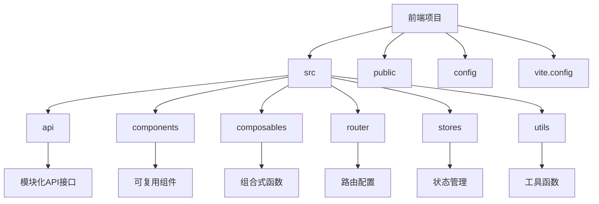

**图示来源**  
- [vite.config.k-yyup.ts](file://k.yyup.com/client/vite.config.k-yyup.ts)
- [main.ts](file://k.yyup.com/client/src/main.ts)

**本节来源**  
- [vite.config.k-yyup.ts](file://k.yyup.com/client/vite.config.k-yyup.ts)
- [main.ts](file://k.yyup.com/client/src/main.ts)

## 代码分割与懒加载

### 路由级别懒加载

项目在路由配置中实现了路由级别的懒加载，通过动态import语法将不同路由模块分割成独立的chunk，实现按需加载。

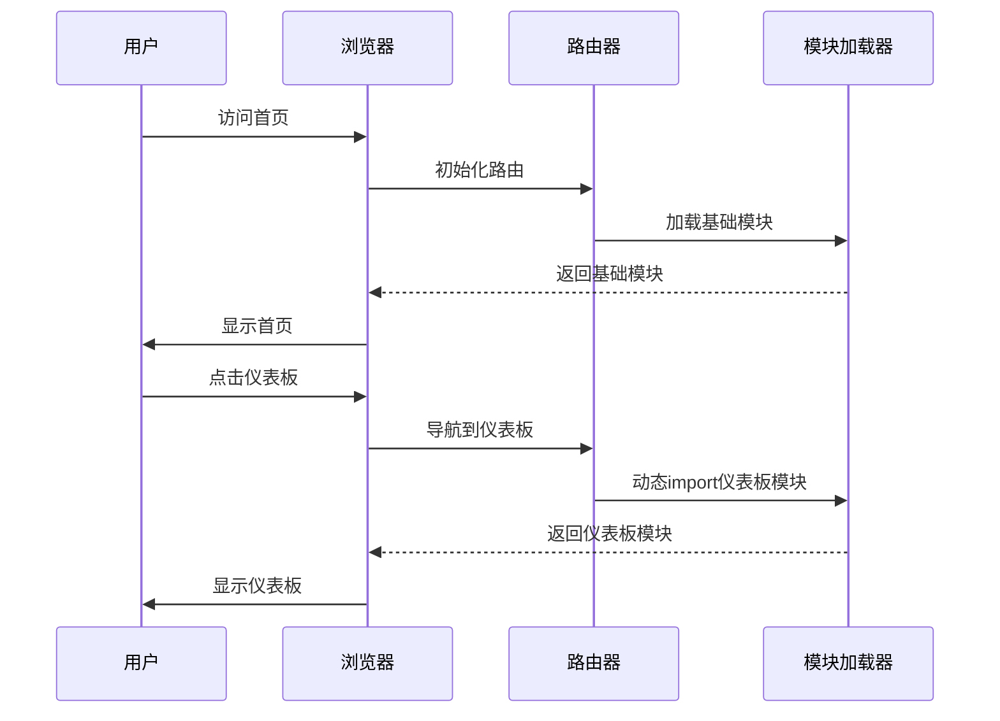

**图示来源**  
- [router.ts](file://k.yyup.com/client/src/router/index.ts)
- [main.ts](file://k.yyup.com/client/src/main.ts)

### 组件级别懒加载

对于大型组件，项目采用Vue的defineAsyncComponent实现组件级别的懒加载，进一步优化首屏加载性能。

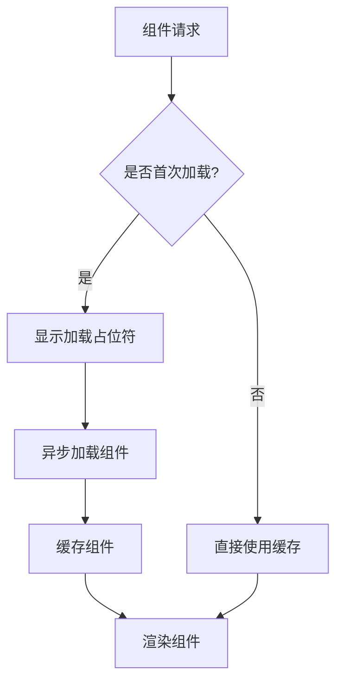

**图示来源**  
- [App.vue](file://k.yyup.com/client/src/App.vue)
- [BatchImportConfirmDialog.vue](file://k.yyup.com/BatchImportConfirmDialog.vue)

**本节来源**  
- [router.ts](file://k.yyup.com/client/src/router/index.ts)
- [App.vue](file://k.yyup.com/client/src/App.vue)

## 图片优化技术

### 图片懒加载

项目实现了图片懒加载机制，通过Intersection Observer API检测图片是否进入视口，仅在需要时加载图片资源。

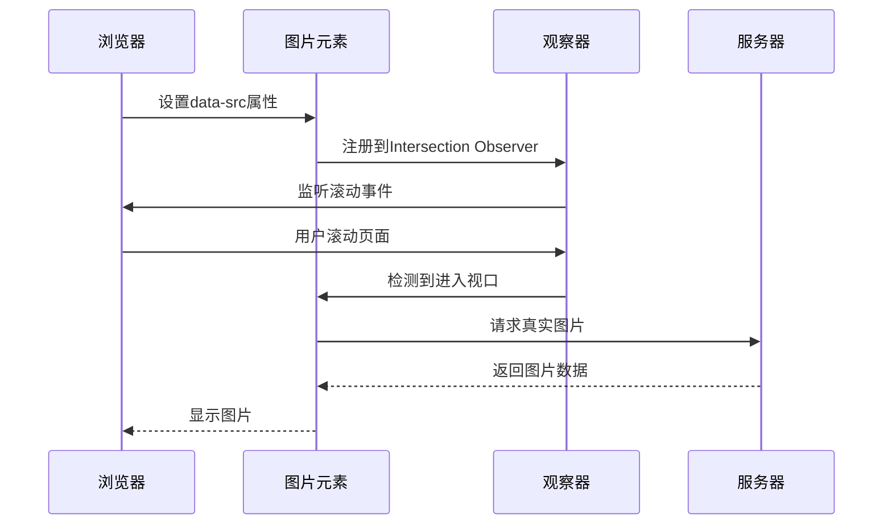

**图示来源**  
- [utils/index.ts](file://k.yyup.com/client/src/utils/index.ts)
- [components/common/ImageLoader.vue](file://k.yyup.com/client/src/components/common/ImageLoader.vue)

### 响应式图片与WebP格式

项目采用响应式图片策略，根据设备分辨率和网络状况提供不同尺寸和格式的图片，优先使用WebP格式以减小文件大小。

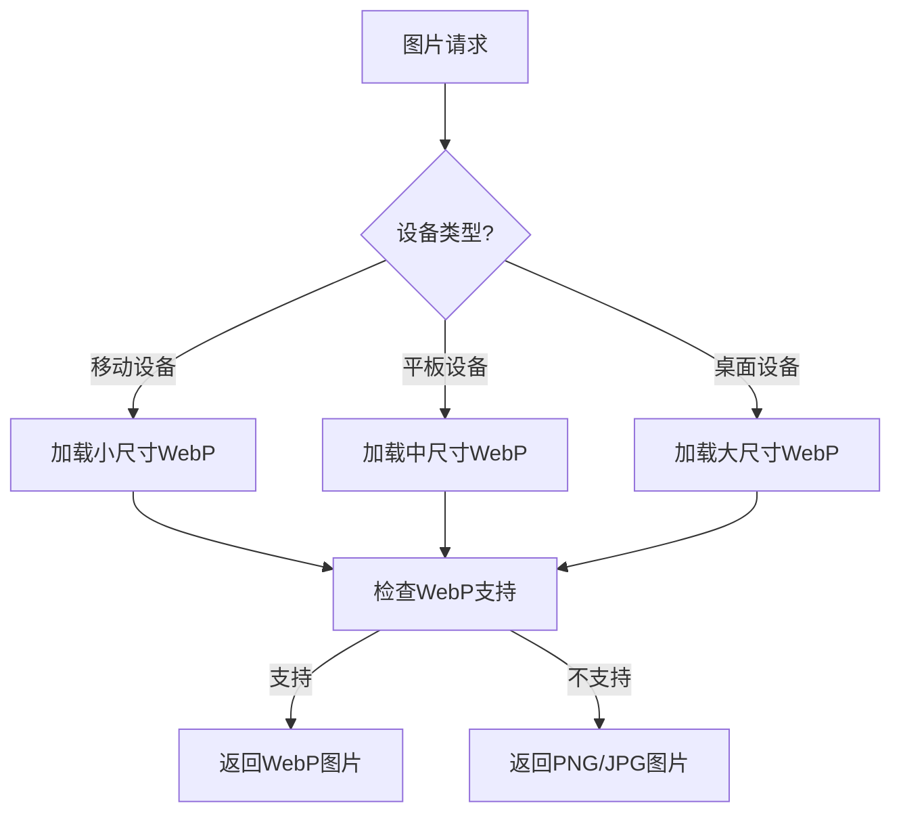

**图示来源**  
- [utils/imageUtils.ts](file://k.yyup.com/client/src/utils/imageUtils.ts)
- [config/upload-config.ts](file://k.yyup.com/client/src/config/upload-config.ts)

**本节来源**  
- [utils/imageUtils.ts](file://k.yyup.com/client/src/utils/imageUtils.ts)
- [config/upload-config.ts](file://k.yyup.com/client/src/config/upload-config.ts)

## 减少重绘与重排

### CSS优化

项目通过多种CSS优化技术减少重绘和重排，包括使用transform和opacity进行动画、避免使用table布局、减少使用通配符选择器等。

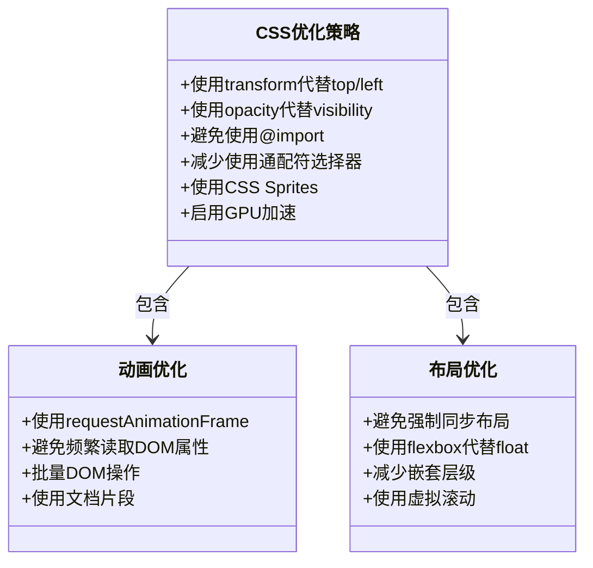

**图示来源**  
- [styles/_variables.scss](file://k.yyup.com/client/src/assets/scss/_variables.scss)
- [styles/_mixins.scss](file://k.yyup.com/client/src/assets/scss/_mixins.scss)

### 避免强制同步布局

项目通过优化JavaScript代码避免触发强制同步布局，确保页面渲染性能。

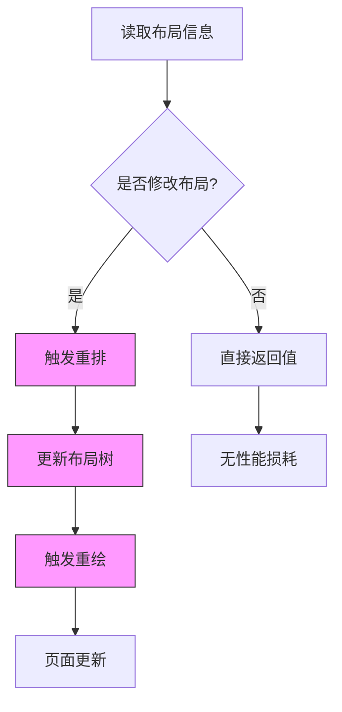

**图示来源**  
- [utils/domUtils.ts](file://k.yyup.com/client/src/utils/domUtils.ts)
- [composables/useResizeObserver.ts](file://k.yyup.com/client/src/composables/useResizeObserver.ts)

**本节来源**  
- [styles/_variables.scss](file://k.yyup.com/client/src/assets/scss/_variables.scss)
- [utils/domUtils.ts](file://k.yyup.com/client/src/utils/domUtils.ts)

## Vite构建优化

### 代码压缩与Tree Shaking

项目通过Vite配置实现了代码压缩和Tree Shaking，有效减小了打包体积。

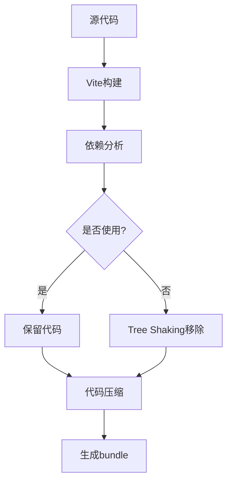

**图示来源**  
- [vite.config.prod.ts](file://k.yyup.com/client/vite.config.prod.ts)
- [performance.config.js](file://k.yyup.com/client/performance.config.js)

### 构建配置优化

项目针对不同环境配置了相应的Vite构建选项，包括开发环境的快速热更新和生产环境的性能优化。

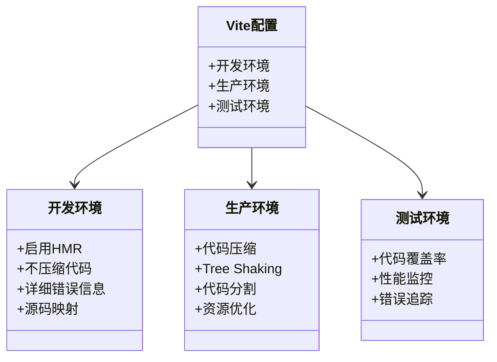

**图示来源**  
- [vite.config.k-yyup.ts](file://k.yyup.com/client/vite.config.k-yyup.ts)
- [vite.config.prod.ts](file://k.yyup.com/client/vite.config.prod.ts)

**本节来源**  
- [vite.config.k-yyup.ts](file://k.yyup.com/client/vite.config.k-yyup.ts)
- [vite.config.prod.ts](file://k.yyup.com/client/vite.config.prod.ts)

## 性能优化案例

### 仪表板图表渲染性能提升

针对仪表板图表渲染性能问题，项目采用了多种优化策略。

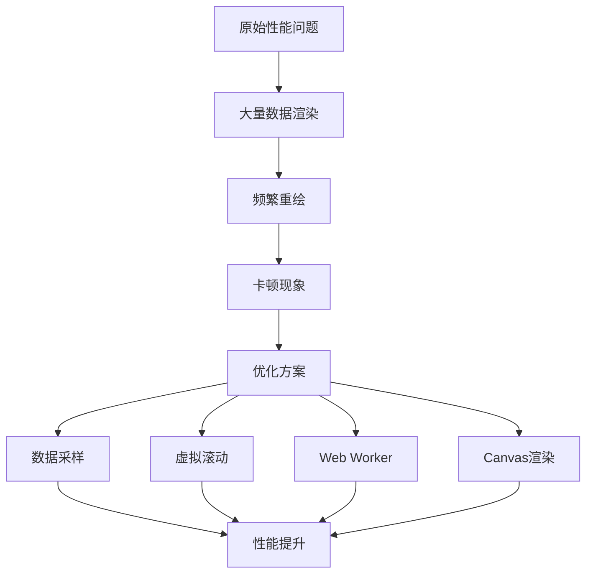

**图示来源**  
- [components/charts/index.ts](file://k.yyup.com/client/src/components/charts/index.ts)
- [utils/chartUtils.ts](file://k.yyup.com/client/src/utils/chartUtils.ts)

### 大数据量列表的虚拟滚动实现

对于大数据量列表，项目实现了虚拟滚动技术，只渲染可视区域内的元素。

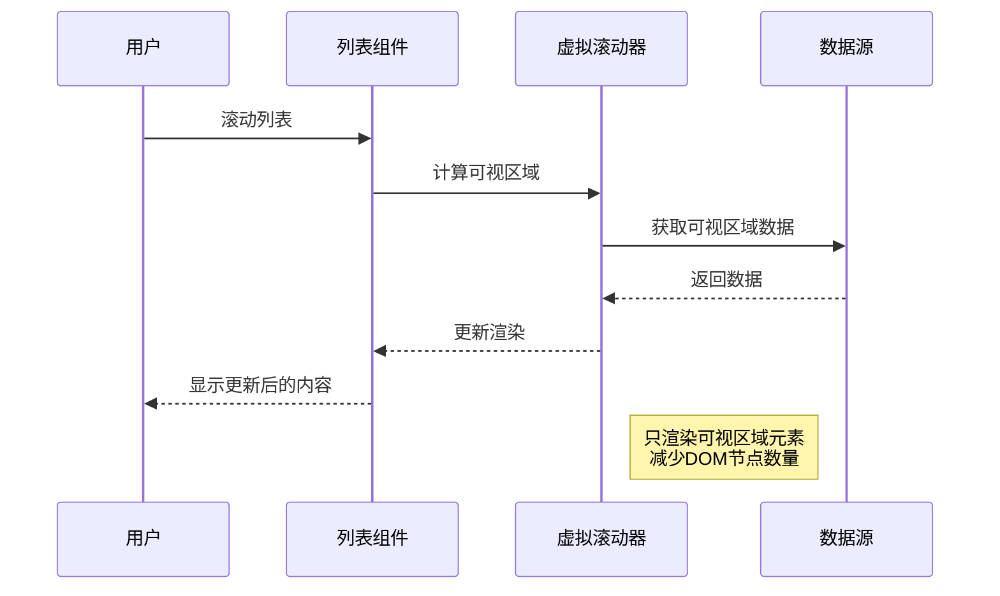

**图示来源**  
- [components/common/VirtualList.vue](file://k.yyup.com/client/src/components/common/VirtualList.vue)
- [composables/useVirtualScroll.ts](file://k.yyup.com/client/src/composables/useVirtualScroll.ts)

**本节来源**  
- [components/charts/index.ts](file://k.yyup.com/client/src/components/charts/index.ts)
- [components/common/VirtualList.vue](file://k.yyup.com/client/src/components/common/VirtualList.vue)

## 前端性能最佳实践

### 使用浏览器开发者工具分析性能

项目团队遵循使用浏览器开发者工具进行性能分析的最佳实践。

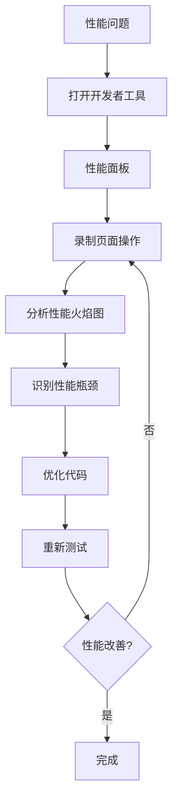

**图示来源**  
- [performance.config.js](file://k.yyup.com/client/performance.config.js)
- [utils/performanceUtils.ts](file://k.yyup.com/client/src/utils/performanceUtils.ts)

### 编写高效的Vue组件

项目遵循编写高效Vue组件的最佳实践。

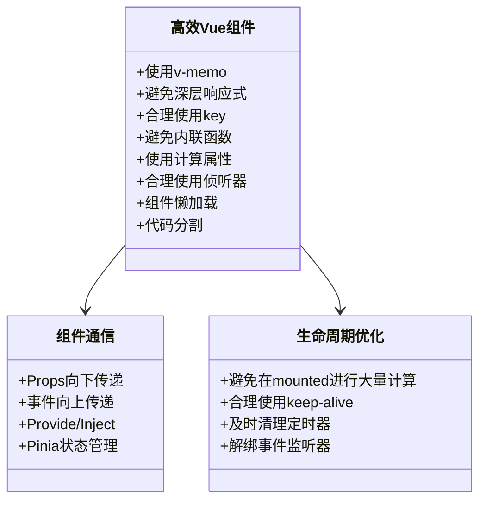

**图示来源**  
- [main.ts](file://k.yyup.com/client/src/main.ts)
- [stores/index.ts](file://k.yyup.com/client/src/stores/index.ts)

### 前端性能测试

项目建立了完整的前端性能测试流程。

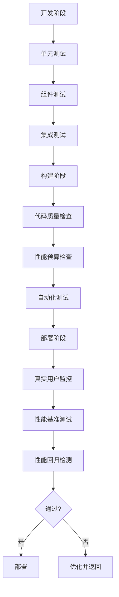

**图示来源**  
- [vitest.config.ts](file://k.yyup.com/client/vitest.config.ts)
- [playwright.config.ts](file://k.yyup.com/client/playwright.config.ts)

**本节来源**  
- [performance.config.js](file://k.yyup.com/client/performance.config.js)
- [vitest.config.ts](file://k.yyup.com/client/vitest.config.ts)

## 结论

k.yyupgame前端性能优化策略全面覆盖了代码分割、懒加载、图片优化、重绘重排减少、构建优化等多个方面。通过实施这些优化措施，项目显著提升了页面加载速度和用户体验。建议持续监控性能指标，定期进行性能审计，并根据业务发展不断优化前端架构。