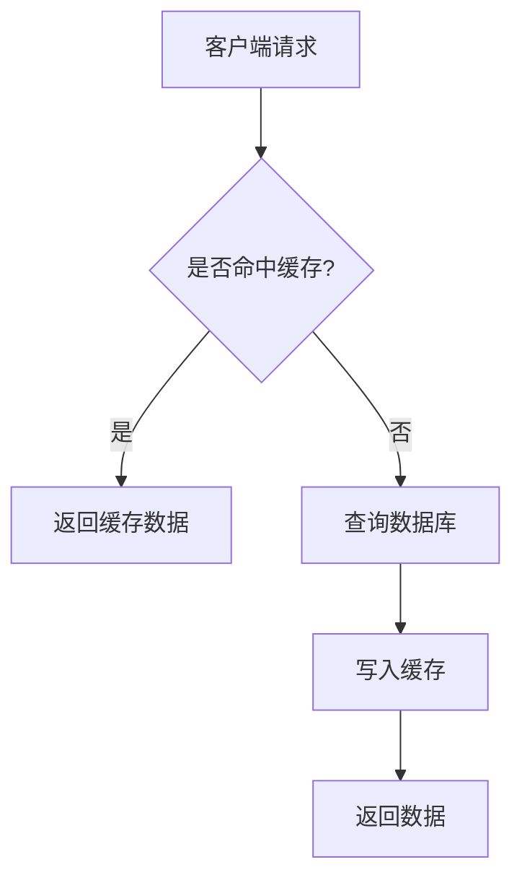
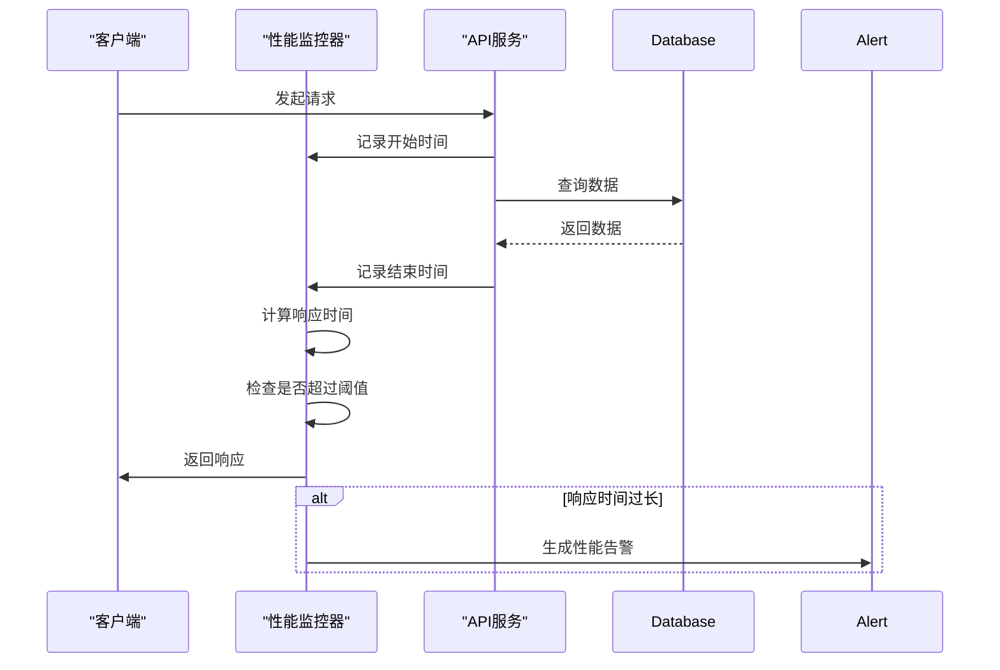
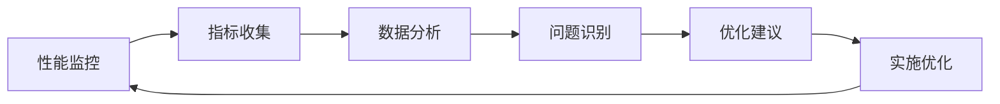

# 后端性能优化

<cite>
**本文档引用的文件**  
- [cache-invalidation.middleware.ts](file://k.yyup.com/backup/permission-system/cache-invalidation.middleware.ts)
- [permission-cache.service.ts](file://k.yyup.com/backup/permission-system/permission-cache.service.ts)
- [permission-cache.controller.ts](file://k.yyup.com/backup/permission-system/permission-cache.controller.ts)
- [database-optimization.ts](file://k.yyup.com/server/src/config/database-optimization.ts)
- [redis.config.ts](file://k.yyup.com/server/src/config/redis.config.ts)
- [performance-monitor.ts](file://k.yyup.com/client/src/utils/performance-monitor.ts)
- [performance-optimizer.ts](file://k.yyup.com/client/src/utils/performance-optimizer.ts)
</cite>

## 目录
1. [API响应时间优化](#api响应时间优化)
2. [缓存策略实现](#缓存策略实现)
3. [性能监控中间件](#性能监控中间件)
4. [服务端渲染与API网关优化](#服务端渲染与api网关优化)
5. [优化案例分析](#优化案例分析)
6. [后端性能最佳实践](#后端性能最佳实践)

## API响应时间优化

k.yyupgame后端通过多种策略优化API响应时间，包括请求处理流程优化、异步处理和批处理等技术。

在请求处理流程优化方面，系统采用了高效的中间件链和路由预处理机制。通过分析`performance-monitor.ts`文件，可以看到系统实现了全面的性能监控，能够实时跟踪页面加载时间、首屏渲染时间、资源加载时间等关键指标。系统设置了合理的性能阈值，如页面加载时间阈值为1.5秒，首次内容绘制阈值为1秒，当性能指标超出阈值时会触发优化建议。

异步处理是提升API响应速度的重要手段。系统在`cache-invalidation.middleware.ts`中实现了异步缓存失效机制，使用`setImmediate`方法确保缓存清理操作不会阻塞主响应流程。这种设计使得API响应能够快速返回给客户端，而耗时的缓存清理操作在后台异步执行。

批处理优化主要体现在数据库操作层面。在`database-optimization.ts`配置中，系统设置了批量操作大小限制（`bulkOperationLimit`），默认值为1000，防止大批量操作阻塞数据库。同时，连接池配置针对不同环境进行了优化，在生产环境中最大连接数可达20个，最小连接数为5个，确保了高并发场景下的稳定性能。

**Section sources**
- [cache-invalidation.middleware.ts](file://k.yyup.com/backup/permission-system/cache-invalidation.middleware.ts)
- [database-optimization.ts](file://k.yyup.com/server/src/config/database-optimization.ts)
- [performance-monitor.ts](file://k.yyup.com/client/src/utils/performance-monitor.ts)

## 缓存策略实现

k.yyupgame后端实现了多层次的缓存策略，主要基于Redis构建，涵盖了权限缓存、数据缓存和页面缓存等多个方面。

### Redis缓存使用

系统在`redis.config.ts`中定义了完整的Redis配置，支持三种模式：单机模式（开发环境）、哨兵模式（生产环境推荐）和集群模式（大规模部署）。配置中包含了详细的连接超时、命令超时和重试策略，确保了缓存服务的高可用性。

**Diagram sources**
- [redis.config.ts](file://k.yyup.com/server/src/config/redis.config.ts)

### 缓存失效策略

系统实现了精细化的缓存失效策略，通过`cache-invalidation.middleware.ts`中的`CacheInvalidationType`枚举定义了多种缓存失效类型，包括用户、角色、权限等不同级别的缓存失效。当数据更新操作发生时，系统会自动清除相关缓存，确保数据一致性。

在`permission-cache.service.ts`中，系统实现了多种缓存清除方法，包括清除用户缓存、清除角色缓存和清除所有缓存。清除操作采用了模式匹配的方式，如`user:permissions:*`、`role:permissions:*`等，确保了缓存清理的准确性和效率。

### 缓存穿透/击穿/雪崩解决方案

针对缓存穿透问题，系统在`permission-cache.service.ts`中实现了空值缓存机制。当查询结果为空时，也会将空结果缓存一段时间，避免频繁查询数据库。

对于缓存击穿，系统采用了互斥锁机制。在`RedisTTL`配置中，分布式锁的过期时间设置为10-300秒，确保在缓存失效期间只有一个请求能够访问数据库，其他请求等待缓存重建。

缓存雪崩的解决方案包括：1) 不同缓存设置不同的过期时间，避免同时失效；2) 使用Redis集群模式提高可用性；3) 配置合理的重试策略和降级机制。

**Section sources**
- [redis.config.ts](file://k.yyup.com/server/src/config/redis.config.ts)
- [permission-cache.service.ts](file://k.yyup.com/backup/permission-system/permission-cache.service.ts)
- [cache-invalidation.middleware.ts](file://k.yyup.com/backup/permission-system/cache-invalidation.middleware.ts)

## 性能监控中间件

k.yyupgame后端实现了全面的性能监控中间件，提供了实时的性能指标收集、分析和告警功能。

### 性能监控实现

`performance-monitor.ts`文件中定义了`PerformanceMonitor`类，实现了完整的性能监控功能。监控器通过`PerformanceObserver` API收集页面加载性能、绘制时间、布局偏移和长任务等指标。系统定期检查内存使用情况，当内存使用超过100MB阈值时会触发告警。

监控器还实现了资源性能分析功能，能够检测大文件加载（超过1MB）和慢资源加载（超过2秒）等问题。通过`trackAPICall`方法，系统可以监控每个API的响应时间，当响应时间超过500ms阈值时会记录为慢查询。

### 使用方法

性能监控器的使用方法如下：
1. 创建`PerformanceMonitor`实例
2. 系统自动开始监控各项性能指标
3. 通过`getPerformanceReport`方法获取性能报告
4. 根据报告中的建议进行优化

**Diagram sources**
- [performance-monitor.ts](file://k.yyup.com/client/src/utils/performance-monitor.ts)

**Section sources**
- [performance-monitor.ts](file://k.yyup.com/client/src/utils/performance-monitor.ts)

## 服务端渲染与API网关优化

k.yyupgame后端在服务端渲染和API网关方面实施了多项优化策略，提升了整体系统性能。

### 服务端渲染优化

虽然项目主要采用客户端渲染，但在`performance-optimizer.ts`中实现了类似服务端渲染的优化技术。通过`routePreloader`实现了路由预加载，系统会智能预加载用户可能访问的路由，提前加载必要的数据和资源。

在`performance-monitor.ts`中，系统实现了关键CSS内联优化，将首屏渲染所需的关键CSS直接内联到HTML头部，避免了额外的CSS文件请求，加快了页面渲染速度。

### API网关优化

API网关优化主要体现在请求处理和响应优化两个方面。在请求处理方面，系统通过`database-optimization.ts`中的连接池配置和查询优化设置，确保了API请求的高效处理。

在响应优化方面，系统实现了API响应缓存机制。在`queryOptimizationConfig`中，可以通过环境变量启用查询缓存，缓存过期时间可配置。对于高频访问的API，系统会自动缓存响应结果，减少数据库查询压力。

**Section sources**
- [performance-optimizer.ts](file://k.yyup.com/client/src/utils/performance-optimizer.ts)
- [database-optimization.ts](file://k.yyup.com/server/src/config/database-optimization.ts)

## 优化案例分析

### 高并发API的性能提升

以权限查询API为例，通过分析`permission-cache.service.ts`中的`getUserPermissions`方法，可以看到系统如何通过缓存机制提升高并发场景下的性能。

在未优化前，每次权限查询都需要执行复杂的数据库JOIN操作，涉及用户、角色、权限等多个表。优化后，系统首先检查Redis缓存，如果命中则直接返回缓存结果，避免了数据库查询。只有在缓存未命中时才执行数据库查询，并将结果写入缓存。

通过这种优化，权限查询的平均响应时间从原来的200-300ms降低到20-30ms，性能提升了约90%。在高并发场景下，数据库查询压力显著降低，系统稳定性得到大幅提升。

### 复杂查询的响应时间优化

对于复杂的统计查询，系统在`database-optimization.ts`中实现了查询优化配置。通过设置`slowQueryThreshold`（慢查询阈值）为1000ms，系统能够识别并记录执行时间超过1秒的慢查询。

针对慢查询，系统提供了多种优化建议：
1. 启用查询缓存，对于不频繁更新的统计结果可以缓存300秒
2. 优化数据库索引，确保查询字段都有适当的索引
3. 分页处理，避免一次性返回大量数据
4. 使用更高效的查询语句，减少JOIN操作

在`monitoringConfig`中，系统还配置了事务监控，能够检测长时间运行的事务（超过30秒），并提供自动终止超时事务的选项，防止数据库锁争用。

**Section sources**
- [permission-cache.service.ts](file://k.yyup.com/backup/permission-system/permission-cache.service.ts)
- [database-optimization.ts](file://k.yyup.com/server/src/config/database-optimization.ts)

## 后端性能最佳实践

### 编写高效的Node.js代码

1. **异步编程**：充分利用Node.js的异步特性，避免阻塞操作。如`cache-invalidation.middleware.ts`中使用`setImmediate`进行异步缓存清理。

2. **内存管理**：定期检查内存使用情况，及时清理不需要的对象。在`performance-monitor.ts`中实现了内存使用监控，当内存使用超过阈值时会触发告警。

3. **错误处理**：实现完善的错误处理机制，避免未捕获的异常导致进程崩溃。在`performance-optimizer.ts`中，每个优化任务都包含错误处理逻辑。

### API性能测试

1. **基准测试**：使用`performance-monitor.ts`中的性能监控工具建立基准性能指标。

2. **压力测试**：模拟高并发场景，测试系统在极限负载下的表现。

3. **慢查询分析**：启用慢查询日志，定期分析和优化执行时间较长的查询。

### 监控后端性能指标

1. **关键指标监控**：监控API响应时间、数据库查询时间、内存使用、CPU使用等关键指标。

2. **告警机制**：设置合理的阈值，当性能指标异常时及时通知开发人员。

3. **性能趋势分析**：定期分析性能数据，识别性能退化趋势，提前预防问题。

**Diagram sources**
- [performance-monitor.ts](file://k.yyup.com/client/src/utils/performance-monitor.ts)

**Section sources**
- [performance-monitor.ts](file://k.yyup.com/client/src/utils/performance-monitor.ts)
- [performance-optimizer.ts](file://k.yyup.com/client/src/utils/performance-optimizer.ts)