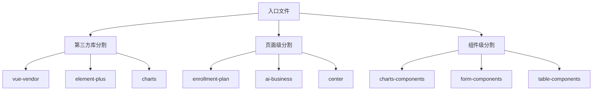
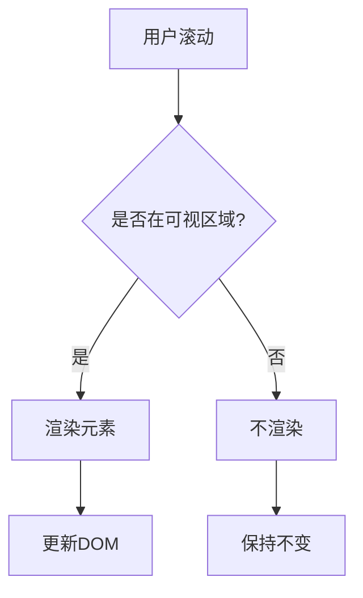
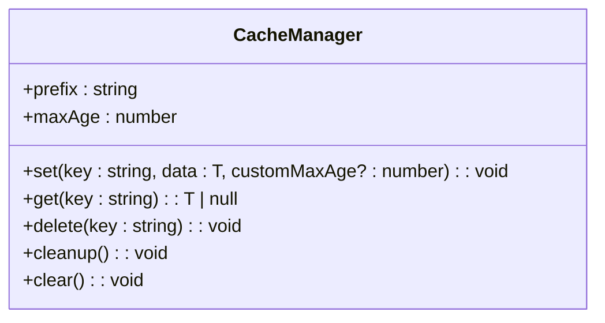
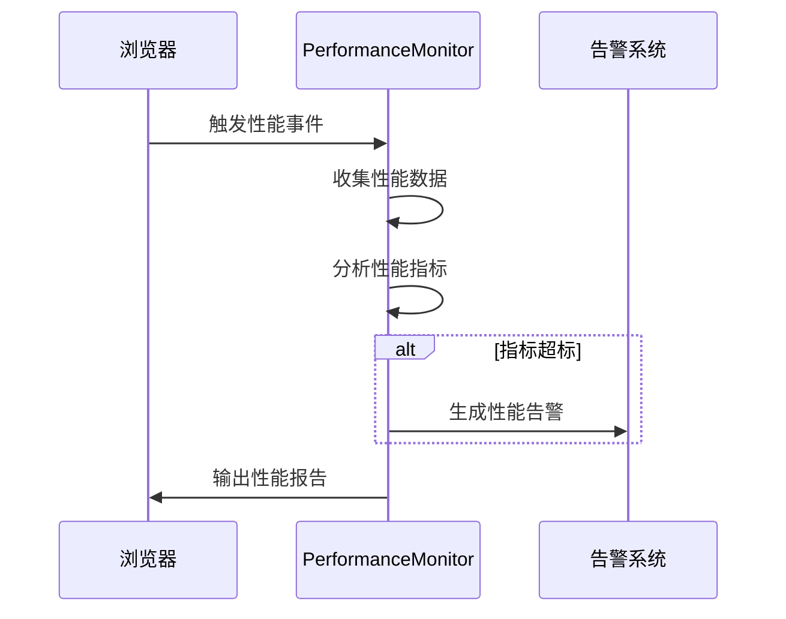
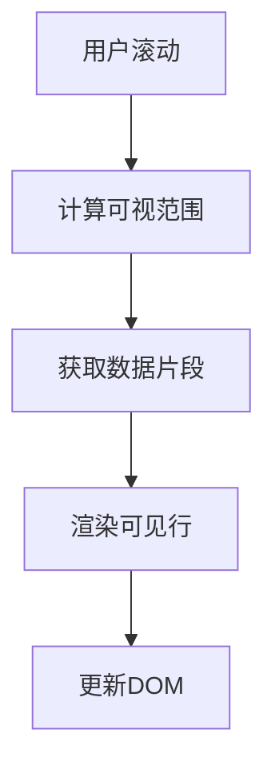

# 性能优化

<cite>
**本文档引用的文件**  
- [performance.config.js](file://client/performance.config.js)
- [performance-monitor.ts](file://client/src/utils/performance-monitor.ts)
- [performance-optimizer.ts](file://client/src/utils/performance-optimizer.ts)
- [mobile-performance.ts](file://client/src/utils/mobile-performance.ts)
- [performance-utils.ts](file://client/src/tests/utils/performance-utils.ts)
- [performance.vue](file://client/src/pages/centers/marketing/performance.vue)
- [marketing-performance.service.ts](file://client/src/services/marketing-performance.service.ts)
</cite>

## 目录
1. [引言](#引言)
2. [前端性能优化策略](#前端性能优化策略)
3. [后端性能优化策略](#后端性能优化策略)
4. [监控与分析工具](#监控与分析工具)
5. [优化案例分析](#优化案例分析)
6. [性能最佳实践](#性能最佳实践)
7. [结论](#结论)

## 引言

本项目k.yyupgame在性能优化方面采用了全面的策略，涵盖了前端、后端以及监控分析等多个维度。通过代码分割、懒加载、图片优化等技术提升前端性能，同时通过数据库查询优化、缓存策略和API响应时间优化来增强后端性能。此外，项目还集成了详细的监控和分析工具，帮助开发者识别性能瓶颈并进行针对性优化。本文档将详细介绍这些优化策略，并提供具体的优化案例和最佳实践建议。

**Section sources**
- [performance.config.js](file://client/performance.config.js)
- [performance-monitor.ts](file://client/src/utils/performance-monitor.ts)

## 前端性能优化策略

### 代码分割与懒加载

项目通过配置文件`performance.config.js`实现了细粒度的代码分割策略。代码分割分为三个层次：第三方库分割、页面级分割和组件级分割。第三方库如Vue、Element Plus、ECharts等被单独打包，以利用长期缓存的优势。页面级分割则针对主要功能模块（如招生计划、AI业务中心等）进行独立打包，减少初始加载体积。组件级分割进一步将图表、表单和表格等通用组件独立打包，实现按需加载。

**Diagram sources**
- [performance.config.js](file://client/performance.config.js#L6-L28)

### 图片优化

图片优化策略包括支持多种现代图片格式（WebP、AVIF）、设置合理的质量参数以及实现懒加载。配置文件中定义了不同格式的质量设置，如WebP为80%，AVIF为75%，确保在保证视觉质量的同时最大限度地减小文件大小。所有图片均启用懒加载，只有当图片进入视口时才开始加载，显著减少了初始页面的加载时间和带宽消耗。

**Section sources**
- [performance.config.js](file://client/performance.config.js#L75-L89)

### 减少重绘重排

为了减少重绘和重排，项目采用了多种技术手段。首先，通过内联关键CSS（inline critical CSS）将首屏渲染所需的样式直接嵌入HTML头部，避免了额外的网络请求。其次，使用虚拟滚动（Virtual Scrolling）处理长列表，只渲染可视区域内的元素，大大降低了DOM节点数量和内存占用。此外，还通过防抖（Debounce）和节流（Throttle）技术优化事件处理，防止高频事件触发导致的性能问题。

**Diagram sources**
- [mobile-performance.ts](file://client/src/utils/mobile-performance.ts#L62-L111)

## 后端性能优化策略

### 数据库查询优化

虽然项目中未直接提供数据库查询优化的具体实现，但通过API接口的设计可以看出对查询性能的关注。例如，在`marketing-performance.service.ts`中，获取转介绍统计数据的API支持分页、排序和过滤参数，允许客户端按需获取数据，避免一次性加载大量数据。此外，API设计中包含了对不同维度（如时间范围、角色、状态等）的筛选，有助于数据库进行索引优化。

**Section sources**
- [marketing-performance.service.ts](file://client/src/services/marketing-performance.service.ts#L6-L14)

### 缓存策略

项目通过`performance-monitor.ts`中的`cacheManager`实现了客户端缓存机制。缓存数据存储在`localStorage`中，并设置了24小时的过期时间。当缓存数据过期后，系统会自动清理。这种策略不仅减少了重复的网络请求，还提高了数据访问速度。同时，缓存管理器在存储数据时会检查`localStorage`的容量，如果空间不足，会先清理过期数据再尝试存储，避免了存储失败的问题。

**Diagram sources**
- [mobile-performance.ts](file://client/src/utils/mobile-performance.ts#L190-L268)

### API响应时间优化

API响应时间优化主要通过请求合并、批处理和缓存机制实现。在`performance-optimizer.ts`中，`optimizeApiRequests`方法专门用于优化API请求，包括实现请求缓存和优化重试机制。此外，`marketing-performance.service.ts`中的API设计支持批量操作，如批量审批奖励，减少了多次网络往返的开销。对于导出报表等耗时操作，API返回`blob`类型的数据，允许浏览器直接处理文件下载，而不必在内存中处理大文件。

**Section sources**
- [performance-optimizer.ts](file://client/src/utils/performance-optimizer.ts#L452-L467)
- [marketing-performance.service.ts](file://client/src/services/marketing-performance.service.ts#L135-L146)

## 监控与分析工具

### 性能监控

项目集成了全面的性能监控系统，通过`PerformanceMonitor`类实现。该系统监控多项核心Web指标，包括首次内容绘制（FCP）、最大内容绘制（LCP）、首次输入延迟（FID）和累积布局偏移（CLS）。当这些指标超过预设阈值时，系统会生成性能告警。监控数据通过`PerformanceObserver` API收集，并定期分析，生成性能评分和优化建议。

**Diagram sources**
- [performance-monitor.ts](file://client/src/utils/performance-monitor.ts#L39-L708)

### 性能分析

性能分析工具集`performance-utils.ts`提供了丰富的测量函数，可用于测试页面加载性能、API响应时间、内存使用等。这些工具支持测量首屏渲染时间、最大内容渲染时间、首次输入延迟等关键指标，并能生成详细的性能报告。通过这些工具，开发者可以在测试环境中模拟不同的网络条件，评估应用在各种情况下的表现。

**Section sources**
- [performance-utils.ts](file://client/src/tests/utils/performance-utils.ts#L1-L652)

## 优化案例分析

### 仪表板页面性能提升

仪表板页面通过多种优化技术实现了显著的性能提升。首先，采用代码分割将仪表板相关的代码独立打包，减少了初始加载体积。其次，关键CSS被内联到HTML头部，确保首屏内容能够快速渲染。此外，仪表板中的图表组件实现了懒加载，只有当用户滚动到相应位置时才开始加载和渲染。最后，通过预加载用户可能访问的下一个页面，进一步提升了用户体验。

**Section sources**
- [performance.config.js](file://client/performance.config.js#L31-L45)
- [performance-monitor.ts](file://client/src/utils/performance-monitor.ts#L326-L337)

### 大数据量表格渲染优化

对于大数据量的表格，项目采用了虚拟滚动技术。`VirtualScrollManager`类负责管理滚动容器，只渲染当前可视区域内的行，大大减少了DOM节点数量。当用户滚动时，系统会动态计算新的可见范围，并更新渲染内容。这种方法不仅提高了渲染性能，还降低了内存占用，使得即使在低端设备上也能流畅地浏览大量数据。

**Diagram sources**
- [mobile-performance.ts](file://client/src/utils/mobile-performance.ts#L62-L111)

## 性能最佳实践

### 编写高效的代码

编写高效的代码是性能优化的基础。项目中遵循了以下最佳实践：使用现代JavaScript特性（如ES6+语法）提高代码可读性和执行效率；避免不必要的计算和DOM操作；合理使用异步编程，避免阻塞主线程；及时清理不再使用的对象和事件监听器，防止内存泄漏。

**Section sources**
- [performance-optimizer.ts](file://client/src/utils/performance-optimizer.ts#L435-L451)

### 避免常见的性能陷阱

常见的性能陷阱包括过度使用`v-if`和`v-for`指令、频繁的DOM重排和重绘、未优化的图片资源等。项目通过代码审查和自动化测试来避免这些问题。例如，使用`v-show`代替`v-if`进行简单的显示隐藏切换，因为`v-show`只是改变CSS的`display`属性，不会销毁和重建组件实例。

### 进行性能测试

性能测试是确保应用性能的重要环节。项目中使用`performance-utils.ts`提供的工具进行自动化性能测试，包括测量页面加载时间、API响应时间、内存使用等。通过持续集成（CI）系统定期运行这些测试，可以及时发现性能退化问题。此外，还建议在真实设备上进行手动测试，以获得更准确的性能数据。

**Section sources**
- [performance-utils.ts](file://client/src/tests/utils/performance-utils.ts#L1-L652)

## 结论

k.yyupgame项目通过一系列综合性的性能优化策略，显著提升了应用的整体性能。从前端的代码分割、懒加载到后端的缓存策略、API优化，再到全面的监控和分析工具，每个环节都经过精心设计和实现。这些优化不仅提高了用户体验，还增强了系统的稳定性和可维护性。未来，建议继续关注新的性能优化技术和工具，不断迭代和改进，以保持应用的高性能水平。