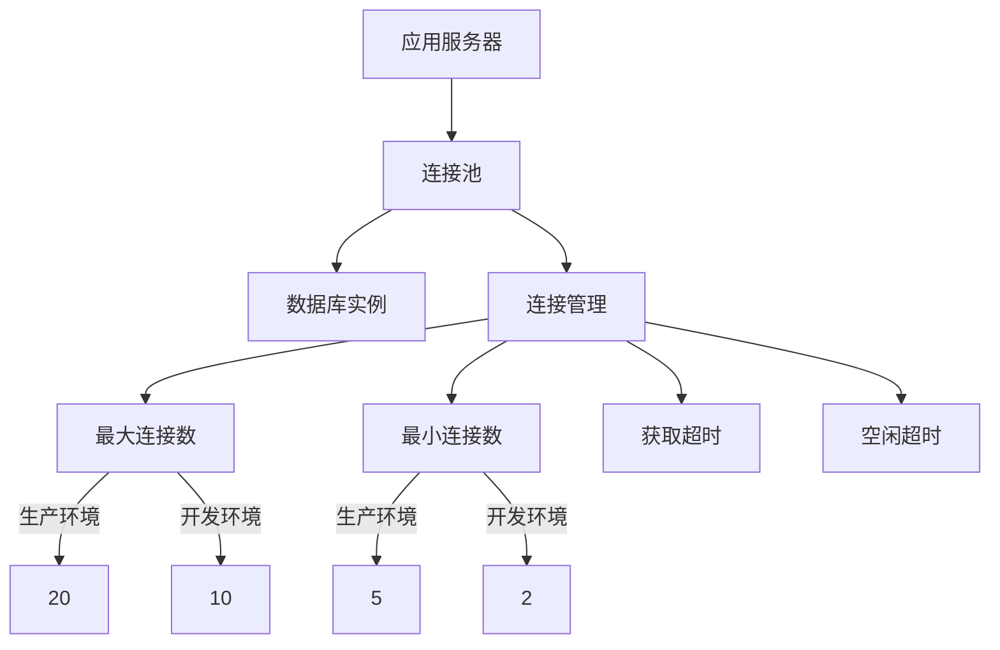
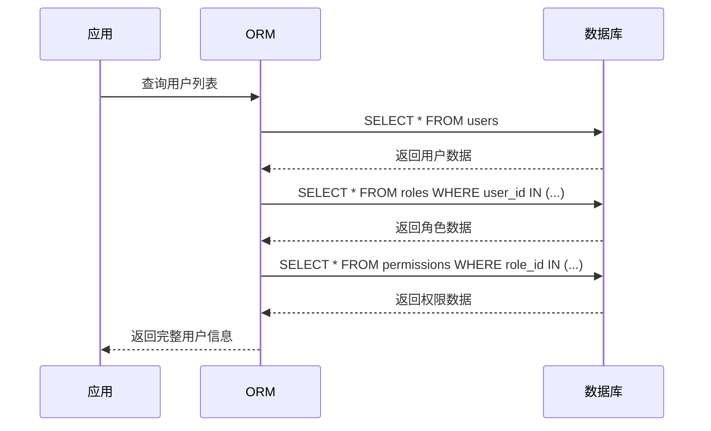
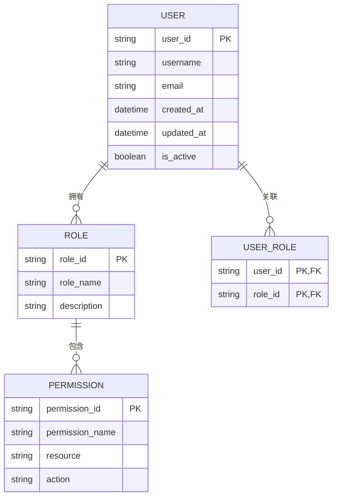
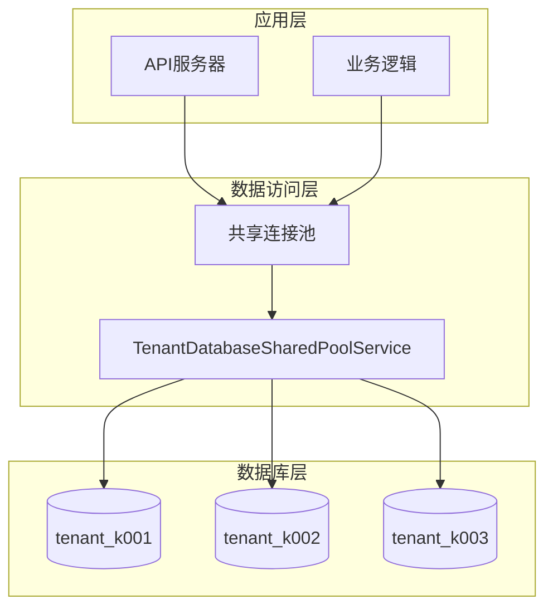
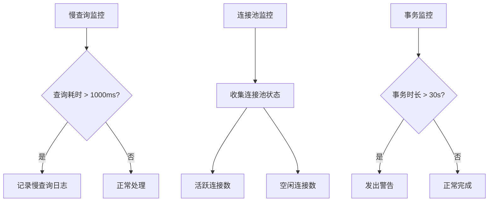
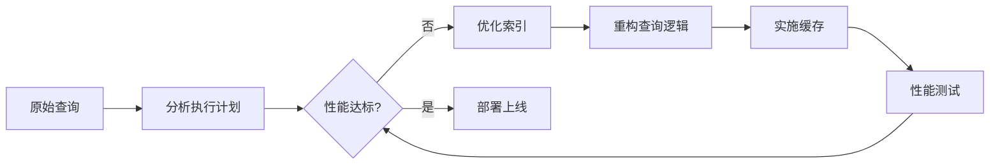

# 数据库性能优化

<cite>
**本文档引用的文件**
- [database.ts](file://k.yyup.com/server/src/config/database.ts)
- [database-config.ts](file://k.yyup.com/server/src/config/database-config.ts)
- [database-optimization.ts](file://k.yyup.com/server/src/config/database-optimization.ts)
- [database-unified.ts](file://k.yyup.com/server/src/config/database-unified.ts)
- [database.service.ts](file://k.yyup.com/server/src/services/database.service.ts)
- [tenant-database-shared-pool.service.ts](file://tenant-database-shared-pool.service.ts)
- [database-initialization.ts](file://database-initialization.ts)
- [create_ai_shortcuts_table.sql](file://k.yyup.com/database/migrations/create_ai_shortcuts_table.sql)
- [20250815_create_website_automation_tables.sql](file://k.yyup.com/database/migrations/20250815_create_website_automation_tables.sql)
</cite>

## 目录
1. [简介](#简介)
2. [数据库连接池配置与优化](#数据库连接池配置与优化)
3. [查询优化技术](#查询优化技术)
4. [表结构设计最佳实践](#表结构设计最佳实践)
5. [读写分离与分库分表策略](#读写分离与分库分表策略)
6. [性能监控与诊断](#性能监控与诊断)
7. [优化案例分析](#优化案例分析)
8. [开发者最佳实践](#开发者最佳实践)
9. [结论](#结论)

## 简介

本项目k.yyupgame采用MySQL作为核心数据库系统，通过Sequelize ORM框架进行数据访问管理。系统设计支持多租户架构，采用共享连接池模式实现高效资源利用。本文档详细阐述了项目的数据库性能优化策略，涵盖连接池配置、查询优化、表结构设计、分库分表等关键技术，为开发者提供全面的性能调优指南。

**Section sources**
- [database.ts](file://k.yyup.com/server/src/config/database.ts#L1-L159)
- [database-unified.ts](file://k.yyup.com/server/src/config/database-unified.ts#L1-L137)

## 数据库连接池配置与优化

项目通过精细化的连接池配置确保数据库资源的高效利用和系统稳定性。连接池配置根据环境（开发、测试、生产）进行差异化设置，以适应不同场景的需求。



**Diagram sources**
- [database-optimization.ts](file://k.yyup.com/server/src/config/database-optimization.ts#L24-L46)
- [tenant-database-shared-pool.service.ts](file://tenant-database-shared-pool.service.ts#L20-L36)

连接池的关键配置参数包括：

- **最大连接数（max）**：生产环境默认20，可通过`DB_POOL_MAX`环境变量调整
- **最小连接数（min）**：生产环境默认5，保持一定数量的空闲连接
- **获取超时（acquire）**：等待连接的最长时间，生产环境60秒
- **空闲超时（idle）**：连接空闲后被释放的时间，10秒
- **驱逐间隔（evict）**：检查空闲连接的频率，30秒

生产环境的连接池配置通过环境变量实现动态调整，确保系统能够根据实际负载进行弹性伸缩。

**Section sources**
- [database-optimization.ts](file://k.yyup.com/server/src/config/database-optimization.ts#L24-L46)
- [database-config.ts](file://k.yyup.com/server/src/config/database-config.ts#L35-L41)

## 查询优化技术

项目实施了多层次的查询优化策略，包括索引优化、查询语句优化和避免N+1查询问题。

### 索引优化

通过分析迁移文件中的表结构定义，系统在关键字段上建立了适当的索引：

```sql
-- 示例：在AI快捷方式表中创建索引
CREATE INDEX idx_ai_shortcuts_tenant ON ai_shortcuts(tenant_code);
CREATE INDEX idx_ai_shortcuts_user ON ai_shortcuts(user_id);
CREATE INDEX idx_ai_shortcuts_created ON ai_shortcuts(created_at);
```

这些索引显著提升了基于租户、用户和时间范围的查询性能。

### 查询语句优化

系统通过以下方式优化查询语句：

1. 使用参数化查询防止SQL注入
2. 避免SELECT *，只查询必要的字段
3. 合理使用JOIN操作，避免笛卡尔积
4. 在WHERE子句中使用索引字段

### 避免N+1查询

通过Sequelize的预加载功能（eager loading）避免N+1查询问题：



**Diagram sources**
- [database.service.ts](file://k.yyup.com/server/src/services/database.service.ts#L24-L34)
- [create_ai_shortcuts_table.sql](file://k.yyup.com/database/migrations/create_ai_shortcuts_table.sql)

**Section sources**
- [database.service.ts](file://k.yyup.com/server/src/services/database.service.ts#L24-L133)
- [database-optimization.ts](file://k.yyup.com/server/src/config/database-optimization.ts#L51-L72)

## 表结构设计最佳实践

### 范式与反范式的权衡

系统在表结构设计中合理权衡范式与反范式：

- **第三范式应用**：用户、角色、权限等核心数据采用规范化设计，减少数据冗余
- **适度反范式**：在性能关键的查询场景中，适当引入冗余字段以减少JOIN操作

### 字段类型选择

遵循以下字段类型选择原则：

- 使用`utf8mb4`字符集支持完整Unicode
- 日期时间字段统一使用UTC+8时区
- 布尔值使用TINYINT(1)类型
- 大文本字段使用TEXT或LONGTEXT类型



**Diagram sources**
- [database-unified.ts](file://k.yyup.com/server/src/config/database-unified.ts#L105-L110)
- [20250815_create_website_automation_tables.sql](file://k.yyup.com/database/migrations/20250815_create_website_automation_tables.sql)

**Section sources**
- [database-unified.ts](file://k.yyup.com/server/src/config/database-unified.ts#L105-L110)
- [create_ai_shortcuts_table.sql](file://k.yyup.com/database/migrations/create_ai_shortcuts_table.sql)

## 读写分离与分库分表策略

### 共享连接池架构

项目采用创新的共享连接池架构实现多租户支持：



**Diagram sources**
- [tenant-database-shared-pool.service.ts](file://tenant-database-shared-pool.service.ts#L9-L177)
- [database-initialization.ts](file://database-initialization.ts#L1-L89)

该架构的核心特点：

- 所有租户共享一个全局连接池
- 通过`tenant_${code}`前缀区分不同租户的数据库
- SQL语句中的表名自动替换为完整数据库.表名格式
- 全局连接池最大连接数可配置（默认30）

### 分库策略

系统采用垂直分库策略：

- 每个租户拥有独立的数据库实例
- 数据库命名规范为`tenant_${租户编码}`
- 通过SQL解析器自动添加数据库前缀

这种设计既保证了租户间的数据隔离，又实现了连接资源的高效共享。

**Section sources**
- [tenant-database-shared-pool.service.ts](file://tenant-database-shared-pool.service.ts#L9-L177)
- [database-initialization.ts](file://database-initialization.ts#L1-L89)

## 性能监控与诊断

### 监控配置

系统内置了全面的性能监控机制：



**Diagram sources**
- [database-optimization.ts](file://k.yyup.com/server/src/config/database-optimization.ts#L136-L172)
- [database.ts](file://k.yyup.com/server/src/config/database.ts#L140-L153)

关键监控指标包括：

- 慢查询阈值：1000ms（可配置）
- 连接池状态监控：活跃和空闲连接数
- 长时间运行事务检测：超过30秒的事务
- 性能指标收集间隔：60秒

### 日志记录

系统实现了详细的数据库操作日志记录：

- 记录所有数据库操作的成功与失败状态
- 包含操作名称、时间戳和附加信息
- 日志文件存储在`logs/database.log`
- 支持按时间范围查询和分析

**Section sources**
- [database-optimization.ts](file://k.yyup.com/server/src/config/database-optimization.ts#L136-L172)
- [database.ts](file://k.yyup.com/server/src/config/database.ts#L140-L153)

## 优化案例分析

### 大数据量查询性能提升

针对大数据量查询场景，系统实施了以下优化措施：

1. **分页查询优化**：使用游标分页替代基于OFFSET的分页
2. **结果集缓存**：对频繁查询的结果进行缓存
3. **异步处理**：将耗时查询移至后台任务处理

### 复杂关联查询优化方案

对于复杂的多表关联查询，采用以下优化策略：

- 创建复合索引支持多字段查询
- 重构查询逻辑，减少JOIN层级
- 使用物化视图预计算常用关联结果
- 实施查询缓存机制



**Diagram sources**
- [database.service.ts](file://k.yyup.com/server/src/services/database.service.ts#L58-L69)
- [database-optimization.ts](file://k.yyup.com/server/src/config/database-optimization.ts#L51-L72)

**Section sources**
- [database.service.ts](file://k.yyup.com/server/src/services/database.service.ts#L58-L69)
- [database-optimization.ts](file://k.yyup.com/server/src/config/database-optimization.ts#L51-L72)

## 开发者最佳实践

### 使用EXPLAIN分析查询计划

开发者应养成使用EXPLAIN分析查询计划的习惯：

1. 在开发环境中开启查询日志
2. 对慢查询使用EXPLAIN命令分析执行计划
3. 根据分析结果优化索引和查询语句

### 监控数据库性能指标

关键性能指标监控清单：

- 查询响应时间（P95、P99）
- 连接池使用率
- 慢查询数量
- 锁等待时间
- 缓存命中率

### 数据库压力测试

实施定期的压力测试：

- 使用生产数据量级进行测试
- 模拟高峰时段的并发请求
- 监控系统资源使用情况
- 记录性能瓶颈并制定优化方案

**Section sources**
- [database-optimization.ts](file://k.yyup.com/server/src/config/database-optimization.ts#L51-L72)
- [database.service.ts](file://k.yyup.com/server/src/services/database.service.ts#L24-L34)

## 结论

k.yyupgame项目的数据库性能优化体系全面而高效，通过连接池优化、查询优化、合理的表结构设计以及创新的共享连接池架构，实现了高性能、高可用的数据库访问。系统内置的监控和诊断机制为持续优化提供了数据支持。开发者应遵循文档中的最佳实践，确保数据库操作的高效性和稳定性，为用户提供流畅的应用体验。