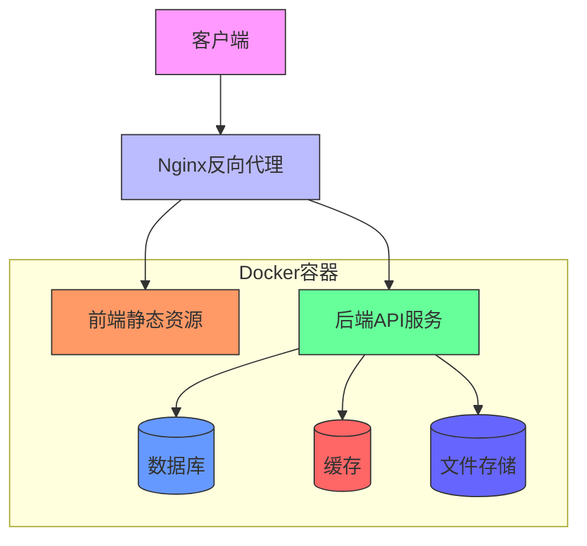
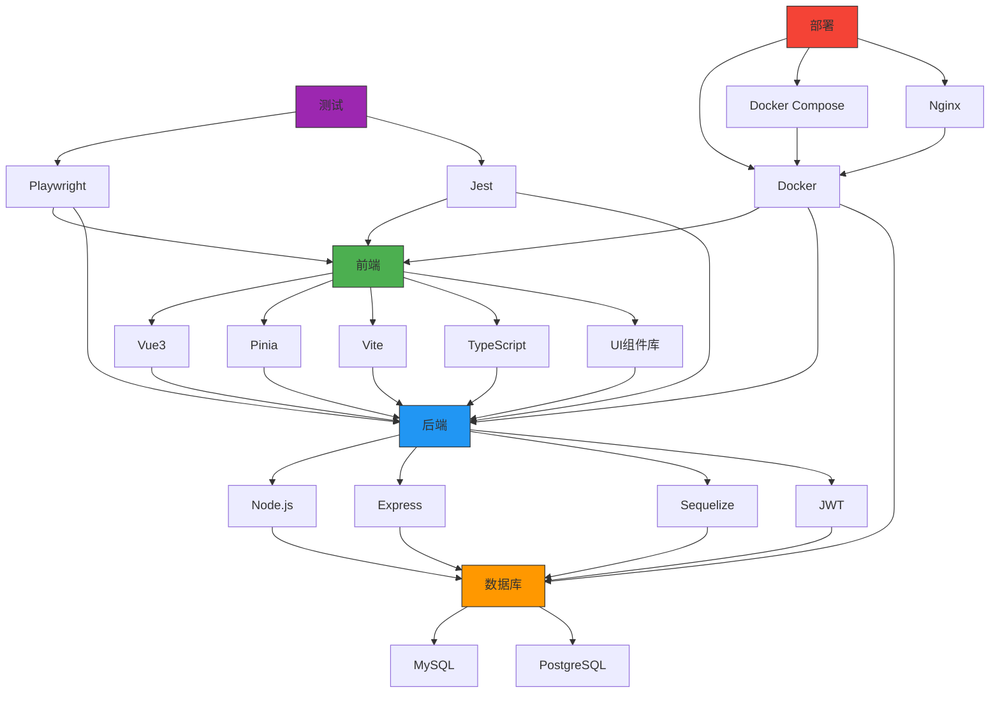

# 技术栈

<cite>
**本文档引用的文件**  
- [package.json](file://unified-tenant-system/package.json)
- [Dockerfile](file://unified-tenant-system/Dockerfile)
- [docker-compose.yml](file://unified-tenant-system/docker-compose.yml)
- [client/package.json](file://unified-tenant-system/client/package.json)
- [server/package.json](file://unified-tenant-system/server/package.json)
- [nginx.conf](file://unified-tenant-system/docker/nginx.conf)
</cite>

## 目录
1. [简介](#简介)
2. [前端技术栈](#前端技术栈)
3. [后端技术栈](#后端技术栈)
4. [数据库技术](#数据库技术)
5. [测试技术栈](#测试技术栈)
6. [部署技术](#部署技术)
7. [技术栈关系图](#技术栈关系图)
8. [总结](#总结)

## 简介
kyyupgame项目是一个基于现代Web技术栈构建的综合性管理系统，采用前后端分离架构。本项目旨在为用户提供高效、稳定且可扩展的解决方案。技术选型上，项目采用了Vue3作为前端框架，Node.js配合Express作为后端运行时，结合MySQL/PostgreSQL数据库系统，形成了完整的技术生态。同时，项目集成了Playwright和Jest测试框架，确保代码质量和系统稳定性。在部署方面，采用Docker容器化技术，配合Docker Compose进行服务编排，通过Nginx实现反向代理和负载均衡。这种技术组合既保证了开发效率，又确保了生产环境的稳定性和可维护性。

**Section sources**
- [package.json](file://unified-tenant-system/package.json#L1-L207)

## 前端技术栈

### Vue3框架
项目前端采用Vue3作为核心框架，利用其组合式API（Composition API）提供更灵活的代码组织方式。Vue3的响应式系统基于Proxy实现，相比Vue2的Object.defineProperty具有更好的性能表现和更完整的ES6对象支持。项目中大量使用了`<script setup>`语法糖，简化了组件定义，提高了开发效率。Vue3的Teleport、Suspense等新特性也被应用于复杂UI场景的构建。

### Pinia状态管理
Pinia作为Vue3推荐的状态管理库，取代了传统的Vuex。项目中使用Pinia进行全局状态管理，其优势在于：
- 更简洁的API设计，无需mutations，直接通过actions修改状态
- 完美的TypeScript支持，提供完整的类型推断
- 模块化设计，每个store都是独立的模块，便于代码组织和维护
- 支持插件扩展，可轻松集成持久化、日志等附加功能

### Vite构建工具
Vite作为现代前端构建工具，在项目中发挥着关键作用。其核心优势包括：
- 基于ES模块的开发服务器，启动速度极快
- 利用浏览器原生ES模块支持，实现按需编译
- 集成热模块替换（HMR），提升开发体验
- 支持多种预处理器（如Sass、TypeScript）和插件生态

### TypeScript语言
项目全面采用TypeScript进行开发，带来了显著的优势：
- 静态类型检查，减少运行时错误
- 更好的代码提示和自动补全
- 增强的代码可维护性和可读性
- 与Vue3的完美集成，提供完整的类型支持

### UI组件库
项目集成了多个UI组件库以加速开发：
- **Element Plus**：基于Vue3的桌面端组件库，提供丰富的表单、表格、对话框等组件
- **Vant**：移动端组件库，确保在移动设备上的良好用户体验
- **Ant Design**：提供企业级UI设计语言和组件实现
- **ECharts**：强大的数据可视化库，用于构建各种图表和仪表盘

**Section sources**
- [client/package.json](file://unified-tenant-system/client/package.json#L87-L118)

## 后端技术栈

### Node.js运行时
项目后端基于Node.js 18构建，选择该版本的原因包括：
- 长期支持（LTS）版本，稳定性高
- 支持最新的ES特性
- 丰富的npm生态
- 非阻塞I/O模型，适合高并发场景

### Express Web框架
Express作为Node.js最流行的Web框架，在项目中承担HTTP服务器的角色：
- 轻量级设计，性能优异
- 中间件架构灵活，易于扩展
- 丰富的生态系统和社区支持
- 与TypeScript的良好集成

### Sequelize ORM
Sequelize作为项目的主要ORM（对象关系映射）工具，提供了以下功能：
- 支持MySQL、PostgreSQL等多种数据库
- 数据模型定义和迁移管理
- 查询构建器和原始SQL执行
- 事务支持和关联关系管理
- 钩子（hooks）机制，便于业务逻辑扩展

### JWT认证机制
项目采用JWT（JSON Web Token）实现用户认证和授权：
- 无状态认证，便于水平扩展
- 支持跨域认证
- 可携带用户信息和权限数据
- 支持刷新令牌机制，提高安全性
- 与Express中间件无缝集成

**Section sources**
- [server/package.json](file://unified-tenant-system/server/package.json#L71-L137)

## 数据库技术

### MySQL/PostgreSQL数据库系统
项目支持MySQL和PostgreSQL两种主流关系型数据库，可根据实际需求选择：
- **MySQL**：以高性能和易用性著称，适合大多数Web应用场景
- **PostgreSQL**：功能更强大，支持复杂查询、JSON数据类型和地理空间数据

### 数据库应用
在项目中的具体应用包括：
- **数据持久化**：存储用户信息、业务数据、配置信息等
- **事务管理**：确保数据一致性和完整性
- **索引优化**：通过合理索引设计提升查询性能
- **备份恢复**：定期备份，确保数据安全
- **读写分离**：在高并发场景下提升系统性能

### 数据库迁移
项目采用Sequelize CLI进行数据库迁移管理：
- 版本化数据库结构变更
- 支持迁移和回滚操作
- 团队协作时确保数据库结构一致性
- 自动化部署流程集成

**Section sources**
- [server/package.json](file://unified-tenant-system/server/package.json#L115-L124)

## 测试技术栈

### Playwright端到端测试框架
Playwright作为现代化的端到端测试工具，在项目中扮演重要角色：
- 支持多浏览器（Chromium、Firefox、WebKit）测试
- 自动等待机制，减少测试不稳定性
- 网络拦截和模拟功能，便于测试各种场景
- 视频录制和截图功能，便于问题排查
- 与CI/CD流程无缝集成

### Jest单元测试框架
Jest作为JavaScript测试框架，用于项目的单元测试和集成测试：
- 零配置启动，开箱即用
- 内置代码覆盖率报告
- 模拟（mocking）功能强大
- 并行测试执行，提高测试速度
- 丰富的断言库和匹配器

### 测试策略
项目采用分层测试策略：
- **单元测试**：测试单个函数或组件的逻辑正确性
- **集成测试**：测试模块间的交互是否正常
- **端到端测试**：模拟用户操作，测试完整业务流程
- **性能测试**：评估系统在高负载下的表现

**Section sources**
- [package.json](file://unified-tenant-system/package.json#L6-L37)

## 部署技术

### Docker容器化
项目采用Docker进行容器化部署，主要优势包括：
- 环境一致性，避免"在我机器上能运行"的问题
- 快速部署和扩展
- 资源隔离，提高系统稳定性
- 与云平台的良好集成

### Docker Compose编排
使用Docker Compose管理多容器应用：
- 单一YAML文件定义完整服务栈
- 服务依赖管理
- 网络和卷配置
- 开发环境快速搭建

### Nginx反向代理
Nginx在部署架构中承担反向代理角色：
- 负载均衡，分发请求到多个后端实例
- SSL终止，处理HTTPS加密
- 静态文件服务，提高前端资源访问速度
- 缓存机制，减轻后端压力
- 安全防护，防止常见Web攻击

**Diagram sources**
- [Dockerfile](file://unified-tenant-system/Dockerfile#L1-L83)
- [docker-compose.yml](file://unified-tenant-system/docker-compose.yml#L1-L42)
- [nginx.conf](file://unified-tenant-system/docker/nginx.conf)

## 技术栈关系图

**Diagram sources**
- [client/package.json](file://unified-tenant-system/client/package.json)
- [server/package.json](file://unified-tenant-system/server/package.json)
- [package.json](file://unified-tenant-system/package.json)

## 总结
kyyupgame项目的技术栈选择体现了现代Web开发的最佳实践。前端采用Vue3+Pinia+Vite+TypeScript的组合，提供了高效、可维护的开发体验；后端基于Node.js+Express+Sequelize+JWT，构建了稳定可靠的API服务；数据库支持MySQL和PostgreSQL，满足不同场景需求；测试方面集成Playwright和Jest，确保代码质量；部署采用Docker+Docker Compose+Nginx，实现了环境一致性和高可用性。这种技术组合不仅提高了开发效率，也为系统的可扩展性和可维护性奠定了坚实基础。