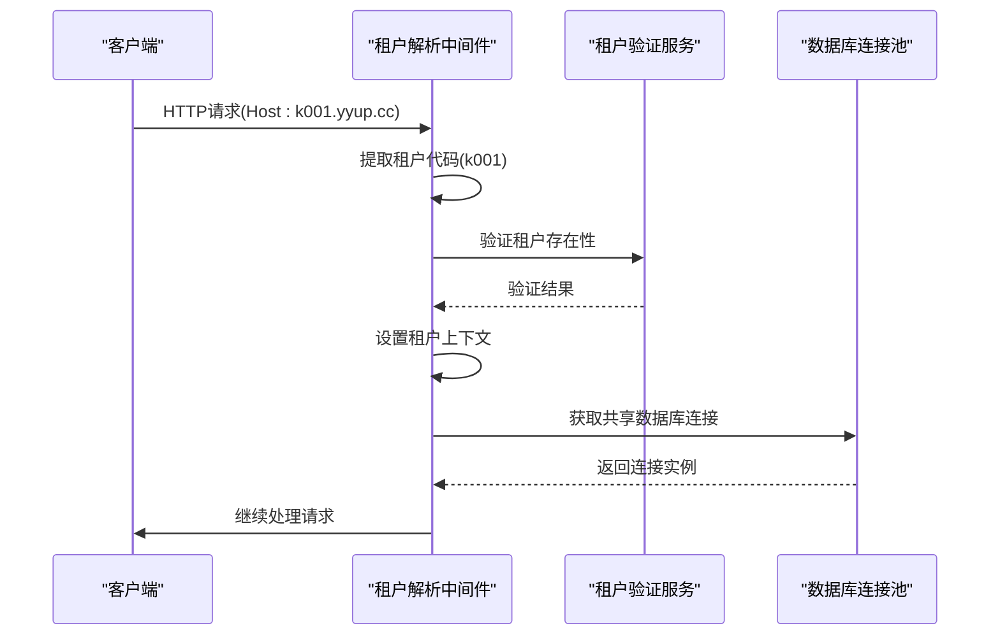
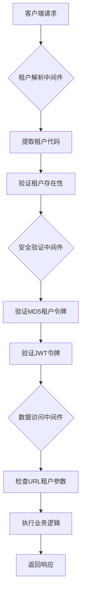
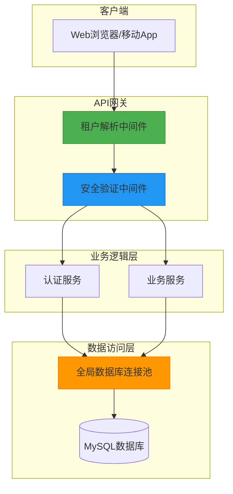

# 多租户数据隔离

<cite>
**本文档引用文件**  
- [tenant-resolver-shared-pool.middleware.ts](file://tenant-resolver-shared-pool.middleware.ts) - *更新了租户解析中间件，支持共享连接池*
- [tenant-database-shared-pool.service.ts](file://tenant-database-shared-pool.service.ts) - *实现了全局共享数据库连接池服务*
- [database-initialization.ts](file://database-initialization.ts) - *新增应用启动初始化和优雅关闭机制*
- [auth-shared-pool-example.middleware.ts](file://auth-shared-pool-example.middleware.ts) - *补充了认证中间件与租户解析的完整工作流程*
- [k.yyup.com/server/src/middlewares/tenant-resolver.middleware.ts](file://k.yyup.com/server/src/middlewares/tenant-resolver.middleware.ts)
- [k.yyup.com/server/src/middlewares/tenant-security.middleware.ts](file://k.yyup.com/server/src/middlewares/tenant-security.middleware.ts)
- [k.yyup.com/server/src/controllers/tenant-token.controller.ts](file://k.yyup.com/server/src/controllers/tenant-token.controller.ts)
- [k.yyup.com/server/src/services/tenant-token.service.ts](file://k.yyup.com/server/src/services/tenant-token.service.ts)
</cite>

## 更新摘要
**变更内容**  
- 新增共享连接池架构的详细说明
- 补充应用启动初始化和优雅关闭机制
- 完善租户解析中间件与认证中间件的完整工作流程
- 更新数据库连接池实现细节
- 增加系统初始化和关闭的代码示例

## 目录
1. [简介](#简介)
2. [基于租户ID的数据隔离策略](#基于租户id的数据隔离策略)
3. [租户解析中间件工作机制](#租户解析中间件工作机制)
4. [数据库连接池的租户隔离实现](#数据库连接池的租户隔离实现)
5. [缓存层的租户数据分离策略](#缓存层的租户数据分离策略)
6. [安全审计方法与漏洞防范措施](#安全审计方法与漏洞防范措施)
7. [开发者最佳实践与常见陷阱规避](#开发者最佳实践与常见陷阱规避)
8. [系统架构图](#系统架构图)

## 简介
k.yyupgame系统采用共享数据库的多租户架构，通过租户ID实现数据安全隔离。本系统基于域名识别租户（如k001.yyup.cc），所有租户共享一个全局数据库连接池，通过完整的数据库.表名格式访问各自的数据表（如tenant_k001.users）。该设计在保证数据隔离的同时，优化了数据库连接资源的使用效率。

**本文档引用文件**  
- [tenant-resolver-shared-pool.middleware.ts](file://tenant-resolver-shared-pool.middleware.ts)
- [tenant-database-shared-pool.service.ts](file://tenant-database-shared-pool.service.ts)

## 基于租户ID的数据隔离策略

### 查询过滤机制
系统通过在SQL查询中自动添加租户数据库前缀来实现数据隔离。当执行查询时，中间件会将原始SQL中的表名替换为完整的数据库.表名格式。例如，`SELECT * FROM users` 会被转换为 `SELECT * FROM tenant_k001.users`，确保查询仅限于当前租户的数据。

### 权限验证流程
权限验证分为两个层次：租户级验证和用户级验证。首先通过租户解析中间件验证请求域名与租户代码的匹配关系，然后通过认证中间件验证用户身份和权限。用户数据存储在租户专属的数据库中，通过全局用户ID关联统一认证系统。

### 数据访问控制
数据访问控制通过以下机制实现：
- 所有数据库操作必须通过租户解析中间件获取租户上下文
- 认证中间件确保用户只能访问其所属租户的数据
- 安全中间件防止URL参数中的租户代码被篡改

**本文档引用文件**  
- [auth-shared-pool-example.middleware.ts](file://auth-shared-pool-example.middleware.ts)
- [k.yyup.com/server/src/middlewares/tenant-security.middleware.ts](file://k.yyup.com/server/src/middlewares/tenant-security.middleware.ts)

## 租户解析中间件工作机制

### 租户识别流程
租户解析中间件根据请求的Host头信息识别租户，支持以下域名格式：
- `k001.yyup.cc` → 租户代码：k001
- `tenant1.kindergarten.com` → 租户代码：tenant1

中间件首先提取域名中的租户代码，然后验证该租户是否存在且已激活。验证通过后，将租户信息（代码、域名、数据库名）存储在请求对象中供后续处理使用。

### 开发环境兼容性
在开发环境中，系统提供兼容性支持：
- 允许localhost和127.0.0.1访问
- 支持带端口号的开发域名
- 对于无法识别的域名，使用默认租户配置



**图示来源**  
- [tenant-resolver-shared-pool.middleware.ts](file://tenant-resolver-shared-pool.middleware.ts)
- [k.yyup.com/server/src/middlewares/tenant-resolver.middleware.ts](file://k.yyup.com/server/src/middlewares/tenant-resolver.middleware.ts)

## 数据库连接池的租户隔离实现

### 共享连接池架构
系统采用全局共享的数据库连接池，所有租户共享同一个连接池实例。连接池配置如下：
- 最大连接数：30
- 最小连接数：5
- 获取连接超时：30秒
- 空闲连接超时：10秒

这种设计避免了为每个租户维护独立连接池的资源开销，同时通过SQL语句的数据库前缀确保数据隔离。

### 连接管理机制
连接池在应用启动时初始化，通过单例模式确保全局唯一实例。系统提供健康检查功能，定期验证连接池状态。在应用关闭时，会优雅地关闭所有数据库连接。

```mermaid
classDiagram
class TenantDatabaseSharedPoolService {
-globalConnection : Sequelize
+initializeGlobalConnection() : Promise~Sequelize~
+getGlobalConnection() : Sequelize
+queryTenantDatabase(tenantCode, sql, options) : Promise~any~
+getPoolStats() : Promise~any~
+healthCheck() : Promise~boolean~
+closeGlobalConnection() : Promise~void~
}
class TenantDatabaseSharedPoolService "1" -- "1" Sequelize : 使用
class Sequelize
```

**图示来源**  
- [tenant-database-shared-pool.service.ts](file://tenant-database-shared-pool.service.ts)
- [database-initialization.ts](file://database-initialization.ts)

## 缓存层的租户数据分离策略
虽然当前代码库中未直接体现缓存层实现，但基于系统架构可以推断出缓存策略：
- 缓存键应包含租户代码前缀，如`k001:user:123`
- 不同租户的数据在缓存中物理隔离
- 缓存失效策略需考虑租户级别的数据更新

## 安全审计方法与漏洞防范措施

### MD5租户令牌安全机制
系统实现了一套基于MD5的租户安全令牌机制，令牌包含以下信息：
- 用户手机号
- 租户代码
- 租户域名
- 数据库名称
- 时间戳（30分钟精度）
- 盐值（来自环境变量）

令牌格式为`KT_<MD5哈希>`，有效期为30分钟，有效防止重放攻击。

### 安全中间件防护
系统部署了多层安全中间件：
- **租户安全中间件**：验证域名与租户代码的匹配关系
- **数据访问中间件**：防止URL参数中的租户越权访问
- **审计中间件**：记录所有租户相关的操作日志

### 漏洞防范措施
- 防止Host头部伪造攻击
- 防止租户数据越权访问
- 防止SQL注入攻击
- 实现令牌过期和刷新机制



**图示来源**  
- [k.yyup.com/server/src/middlewares/tenant-security.middleware.ts](file://k.yyup.com/server/src/middlewares/tenant-security.middleware.ts)
- [k.yyup.com/server/src/services/tenant-token.service.ts](file://k.yyup.com/server/src/services/tenant-token.service.ts)

## 开发者最佳实践与常见陷阱规避

### 最佳实践
1. **始终使用租户上下文**：在任何数据访问操作前，确保租户上下文已正确设置
2. **避免硬编码数据库名**：使用`req.tenant.databaseName`获取当前租户数据库名
3. **正确处理连接异常**：捕获并妥善处理数据库连接失败的情况
4. **遵循SQL构造规范**：使用参数化查询防止SQL注入

### 常见陷阱规避
- **陷阱1：忽略租户验证**  
  规避方法：确保所有API路由都应用租户解析中间件

- **陷阱2：跨租户数据访问**  
  规避方法：在数据访问层添加租户一致性检查

- **陷阱3：连接池资源耗尽**  
  规避方法：合理配置连接池大小，实现连接超时机制

- **陷阱4：安全令牌泄露**  
  规避方法：在日志中掩码显示令牌和手机号

**本文档引用文件**  
- [k.yyup.com/server/src/controllers/tenant-token.controller.ts](file://k.yyup.com/server/src/controllers/tenant-token.controller.ts)
- [auth-shared-pool-example.middleware.ts](file://auth-shared-pool-example.middleware.ts)

## 系统架构图



**图示来源**  
- [tenant-resolver-shared-pool.middleware.ts](file://tenant-resolver-shared-pool.middleware.ts)
- [tenant-database-shared-pool.service.ts](file://tenant-database-shared-pool.service.ts)
- [k.yyup.com/server/src/middlewares/tenant-security.middleware.ts](file://k.yyup.com/server/src/middlewares/tenant-security.middleware.ts)