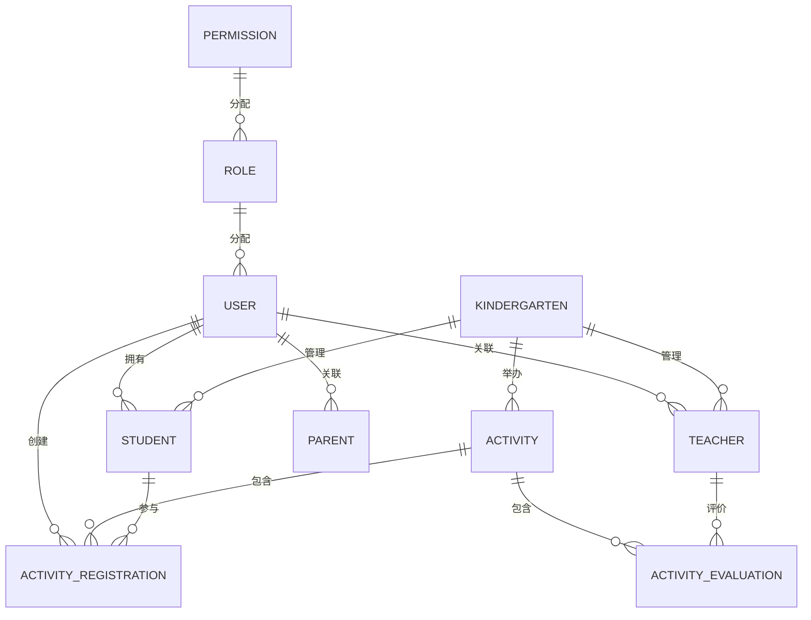
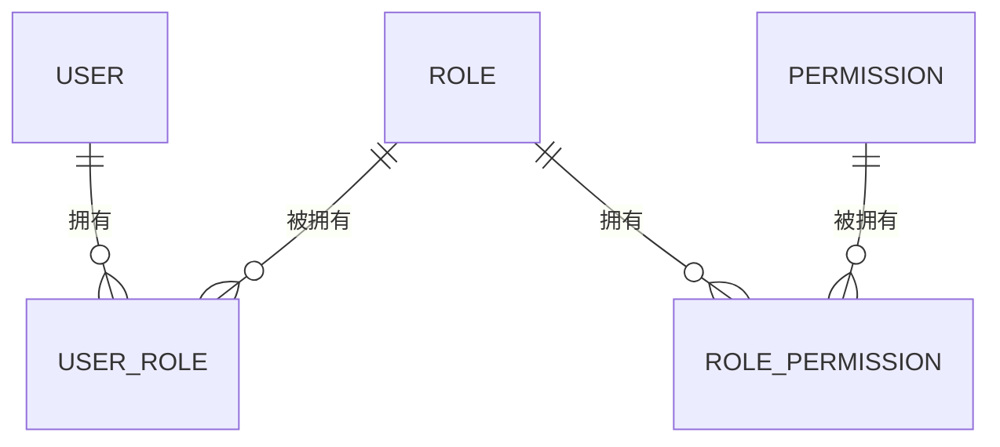
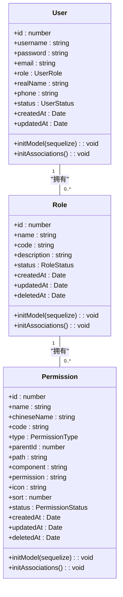
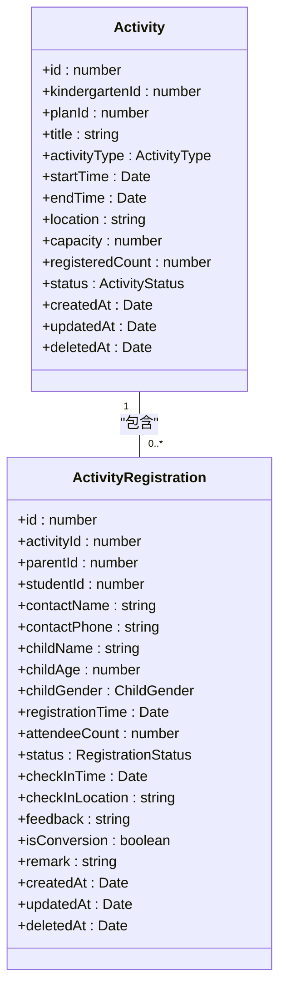
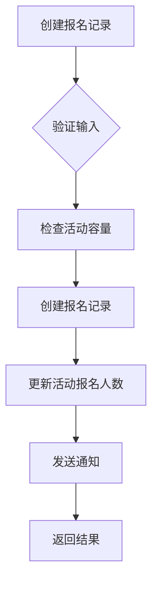
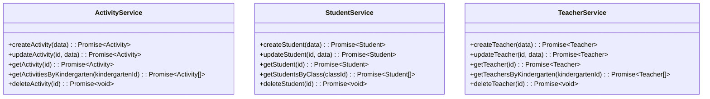
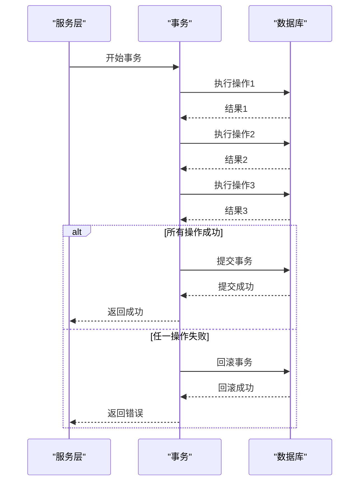
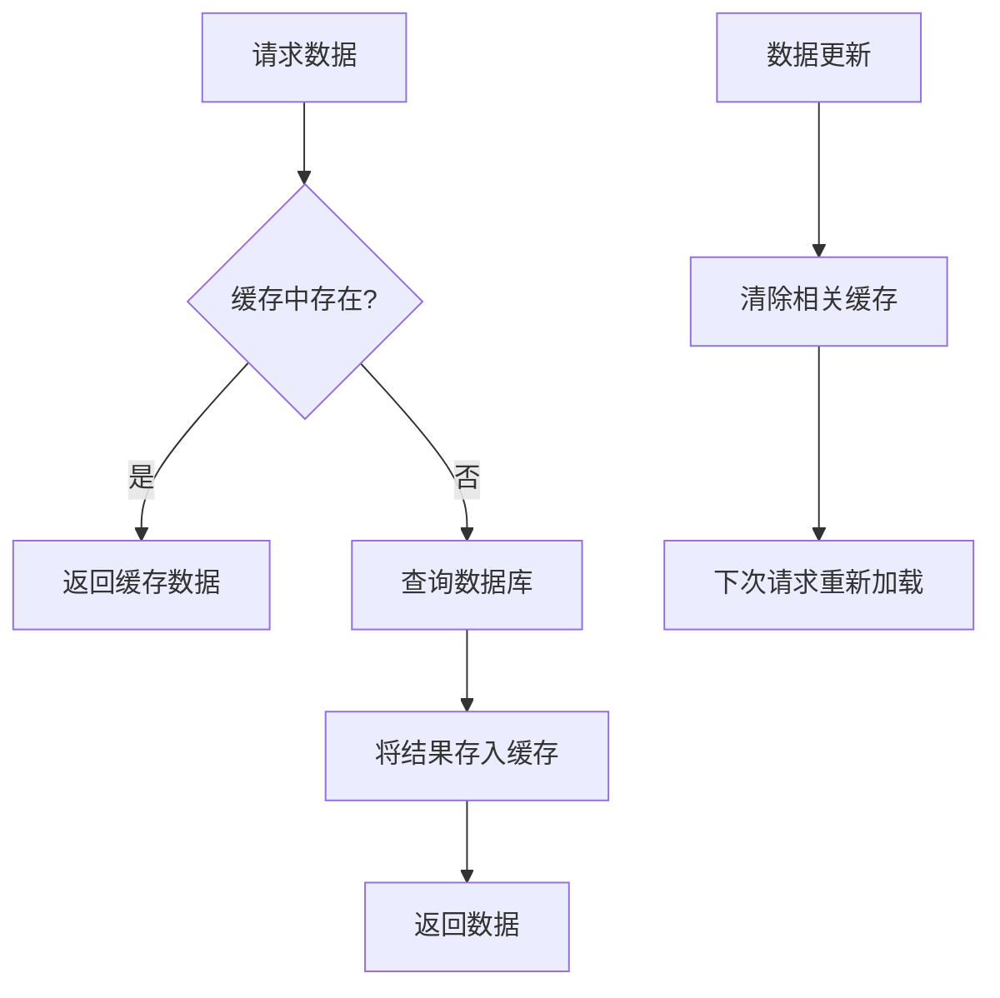
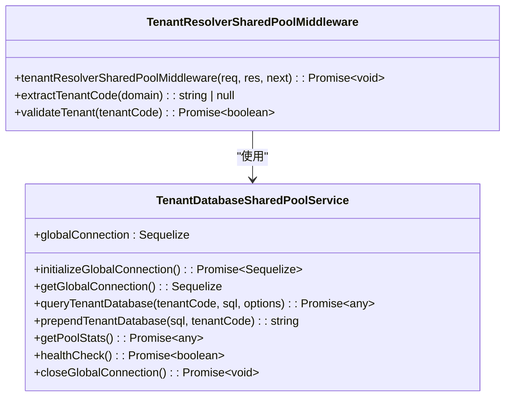
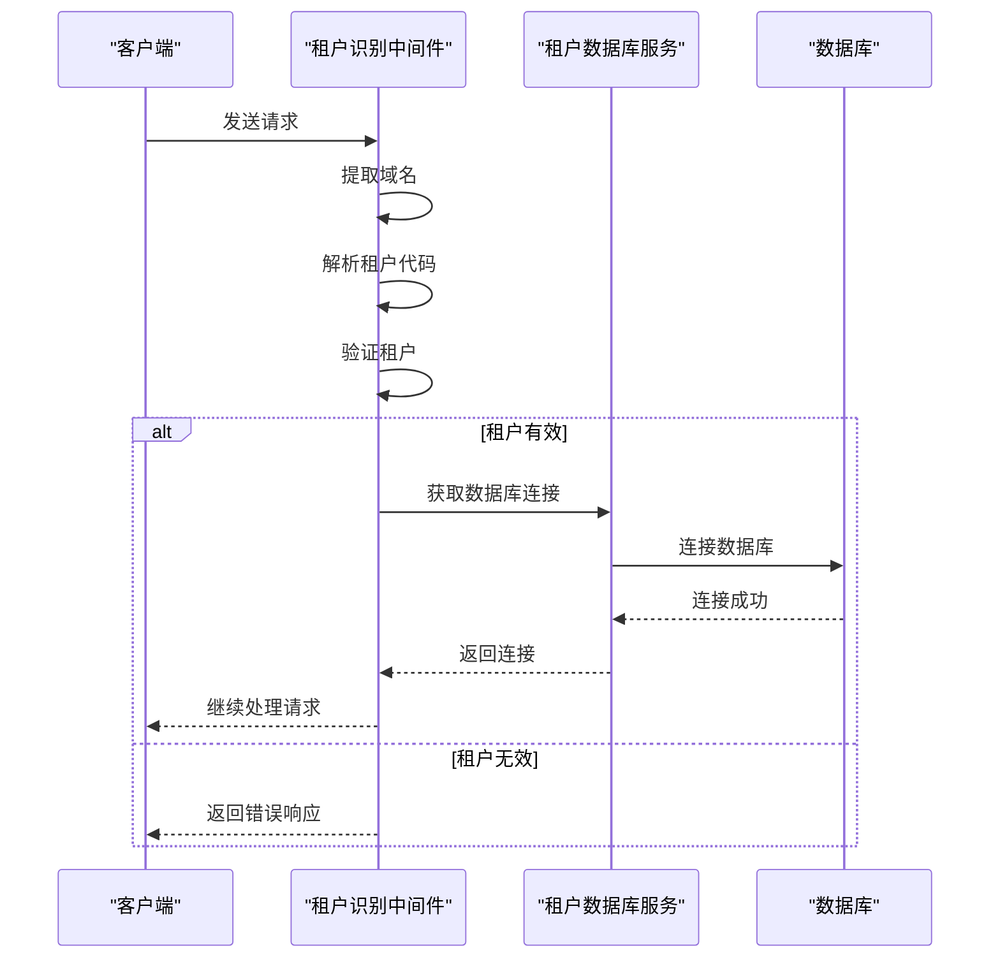

# 数据层

<cite>
**本文档引用的文件**  
- [activity.model.ts](file://k.yyup.com/server/src/models/activity.model.ts)
- [activity-participant.model.ts](file://k.yyup.com/server/src/models/activity-participant.model.ts)
- [activity-registration.model.ts](file://k.yyup.com/server/src/models/activity-registration.model.ts)
- [ai-conversation.model.ts](file://k.yyup.com/server/src/models/ai-conversation.model.ts)
- [student.model.ts](file://k.yyup.com/server/src/models/student.model.ts)
- [teacher.model.ts](file://k.yyup.com/server/src/models/teacher.model.ts)
- [user.model.ts](file://k.yyup.com/server/src/models/user.model.ts)
- [role.model.ts](file://k.yyup.com/server/src/models/role.model.ts)
- [permission.model.ts](file://k.yyup.com/server/src/models/permission.model.ts)
- [tenant-database-shared-pool.service.ts](file://tenant-database-shared-pool.service.ts)
- [tenant-resolver-shared-pool.middleware.ts](file://tenant-resolver-shared-pool.middleware.ts)
</cite>

## 目录
1. [引言](#引言)
2. [数据库设计](#数据库设计)
3. [Sequelize ORM 使用](#sequelize-orm-使用)
4. [数据库迁移系统](#数据库迁移系统)
5. [数据访问模式](#数据访问模式)
6. [缓存策略](#缓存策略)
7. [多租户数据隔离](#多租户数据隔离)
8. [性能优化建议](#性能优化建议)
9. [常见问题解决方案](#常见问题解决方案)

## 引言

k.yyupgame系统是一个面向幼儿园教育管理的综合性平台，其数据层设计充分考虑了教育行业的特殊需求，包括多租户架构、复杂的用户角色权限体系以及丰富的教育活动管理功能。本系统采用Sequelize作为ORM框架，结合MySQL数据库，实现了高效的数据持久化机制。通过分析核心模型文件，我们可以看到系统围绕用户、角色、权限、学生、教师等核心实体构建了完整的数据模型，并通过多租户架构确保不同幼儿园（租户）之间的数据隔离。

## 数据库设计

k.yyupgame系统的数据库设计围绕教育管理的核心业务场景展开，主要包括用户管理、角色权限、学生信息、教师信息、活动管理等模块。系统采用关系型数据库模型，通过外键关联和索引优化确保数据的一致性和查询性能。

### 核心实体关系模型

系统的核心实体包括用户（User）、角色（Role）、权限（Permission）、学生（Student）、教师（Teacher）和活动（Activity）。这些实体之间通过复杂的关联关系构成了完整的教育管理数据模型。



**图源**  
- [user.model.ts](file://k.yyup.com/server/src/models/user.model.ts)
- [role.model.ts](file://k.yyup.com/server/src/models/role.model.ts)
- [permission.model.ts](file://k.yyup.com/server/src/models/permission.model.ts)
- [student.model.ts](file://k.yyup.com/server/src/models/student.model.ts)
- [teacher.model.ts](file://k.yyup.com/server/src/models/teacher.model.ts)
- [activity.model.ts](file://k.yyup.com/server/src/models/activity.model.ts)
- [activity-registration.model.ts](file://k.yyup.com/server/src/models/activity-registration.model.ts)

### 用户与角色权限模型

系统采用基于角色的访问控制（RBAC）模型，通过用户-角色-权限的三层架构实现细粒度的权限管理。用户可以拥有多个角色，每个角色可以分配多个权限，从而实现灵活的权限配置。



**图源**  
- [user.model.ts](file://k.yyup.com/server/src/models/user.model.ts)
- [role.model.ts](file://k.yyup.com/server/src/models/role.model.ts)
- [permission.model.ts](file://k.yyup.com/server/src/models/permission.model.ts)

### 学生与教师管理模型

学生和教师作为教育管理的核心对象，分别与用户实体建立关联关系。学生信息包括基本信息、家庭关系、健康状况等，而教师信息则包含职位、教育背景、专业技能等详细资料。

```mermaid
erDiagram
USER ||--o{ STUDENT : "拥有"
USER ||--o{ TEACHER : "关联"
STUDENT ||--o{ PARENT_STUDENT_RELATION : "关联"
PARENT ||--o{ PARENT_STUDENT_RELATION : "关联"
TEACHER ||--o{ CLASS_TEACHER : "任教"
CLASS ||--o{ CLASS_TEACHER : "包含"
```

**图源**  
- [student.model.ts](file://k.yyup.com/server/src/models/student.model.ts)
- [teacher.model.ts](file://k.yyup.com/server/src/models/teacher.model.ts)
- [user.model.ts](file://k.yyup.com/server/src/models/user.model.ts)

## Sequelize ORM 使用

k.yyupgame系统采用Sequelize作为ORM框架，实现了TypeScript与MySQL数据库的无缝集成。通过Sequelize的现代化TypeScript支持，系统实现了类型安全的数据库操作。

### 模型定义

系统中的每个数据模型都遵循Sequelize的TypeScript最佳实践，使用`InferAttributes`和`InferCreationAttributes`类型来确保类型安全。模型定义包括字段声明、数据类型、约束条件和注释等。



**图源**  
- [user.model.ts](file://k.yyup.com/server/src/models/user.model.ts)
- [role.model.ts](file://k.yyup.com/server/src/models/role.model.ts)
- [permission.model.ts](file://k.yyup.com/server/src/models/permission.model.ts)

### 关联关系配置

系统通过Sequelize的关联方法（如`belongsTo`、`hasMany`、`belongsToMany`）配置实体之间的关系。这些关联关系不仅定义了数据库层面的外键约束，还提供了便捷的查询接口。



**图源**  
- [activity.model.ts](file://k.yyup.com/server/src/models/activity.model.ts)
- [activity-registration.model.ts](file://k.yyup.com/server/src/models/activity-registration.model.ts)

### 钩子函数

系统利用Sequelize的钩子函数（Hooks）在数据操作的特定生命周期执行自定义逻辑。例如，在创建活动报名记录时，系统会自动更新活动的已报名人数统计。



**图源**  
- [activity-registration.model.ts](file://k.yyup.com/server/src/models/activity-registration.model.ts)

## 数据库迁移系统

k.yyupgame系统采用Sequelize的迁移功能来管理数据库模式的版本控制。通过迁移脚本，系统可以安全地在不同环境之间同步数据库结构变更。

### 版本控制

系统使用迁移文件来记录数据库结构的变更历史。每个迁移文件包含`up`和`down`两个方法，分别用于应用和回滚变更。这种机制确保了数据库结构变更的可追溯性和可逆性。

### 回滚策略

当需要回滚数据库变更时，系统可以执行迁移文件中的`down`方法。这种策略允许开发团队在发现生产环境问题时快速恢复到之前的数据库状态，最大限度地减少对业务的影响。

### 生产环境应用流程

在生产环境中应用数据库迁移时，系统遵循严格的流程：首先在测试环境验证迁移脚本，然后在预发布环境进行最终验证，最后在维护窗口期间应用到生产环境。整个过程通过自动化脚本执行，确保一致性和可靠性。

## 数据访问模式

k.yyupgame系统通过服务层封装数据库操作，实现了业务逻辑与数据访问的分离。这种分层架构提高了代码的可维护性和可测试性。

### 服务层封装

系统中的每个业务模块都有对应的服务类，负责处理该模块的数据库操作。服务类通过依赖注入获取数据库模型实例，并提供高层次的业务方法。



**图源**  
- [activity.model.ts](file://k.yyup.com/server/src/models/activity.model.ts)
- [student.model.ts](file://k.yyup.com/server/src/models/student.model.ts)
- [teacher.model.ts](file://k.yyup.com/server/src/models/teacher.model.ts)

### 查询优化技巧

系统采用多种查询优化技巧来提高数据库性能，包括：
- 使用索引优化频繁查询的字段
- 通过`include`选项实现关联查询，减少数据库往返次数
- 使用分页查询处理大量数据
- 利用Sequelize的`attributes`选项选择性地加载字段

### 事务管理

对于涉及多个数据库操作的业务场景，系统使用Sequelize的事务功能确保数据一致性。通过将相关操作包装在事务中，系统可以确保要么所有操作都成功，要么在发生错误时全部回滚。



**图源**  
- [activity-registration.model.ts](file://k.yyup.com/server/src/models/activity-registration.model.ts)

## 缓存策略

k.yyupgame系统采用多层缓存策略来提高系统性能，减少数据库负载。

### Redis 使用场景

系统在多个场景中使用Redis缓存：
- 用户会话信息
- 角色权限数据
- 频繁查询的静态数据
- API响应结果

### 缓存失效机制

系统采用多种缓存失效策略确保数据一致性：
- 设置合理的过期时间（TTL）
- 在数据更新时主动清除相关缓存
- 使用版本号机制管理缓存
- 定期清理过期缓存



**图源**  
- [tenant-database-shared-pool.service.ts](file://tenant-database-shared-pool.service.ts)

## 多租户数据隔离

k.yyupgame系统采用多租户架构，支持多个幼儿园（租户）共享同一套系统实例，同时确保各租户数据的独立性和安全性。

### 数据隔离方案

系统通过以下机制实现多租户数据隔离：
- 每个租户拥有独立的数据库
- 使用租户代码（tenant code）识别请求来源
- 在数据库连接层自动路由到正确的租户数据库
- 在应用层确保数据访问权限控制



**图源**  
- [tenant-database-shared-pool.service.ts](file://tenant-database-shared-pool.service.ts)
- [tenant-resolver-shared-pool.middleware.ts](file://tenant-resolver-shared-pool.middleware.ts)

### 租户识别流程

系统通过中间件识别租户，流程如下：
1. 从请求头中提取域名
2. 解析域名中的租户代码
3. 验证租户是否存在且处于激活状态
4. 设置租户信息到请求对象
5. 获取对应租户的数据库连接



**图源**  
- [tenant-resolver-shared-pool.middleware.ts](file://tenant-resolver-shared-pool.middleware.ts)

## 性能优化建议

为了确保k.yyupgame系统在高并发场景下的稳定性和响应速度，建议采取以下性能优化措施：

1. **数据库索引优化**：为频繁查询的字段创建合适的索引，特别是外键字段和查询条件字段。
2. **查询批量处理**：对于批量数据操作，使用批量插入、更新和删除方法，减少数据库往返次数。
3. **连接池配置**：合理配置数据库连接池大小，平衡资源利用率和并发性能。
4. **缓存策略优化**：根据数据访问模式调整缓存策略，提高缓存命中率。
5. **读写分离**：对于读多写少的场景，考虑实现读写分离，将读请求路由到只读副本。
6. **分库分表**：当单表数据量过大时，考虑按租户或时间进行分库分表。

## 常见问题解决方案

在k.yyupgame系统的数据层开发和运维过程中，可能会遇到以下常见问题及其解决方案：

1. **数据库连接泄漏**：确保在使用完数据库连接后正确释放，使用连接池管理连接生命周期。
2. **死锁问题**：优化事务设计，减少事务持有锁的时间，按固定顺序访问资源。
3. **性能瓶颈**：通过数据库性能监控工具识别慢查询，优化查询语句和索引。
4. **数据一致性**：使用事务确保相关操作的原子性，避免部分成功部分失败的情况。
5. **迁移失败**：在执行数据库迁移前备份数据，确保迁移脚本的`down`方法能够正确回滚变更。
6. **多租户数据泄露**：严格验证租户身份，确保数据访问权限控制，定期进行安全审计。