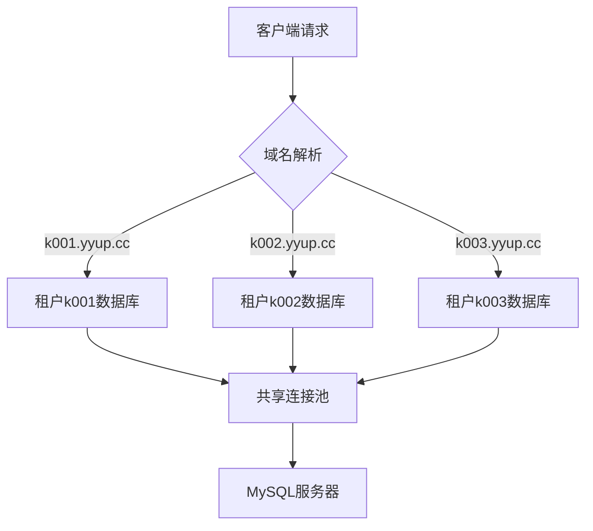
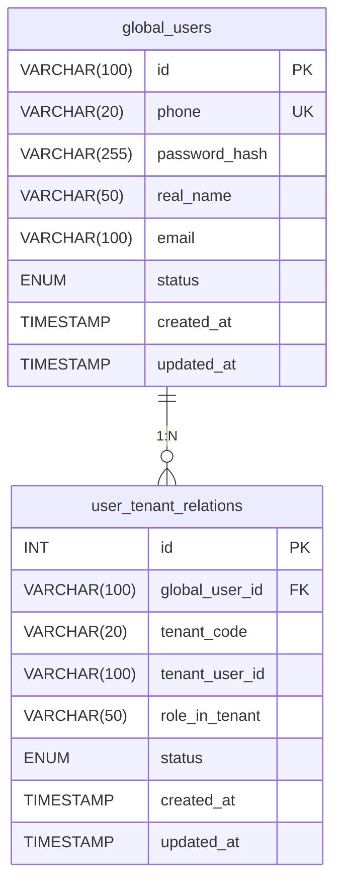
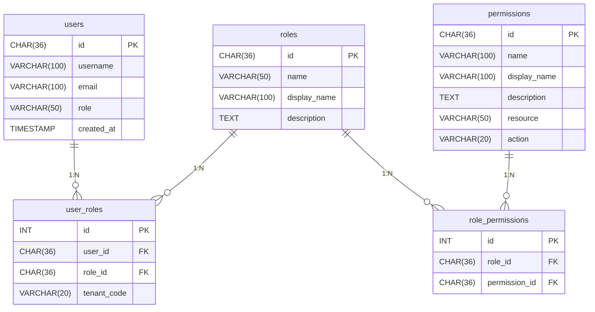
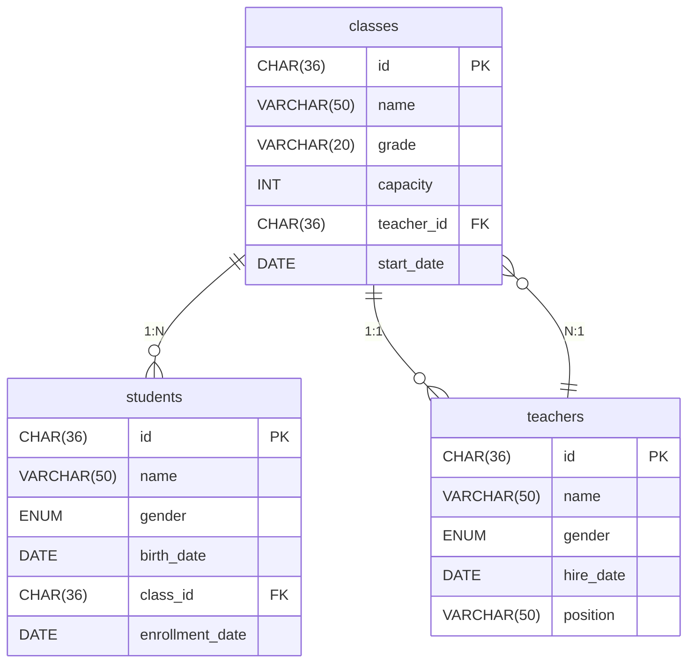
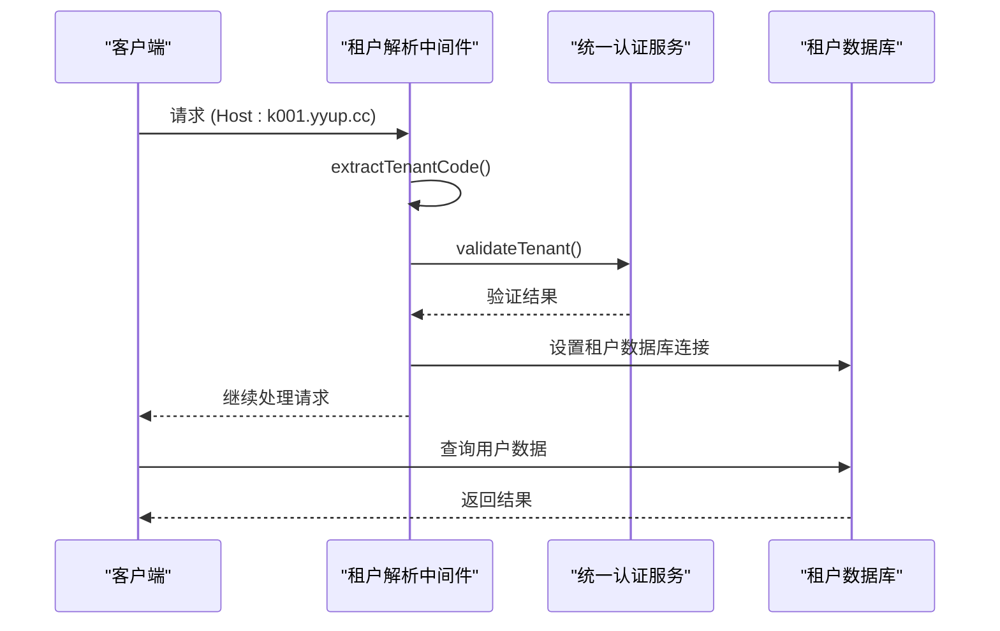

# 数据库设计

<cite>
**本文档引用的文件**
- [20250815_create_website_automation_tables.sql](file://k.yyup.com/database/migrations/20250815_create_website_automation_tables.sql)
- [create_ai_shortcuts_table.sql](file://k.yyup.com/database/migrations/create_ai_shortcuts_table.sql)
- [init-unified-auth.sql](file://unified-tenant-system/database/init-unified-auth.sql)
- [tenant-database-shared-pool.service.ts](file://tenant-database-shared-pool.service.ts)
- [tenant-resolver-shared-pool.middleware.ts](file://tenant-resolver-shared-pool.middleware.ts)
</cite>

## 目录
1. [引言](#引言)
2. [多租户架构设计](#多租户架构设计)
3. [统一认证系统](#统一认证系统)
4. [RBAC权限模型](#rbac权限模型)
5. [教育领域实体模型](#教育领域实体模型)
6. [AI助手功能模型](#ai助手功能模型)
7. [数据隔离与安全](#数据隔离与安全)
8. [索引与性能优化](#索引与性能优化)
9. [开发者使用示例](#开发者使用示例)

## 引言
k.yyupgame系统是一个面向幼儿园教育领域的多租户SaaS平台，其数据库设计采用了先进的多租户架构和RBAC（基于角色的访问控制）权限模型。本设计文档详细阐述了系统的核心数据模型，包括用户、角色、权限的RBAC模型设计，以及学生、教师、课程、班级等教育领域实体的模型设计。文档重点说明了各实体之间的关联关系、业务规则实现以及在多租户环境下的数据隔离策略，为开发者提供全面的数据库使用指导。

## 多租户架构设计
k.yyupgame系统采用数据库共享、模式隔离的多租户架构。每个租户拥有独立的数据库实例，通过统一的连接池进行管理。系统根据请求域名自动识别租户，并路由到相应的数据库。



**图表来源**
- [tenant-resolver-shared-pool.middleware.ts](file://tenant-resolver-shared-pool.middleware.ts#L103-L119)
- [tenant-database-shared-pool.service.ts](file://tenant-database-shared-pool.service.ts#L98-L123)

**本节来源**
- [tenant-resolver-shared-pool.middleware.ts](file://tenant-resolver-shared-pool.middleware.ts#L1-L142)
- [tenant-database-shared-pool.service.ts](file://tenant-database-shared-pool.service.ts#L1-L177)

## 统一认证系统
系统采用统一认证中心（unified_auth）管理所有租户的用户认证。全局用户表存储用户的基本信息，用户租户关联表管理用户与各租户的关系。

### 全局用户表 (global_users)
| 字段名 | 数据类型 | 约束 | 说明 |
|-------|--------|------|------|
| id | VARCHAR(100) | PRIMARY KEY | 全局用户ID (UUID格式) |
| phone | VARCHAR(20) | UNIQUE, NOT NULL | 手机号 (唯一标识) |
| password_hash | VARCHAR(255) | NOT NULL | 密码哈希值 (bcrypt) |
| real_name | VARCHAR(50) | | 真实姓名 |
| email | VARCHAR(100) | | 邮箱地址 |
| status | ENUM('active', 'inactive', 'locked') | DEFAULT 'active' | 用户状态 |
| created_at | TIMESTAMP | DEFAULT CURRENT_TIMESTAMP | 创建时间 |
| updated_at | TIMESTAMP | DEFAULT CURRENT_TIMESTAMP ON UPDATE CURRENT_TIMESTAMP | 更新时间 |

### 用户租户关联表 (user_tenant_relations)
| 字段名 | 数据类型 | 约束 | 说明 |
|-------|--------|------|------|
| id | INT | AUTO_INCREMENT PRIMARY KEY | 关联ID |
| global_user_id | VARCHAR(100) | NOT NULL | 全局用户ID |
| tenant_code | VARCHAR(20) | NOT NULL | 租户代码 |
| tenant_user_id | VARCHAR(100) | | 租户内用户ID |
| role_in_tenant | VARCHAR(50) | | 在租户中的角色 |
| status | ENUM('active', 'inactive', 'suspended') | DEFAULT 'active' | 关联状态 |
| created_at | TIMESTAMP | DEFAULT CURRENT_TIMESTAMP | 创建时间 |
| updated_at | TIMESTAMP | DEFAULT CURRENT_TIMESTAMP ON UPDATE CURRENT_TIMESTAMP | 更新时间 |



**图表来源**
- [init-unified-auth.sql](file://unified-tenant-system/database/init-unified-auth.sql#L19-L71)

**本节来源**
- [init-unified-auth.sql](file://unified-tenant-system/database/init-unified-auth.sql#L1-L253)

## RBAC权限模型
系统采用RBAC（基于角色的访问控制）模型，包含用户、角色、权限三个核心实体，通过用户角色关联表和角色权限关联表建立多对多关系。

### 权限表 (permissions)
| 字段名 | 数据类型 | 约束 | 说明 |
|-------|--------|------|------|
| id | CHAR(36) | PRIMARY KEY | 权限ID (UUID) |
| name | VARCHAR(100) | NOT NULL | 权限标识符 |
| display_name | VARCHAR(100) | NOT NULL | 权限显示名称 |
| description | TEXT | | 权限描述 |
| resource | VARCHAR(50) | NOT NULL | 资源标识 |
| action | VARCHAR(20) | NOT NULL | 操作类型 |
| level | INT | NOT NULL | 权限级别 |
| category_id | CHAR(36) | | 权限分类ID |

### 角色表 (roles)
| 字段名 | 数据类型 | 约束 | 说明 |
|-------|--------|------|------|
| id | CHAR(36) | PRIMARY KEY | 角色ID (UUID) |
| name | VARCHAR(50) | NOT NULL | 角色名称 |
| display_name | VARCHAR(100) | NOT NULL | 角色显示名称 |
| description | TEXT | | 角色描述 |
| level | INT | NOT NULL | 角色级别 |
| is_system | BOOLEAN | DEFAULT FALSE | 是否为系统角色 |

### 用户角色关联表 (user_roles)
| 字段名 | 数据类型 | 约束 | 说明 |
|-------|--------|------|------|
| id | INT | AUTO_INCREMENT PRIMARY KEY | 关联ID |
| user_id | CHAR(36) | NOT NULL | 用户ID |
| role_id | CHAR(36) | NOT NULL | 角色ID |
| tenant_code | VARCHAR(20) | NOT NULL | 租户代码 |
| created_at | TIMESTAMP | DEFAULT CURRENT_TIMESTAMP | 创建时间 |



**图表来源**
- [20250815_create_website_automation_tables.sql](file://k.yyup.com/database/migrations/20250815_create_website_automation_tables.sql#L238-L258)

**本节来源**
- [20250815_create_website_automation_tables.sql](file://k.yyup.com/database/migrations/20250815_create_website_automation_tables.sql#L238-L260)

## 教育领域实体模型
系统为幼儿园教育场景设计了完整的实体模型，包括学生、教师、班级、课程等核心实体。

### 学生表 (students)
| 字段名 | 数据类型 | 约束 | 说明 |
|-------|--------|------|------|
| id | CHAR(36) | PRIMARY KEY | 学生ID |
| name | VARCHAR(50) | NOT NULL | 学生姓名 |
| gender | ENUM('male', 'female') | NOT NULL | 性别 |
| birth_date | DATE | NOT NULL | 出生日期 |
| class_id | CHAR(36) | NOT NULL | 所属班级ID |
| enrollment_date | DATE | NOT NULL | 入学日期 |
| status | ENUM('enrolled', 'graduated', 'transferred') | DEFAULT 'enrolled' | 学籍状态 |

### 教师表 (teachers)
| 字段名 | 数据类型 | 约束 | 说明 |
|-------|--------|------|------|
| id | CHAR(36) | PRIMARY KEY | 教师ID |
| name | VARCHAR(50) | NOT NULL | 教师姓名 |
| gender | ENUM('male', 'female') | NOT NULL | 性别 |
| hire_date | DATE | NOT NULL | 入职日期 |
| position | VARCHAR(50) | NOT NULL | 职位 |
| phone | VARCHAR(20) | | 联系电话 |
| email | VARCHAR(100) | | 邮箱 |

### 班级表 (classes)
| 字段名 | 数据类型 | 约束 | 说明 |
|-------|--------|------|------|
| id | CHAR(36) | PRIMARY KEY | 班级ID |
| name | VARCHAR(50) | NOT NULL | 班级名称 |
| grade | VARCHAR(20) | NOT NULL | 年级 |
| capacity | INT | NOT NULL | 容量 |
| teacher_id | CHAR(36) | NOT NULL | 班主任ID |
| start_date | DATE | NOT NULL | 开班日期 |
| end_date | DATE | | 结班日期 |



**图表来源**
- [tenant-database-shared-pool.service.ts](file://tenant-database-shared-pool.service.ts#L104-L106)

## AI助手功能模型
系统为教育场景设计了AI助手功能，通过快捷操作配置表实现预设的AI功能。

### AI助手快捷操作表 (ai_shortcuts)
| 字段名 | 数据类型 | 约束 | 说明 |
|-------|--------|------|------|
| id | INT | PRIMARY KEY AUTO_INCREMENT | 主键ID |
| shortcut_name | VARCHAR(100) | NOT NULL | 快捷按钮显示名称 |
| prompt_name | VARCHAR(100) | NOT NULL | 提示词标识名称 |
| category | ENUM | NOT NULL | 功能类别 |
| role | ENUM('principal', 'admin', 'teacher', 'all') | NOT NULL DEFAULT 'all' | 适用角色 |
| system_prompt | TEXT | NOT NULL | 系统提示词内容 |
| api_endpoint | ENUM('ai_chat', 'ai_query') | NOT NULL | 调用的API接口类型 |
| is_active | BOOLEAN | DEFAULT TRUE | 是否启用 |
| sort_order | INT | DEFAULT 0 | 排序权重 |

**本节来源**
- [create_ai_shortcuts_table.sql](file://k.yyup.com/database/migrations/create_ai_shortcuts_table.sql#L1-L25)

## 数据隔离与安全
系统通过多层机制确保多租户环境下的数据隔离与安全。

### 数据隔离策略
1. **数据库级隔离**：每个租户拥有独立的数据库实例，命名格式为`tenant_{租户代码}`。
2. **连接池管理**：使用共享连接池，通过SQL语句重写机制自动添加数据库前缀。
3. **租户识别**：基于域名识别租户，支持`k001.yyup.cc`等格式。
4. **权限验证**：在应用层验证用户对租户的访问权限。

### 业务规则实现
- **数据验证**：使用CHECK约束确保数据完整性，如进度值在0-100之间。
- **默认值设置**：为创建时间和更新时间设置默认值和自动更新。
- **生命周期钩子**：通过ON UPDATE CURRENT_TIMESTAMP实现自动更新时间戳。
- **外键约束**：确保引用完整性，如任务表引用用户表和模板表。

**本节来源**
- [tenant-database-shared-pool.service.ts](file://tenant-database-shared-pool.service.ts#L98-L123)
- [tenant-resolver-shared-pool.middleware.ts](file://tenant-resolver-shared-pool.middleware.ts#L103-L119)

## 索引与性能优化
系统为高频查询字段创建了适当的索引，以优化查询性能。

### 索引策略
- **单列索引**：为经常作为查询条件的字段创建单列索引，如用户ID、状态等。
- **复合索引**：为多条件查询创建复合索引，如(global_user_id, status, tenant_code)。
- **唯一索引**：为保证数据唯一性的字段创建唯一索引，如手机号。
- **全文索引**：为需要全文搜索的字段创建全文索引。

### 索引示例
```sql
-- 用户租户关联表索引
CREATE INDEX idx_user_tenant_lookup ON user_tenant_relations(global_user_id, status, tenant_code);

-- 认证日志表复合索引
CREATE INDEX idx_auth_logs_lookup ON auth_logs(phone, auth_type, auth_result, created_at);

-- 会话表活动会话索引
CREATE INDEX idx_sessions_active ON user_sessions(global_user_id, expires_at) WHERE expires_at > NOW();
```

**本节来源**
- [init-unified-auth.sql](file://unified-tenant-system/database/init-unified-auth.sql#L178-L182)

## 开发者使用示例
为开发者提供常见的数据库操作示例和查询模式。

### 获取租户内用户信息
```typescript
// 使用共享连接池查询租户数据
const result = await tenantDatabaseSharedPoolService.queryTenantDatabase(
  'k001',
  'SELECT * FROM users WHERE status = ?',
  ['active']
);
```

### 创建新租户
```typescript
// 初始化租户数据库
export async function createTenantDatabase(tenantCode: string): Promise<void> {
  const connection = tenantDatabaseSharedPoolService.getGlobalConnection();
  const databaseName = `tenant_${tenantCode}`;
  
  await connection.query(`CREATE DATABASE IF NOT EXISTS ${databaseName}`);
  await connection.query(`USE ${databaseName}`);
  
  // 创建租户内各表结构
  await createTenantTables(connection);
}
```

### 用户认证流程


**本节来源**
- [tenant-database-shared-pool.service.ts](file://tenant-database-shared-pool.service.ts#L71-L92)
- [tenant-resolver-shared-pool.middleware.ts](file://tenant-resolver-shared-pool.middleware.ts#L26-L96)