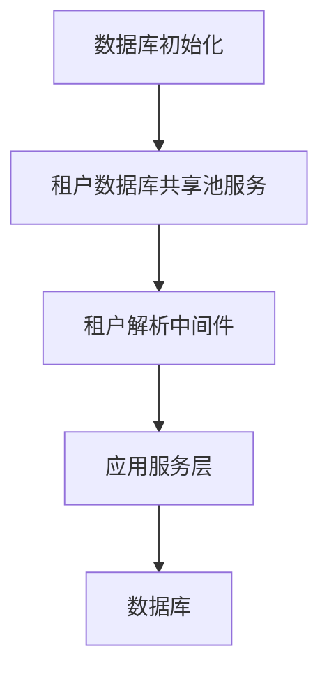
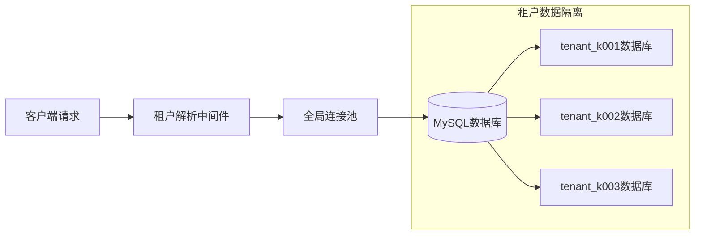
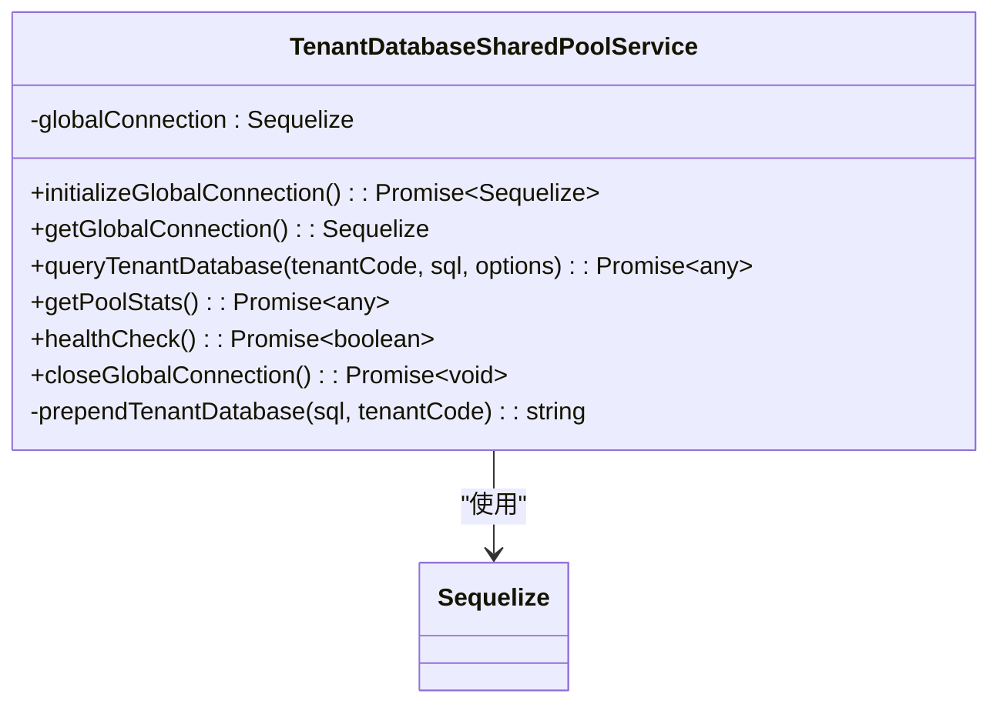
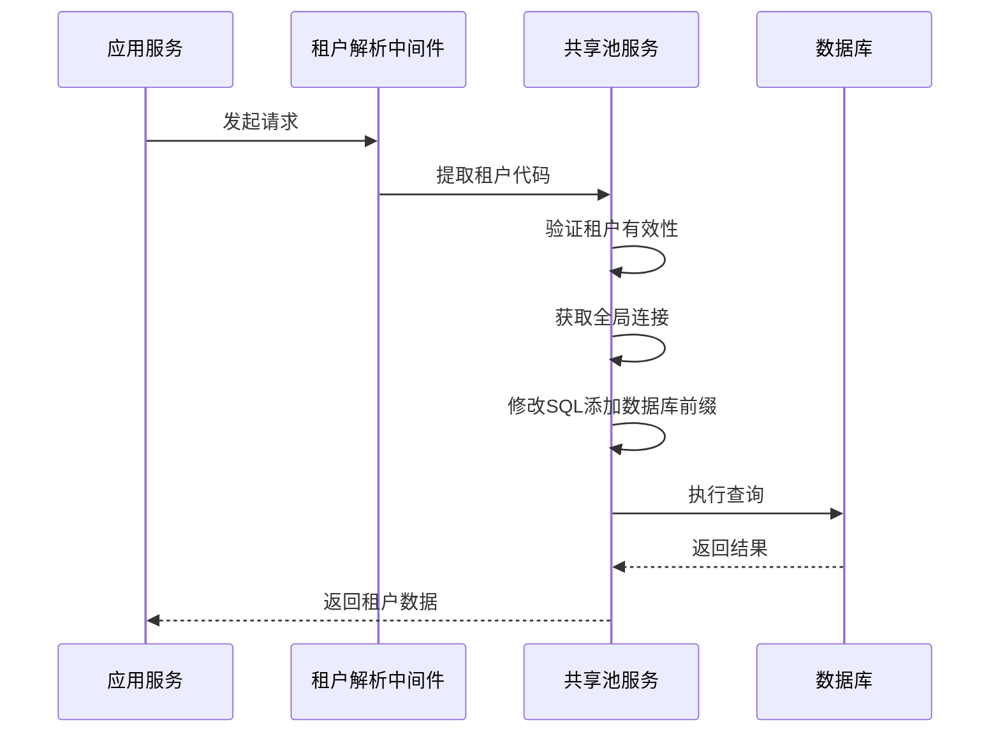
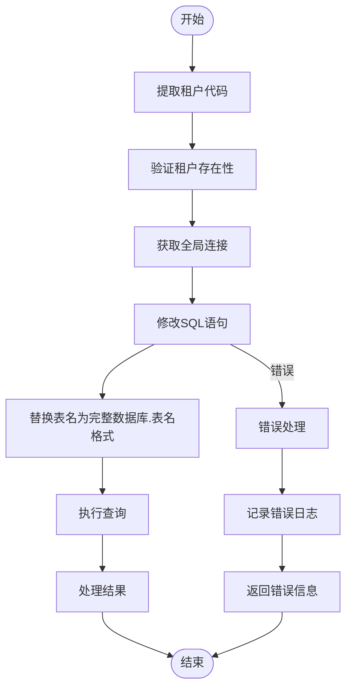
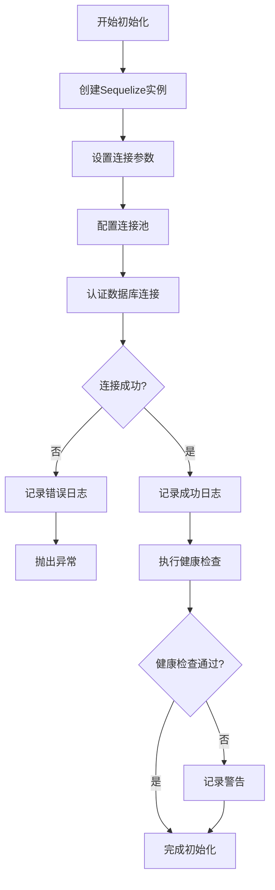
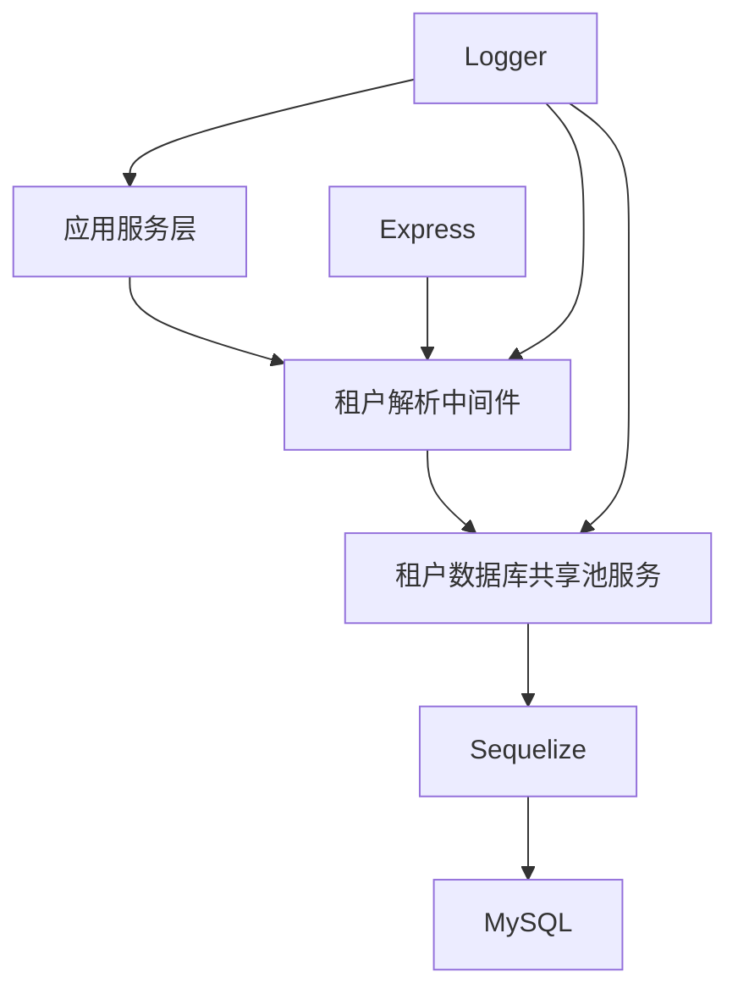

# 数据访问

<cite>
**本文档中引用的文件**  
- [database-initialization.ts](file://database-initialization.ts)
- [tenant-database-shared-pool.service.ts](file://tenant-database-shared-pool.service.ts)
- [tenant-resolver-shared-pool.middleware.ts](file://tenant-resolver-shared-pool.middleware.ts)
</cite>

## 目录
1. [简介](#简介)
2. [项目结构](#项目结构)
3. [核心组件](#核心组件)
4. [架构概述](#架构概述)
5. [详细组件分析](#详细组件分析)
6. [依赖分析](#依赖分析)
7. [性能考虑](#性能考虑)
8. [故障排除指南](#故障排除指南)
9. [结论](#结论)

## 简介
本文档详细描述了k.yyupgame系统中基于Sequelize的服务层如何封装数据库操作。重点介绍共享连接池设计模式下的数据访问机制，涵盖查询构建、事务管理、批量操作和错误处理等关键方面。同时阐述复杂查询实现方式、性能优化策略以及数据访问层的测试方法，为开发者提供高效、安全的数据访问最佳实践。

## 项目结构
k.yyupgame系统采用多租户架构，通过共享数据库连接池实现高效的数据访问。系统核心数据库服务位于根目录下，主要包括数据库初始化、租户数据库共享池服务和租户解析中间件三个关键文件。

**Diagram sources**
- [database-initialization.ts](file://database-initialization.ts)
- [tenant-database-shared-pool.service.ts](file://tenant-database-shared-pool.service.ts)
- [tenant-resolver-shared-pool.middleware.ts](file://tenant-resolver-shared-pool.middleware.ts)

**Section sources**
- [database-initialization.ts](file://database-initialization.ts)
- [tenant-database-shared-pool.service.ts](file://tenant-database-shared-pool.service.ts)
- [tenant-resolver-shared-pool.middleware.ts](file://tenant-resolver-shared-pool.middleware.ts)

## 核心组件
系统的核心数据访问组件包括数据库连接池初始化服务、租户数据库共享池服务和租户解析中间件。这些组件共同实现了多租户环境下的高效数据库访问模式，通过共享连接池减少资源消耗，提高系统性能。

**Section sources**
- [database-initialization.ts](file://database-initialization.ts)
- [tenant-database-shared-pool.service.ts](file://tenant-database-shared-pool.service.ts)
- [tenant-resolver-shared-pool.middleware.ts](file://tenant-resolver-shared-pool.middleware.ts)

## 架构概述
k.yyupgame系统采用改进的多租户数据库架构，所有租户共享一个全局数据库连接池。通过在SQL查询中动态添加租户数据库前缀（如`tenant_k001.users`），实现数据隔离。这种设计避免了为每个租户维护独立连接池的资源开销，同时保持了良好的扩展性。

**Diagram sources**
- [tenant-database-shared-pool.service.ts](file://tenant-database-shared-pool.service.ts)
- [tenant-resolver-shared-pool.middleware.ts](file://tenant-resolver-shared-pool.middleware.ts)

## 详细组件分析

### 租户数据库共享池服务分析
`TenantDatabaseSharedPoolService`类实现了全局数据库连接池的管理，提供连接初始化、查询执行、健康检查和连接关闭等核心功能。

#### 服务类结构

**Diagram sources**
- [tenant-database-shared-pool.service.ts](file://tenant-database-shared-pool.service.ts#L9-L177)

#### 查询执行流程

**Diagram sources**
- [tenant-database-shared-pool.service.ts](file://tenant-database-shared-pool.service.ts#L71-L92)
- [tenant-resolver-shared-pool.middleware.ts](file://tenant-resolver-shared-pool.middleware.ts#L26-L97)

#### SQL修改逻辑

**Diagram sources**
- [tenant-database-shared-pool.service.ts](file://tenant-database-shared-pool.service.ts#L98-L123)

**Section sources**
- [tenant-database-shared-pool.service.ts](file://tenant-database-shared-pool.service.ts#L1-L177)

### 数据库初始化分析
系统在启动时通过`initializeDatabasePool`函数初始化全局数据库连接池，并设置优雅关闭处理机制。

#### 初始化流程

**Diagram sources**
- [database-initialization.ts](file://database-initialization.ts#L13-L41)

**Section sources**
- [database-initialization.ts](file://database-initialization.ts#L1-L89)

## 依赖分析
系统数据访问层依赖于Sequelize ORM框架和Express Web框架，通过服务层封装实现业务逻辑与数据访问的分离。

**Diagram sources**
- [tenant-database-shared-pool.service.ts](file://tenant-database-shared-pool.service.ts)
- [tenant-resolver-shared-pool.middleware.ts](file://tenant-resolver-shared-pool.middleware.ts)
- [database-initialization.ts](file://database-initialization.ts)

**Section sources**
- [tenant-database-shared-pool.service.ts](file://tenant-database-shared-pool.service.ts)
- [tenant-resolver-shared-pool.middleware.ts](file://tenant-resolver-shared-pool.middleware.ts)
- [database-initialization.ts](file://database-initialization.ts)

## 性能考虑
系统通过共享连接池设计显著提升了数据库访问性能。连接池配置支持动态调整，最大连接数默认为30，最小连接数默认为5，可根据实际负载进行优化。

**Section sources**
- [tenant-database-shared-pool.service.ts](file://tenant-database-shared-pool.service.ts#L20-L36)

## 故障排除指南
当遇到数据库连接问题时，可按照以下步骤进行排查：
1. 检查环境变量配置（DB_HOST、DB_PORT、DB_USER、DB_PASSWORD）
2. 验证数据库服务是否正常运行
3. 检查连接池状态和统计信息
4. 查看应用日志中的错误详情

**Section sources**
- [tenant-database-shared-pool.service.ts](file://tenant-database-shared-pool.service.ts#L128-L139)
- [database-initialization.ts](file://database-initialization.ts#L37-L40)

## 结论
k.yyupgame系统通过创新的共享连接池设计，实现了高效、可扩展的多租户数据访问架构。该设计在保证数据隔离的同时，最大限度地利用了数据库连接资源，为系统性能和稳定性提供了坚实基础。建议开发者遵循文档中的最佳实践，合理使用数据访问服务，确保系统的高效运行。