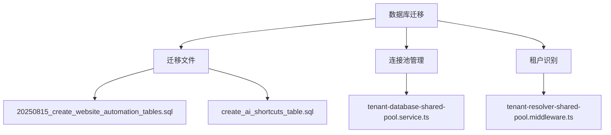
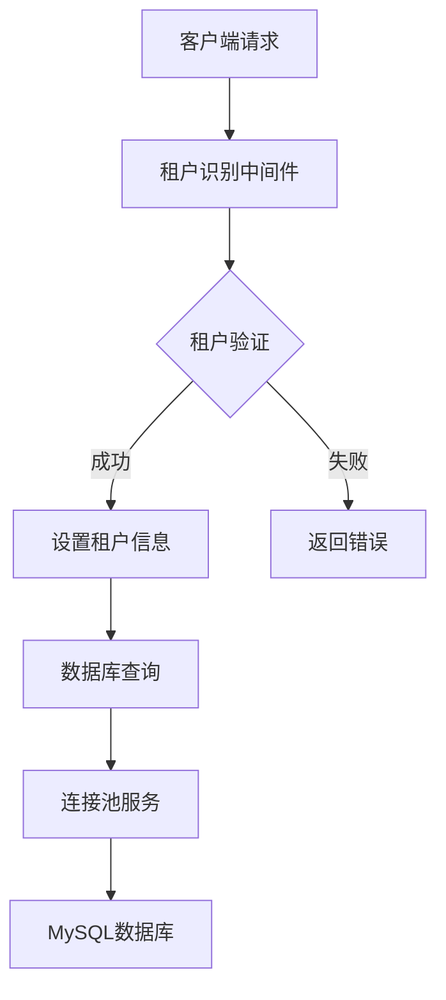
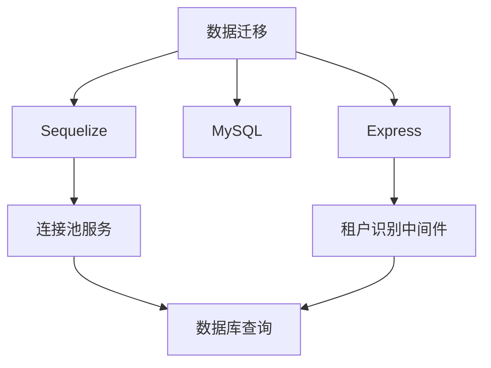

# 数据迁移

<cite>
**本文档引用的文件**  
- [20250815_create_website_automation_tables.sql](file://k.yyup.com/database/migrations/20250815_create_website_automation_tables.sql)
- [create_ai_shortcuts_table.sql](file://k.yyup.com/database/migrations/create_ai_shortcuts_table.sql)
- [database-initialization.ts](file://database-initialization.ts)
- [tenant-database-shared-pool.service.ts](file://tenant-database-shared-pool.service.ts)
- [tenant-resolver-shared-pool.middleware.ts](file://tenant-resolver-shared-pool.middleware.ts)
</cite>

## 目录
1. [引言](#引言)
2. [项目结构](#项目结构)
3. [核心组件](#核心组件)
4. [架构概述](#架构概述)
5. [详细组件分析](#详细组件分析)
6. [依赖分析](#依赖分析)
7. [性能考虑](#性能考虑)
8. [故障排除指南](#故障排除指南)
9. [结论](#结论)

## 引言
本文档详细说明k.yyupgame系统的数据库迁移机制，重点介绍基于Sequelize的数据库迁移流程。文档涵盖迁移文件的结构与命名约定、up和down方法的实现模式、版本控制策略、生产环境迁移应用与回滚机制、常见迁移操作示例、迁移脚本测试方法与安全措施、迁移系统执行流程以及开发者最佳实践。

## 项目结构
k.yyupgame系统的数据库迁移文件位于`k.yyup.com/database/migrations/`和`unified-tenant-system/database/migrations/`目录下。迁移文件采用SQL脚本形式，包含创建表、修改字段、添加索引、数据迁移等操作。系统使用共享连接池机制管理数据库连接，通过租户识别中间件实现多租户支持。



**图示来源**
- [20250815_create_website_automation_tables.sql](file://k.yyup.com/database/migrations/20250815_create_website_automation_tables.sql)
- [create_ai_shortcuts_table.sql](file://k.yyup.com/database/migrations/create_ai_shortcuts_table.sql)
- [tenant-database-shared-pool.service.ts](file://tenant-database-shared-pool.service.ts)
- [tenant-resolver-shared-pool.middleware.ts](file://tenant-resolver-shared-pool.middleware.ts)

**章节来源**
- [k.yyup.com/database/migrations/](file://k.yyup.com/database/migrations/)
- [unified-tenant-system/database/migrations/](file://unified-tenant-system/database/migrations/)

## 核心组件
k.yyupgame系统的数据迁移核心组件包括迁移文件、连接池服务和租户识别中间件。迁移文件定义了数据库结构变更，连接池服务管理数据库连接，租户识别中间件根据域名识别租户并设置相应的数据库连接。

**章节来源**
- [20250815_create_website_automation_tables.sql](file://k.yyup.com/database/migrations/20250815_create_website_automation_tables.sql)
- [create_ai_shortcuts_table.sql](file://k.yyup.com/database/migrations/create_ai_shortcuts_table.sql)
- [tenant-database-shared-pool.service.ts](file://tenant-database-shared-pool.service.ts)

## 架构概述
k.yyupgame系统采用共享连接池架构，所有租户共享一个连接池，通过完整表名访问不同数据库。租户识别中间件根据域名提取租户代码，验证租户存在性，并将租户信息和数据库连接设置到请求对象中。



**图示来源**
- [tenant-resolver-shared-pool.middleware.ts](file://tenant-resolver-shared-pool.middleware.ts)
- [tenant-database-shared-pool.service.ts](file://tenant-database-shared-pool.service.ts)

## 详细组件分析
### 迁移文件分析
迁移文件包含创建表、插入数据、添加权限等操作。文件命名采用时间戳加描述的方式，确保迁移顺序。

#### 创建表操作
```sql
CREATE TABLE IF NOT EXISTS automation_tasks (
  id CHAR(36) PRIMARY KEY DEFAULT (UUID()),
  name VARCHAR(200) NOT NULL COMMENT '任务名称',
  description TEXT COMMENT '任务描述',
  url VARCHAR(500) NOT NULL COMMENT '目标网站URL',
  steps JSON NOT NULL DEFAULT ('[]') COMMENT '任务步骤配置',
  config JSON NOT NULL DEFAULT ('{}') COMMENT '任务配置信息',
  status ENUM('pending', 'running', 'completed', 'failed', 'stopped') NOT NULL DEFAULT 'pending' COMMENT '任务状态',
  progress INT NOT NULL DEFAULT 0 COMMENT '执行进度（0-100）',
  template_id CHAR(36) COMMENT '关联的模板ID',
  user_id CHAR(36) NOT NULL COMMENT '创建用户ID',
  last_executed DATETIME COMMENT '最后执行时间',
  created_at DATETIME NOT NULL DEFAULT CURRENT_TIMESTAMP,
  updated_at DATETIME NOT NULL DEFAULT CURRENT_TIMESTAMP ON UPDATE CURRENT_TIMESTAMP,
  
  CONSTRAINT chk_progress CHECK (progress >= 0 AND progress <= 100),
  
  INDEX idx_automation_tasks_user_id (user_id),
  INDEX idx_automation_tasks_status (status),
  INDEX idx_automation_tasks_template_id (template_id),
  INDEX idx_automation_tasks_created_at (created_at),
  
  FOREIGN KEY (user_id) REFERENCES users(id) ON DELETE CASCADE,
  FOREIGN KEY (template_id) REFERENCES automation_templates(id) ON DELETE SET NULL
) ENGINE=InnoDB DEFAULT CHARSET=utf8mb4 COLLATE=utf8mb4_unicode_ci COMMENT='网站自动化任务表';
```

**图示来源**
- [20250815_create_website_automation_tables.sql](file://k.yyup.com/database/migrations/20250815_create_website_automation_tables.sql)

#### 插入数据操作
```sql
INSERT INTO automation_templates (
  id, name, description, category, complexity, steps, parameters, config, 
  usage_count, version, status, is_public, allow_parameterization, user_id
) VALUES 
(
  UUID(),
  '网站登录模板',
  '通用的网站登录流程模板，支持用户名密码登录',
  'web',
  'simple',
  JSON_ARRAY(
    JSON_OBJECT(
      'id', '1',
      'name', '打开登录页面',
      'action', 'navigate',
      'url', '{{loginUrl}}',
      'description', '导航到登录页面',
      'delay', 0,
      'optional', false,
      'screenshot', false,
      'enableParameterization', true
    ),
    JSON_OBJECT(
      'id', '2',
      'name', '输入用户名',
      'action', 'input',
      'selector', 'input[name="username"]',
      'text', '{{username}}',
      'description', '输入用户名',
      'delay', 500,
      'optional', false,
      'screenshot', false,
      'enableParameterization', true
    ),
    JSON_OBJECT(
      'id', '3',
      'name', '输入密码',
      'action', 'input',
      'selector', 'input[type="password"]',
      'text', '{{password}}',
      'description', '输入密码',
      'delay', 500,
      'optional', false,
      'screenshot', false,
      'enableParameterization', true
    ),
    JSON_OBJECT(
      'id', '4',
      'name', '点击登录按钮',
      'action', 'click',
      'selector', 'button[type="submit"]',
      'description', '点击登录按钮',
      'delay', 0,
      'optional', false,
      'screenshot', true,
      'enableParameterization', false
    )
  ),
  JSON_ARRAY(
    JSON_OBJECT(
      'id', '1',
      'name', 'loginUrl',
      'type', 'url',
      'defaultValue', 'https://example.com/login',
      'description', '登录页面URL',
      'required', true,
      'validation', ''
    ),
    JSON_OBJECT(
      'id', '2',
      'name', 'username',
      'type', 'string',
      'defaultValue', '',
      'description', '用户名',
      'required', true,
      'validation', '^[a-zA-Z0-9_]+$'
    ),
    JSON_OBJECT(
      'id', '3',
      'name', 'password',
      'type', 'string',
      'defaultValue', '',
      'description', '密码',
      'required', true,
      'validation', ''
    )
  ),
  JSON_OBJECT(
    'executionMode', 'sequential',
    'errorHandling', 'stop',
    'timeout', 60,
    'enableLogging', true,
    'screenshotOnError', true,
    'allowParameterization', true
  ),
  0,
  '1.0.0',
  'published',
  true,
  true,
  (SELECT id FROM users WHERE role = 'admin' LIMIT 1)
);
```

**图示来源**
- [20250815_create_website_automation_tables.sql](file://k.yyup.com/database/migrations/20250815_create_website_automation_tables.sql)

### 连接池服务分析
连接池服务使用Sequelize管理数据库连接，支持最大和最小连接数配置，提供健康检查和统计信息查询功能。

```typescript
export class TenantDatabaseSharedPoolService {
  private globalConnection: Sequelize | null = null;

  async initializeGlobalConnection(): Promise<Sequelize> {
    if (this.globalConnection) {
      return this.globalConnection;
    }

    const maxPoolSize = parseInt(process.env.DB_POOL_MAX || '30');
    const minPoolSize = parseInt(process.env.DB_POOL_MIN || '5');

    this.globalConnection = new Sequelize({
      host: process.env.DB_HOST || 'localhost',
      port: parseInt(process.env.DB_PORT || '3306'),
      username: process.env.DB_USER || 'root',
      password: process.env.DB_PASSWORD || '',
      database: 'mysql',
      dialect: 'mysql',
      timezone: '+08:00',
      pool: {
        max: maxPoolSize,
        min: minPoolSize,
        acquire: 30000,
        idle: 10000
      },
      logging: (msg: string) => {
        if (process.env.NODE_ENV === 'development') {
          logger.debug(`[数据库] ${msg}`);
        }
      }
    });

    try {
      await this.globalConnection.authenticate();
      logger.info('全局数据库连接成功', {
        host: process.env.DB_HOST,
        poolSize: `${minPoolSize}-${maxPoolSize}`,
        port: process.env.DB_PORT || 3306
      });
      return this.globalConnection;
    } catch (error) {
      logger.error('全局数据库连接失败', error);
      throw error;
    }
  }

  getGlobalConnection(): Sequelize {
    if (!this.globalConnection) {
      throw new Error('全局数据库连接未初始化');
    }
    return this.globalConnection;
  }

  async queryTenantDatabase(
    tenantCode: string,
    sql: string,
    options?: any
  ): Promise<any> {
    const connection = this.getGlobalConnection();
    
    const modifiedSql = this.prependTenantDatabase(sql, tenantCode);
    
    try {
      const result = await connection.query(modifiedSql, options);
      return result;
    } catch (error) {
      logger.error('租户数据库查询失败', {
        tenantCode,
        sql: modifiedSql,
        error
      });
      throw error;
    }
  }

  private prependTenantDatabase(sql: string, tenantCode: string): string {
    const databaseName = `tenant_${tenantCode}`;
    
    const tableNames = [
      'users', 'roles', 'permissions', 'user_roles',
      'classes', 'students', 'teachers', 'parents',
      'announcements', 'activities', 'enrollments'
    ];

    let modifiedSql = sql;
    for (const tableName of tableNames) {
      const regex = new RegExp(
        `(FROM|JOIN|INTO|UPDATE|DELETE FROM)\\s+${tableName}\\b`,
        'gi'
      );
      modifiedSql = modifiedSql.replace(
        regex,
        `$1 ${databaseName}.${tableName}`
      );
    }

    return modifiedSql;
  }

  async getPoolStats(): Promise<any> {
    const connection = this.getGlobalConnection();
    
    return {
      poolSize: {
        max: connection.options.pool?.max || 10,
        min: connection.options.pool?.min || 2
      },
      activeConnections: connection.connectionManager.pool?.size || 0,
      idleConnections: connection.connectionManager.pool?.idle?.length || 0
    };
  }

  async healthCheck(): Promise<boolean> {
    try {
      const connection = this.getGlobalConnection();
      await connection.authenticate();
      logger.info('数据库连接池健康检查通过');
      return true;
    } catch (error) {
      logger.error('数据库连接池健康检查失败', error);
      return false;
    }
  }

  async closeGlobalConnection(): Promise<void> {
    if (this.globalConnection) {
      try {
        await this.globalConnection.close();
        this.globalConnection = null;
        logger.info('全局数据库连接已关闭');
      } catch (error) {
        logger.error('关闭全局数据库连接失败', error);
      }
    }
  }
}

export const tenantDatabaseSharedPoolService = new TenantDatabaseSharedPoolService();
```

**图示来源**
- [tenant-database-shared-pool.service.ts](file://tenant-database-shared-pool.service.ts)

### 租户识别中间件分析
租户识别中间件根据域名提取租户代码，验证租户存在性，并将租户信息和数据库连接设置到请求对象中。

```typescript
export const tenantResolverSharedPoolMiddleware = async (
  req: RequestWithTenant,
  res: Response,
  next: NextFunction
): Promise<void> => {
  try {
    const domain = req.get('Host') || req.hostname;

    logger.info('[租户识别] 处理请求', {
      method: req.method,
      url: req.url,
      domain
    });

    const tenantCode = extractTenantCode(domain);

    if (!tenantCode) {
      logger.warn('[租户识别] 无法解析租户代码', { domain });

      if (process.env.NODE_ENV === 'production') {
        ApiResponse.error(res, '无法识别的租户域名', 'INVALID_TENANT_DOMAIN');
        return;
      } else {
        logger.info('[租户识别] 使用开发环境默认配置');
        req.tenant = {
          code: 'dev',
          domain: domain,
          databaseName: 'tenant_dev'
        };
        req.tenantDb = tenantDatabaseSharedPoolService.getGlobalConnection();
        next();
        return;
      }
    }

    const tenantInfo = await validateTenant(tenantCode);
    if (!tenantInfo) {
      logger.warn('[租户识别] 租户不存在或未激活', { tenantCode, domain });
      ApiResponse.error(res, '租户不存在或未激活', 'TENANT_NOT_FOUND');
      return;
    }

    req.tenant = {
      code: tenantCode,
      domain: domain,
      databaseName: `tenant_${tenantCode}`
    };

    try {
      req.tenantDb = tenantDatabaseSharedPoolService.getGlobalConnection();
      logger.info('[租户识别] 租户识别成功', {
        tenantCode,
        databaseName: req.tenant.databaseName
      });
    } catch (error) {
      logger.error('[租户识别] 获取数据库连接失败', { tenantCode, error });
      ApiResponse.error(res, '数据库连接失败', 'DB_CONNECTION_FAILED');
      return;
    }

    next();
  } catch (error) {
    logger.error('[租户识别] 中间件错误', error);
    ApiResponse.error(res, '租户识别失败', 'TENANT_RESOLVER_ERROR');
  }
};

function extractTenantCode(domain: string): string | null {
  const cleanDomain = domain.split(':')[0];

  const match = cleanDomain.match(/^(k\d+)\.yyup\.cc$/);
  if (match) {
    return match[1];
  }

  const altMatch = cleanDomain.match(/^([a-zA-Z0-9]+)\.(kindergarten|kyyup)\.com$/);
  if (altMatch) {
    return altMatch[1];
  }

  return null;
}

async function validateTenant(tenantCode: string): Promise<boolean> {
  try {
    return /^k\d+$/.test(tenantCode);
  } catch (error) {
    logger.error('[租户识别] 租户验证失败', { tenantCode, error });
    return false;
  }
}
```

**图示来源**
- [tenant-resolver-shared-pool.middleware.ts](file://tenant-resolver-shared-pool.middleware.ts)

**章节来源**
- [tenant-database-shared-pool.service.ts](file://tenant-database-shared-pool.service.ts)
- [tenant-resolver-shared-pool.middleware.ts](file://tenant-resolver-shared-pool.middleware.ts)

## 依赖分析
k.yyupgame系统的数据迁移依赖于Sequelize、MySQL和Express框架。连接池服务和租户识别中间件相互依赖，共同实现多租户数据库访问。



**图示来源**
- [tenant-database-shared-pool.service.ts](file://tenant-database-shared-pool.service.ts)
- [tenant-resolver-shared-pool.middleware.ts](file://tenant-resolver-shared-pool.middleware.ts)

**章节来源**
- [database-initialization.ts](file://database-initialization.ts)
- [tenant-database-shared-pool.service.ts](file://tenant-database-shared-pool.service.ts)

## 性能考虑
k.yyupgame系统的数据迁移性能考虑包括连接池配置、SQL语句优化和健康检查。连接池配置合理设置最大和最小连接数，避免资源浪费和连接不足。SQL语句优化通过索引和查询条件减少数据库负载。健康检查确保数据库连接的可用性。

**章节来源**
- [tenant-database-shared-pool.service.ts](file://tenant-database-shared-pool.service.ts)
- [database-initialization.ts](file://database-initialization.ts)

## 故障排除指南
### 数据库连接失败
检查数据库连接配置，确保主机、端口、用户名、密码正确。检查网络连接，确保数据库服务器可达。

### 租户识别失败
检查域名格式，确保符合`k001.yyup.cc`或`k001.kindergarten.com`格式。检查租户代码正则表达式匹配。

### 迁移文件执行失败
检查SQL语法，确保符合MySQL语法。检查表名和字段名是否存在。检查外键约束。

**章节来源**
- [tenant-resolver-shared-pool.middleware.ts](file://tenant-resolver-shared-pool.middleware.ts)
- [tenant-database-shared-pool.service.ts](file://tenant-database-shared-pool.service.ts)
- [database-initialization.ts](file://database-initialization.ts)

## 结论
k.yyupgame系统的数据迁移机制基于Sequelize实现，采用共享连接池架构和租户识别中间件，支持多租户数据库访问。迁移文件包含创建表、插入数据、添加权限等操作，确保数据库结构和数据的一致性。系统通过健康检查和统计信息查询功能，确保数据库连接的可用性和性能。