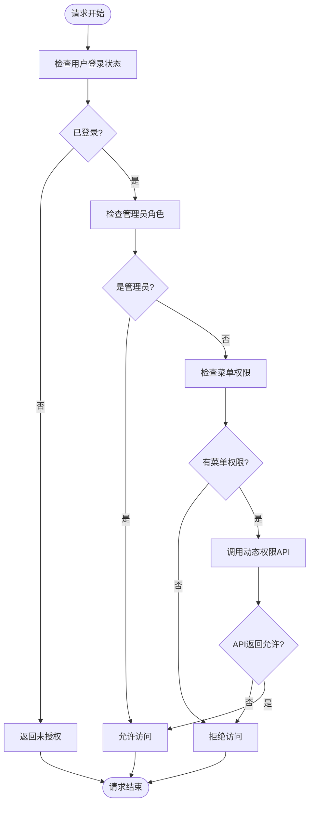
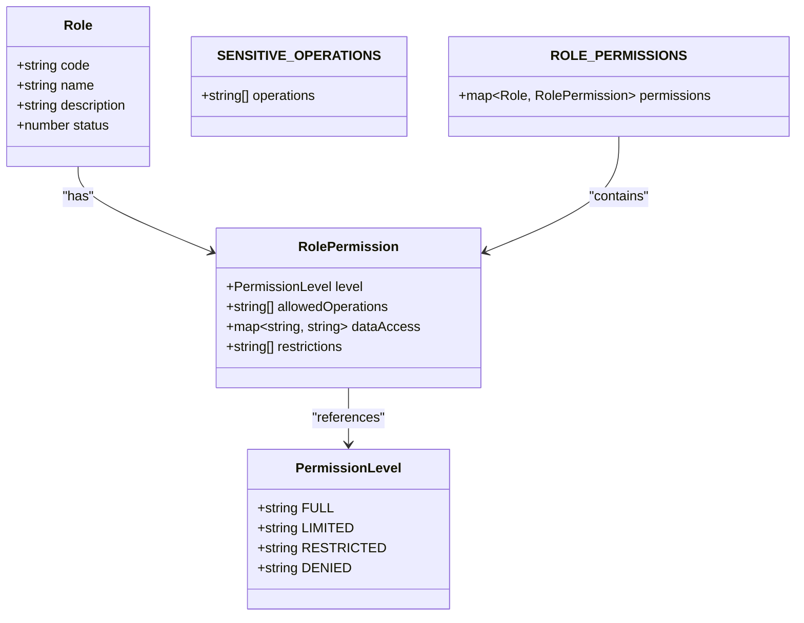
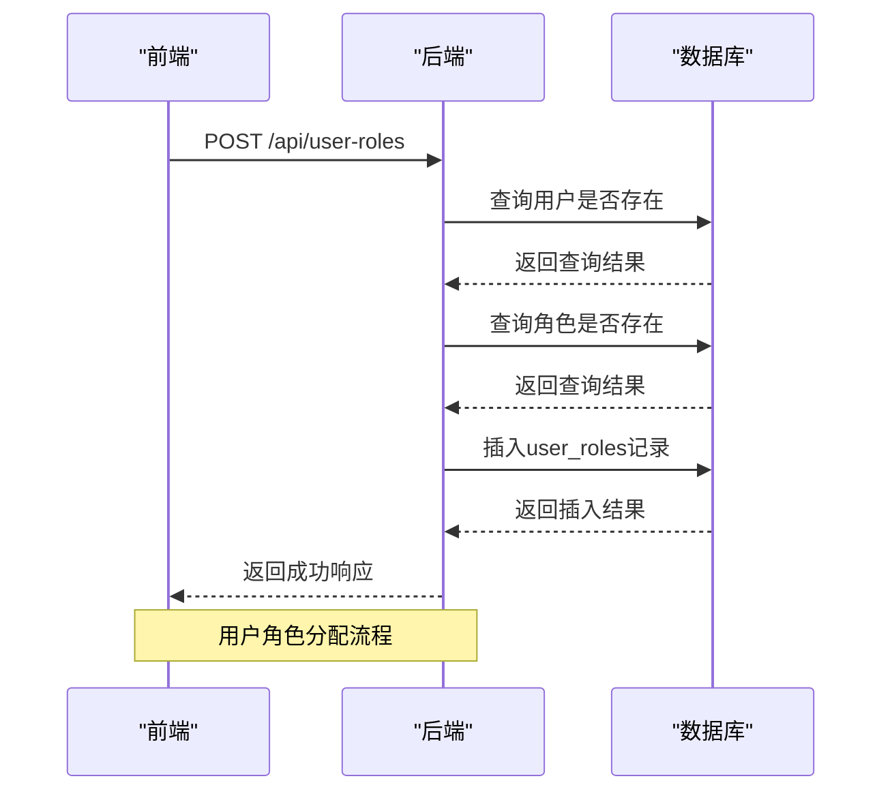
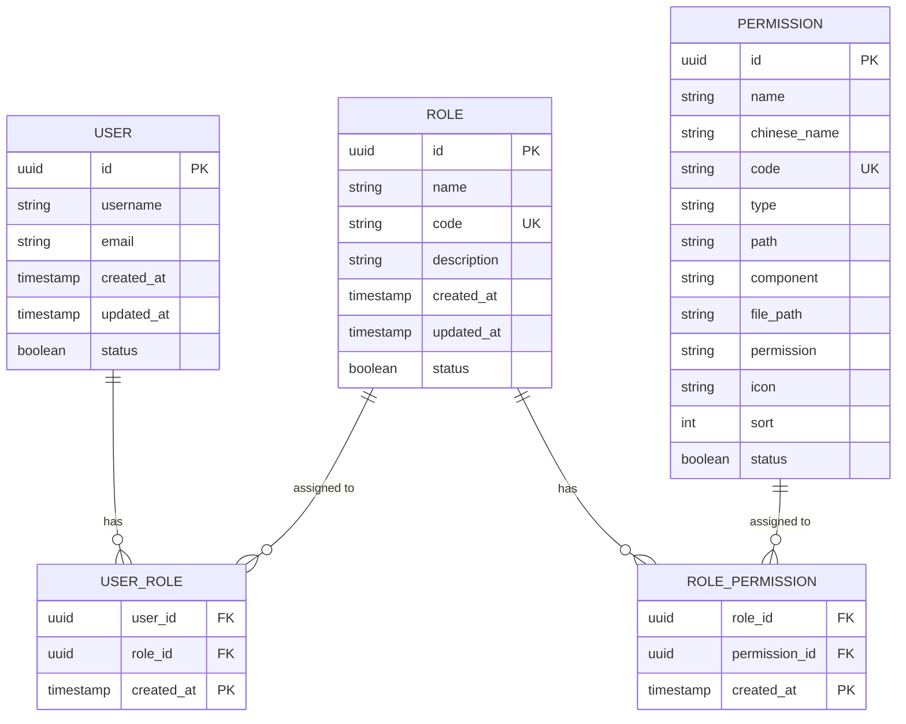
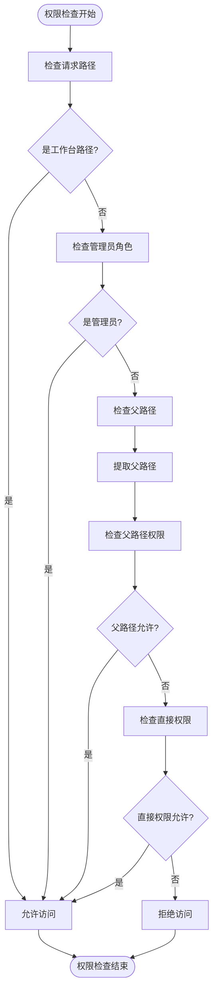

# RBAC设计

<cite>
**本文档引用的文件**   
- [permissions.ts](file://k.yyup.com/backup/permission-system/permissions.ts)
- [permission-cache.service.ts](file://k.yyup.com/backup/permission-system/permission-cache.service.ts)
- [role-cache.service.ts](file://k.yyup.com/backup/permission-system/role-cache.service.ts)
- [permission-cache.controller.ts](file://k.yyup.com/backup/permission-system/permission-cache.controller.ts)
- [rbac.middleware.ts](file://k.yyup.com/server/src/middlewares/rbac.middleware.ts)
- [permission.ts](file://k.yyup.com/client/src/api/modules/permission.ts)
- [add-ai-assistant-permissions.sql](file://k.yyup.com/add-ai-assistant-permissions.sql)
- [add-dashboard-permissions.sql](file://k.yyup.com/add-dashboard-permissions.sql)
- [add-analytics-center-permission.sql](file://k.yyup.com/add-analytics-center-permission.sql)
</cite>

## 目录
1. [引言](#引言)
2. [核心数据模型设计](#核心数据模型设计)
3. [权限粒度控制](#权限粒度控制)
4. [角色层级与继承](#角色层级与继承)
5. [用户与角色关系](#用户与角色关系)
6. [数据库ER图](#数据库er图)
7. [代码实现示例](#代码实现示例)
8. [权限继承与覆盖规则](#权限继承与覆盖规则)
9. [应用场景](#应用场景)

## 引言

k.yyupgame权限系统采用基于角色的访问控制（RBAC）模型，通过权限、角色和用户三个核心实体构建灵活的权限管理体系。系统设计兼顾安全性与灵活性，支持细粒度的权限控制、角色继承和组合，满足复杂组织结构下的权限管理需求。

**Section sources**
- [permissions.ts](file://k.yyup.com/backup/permission-system/permissions.ts#L1-L513)
- [rbac.middleware.ts](file://k.yyup.com/server/src/middlewares/rbac.middleware.ts#L1-L568)

## 核心数据模型设计

权限系统的核心由三个主要实体构成：权限（Permission）、角色（Role）和用户（User）。这些实体通过多对多关系相互关联，形成灵活的权限分配机制。

### 权限实体

权限实体定义了系统中的最小访问单元，包含以下关键属性：
- **id**: 权限唯一标识符
- **name**: 权限名称（英文）
- **chinese_name**: 权限中文名称
- **code**: 权限代码（唯一标识）
- **type**: 权限类型（category/menu/button等）
- **path**: 对应的路由路径
- **component**: 对应的组件路径
- **permission**: 权限字符串
- **icon**: 图标标识
- **sort**: 排序序号
- **status**: 状态（1:启用，0:禁用）

权限实体通过`role_permissions`关联表与角色实体建立多对多关系。

### 角色实体

角色实体代表一组权限的集合，包含以下关键属性：
- **id**: 角色唯一标识符
- **name**: 角色名称
- **code**: 角色代码（唯一标识）
- **description**: 角色描述
- **status**: 状态（1:启用，0:禁用）

角色实体通过`user_roles`关联表与用户实体建立多对多关系，通过`role_permissions`关联表与权限实体建立多对多关系。

### 用户实体

用户实体代表系统中的实际使用者，包含用户基本信息和权限分配。用户通过`user_roles`关联表与角色建立多对多关系，间接获得权限。

**Section sources**
- [permissions.ts](file://k.yyup.com/backup/permission-system/permissions.ts#L19-L33)
- [permission-cache.service.ts](file://k.yyup.com/backup/permission-system/permission-cache.service.ts#L19-L33)

## 权限粒度控制

系统实现了多层次的权限粒度控制，支持从页面级到按钮级的精细权限管理。

### 权限级别

系统定义了四个权限级别，用于控制访问深度：
- **FULL（完全访问）**: 拥有所有操作权限
- **LIMITED（受限访问）**: 拥有部分操作权限
- **RESTRICTED（高度受限）**: 仅拥有基本操作权限
- **DENIED（拒绝访问）**: 无访问权限

### 操作权限

系统支持细粒度的操作权限控制，包括但不限于：
- 查看（view）
- 创建（create）
- 编辑（edit）
- 删除（delete）
- 导出（export）
- 导入（import）

这些操作权限通过权限代码（code）进行标识，如`DASHBOARD_VIEW`、`USER_CREATE`等。

### 权限验证流程

权限验证采用多级验证机制：
1. **Level 1**: 菜单权限验证，检查用户是否有访问特定菜单的权限
2. **Level 2**: 页面权限验证，通过API进行动态权限校验
3. **Level 3**: 操作权限验证，检查用户是否有执行特定操作的权限
4. **Level 4**: 权限代码验证，直接验证权限代码



**Diagram sources**
- [permissions.ts](file://k.yyup.com/backup/permission-system/permissions.ts#L219-L247)
- [rbac.middleware.ts](file://k.yyup.com/server/src/middlewares/rbac.middleware.ts#L170-L205)

## 角色层级与继承

系统支持角色的层级结构和继承机制，通过角色组合实现复杂的权限配置。

### 预定义角色

系统预定义了四种核心角色：
- **ADMIN（管理员）**: 拥有系统所有权限
- **PRINCIPAL（园长）**: 拥有学校管理权限
- **TEACHER（教师）**: 拥有班级和学生管理权限
- **PARENT（家长）**: 拥有子女相关信息查看权限

### 角色权限映射

每个角色都有明确的权限映射，定义了该角色可以执行的操作和访问的数据范围：



**Diagram sources**
- [rbac.middleware.ts](file://k.yyup.com/server/src/middlewares/rbac.middleware.ts#L26-L156)

### 角色继承机制

系统通过角色组合实现权限继承，支持以下特性：
- **权限叠加**: 用户拥有多个角色时，权限自动叠加
- **权限覆盖**: 特定场景下高级别权限可覆盖低级别权限
- **权限限制**: 某些敏感操作需要特定角色才能执行

## 用户与角色关系

系统实现了用户与角色的多对多关系，支持灵活的角色分配和管理。

### 多对多关系实现

用户与角色的关系通过`user_roles`关联表实现：
- **user_id**: 用户ID
- **role_id**: 角色ID
- **created_at**: 创建时间
- **updated_at**: 更新时间

这种设计允许一个用户拥有多个角色，一个角色也可以分配给多个用户。

### 角色分配API

系统提供了完整的角色分配API接口：



**Diagram sources**
- [permission-cache.service.ts](file://k.yyup.com/backup/permission-system/permission-cache.service.ts#L66-L74)
- [role-cache.service.ts](file://k.yyup.com/backup/permission-system/role-cache.service.ts#L173-L190)

### 管理界面

系统提供了角色管理界面，支持以下功能：
- 角色创建、编辑、删除
- 权限批量分配
- 用户角色分配
- 角色使用统计

## 数据库ER图

以下是权限系统的数据库实体关系图：



**Diagram sources**
- [permission-cache.service.ts](file://k.yyup.com/backup/permission-system/permission-cache.service.ts#L19-L33)
- [role-cache.service.ts](file://k.yyup.com/backup/permission-system/role-cache.service.ts#L12-L23)

## 权限继承与覆盖规则

系统实现了复杂的权限继承和覆盖规则，以适应不同的业务场景。

### 权限继承规则

1. **路径继承**: 详情页权限继承自列表页权限
   - 如果用户有权访问`/users`列表页，则自动有权访问`/users/:id`详情页
   - 实现方式：当详情页权限验证失败时，自动检查父路径权限

2. **角色继承**: 高级别角色继承低级别角色权限
   - 管理员角色自动拥有园长、教师、家长的所有权限
   - 通过角色代码（code）的层级关系实现

3. **默认权限**: 所有登录用户默认拥有工作台访问权限
   - 路径`/dashboard`和`/`对所有登录用户开放
   - 无需额外权限配置

### 权限覆盖规则

1. **显式拒绝优先**: 当存在显式拒绝权限时，覆盖所有其他权限
   - 例如：即使用户有`USER_MANAGE`权限，但如果被明确拒绝`USER_DELETE`权限，则不能删除用户

2. **敏感操作限制**: 某些敏感操作需要额外验证
   - 如系统配置修改、财务数据访问等
   - 通过`SENSITIVE_OPERATIONS`列表定义

3. **上下文感知**: 权限验证考虑请求上下文
   - 根据消息内容自动识别请求类型
   - 不同请求类型应用不同权限策略



**Diagram sources**
- [permissions.ts](file://k.yyup.com/backup/permission-system/permissions.ts#L376-L398)
- [rbac.middleware.ts](file://k.yyup.com/server/src/middlewares/rbac.middleware.ts#L358-L410)

## 应用场景

RBAC权限系统在k.yyupgame中有多种应用场景，满足不同业务需求。

### 多租户环境

在多租户环境下，系统通过角色和权限的组合实现租户隔离：
- 每个租户的管理员只能管理本租户的数据
- 园长只能查看和管理本园所的数据
- 教师只能访问自己负责的班级和学生

### 组织架构变化

当组织架构发生变化时，系统能够快速适应：
- 新增角色：通过创建新角色并分配相应权限
- 角色调整：修改角色权限配置，自动更新所有相关用户权限
- 用户调动：只需调整用户的角色分配，无需修改权限配置

### 安全审计

系统提供了完整的权限审计功能：
- 记录权限变更历史
- 监控权限使用情况
- 检测异常权限访问

### 缓存管理

系统实现了高效的权限缓存机制：
- Redis缓存用户权限、角色权限和动态路由
- 缓存自动失效和刷新机制
- 管理员可手动刷新缓存

```mermaid
graph TB
subgraph "前端"
UI[用户界面]
Store[权限Store]
end
subgraph "后端"
API[权限API]
Cache[Redis缓存]
DB[(数据库)]
end
UI --> Store
Store --> API
API --> Cache
Cache --> DB
DB --> Cache
Cache --> API
API --> Store
Store --> UI
Note over Cache,API: 权限缓存流程
```

**Diagram sources**
- [permission-cache.service.ts](file://k.yyup.com/backup/permission-system/permission-cache.service.ts#L50-L572)
- [permission-cache.controller.ts](file://k.yyup.com/backup/permission-system/permission-cache.controller.ts#L1-L390)

## 代码实现示例

以下是权限系统的关键代码实现示例。

### 定义新权限

通过SQL脚本定义新权限：

```sql
INSERT INTO permissions (name, chinese_name, code, type, path, component, permission, icon, sort, status) 
VALUES 
('AI助手', 'AI助手', 'AI_ASSISTANT', 'menu', '/ai-assistant', 'pages/ai-assistant/index.vue', 'ai_assistant:view', 'Robot', 1, 1),
('AI分析', 'AI分析', 'AI_ANALYTICS', 'menu', '/ai-analytics', 'pages/ai-analytics/index.vue', 'ai_analytics:view', 'Chart', 2, 1);
```

**Section sources**
- [add-ai-assistant-permissions.sql](file://k.yyup.com/add-ai-assistant-permissions.sql#L1-L10)
- [add-ai-analytics-permissions.js](file://k.yyup.com/add-ai-analytics-permissions.js#L1-L20)

### 创建新角色

创建新角色并分配权限：

```javascript
// 创建角色
const createRole = async (roleData) => {
  const role = await Role.create(roleData);
  
  // 分配权限
  const permissions = await Permission.findAll({
    where: { code: roleData.defaultPermissions }
  });
  
  await role.addPermissions(permissions);
  
  return role;
};

// 使用示例
createRole({
  name: '教学主管',
  code: 'TEACHING_MANAGER',
  description: '负责教学管理的主管角色',
  defaultPermissions: ['TEACHING_CENTER', 'CLASS_MANAGE', 'STUDENT_VIEW']
});
```

**Section sources**
- [permission-cache.service.ts](file://k.yyup.com/backup/permission-system/permission-cache.service.ts#L141-L183)
- [role-cache.service.ts](file://k.yyup.com/backup/permission-system/role-cache.service.ts#L38-L54)

### 分配角色给用户

将角色分配给用户：

```typescript
// 分配角色给用户
const assignRoleToUser = async (userId: number, roleCode: string) => {
  const user = await User.findByPk(userId);
  const role = await Role.findOne({ where: { code: roleCode } });
  
  if (!user || !role) {
    throw new Error('用户或角色不存在');
  }
  
  // 检查用户是否已拥有该角色
  const existing = await user.hasRole(role);
  if (existing) {
    return { message: '用户已拥有该角色' };
  }
  
  // 分配角色
  await user.addRole(role);
  
  // 清除用户权限缓存
  await PermissionCacheService.clearUserCache(userId);
  
  return { message: '角色分配成功' };
};
```

**Section sources**
- [permission-cache.service.ts](file://k.yyup.com/backup/permission-system/permission-cache.service.ts#L462-L484)
- [role-cache.service.ts](file://k.yyup.com/backup/permission-system/role-cache.service.ts#L173-L190)

### 权限检查中间件

RBAC权限检查中间件实现：

```typescript
export function createRBACMiddleware() {
  return (req: Request, res: Response, next: NextFunction) => {
    try {
      // 从请求中提取安全上下文
      const context = extractSecurityContext(req);
      
      // 验证权限
      const permissionCheck = validatePermissions(context);
      
      if (!permissionCheck.allowed) {
        return res.status(403).json({
          success: false,
          error: 'Access Denied',
          message: permissionCheck.reason,
          code: 'RBAC_PERMISSION_DENIED'
        });
      }
      
      // 将安全上下文附加到请求对象
      req.securityContext = {
        ...context,
        permissionLevel: permissionCheck.level,
        allowedOperations: permissionCheck.allowedOperations
      };
      
      next();
      
    } catch (error) {
      console.error('❌ RBAC中间件错误:', error);
      return res.status(500).json({
        success: false,
        error: 'Security Check Failed',
        message: '权限验证过程中发生错误'
      });
    }
  };
}
```

**Section sources**
- [rbac.middleware.ts](file://k.yyup.com/server/src/middlewares/rbac.middleware.ts#L170-L205)

## 总结

k.yyupgame的RBAC权限系统通过精心设计的数据模型和灵活的权限控制机制，实现了安全、可扩展的权限管理。系统支持细粒度的权限控制、角色继承和组合，能够适应复杂的组织结构和业务需求。通过缓存优化和多级验证机制，系统在保证安全性的同时提供了良好的性能表现。