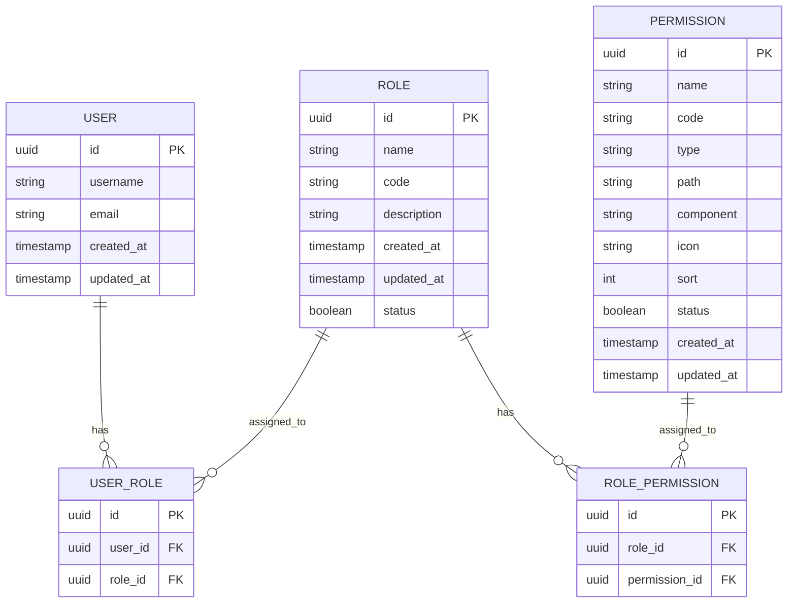
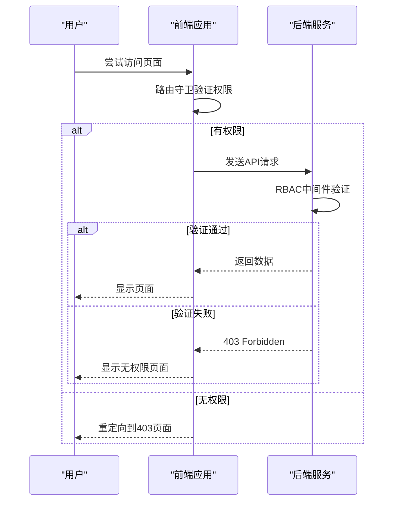
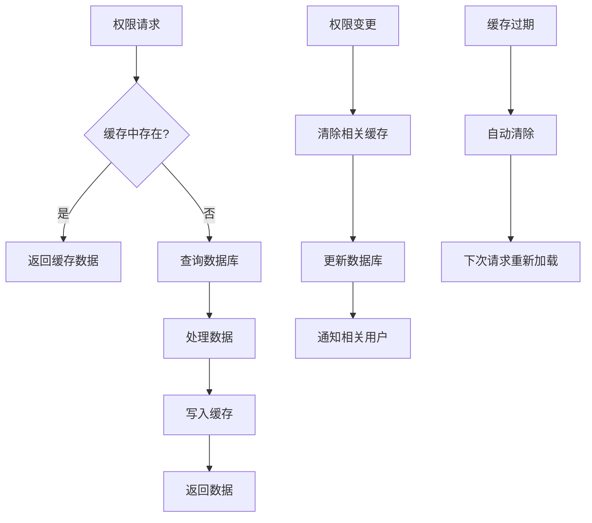
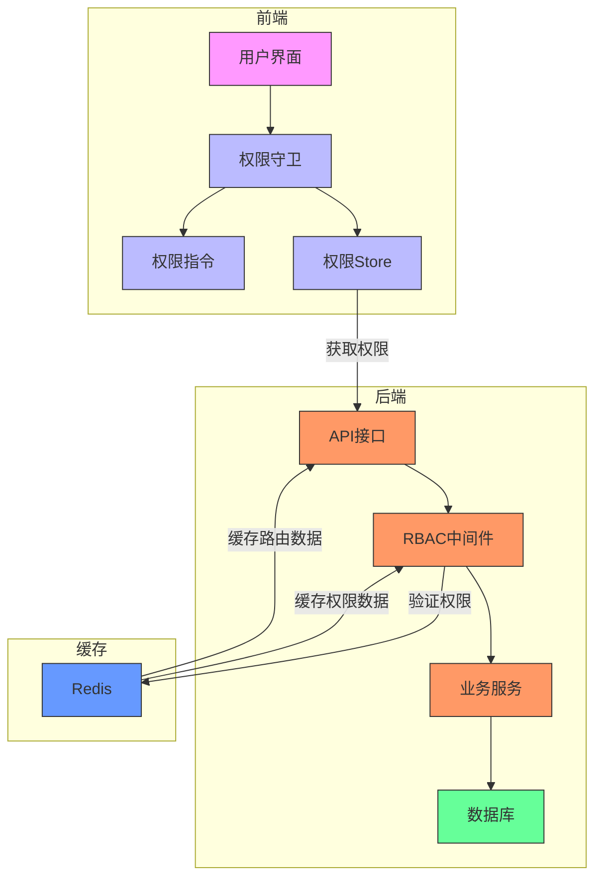

# 权限系统

<cite>
**本文档引用的文件**   
- [permissions.ts](file://k.yyup.com/backup/permission-system/permissions.ts)
- [permission-cache.service.ts](file://k.yyup.com/backup/permission-system/permission-cache.service.ts)
- [permission-cache.controller.ts](file://k.yyup.com/backup/permission-system/permission-cache.controller.ts)
- [role-cache.service.ts](file://k.yyup.com/backup/permission-system/role-cache.service.ts)
- [route-cache.service.ts](file://k.yyup.com/backup/permission-system/route-cache.service.ts)
- [rbac.middleware.ts](file://k.yyup.com/server/src/middlewares/rbac.middleware.ts)
- [permission.guard.ts](file://k.yyup.com/client/src/guards/permission.guard.ts)
- [permission.ts](file://k.yyup.com/client/src/directives/permission.ts)
- [auth-permissions.ts](file://k.yyup.com/client/src/api/modules/auth-permissions.ts)
</cite>

## 目录
1. [简介](#简介)
2. [权限模型设计](#权限模型设计)
3. [权限分配机制](#权限分配机制)
4. [权限验证流程](#权限验证流程)
5. [权限缓存策略](#权限缓存策略)
6. [动态权限更新](#动态权限更新)
7. [开发者指南](#开发者指南)
8. [权限系统架构图](#权限系统架构图)

## 简介

本项目权限系统基于角色的访问控制（RBAC）实现，为k.yyupgame平台提供全面的安全控制。系统通过权限、角色、用户三个核心实体的关系，实现了灵活而安全的访问控制机制。权限系统覆盖从前端路由守卫到后端API中间件的完整验证链条，确保用户只能访问其被授权的资源。

权限系统采用多层级验证机制，包括菜单权限、页面访问权限和操作权限，满足不同粒度的权限控制需求。同时，系统集成了Redis缓存策略，显著提升了权限验证的性能。通过动态权限更新机制，管理员可以在不重启服务的情况下调整权限配置，提高了系统的灵活性和可用性。

**Section sources**
- [permissions.ts](file://k.yyup.com/backup/permission-system/permissions.ts)
- [rbac.middleware.ts](file://k.yyup.com/server/src/middlewares/rbac.middleware.ts)

## 权限模型设计

权限系统采用标准的RBAC（基于角色的访问控制）模型，包含权限、角色和用户三个核心实体。权限是系统中最基本的授权单位，代表对特定资源的访问或操作能力。角色是权限的集合，用于对权限进行逻辑分组。用户通过被分配角色来获得相应的权限。

在系统中，权限以树形结构组织，包含类别（category）、菜单（menu）、页面（page）和按钮（button）等不同类型。每个权限都有唯一的代码（code）、路径（path）和排序值（sort），便于系统识别和管理。角色定义了用户在系统中的身份，如管理员（admin）、园长（principal）、教师（teacher）和家长（parent），每个角色拥有不同的权限集合。

用户与角色之间是多对多关系，一个用户可以拥有多个角色，一个角色也可以分配给多个用户。这种设计提供了极大的灵活性，可以根据实际业务需求进行复杂的权限配置。系统还支持管理员角色的特殊权限，管理员拥有所有资源的完全访问权限。

**Diagram sources**
- [permissions.ts](file://k.yyup.com/backup/permission-system/permissions.ts)
- [rbac.middleware.ts](file://k.yyup.com/server/src/middlewares/rbac.middleware.ts)

## 权限分配机制

权限分配机制采用两级分配模式：首先将权限分配给角色，然后将角色分配给用户。这种间接分配方式简化了权限管理，提高了系统的可维护性。当需要调整权限时，只需修改角色的权限集合，所有拥有该角色的用户将自动获得新的权限。

在后端实现中，权限与角色的关联通过`role_permissions`中间表维护。当管理员为角色分配权限时，系统会在该表中创建相应的记录。用户与角色的关联则通过`user_roles`表维护。这种设计遵循数据库规范化原则，避免了数据冗余。

前端通过API接口获取用户的权限信息。`getUserPermissions`接口返回用户拥有的所有权限代码，`getUserMenu`接口返回用户可访问的菜单项，`getUserRoles`接口返回用户的所有角色。这些数据在前端存储中进行缓存，供后续权限验证使用。

权限分配还支持继承机制。当用户拥有多个角色时，其权限是所有角色权限的并集。此外，系统支持权限的层级继承，子路径的权限可以继承父路径的权限，简化了权限配置。

**Section sources**
- [permission-cache.service.ts](file://k.yyup.com/backup/permission-system/permission-cache.service.ts)
- [auth-permissions.ts](file://k.yyup.com/client/src/api/modules/auth-permissions.ts)

## 权限验证流程

权限验证流程从前端路由守卫开始，到后端API中间件结束，形成完整的验证链条。前端路由守卫在用户尝试访问页面时进行初步验证，后端API中间件在处理请求时进行最终验证，确保权限控制的双重保障。

前端权限验证分为两个层级：Level 1是菜单权限验证，通过`hasPermission`方法检查用户是否有访问特定路径的权限；Level 2是页面访问权限验证，通过`checkPagePermission`方法调用后端API进行更严格的权限检查。验证结果会被缓存5分钟，减少重复验证的开销。

后端权限验证由RBAC中间件实现。中间件从请求中提取安全上下文，包括用户ID、角色、请求类型等信息，然后根据预定义的权限规则进行验证。对于敏感操作，如系统配置修改、财务数据访问等，只有特定角色才能执行。验证失败时，中间件返回403状态码，阻止请求继续执行。

**Diagram sources**
- [permission.guard.ts](file://k.yyup.com/client/src/guards/permission.guard.ts)
- [rbac.middleware.ts](file://k.yyup.com/server/src/middlewares/rbac.middleware.ts)

## 权限缓存策略

权限系统采用Redis缓存策略，显著提升了权限验证的性能。缓存策略包括用户权限缓存、角色权限缓存、动态路由缓存和权限检查缓存，覆盖了权限验证的主要场景。

`PermissionCacheService`是权限缓存的核心服务，提供了多种缓存方法。`getUserPermissions`方法缓存用户权限列表，TTL为30分钟；`getRolePermissions`方法缓存角色权限列表，TTL为60分钟；`getDynamicRoutes`方法缓存用户动态路由，TTL为30分钟。这些缓存有效减少了数据库查询次数，提高了系统响应速度。

缓存键采用统一的前缀命名规范，如`user:permissions:`、`role:permissions:`、`dynamic:routes:`等，便于管理和监控。系统还提供了缓存清除功能，包括清除用户缓存、清除角色缓存和清除所有缓存，确保权限变更能够及时生效。

缓存统计功能可以监控缓存的使用情况，包括各种缓存的数量和命中率。管理员可以通过管理接口查看缓存状态，诊断性能问题。缓存预热功能在系统启动时加载常用数据到缓存，避免冷启动时的性能下降。

**Diagram sources**
- [permission-cache.service.ts](file://k.yyup.com/backup/permission-system/permission-cache.service.ts)
- [role-cache.service.ts](file://k.yyup.com/backup/permission-system/role-cache.service.ts)

## 动态权限更新

动态权限更新机制允许管理员在不重启服务的情况下更新权限配置。系统通过缓存失效机制和事件通知，确保权限变更能够及时生效。管理员可以通过管理界面手动刷新权限缓存，或者系统在检测到权限数据变更时自动触发缓存更新。

`PermissionCacheController`提供了管理员缓存管理接口，包括刷新权限缓存、查看缓存状态、获取权限变更历史等功能。`refreshPermissionCache`方法可以手动刷新所有权限缓存，`getCacheStatus`方法返回缓存的详细状态信息，包括路由数量、加载时间、健康状态等。

系统还实现了权限变更监听服务，监控数据库中的权限相关表。当权限、角色或用户角色关系发生变化时，监听服务会自动清除相关缓存，并通知在线用户权限已更新。这种机制确保了权限变更的实时性和一致性。

对于紧急情况，系统提供了强制刷新缓存功能。当缓存出现异常时，管理员可以调用`forceRefreshCache`方法强制重新加载所有权限数据。缓存预热功能可以在系统负载较低时预先加载常用数据到缓存，提高系统性能。

**Section sources**
- [permission-cache.controller.ts](file://k.yyup.com/backup/permission-system/permission-cache.controller.ts)
- [route-cache.service.ts](file://k.yyup.com/backup/permission-system/route-cache.service.ts)

## 开发者指南

开发者在使用权限系统时，应遵循以下最佳实践。首先，添加新权限时，需要在数据库中创建相应的权限记录，并确保其代码、路径和类型正确。然后，将新权限分配给需要的角色，系统会自动处理权限的继承和验证。

创建新角色时，需要定义角色的代码和描述，并为其分配适当的权限集合。角色代码应采用大写字母和下划线的命名规范，如`TEACHER_MANAGEMENT`、`FINANCIAL_REPORT_VIEW`等，确保代码的可读性和一致性。

调试权限问题时，可以查看前端控制台的权限验证日志，了解权限检查的详细过程。前端权限验证日志会显示权限检查的结果、缓存命中情况等信息。后端日志会记录RBAC中间件的验证过程，包括安全上下文、请求类型、验证结果等。

权限系统提供了丰富的API接口，开发者可以通过这些接口实现自定义的权限逻辑。`checkPermission`接口用于检查用户是否有访问特定路径的权限，`getUserPermissions`接口返回用户的所有权限代码，`getUserMenu`接口返回用户可访问的菜单项。

**Section sources**
- [permissions.ts](file://k.yyup.com/backup/permission-system/permissions.ts)
- [permission.ts](file://k.yyup.com/client/src/directives/permission.ts)
- [auth-permissions.ts](file://k.yyup.com/client/src/api/modules/auth-permissions.ts)

## 权限系统架构图

权限系统架构图展示了各组件的交互关系。系统分为前端、后端和缓存三层，通过API接口和中间件进行通信。前端负责用户界面和初步权限验证，后端负责业务逻辑和最终权限验证，缓存层负责性能优化。

**Diagram sources**
- [permissions.ts](file://k.yyup.com/backup/permission-system/permissions.ts)
- [rbac.middleware.ts](file://k.yyup.com/server/src/middlewares/rbac.middleware.ts)
- [permission-cache.service.ts](file://k.yyup.com/backup/permission-system/permission-cache.service.ts)