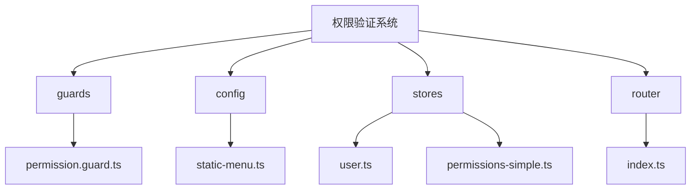
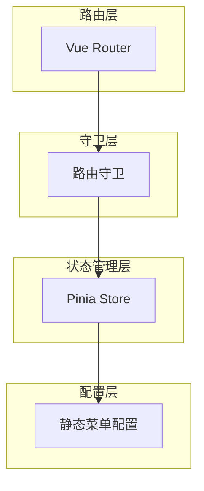
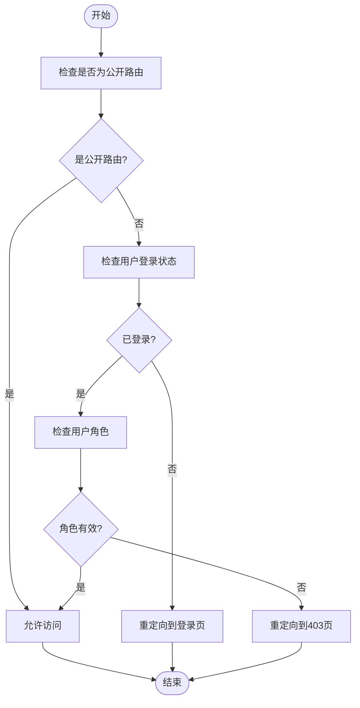
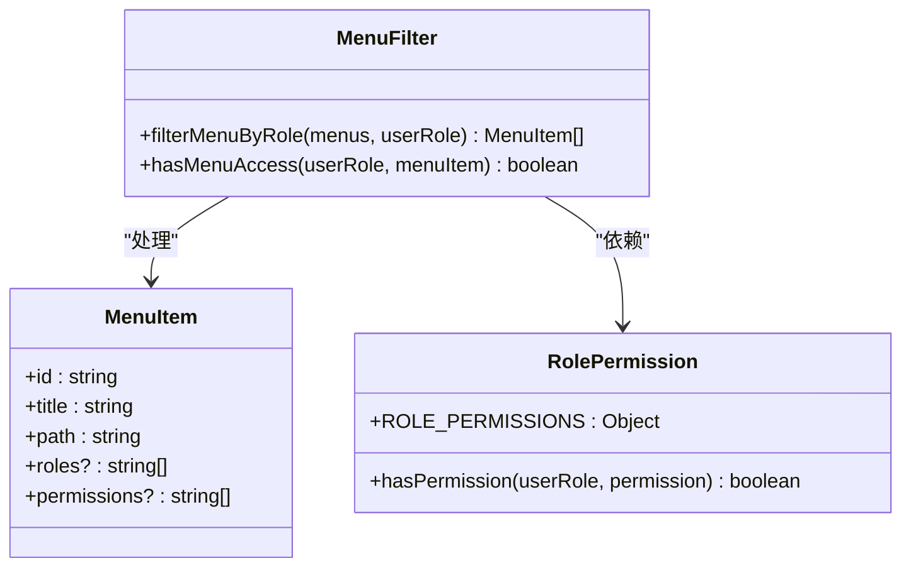
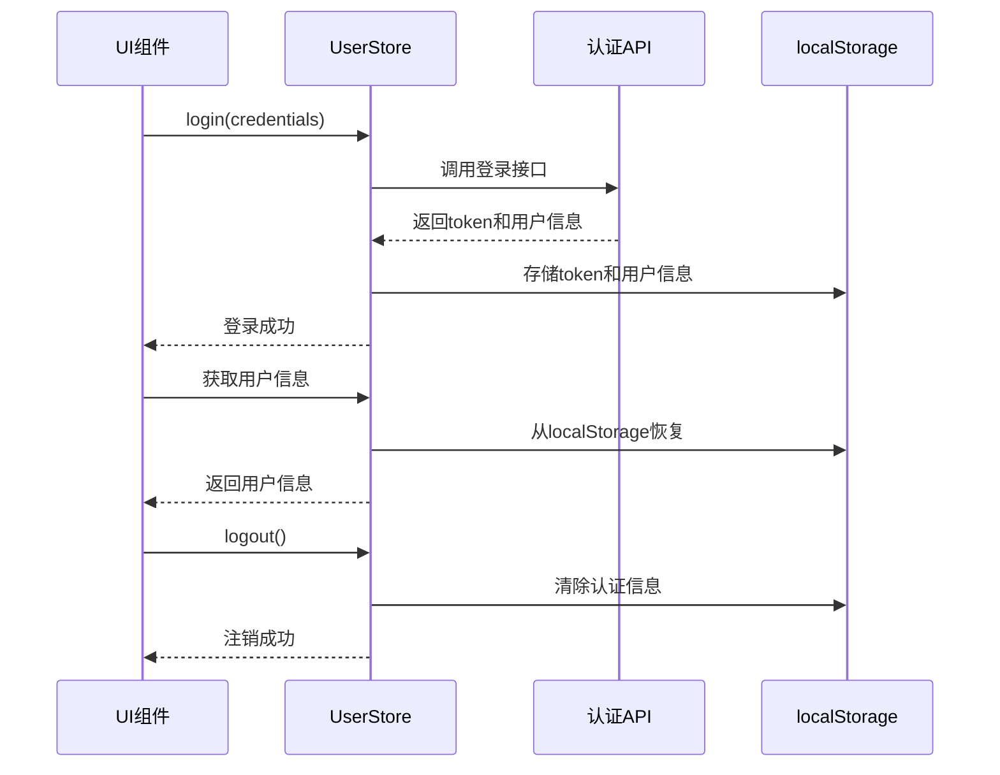
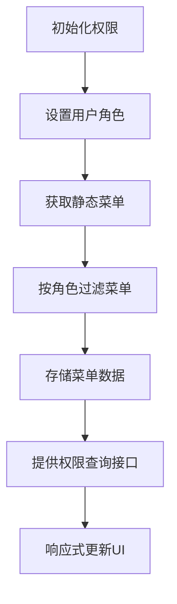
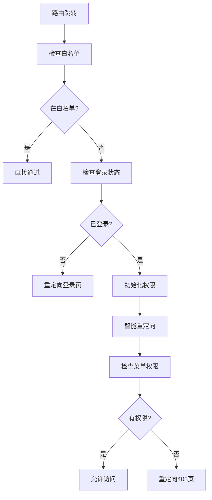
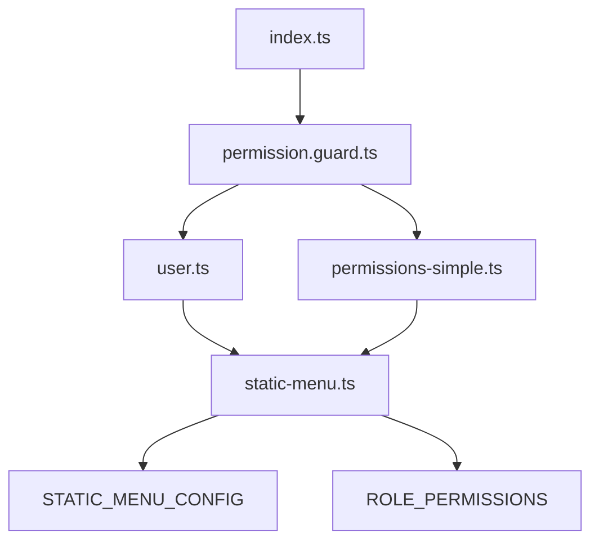

# 前端权限验证

<cite>
**本文档引用文件**  
- [permission.guard.ts](file://k.yyup.com/client/src/guards/permission.guard.ts)
- [static-menu.ts](file://k.yyup.com/client/src/config/static-menu.ts)
- [user.ts](file://k.yyup.com/client/src/stores/user.ts)
- [index.ts](file://k.yyup.com/client/src/router/index.ts)
- [permissions-simple.ts](file://k.yyup.com/client/src/stores/permissions-simple.ts)
</cite>

## 目录
1. [简介](#简介)
2. [项目结构](#项目结构)
3. [核心组件](#核心组件)
4. [架构概述](#架构概述)
5. [详细组件分析](#详细组件分析)
6. [依赖分析](#依赖分析)
7. [性能考虑](#性能考虑)
8. [故障排除指南](#故障排除指南)
9. [结论](#结论)

## 简介
本项目实现了一套基于Vue Router的前端权限验证系统，采用静态菜单配置与角色权限映射相结合的方式。系统通过路由守卫拦截导航请求，结合Pinia状态管理实现用户身份认证和细粒度权限控制。权限系统支持多角色（管理员、园长、教师、家长）的差异化访问控制，并通过本地存储实现权限数据持久化。整个权限验证流程包含登录认证、路由拦截、菜单过滤、权限比对等关键环节，确保不同角色用户只能访问其授权范围内的功能模块。

## 项目结构
权限验证相关文件主要分布在`client/src`目录下的`guards`、`config`、`stores`和`router`四个子目录中。`guards`目录存放路由守卫逻辑，`config`目录定义静态菜单和权限配置，`stores`目录管理用户状态和权限数据，`router`目录负责路由配置和导航守卫。

**图源**  
- [permission.guard.ts](file://k.yyup.com/client/src/guards/permission.guard.ts)
- [static-menu.ts](file://k.yyup.com/client/src/config/static-menu.ts)
- [user.ts](file://k.yyup.com/client/src/stores/user.ts)
- [permissions-simple.ts](file://k.yyup.com/client/src/stores/permissions-simple.ts)
- [index.ts](file://k.yyup.com/client/src/router/index.ts)

**节源**
- [k.yyup.com/client/src/guards](file://k.yyup.com/client/src/guards)
- [k.yyup.com/client/src/config](file://k.yyup.com/client/src/config)
- [k.yyup.com/client/src/stores](file://k.yyup.com/client/src/stores)
- [k.yyup.com/client/src/router](file://k.yyup.com/client/src/router)

## 核心组件
权限验证系统由五个核心文件构成：`permission.guard.ts`实现路由拦截逻辑，`static-menu.ts`定义静态菜单和角色权限映射，`user.ts`管理用户认证状态，`permissions-simple.ts`处理权限验证，`index.ts`配置路由守卫。这些组件协同工作，形成完整的权限控制链条。系统采用静态配置方式简化权限管理，避免了复杂的后端权限查询，同时通过localStorage实现权限数据持久化，提升用户体验。

**节源**
- [permission.guard.ts](file://k.yyup.com/client/src/guards/permission.guard.ts)
- [static-menu.ts](file://k.yyup.com/client/src/config/static-menu.ts)
- [user.ts](file://k.yyup.com/client/src/stores/user.ts)
- [permissions-simple.ts](file://k.yyup.com/client/src/stores/permissions-simple.ts)
- [index.ts](file://k.yyup.com/client/src/router/index.ts)

## 架构概述
系统采用分层架构设计，自上而下分为路由层、守卫层、状态管理层和配置层。路由层定义应用导航结构，守卫层拦截路由跳转请求，状态管理层维护用户和权限数据，配置层提供静态菜单和权限规则。各层之间通过明确的接口进行通信，确保系统解耦和可维护性。

**图源**  
- [index.ts](file://k.yyup.com/client/src/router/index.ts)
- [permission.guard.ts](file://k.yyup.com/client/src/guards/permission.guard.ts)
- [user.ts](file://k.yyup.com/client/src/stores/user.ts)
- [permissions-simple.ts](file://k.yyup.com/client/src/stores/permissions-simple.ts)
- [static-menu.ts](file://k.yyup.com/client/src/config/static-menu.ts)

## 详细组件分析

### 权限守卫分析
权限守卫是系统的核心控制点，负责拦截所有路由跳转请求并进行权限验证。守卫首先检查目标路由是否为公开路由，若是则直接放行；然后验证用户登录状态，未登录用户将被重定向至登录页；最后检查用户角色权限，无权限访问的用户将被引导至403页面。

**图源**  
- [permission.guard.ts](file://k.yyup.com/client/src/guards/permission.guard.ts)

**节源**
- [permission.guard.ts](file://k.yyup.com/client/src/guards/permission.guard.ts)

### 菜单过滤分析
菜单过滤功能根据用户角色动态生成可见菜单项。系统遍历静态菜单配置，通过`filterMenuByRole`函数递归检查每个菜单项的角色限制，仅保留当前用户角色有权访问的菜单。过滤后的菜单用于构建侧边栏导航，确保用户只能看到其权限范围内的功能入口。

**图源**  
- [static-menu.ts](file://k.yyup.com/client/src/config/static-menu.ts)

**节源**
- [static-menu.ts](file://k.yyup.com/client/src/config/static-menu.ts)

### 用户状态分析
用户状态管理模块负责维护用户认证信息和权限数据。模块通过localStorage持久化存储token和用户信息，在应用启动时自动恢复登录状态。提供`login`、`logout`、`refreshToken`等核心方法，以及`isAuthenticated`、`hasPermission`等计算属性，为上层组件提供统一的用户状态接口。

**图源**  
- [user.ts](file://k.yyup.com/client/src/stores/user.ts)

**节源**
- [user.ts](file://k.yyup.com/client/src/stores/user.ts)

### 权限存储分析
权限存储模块集中管理用户的菜单权限和操作权限。模块在用户登录后初始化，根据用户角色生成过滤后的菜单列表，并提供`checkPermission`、`canAccessMenu`等方法供其他组件查询权限状态。通过Pinia的响应式特性，确保权限变更能自动更新UI界面。

**图源**  
- [permissions-simple.ts](file://k.yyup.com/client/src/stores/permissions-simple.ts)

**节源**
- [permissions-simple.ts](file://k.yyup.com/client/src/stores/permissions-simple.ts)

### 路由配置分析
路由配置模块集成Vue Router并注册全局前置守卫。守卫按照预定义的顺序执行权限检查：先验证登录状态，再初始化权限系统，最后检查具体路由权限。通过`smartRedirect`机制实现智能路由重定向，根据用户角色自动跳转到合适的首页。

**图源**  
- [index.ts](file://k.yyup.com/client/src/router/index.ts)

**节源**
- [index.ts](file://k.yyup.com/client/src/router/index.ts)

## 依赖分析
权限验证系统各组件之间存在明确的依赖关系。路由模块依赖守卫模块进行权限控制，守卫模块依赖用户状态和权限存储模块获取认证信息，状态管理模块依赖静态配置模块的权限规则。这种分层依赖结构确保了系统的可维护性和可测试性。

**图源**  
- [index.ts](file://k.yyup.com/client/src/router/index.ts)
- [permission.guard.ts](file://k.yyup.com/client/src/guards/permission.guard.ts)
- [user.ts](file://k.yyup.com/client/src/stores/user.ts)
- [permissions-simple.ts](file://k.yyup.com/client/src/stores/permissions-simple.ts)
- [static-menu.ts](file://k.yyup.com/client/src/config/static-menu.ts)

**节源**
- [index.ts](file://k.yyup.com/client/src/router/index.ts)
- [permission.guard.ts](file://k.yyup.com/client/src/guards/permission.guard.ts)
- [user.ts](file://k.yyup.com/client/src/stores/user.ts)
- [permissions-simple.ts](file://k.yyup.com/client/src/stores/permissions-simple.ts)
- [static-menu.ts](file://k.yyup.com/client/src/config/static-menu.ts)

## 性能考虑
系统通过静态配置方式避免了频繁的后端权限查询，提升了响应速度。利用localStorage持久化存储减少重复认证，通过Pinia的响应式系统实现高效的UI更新。路由守卫中的权限检查均为同步操作，确保导航流畅性。对于大型菜单系统，建议实现懒加载机制以进一步优化首屏性能。

## 故障排除指南
常见问题包括权限更新后菜单未刷新、角色变更后权限未同步等。解决方案是确保在用户角色变更时调用`setUserRole`和`initializePermissions`方法重新初始化权限系统。对于登录状态异常，可检查localStorage中的token和用户信息是否完整。路由跳转问题可通过查看控制台的路由守卫日志进行诊断。

**节源**
- [user.ts](file://k.yyup.com/client/src/stores/user.ts)
- [permissions-simple.ts](file://k.yyup.com/client/src/stores/permissions-simple.ts)
- [index.ts](file://k.yyup.com/client/src/router/index.ts)

## 结论
本权限验证系统采用静态配置与状态管理相结合的方式，实现了高效、可靠的前端权限控制。系统架构清晰，组件职责明确，通过Vue Router守卫和Pinia状态管理的有机结合，提供了完整的身份认证和访问控制解决方案。未来可扩展支持动态权限配置，以适应更复杂的业务场景需求。