# 后端权限验证

<cite>
**本文档引用的文件**   
- [auth.middleware.ts](file://k.yyup.com/server/src/middlewares/auth.middleware.ts)
- [permission.middleware.ts](file://k.yyup.com/server/src/middlewares/permission.middleware.ts)
- [permission-cache.service.ts](file://k.yyup.com/server/src/services/permission-cache.service.ts)
- [permission-cache.controller.ts](file://k.yyup.com/server/src/controllers/permission-cache.controller.ts)
- [permissions.ts](file://k.yyup.com/backup/permission-system/permissions.ts)
</cite>

## 目录
1. [介绍](#介绍)
2. [项目结构](#项目结构)
3. [核心组件](#核心组件)
4. [架构概述](#架构概述)
5. [详细组件分析](#详细组件分析)
6. [依赖分析](#依赖分析)
7. [性能考虑](#性能考虑)
8. [故障排除指南](#故障排除指南)
9. [结论](#结论)

## 介绍
本项目实现了一个基于Express中间件的后端权限验证系统，采用JWT令牌和Redis缓存技术，支持多租户架构。系统包含认证中间件、权限检查中间件、权限缓存服务和权限验证工具类，确保了系统的安全性和高性能。

## 项目结构
项目结构清晰，主要包含中间件、服务和控制器三个部分。中间件负责处理认证和权限检查，服务提供权限缓存功能，控制器提供权限缓存管理接口。

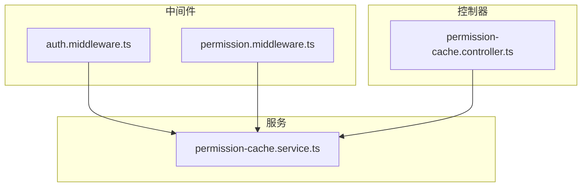

**图源**
- [auth.middleware.ts](file://k.yyup.com/server/src/middlewares/auth.middleware.ts)
- [permission.middleware.ts](file://k.yyup.com/server/src/middlewares/permission.middleware.ts)
- [permission-cache.service.ts](file://k.yyup.com/server/src/services/permission-cache.service.ts)
- [permission-cache.controller.ts](file://k.yyup.com/server/src/controllers/permission-cache.controller.ts)

**节源**
- [auth.middleware.ts](file://k.yyup.com/server/src/middlewares/auth.middleware.ts)
- [permission.middleware.ts](file://k.yyup.com/server/src/middlewares/permission.middleware.ts)
- [permission-cache.service.ts](file://k.yyup.com/server/src/services/permission-cache.service.ts)
- [permission-cache.controller.ts](file://k.yyup.com/server/src/controllers/permission-cache.controller.ts)

## 核心组件
核心组件包括认证中间件、权限检查中间件、权限缓存服务和权限缓存控制器。这些组件协同工作，实现了完整的权限验证系统。

**节源**
- [auth.middleware.ts](file://k.yyup.com/server/src/middlewares/auth.middleware.ts)
- [permission.middleware.ts](file://k.yyup.com/server/src/middlewares/permission.middleware.ts)
- [permission-cache.service.ts](file://k.yyup.com/server/src/services/permission-cache.service.ts)
- [permission-cache.controller.ts](file://k.yyup.com/server/src/controllers/permission-cache.controller.ts)

## 架构概述
系统采用分层架构，从上到下分别为中间件层、服务层和数据层。中间件层处理HTTP请求的认证和权限检查，服务层提供权限缓存功能，数据层存储用户权限信息。

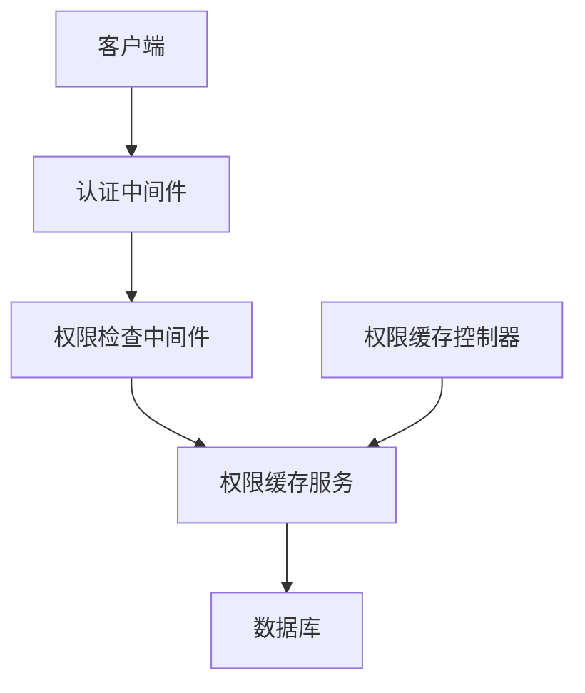

**图源**
- [auth.middleware.ts](file://k.yyup.com/server/src/middlewares/auth.middleware.ts)
- [permission.middleware.ts](file://k.yyup.com/server/src/middlewares/permission.middleware.ts)
- [permission-cache.service.ts](file://k.yyup.com/server/src/services/permission-cache.service.ts)
- [permission-cache.controller.ts](file://k.yyup.com/server/src/controllers/permission-cache.controller.ts)

## 详细组件分析

### 认证中间件分析
认证中间件负责解析和验证JWT令牌，提取用户信息并存储在请求对象中。

#### 认证中间件类图
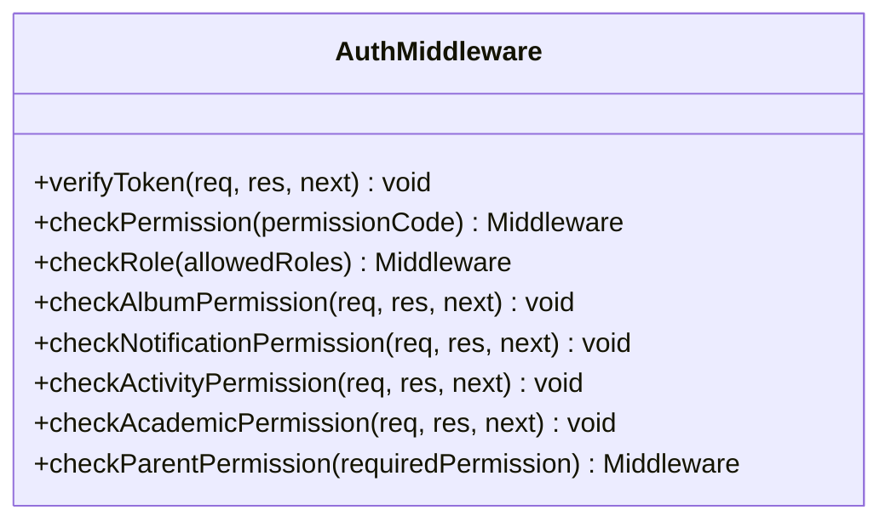

**图源**
- [auth.middleware.ts](file://k.yyup.com/server/src/middlewares/auth.middleware.ts)

#### JWT令牌验证流程
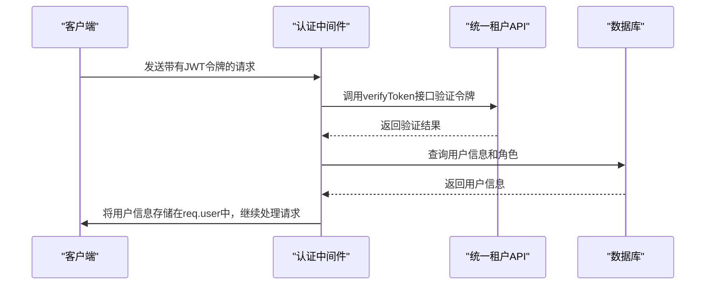

**图源**
- [auth.middleware.ts](file://k.yyup.com/server/src/middlewares/auth.middleware.ts)

**节源**
- [auth.middleware.ts](file://k.yyup.com/server/src/middlewares/auth.middleware.ts)

### 权限检查中间件分析
权限检查中间件负责检查用户是否具有访问特定资源的权限。

#### 权限检查中间件类图
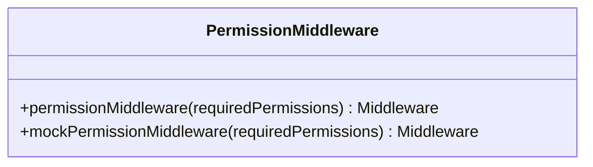

**图源**
- [permission.middleware.ts](file://k.yyup.com/server/src/middlewares/permission.middleware.ts)

#### 权限检查流程
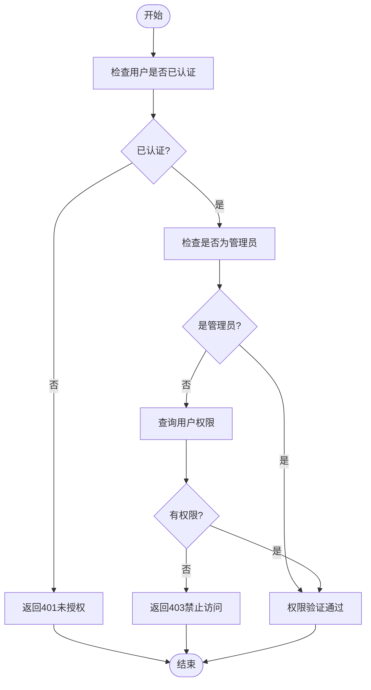

**图源**
- [permission.middleware.ts](file://k.yyup.com/server/src/middlewares/permission.middleware.ts)

**节源**
- [permission.middleware.ts](file://k.yyup.com/server/src/middlewares/permission.middleware.ts)

### 权限缓存服务分析
权限缓存服务提供权限相关的缓存功能，包括用户权限缓存、角色权限缓存、动态路由缓存和权限检查缓存。

#### 权限缓存服务类图
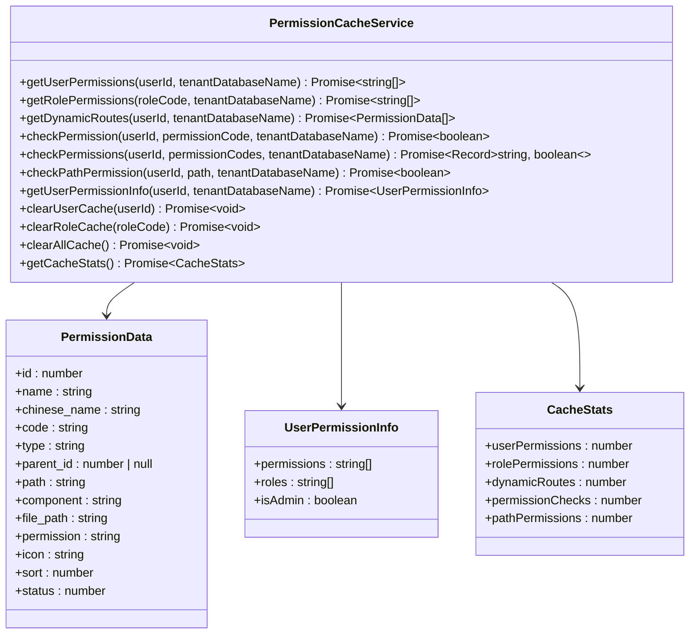

**图源**
- [permission-cache.service.ts](file://k.yyup.com/server/src/services/permission-cache.service.ts)

#### 权限缓存获取流程
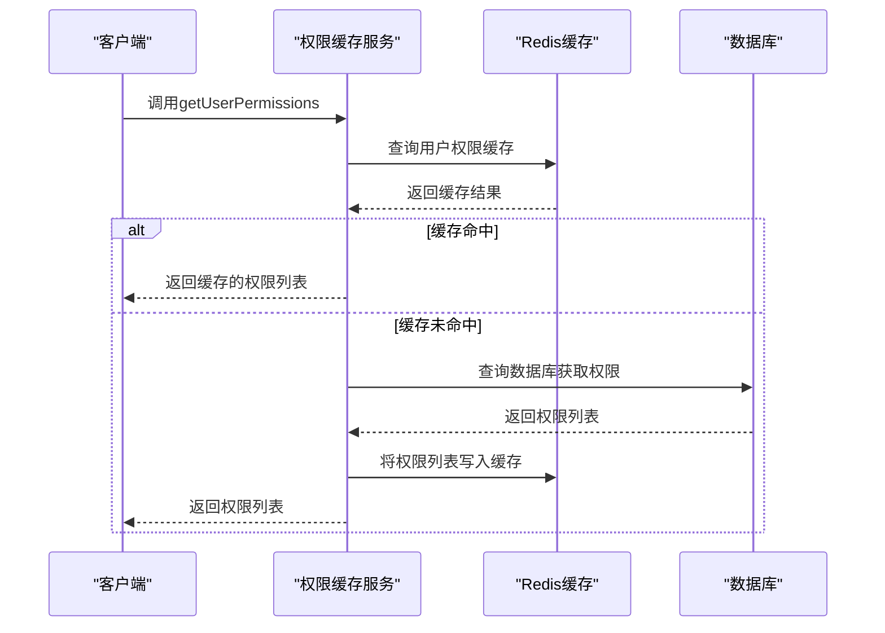

**图源**
- [permission-cache.service.ts](file://k.yyup.com/server/src/services/permission-cache.service.ts)

**节源**
- [permission-cache.service.ts](file://k.yyup.com/server/src/services/permission-cache.service.ts)

### 权限缓存控制器分析
权限缓存控制器提供管理员缓存管理接口，包括手动刷新权限缓存、查看缓存状态和统计、获取权限变更历史等功能。

#### 权限缓存控制器类图
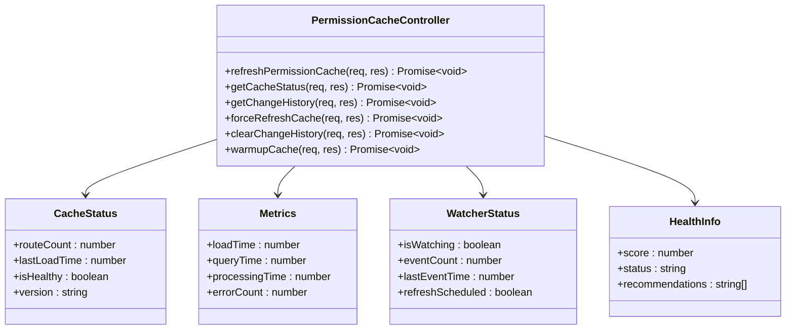

**图源**
- [permission-cache.controller.ts](file://k.yyup.com/server/src/controllers/permission-cache.controller.ts)

#### 权限缓存刷新流程
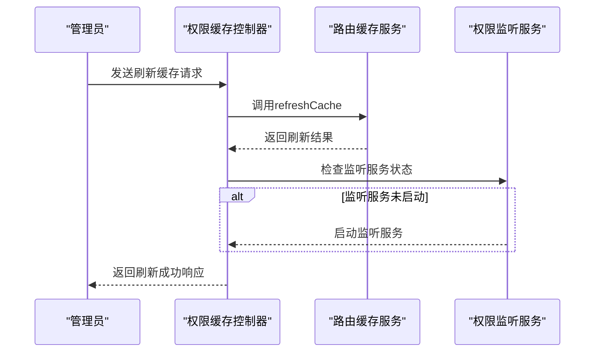

**图源**
- [permission-cache.controller.ts](file://k.yyup.com/server/src/controllers/permission-cache.controller.ts)

**节源**
- [permission-cache.controller.ts](file://k.yyup.com/server/src/controllers/permission-cache.controller.ts)

## 依赖分析
系统依赖于Express框架、JWT库、Axios库、Sequelize ORM和Redis服务。这些依赖项通过npm包管理器进行管理。

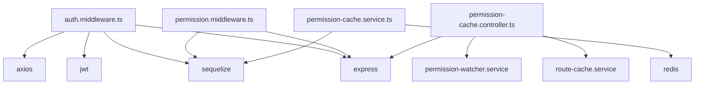

**图源**
- [auth.middleware.ts](file://k.yyup.com/server/src/middlewares/auth.middleware.ts)
- [permission.middleware.ts](file://k.yyup.com/server/src/middlewares/permission.middleware.ts)
- [permission-cache.service.ts](file://k.yyup.com/server/src/services/permission-cache.service.ts)
- [permission-cache.controller.ts](file://k.yyup.com/server/src/controllers/permission-cache.controller.ts)

**节源**
- [auth.middleware.ts](file://k.yyup.com/server/src/middlewares/auth.middleware.ts)
- [permission.middleware.ts](file://k.yyup.com/server/src/middlewares/permission.middleware.ts)
- [permission-cache.service.ts](file://k.yyup.com/server/src/services/permission-cache.service.ts)
- [permission-cache.controller.ts](file://k.yyup.com/server/src/controllers/permission-cache.controller.ts)

## 性能考虑
系统通过Redis缓存大幅减少了数据库查询次数，提高了权限验证的性能。权限缓存服务提供了多种缓存策略，包括用户权限缓存、角色权限缓存和动态路由缓存，有效降低了数据库负载。

## 故障排除指南
当遇到权限验证问题时，可以按照以下步骤进行排查：
1. 检查JWT令牌是否正确
2. 检查用户角色和权限配置
3. 检查Redis缓存服务是否正常运行
4. 查看权限缓存控制器提供的缓存状态和统计信息

**节源**
- [auth.middleware.ts](file://k.yyup.com/server/src/middlewares/auth.middleware.ts)
- [permission.middleware.ts](file://k.yyup.com/server/src/middlewares/permission.middleware.ts)
- [permission-cache.service.ts](file://k.yyup.com/server/src/services/permission-cache.service.ts)
- [permission-cache.controller.ts](file://k.yyup.com/server/src/controllers/permission-cache.controller.ts)

## 结论
本项目实现了一个高效、安全的后端权限验证系统，通过JWT令牌和Redis缓存技术，确保了系统的安全性和高性能。系统架构清晰，组件职责明确，易于维护和扩展。