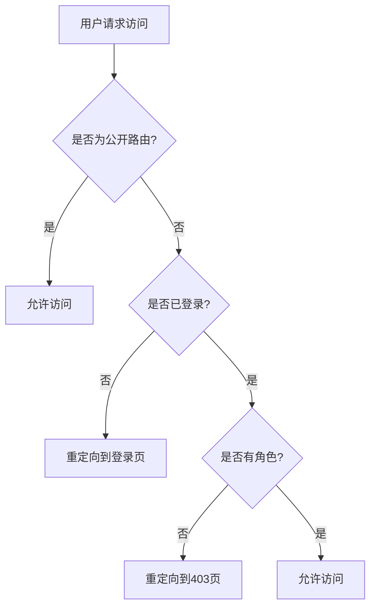
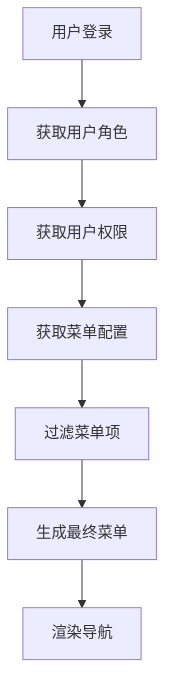
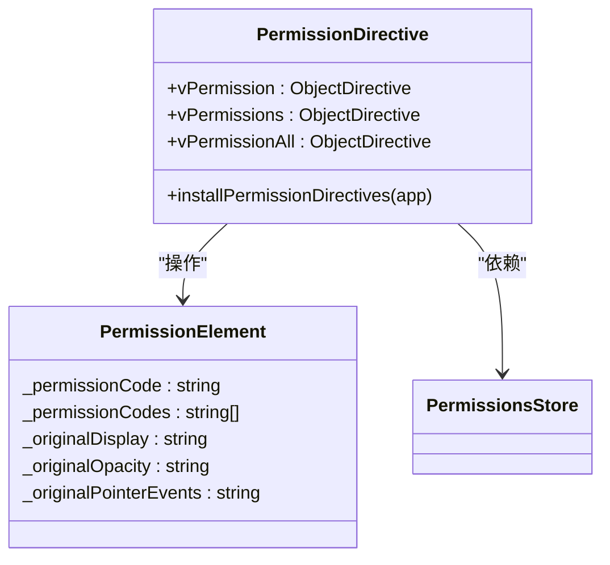
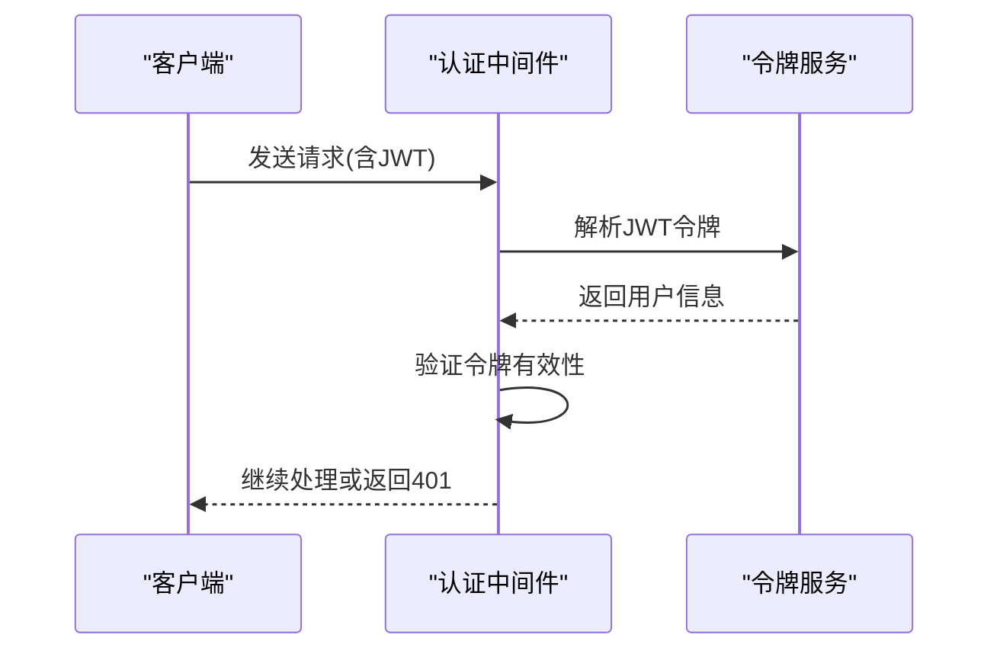
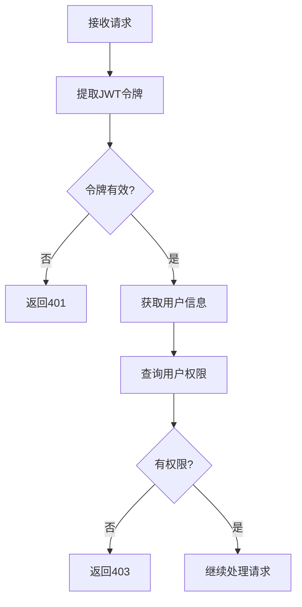
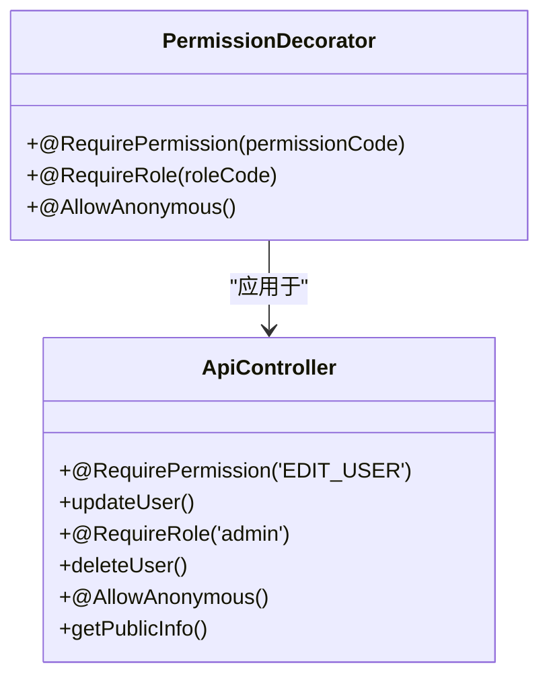
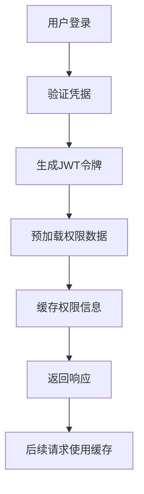
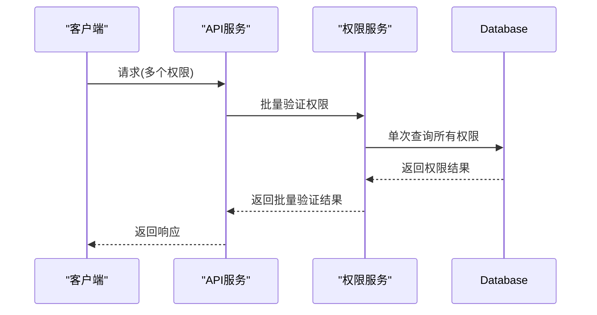
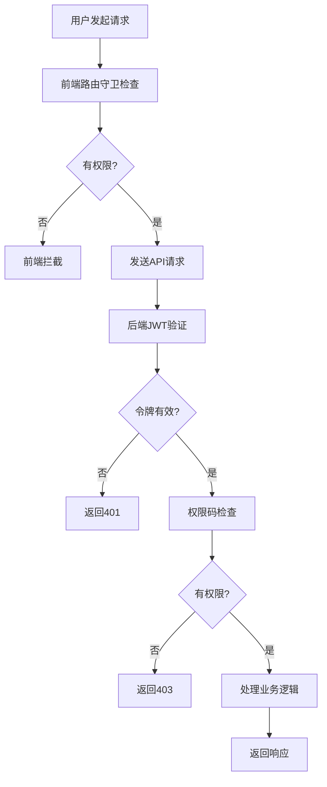
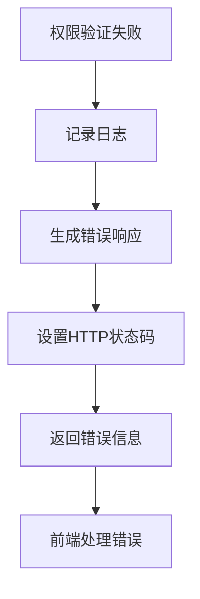

# 权限验证流程

<cite>
**本文档引用的文件**   
- [permission.guard.ts](file://k.yyup.com/client/src/guards/permission.guard.ts)
- [permission.ts](file://k.yyup.com/client/src/directives/permission.ts)
- [permissions.ts](file://k.yyup.com/client/src/stores/permissions.ts)
- [auth-shared-pool-example.middleware.ts](file://auth-shared-pool-example.middleware.ts)
- [permission-cache.controller.ts](file://k.yyup.com/backup/permission-system/permission-cache.controller.ts)
- [permission-cache.service.ts](file://k.yyup.com/backup/permission-system/permission-cache.service.ts)
- [cache-invalidation.middleware.ts](file://k.yyup.com/backup/permission-system/cache-invalidation.middleware.ts)
</cite>

## 目录
1. [介绍](#介绍)
2. [前端权限验证](#前端权限验证)
3. [后端权限验证](#后端权限验证)
4. [API权限装饰器](#api权限装饰器)
5. [性能优化策略](#性能优化策略)
6. [权限验证流程图](#权限验证流程图)
7. [异常处理](#异常处理)
8. [总结](#总结)

## 介绍
本文档详细描述了系统中从前端到后端的完整权限验证流程。涵盖了前端路由守卫、动态菜单生成、后端中间件验证、API权限控制以及性能优化策略等多个方面，为开发人员提供全面的权限验证实现指南。

## 前端权限验证

前端权限验证主要通过路由守卫、权限指令和状态管理三个层面实现。系统采用多层级权限控制机制，确保用户只能访问其权限范围内的功能。

### 路由守卫实现
前端路由守卫负责在用户导航时进行权限检查，确保只有经过身份验证且具有相应权限的用户才能访问特定路由。

**Diagram sources**
- [permission.guard.ts](file://k.yyup.com/client/src/guards/permission.guard.ts)

**Section sources**
- [permission.guard.ts](file://k.yyup.com/client/src/guards/permission.guard.ts)

### 动态菜单生成
系统根据用户权限动态生成导航菜单，确保用户只能看到其有权访问的功能模块。

**Diagram sources**
- [permissions.ts](file://k.yyup.com/client/src/stores/permissions.ts)

**Section sources**
- [permissions.ts](file://k.yyup.com/client/src/stores/permissions.ts)

### 权限指令系统
前端提供了丰富的权限指令，用于在模板中直接控制元素的显示和交互。

**Diagram sources**
- [permission.ts](file://k.yyup.com/client/src/directives/permission.ts)

**Section sources**
- [permission.ts](file://k.yyup.com/client/src/directives/permission.ts)

## 后端权限验证

后端权限验证通过Express中间件实现，采用JWT令牌解析和权限检查机制，确保API端点的安全性。

### JWT令牌解析
系统使用JWT令牌进行用户身份验证，中间件负责解析和验证令牌的有效性。

**Diagram sources**
- [auth-shared-pool-example.middleware.ts](file://auth-shared-pool-example.middleware.ts)

**Section sources**
- [auth-shared-pool-example.middleware.ts](file://auth-shared-pool-example.middleware.ts)

### 权限检查逻辑
后端中间件执行详细的权限检查，包括用户角色验证和具体权限码匹配。

**Diagram sources**
- [auth-shared-pool-example.middleware.ts](file://auth-shared-pool-example.middleware.ts)

**Section sources**
- [auth-shared-pool-example.middleware.ts](file://auth-shared-pool-example.middleware.ts)

## API权限装饰器

系统提供了API权限装饰器，通过注解方式声明接口的权限要求，简化权限控制的实现。

### 装饰器使用方法
权限装饰器允许开发者通过简单的注解方式定义API端点的权限要求。

**Diagram sources**
- [permission-cache.controller.ts](file://k.yyup.com/backup/permission-system/permission-cache.controller.ts)

**Section sources**
- [permission-cache.controller.ts](file://k.yyup.com/backup/permission-system/permission-cache.controller.ts)

## 性能优化策略

为提高权限验证的性能，系统采用了多种优化策略，包括权限预加载和批量验证。

### 权限预加载
系统在用户登录时预加载权限数据，减少后续请求的验证开销。

**Diagram sources**
- [permissions.ts](file://k.yyup.com/client/src/stores/permissions.ts)

**Section sources**
- [permissions.ts](file://k.yyup.com/client/src/stores/permissions.ts)

### 批量验证机制
对于需要验证多个权限的场景，系统支持批量验证以减少数据库查询次数。

**Diagram sources**
- [permission-cache.service.ts](file://k.yyup.com/backup/permission-system/permission-cache.service.ts)

**Section sources**
- [permission-cache.service.ts](file://k.yyup.com/backup/permission-system/permission-cache.service.ts)

## 权限验证流程图

以下是完整的权限验证流程，从用户请求到权限验证通过或拒绝的全过程。

**Diagram sources**
- [permission.guard.ts](file://k.yyup.com/client/src/guards/permission.guard.ts)
- [auth-shared-pool-example.middleware.ts](file://auth-shared-pool-example.middleware.ts)

## 异常处理

系统提供了完善的异常处理机制，确保权限验证失败时能够给出明确的错误信息。

### 权限不足处理
当用户权限不足时，系统会返回标准化的错误响应。

**Diagram sources**
- [auth-shared-pool-example.middleware.ts](file://auth-shared-pool-example.middleware.ts)

**Section sources**
- [auth-shared-pool-example.middleware.ts](file://auth-shared-pool-example.middleware.ts)

## 总结
本文档详细介绍了系统的权限验证流程，从前端到后端的完整链条。通过路由守卫、权限指令、中间件验证和API装饰器等多种机制，实现了细粒度的权限控制。同时，通过权限预加载和批量验证等优化策略，确保了系统的高性能。开发者可以根据本文档的指导，正确实现和维护系统的权限验证功能。