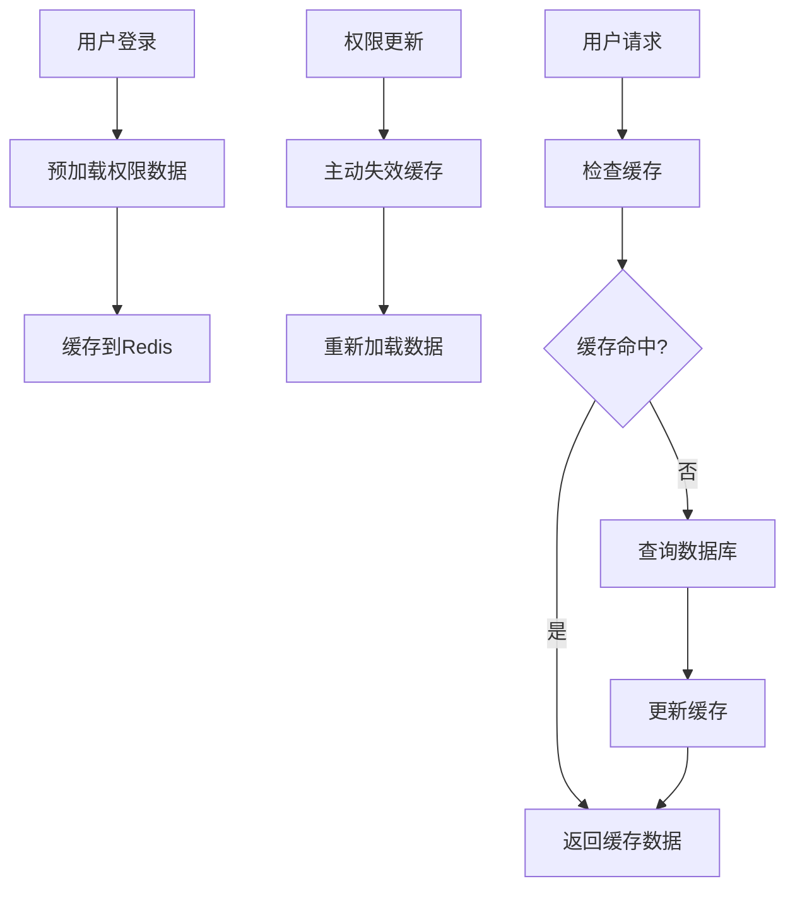
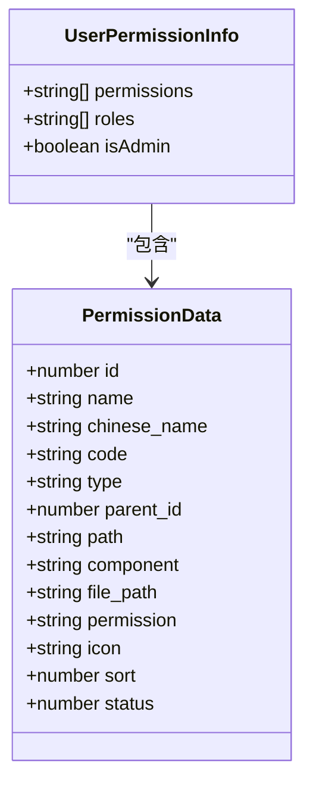
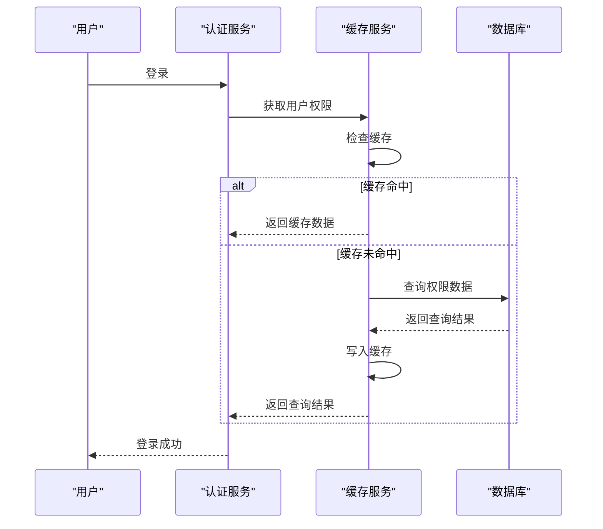
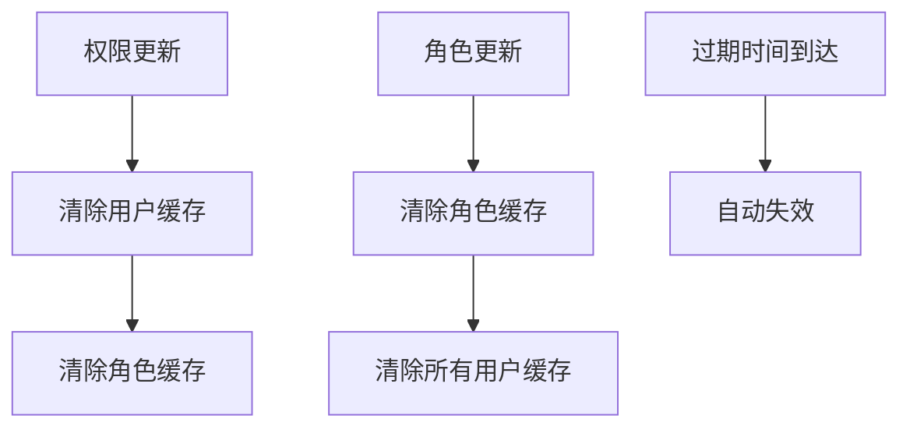
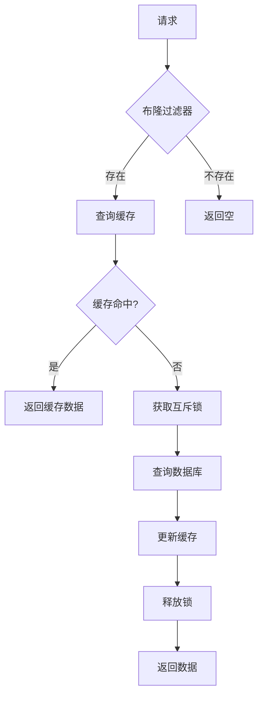

# 缓存策略

<cite>
**本文档引用文件**   
- [permission-cache.service.ts](file://k.yyup.com/backup/permission-system/permission-cache.service.ts)
- [redis.service.ts](file://k.yyup.com/server/src/services/redis.service.ts)
- [redis.config.ts](file://k.yyup.com/server/src/config/redis.config.ts)
- [cache-invalidation.middleware.ts](file://k.yyup.com/backup/permission-system/cache-invalidation.middleware.ts)
- [route-cache.service.ts](file://k.yyup.com/backup/permission-system/route-cache.service.ts)
</cite>

## 目录
1. [引言](#引言)
2. [缓存架构设计](#缓存架构设计)
3. [缓存键命名规范](#缓存键命名规范)
4. [数据结构选择](#数据结构选择)
5. [过期策略](#过期策略)
6. [权限缓存加载机制](#权限缓存加载机制)
7. [缓存失效策略](#缓存失效策略)
8. [缓存防护措施](#缓存防护措施)
9. [性能监控指标](#性能监控指标)
10. [代码实现示例](#代码实现示例)
11. [结论](#结论)

## 引言
本文档详细描述了权限系统的Redis缓存策略，涵盖缓存架构设计、数据结构选择、过期策略、加载机制、失效策略、防护措施和性能监控等方面。通过分析代码库中的相关文件，提供了全面的缓存策略文档。

## 缓存架构设计
权限系统的缓存架构设计旨在提高系统性能和响应速度，通过Redis缓存用户权限、角色权限、动态路由等数据。缓存服务在用户登录时预加载权限数据，并在权限更新时主动失效缓存，确保数据的一致性和实时性。



**Diagram sources**
- [permission-cache.service.ts](file://k.yyup.com/backup/permission-system/permission-cache.service.ts#L50-L134)
- [redis.service.ts](file://k.yyup.com/server/src/services/redis.service.ts#L233-L281)

## 缓存键命名规范
缓存键的命名遵循一定的规范，以确保键的唯一性和可读性。主要前缀包括用户权限、角色权限、动态路由等。

**缓存键前缀**
- `user:permissions:` - 用户权限
- `role:permissions:` - 角色权限
- `user:routes:` - 动态路由
- `permission:check:` - 权限检查
- `permission:path:` - 路径权限
- `user:permission:info:` - 用户权限信息

**Section sources**
- [redis.config.ts](file://k.yyup.com/server/src/config/redis.config.ts#L262-L299)

## 数据结构选择
根据不同的数据类型和访问模式，选择了合适的数据结构来存储缓存数据。

**数据结构选择**
- **Hash**: 用于存储复杂的对象数据，如用户权限信息。
- **Set**: 用于存储集合数据，如用户权限列表。



**Diagram sources**
- [permission-cache.service.ts](file://k.yyup.com/backup/permission-system/permission-cache.service.ts#L19-L43)
- [redis.service.ts](file://k.yyup.com/server/src/services/redis.service.ts#L342-L423)

## 过期策略
缓存数据设置了合理的过期时间，以平衡数据一致性和缓存命中率。

**过期时间配置**
- `USER_PERMISSIONS`: 30分钟
- `ROLE_PERMISSIONS`: 30分钟
- `DYNAMIC_ROUTES`: 30分钟
- `PERMISSION_CHECK`: 15分钟
- `PATH_PERMISSION`: 15分钟
- `USER_PERMISSION_INFO`: 30分钟

**Section sources**
- [redis.config.ts](file://k.yyup.com/server/src/config/redis.config.ts#L196-L257)

## 权限缓存加载机制
在用户登录时，系统会预加载用户的权限数据到缓存中，以提高后续请求的响应速度。

**加载机制**
1. 用户登录成功后，调用`getUserPermissions`方法。
2. 检查缓存中是否存在用户权限数据。
3. 如果缓存中存在，直接返回缓存数据。
4. 如果缓存中不存在，从数据库查询权限数据。
5. 将查询结果写入缓存。



**Diagram sources**
- [permission-cache.service.ts](file://k.yyup.com/backup/permission-system/permission-cache.service.ts#L50-L134)
- [redis.service.ts](file://k.yyup.com/server/src/services/redis.service.ts#L233-L281)

## 缓存失效策略
缓存失效策略包括主动失效和被动失效，确保数据的一致性和实时性。

**主动失效**
- **权限更新**: 当权限数据更新时，主动清除相关缓存。
- **角色更新**: 当角色数据更新时，主动清除相关缓存。

**被动失效**
- **过期时间到达**: 缓存数据在过期时间到达后自动失效。



**Diagram sources**
- [cache-invalidation.middleware.ts](file://k.yyup.com/backup/permission-system/cache-invalidation.middleware.ts#L68-L147)
- [permission-cache.service.ts](file://k.yyup.com/backup/permission-system/permission-cache.service.ts#L462-L522)

## 缓存防护措施
为了防止缓存穿透、缓存击穿和缓存雪崩，采取了相应的防护措施。

**缓存穿透**
- **布隆过滤器**: 使用布隆过滤器过滤无效请求，避免查询数据库。

**缓存击穿**
- **互斥锁**: 在缓存失效时，使用互斥锁确保只有一个请求查询数据库，其他请求等待。

**缓存雪崩**
- **随机过期时间**: 为缓存设置随机的过期时间，避免大量缓存同时失效。



**Diagram sources**
- [redis.service.ts](file://k.yyup.com/server/src/services/redis.service.ts#L536-L599)
- [permission-cache.service.ts](file://k.yyup.com/backup/permission-system/permission-cache.service.ts#L50-L134)

## 性能监控指标
为了监控缓存的性能，定义了以下指标。

**性能监控指标**
- **命中率**: 缓存命中的请求占总请求的比例。
- **平均响应时间**: 缓存请求的平均响应时间。
- **缓存大小**: 缓存中存储的数据量。
- **缓存命中次数**: 缓存命中的总次数。
- **缓存未命中次数**: 缓存未命中的总次数。

**Section sources**
- [permission-cache.service.ts](file://k.yyup.com/backup/permission-system/permission-cache.service.ts#L527-L567)

## 代码实现示例
以下是缓存读取、写入和失效操作的代码示例。

**缓存读取**
```typescript
static async getUserPermissions(userId: number): Promise<string[]> {
  const cacheKey = `${RedisKeyPrefix.USER_PERMISSIONS}${userId}`;
  
  try {
    const cached = await RedisService.get<string[]>(cacheKey);
    if (cached && Array.isArray(cached)) {
      console.log(`✅ 命中权限缓存: 用户${userId}, ${cached.length}个权限`);
      return cached;
    }
    
    // 从数据库查询
    const permissions = await this.queryPermissionsFromDB(userId);
    
    // 写入缓存
    if (permissions.length > 0) {
      await RedisService.set(cacheKey, permissions, RedisTTL.USER_PERMISSIONS);
      console.log(`💾 权限已缓存: 用户${userId}, TTL=${RedisTTL.USER_PERMISSIONS}秒`);
    }
    
    return permissions;
  } catch (error) {
    console.error(`❌ 获取用户权限失败: 用户${userId}`, error);
    return [];
  }
}
```

**缓存写入**
```typescript
static async setPermissions(userId: number, permissions: string[]): Promise<void> {
  const cacheKey = `${RedisKeyPrefix.USER_PERMISSIONS}${userId}`;
  await RedisService.set(cacheKey, permissions, RedisTTL.USER_PERMISSIONS);
}
```

**缓存失效**
```typescript
static async clearUserCache(userId: number): Promise<void> {
  const patterns = [
    `${RedisKeyPrefix.USER_PERMISSIONS}${userId}`,
    `${RedisKeyPrefix.DYNAMIC_ROUTES}${userId}`,
    `${RedisKeyPrefix.USER_PERMISSION_INFO}${userId}`,
    `${RedisKeyPrefix.PERMISSION_CHECK}${userId}:*`,
    `${RedisKeyPrefix.PATH_PERMISSION}${userId}:*`
  ];
  
  for (const pattern of patterns) {
    if (pattern.includes('*')) {
      await RedisService.delPattern(pattern);
    } else {
      await RedisService.del(pattern);
    }
  }
}
```

**Section sources**
- [permission-cache.service.ts](file://k.yyup.com/backup/permission-system/permission-cache.service.ts#L50-L134)
- [redis.service.ts](file://k.yyup.com/server/src/services/redis.service.ts#L233-L281)
- [cache-invalidation.middleware.ts](file://k.yyup.com/backup/permission-system/cache-invalidation.middleware.ts#L68-L147)

## 结论
本文档详细描述了权限系统的Redis缓存策略，包括缓存架构设计、数据结构选择、过期策略、加载机制、失效策略、防护措施和性能监控。通过合理的缓存设计，可以显著提高系统的性能和响应速度，同时确保数据的一致性和实时性。