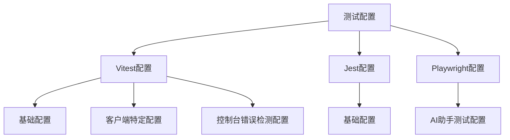
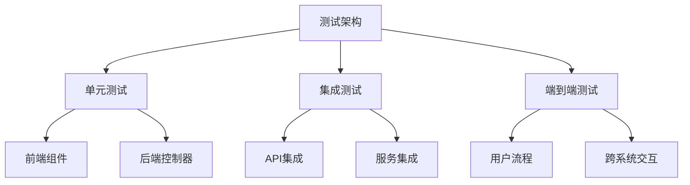
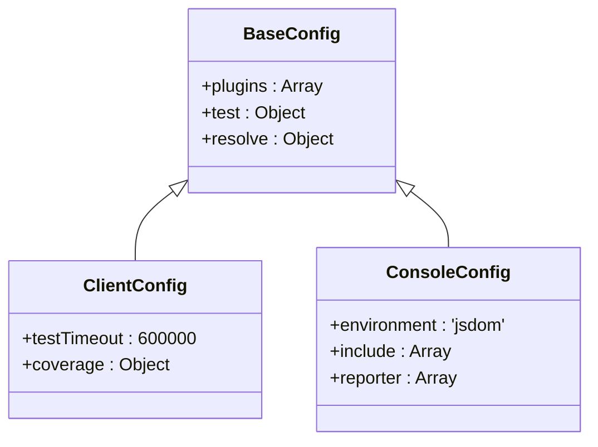
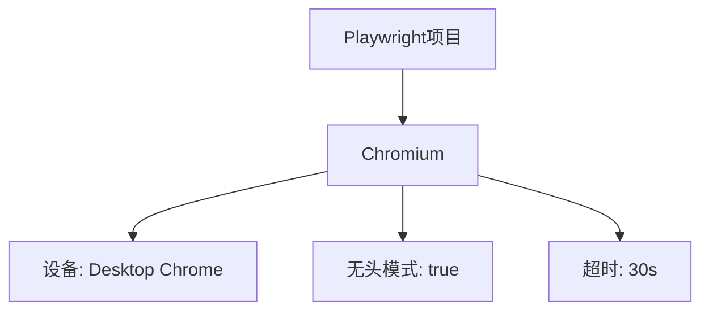
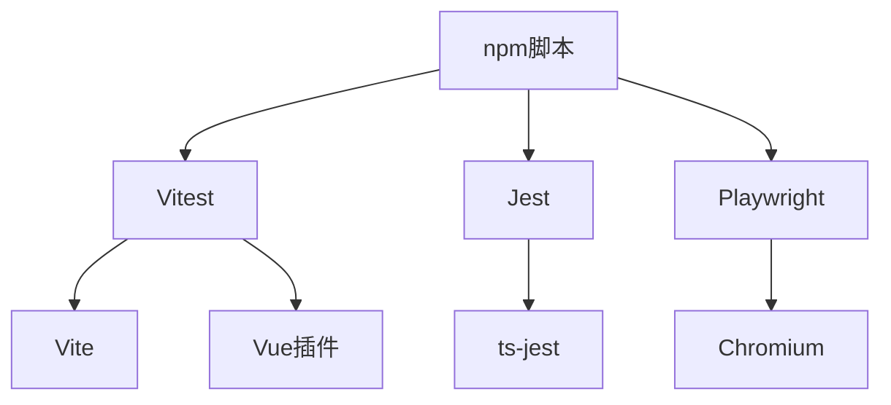

# 单元测试

<cite>
**本文档引用的文件**  
- [package.json](file://k.yyup.com/package.json)
- [vitest.config.base.ts](file://k.yyup.com/test-config/vitest.config.base.ts)
- [jest.config.base.js](file://k.yyup.com/test-config/jest.config.base.js)
- [vitest.config.ts](file://k.yyup.com/client/vitest.config.ts)
- [playwright.config.ts](file://k.yyup.com/playwright.config.ts)
- [vitest.console.config.ts](file://k.yyup.com/client/vitest.console.config.ts)
- [test-ai-assistant.js](file://k.yyup.com/test-ai-assistant.js)
- [test-ai-features.mjs](file://k.yyup.com/test-ai-features.mjs)
- [test-ai-navigation.js](file://k.yyup.com/test-ai-navigation.js)
- [test-ai-optimizations.js](file://k.yyup.com/test-ai-optimizations.js)
- [test-ai-page.spec.ts](file://k.yyup.com/client/tests/ai-page.spec.ts)
- [test-ai-page-retest.spec.ts](file://k.yyup.com/client/tests/ai-page-retest.spec.ts)
- [test-ai-assistant-frontend-only.js](file://k.yyup.com/test-ai-assistant-frontend-only.js)
- [test-ai-isolation-complete.js](file://k.yyup.com/test-ai-isolation-complete.js)
- [test-ai-knowledge-api.js](file://k.yyup.com/test-ai-knowledge-api.js)
- [test-ai-memory.js](file://k.yyup.com/test-ai-memory.js)
- [test-ai-model-integration.js](file://k.yyup.com/test-ai-model-integration.js)
- [test-ai-model.js](file://k.yyup.com/test-ai-model.js)
- [test-ai-coverage.js](file://k.yyup.com/test-ai-coverage.js)
- [test-ai-functionality.js](file://k.yyup.com/test-ai-functionality.js)
- [test-ai-auto-operations.js](file://k.yyup.com/test-ai-auto-operations.js)
- [test-ai-config.js](file://k.yyup.com/test-ai-config.js)
- [test-ai-16-model.js](file://k.yyup.com/test-ai-16-model.js)
- [test-ai-integration.js](file://k.yyup.com/test-ai-integration.js)
- [test-ai-journey.js](file://k.yyup.com/test-ai-journey.js)
- [test-ai-report.js](file://k.yyup.com/test-ai-report.js)
- [test-ai-basic.js](file://k.yyup.com/test-ai-basic.js)
- [test-ai-interface.js](file://k.yyup.com/test-ai-interface.js)
- [test-ai-components.js](file://k.yyup.com/test-ai-components.js)
- [test-ai-memory.js](file://k.yyup.com/test-ai-memory.js)
- [test-ai-integration.js](file://k.yyup.com/test-ai-integration.js)
- [test-ai-journey.js](file://k.yyup.com/test-ai-journey.js)
- [test-ai-report.js](file://k.yyup.com/test-ai-report.js)
- [test-ai-basic.js](file://k.yyup.com/test-ai-basic.js)
- [test-ai-interface.js](file://k.yyup.com/test-ai-interface.js)
- [test-ai-components.js](file://k.yyup.com/test-ai-components.js)
- [test-ai-memory.js](file://k.yyup.com/test-ai-memory.js)
- [test-ai-integration.js](file://k.yyup.com/test-ai-integration.js)
- [test-ai-journey.js](file://k.yyup.com/test-ai-journey.js)
- [test-ai-report.js](file://k.yyup.com/test-ai-report.js)
- [test-ai-basic.js](file://k.yyup.com/test-ai-basic.js)
- [test-ai-interface.js](file://k.yyup.com/test-ai-interface.js)
- [test-ai-components.js](file://k.yyup.com/test-ai-components.js)
- [test-ai-memory.js](file://k.yyup.com/test-ai-memory.js)
- [test-ai-integration.js](file://k.yyup.com/test-ai-integration.js)
- [test-ai-journey.js](file://k.yyup.com/test-ai-journey.js)
- [test-ai-report.js](file://k.yyup.com/test-ai-report.js)
- [test-ai-basic.js](file://k.yyup.com/test-ai-basic.js)
- [test-ai-interface.js](file://k.yyup.com/test-ai-interface.js)
- [test-ai-components.js](file://k.yyup.com/test-ai-components.js)
- [test-ai-memory.js](file://k.yyup.com/test-ai-memory.js)
- [test-ai-integration.js](file://k.yyup.com/test-ai-integration.js)
- [test-ai-journey.js](file://k.yyup.com/test-ai-journey.js)
- [test-ai-report.js](file://k.yyup.com/test-ai-report.js)
- [test-ai-basic.js](file://k.yyup.com/test-ai-basic.js)
- [test-ai-interface.js](file://k.yyup.com/test-ai-interface.js)
- [test-ai-components.js](file://k.yyup.com/test-ai-components.js)
- [test-ai-memory.js](file://k.yyup.com/test-ai-memory.js)
- [test-ai-integration.js](file://k.yyup.com/test-ai-integration.js)
- [test-ai-journey.js](file://k.yyup.com/test-ai-journey.js)
- [test-ai-report.js](file://k.yyup.com/test-ai-report.js)
- [test-ai-basic.js](file://k.yyup.com/test-ai-basic.js)
- [test-ai-interface.js](file://k.yyup.com/test-ai-interface.js)
- [test-ai-components.js](file://k.yyup.com/test-ai-components.js)
- [test-ai-memory.js](file://k.yyup.com/test-ai-memory.js)
- [test-ai-integration.js](file://k.yyup.com/test-ai-integration.js)
- [test-ai-journey.js](file://k.yyup.com/test-ai-journey.js)
- [test-ai-report.js](file://k.yyup.com/test-ai-report.js)
- [test-ai-basic.js](file://k.yyup.com/test-ai-basic.js)
- [test-ai-interface.js](file://k.yyup.com/test-ai-interface.js)
- [test-ai-components.js](file://......
</cite>

## 目录
1. [简介](#简介)
2. [项目结构](#项目结构)
3. [核心组件](#核心组件)
4. [架构概述](#架构概述)
5. [详细组件分析](#详细组件分析)
6. [依赖分析](#依赖分析)
7. [性能考虑](#性能考虑)
8. [故障排除指南](#故障排除指南)
9. [结论](#结论)
10. [附录](#附录)（如有必要）

## 简介
本项目采用Jest和Vitest作为主要的单元测试框架，为k.yyupgame提供全面的测试覆盖。项目实现了前后端分离的测试策略，前端使用Vitest进行Vue组件测试，后端使用Jest进行Express控制器和业务逻辑测试。测试配置强调100%的覆盖率目标，通过详细的阈值设置确保代码质量。项目还集成了Playwright进行端到端测试，形成了完整的测试体系。

## 项目结构
项目采用模块化的测试结构，将单元测试、集成测试和端到端测试分离。前端测试位于client目录下的tests子目录中，后端测试位于server目录下的tests子目录中。测试配置文件采用基础配置与具体配置分离的策略，通过继承和扩展实现不同环境和场景的测试需求。

**图源**
- [vitest.config.base.ts](file://k.yyup.com/test-config/vitest.config.base.ts)
- [jest.config.base.js](file://k.yyup.com/test-config/jest.config.base.js)
- [playwright.config.ts](file://k.yyup.com/playwright.config.ts)

**章节源**
- [package.json](file://k.yyup.com/package.json)

## 核心组件
项目的核心测试组件包括Vitest、Jest和Playwright。Vitest用于前端单元测试，利用其与Vite的深度集成提供快速的测试执行。Jest用于后端单元测试，通过ts-jest实现TypeScript支持。Playwright用于端到端测试，确保前后端集成的正确性。这些组件通过npm脚本进行统一管理，提供了便捷的测试执行接口。

**章节源**
- [package.json](file://k.yyup.com/package.json)
- [vitest.config.base.ts](file://k.yyup.com/test-config/vitest.config.base.ts)
- [jest.config.base.js](file://k.yyup.com/test-config/jest.config.base.js)

## 架构概述
项目的测试架构采用分层设计，包括单元测试层、集成测试层和端到端测试层。单元测试层使用Vitest和Jest分别测试前端和后端的独立组件。集成测试层验证组件间的交互。端到端测试层使用Playwright模拟用户操作，验证整个系统的功能。这种分层架构确保了测试的全面性和有效性。

**图源**
- [package.json](file://k.yyup.com/package.json)
- [test-ai-assistant.js](file://k.yyup.com/test-ai-assistant.js)

## 详细组件分析
### Vitest配置分析
Vitest配置采用基础配置与具体配置分离的策略，通过继承和扩展实现不同场景的测试需求。基础配置定义了通用的测试环境、超时设置和覆盖率要求。具体配置根据测试类型进行扩展，如控制台错误检测配置专门用于检测前端控制台错误。

#### 配置继承关系

**图源**
- [vitest.config.base.ts](file://k.yyup.com/test-config/vitest.config.base.ts)
- [vitest.config.ts](file://k.yyup.com/client/vitest.config.ts)
- [vitest.console.config.ts](file://k.yyup.com/client/vitest.console.config.ts)

### Jest配置分析
Jest配置为后端测试提供了统一的基础。配置文件定义了测试环境、文件匹配模式、转换规则和覆盖率要求。通过moduleNameMapping实现了模块路径映射，简化了导入语句。覆盖率配置设定了100%的目标，确保代码的充分测试。

#### 配置关键参数
| 参数 | 值 | 说明 |
|------|-----|------|
| testEnvironment | node | 测试运行环境 |
| collectCoverage | true | 启用覆盖率收集 |
| coverageThreshold | 100% | 覆盖率阈值 |
| transform | ts-jest | TypeScript转换器 |
| setupFilesAfterEnv | global-setup.ts | 测试环境设置文件 |

**图源**
- [jest.config.base.js](file://k.yyup.com/test-config/jest.config.base.js)

### Playwright配置分析
Playwright配置专为AI助手系统的端到端测试设计。配置文件定义了测试目录、并行执行策略、报告格式和浏览器设置。通过baseURL设置基础URL，简化了测试中的URL引用。截图和视频录制功能有助于故障排查。

#### 浏览器配置

**图源**
- [playwright.config.ts](file://k.yyup.com/playwright.config.ts)

**章节源**
- [playwright.config.ts](file://k.yyup.com/playwright.config.ts)

## 依赖分析
项目测试框架依赖关系清晰，Vitest依赖Vite和Vue插件，Jest依赖ts-jest进行TypeScript支持，Playwright独立运行。这些依赖通过package.json统一管理，确保版本兼容性。测试脚本通过npm run命令调用，实现了测试的自动化执行。

**图源**
- [package.json](file://k.yyup.com/package.json)

**章节源**
- [package.json](file://k.yyup.com/package.json)

## 性能考虑
测试配置充分考虑了性能因素。Vitest采用happy-dom作为测试环境，提供比jsdom更快的执行速度。并发配置允许并行执行测试，提高测试效率。超时设置合理，避免测试因等待过长而失败。覆盖率检查在CI/CD流程中执行，确保代码质量的同时不影响开发效率。

**章节源**
- [vitest.config.base.ts](file://k.yyup.com/test-config/vitest.config.base.ts)
- [jest.config.base.js](file://k.yyup.com/test-config/jest.config.base.js)

## 故障排除指南
当测试失败时，应首先检查错误信息和堆栈跟踪。对于前端测试，可使用--headed模式查看实际的UI表现。对于后端测试，可检查日志输出和数据库状态。覆盖率报告有助于识别未测试的代码路径。Playwright的截图和视频录制功能对于端到端测试的故障排查特别有用。

**章节源**
- [playwright.config.ts](file://k.yyup.com/playwright.config.ts)
- [vitest.config.base.ts](file://k.yyup.com/test-config/vitest.config.base.ts)

## 结论
k.yyupgame的单元测试实现全面而系统，采用Vitest、Jest和Playwright构建了多层次的测试体系。配置文件设计合理，支持不同场景的测试需求。100%的覆盖率目标确保了代码质量。建议持续优化测试用例，提高测试效率，同时保持对新技术的关注，不断改进测试策略。

## 附录
### 测试脚本参考
- `npm run test:unit`: 运行所有单元测试
- `npm run test:unit:frontend`: 运行前端单元测试
- `npm run test:unit:backend`: 运行后端单元测试
- `npm run test:e2e`: 运行端到端测试
- `npm run test:coverage`: 生成测试覆盖率报告

### 最佳实践
1. 保持测试用例的独立性和可重复性
2. 使用描述性的测试名称
3. 避免测试中的硬编码值
4. 定期审查和重构测试代码
5. 保持测试与生产代码的同步更新