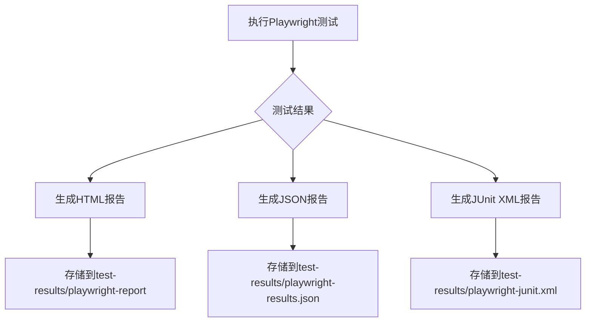
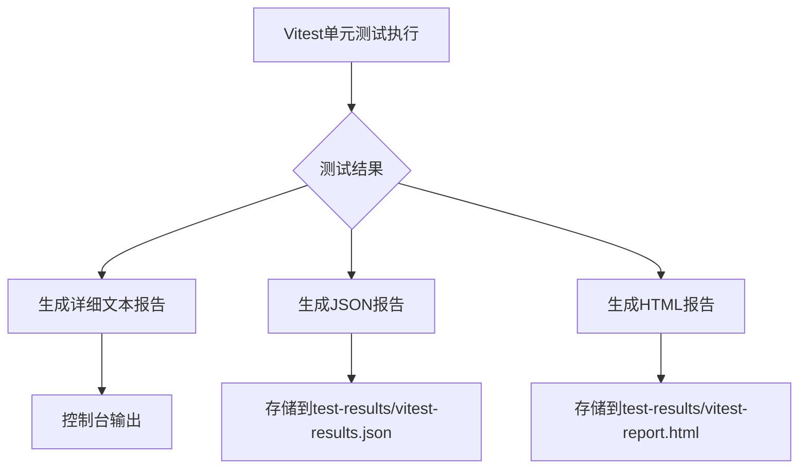
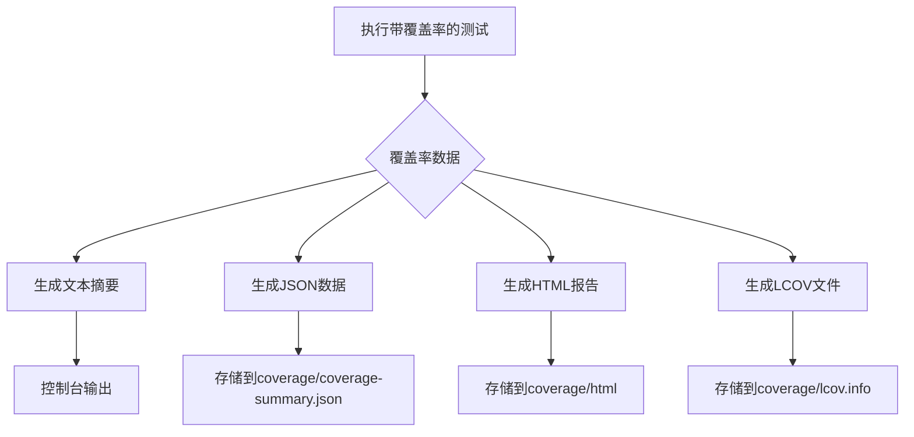
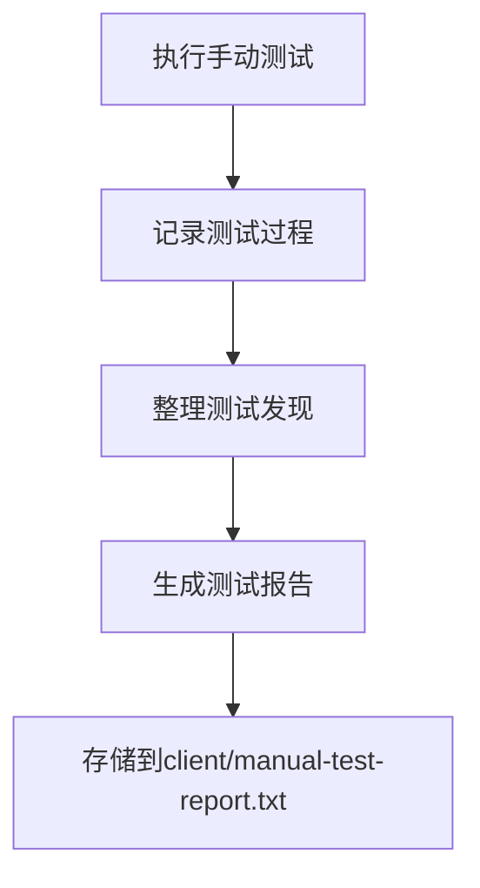
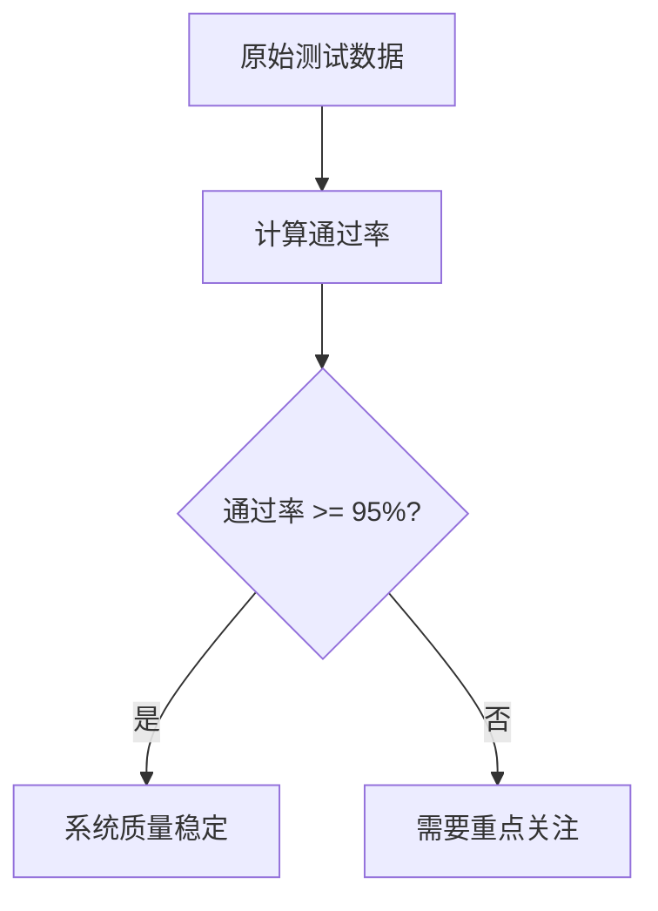
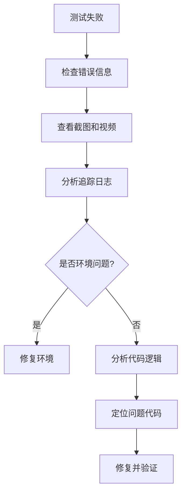
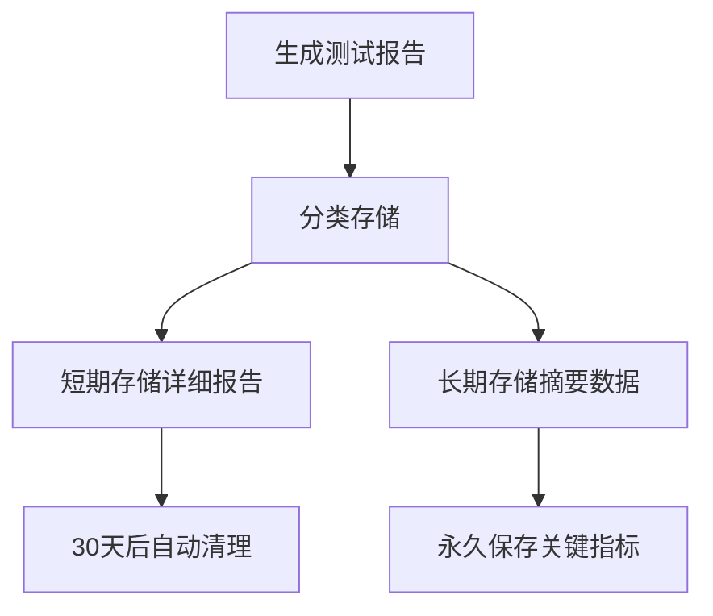

# 测试报告

<cite>
**本文档引用的文件**  
- [playwright.config.ts](file://k.yyup.com/playwright.config.ts)
- [client/playwright.config.ts](file://k.yyup.com/client/playwright.config.ts)
- [client/vitest.config.ts](file://k.yyup.com/client/vitest.config.ts)
- [test-config/vitest.config.base.ts](file://k.yyup.com/test-config/vitest.config.base.ts)
- [client/tests/e2e-pc-complete/playwright.config.ts](file://k.yyup.com/client/tests/e2e-pc-complete/playwright.config.ts)
- [package.json](file://k.yyup.com/package.json)
- [coverage-history.json](file://k.yyup.com/coverage-history.json)
- [admin-test-results/reports/admin-test-report-2025-11-20T01-54-20-450Z.json](file://k.yyup.com/admin-test-results/reports/admin-test-report-2025-11-20T01-54-20-450Z.json)
- [ai-assistant-simple-test-report.json](file://k.yyup.com/ai-assistant-simple-test-report.json)
- [auth-e2e-test-report.json](file://k.yyup.com/auth-e2e-test-report.json)
- [coverage-reports/coverage-report.json](file://k.yyup.com/coverage-reports/coverage-report.json)
- [client/manual-test-report.txt](file://k.yyup.com/client/manual-test-report.txt)
</cite>

## 目录
1. [简介](#简介)
2. [测试报告体系架构](#测试报告体系架构)
3. [Playwright E2E测试报告](#playwright-e2e测试报告)
4. [Jest/Vitest单元测试报告](#jestvitest单元测试报告)
5. [覆盖率报告](#覆盖率报告)
6. [手动测试报告](#手动测试报告)
7. [关键质量指标提取](#关键质量指标提取)
8. [测试失败分析与根因定位](#测试失败分析与根因定位)
9. [报告归档与历史对比分析](#报告归档与历史对比分析)
10. [报告解读指南](#报告解读指南)

## 简介
本报告详细阐述了k.yyupgame项目的测试报告体系，涵盖自动化测试和手动测试的完整报告流程。文档重点介绍Playwright端到端测试、Jest/Vitest单元测试、代码覆盖率测试以及手动测试的报告生成机制和解读方法。通过系统化的报告体系，团队能够有效监控系统质量，识别潜在风险，并持续改进软件质量。

## 测试报告体系架构
k.yyupgame项目建立了多层次的测试报告体系，覆盖从单元测试到端到端测试的各个层面。该体系通过Playwright、Vitest、Jest等测试框架生成结构化报告，并结合手动测试记录，形成完整的质量视图。报告体系的设计遵循可追溯、可量化、可分析的原则，确保每个测试结果都能被有效利用。

**Section sources**
- [package.json](file://k.yyup.com/package.json#L70-L83)
- [playwright.config.ts](file://k.yyup.com/playwright.config.ts#L18-L22)

## Playwright E2E测试报告
Playwright E2E测试报告是项目质量保障的核心，通过多种格式输出测试结果，确保不同角色都能获取所需信息。

### 报告生成方式
Playwright配置了多种报告格式，包括HTML、JSON和JUnit XML，满足不同使用场景的需求：
- **HTML报告**：提供交互式界面，便于开发人员调试和分析失败用例
- **JSON报告**：结构化数据，便于程序解析和集成到CI/CD流水线
- **JUnit XML报告**：标准格式，可被大多数CI系统（如GitHub Actions）直接解析

**Diagram sources**
- [client/playwright.config.ts](file://k.yyup.com/client/playwright.config.ts#L25-L30)
- [playwright.config.ts](file://k.yyup.com/playwright.config.ts#L18-L22)

### 报告解读方法
Playwright报告提供了丰富的调试信息：
- **截图**：仅在测试失败时自动截取全屏截图
- **视频**：保留失败测试的执行视频，便于复现问题
- **追踪**：在首次重试时记录操作追踪，包含网络请求、DOM变更等详细信息

通过这些辅助信息，团队可以快速定位UI层的问题，如元素定位失败、页面加载超时等。

**Section sources**
- [client/playwright.config.ts](file://k.yyup.com/client/playwright.config.ts#L42-L44)
- [playwright.config.ts](file://k.yyup.com/playwright.config.ts#L29-L35)

## Jest/Vitest单元测试报告
单元测试报告体系基于Jest和Vitest框架，提供代码级别的质量反馈。

### 报告生成方式
Vitest配置了多种报告器，确保测试结果的全面性：
- **详细报告**：提供每个测试用例的执行详情
- **JSON报告**：结构化输出，便于自动化处理
- **HTML报告**：可视化界面，便于浏览测试结果

**Diagram sources**
- [test-config/vitest.config.base.ts](file://k.yyup.com/test-config/vitest.config.base.ts#L110-L114)
- [client/vitest.config.ts](file://k.yyup.com/client/vitest.config.ts#L17-L23)

### 报告解读方法
单元测试报告重点关注：
- **通过率**：计算测试用例的通过比例
- **失败用例**：分析具体失败的测试用例及其错误信息
- **执行时间**：监控测试用例的执行性能

通过这些指标，团队可以评估代码变更的影响，确保新代码不会破坏现有功能。

**Section sources**
- [test-config/vitest.config.base.ts](file://k.yyup.com/test-config/vitest.config.base.ts#L110-L118)

## 覆盖率报告
覆盖率报告是衡量代码质量的重要指标，k.yyupgame项目建立了完善的覆盖率监控体系。

### 报告生成方式
项目使用Vitest的覆盖率功能，配置了多种报告格式：
- **文本摘要**：提供简洁的覆盖率概览
- **JSON**：包含详细的覆盖率数据
- **HTML**：可视化展示，可点击查看具体文件的覆盖情况
- **LCOV**：标准格式，便于集成到代码质量平台

**Diagram sources**
- [test-config/vitest.config.base.ts](file://k.yyup.com/test-config/vitest.config.base.ts#L53-L63)
- [client/vitest.config.ts](file://k.yyup.com/client/vitest.config.ts#L24-L31)

### 报告解读方法
覆盖率报告重点关注四个维度：
- **行覆盖率**：执行的代码行数比例
- **函数覆盖率**：调用的函数比例
- **分支覆盖率**：执行的分支条件比例
- **语句覆盖率**：执行的语句比例

项目设定了100%的覆盖率目标，确保所有代码都经过测试验证。

**Section sources**
- [test-config/vitest.config.base.ts](file://k.yyup.com/test-config/vitest.config.base.ts#L85-L91)

## 手动测试报告
手动测试报告补充了自动化测试的不足，记录了探索性测试和用户体验测试的结果。

### 报告生成方式
手动测试报告以文本文件形式存储，包含：
- 测试场景描述
- 测试步骤记录
- 发现的问题列表
- 截图证据

**Diagram sources**
- [client/manual-test-report.txt](file://k.yyup.com/client/manual-test-report.txt)

### 报告解读方法
手动测试报告重点关注：
- 用户体验问题
- 边界条件测试结果
- 探索性测试发现
- 跨浏览器兼容性问题

这些信息帮助团队发现自动化测试难以覆盖的问题。

**Section sources**
- [client/manual-test-report.txt](file://k.yyup.com/client/manual-test-report.txt)

## 关键质量指标提取
从各类测试报告中提取关键质量指标，形成系统的质量视图。

### 通过率分析
通过率是衡量系统稳定性的核心指标：
- **E2E测试通过率**：反映系统整体功能的稳定性
- **单元测试通过率**：反映代码级别的质量
- **历史趋势**：监控通过率的变化趋势

**Diagram sources**
- [auth-e2e-test-report.json](file://k.yyup.com/auth-e2e-test-report.json)
- [ai-assistant-simple-test-report.json](file://k.yyup.com/ai-assistant-simple-test-report.json)

### 失败用例分析
对失败用例进行分类分析：
- **环境问题**：如网络超时、服务不可用
- **代码缺陷**：如逻辑错误、边界条件处理不当
- **测试脚本问题**：如元素定位器失效

通过分类统计，识别主要问题来源，指导改进方向。

**Section sources**
- [admin-test-results/reports/admin-test-report-2025-11-20T01-54-20-450Z.json](file://k.yyup.com/admin-test-results/reports/admin-test-report-2025-11-20T01-54-20-450Z.json)

### 性能数据分析
从测试报告中提取性能指标：
- 页面加载时间
- API响应时间
- 操作响应时间
- 内存使用情况

这些数据帮助评估系统性能，识别性能瓶颈。

**Section sources**
- [client/tests/e2e-pc-complete/playwright.config.ts](file://k.yyup.com/client/tests/e2e-pc-complete/playwright.config.ts#L34-L37)

## 测试失败分析与根因定位
建立系统化的测试失败分析流程，快速定位问题根源。

### 根本原因分析流程

**Diagram sources**
- [client/playwright.config.ts](file://k.yyup.com/client/playwright.config.ts#L42-L44)

### 实际报告示例
以`admin-test-report-2025-11-20T01-54-20-450Z.json`为例，报告中包含：
- 失败测试用例的具体描述
- 错误堆栈信息
- 失败时的截图路径
- 操作追踪文件

通过这些信息，团队可以在几分钟内复现和定位问题。

**Section sources**
- [admin-test-results/reports/admin-test-report-2025-11-20T01-54-20-450Z.json](file://k.yyup.com/admin-test-results/reports/admin-test-report-2025-11-20T01-54-20-450Z.json)

## 报告归档与历史对比分析
建立报告归档机制，支持历史数据对比分析。

### 归档策略
测试报告按以下规则归档：
- 每日测试报告存储在独立目录
- 保留最近30天的详细报告
- 长期保存关键指标摘要
- 覆盖率历史数据存储在`coverage-history.json`

**Diagram sources**
- [coverage-history.json](file://k.yyup.com/coverage-history.json)

### 历史对比分析
通过对比历史数据，识别质量趋势：
- 覆盖率变化趋势
- 通过率波动情况
- 失败模式演变
- 性能指标变化

这些分析帮助团队评估质量改进措施的效果。

**Section sources**
- [coverage-history.json](file://k.yyup.com/coverage-history.json)

## 报告解读指南
为团队提供标准化的报告解读指南，确保一致的理解和行动。

### 快速识别系统质量趋势
- **绿色**：所有指标正常，系统质量稳定
- **黄色**：部分指标异常，需要关注
- **红色**：关键指标失败，需要立即处理

### 潜在风险识别
重点关注以下风险信号：
- 通过率持续下降
- 某类失败用例频繁出现
- 覆盖率不达标
- 性能指标恶化

通过及时响应这些信号，预防重大质量问题。

**Section sources**
- [package.json](file://k.yyup.com/package.json#L222-L224)
- [coverage-history.json](file://k.yyup.com/coverage-history.json)