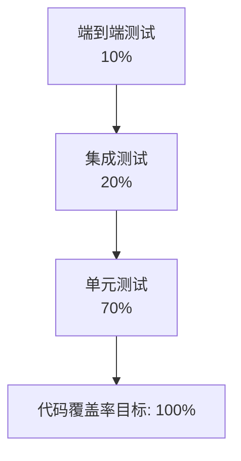
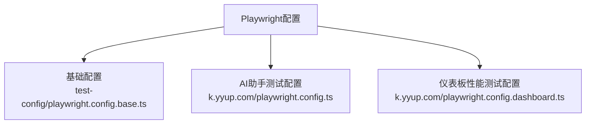
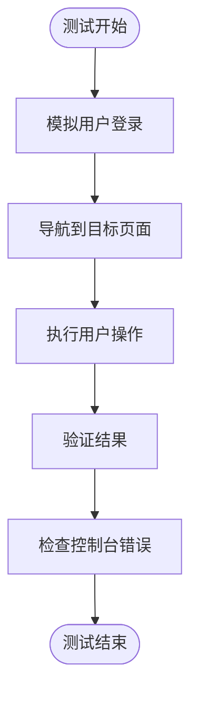
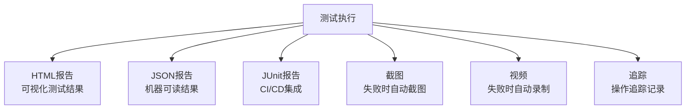
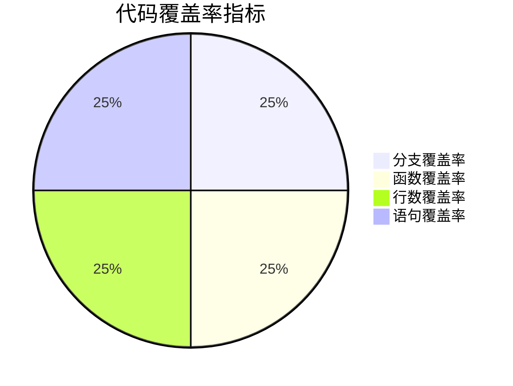
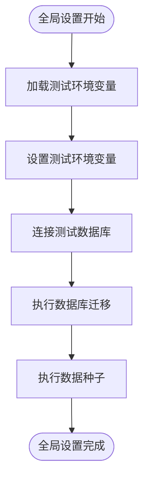
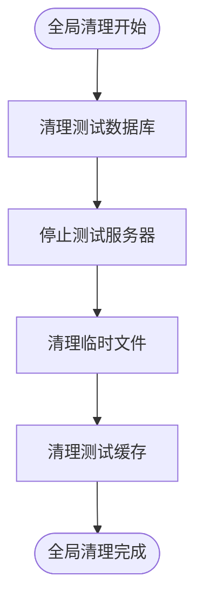
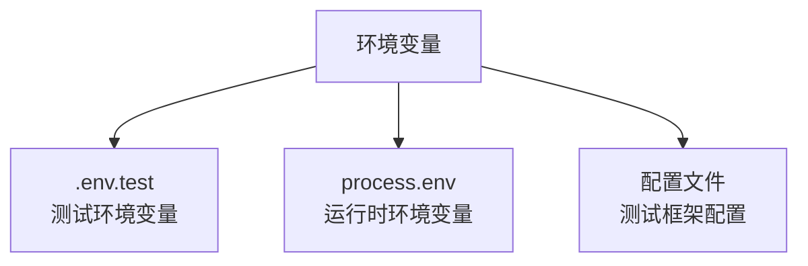
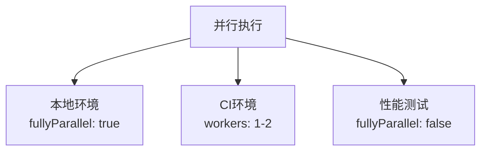
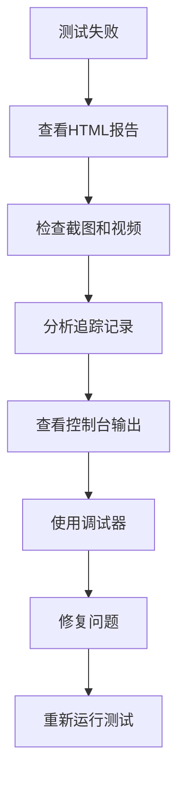

# 测试策略

<cite>
**本文档引用的文件**  
- [playwright.config.ts](file://k.yyup.com/playwright.config.ts)
- [playwright.config.dashboard.ts](file://k.yyup.com/playwright.config.dashboard.ts)
- [test-config/playwright.config.base.ts](file://k.yyup.com/test-config/playwright.config.base.ts)
- [server/jest.config.js](file://k.yyup.com/server/jest.config.js)
- [test-config/jest.config.base.js](file://k.yyup.com/test-config/jest.config.base.js)
- [client/vitest.config.ts](file://k.yyup.com/client/vitest.config.ts)
- [test-config/vitest.config.base.ts](file://k.yyup.com/test-config/vitest.config.base.ts)
- [client/tests/e2e/ai-assistant-page.spec.ts](file://k.yyup.com/client/tests/e2e/ai-assistant-page.spec.ts)
- [client/tests/e2e/admin-permissions-comprehensive.spec.ts](file://k.yyup.com/client/tests/e2e/admin-permissions-comprehensive.spec.ts)
- [server/tests/global-setup.ts](file://k.yyup.com/server/tests/global-setup.ts)
- [server/tests/global-teardown.ts](file://k.yyup.com/server/tests/global-teardown.ts)
- [client/tests/global-setup.ts](file://k.yyup.com/client/tests/global-setup.ts)
</cite>

## 目录
1. [引言](#引言)
2. [测试金字塔结构](#测试金字塔结构)
3. [Playwright端到端测试框架](#playwright端到端测试框架)
4. [单元测试实现](#单元测试实现)
5. [测试数据管理策略](#测试数据管理策略)
6. [测试环境配置与管理](#测试环境配置与管理)
7. [开发者测试最佳实践](#开发者测试最佳实践)

## 引言
k.yyupgame项目建立了完善的质量保证体系，通过多层次的测试策略确保系统的稳定性和可靠性。本测试策略文档详细阐述了项目的测试架构、工具链、执行流程和最佳实践，为开发者提供全面的测试指导。

## 测试金字塔结构
k.yyupgame项目采用经典的测试金字塔模型，确保测试的效率和覆盖率。测试金字塔由三层构成：单元测试、集成测试和端到端测试。



**Diagram sources**
- [test-config/jest.config.base.js](file://k.yyup.com/test-config/jest.config.base.js#L72-L79)
- [test-config/vitest.config.base.ts](file://k.yyup.com/test-config/vitest.config.base.ts#L85-L92)

**Section sources**
- [test-config/jest.config.base.js](file://k.yyup.com/test-config/jest.config.base.js#L52-L70)
- [test-config/vitest.config.base.ts](file://k.yyup.com/test-config/vitest.config.base.ts#L53-L97)

### 单元测试
单元测试是测试金字塔的基础，占测试总量的70%。项目对所有核心业务逻辑、工具函数和组件都要求100%的代码覆盖率。前端使用Vitest框架，后端使用Jest框架进行单元测试。

### 集成测试
集成测试占测试总量的20%，主要验证模块间的交互和API接口的正确性。包括服务层集成、数据库操作集成和前后端接口集成测试。

### 端到端测试
端到端测试占测试总量的10%，使用Playwright框架模拟真实用户场景，验证完整的业务流程和用户界面交互。

## Playwright端到端测试框架
k.yyupgame项目采用Playwright作为端到端测试框架，提供跨浏览器、跨平台的自动化测试能力。

### 测试配置
项目提供了多种Playwright配置文件以适应不同的测试需求：



**Diagram sources**
- [playwright.config.ts](file://k.yyup.com/playwright.config.ts#L1-L58)
- [playwright.config.dashboard.ts](file://k.yyup.com/playwright.config.dashboard.ts#L1-L61)
- [test-config/playwright.config.base.ts](file://k.yyup.com/test-config/playwright.config.base.ts#L1-L123)

**Section sources**
- [playwright.config.ts](file://k.yyup.com/playwright.config.ts#L1-L58)
- [playwright.config.dashboard.ts](file://k.yyup.com/playwright.config.dashboard.ts#L1-L61)
- [test-config/playwright.config.base.ts](file://k.yyup.com/test-config/playwright.config.base.ts#L1-L123)

### 测试用例编写
测试用例采用BDD（行为驱动开发）风格编写，使用`describe`和`test`组织测试套件。每个测试用例都包含详细的注释和断言验证。



**Diagram sources**
- [client/tests/e2e/ai-assistant-page.spec.ts](file://k.yyup.com/client/tests/e2e/ai-assistant-page.spec.ts#L75-L200)
- [client/tests/e2e/admin-permissions-comprehensive.spec.ts](file://k.yyup.com/client/tests/e2e/admin-permissions-comprehensive.spec.ts#L14-L200)

### 页面对象模型设计
项目采用页面对象模型（Page Object Model）设计模式，将页面元素和操作封装在独立的类中，提高测试代码的可维护性。

### 测试执行与报告
测试执行配置了详细的报告机制，包括HTML报告、JSON报告和JUnit报告，便于CI/CD集成和结果分析。



**Diagram sources**
- [playwright.config.ts](file://k.yyup.com/playwright.config.ts#L18-L22)
- [playwright.config.dashboard.ts](file://k.yyup.com/playwright.config.dashboard.ts#L18-L22)
- [test-config/playwright.config.base.ts](file://k.yyup.com/test-config/playwright.config.base.ts#L29-L35)

## 单元测试实现
项目采用不同的单元测试框架分别处理前端和后端的测试需求。

### Jest框架使用
后端服务使用Jest框架进行单元测试，配置了严格的覆盖率阈值和报告机制。

```mermaid
graph TD
A[Jest配置] --> B[覆盖率阈值<br>100%]
A --> C[报告格式<br>text, html, lcov, json]
A --> D[测试环境<br>node]
A --> E[转换器<br>ts-jest]
A --> F[模块映射<br>@/, @server/, @shared/]
```

**Diagram sources**
- [test-config/jest.config.base.js](file://k.yyup.com/test-config/jest.config.base.js#L52-L114)
- [server/jest.config.js](file://k.yyup.com/server/jest.config.js#L1-L30)

**Section sources**
- [test-config/jest.config.base.js](file://k.yyup.com/test-config/jest.config.base.js#L52-L114)
- [server/jest.config.js](file://k.yyup.com/server/jest.config.js#L1-L30)

### Mock对象创建
项目使用Jest的内置功能创建Mock对象，隔离测试依赖，确保测试的独立性和可靠性。

### 覆盖率分析
测试配置了100%的覆盖率目标，包括分支、函数、行数和语句覆盖率。



**Diagram sources**
- [test-config/jest.config.base.js](file://k.yyup.com/test-config/jest.config.base.js#L72-L79)
- [test-config/vitest.config.base.ts](file://k.yyup.com/test-config/vitest.config.base.ts#L85-L92)

## 测试数据管理策略
项目建立了完善的测试数据管理机制，确保测试的可重复性和数据一致性。

### 测试数据库初始化
通过全局设置脚本初始化测试数据库，确保每次测试都在干净的环境中运行。



**Diagram sources**
- [server/tests/global-setup.ts](file://k.yyup.com/server/tests/global-setup.ts#L1-L85)

**Section sources**
- [server/tests/global-setup.ts](file://k.yyup.com/server/tests/global-setup.ts#L1-L85)

### 测试数据准备
测试数据通过专门的种子文件和API调用准备，确保测试场景的完整性和真实性。

### 测试数据清理
通过全局清理脚本在测试结束后清理测试数据，保持测试环境的清洁。



**Diagram sources**
- [server/tests/global-teardown.ts](file://k.yyup.com/server/tests/global-teardown.ts#L1-L78)

**Section sources**
- [server/tests/global-teardown.ts](file://k.yyup.com/server/tests/global-teardown.ts#L1-L78)

## 测试环境配置与管理
项目提供了完善的测试环境配置和管理机制，支持本地开发和CI/CD环境。

### 环境变量管理
通过环境变量文件和测试配置管理不同环境的测试参数。



**Section sources**
- [server/tests/global-setup.ts](file://k.yyup.com/server/tests/global-setup.ts#L11-L24)
- [client/tests/global-setup.ts](file://k.yyup.com/client/tests/global-setup.ts#L13-L15)

### 并行测试执行
测试配置支持并行执行，提高测试效率，同时在CI环境中进行适当调整。



**Section sources**
- [playwright.config.ts](file://k.yyup.com/playwright.config.ts#L9-L16)
- [playwright.config.dashboard.ts](file://k.yyup.com/playwright.config.dashboard.ts#L10-L16)
- [test-config/playwright.config.base.ts](file://k.yyup.com/test-config/playwright.config.base.ts#L15-L20)

## 开发者测试最佳实践
为开发者提供以下测试最佳实践，确保测试代码的质量和可维护性。

### 编写可维护的测试用例
- 使用描述性的测试名称
- 遵循单一职责原则
- 保持测试的独立性
- 使用页面对象模型

### 提高测试覆盖率
- 为目标代码编写全面的测试用例
- 关注边界条件和异常情况
- 使用覆盖率工具指导测试编写
- 定期审查覆盖率报告

### 调试失败的测试
- 利用自动截图和视频记录
- 检查操作追踪记录
- 分析控制台输出
- 使用调试工具逐步执行



**Section sources**
- [playwright.config.ts](file://k.yyup.com/playwright.config.ts#L28-L35)
- [playwright.config.dashboard.ts](file://k.yyup.com/playwright.config.dashboard.ts#L29-L35)
- [test-config/playwright.config.base.ts](file://k.yyup.com/test-config/playwright.config.base.ts#L46-L48)