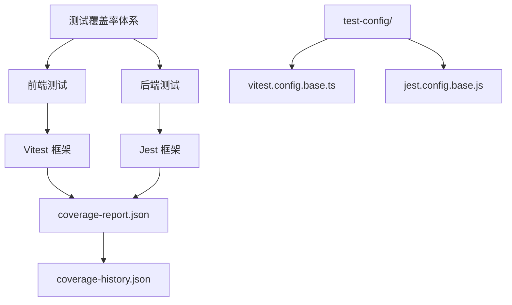
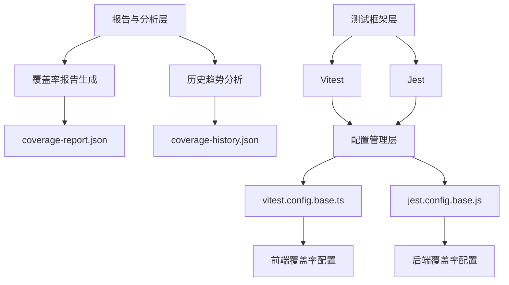
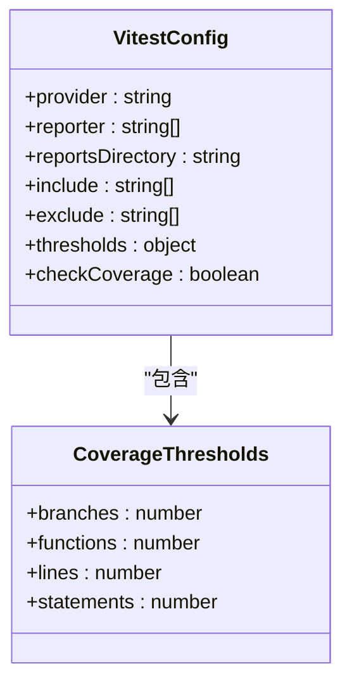
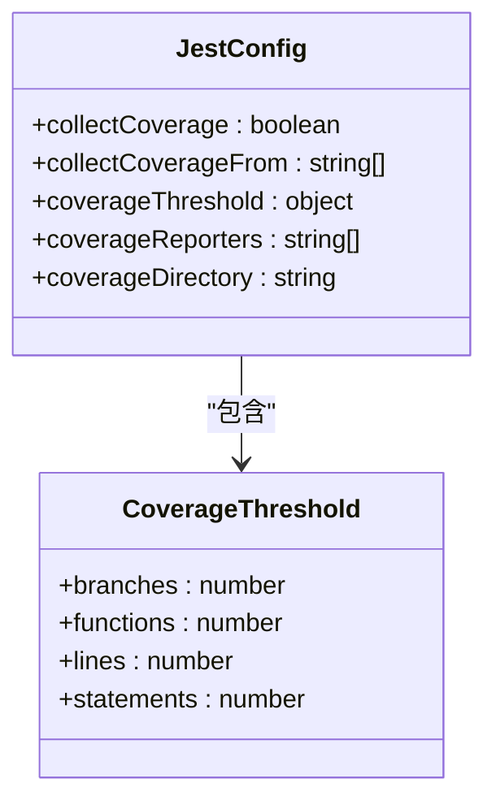
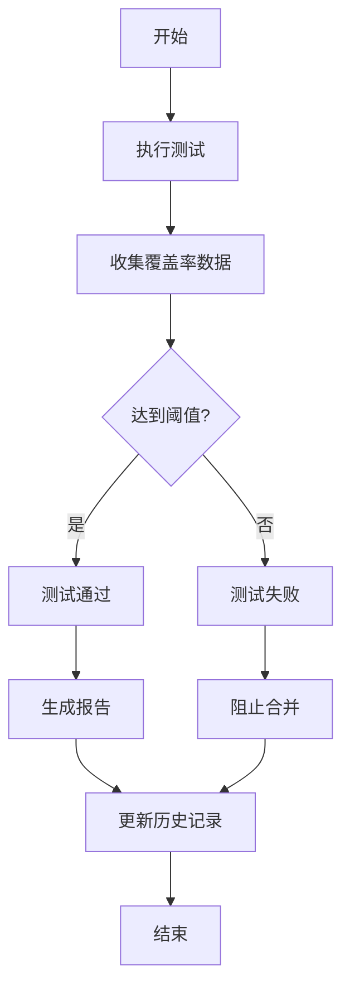
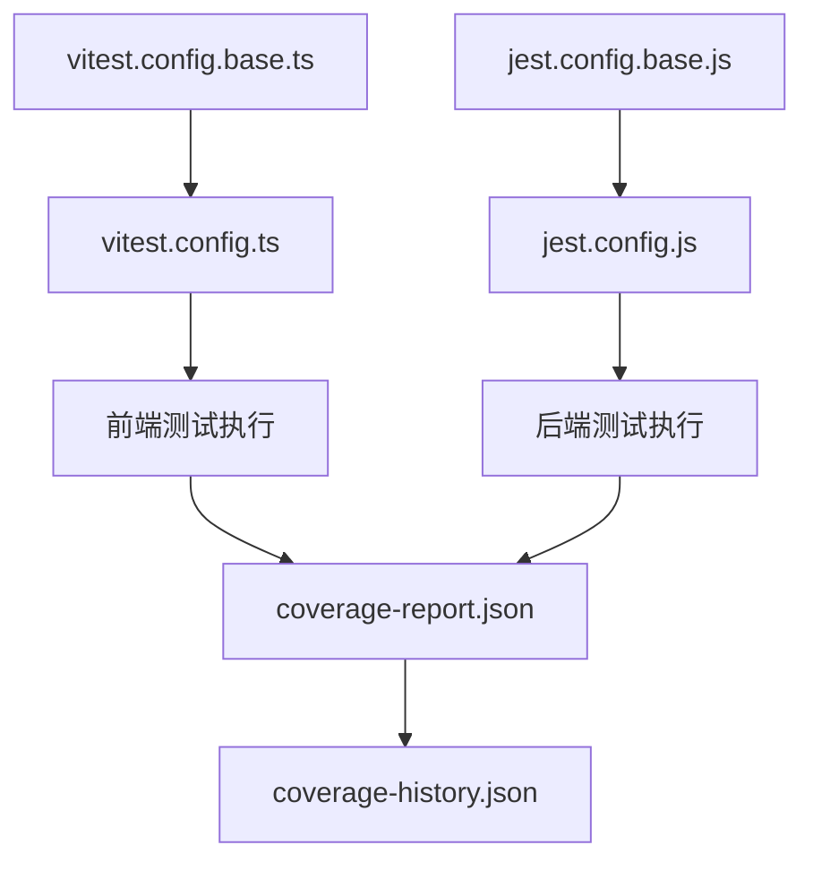

# 测试覆盖率

<cite>
**本文档引用的文件**  
- [coverage-history.json](file://k.yyup.com/coverage-history.json)
- [coverage-report.json](file://k.yyup.com/coverage-reports/coverage-report.json)
- [jest.config.base.js](file://k.yyup.com/test-config/jest.config.base.js)
- [vitest.config.base.ts](file://k.yyup.com/test-config/vitest.config.base.ts)
- [vitest.config.ts](file://k.yyup.com/client/vitest.config.ts)
- [jest.config.js](file://k.yyup.com/server/jest.config.js)
</cite>

## 目录
1. [项目结构](#项目结构)
2. [核心组件](#核心组件)
3. [架构概述](#架构概述)
4. [详细组件分析](#详细组件分析)
5. [依赖分析](#依赖分析)
6. [性能考虑](#性能考虑)
7. [故障排除指南](#故障排除指南)
8. [结论](#结论)

## 项目结构

k.yyupgame 项目的测试覆盖率体系由前端和后端两大部分组成，分别采用 Vitest 和 Jest 作为测试框架。项目根目录下的 `coverage-reports` 文件夹存储生成的覆盖率报告，`coverage-history.json` 记录历史趋势数据。测试配置文件分别位于 `test-config/` 目录下，为前后端提供统一的基础配置。

**Diagram sources**
- [coverage-history.json](file://k.yyup.com/coverage-history.json)
- [coverage-report.json](file://k.yyup.com/coverage-reports/coverage-report.json)
- [vitest.config.base.ts](file://k.yyup.com/test-config/vitest.config.base.ts)
- [jest.config.base.js](file://k.yyup.com/test-config/jest.config.base.js)

**Section sources**
- [coverage-history.json](file://k.yyup.com/coverage-history.json)
- [coverage-report.json](file://k.yyup.com/coverage-reports/coverage-report.json)

## 核心组件

本项目的核心测试覆盖率组件包括：Vitest 前端测试框架、Jest 后端测试框架、覆盖率阈值配置、报告生成系统和历史趋势分析。这些组件共同构成了完整的测试监控体系，确保代码质量的持续可控。

**Section sources**
- [vitest.config.base.ts](file://k.yyup.com/test-config/vitest.config.base.ts)
- [jest.config.base.js](file://k.yyup.com/test-config/jest.config.base.js)

## 架构概述

k.yyupgame 的测试覆盖率监控体系采用分层架构设计。最底层是测试框架层，前端使用 Vitest，后端使用 Jest。中间层是配置管理层，通过基础配置文件统一管理测试和覆盖率设置。顶层是报告和分析层，生成详细的覆盖率报告并进行历史趋势分析。

**Diagram sources**
- [coverage-history.json](file://k.yyup.com/coverage-history.json)
- [coverage-report.json](file://k.yyup.com/coverage-reports/coverage-report.json)
- [vitest.config.base.ts](file://k.yyup.com/test-config/vitest.config.base.ts)
- [jest.config.base.js](file://k.yyup.com/test-config/jest.config.base.js)

## 详细组件分析

### 前端测试覆盖率分析

前端测试使用 Vitest 框架，配置文件为 `vitest.config.base.ts` 和 `client/vitest.config.ts`。Vitest 使用 v8 作为覆盖率提供程序，收集语句、分支、函数和行覆盖率数据。

**Diagram sources**
- [vitest.config.base.ts](file://k.yyup.com/test-config/vitest.config.base.ts)
- [vitest.config.ts](file://k.yyup.com/client/vitest.config.ts)

### 后端测试覆盖率分析

后端测试使用 Jest 框架，配置文件为 `jest.config.base.js`。Jest 配置了详细的覆盖率收集范围和报告格式，确保后端代码的充分测试。

**Diagram sources**
- [jest.config.base.js](file://k.yyup.com/test-config/jest.config.base.js)
- [jest.config.js](file://k.yyup.com/server/jest.config.js)

### 覆盖率阈值配置

项目设置了严格的覆盖率阈值，目标为 100% 覆盖率。这些阈值在基础配置文件中定义，确保所有新代码都经过充分测试。

**Diagram sources**
- [vitest.config.base.ts](file://k.yyup.com/test-config/vitest.config.base.ts)
- [jest.config.base.js](file://k.yyup.com/test-config/jest.config.base.js)

**Section sources**
- [vitest.config.base.ts](file://k.yyup.com/test-config/vitest.config.base.ts)
- [jest.config.base.js](file://k.yyup.com/test-config/jest.config.base.js)

## 依赖分析

测试覆盖率体系依赖于多个关键组件和配置文件。基础配置文件为具体项目的测试配置提供继承基础，确保配置的一致性。

**Diagram sources**
- [vitest.config.base.ts](file://k.yyup.com/test-config/vitest.config.base.ts)
- [vitest.config.ts](file://k.yyup.com/client/vitest.config.ts)
- [jest.config.base.js](file://k.yyup.com/test-config/jest.config.base.js)
- [jest.config.js](file://k.yyup.com/server/jest.config.js)

**Section sources**
- [vitest.config.base.ts](file://k.yyup.com/test-config/vitest.config.base.ts)
- [jest.config.base.js](file://k.yyup.com/test-config/jest.config.base.js)

## 性能考虑

测试覆盖率体系在性能方面进行了优化。Vitest 配置了多线程池以提高测试执行速度，Jest 配置了合理的最大工作进程数。测试超时设置合理，避免了长时间挂起的测试。

## 故障排除指南

当测试覆盖率出现问题时，应首先检查配置文件是否正确。确保覆盖率阈值设置合理，报告生成路径可写。如果历史趋势数据异常，检查 `coverage-history.json` 文件的写入权限。

**Section sources**
- [coverage-history.json](file://k.yyup.com/coverage-history.json)
- [coverage-report.json](file://k.yyup.com/coverage-reports/coverage-report.json)

## 结论

k.yyupgame 的测试覆盖率监控体系设计完善，通过 Vitest 和 Jest 分别管理前端和后端的测试覆盖率。体系设置了严格的 100% 覆盖率目标，通过自动化报告和历史趋势分析确保代码质量的持续提升。建议团队继续保持高标准的测试要求，并定期审查覆盖率报告以识别测试薄弱环节。