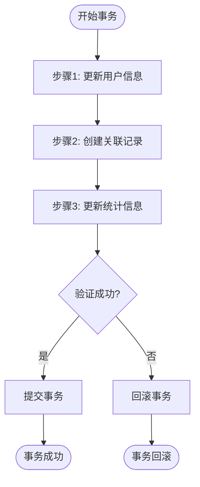

# 集成测试

<cite>
**本文档中引用的文件**  
- [package.json](file://k.yyup.com/package.json)
- [playwright.config.ts](file://k.yyup.com/playwright.config.ts)
- [jest.config.js](file://k.yyup.com/server/APItest/jest.config.js)
- [testApp.ts](file://k.yyup.com/server/APItest/helpers/testApp.ts)
- [authHelper.ts](file://k.yyup.com/server/APItest/helpers/authHelper.ts)
- [api-validation.ts](file://k.yyup.com/server/APItest/helpers/api-validation.ts)
- [globalSetup.ts](file://k.yyup.com/server/APItest/helpers/globalSetup.ts)
- [globalTeardown.ts](file://k.yyup.com/server/APItest/helpers/globalTeardown.ts)
- [test-without-db.js](file://k.yyup.com/server/APItest/scripts/test-without-db.js)
- [bulk-fix-auth.js](file://k.yyup.com/server/APItest/bulk-fix-auth.js)
- [test-results.json](file://k.yyup.com/test-results/centers-test-report.json)
- [test-report.html](file://k.yyup.com/test-results/centers-test-report.html)
- [admin-console-test-report.json](file://k.yyup.com/test-results/admin-console-reports/admin-console-test-report.json)
- [ai-assistant-test-report-1763134909082.json](file://k.yyup.com/test-results/ai-assistant-test/ai-assistant-test-report-1763134909082.json)
- [.env.test](file://k.yyup.com/server/APItest/.env.test)
</cite>

## 目录
1. [引言](#引言)
2. [项目结构与测试布局](#项目结构与测试布局)
3. [核心测试组件](#核心测试组件)
4. [架构概述](#架构概述)
5. [详细组件分析](#详细组件分析)
6. [依赖分析](#依赖分析)
7. [性能考量](#性能考量)
8. [故障排除指南](#故障排除指南)
9. [结论](#结论)

## 引言
本文档详细阐述了k.yyupgame项目的集成测试策略，重点介绍API集成测试和数据库集成测试的实现方法。文档涵盖使用Jest和Shell脚本进行API测试的具体实践，包括认证流程、请求参数验证、响应格式检查等关键点。同时，文档还深入探讨了数据库集成测试，包括数据持久化验证、事务处理和查询性能测试。通过实际测试用例示例，展示如何模拟真实场景下的系统交互，并解释如何使用测试报告（json）分析集成问题，提供常见集成问题的排查和解决方案。

## 项目结构与测试布局
k.yyupgame项目的测试体系分布在多个目录中，主要集中在`k.yyup.com`根目录下的`test-results`、`test-reports`、`server/APItest`等目录。项目采用分层测试策略，包括单元测试、集成测试和端到端测试。集成测试主要集中在`server/APItest`目录，使用Jest框架进行API测试，同时利用Playwright进行前端集成测试。

**Diagram sources**
- [test-results](file://k.yyup.com/test-results)
- [test-reports](file://k.yyup.com/test-reports)
- [server/APItest](file://k.yyup.com/server/APItest)
- [client/tests/e2e](file://k.yyup.com/client/tests/e2e)

**Section sources**
- [package.json](file://k.yyup.com/package.json)
- [test-results](file://k.yyup.com/test-results)
- [test-reports](file://k.yyup.com/test-reports)

## 核心测试组件
项目的核心测试组件包括API测试框架、数据库测试工具和前端集成测试工具。API测试主要使用Jest框架，结合Supertest库进行HTTP请求测试。数据库测试通过Sequelize ORM进行数据持久化验证和事务处理测试。前端集成测试使用Playwright进行浏览器自动化测试，确保前后端接口连通性和用户界面功能正确性。

**Section sources**
- [package.json](file://k.yyup.com/package.json)
- [server/APItest](file://k.yyup.com/server/APItest)
- [client/tests/e2e](file://k.yyup.com/client/tests/e2e)

## 架构概述
k.yyupgame的集成测试架构采用分层设计，包括测试配置层、测试执行层和测试报告层。测试配置层负责管理测试环境和测试数据，测试执行层负责执行具体的测试用例，测试报告层负责生成和分析测试结果。

**Diagram sources**
- [server/APItest](file://k.yyup.com/server/APItest)
- [test-results](file://k.yyup.com/test-results)

## 详细组件分析

### API集成测试分析
API集成测试是k.yyupgame项目的核心测试环节，主要验证前后端接口的连通性、数据一致性和错误处理机制。

#### API测试框架
项目使用Jest作为主要的测试框架，结合Supertest库进行API测试。测试框架通过`testApp.ts`创建测试服务器实例，使用`authHelper.ts`处理认证流程，确保测试环境的安全性。

**Diagram sources**
- [testApp.ts](file://k.yyup.com/server/APItest/helpers/testApp.ts)
- [authHelper.ts](file://k.yyup.com/server/APItest/helpers/authHelper.ts)
- [api-validation.ts](file://k.yyup.com/server/APItest/helpers/api-validation.ts)

#### 认证流程测试
认证流程测试是API测试的关键部分，确保系统在不同角色下的访问控制正确性。测试用例覆盖管理员、教师、家长等不同角色的认证流程。

**Diagram sources**
- [authHelper.ts](file://k.yyup.com/server/APItest/helpers/authHelper.ts)
- [testApp.ts](file://k.yyup.com/server/APItest/helpers/testApp.ts)

#### 请求参数验证
请求参数验证测试确保API接口能够正确处理各种输入情况，包括正常输入、边界值和异常输入。

**Diagram sources**
- [api-validation.ts](file://k.yyup.com/server/APItest/helpers/api-validation.ts)
- [testApp.ts](file://k.yyup.com/server/APItest/helpers/testApp.ts)

### 数据库集成测试分析
数据库集成测试主要验证数据持久化、事务处理和查询性能。

#### 数据持久化验证
数据持久化测试确保数据能够正确地从API层传递到数据库层，并能够正确读取。

**Diagram sources**
- [server/APItest](file://k.yyup.com/server/APItest)
- [server/src](file://k.yyup.com/server/src)

#### 事务处理测试
事务处理测试确保在复杂业务操作中，数据库事务能够正确回滚或提交。

**Diagram sources**
- [server/src/services](file://k.yyup.com/server/src/services)
- [server/src/repositories](file://k.yyup.com/server/src/repositories)

### 测试执行策略
项目采用多种测试执行策略，包括并行测试、顺序测试和条件测试。

**Diagram sources**
- [globalSetup.ts](file://k.yyup.com/server/APItest/helpers/globalSetup.ts)
- [globalTeardown.ts](file://k.yyup.com/server/APItest/helpers/globalTeardown.ts)

**Section sources**
- [server/APItest](file://k.yyup.com/server/APItest)
- [package.json](file://k.yyup.com/package.json)

## 依赖分析
k.yyupgame项目的集成测试依赖多个关键组件和库。

**Diagram sources**
- [package.json](file://k.yyup.com/package.json)
- [server/APItest](file://k.yyup.com/server/APItest)

**Section sources**
- [package.json](file://k.yyup.com/package.json)
- [server/APItest](file://k.yyup.com/server/APItest)

## 性能考量
集成测试的性能考量主要包括测试执行速度、资源利用率和测试覆盖率。

**Diagram sources**
- [package.json](file://k.yyup.com/package.json)
- [test-results](file://k.yyup.com/test-results)

## 故障排除指南
当集成测试出现问题时，可以按照以下步骤进行排查。

**Diagram sources**
- [test-results](file://k.yyup.com/test-results)
- [test-reports](file://k.yyup.com/test-reports)

**Section sources**
- [test-results](file://k.yyup.com/test-results)
- [test-reports](file://k.yyup.com/test-reports)

## 结论
k.yyupgame项目的集成测试体系完善，涵盖了API测试、数据库测试和前端集成测试等多个方面。通过使用Jest和Playwright等现代测试工具，项目能够有效地验证系统的功能正确性和稳定性。测试报告系统提供了详细的测试结果，帮助开发团队快速定位和解决问题。建议继续优化测试覆盖率，增加性能测试和安全测试，以进一步提高系统的质量和可靠性。