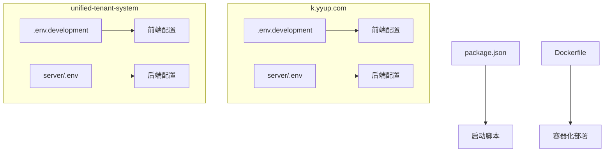
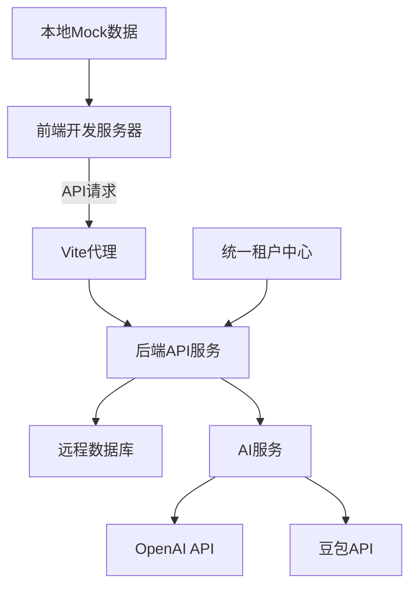
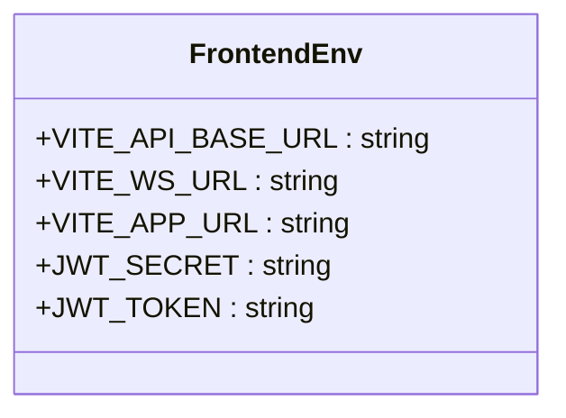
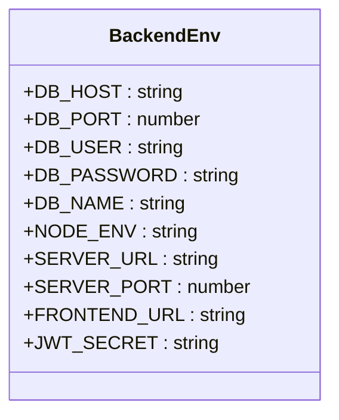
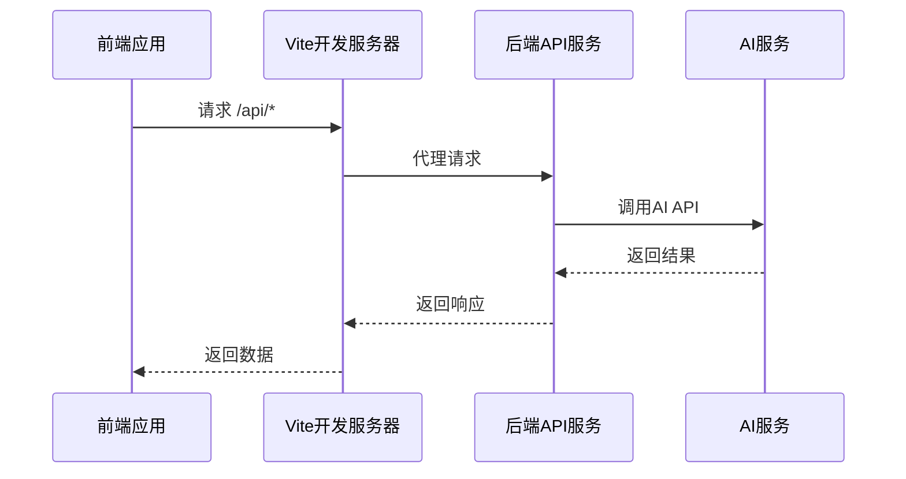
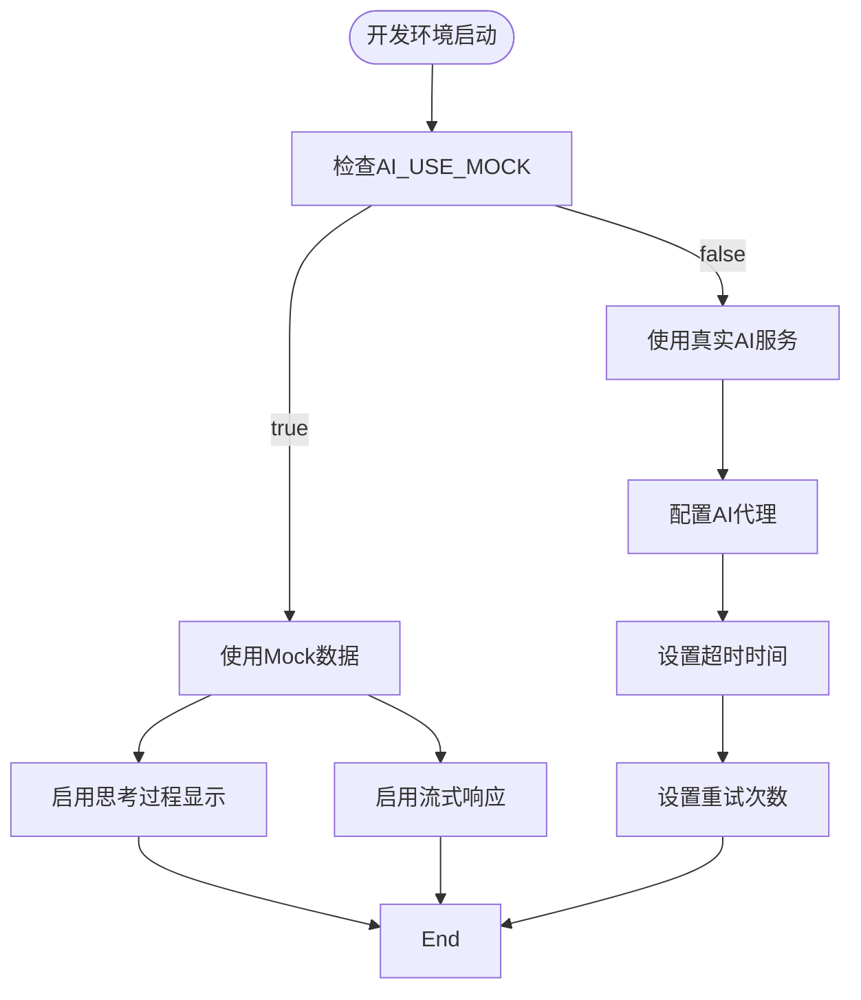

# 开发环境配置

<cite>
**本文档引用的文件**  
- [.env.development](file://k.yyup.com/.env.development)
- [server/.env](file://k.yyup.com/server/.env)
- [unified-tenant-system/.env.development](file://unified-tenant-system/.env.development)
- [unified-tenant-system/server/.env](file://unified-tenant-system/server/.env)
- [k.yyup.com/package.json](file://k.yyup.com/package.json)
- [unified-tenant-system/package.json](file://unified-tenant-system/package.json)
</cite>

## 目录
1. [简介](#简介)
2. [项目结构](#项目结构)
3. [核心组件](#核心组件)
4. [架构概述](#架构概述)
5. [详细组件分析](#详细组件分析)
6. [依赖分析](#依赖分析)
7. [性能考虑](#性能考虑)
8. [故障排除指南](#故障排除指南)
9. [结论](#结论)
10. [附录](#附录)（如有必要）

## 简介
本文档详细介绍了k.yyupgame项目的开发环境配置方法，重点涵盖前端和后端服务的环境变量设置、API代理配置、跨域问题解决方案以及开发环境的最佳实践。文档提供了完整的配置示例，包括mock数据配置、热重载设置和调试工具集成，旨在为开发者提供全面的开发环境搭建指导。

## 项目结构
k.yyupgame项目包含两个主要子系统：k.yyup.com（主应用）和unified-tenant-system（统一租户系统）。每个子系统都有独立的前端和后端配置，通过环境变量文件进行管理。项目使用Vite作为前端构建工具，Express作为后端框架，通过dotenv库加载环境变量。



**图示来源**
- [.env.development](file://k.yyup.com/.env.development)
- [server/.env](file://k.yyup.com/server/.env)
- [unified-tenant-system/.env.development](file://unified-tenant-system/.env.development)
- [unified-tenant-system/server/.env](file://unified-tenant-system/server/.env)

**章节来源**
- [k.yyup.com/.env.development](file://k.yyup.com/.env.development)
- [k.yyup.com/server/.env](file://k.yyup.com/server/.env)
- [unified-tenant-system/.env.development](file://unified-tenant-system/.env.development)
- [unified-tenant-system/server/.env](file://unified-tenant-system/server/.env)

## 核心组件
本项目的核心组件包括前端开发服务器、后端API服务、数据库连接池、AI服务集成和统一租户中心。开发环境通过特定的环境变量文件进行配置，确保本地开发的独立性和安全性。

**章节来源**
- [k.yyup.com/.env.development](file://k.yyup.com/.env.development)
- [k.yyup.com/server/.env](file://k.yyup.com/server/.env)

## 架构概述
k.yyupgame项目的开发环境采用前后端分离架构，前端通过Vite开发服务器运行，后端通过Express服务提供API。两个系统通过环境变量进行配置，确保开发、测试和生产环境的隔离。AI服务通过代理配置与外部API通信，数据库使用远程MySQL实例。



**图示来源**
- [k.yyup.com/.env.development](file://k.yyup.com/.env.development)
- [k.yyup.com/server/.env](file://k.yyup.com/server/.env)
- [unified-tenant-system/server/.env](file://unified-tenant-system/server/.env)

## 详细组件分析

### 前端开发环境配置
前端开发环境通过`.env.development`文件进行配置，主要包含API基础URL、WebSocket地址和应用URL等关键变量。Vite开发服务器使用这些变量进行代理设置，解决跨域问题。

#### 环境变量配置


**图示来源**
- [k.yyup.com/.env.development](file://k.yyup.com/.env.development)
- [unified-tenant-system/.env.development](file://unified-tenant-system/.env.development)

### 后端服务配置
后端服务通过`server/.env`文件进行配置，包含数据库连接、服务器端口、JWT密钥、AI服务配置等。开发环境强制使用远程数据库，禁用SQLite，确保数据一致性。

#### 服务器配置


**图示来源**
- [k.yyup.com/server/.env](file://k.yyup.com/server/.env)
- [unified-tenant-system/server/.env](file://unified-tenant-system/server/.env)

### API代理与跨域配置
开发环境通过Vite的代理功能解决跨域问题，前端请求被代理到后端API服务。同时，AI服务的代理设置被禁用，以解决豆包API连接问题。



**图示来源**
- [k.yyup.com/.env.development](file://k.yyup.com/.env.development)
- [k.yyup.com/server/.env](file://k.yyup.com/server/.env)

### Mock数据与调试配置
开发环境支持Mock数据配置，通过`AI_USE_MOCK=true`启用AI服务的Mock模式。同时，调试模式通过JWT_TOKEN预设管理员令牌，方便开发测试。



**图示来源**
- [k.yyup.com/server/.env](file://k.yyup.com/server/.env#L67-L73)
- [unified-tenant-system/server/.env](file://unified-tenant-system/server/.env)

## 依赖分析
项目依赖通过package.json文件管理，开发依赖包括Vite、Playwright、Jest等工具，生产依赖包括Express、Vue、Pinia等框架。通过concurrently工具并行启动前后端服务。

```mermaid
dependencyDiagram
k.yyup.com --> unified-tenant-system : "租户管理"
k.yyup.com --> database : "数据存储"
k.yyup.com --> AI服务 : "智能功能"
unified-tenant-system --> database : "租户数据"
AI服务 --> OpenAI : "语言模型"
AI服务 --> 豆包 : "语音服务"
```

**图示来源**
- [k.yyup.com/package.json](file://k.yyup.com/package.json)
- [unified-tenant-system/package.json](file://unified-tenant-system/package.json)

## 性能考虑
开发环境的性能配置包括数据库连接池优化、AI服务超时设置和最大重试次数。通过合理的连接池配置（最大25连接，最小8连接）提高数据库访问效率。

**章节来源**
- [k.yyup.com/server/.env](file://k.yyup.com/server/.env#L12-L17)
- [unified-tenant-system/server/.env](file://unified-tenant-system/server/.env)

## 故障排除指南
常见开发环境问题包括数据库连接失败、AI服务超时和跨域错误。解决方案包括检查环境变量配置、验证网络连接和调整超时设置。

**章节来源**
- [k.yyup.com/server/.env](file://k.yyup.com/server/.env#L47-L53)
- [k.yyup.com/.env.development](file://k.yyup.com/.env.development)

## 结论
k.yyupgame项目的开发环境配置完善，通过分离的环境变量文件管理前后端配置，确保了开发的安全性和灵活性。建议开发者严格按照文档配置环境变量，充分利用Mock数据和调试工具提高开发效率。