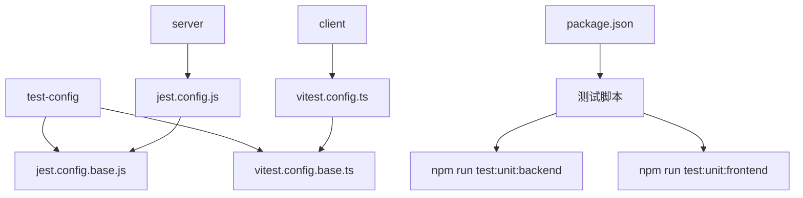

# 单元测试配置

<cite>
**本文档引用的文件**  
- [jest.config.base.js](file://k.yyup.com/test-config/jest.config.base.js)
- [vitest.config.base.ts](file://k.yyup.com/test-config/vitest.config.base.ts)
- [jest.config.js](file://k.yyup.com/server/jest.config.js)
- [vitest.config.ts](file://k.yyup.com/client/vitest.config.ts)
- [tsconfig.json](file://k.yyup.com/tsconfig.json)
- [package.json](file://k.yyup.com/package.json)
</cite>

## 目录
1. [项目结构](#项目结构)
2. [核心测试框架配置](#核心测试框架配置)
3. [Jest 配置详解](#jest-配置详解)
4. [Vitest 配置详解](#vitest-配置详解)
5. [TypeScript 类型安全配置](#typescript-类型安全配置)
6. [测试性能与并发配置](#测试性能与并发配置)
7. [前后端测试配置示例](#前后端测试配置示例)
8. [常见问题与解决方案](#常见问题与解决方案)
9. [最佳实践建议](#最佳实践建议)

## 项目结构

k.yyupgame 项目采用前后端分离架构，测试配置文件集中存放在 `test-config` 目录中，作为基础配置被各模块继承使用。后端服务使用 Jest 进行单元测试，前端组件使用 Vitest 进行测试，两者均基于 TypeScript 并集成覆盖率检查。

**图示来源**  
- [jest.config.base.js](file://k.yyup.com/test-config/jest.config.base.js)
- [vitest.config.base.ts](file://k.yyup.com/test-config/vitest.config.base.ts)
- [package.json](file://k.yyup.com/package.json)

**本节来源**  
- [k.yyup.com/test-config](file://k.yyup.com/test-config)
- [k.yyup.com/server](file://k.yyup.com/server)
- [k.yyup.com/client](file://k.yyup.com/client)

## 核心测试框架配置

项目采用 Jest 和 Vitest 双框架策略：Jest 用于后端 Node.js 服务的单元测试，Vitest 用于前端 Vue3 组件的单元测试。两者均通过基础配置文件实现统一标准，并在具体项目中进行扩展。

### 框架选择依据
- **Jest**：成熟稳定，适合后端服务测试，支持异步测试、Mock 等功能
- **Vitest**：轻量快速，与 Vite 深度集成，适合前端组件测试，支持 ESM

### 配置继承机制
项目通过模块导入方式实现配置继承，确保配置一致性：
- 后端 Jest 配置继承自 `jest.config.base.js`
- 前端 Vitest 配置继承自 `vitest.config.base.ts`

**本节来源**  
- [jest.config.base.js](file://k.yyup.com/test-config/jest.config.base.js)
- [vitest.config.base.ts](file://k.yyup.com/test-config/vitest.config.base.ts)

## Jest 配置详解

Jest 配置以 `jest.config.base.js` 为基础，通过 `jest.config.js` 在后端项目中继承扩展，实现统一的测试标准。

### 测试环境配置
- **testEnvironment**: 设置为 `node`，适用于后端服务测试
- **testEnvironmentOptions**: 设置 `NODE_ENV=test`，确保测试环境隔离

### 模块解析配置
- **moduleNameMapping**: 配置路径别名映射，支持 `@/`, `@server/`, `@shared/` 等别名
- **moduleFileExtensions**: 支持 `.js`, `.json`, `.ts` 文件扩展名

### 转换配置
- **transform**: 使用 `ts-jest` 处理 TypeScript 文件
- **transformIgnorePatterns**: 忽略 node_modules 中非 .mjs 文件的转换

### 覆盖率收集
- **collectCoverageFrom**: 精确指定覆盖率收集范围，排除类型定义、接口、枚举等文件
- **coverageThreshold**: 设置 100% 覆盖率目标，确保代码质量
- **coverageReporters**: 支持多种报告格式，包括文本、HTML、LCov、JSON 等

### 性能与并发
- **maxConcurrency**: 限制最大并发数为 5
- **maxWorkers**: 设置为 `50%`，根据 CPU 核心数动态调整
- **testTimeout**: 设置 30 秒超时，防止测试卡死

### 报告与输出
- **reporters**: 配置多种报告器，包括默认报告、HTML 报告和 JUnit 报告
- **coverageDirectory**: 指定覆盖率报告输出目录

**本节来源**  
- [jest.config.base.js](file://k.yyup.com/test-config/jest.config.base.js#L1-L248)
- [jest.config.js](file://k.yyup.com/server/jest.config.js#L1-L30)

## Vitest 配置详解

Vitest 配置以 `vitest.config.base.ts` 为基础，通过 `vitest.config.ts` 在前端项目中继承扩展，专为 Vue3 项目优化。

### 测试环境配置
- **environment**: 使用 `happy-dom` 作为测试环境，模拟浏览器 DOM
- **env**: 配置测试环境变量，包括 API 基础 URL 等

### 模块解析配置
- **resolve.alias**: 配置路径别名，支持 `@`, `@test`, `@shared` 等别名
- **plugins**: 集成 Vue 插件，支持 `.vue` 文件测试

### 覆盖率收集
- **coverage.include/exclude**: 精确控制覆盖率收集范围，排除主入口、类型定义等文件
- **coverage.thresholds**: 设置 100% 覆盖率目标
- **coverage.provider**: 使用 `v8` 提供商，性能更优

### 性能与并发
- **pool**: 使用 `threads` 池，支持多线程并发执行
- **poolOptions.threads**: 配置线程数范围（1-4）
- **testTimeout**: 前端配置 10 分钟超时，适应复杂组件测试

### 报告与输出
- **reporter**: 支持详细、JSON、HTML 等多种报告格式
- **outputFile**: 指定测试结果和报告文件路径

**本节来源**  
- [vitest.config.base.ts](file://k.yyup.com/test-config/vitest.config.base.ts#L1-L147)
- [vitest.config.ts](file://k.yyup.com/client/vitest.config.ts#L1-L44)

## TypeScript 类型安全配置

项目通过 `tsconfig.json` 和测试框架集成，确保 TypeScript 类型安全。

### 编译选项
- **strict**: 启用严格模式，确保类型安全
- **isolatedModules**: 启用隔离模块，兼容 Jest 转换
- **esModuleInterop**: 启用 ES 模块互操作性

### 路径映射
- **baseUrl**: 设置为项目根目录
- **paths**: 配置 `@/*` 路径映射，支持模块别名

### 测试框架集成
- **ts-jest**: 在 Jest 中配置 tsconfig 路径，确保类型检查一致性
- **Vitest**: 原生支持 TypeScript，无需额外配置

**本节来源**  
- [tsconfig.json](file://k.yyup.com/tsconfig.json#L1-L21)
- [client/tsconfig.json](file://k.yyup.com/client/tsconfig.json#L1-L50)
- [jest.config.base.js](file://k.yyup.com/test-config/jest.config.base.js#L146-L147)

## 测试性能与并发配置

项目通过合理的性能配置，平衡测试速度与资源消耗。

### 并发策略
- **Jest**: 使用 `maxWorkers: '50%'` 动态调整工作进程数
- **Vitest**: 使用 `threads` 池，配置 1-4 个线程

### 超时配置
- **Jest**: 30 秒超时，适合后端服务测试
- **Vitest**: 10 分钟超时，适应前端复杂组件测试

### 缓存配置
- **Jest**: 启用缓存，缓存目录为 `node_modules/.cache/jest`
- **Vitest**: 默认启用 Vite 缓存机制

### 资源监控
- **detectOpenHandles**: 启用打开句柄检测，防止资源泄漏
- **forceExit**: 强制退出，确保测试进程正常结束

**本节来源**  
- [jest.config.base.js](file://k.yyup.com/test-config/jest.config.base.js#L130-L138)
- [vitest.config.base.ts](file://k.yyup.com/test-config/vitest.config.base.ts#L100-L106)

## 前后端测试配置示例

### 后端测试配置示例
后端测试配置继承基础配置，并添加服务器特定设置：
- 调整 `collectCoverageFrom` 范围
- 指定 `setupFilesAfterEnv` 和全局设置文件
- 设置测试根目录

### 前端测试配置示例
前端测试配置继承基础配置，并添加客户端特定设置：
- 覆盖测试超时为 10 分钟
- 调整覆盖率配置范围
- 重新定义路径别名

### 测试脚本
通过 `package.json` 中的脚本命令统一管理测试：
- `test:unit:backend`: 运行后端单元测试
- `test:unit:frontend`: 运行前端单元测试
- `test:coverage`: 运行覆盖率测试

**本节来源**  
- [jest.config.js](file://k.yyup.com/server/jest.config.js#L1-L30)
- [vitest.config.ts](file://k.yyup.com/client/vitest.config.ts#L1-L44)
- [package.json](file://k.yyup.com/package.json#L146-L157)

## 常见问题与解决方案

### 循环依赖问题
- **问题**: 模块间循环依赖导致测试失败
- **解决方案**: 使用 `setupFilesAfterEnv` 在测试前初始化依赖，或重构代码消除循环依赖

### ES 模块兼容性
- **问题**: ES 模块与 CommonJS 混用导致问题
- **解决方案**: 在 `transformIgnorePatterns` 中正确配置 .mjs 文件处理

### 类型声明问题
- **问题**: 测试文件类型声明缺失
- **解决方案**: 在 `tsconfig.json` 中正确配置 `types` 和 `typeRoots`

### 覆盖率报告不准确
- **问题**: 覆盖率报告包含不应计入的文件
- **解决方案**: 精确配置 `collectCoverageFrom` 的 include 和 exclude 规则

**本节来源**  
- [jest.config.base.js](file://k.yyup.com/test-config/jest.config.base.js#L53-L69)
- [vitest.config.base.ts](file://k.yyup.com/test-config/vitest.config.base.ts#L67-L82)
- [client/tsconfig.json](file://k.yyup.com/client/tsconfig.json#L35-L36)

## 最佳实践建议

1. **统一基础配置**: 所有项目应继承统一的基础配置，确保测试标准一致
2. **精确覆盖率范围**: 合理配置覆盖率收集范围，避免包含类型定义等不应测试的文件
3. **合理设置超时**: 根据测试类型设置合理超时，后端 30 秒，前端可适当延长
4. **充分利用并发**: 合理配置并发数，充分利用多核 CPU 提升测试速度
5. **定期清理缓存**: 定期清理 Jest 缓存，避免缓存导致的测试问题
6. **100% 覆盖率目标**: 设定 100% 覆盖率目标，确保代码质量
7. **持续集成**: 在 CI/CD 流程中集成测试，确保代码质量

**本节来源**  
- [jest.config.base.js](file://k.yyup.com/test-config/jest.config.base.js)
- [vitest.config.base.ts](file://k.yyup.com/test-config/vitest.config.base.ts)
- [package.json](file://k.yyup.com/package.json)