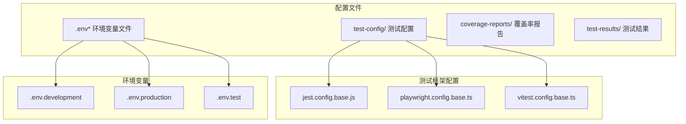
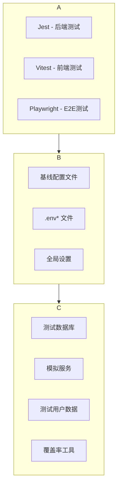
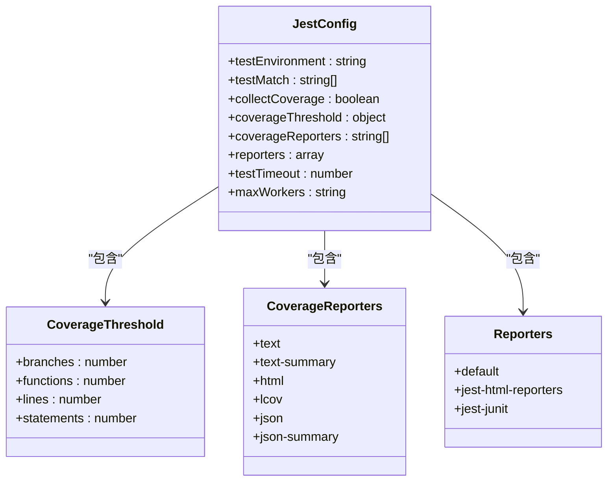
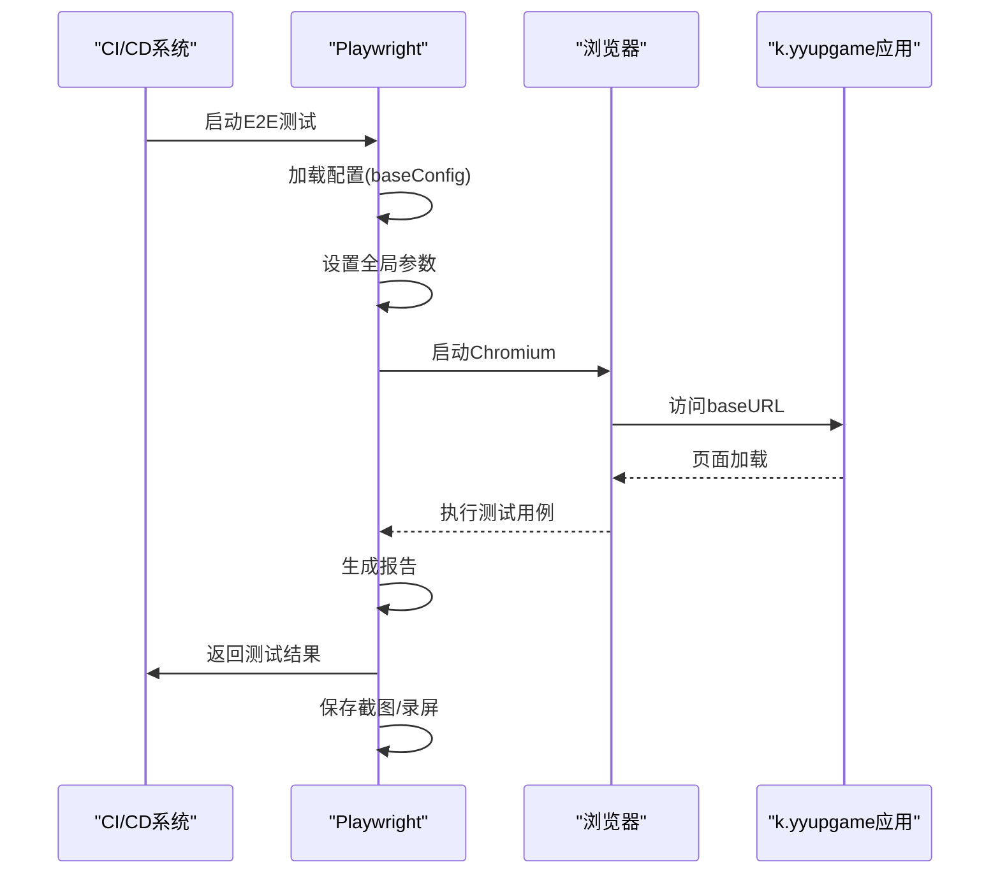
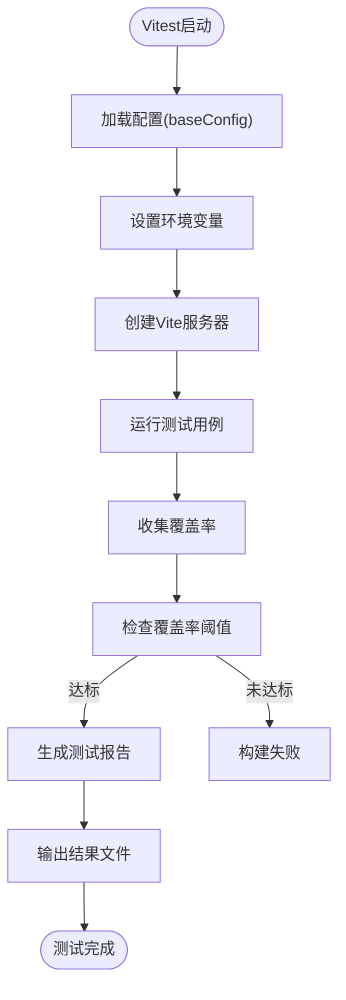
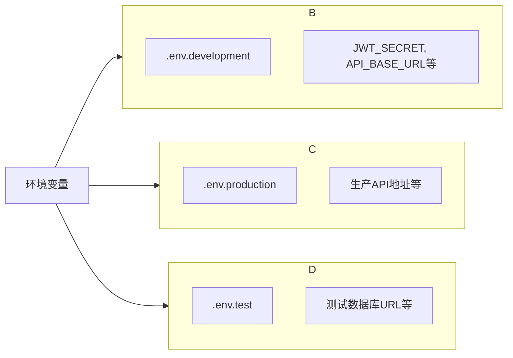

# 测试环境配置

<cite>
**本文档中引用的文件**  
- [jest.config.base.js](file://k.yyup.com/test-config/jest.config.base.js)
- [playwright.config.base.ts](file://k.yyup.com/test-config/playwright.config.base.ts)
- [vitest.config.base.ts](file://k.yyup.com/test-config/vitest.config.base.ts)
- [.env](file://k.yyup.com/.env)
- [.env.development](file://k.yyup.com/.env.development)
- [.env.production](file://k.yyup.com/.env.production)
</cite>

## 目录
1. [简介](#简介)
2. [项目结构](#项目结构)
3. [核心组件](#核心组件)
4. [架构概述](#架构概述)
5. [详细组件分析](#详细组件分析)
6. [依赖分析](#依赖分析)
7. [性能考虑](#性能考虑)
8. [故障排除指南](#故障排除指南)
9. [结论](#结论)
10. [附录](#附录)（如有必要）

## 简介
本文档详细介绍了k.yyupgame项目在测试环境下的配置方法，重点涵盖测试数据库设置、模拟服务配置、测试用户数据初始化等特殊配置需求。文档解释了如何通过环境隔离机制避免测试数据对开发和生产环境的影响，并说明了不同测试类型（单元测试、集成测试、E2E测试）的配置差异。同时提供了Jest、Playwright和Vitest测试框架的配置方法，以及测试覆盖率、性能测试参数和自动化测试调度的完整配置示例。最后为测试人员提供了测试环境配置的最佳实践。

## 项目结构
k.yyupgame项目的测试配置文件主要分布在`test-config`目录下，包括Jest、Playwright和Vitest的基线配置文件。环境变量配置文件位于项目根目录，通过不同的`.env`文件实现环境隔离。测试报告和覆盖率数据分别存储在`test-results`和`coverage-reports`目录中。



**Diagram sources**
- [test-config/jest.config.base.js](file://k.yyup.com/test-config/jest.config.base.js)
- [test-config/playwright.config.base.ts](file://k.yyup.com/test-config/playwright.config.base.ts)
- [test-config/vitest.config.base.ts](file://k.yyup.com/test-config/vitest.config.base.ts)
- [.env](file://k.yyup.com/.env)

**Section sources**
- [test-config](file://k.yyup.com/test-config)
- [.env](file://k.yyup.com/.env)

## 核心组件
k.yyupgame项目的测试环境由三个核心测试框架构成：Jest用于后端单元测试和集成测试，Vitest用于前端单元测试，Playwright用于端到端（E2E）测试。这些框架通过基线配置文件实现统一的测试标准和报告格式。环境变量系统通过`.env`文件族实现不同环境的配置隔离，确保测试环境的独立性和安全性。

**Section sources**
- [test-config/jest.config.base.js](file://k.yyup.com/test-config/jest.config.base.js)
- [test-config/playwright.config.base.ts](file://k.yyup.com/test-config/playwright.config.base.ts)
- [test-config/vitest.config.base.ts](file://k.yyup.com/test-config/vitest.config.base.ts)

## 架构概述
k.yyupgame测试环境采用分层架构设计，上层为测试框架层，中层为配置管理层，底层为执行环境层。测试框架层包含Jest、Vitest和Playwright，分别负责不同类型的测试任务。配置管理层通过基线配置文件和环境变量文件实现配置的统一管理和环境隔离。执行环境层提供测试运行所需的各种服务和资源。



**Diagram sources**
- [test-config/jest.config.base.js](file://k.yyup.com/test-config/jest.config.base.js)
- [test-config/playwright.config.base.ts](file://k.yyup.com/test-config/playwright.config.base.ts)
- [test-config/vitest.config.base.ts](file://k.yyup.com/test-config/vitest.config.base.ts)

## 详细组件分析

### 测试框架配置分析

#### Jest配置分析
Jest配置文件定义了后端测试的完整环境，包括测试匹配模式、覆盖率收集规则、报告格式等。配置中设置了100%的覆盖率阈值，确保代码质量。测试结果以多种格式输出，包括HTML、JSON和JUnit格式，便于集成到CI/CD流程中。



**Diagram sources**
- [test-config/jest.config.base.js](file://k.yyup.com/test-config/jest.config.base.js)

#### Playwright配置分析
Playwright配置文件定义了E2E测试的完整设置，包括多浏览器支持、移动设备模拟、截图和录屏功能等。配置中包含了Chrome、Firefox、WebKit等主流浏览器的测试项目，以及Pixel 5和iPhone 12等移动设备的模拟配置，确保应用在不同设备和浏览器上的兼容性。



**Diagram sources**
- [test-config/playwright.config.base.ts](file://k.yyup.com/test-config/playwright.config.base.ts)

#### Vitest配置分析
Vitest配置文件定义了前端测试的完整环境，使用happy-dom作为测试环境，支持Vue组件的测试。配置中包含了前端特有的环境变量，如API基础URL和代理目标，确保前端测试能够正确连接到测试后端。覆盖率配置同样设置了100%的目标，保证前端代码质量。



**Diagram sources**
- [test-config/vitest.config.base.ts](file://k.yyup.com/test-config/vitest.config.base.ts)

**Section sources**
- [test-config/jest.config.base.js](file://k.yyup.com/test-config/jest.config.base.js)
- [test-config/playwright.config.base.ts](file://k.yyup.com/test-config/playwright.config.base.ts)
- [test-config/vitest.config.base.ts](file://k.yyup.com/test-config/vitest.config.base.ts)

### 环境隔离机制分析
k.yyupgame项目通过环境变量文件实现不同环境的配置隔离。虽然当前文件结构中未找到`.env.test`文件，但根据`.env.development`和`.env.production`的存在，可以推断项目采用类似的命名约定。环境变量系统确保测试数据不会影响开发和生产环境。



**Diagram sources**
- [.env.development](file://k.yyup.com/.env.development)
- [.env.production](file://k.yyup.com/.env.production)

## 依赖分析
k.yyupgame测试环境依赖于多个外部工具和库，包括Jest、Playwright、Vitest等测试框架，以及ts-jest、happy-dom等辅助工具。这些依赖通过npm包管理器进行管理，确保版本的一致性和可重复性。

```mermaid
graph TD
A[Jest] --> B[ts-jest]
A --> C[jest-html-reporters]
A --> D[jest-junit]
E[Playwright] --> F[@playwright/test]
G[Vitest] --> H[@vitejs/plugin-vue]
G --> I[happy-dom]
J[项目] --> A
J --> E
J --> G
```

**Diagram sources**
- [package.json](file://k.yyup.com/package.json)
- [test-config/jest.config.base.js](file://k.yyup.com/test-config/jest.config.base.js)
- [test-config/playwright.config.base.ts](file://k.yyup.com/test-config/playwright.config.base.ts)
- [test-config/vitest.config.base.ts](file://k.yyup.com/test-config/vitest.config.base.ts)

## 性能考虑
k.yyupgame测试环境在性能方面进行了多项优化配置。Jest配置中设置了`maxWorkers: '50%'`，合理利用系统资源而不影响其他进程。Playwright配置中使用`fullyParallel: true`实现测试的完全并行化，提高测试执行效率。Vitest配置中使用线程池(`pool: 'threads'`)来并行执行测试，加快前端测试速度。

## 故障排除指南
当测试环境出现问题时，可以按照以下步骤进行排查：首先检查环境变量配置是否正确，特别是API基础URL和数据库连接字符串；其次验证测试框架配置文件是否完整，确保所有必要的设置都已正确配置；然后检查测试依赖是否完整安装，必要时重新运行`npm install`；最后查看测试日志和报告，定位具体的失败原因。

**Section sources**
- [test-config/jest.config.base.js](file://k.yyup.com/test-config/jest.config.base.js)
- [test-config/playwright.config.base.ts](file://k.yyup.com/test-config/playwright.config.base.ts)
- [test-config/vitest.config.base.ts](file://k.yyup.com/test-config/vitest.config.base.ts)

## 结论
k.yyupgame项目建立了完善的测试环境配置体系，通过Jest、Vitest和Playwright三个测试框架覆盖了从单元测试到E2E测试的各个层面。基线配置文件确保了测试标准的统一，环境变量机制实现了不同环境的安全隔离。100%的覆盖率阈值要求保证了代码质量，多种格式的测试报告便于集成到CI/CD流程中。建议补充`.env.test`文件，进一步完善测试环境的配置。