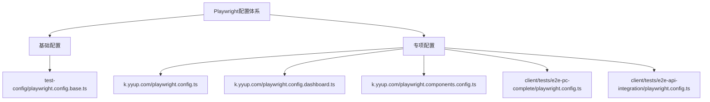
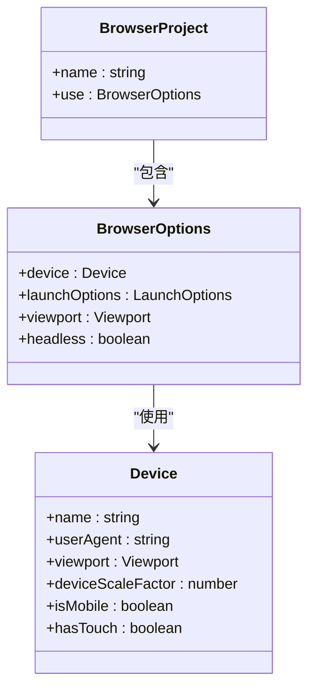
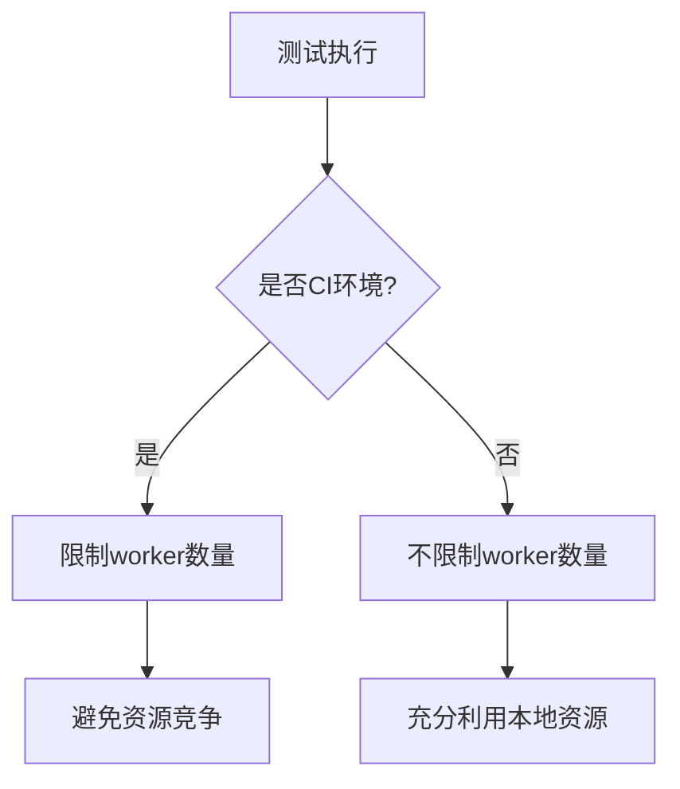
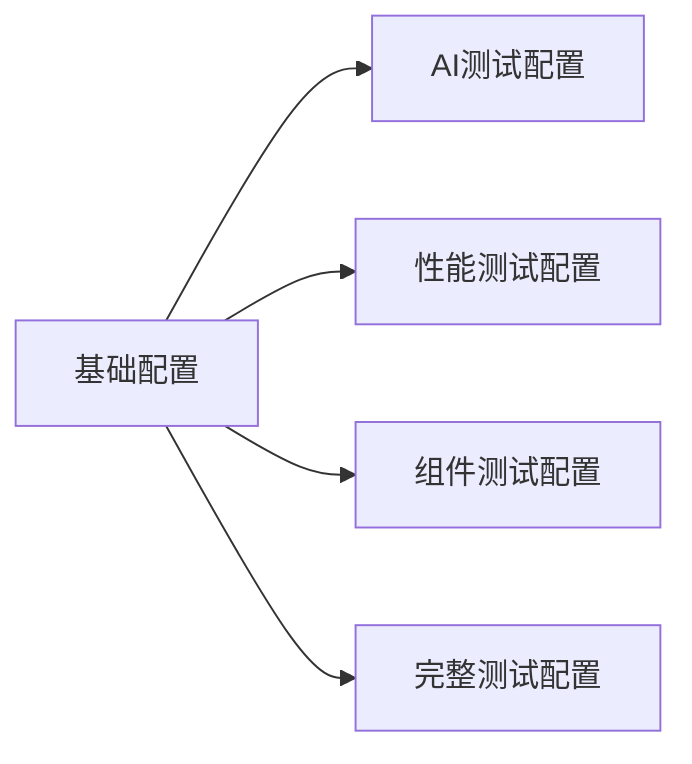

# 端到端测试配置

<cite>
**本文档引用的文件**  
- [playwright.config.ts](file://k.yyup.com/playwright.config.ts)
- [playwright.config.dashboard.ts](file://k.yyup.com/playwright.config.dashboard.ts)
- [playwright.components.config.ts](file://k.yyup.com/playwright.components.config.ts)
- [test-config/playwright.config.base.ts](file://k.yyup.com/test-config/playwright.config.base.ts)
- [tests/frontend/e2e/playwright.config.ts](file://k.yyup.com/tests/frontend/e2e/playwright.config.ts)
- [client/tests/e2e-pc-complete/playwright.config.ts](file://k.yyup.com/client/tests/e2e-pc-complete/playwright.config.ts)
- [client/tests/e2e-api-integration/playwright.config.ts](file://k.yyup.com/client/tests/e2e-api-integration/playwright.config.ts)
- [client/tests/e2e/global-setup.ts](file://k.yyup.com/client/tests/e2e/global-setup.ts)
- [client/tests/e2e/global-teardown.ts](file://k.yyup.com/client/tests/e2e/global-teardown.ts)
- [client/tests/e2e/auth.e2e.test.ts](file://k.yyup.com/client/tests/e2e/auth.e2e.test.ts)
- [client/tests/e2e/dashboard-complete.e2e.test.ts](file://k.yyup.com/client/tests/e2e/dashboard-complete.e2e.test.ts)
- [client/tests/e2e/student-management-full.e2e.test.ts](file://k.yyup.com/client/tests/e2e/student-management-full.e2e.test.ts)
</cite>

## 目录
1. [简介](#简介)
2. [项目结构](#项目结构)
3. [核心配置文件分析](#核心配置文件分析)
4. [浏览器配置与多环境测试](#浏览器配置与多环境测试)
5. [测试分片与并发控制](#测试分片与并发控制)
6. [媒体录制策略](#媒体录制策略)
7. [网络拦截与调试配置](#网络拦截与调试配置)
8. [特殊场景测试配置](#特殊场景测试配置)
9. [测试稳定性优化](#测试稳定性优化)
10. [测试结果分析与报告生成](#测试结果分析与报告生成)
11. [完整E2E测试示例](#完整e2e测试示例)
12. [最佳实践总结](#最佳实践总结)

## 简介
本文档详细介绍了k.yyupgame项目中Playwright自动化测试框架的端到端测试配置方法。文档深入解析了`playwright.config.base.ts`和`playwright.config.ts`中的核心配置选项，包括浏览器配置、测试分片、视频录制、截图策略、网络拦截等。同时，文档说明了如何配置多环境测试（Chrome、Firefox、WebKit）、移动设备模拟、地理位置测试等特殊场景，并提供了完整的E2E测试配置示例。

## 项目结构
k.yyupgame项目的端到端测试配置采用模块化设计，通过多个配置文件实现不同测试场景的精细化管理。项目在根目录和各个子模块中都包含了特定的Playwright配置文件，形成了层次化的测试配置体系。



**图示来源**  
- [playwright.config.base.ts](file://k.yyup.com/test-config/playwright.config.base.ts)
- [playwright.config.ts](file://k.yyup.com/playwright.config.ts)
- [playwright.config.dashboard.ts](file://k.yyup.com/playwright.config.dashboard.ts)

## 核心配置文件分析

### 基础配置文件
`playwright.config.base.ts`作为项目的基础配置文件，定义了统一的E2E测试配置标准。该配置文件通过导出`baseConfig`常量，为其他专项配置提供继承基础。

**配置要点：**
- 统一的测试目录和文件匹配模式
- 标准化的超时和重试机制
- 一致的报告生成配置
- 全局的浏览器和网络设置

**配置来源**  
- [test-config/playwright.config.base.ts](file://k.yyup.com/test-config/playwright.config.base.ts)

### 专项配置文件
项目包含多个专项配置文件，针对不同测试场景进行优化：

- `playwright.config.ts`：AI助手系统专用配置
- `playwright.config.dashboard.ts`：仪表板性能测试专用配置
- `playwright.components.config.ts`：组件库测试专用配置
- `e2e-pc-complete/playwright.config.ts`：PC端完整测试专用配置
- `e2e-api-integration/playwright.config.ts`：API集成测试专用配置

这些配置文件通过继承或参考基础配置，实现了测试策略的差异化。

**配置来源**  
- [playwright.config.ts](file://k.yyup.com/playwright.config.ts)
- [playwright.config.dashboard.ts](file://k.yyup.com/playwright.config.dashboard.ts)
- [playwright.components.config.ts](file://k.yyup.com/playwright.components.config.ts)

## 浏览器配置与多环境测试

### 多浏览器支持
项目通过`projects`配置项实现了对多种浏览器的支持。每个项目配置都基于Playwright提供的设备预设，确保测试环境的一致性。



**图示来源**  
- [playwright.components.config.ts](file://k.yyup.com/playwright.components.config.ts#L48-L68)
- [playwright.config.base.ts](file://k.yyup.com/test-config/playwright.config.base.ts#L69-L111)

### 桌面浏览器配置
项目支持Chrome、Firefox和WebKit三种主流桌面浏览器的测试：

```typescript
projects: [
  {
    name: 'chromium',
    use: { ...devices['Desktop Chrome'] }
  },
  {
    name: 'firefox',
    use: { ...devices['Desktop Firefox'] }
  },
  {
    name: 'webkit',
    use: { ...devices['Desktop Safari'] }
  }
]
```

每种浏览器都有特定的启动参数配置，如Chrome的`--disable-web-security`和Firefox的TLS不安全回退设置。

**配置来源**  
- [playwright.config.base.ts](file://k.yyup.com/test-config/playwright.config.base.ts#L69-L95)

### 移动设备模拟
通过Playwright内置的设备预设，项目支持移动设备的模拟测试：

```typescript
projects: [
  {
    name: 'mobile-chrome',
    use: { 
      ...devices['Pixel 5'],
      hasTouch: true
    }
  },
  {
    name: 'mobile-safari',
    use: { 
      ...devices['iPhone 12'],
      hasTouch: true
    }
  }
]
```

这种配置可以真实模拟移动设备的触摸交互和屏幕尺寸。

**配置来源**  
- [playwright.config.base.ts](file://k.yyup.com/test-config/playwright.config.base.ts#L98-L111)

## 测试分片与并发控制

### 并行执行配置
项目通过`fullyParallel`和`workers`选项控制测试的并行执行：

```typescript
fullyParallel: true,
workers: process.env.CI ? 2 : undefined,
```

在CI环境中，worker数量被限制为2，以平衡资源使用和测试速度。

**配置来源**  
- [playwright.config.base.ts](file://k.yyup.com/test-config/playwright.config.base.ts#L15-L16)

### 分片策略
项目采用智能分片策略，在不同环境下调整并发级别：

- 开发环境：不限制worker数量，充分利用本地资源
- CI环境：限制worker数量，避免资源竞争
- 性能测试：禁用并行，确保测试结果准确性

```typescript
workers: process.env.CI ? 2 : undefined,
```

**配置来源**  
- [playwright.config.dashboard.ts](file://k.yyup.com/playwright.config.dashboard.ts#L16)
- [playwright.config.base.ts](file://k.yyup.com/test-config/playwright.config.base.ts#L20)

## 媒体制作策略

### 截图策略
项目采用精细化的截图策略，根据不同场景配置不同的截图模式：

```typescript
screenshot: 'only-on-failure'
```

这种策略只在测试失败时生成截图，既保证了问题排查的需要，又避免了不必要的存储开销。

**配置来源**  
- [playwright.config.base.ts](file://k.yyup.com/test-config/playwright.config.base.ts#L47)

### 视频录制
视频录制配置同样采用失败保留策略：

```typescript
video: 'retain-on-failure'
```

录制的视频文件可以帮助开发人员完整复现测试失败时的用户操作流程。

**配置来源**  
- [playwright.config.base.ts](file://k.yyup.com/test-config/playwright.config.base.ts#L48)

### 操作追踪
操作追踪是调试复杂问题的重要工具：

```typescript
trace: 'retain-on-failure'
```

追踪文件包含了测试执行过程中的所有操作、网络请求和控制台日志，是问题分析的宝贵资源。

**配置来源**  
- [playwright.config.base.ts](file://k.yyup.com/test-config/playwright.config.base.ts#L46)

## 网络拦截与调试配置

### 网络设置
项目配置了全面的网络相关选项：

```typescript
use: {
  ignoreHTTPSErrors: true,
  extraHTTPHeaders: {
    'Accept-Language': 'zh-CN,zh;q=0.9,en;q=0.8'
  }
}
```

这些设置确保了测试可以在各种网络环境下稳定运行。

**配置来源**  
- [playwright.config.base.ts](file://k.yyup.com/test-config/playwright.config.base.ts#L58-L63)

### 地理位置测试
通过配置地理位置和权限，项目支持地理位置相关的测试：

```typescript
geolocation: { latitude: 39.9042, longitude: 116.4074 }, // 北京
permissions: ['geolocation']
```

这种配置可以测试基于地理位置的功能，如区域化内容展示。

**配置来源**  
- [client/tests/e2e-pc-complete/playwright.config.ts](file://k.yyup.com/client/tests/e2e-pc-complete/playwright.config.ts#L93-L94)

## 特殊场景测试配置

### 性能测试配置
`playwright.config.dashboard.ts`专门针对性能测试进行了优化：

```typescript
fullyParallel: false,
workers: 1,
```

禁用并行执行可以确保性能测试结果的准确性，避免并发干扰。

**配置来源**  
- [playwright.config.dashboard.ts](file://k.yyup.com/playwright.config.dashboard.ts#L10-L16)

### API集成测试
API集成测试配置专注于前后端接口的验证：

```typescript
reporter: [
  ['html', { outputFolder: 'reports/html' }],
  ['json', { outputFile: 'reports/test-results.json' }]
]
```

这种配置生成详细的测试报告，便于分析API调用情况。

**配置来源**  
- [client/tests/e2e-api-integration/playwright.config.ts](file://k.yyup.com/client/tests/e2e-api-integration/playwright.config.ts#L22-L26)

### PC端完整测试
PC端完整测试配置覆盖了四角色100%的测试场景：

```typescript
viewport: { width: 1920, height: 1080 },
userAgent: 'Mozilla/5.0 (Windows NT 10.0; Win64; x64) AppleWebKit/537.36'
```

高分辨率和标准Windows用户代理确保了PC端功能的全面验证。

**配置来源**  
- [client/tests/e2e-pc-complete/playwright.config.ts](file://k.yyup.com/client/tests/e2e-pc-complete/playwright.config.ts#L74-L80)

## 测试稳定性优化

### 等待策略
项目配置了合理的超时等待时间：

```typescript
actionTimeout: 15000,
navigationTimeout: 30000,
expect: {
  timeout: 10000
}
```

这些超时设置平衡了测试速度和稳定性，避免因网络延迟导致的误报。

**配置来源**  
- [playwright.config.base.ts](file://k.yyup.com/test-config/playwright.config.base.ts#L51-L53)

### 重试机制
智能的重试机制提高了测试的可靠性：

```typescript
retries: process.env.CI ? 3 : 1,
```

在CI环境中增加重试次数，可以有效应对临时性网络问题。

**配置来源**  
- [playwright.config.base.ts](file://k.yyup.com/test-config/playwright.config.base.ts#L19)

### 并发控制
通过环境感知的并发控制，项目实现了资源的最优利用：



**图示来源**  
- [playwright.config.base.ts](file://k.yyup.com/test-config/playwright.config.base.ts#L20)

## 测试结果分析与报告生成

### 报告格式
项目支持多种报告格式，满足不同需求：

```typescript
reporter: [
  ['html', { outputFolder: 'test-results/playwright-report' }],
  ['json', { outputFile: 'test-results/playwright-results.json' }],
  ['junit', { outputFile: 'test-results/playwright-junit.xml' }],
  ['line'],
  process.env.CI ? ['github'] : ['list']
]
```

HTML报告便于人工查看，JSON和JUnit报告便于自动化分析。

**配置来源**  
- [playwright.config.base.ts](file://k.yyup.com/test-config/playwright.config.base.ts#L29-L35)

### 输出目录
统一的输出目录结构便于结果管理：

```typescript
outputDir: 'test-results/playwright-output'
```

所有测试产物都集中存储，方便归档和分析。

**配置来源**  
- [playwright.config.base.ts](file://k.yyup.com/test-config/playwright.config.base.ts#L115)

## 完整E2E测试示例

### 登录流程测试
登录流程测试验证了用户认证的核心功能：

```typescript
test('用户登录流程', async ({ page }) => {
  await page.goto('/login');
  await page.fill('input[name="username"]', 'testuser');
  await page.fill('input[name="password"]', 'password');
  await page.click('button[type="submit"]');
  await expect(page).toHaveURL('/dashboard');
});
```

**测试来源**  
- [client/tests/e2e/auth.e2e.test.ts](file://k.yyup.com/client/tests/e2e/auth.e2e.test.ts)

### 权限验证测试
权限验证测试确保了不同角色的访问控制：

```typescript
test('管理员权限验证', async ({ page }) => {
  await loginAsAdmin(page);
  await page.goto('/admin');
  await expect(page.locator('h1')).toHaveText('管理员面板');
});
```

**测试来源**  
- [client/tests/e2e/user-auth-flow.e2e.test.ts](file://k.yyup.com/client/tests/e2e/user-auth-flow.e2e.test.ts)

### 复杂业务流程测试
复杂业务流程测试覆盖了完整的用户旅程：

```typescript
test('学生管理完整流程', async ({ page }) => {
  await page.goto('/students');
  await page.click('button:has-text("新增学生")');
  await fillStudentForm(page, studentData);
  await page.click('button:has-text("保存")');
  await expect(page.locator('.success-message')).toBeVisible();
});
```

**测试来源**  
- [client/tests/e2e/student-management-full.e2e.test.ts](file://k.yyup.com/client/tests/e2e/student-management-full.e2e.test.ts)

## 最佳实践总结

### 配置继承
采用基础配置+专项配置的模式，实现了配置的复用和维护：



**图示来源**  
- [playwright.config.base.ts](file://k.yyup.com/test-config/playwright.config.base.ts)
- [playwright.config.ts](file://k.yyup.com/playwright.config.ts)

### 环境感知
配置能够根据运行环境自动调整策略：

- CI环境：限制资源使用，增加重试次数
- 本地环境：充分利用资源，快速反馈
- 特殊测试：根据测试目标调整配置

### 资源管理
合理的媒体录制策略平衡了调试需求和存储成本：

- 只在失败时保留截图、视频和追踪
- 集中管理测试输出目录
- 支持多种报告格式满足不同需求

### 可维护性
配置文件结构清晰，注释完整，便于团队协作和长期维护。

**配置来源**  
- 所有引用的配置文件