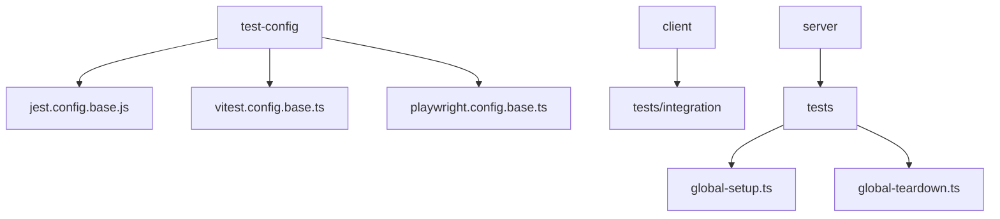
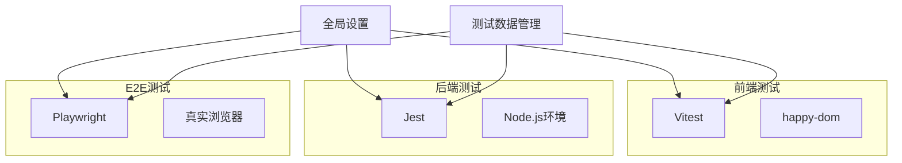
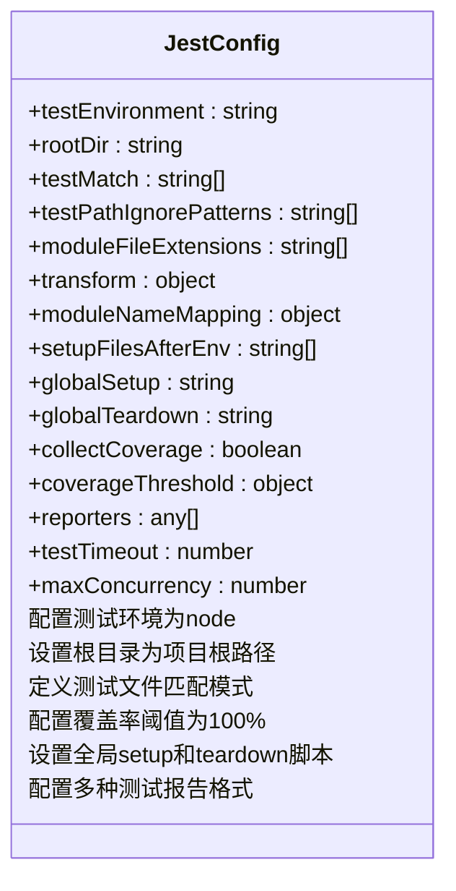
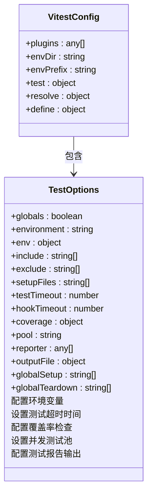
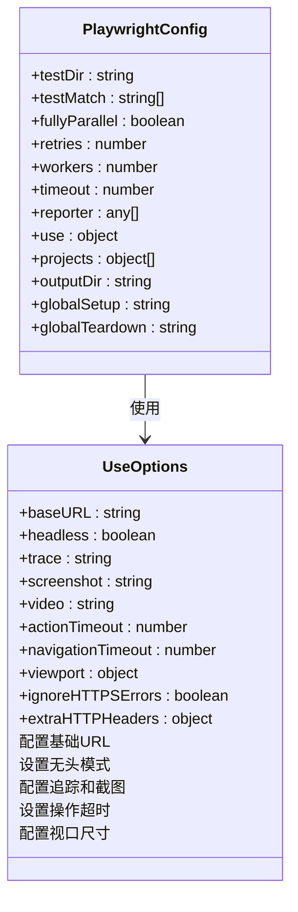
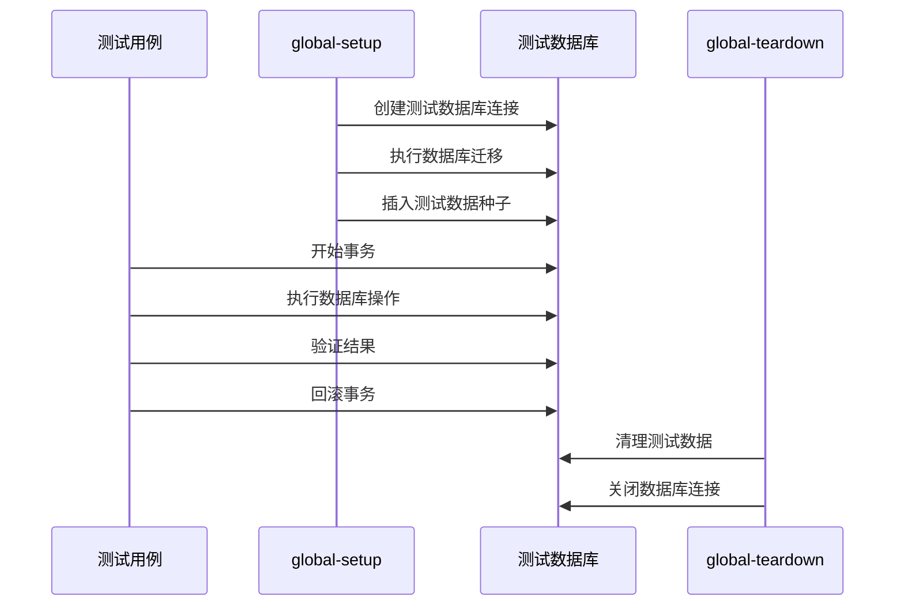
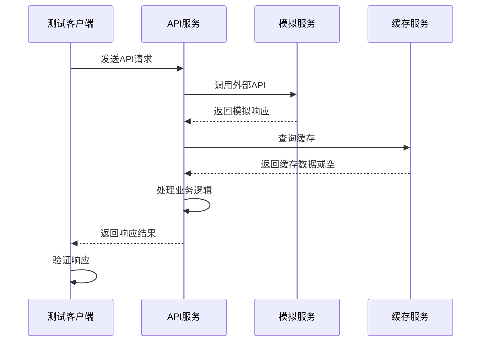
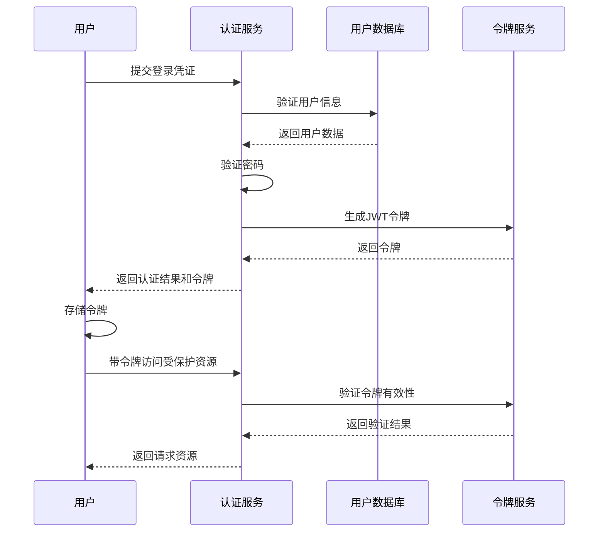
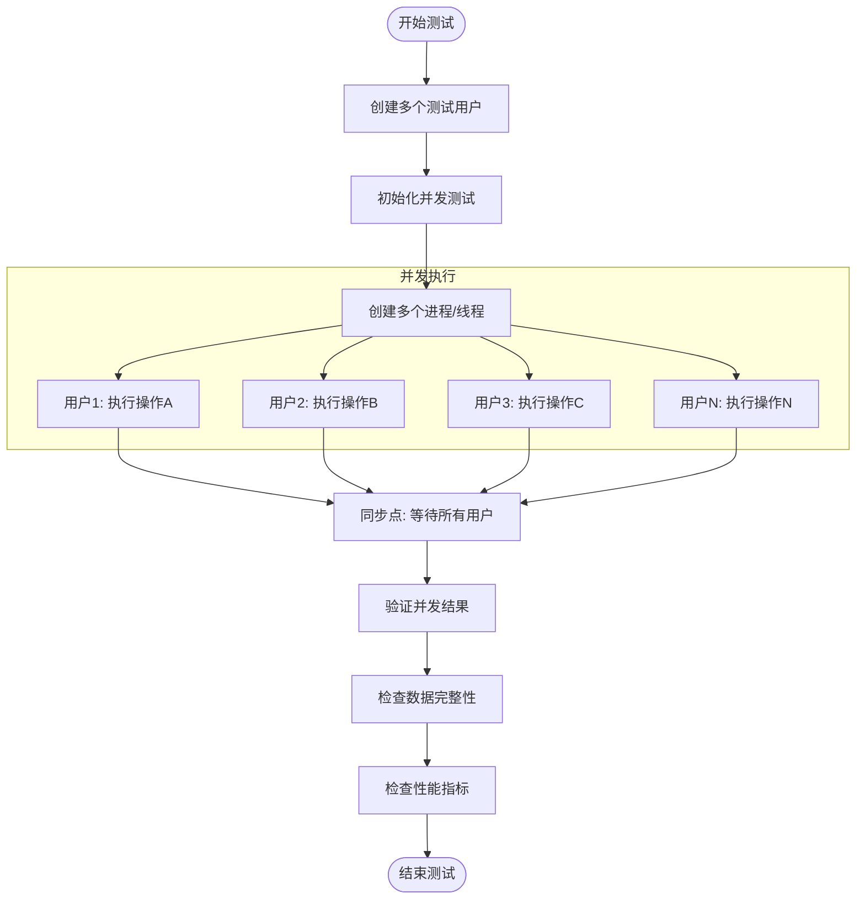

# 集成测试配置

<cite>
**本文档中引用的文件**  
- [jest.config.base.js](file://k.yyup.com/test-config/jest.config.base.js)
- [vitest.config.base.ts](file://k.yyup.com/test-config/vitest.config.base.ts)
- [playwright.config.base.ts](file://k.yyup.com/test-config/playwright.config.base.ts)
- [global-setup.ts](file://k.yyup.com/server/tests/global-setup.ts)
- [global-teardown.ts](file://k.yyup.com/server/tests/global-teardown.ts)
- [database-transaction.test.ts](file://k.yyup.com/client/tests/integration/database-transaction.test.ts)
- [api-integration.test.ts](file://k.yyup.com/client/tests/integration/api-integration.test.ts)
- [auth-flow.test.ts](file://k.yyup.com/client/tests/integration/auth-flow.test.ts)
- [real-ai-model-integration.test.ts](file://k.yyup.com/client/tests/integration/real-ai-model-integration.test.ts)
- [multi-user-concurrent.test.ts](file://k.yyup.com/client/tests/integration/multi-user-concurrent.test.ts)
</cite>

## 目录
1. [简介](#简介)
2. [项目结构](#项目结构)
3. [核心组件](#核心组件)
4. [架构概述](#架构概述)
5. [详细组件分析](#详细组件分析)
6. [依赖分析](#依赖分析)
7. [性能考虑](#性能考虑)
8. [故障排除指南](#故障排除指南)
9. [结论](#结论)

## 简介
本文档详细阐述了k.yyupgame项目中服务间集成测试的配置方案。重点描述了如何配置测试数据库连接、API端点模拟、消息队列集成、缓存服务等外部依赖的测试环境。文档说明了在`jest.config.base.js`和`vitest.config.ts`中如何设置全局测试钩子、数据库事务回滚、数据初始化脚本等关键配置。提供了完整的集成测试配置示例，包括多服务协同测试、数据库迁移测试、权限验证测试等场景。同时解释了测试数据生命周期管理策略，如何确保测试独立性和可重复性，并给出了性能优化建议。

**Section sources**
- [jest.config.base.js](file://k.yyup.com/test-config/jest.config.base.js)
- [vitest.config.base.ts](file://k.yyup.com/test-config/vitest.config.base.ts)

## 项目结构
k.yyupgame项目的测试配置文件集中存放在`test-config`目录中，包含Jest、Vitest和Playwright三种测试框架的基础配置文件。集成测试用例主要分布在`client/tests/integration`和`server/tests`目录下。项目采用分层测试策略，前端使用Vitest进行单元和集成测试，后端使用Jest进行服务层测试，E2E测试使用Playwright实现。



**Diagram sources**
- [test-config](file://k.yyup.com/test-config)
- [client/tests/integration](file://k.yyup.com/client/tests/integration)
- [server/tests](file://k.yyup.com/server/tests)

**Section sources**
- [jest.config.base.js](file://k.yyup.com/test-config/jest.config.base.js)
- [vitest.config.base.ts](file://k.yyup.com/test-config/vitest.config.base.ts)
- [playwright.config.base.ts](file://k.yyup.com/test-config/playwright.config.base.ts)

## 核心组件
本项目的核心测试配置组件包括：Jest基础配置用于后端服务测试，Vitest基础配置用于前端集成测试，Playwright配置用于端到端测试。全局设置文件`global-setup.ts`和`global-teardown.ts`负责测试环境的初始化和清理工作。集成测试重点关注数据库事务管理、API接口集成、认证流程验证和多用户并发场景。

**Section sources**
- [jest.config.base.js](file://k.yyup.com/test-config/jest.config.base.js)
- [vitest.config.base.ts](file://k.yyup.com/test-config/vitest.config.base.ts)
- [global-setup.ts](file://k.yyup.com/server/tests/global-setup.ts)
- [global-teardown.ts](file://k.yyup.com/server/tests/global-teardown.ts)

## 架构概述
k.yyupgame项目的集成测试架构采用分层设计，前端测试使用Vitest框架，通过happy-dom环境模拟浏览器行为；后端测试使用Jest框架，直接测试服务层逻辑；端到端测试使用Playwright框架，真实浏览器环境中验证用户交互流程。所有测试框架共享统一的全局设置和清理逻辑，确保测试环境的一致性。



**Diagram sources**
- [vitest.config.base.ts](file://k.yyup.com/test-config/vitest.config.base.ts)
- [jest.config.base.js](file://k.yyup.com/test-config/jest.config.base.js)
- [playwright.config.base.ts](file://k.yyup.com/test-config/playwright.config.base.ts)
- [global-setup.ts](file://k.yyup.com/server/tests/global-setup.ts)

## 详细组件分析

### 测试框架配置分析
#### Jest配置分析


**Diagram sources**
- [jest.config.base.js](file://k.yyup.com/test-config/jest.config.base.js)

#### Vitest配置分析


**Diagram sources**
- [vitest.config.base.ts](file://k.yyup.com/test-config/vitest.config.base.ts)

#### Playwright配置分析


**Diagram sources**
- [playwright.config.base.ts](file://k.yyup.com/test-config/playwright.config.base.ts)

**Section sources**
- [jest.config.base.js](file://k.yyup.com/test-config/jest.config.base.js)
- [vitest.config.base.ts](file://k.yyup.com/test-config/vitest.config.base.ts)
- [playwright.config.base.ts](file://k.yyup.com/test-config/playwright.config.base.ts)

### 集成测试场景分析
#### 数据库事务测试


**Diagram sources**
- [global-setup.ts](file://k.yyup.com/server/tests/global-setup.ts)
- [database-transaction.test.ts](file://k.yyup.com/client/tests/integration/database-transaction.test.ts)

#### API集成测试


**Diagram sources**
- [api-integration.test.ts](file://k.yyup.com/client/tests/integration/api-integration.test.ts)
- [real-ai-model-integration.test.ts](file://k.yyup.com/client/tests/integration/real-ai-model-integration.test.ts)

#### 认证流程测试


**Diagram sources**
- [auth-flow.test.ts](file://k.yyup.com/client/tests/integration/auth-flow.test.ts)
- [global-setup.ts](file://k.yyup.com/server/tests/global-setup.ts)

#### 多用户并发测试


**Diagram sources**
- [multi-user-concurrent.test.ts](file://k.yyup.com/client/tests/integration/multi-user-concurrent.test.ts)
- [jest.config.base.js](file://k.yyup.com/test-config/jest.config.base.js)

**Section sources**
- [database-transaction.test.ts](file://k.yyup.com/client/tests/integration/database-transaction.test.ts)
- [api-integration.test.ts](file://k.yyup.com/client/tests/integration/api-integration.test.ts)
- [auth-flow.test.ts](file://k.yyup.com/client/tests/integration/auth-flow.test.ts)
- [real-ai-model-integration.test.ts](file://k.yyup.com/client/tests/integration/real-ai-model-integration.test.ts)
- [multi-user-concurrent.test.ts](file://k.yyup.com/client/tests/integration/multi-user-concurrent.test.ts)

## 依赖分析
k.yyupgame项目的集成测试依赖于多个外部服务和组件。测试框架依赖包括Jest、Vitest和Playwright；数据库依赖包括MySQL和Sequelize ORM；缓存服务依赖Redis；消息队列可能使用RabbitMQ或Kafka；API模拟依赖于Jest的mock功能或专门的mock服务器。这些依赖通过全局设置脚本进行统一管理和配置。

```mermaid
graph TD
A[集成测试] --> B[Jest]
A --> C[Vitest]
A --> D[Playwright]
A --> E[Sequelize]
A --> F[MySQL]
A --> G[Redis]
A --> H[API模拟]
B --> I[ts-jest]
B --> J[jest-html-reporters]
B --> K[jest-junit]
C --> L[@vitejs/plugin-vue]
D --> M[@playwright/test]
E --> N[dotenv]
H --> O[Jest Mock]
```

**Diagram sources**
- [jest.config.base.js](file://k.yyup.com/test-config/jest.config.base.js)
- [vitest.config.base.ts](file://k.yyup.com/test-config/vitest.config.base.ts)
- [playwright.config.base.ts](file://k.yyup.com/test-config/playwright.config.base.ts)
- [global-setup.ts](file://k.yyup.com/server/tests/global-setup.ts)

**Section sources**
- [jest.config.base.js](file://k.yyup.com/test-config/jest.config.base.js)
- [vitest.config.base.ts](file://k.yyup.com/test-config/vitest.config.base.ts)
- [playwright.config.base.ts](file://k.yyup.com/test-config/playwright.config.base.ts)

## 性能考虑
在集成测试中，性能优化是关键考虑因素。通过配置合理的并发数（maxConcurrency: 5）和工作进程数（maxWorkers: '50%'），可以充分利用系统资源。测试超时设置为30秒，避免无限等待。覆盖率检查虽然全面，但可能影响测试速度，建议在CI/CD流水线中分阶段执行。使用缓存（cache: true）可以加速重复测试的执行。对于E2E测试，采用无头模式（headless: true）可以显著提高执行速度。

**Section sources**
- [jest.config.base.js](file://k.yyup.com/test-config/jest.config.base.js)
- [vitest.config.base.ts](file://k.yyup.com/test-config/vitest.config.base.ts)
- [playwright.config.base.ts](file://k.yyup.com/test-config/playwright.config.base.ts)

## 故障排除指南
当集成测试出现问题时，首先检查全局设置脚本`global-setup.ts`是否正确执行，确保测试数据库连接正常。查看测试报告中的详细错误信息，特别是Jest和Vitest生成的HTML报告。对于数据库相关问题，确认迁移脚本和种子数据是否正确应用。对于API集成问题，检查模拟服务的配置是否正确。使用Playwright的trace和截图功能可以帮助诊断E2E测试失败的原因。确保所有环境变量在`.env.test`文件中正确配置。

**Section sources**
- [global-setup.ts](file://k.yyup.com/server/tests/global-setup.ts)
- [global-teardown.ts](file://k.yyup.com/server/tests/global-teardown.ts)
- [jest.config.base.js](file://k.yyup.com/test-config/jest.config.base.js)

## 结论
k.yyupgame项目的集成测试配置提供了全面的测试覆盖，从单元测试到端到端测试，涵盖了各种业务场景。通过统一的配置基础和全局设置，确保了测试环境的一致性和可重复性。数据库事务管理和测试数据生命周期控制保证了测试的独立性。多种测试框架的协同使用满足了不同层次的测试需求。建议持续优化测试性能，完善测试报告，提高测试自动化程度，以支持项目的快速迭代和高质量交付。