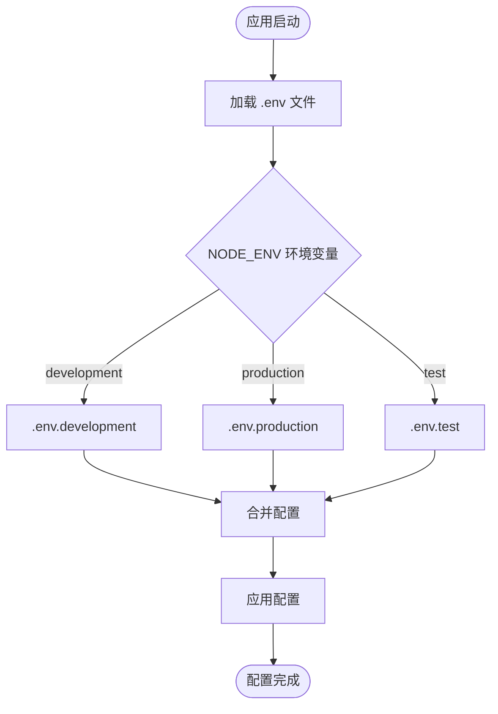

# 环境配置

<cite>
**本文档引用的文件**  
- [.env](file://k.yyup.com/.env)
- [.env.development](file://k.yyup.com/.env.development)
- [.env.production](file://k.yyup.com/.env.production)
- [config.json](file://k.yyup.com/config.json)
- [server/config/config.json](file://k.yyup.com/server/config/config.json)
- [package.json](file://k.yyup.com/package.json)
</cite>

## 目录
1. [项目结构](#项目结构)
2. [环境变量配置](#环境变量配置)
3. [配置文件层次结构](#配置文件层次结构)
4. [敏感信息管理](#敏感信息管理)
5. [配置加载顺序与优先级](#配置加载顺序与优先级)
6. [各环境具体配置示例](#各环境具体配置示例)
7. [配置最佳实践](#配置最佳实践)

## 项目结构

本项目采用模块化结构，主要配置文件位于项目根目录和 `server/config` 目录下。前端和后端分别通过不同的配置机制加载环境变量和配置文件。


**图示来源**  
- [.env](file://k.yyup.com/.env)
- [.env.development](file://k.yyup.com/.env.development)
- [.env.production](file://k.yyup.com/.env.production)
- [config.json](file://k.yyup.com/config.json)
- [server/config/config.json](file://k.yyup.com/server/config/config.json)
- [package.json](file://k.yyup.com/package.json)

**本节来源**  
- [k.yyup.com/](file://k.yyup.com/)
- [package.json](file://k.yyup.com/package.json)

## 环境变量配置

项目使用 `.env` 文件管理不同环境下的配置变量，支持开发、测试和生产环境的差异化配置。

### 开发环境配置
开发环境通过 `.env.development` 文件定义 API 地址、WebSocket 连接等前端所需变量，并包含 JWT 密钥等认证信息。

### 生产环境配置
生产环境通过 `.env.production` 文件定义正式环境的 API 基地址和 WebSocket 地址，确保前端应用连接到正确的后端服务。

### 环境变量命名规范
所有前端可访问的环境变量均以 `VITE_` 开头，这是 Vite 构建工具的要求，确保这些变量能在运行时被正确注入。

**本节来源**  
- [.env.development](file://k.yyup.com/.env.development)
- [.env.production](file://k.yyup.com/.env.production)
- [package.json](file://k.yyup.com/package.json)

## 配置文件层次结构

项目采用多层配置结构，结合环境变量文件和 JSON 配置文件实现灵活的配置管理。

### 根目录配置文件
- `.env`: 通用环境变量
- `.env.development`: 开发环境专用变量
- `.env.production`: 生产环境专用变量
- `config.json`: V2Ray 代理配置

### 服务端配置文件
`server/config/config.json` 文件包含数据库连接配置，按环境（development、test、production）进行区分，每个环境都有独立的数据库连接参数。

### 配置加载机制
项目使用 `dotenv` 库加载环境变量，通过 `process.env` 在 Node.js 环境中访问。前端通过 Vite 的环境变量注入机制获取配置。



**图示来源**  
- [.env](file://k.yyup.com/.env)
- [.env.development](file://k.yyup.com/.env.development)
- [.env.production](file://k.yyup.com/.env.production)
- [server/config/config.json](file://k.yyup.com/server/config/config.json)

**本节来源**  
- [server/config/config.json](file://k.yyup.com/server/config/config.json)
- [package.json](file://k.yyup.com/package.json)

## 敏感信息管理

项目通过多种机制保护敏感信息的安全。

### 敏感信息类型
- 数据库密码
- JWT 密钥
- API 访问密钥
- WebSocket 连接凭证

### 保护策略
1. **环境变量隔离**: 敏感信息存储在 `.env` 文件中，不提交到版本控制系统
2. **访问控制**: 只有必要的服务和组件可以访问敏感配置
3. **加密传输**: 所有外部连接均使用 TLS 加密
4. **最小权限原则**: 数据库连接使用最小必要权限的账户

### 安全实践
- `.env` 文件已添加到 `.gitignore`
- 生产环境使用独立的数据库实例
- 定期轮换密钥和密码
- 使用安全的随机数生成器创建密钥

**本节来源**  
- [.env](file://k.yyup.com/.env)
- [.env.development](file://k.yyup.com/.env.development)
- [server/config/config.json](file://k.yyup.com/server/config/config.json)

## 配置加载顺序与优先级

配置系统遵循明确的加载顺序和优先级规则。

### 加载顺序
1. 默认配置
2. 环境特定配置文件（.env.development, .env.production）
3. 环境变量（process.env）
4. 命令行参数

### 优先级规则
- 命令行参数 > 环境变量 > 环境配置文件 > 默认配置
- 后加载的配置会覆盖先加载的同名配置
- Vite 构建时会静态替换 `import.meta.env` 中的变量

### 环境检测机制
通过 `NODE_ENV` 环境变量确定当前运行环境，决定加载哪个配置文件。默认为 development 环境。


**图示来源**  
- [.env](file://k.yyup.com/.env)
- [.env.development](file://k.yyup.com/.env.development)
- [.env.production](file://k.yyup.com/.env.production)
- [package.json](file://k.yyup.com/package.json)

**本节来源**  
- [package.json](file://k.yyup.com/package.json)
- [.env](file://k.yyup.com/.env)

## 各环境具体配置示例

### 开发环境配置
```env
JWT_SECRET=your_secret_key
VITE_API_BASE_URL=https://k.yyup.cc
VITE_WS_URL=wss://tphezdvikvva.sealoshzh.site
VITE_APP_URL=https://k.yyup.cc
```

### 生产环境配置
```env
VITE_API_BASE_URL=https://k.yyup.cc
VITE_WS_URL=wss://k.yyup.cc
VITE_APP_URL=https://k.yyup.cc
```

### 数据库配置（开发环境）
```json
{
  "development": {
    "username": "root",
    "password": "pwk5l57j",
    "database": "kindergarten_db",
    "host": "dbconn.sealoshzh.site",
    "port": 43906,
    "dialect": "mysql"
  }
}
```

### 数据库配置（生产环境）
```json
{
  "production": {
    "username": "root",
    "password": "pwk5l57j",
    "database": "kindergarten_db",
    "host": "dbconn.sealoshzh.site",
    "port": 43906,
    "dialect": "mysql",
    "logging": false
  }
}
```

### V2Ray 代理配置
```json
{
  "inbounds": [
    {
      "port": 1080,
      "protocol": "socks"
    },
    {
      "port": 8080,
      "protocol": "http"
    }
  ],
  "outbounds": [
    {
      "protocol": "vmess",
      "settings": {
        "vnext": [
          {
            "address": "45.95.212.92",
            "port": 443
          }
        ]
      }
    }
  ]
}
```

**本节来源**  
- [.env.development](file://k.yyup.com/.env.development)
- [.env.production](file://k.yyup.com/.env.production)
- [server/config/config.json](file://k.yyup.com/server/config/config.json)
- [config.json](file://k.yyup.com/config.json)

## 配置最佳实践

### 添加新配置项
1. 确定配置的作用范围（前端/后端）
2. 前端配置以 `VITE_` 开头
3. 后端配置直接添加到 `.env` 文件
4. 在相应环境文件中添加具体值
5. 更新文档说明配置用途

### 避免配置错误
- 使用配置验证工具检查格式
- 避免在代码中硬编码配置值
- 定期审查配置文件权限
- 使用配置文件模板进行新环境搭建
- 在部署前验证配置完整性

### 配置审计
1. **版本控制**: 所有配置变更必须通过代码审查
2. **变更记录**: 记录每次配置修改的原因和影响
3. **安全扫描**: 定期扫描配置文件中的敏感信息泄露
4. **一致性检查**: 确保各环境配置的一致性和正确性
5. **备份策略**: 定期备份重要配置文件

### 配置管理建议
- 为不同环境使用不同的数据库
- 定期轮换密钥和密码
- 使用配置管理工具自动化部署
- 建立配置变更审批流程
- 监控配置相关的错误和异常

**本节来源**  
- [.env](file://k.yyup.com/.env)
- [.env.development](file://k.yyup.com/.env.development)
- [.env.production](file://k.yyup.com/.env.production)
- [server/config/config.json](file://k.yyup.com/server/config/config.json)
- [config.json](file://k.yyup.com/config.json)
- [package.json](file://k.yyup.com/package.json)