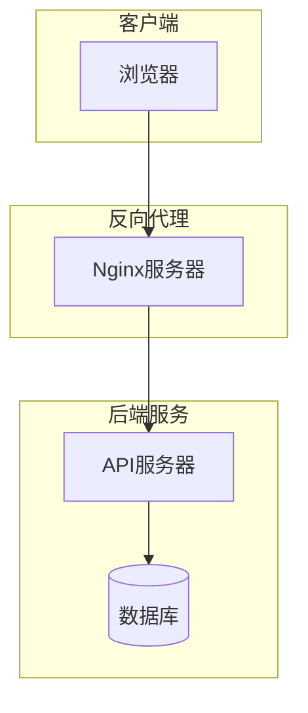
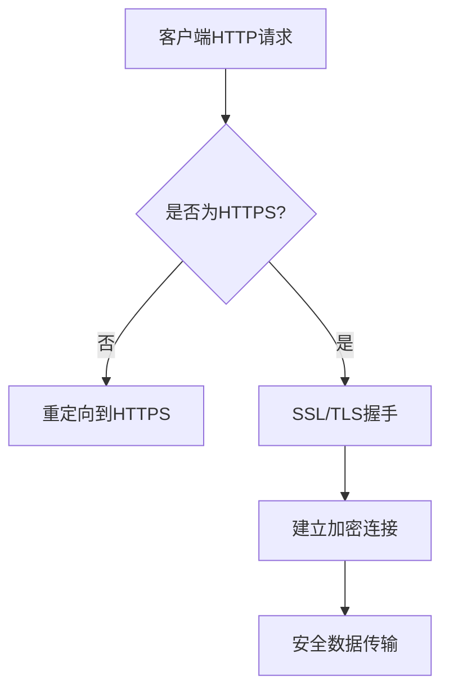
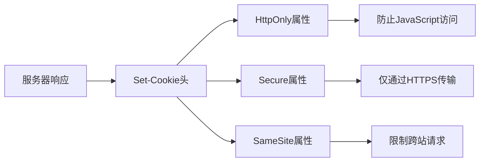
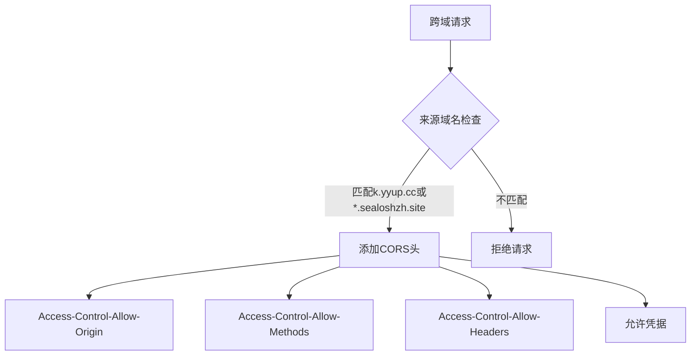
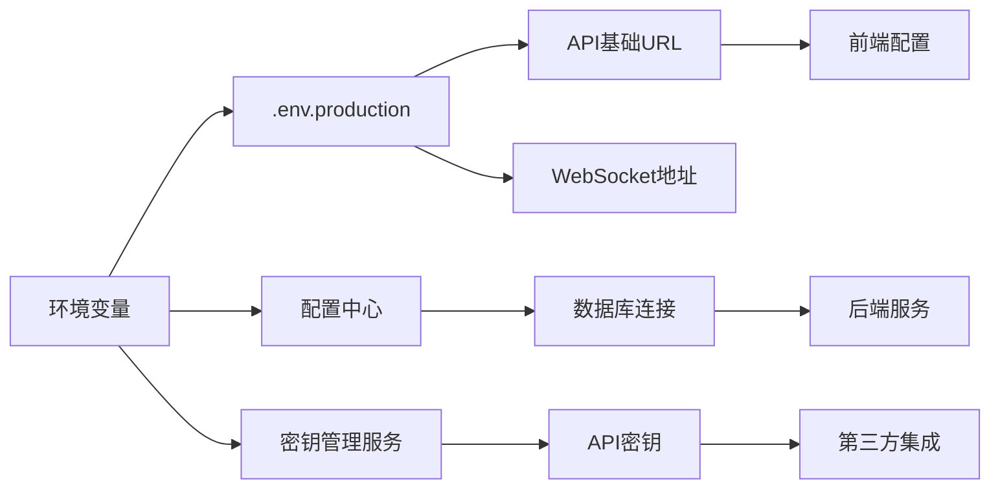
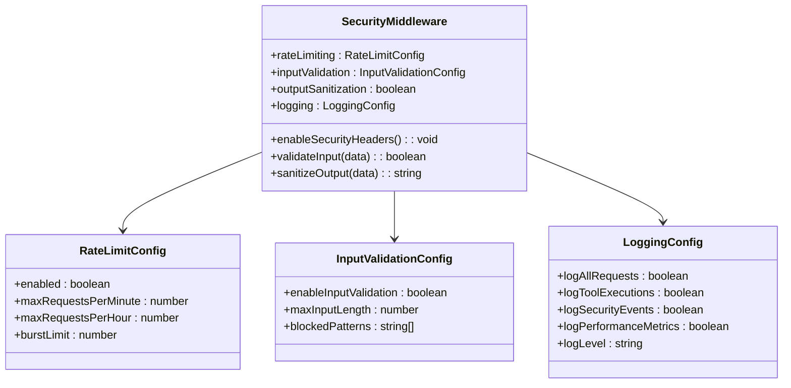
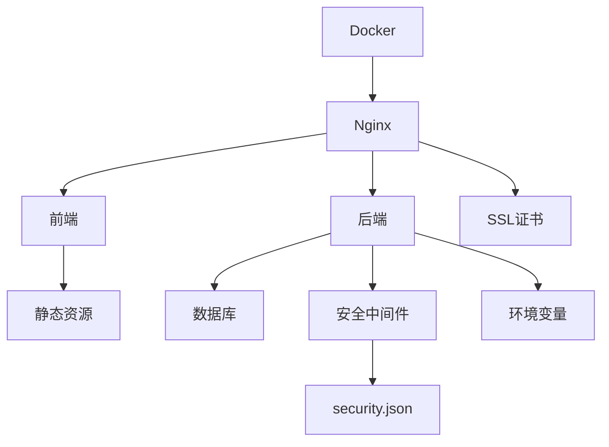
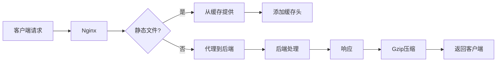
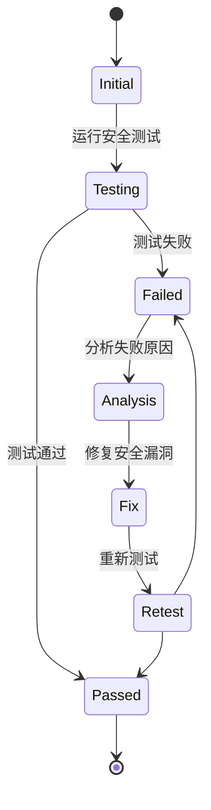

# 生产环境安全配置

<cite>
**本文档引用的文件**
- [nginx.conf](file://k.yyup.com/nginx.conf)
- [.env.production](file://k.yyup.com/.env.production)
- [docker-compose.yml](file://k.yyup.com/docker-compose.yml)
- [security.json](file://k.yyup.com/config/security.json)
- [security-verification-report.json](file://k.yyup.com/security-verification-report.json)
</cite>

## 目录
1. [引言](#引言)
2. [项目结构](#项目结构)
3. [核心组件](#核心组件)
4. [架构概述](#架构概述)
5. [详细组件分析](#详细组件分析)
6. [依赖分析](#依赖分析)
7. [性能考虑](#性能考虑)
8. [故障排除指南](#故障排除指南)
9. [结论](#结论)

## 引言
本文档详细介绍了k.yyupgame在生产环境下的安全配置方法，重点涵盖HTTPS/SSL配置、Cookie安全属性、CORS策略、敏感信息管理、安全中间件配置以及生产环境安全加固的最佳实践。

## 项目结构
k.yyupgame项目采用分层架构，包含前端、后端、数据库和安全配置等多个组件。项目根目录下包含多个子目录，如`k.yyup.com`和`unified-tenant-system`，其中`k.yyup.com`是主要的应用目录。

**Section sources**
- [k.yyup.com](file://k.yyup.com)
- [unified-tenant-system](file://unified-tenant-system)

## 核心组件
本项目的核心组件包括Nginx反向代理服务器、Docker容器化部署、JWT身份验证机制和基于角色的访问控制（RBAC）系统。

**Section sources**
- [nginx.conf](file://k.yyup.com/nginx.conf#L1-L119)
- [docker-compose.yml](file://k.yyup.com/docker-compose.yml#L1-L42)
- [security.json](file://k.yyup.com/config/security.json#L1-L50)

## 架构概述
k.yyupgame采用微服务架构，前端通过Nginx反向代理与后端API通信。Nginx负责SSL终止、静态文件服务和请求路由。后端服务运行在Docker容器中，通过环境变量进行配置。

**Diagram sources**
- [nginx.conf](file://k.yyup.com/nginx.conf#L1-L119)
- [docker-compose.yml](file://k.yyup.com/docker-compose.yml#L1-L42)

## 详细组件分析

### HTTPS和SSL/TLS配置
k.yyupgame通过Nginx配置实现了HTTPS安全通信。SSL证书配置在nginx.conf文件中，使用TLSv1.2和TLSv1.3协议，并采用强加密套件。

**Diagram sources**
- [nginx.conf](file://k.yyup.com/nginx.conf#L6-L17)

**Section sources**
- [nginx.conf](file://k.yyup.com/nginx.conf#L6-L17)
- [.env.production](file://k.yyup.com/.env.production#L2-L4)

### 安全的Cookie属性配置
系统通过Nginx和应用层配置了安全的Cookie属性，包括HttpOnly、Secure和SameSite属性，以防止XSS攻击和CSRF攻击。

**Diagram sources**
- [nginx.conf](file://k.yyup.com/nginx.conf#L65-L69)

### CORS策略配置
CORS策略在Nginx配置中实现，仅允许来自k.yyup.cc和*.sealoshzh.site域名的跨域请求，有效防止跨站请求伪造攻击。

**Diagram sources**
- [nginx.conf](file://k.yyup.com/nginx.conf#L60-L69)

**Section sources**
- [nginx.conf](file://k.yyup.com/nginx.conf#L60-L69)

### 敏感信息管理
敏感信息通过环境变量进行管理，生产环境配置文件.env.production中包含API基础URL和WebSocket地址，但不包含数据库密码和API密钥等敏感信息。

**Diagram sources**
- [.env.production](file://k.yyup.com/.env.production#L1-L5)

**Section sources**
- [.env.production](file://k.yyup.com/.env.production#L1-L5)

### 安全中间件配置
安全中间件配置在security.json文件中，包含速率限制、输入验证、输出净化等功能，有效防御常见Web攻击。

**Diagram sources**
- [security.json](file://k.yyup.com/config/security.json#L1-L50)

**Section sources**
- [security.json](file://k.yyup.com/config/security.json#L1-L50)

## 依赖分析
项目依赖关系清晰，前端、后端和基础设施组件通过Docker和Nginx进行解耦。安全配置主要依赖Nginx和应用层安全中间件。

**Diagram sources**
- [docker-compose.yml](file://k.yyup.com/docker-compose.yml#L1-L42)
- [nginx.conf](file://k.yyup.com/nginx.conf#L1-L119)

**Section sources**
- [docker-compose.yml](file://k.yyup.com/docker-compose.yml#L1-L42)
- [nginx.conf](file://k.yyup.com/nginx.conf#L1-L119)

## 性能考虑
生产环境配置考虑了性能优化，包括静态文件缓存、Gzip压缩和代理缓冲等。Nginx配置中设置了适当的超时和缓冲参数，确保系统稳定运行。

**Diagram sources**
- [nginx.conf](file://k.yyup.com/nginx.conf#L31-L35)
- [nginx.conf](file://k.yyup.com/nginx.conf#L109-L113)

## 故障排除指南
根据security-verification-report.json中的测试结果，系统存在一些安全问题，包括SQL注入防护、XSS防护和权限控制等方面需要改进。

**Section sources**
- [security-verification-report.json](file://k.yyup.com/security-verification-report.json#L1-L141)

## 结论
k.yyupgame生产环境安全配置总体良好，但仍有改进空间。建议加强SQL注入和XSS防护，完善权限控制机制，并定期进行安全审计和漏洞扫描，确保系统持续安全稳定运行。