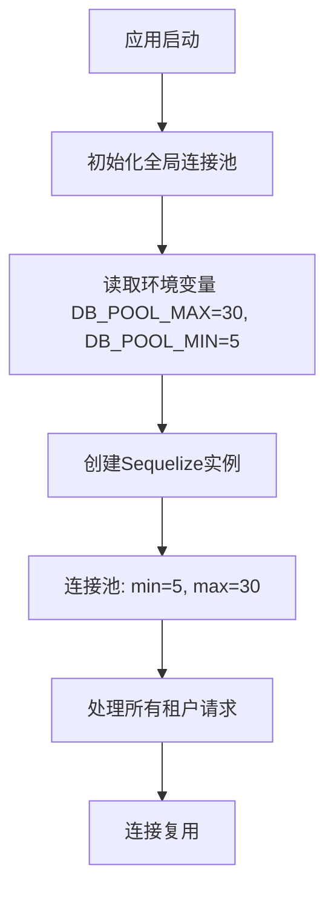
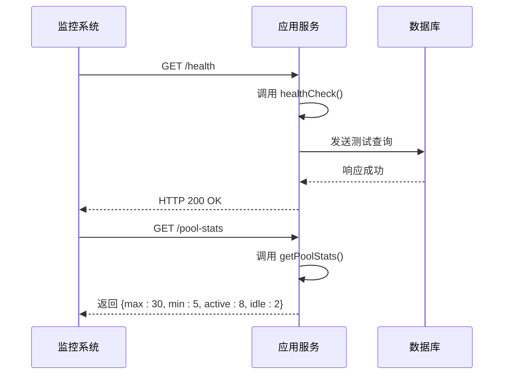

# 生产环境性能配置

<cite>
**本文档引用的文件**  
- [CONNECTION_POOL_OPTIMIZATION.md](file://CONNECTION_POOL_OPTIMIZATION.md)
- [MIGRATION_GUIDE_SHARED_POOL.md](file://MIGRATION_GUIDE_SHARED_POOL.md)
- [SHARED_POOL_IMPLEMENTATION_SUMMARY.md](file://SHARED_POOL_IMPLEMENTATION_SUMMARY.md)
- [k.yyup.com/.env.production](file://k.yyup.com/.env.production)
- [k.yyup.com/docker-compose.yml](file://k.yyup.com/docker-compose.yml)
- [k.yyup.com/nginx.conf](file://k.yyup.com/nginx.conf)
- [tenant-database-shared-pool.service.ts](file://tenant-database-shared-pool.service.ts)
- [database-initialization.ts](file://database-initialization.ts)
- [auth-shared-pool-example.middleware.ts](file://auth-shared-pool-example.middleware.ts)
- [tenant-resolver-shared-pool.middleware.ts](file://tenant-resolver-shared-pool.middleware.ts)
</cite>

## 目录
1. [引言](#引言)
2. [数据库连接池配置](#数据库连接池配置)
3. [前端资源与CDN配置](#前端资源与cdn配置)
4. [服务器端性能调优](#服务器端性能调优)
5. [Docker容器资源配置](#docker容器资源配置)
6. [负载均衡配置](#负载均衡配置)
7. [性能监控指标配置](#性能监控指标配置)
8. [总结](#总结)

## 引言

k.yyupgame项目是一个多租户架构的幼儿园管理系统，为提升生产环境下的系统性能与稳定性，已实施一系列性能优化措施。本文档详细说明了在生产环境中针对数据库连接池、前端资源、服务器参数、容器资源、负载均衡及性能监控等方面的配置策略，旨在为运维和开发团队提供清晰的性能优化指导。

## 数据库连接池配置

### 连接池大小配置

k.yyupgame项目采用共享连接池架构，将原先每个租户独立的连接池优化为单一全局连接池，显著降低了数据库连接数和内存占用。该优化通过`tenant-database-shared-pool.service.ts`实现，其核心配置如下：

- **最大连接数 (max)**: 30
- **最小连接数 (min)**: 5
- **获取连接超时时间 (acquire)**: 30000毫秒（30秒）
- **连接空闲超时时间 (idle)**: 10000毫秒（10秒）

此配置通过环境变量`DB_POOL_MAX`和`DB_POOL_MIN`进行管理，允许根据实际负载进行动态调整。在生产环境中，建议将`DB_POOL_MAX`设置为30，`DB_POOL_MIN`设置为5，以平衡资源利用率和响应性能。



**图示来源**
- [tenant-database-shared-pool.service.ts](file://tenant-database-shared-pool.service.ts#L110-L138)
- [MIGRATION_GUIDE_SHARED_POOL.md](file://MIGRATION_GUIDE_SHARED_POOL.md#L27-L32)

### 超时设置与连接复用策略

为了确保连接池的高效和稳定，系统设置了合理的超时机制。`acquire`超时确保当连接池满时，新请求不会无限期等待，而是会在30秒后超时并返回错误，这有助于快速发现和处理性能瓶颈。`idle`超时则确保空闲连接不会长时间占用数据库资源，超过10秒未使用的连接将被释放。

连接复用策略是通过在所有SQL查询中显式指定完整的表名来实现的，例如`SELECT * FROM tenant_k001.users`。这种方式避免了使用`USE database`语句可能带来的并发安全问题，确保了数据隔离性，同时允许单个连接池高效地为所有租户服务。

**本节来源**
- [CONNECTION_POOL_OPTIMIZATION.md](file://CONNECTION_POOL_OPTIMIZATION.md#L110-L138)
- [SHARED_POOL_IMPLEMENTATION_SUMMARY.md](file://SHARED_POOL_IMPLEMENTATION_SUMMARY.md#L60-L67)

## 前端资源与CDN配置

### 静态资源压缩

前端资源的性能优化主要通过Nginx反向代理服务器实现。在`k.yyup.com/nginx.conf`文件中，启用了Gzip压缩功能，对文本类资源进行压缩传输，有效减少了网络带宽消耗和页面加载时间。

- **Gzip开启**: `gzip on;`
- **压缩级别**: 默认
- **最小压缩长度**: 1024字节（小于1KB的文件不压缩）
- **压缩类型**: 包括`text/plain`, `text/css`, `application/json`, `application/javascript`, `text/xml`, `application/xml`, `text/javascript`等。

```nginx
gzip on;
gzip_vary on;
gzip_min_length 1024;
gzip_types text/plain text/css application/json application/javascript text/xml application/xml application/xml+rss text/javascript;
```

### 浏览器缓存策略

Nginx配置了针对不同静态资源的浏览器缓存策略，通过设置`Cache-Control`和`Expires`头，让浏览器能够缓存资源，减少重复请求。

- **图片、CSS、JS等静态文件**: 设置`expires 1y;`和`Cache-Control "public, immutable"`，表示这些资源在一年内有效且内容不会改变，浏览器可以长期缓存。
- **HTML文件**: 由于可能包含动态内容，通常不设置长期缓存，由Nginx的`try_files`指令处理。

```nginx
location ~* \.(js|css|png|jpg|jpeg|gif|ico|svg)$ {
    expires 1y;
    add_header Cache-Control "public, immutable";
}
```

### CDN配置

虽然当前`nginx.conf`中未直接配置CDN，但其架构为CDN集成提供了良好基础。前端构建文件（如`/client/dist`）被部署在Nginx服务器上，可以通过将Nginx作为CDN的源站（Origin Server）来实现CDN加速。CDN节点会缓存这些静态资源，并从离用户最近的节点提供服务，从而大幅提升全球用户的访问速度。

**本节来源**
- [k.yyup.com/nginx.conf](file://k.yyup.com/nginx.conf#L108-L113)
- [k.yyup.com/nginx.conf](file://k.yyup.com/nginx.conf#L32-L35)

## 服务器端性能调优

### 线程池大小

本项目为Node.js应用，其运行机制基于事件循环（Event Loop），本质上是单线程的。因此，不涉及传统意义上的“线程池”配置。性能调优主要依赖于Node.js的异步I/O和V8引擎的垃圾回收机制。对于CPU密集型任务，可以通过Node.js的`worker_threads`模块创建工作线程池，但当前代码库中未见相关配置。

### 内存分配

Node.js应用的内存分配由V8引擎自动管理。可以通过`NODE_OPTIONS`环境变量来调整V8的内存限制。例如，在`k.yyup.com/client/package.json`的构建脚本中，使用了`NODE_OPTIONS='--max-old-space-size=51200'`来将老生代内存空间的最大值设置为51200MB（约50GB），这对于大型应用的构建过程是必要的，以避免内存溢出。

### 垃圾回收策略

Node.js的垃圾回收（GC）策略由V8引擎自动执行，开发者通常无需手动干预。V8采用分代式垃圾回收，将内存分为新生代和老生代，使用不同的算法进行回收。对于生产环境，可以通过监控GC行为来评估应用性能。如果发现GC频繁或暂停时间过长，应检查代码中是否存在内存泄漏或大量对象创建。

**本节来源**
- [k.yyup.com/client/package.json](file://k.yyup.com/client/package.json#L14)
- [k.yyup.com/client/package.json](file://k.yyup.com/client/package.json#L26)

## Docker容器资源配置

### CPU与内存限制

当前项目中的`docker-compose.yml`文件主要用于开发和测试环境，未显式配置生产环境的CPU和内存限制。在生产环境中部署时，应使用`docker-compose.prod.yml`或Kubernetes等编排工具来设置资源限制。

一个典型的生产环境Docker配置应包含`resources`字段，例如：

```yaml
services:
  kindergarten-project:
    # ... 其他配置
    deploy:
      resources:
        limits:
          cpus: '2.0'
          memory: 4G
        reservations:
          cpus: '0.5'
          memory: 1G
```

此配置将容器的CPU使用限制在2个核心，内存限制在4GB，确保应用不会过度消耗主机资源。

**本节来源**
- [k.yyup.com/docker-compose.yml](file://k.yyup.com/docker-compose.yml)

## 负载均衡配置

当前的`nginx.conf`配置文件已经实现了基本的负载均衡功能。`proxy_pass http://localhost:3000;`指令将所有`/api`前缀的请求代理到后端Node.js服务。在生产环境中，通常会部署多个后端服务实例，并通过Nginx的`upstream`模块实现负载均衡。

一个典型的负载均衡配置如下：

```nginx
upstream backend {
    server backend1.yyup.cc:3000;
    server backend2.yyup.cc:3000;
    server backend3.yyup.cc:3000;
}

location /api {
    proxy_pass http://backend;
    # ... 其他代理配置
}
```

此配置会将请求分发到三个后端服务器，Nginx默认使用轮询（round-robin）算法。还可以配置`least_conn`（最少连接）或`ip_hash`（基于IP哈希）等策略。

**本节来源**
- [k.yyup.com/nginx.conf](file://k.yyup.com/nginx.conf#L39-L53)

## 性能监控指标配置

### 响应时间、吞吐量与错误率

k.yyupgame项目通过内置的健康检查和监控机制来跟踪关键性能指标。

- **响应时间**: 可通过Nginx的`$request_time`变量记录每个请求的处理时间，并写入访问日志。
- **吞吐量**: 通过监控单位时间内的请求数（QPS）来衡量。
- **错误率**: 通过分析Nginx错误日志和应用日志中的HTTP状态码（如5xx, 4xx）来计算。

### 健康检查与连接池监控

系统提供了详细的健康检查和连接池监控接口。

- **健康检查**: `tenantDatabaseSharedPoolService.healthCheck()`方法可以检查数据库连接池的整体健康状况，返回`true`或`false`。
- **连接池状态**: `tenantDatabaseSharedPoolService.getPoolStats()`方法返回详细的连接池统计信息，包括最大连接数、最小连接数、活跃连接数和空闲连接数。



**图示来源**
- [MIGRATION_GUIDE_SHARED_POOL.md](file://MIGRATION_GUIDE_SHARED_POOL.md#L227-L231)
- [CONNECTION_POOL_OPTIMIZATION.md](file://CONNECTION_POOL_OPTIMIZATION.md#L223-L226)

**本节来源**
- [CONNECTION_POOL_OPTIMIZATION.md](file://CONNECTION_POOL_OPTIMIZATION.md#L223-L226)
- [MIGRATION_GUIDE_SHARED_POOL.md](file://MIGRATION_GUIDE_SHARED_POOL.md#L227-L231)

## 总结

k.yyupgame项目通过一系列精心设计的性能优化措施，为生产环境的稳定运行奠定了坚实基础。从数据库连接池的共享复用，到前端资源的压缩与缓存，再到服务器和容器的资源管理，每一项配置都旨在提升系统的响应速度、吞吐能力和资源利用率。建议运维团队持续监控各项性能指标，并根据实际负载动态调整配置，以确保系统始终处于最佳状态。