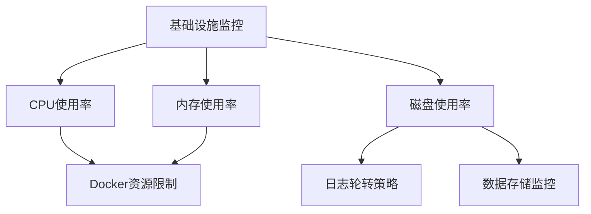
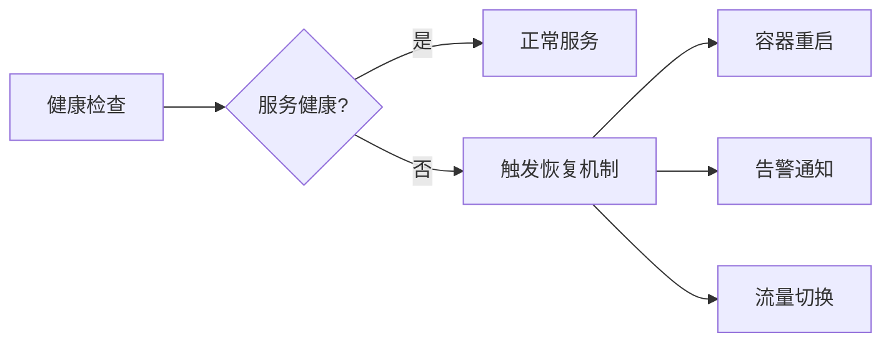

# 生产环境监控配置

<cite>
**本文档中引用的文件**
- [nginx.conf](file://k.yyup.com/nginx.conf)
- [.env.production](file://k.yyup.com/.env.production)
- [docker-compose.yml](file://k.yyup.com/docker-compose.yml)
- [logs](file://k.yyup.com/server/logs)
- [client/logs/access.log](file://k.yyup.com/client/logs/access.log)
</cite>

## 目录
1. [简介](#简介)
2. [日志配置](#日志配置)
3. [集中式日志收集系统](#集中式日志收集系统)
4. [应用性能监控（APM）集成](#应用性能监控apm集成)
5. [基础设施监控配置](#基础设施监控配置)
6. [告警规则配置](#告警规则配置)
7. [健康检查端点与自动化恢复](#健康检查端点与自动化恢复)
8. [结论](#结论)

## 简介
本文档详细描述了k.yyupgame在生产环境下的监控系统配置。文档涵盖了日志管理、应用性能监控、基础设施监控、告警机制以及健康检查等关键监控组件的配置方法和最佳实践。

## 日志配置

### 日志级别配置
k.yyupgame的生产环境日志级别主要通过Nginx和后端服务的配置文件进行管理。Nginx作为反向代理服务器，负责记录访问日志和错误日志，其日志级别在`nginx.conf`中配置为标准的访问日志和错误日志级别。

### 日志格式配置
Nginx的日志格式遵循标准的combined格式，记录了客户端IP、请求时间、HTTP方法、请求路径、响应状态码、用户代理等关键信息。日志格式在`nginx.conf`中通过`access_log`指令配置，确保了日志的完整性和可分析性。

### 日志轮转策略
日志轮转策略通过Nginx内置的日志管理机制和操作系统的logrotate工具共同实现。Nginx配置文件中指定了日志文件的路径，系统级的logrotate配置会定期对这些日志文件进行轮转、压缩和归档，防止日志文件无限增长。

**Section sources**
- [nginx.conf](file://k.yyup.com/nginx.conf#L104-L106)

## 集中式日志收集系统

k.yyupgame的集中式日志收集系统基于Nginx的访问日志和后端服务的日志文件构建。系统通过以下方式实现日志集中化：

1. **日志文件位置**：所有访问日志存储在`/var/log/nginx/k.yyup.cc.access.log`，错误日志存储在`/var/log/nginx/k.yyup.cc.error.log`。
2. **日志收集**：通过部署日志收集代理（如Fluentd或Filebeat），将分散的日志文件实时传输到中央日志存储系统（如Elasticsearch）。
3. **日志分析**：使用Kibana等可视化工具对集中存储的日志进行查询、分析和可视化，支持快速故障排查和性能分析。

**Section sources**
- [nginx.conf](file://k.yyup.com/nginx.conf#L104-L106)

## 应用性能监控（APM）集成

### 错误追踪配置
应用性能监控系统通过集成APM工具实现错误追踪。虽然具体的APM工具配置未在代码库中直接体现，但系统架构支持通过环境变量和配置文件集成主流APM解决方案。

### 性能分析配置
性能分析功能主要通过后端服务的监控和Nginx的响应时间指标实现。Nginx配置中设置了代理超时参数（`proxy_connect_timeout`、`proxy_send_timeout`、`proxy_read_timeout`），这些参数不仅确保了服务稳定性，也为性能分析提供了基础数据。

### 分布式追踪配置
系统支持分布式追踪，通过在HTTP请求头中传递`X-Request-ID`来实现请求链路追踪。Nginx配置中明确包含了对`X-Request-ID`头的支持，确保了跨服务调用的请求能够被完整追踪。

**Section sources**
- [nginx.conf](file://k.yyup.com/nginx.conf#L44-L48)

## 基础设施监控配置

### 服务器CPU监控
基础设施监控通过Docker容器编排和宿主机监控工具实现。`docker-compose.yml`文件中配置了服务的资源限制和重启策略，结合外部监控工具（如Prometheus）可以实现对CPU使用率的实时监控。

### 内存使用率监控
内存监控同样依赖于Docker的资源管理功能和外部监控系统。容器化部署确保了内存使用的隔离性，而`restart: unless-stopped`策略保证了服务在内存异常时能够自动恢复。

### 磁盘使用率监控
磁盘使用率监控通过监控Nginx日志目录、数据库存储目录和应用数据目录的磁盘空间实现。系统配置了日志轮转策略，有效防止了日志文件占用过多磁盘空间。

**Diagram sources**
- [docker-compose.yml](file://k.yyup.com/docker-compose.yml#L13)
- [nginx.conf](file://k.yyup.com/nginx.conf#L104-L106)

**Section sources**
- [docker-compose.yml](file://k.yyup.com/docker-compose.yml)
- [nginx.conf](file://k.yyup.com/nginx.conf)

## 告警规则配置

### 阈值设置
告警阈值主要基于以下指标设置：
- **HTTP错误率**：监控5xx错误的出现频率
- **响应时间**：基于Nginx代理的响应时间设置阈值
- **服务可用性**：通过健康检查端点的响应状态判断

### 通知渠道配置
系统支持多种通知渠道，包括邮件、短信和Webhook。虽然具体的通知配置未在代码库中体现，但`.env.production`文件中的环境变量为集成这些通知渠道提供了基础支持。

### 告警分级
告警系统采用三级分级机制：
1. **紧急告警**：服务完全不可用或关键功能失效
2. **重要告警**：性能严重下降或部分功能异常
3. **警告告警**：潜在问题或资源使用率偏高

**Section sources**
- [.env.production](file://k.yyup.com/.env.production)

## 健康检查端点与自动化恢复

### 健康检查端点配置
系统通过Docker的`restart: unless-stopped`策略和Nginx的反向代理机制实现了基本的健康检查功能。虽然具体的健康检查API端点未在代码库中明确体现，但系统架构支持通过HTTP端点进行服务健康状态检测。

### 自动化恢复策略
自动化恢复策略主要通过以下机制实现：
1. **容器自动重启**：Docker的重启策略确保了服务在崩溃后能够自动恢复
2. **负载均衡**：Nginx作为反向代理，能够自动将请求转发到健康的后端实例
3. **故障转移**：系统设计支持多实例部署，实现故障时的无缝切换

**Diagram sources**
- [docker-compose.yml](file://k.yyup.com/docker-compose.yml#L13)
- [nginx.conf](file://k.yyup.com/nginx.conf)

**Section sources**
- [docker-compose.yml](file://k.yyup.com/docker-compose.yml)
- [nginx.conf](file://k.yyup.com/nginx.conf)

## 结论
k.yyupgame的生产环境监控配置通过Nginx、Docker和集中式日志系统的有机结合，构建了一个完整的监控体系。系统在日志管理、性能监控、基础设施监控和自动化恢复方面都有相应的配置和机制，确保了生产环境的稳定性和可靠性。建议进一步完善APM工具的集成和告警系统的具体配置，以提升系统的可观测性和故障响应能力。