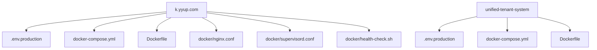
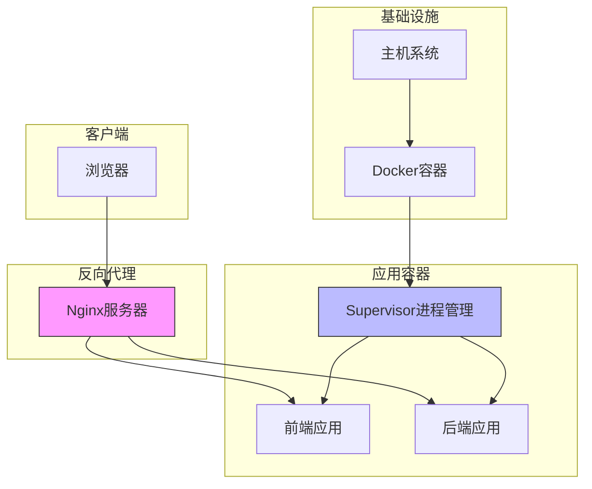
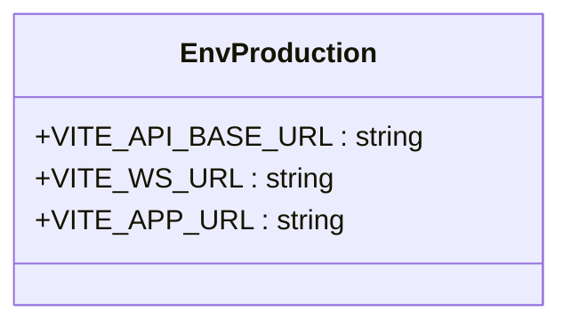
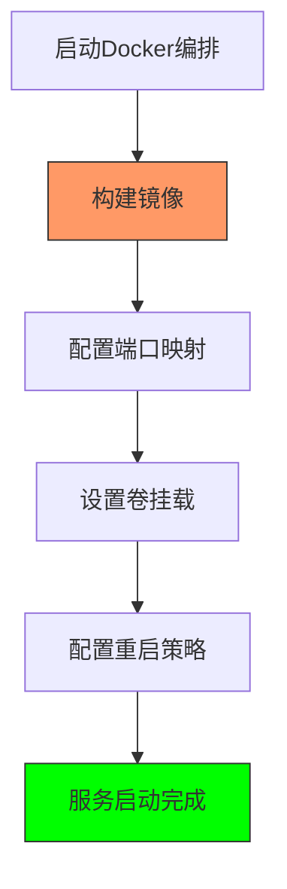
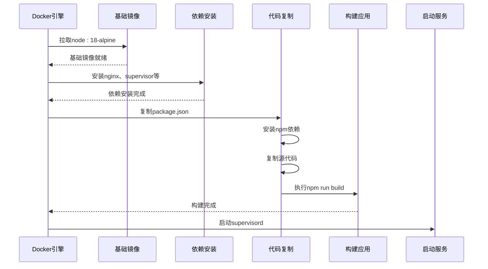
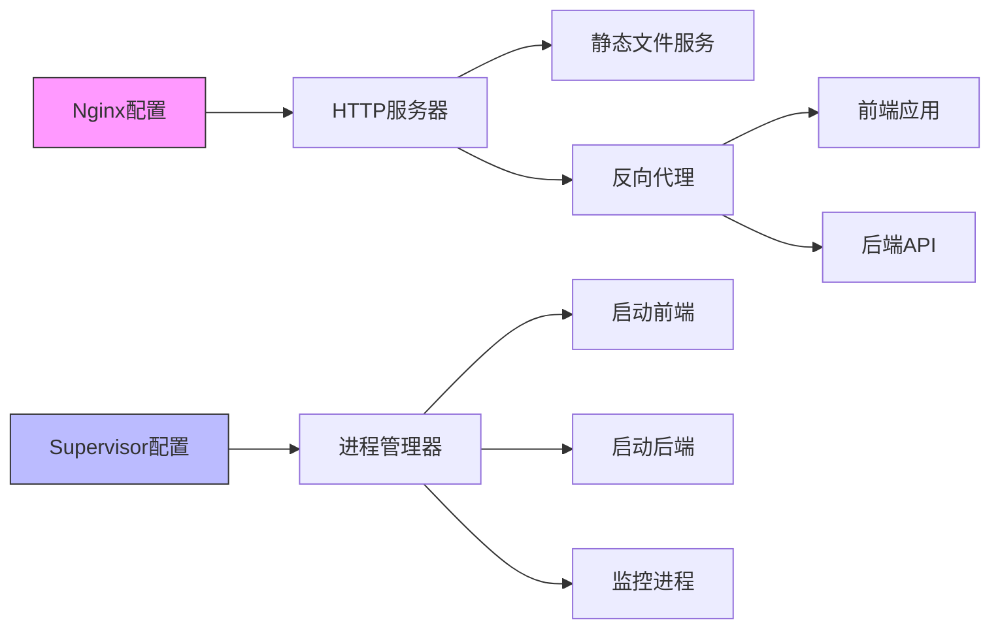
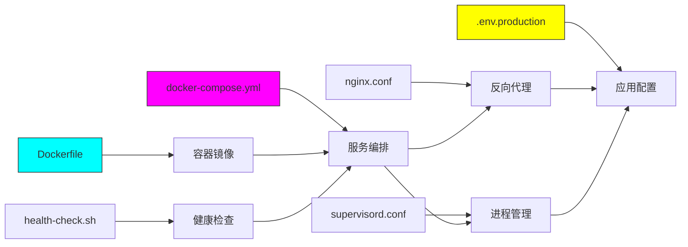

# 生产环境配置

<cite>
**本文档中引用的文件**  
- [k.yyup.com/.env.production](file://k.yyup.com/.env.production)
- [unified-tenant-system/.env.production](file://unified-tenant-system/.env.production)
- [k.yyup.com/docker-compose.yml](file://k.yyup.com/docker-compose.yml)
- [unified-tenant-system/docker-compose.yml](file://unified-tenant-system/docker-compose.yml)
- [k.yyup.com/Dockerfile](file://k.yyup.com/Dockerfile)
- [unified-tenant-system/Dockerfile](file://unified-tenant-system/Dockerfile)
- [k.yyup.com/docker/nginx.conf](file://k.yyup.com/docker/nginx.conf)
- [k.yyup.com/docker/supervisord.conf](file://k.yyup.com/docker/supervisord.conf)
- [k.yyup.com/docker/health-check.sh](file://k.yyup.com/docker/health-check.sh)
</cite>

## 目录
1. [简介](#简介)
2. [项目结构](#项目结构)
3. [核心组件](#核心组件)
4. [架构概述](#架构概述)
5. [详细组件分析](#详细组件分析)
6. [依赖分析](#依赖分析)
7. [性能考虑](#性能考虑)
8. [故障排除指南](#故障排除指南)
9. [结论](#结论)

## 简介
本文档详细介绍了k.yyupgame在生产环境下的配置方法，重点涵盖环境变量设置、Docker部署、Nginx反向代理、Supervisor进程管理、健康检查机制以及安全加固措施。文档为运维人员提供了完整的生产环境配置最佳实践。

## 项目结构

**图示来源**  
- [k.yyup.com/.env.production](file://k.yyup.com/.env.production)
- [unified-tenant-system/.env.production](file://unified-tenant-system/.env.production)
- [k.yyup.com/docker-compose.yml](file://k.yyup.com/docker-compose.yml)
- [unified-tenant-system/docker-compose.yml](file://unified-tenant-system/docker-compose.yml)

**本节来源**  
- [k.yyup.com/.env.production](file://k.yyup.com/.env.production)
- [unified-tenant-system/.env.production](file://unified-tenant-system/.env.production)
- [k.yyup.com/docker-compose.yml](file://k.yyup.com/docker-compose.yml)
- [unified-tenant-system/docker-compose.yml](file://unified-tenant-system/docker-compose.yml)

## 核心组件

本文档分析了k.yyupgame生产环境的核心配置组件，包括环境变量文件、Docker编排配置、容器镜像构建文件、Nginx服务器配置、Supervisor进程管理配置和健康检查脚本。这些组件共同构成了系统的生产部署基础。

**本节来源**  
- [k.yyup.com/.env.production](file://k.yyup.com/.env.production)
- [k.yyup.com/docker-compose.yml](file://k.yyup.com/docker-compose.yml)
- [k.yyup.com/Dockerfile](file://k.yyup.com/Dockerfile)

## 架构概述

**图示来源**  
- [k.yyup.com/Dockerfile](file://k.yyup.com/Dockerfile)
- [k.yyup.com/docker/nginx.conf](file://k.yyup.com/docker/nginx.conf)
- [k.yyup.com/docker/supervisord.conf](file://k.yyup.com/docker/supervisord.conf)

## 详细组件分析

### 环境变量配置分析

生产环境使用`.env.production`文件来定义关键环境变量。该文件配置了应用的基础URL、API端点和WebSocket连接地址，确保前端应用能够正确连接到后端服务。

**图示来源**  
- [k.yyup.com/.env.production](file://k.yyup.com/.env.production)
- [unified-tenant-system/.env.production](file://unified-tenant-system/.env.production)

### Docker编排配置分析

`docker-compose.yml`文件定义了服务的编排配置，包括容器构建、端口映射、卷挂载和重启策略。该配置支持开发和生产环境的灵活切换。

**图示来源**  
- [k.yyup.com/docker-compose.yml](file://k.yyup.com/docker-compose.yml)
- [unified-tenant-system/docker-compose.yml](file://unified-tenant-system/docker-compose.yml)

### 容器镜像构建分析

Dockerfile定义了容器镜像的构建过程，包括基础镜像选择、依赖安装、代码复制、前端构建和启动命令配置。该文件采用了多阶段构建优化策略，提高了构建效率和安全性。

**图示来源**  
- [k.yyup.com/Dockerfile](file://k.yyup.com/Dockerfile)
- [unified-tenant-system/Dockerfile](file://unified-tenant-system/Dockerfile)

### Nginx与Supervisor配置分析

Nginx作为反向代理服务器，负责静态文件服务和请求转发。Supervisor作为进程管理工具，确保前端和后端应用持续运行。两者协同工作，提供了稳定的生产环境。

**图示来源**  
- [k.yyup.com/docker/nginx.conf](file://k.yyup.com/docker/nginx.conf)
- [k.yyup.com/docker/supervisord.conf](file://k.yyup.com/docker/supervisord.conf)

## 依赖分析

**图示来源**  
- [k.yyup.com/.env.production](file://k.yyup.com/.env.production)
- [k.yyup.com/Dockerfile](file://k.yyup.com/Dockerfile)
- [k.yyup.com/docker-compose.yml](file://k.yyup.com/docker-compose.yml)

**本节来源**  
- [k.yyup.com/.env.production](file://k.yyup.com/.env.production)
- [k.yyup.com/Dockerfile](file://k.yyup.com/Dockerfile)
- [k.yyup.com/docker-compose.yml](file://k.yyup.com/docker-compose.yml)
- [k.yyup.com/docker/nginx.conf](file://k.yyup.com/docker/nginx.conf)
- [k.yyup.com/docker/supervisord.conf](file://k.yyup.com/docker/supervisord.conf)

## 性能考虑

生产环境配置充分考虑了性能优化因素。通过使用Alpine Linux作为基础镜像减小容器体积，设置npm国内镜像源加速依赖安装，利用Docker缓存机制提高构建效率。Nginx配置了静态文件缓存，Supervisor确保应用进程高可用，健康检查机制及时发现并恢复故障服务。

**本节来源**  
- [k.yyup.com/Dockerfile](file://k.yyup.com/Dockerfile)
- [k.yyup.com/docker/nginx.conf](file://k.yyup.com/docker/nginx.conf)
- [k.yyup.com/docker/supervisord.conf](file://k.yyup.com/docker/supervisord.conf)

## 故障排除指南

当生产环境出现问题时，可按照以下步骤进行排查：
1. 检查容器状态：使用`docker ps`查看容器是否正常运行
2. 查看日志信息：使用`docker logs`查看容器输出日志
3. 验证健康检查：确认健康检查脚本是否通过
4. 检查配置文件：确认.env.production等配置文件是否正确
5. 验证网络连接：确保端口映射和网络配置正确

**本节来源**  
- [k.yyup.com/docker/health-check.sh](file://k.yyup.com/docker/health-check.sh)
- [k.yyup.com/docker-compose.yml](file://k.yyup.com/docker-compose.yml)
- [k.yyup.com/Dockerfile](file://k.yyup.com/Dockerfile)

## 结论

k.yyupgame的生产环境配置采用了现代化的容器化部署方案，通过Docker、Nginx和Supervisor的组合，实现了应用的高可用性、可维护性和可扩展性。环境变量管理、容器编排、进程监控和健康检查等机制共同保障了系统的稳定运行。建议运维人员严格按照本文档的配置要求进行部署和维护，确保生产环境的安全和稳定。