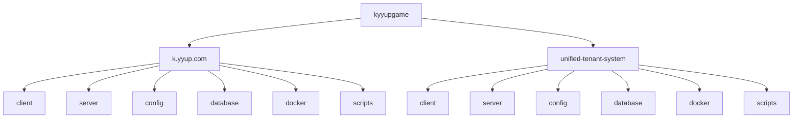

# 目录结构详解

<cite>
**本文档引用的文件**  
- [k.yyup.com/package.json](file://k.yyup.com/package.json)
- [unified-tenant-system/package.json](file://unified-tenant-system/package.json)
- [k.yyup.com/.env](file://k.yyup.com/.env)
- [k.yyup.com/.env.development](file://k.yyup.com/.env.development)
- [k.yyup.com/.env.production](file://k.yyup.com/.env.production)
- [unified-tenant-system/.env](file://unified-tenant-system/.env)
- [unified-tenant-system/.env.development](file://unified-tenant-system/.env.development)
- [unified-tenant-system/.env.production](file://unified-tenant-system/.env.production)
- [k.yyup.com/Dockerfile](file://k.yyup.com/Dockerfile)
- [k.yyup.com/docker-compose.yml](file://k.yyup.com/docker-compose.yml)
- [unified-tenant-system/Dockerfile](file://unified-tenant-system/Dockerfile)
- [unified-tenant-system/docker-compose.yml](file://unified-tenant-system/docker-compose.yml)
- [k.yyup.com/config/security.json](file://k.yyup.com/config/security.json)
- [unified-tenant-system/config/security.json](file://unified-tenant-system/config/security.json)
</cite>

## 目录结构

kyyupgame项目包含两个主要子系统：k.yyup.com和unified-tenant-system。这两个系统共享相似的技术栈但服务于不同的业务场景。

**图示来源**
- [k.yyup.com](file://k.yyup.com)
- [unified-tenant-system](file://unified-tenant-system)

## 主要子系统

kyyupgame项目包含两个核心子系统：k.yyup.com和unified-tenant-system。这两个系统虽然共享相似的技术架构，但在职责和功能上有所区别。

k.yyup.com是主要的幼儿园管理系统，专注于提供完整的幼儿园管理功能，包括教学管理、学生管理、家长沟通等核心业务功能。该系统具有完整的前后端分离架构，包含详细的环境配置和部署方案。

unified-tenant-system是统一租户系统，主要负责多租户管理和统一认证服务。该系统为多个租户提供基础服务支持，包括租户配置、统一域名管理和跨系统认证等功能。其配置中包含了租户相关的数据库连接和服务器IP配置。

两个系统都采用了现代化的全栈技术架构，使用Vue3作为前端框架，Express作为后端服务，并通过Docker进行容器化部署。它们共享相似的项目结构和开发流程，便于维护和升级。

**本节来源**
- [k.yyup.com/package.json](file://k.yyup.com/package.json)
- [unified-tenant-system/package.json](file://unified-tenant-system/package.json)

## k.yyup.com目录结构

k.yyup.com目录是项目的核心部分，采用标准的前后端分离架构。该目录包含前端(client)、后端(server)、配置(config)、数据库迁移(database)、Docker配置(docker)和脚本(scripts)等关键组件。

前端(client)目录包含Vue3应用代码，使用Vite作为构建工具。后端(server)目录包含Express服务代码，采用TypeScript开发。配置(config)目录存放系统安全配置。数据库(database)目录包含数据库迁移脚本。Docker(docker)目录包含容器化部署所需的配置文件。脚本(scripts)目录包含大量的自动化脚本，用于测试、部署和数据管理。

该目录结构体现了清晰的关注点分离原则，使得前后端开发可以独立进行，同时通过标准化的接口进行通信。这种架构有利于团队协作和持续集成/持续部署(CI/CD)流程的实施。

**本节来源**
- [k.yyup.com](file://k.yyup.com)

## 环境配置文件

项目包含多种环境配置文件，用于管理不同环境下的应用配置。这些文件包括.env、.env.development和.env.production，分别对应默认配置、开发环境配置和生产环境配置。

.env文件包含全局配置，如Builder.io的API密钥。.env.development文件包含开发环境特定的配置，如JWT密钥和API基础URL。.env.production文件包含生产环境的配置，指向生产服务器的URL。

这些环境变量通过Vite的环境变量机制在前端使用，以VITE_为前缀的变量会被暴露给前端代码。后端服务也使用这些环境变量来配置数据库连接、认证密钥等敏感信息。这种配置方式确保了敏感信息不会硬编码在源代码中，提高了安全性。

环境配置文件的分层设计使得开发者可以在不同环境中使用不同的配置，而无需修改代码。例如，开发环境可能连接到测试API，而生产环境连接到正式API。

**本节来源**
- [k.yyup.com/.env](file://k.yyup.com/.env)
- [k.yyup.com/.env.development](file://k.yyup.com/.env.development)
- [k.yyup.com/.env.production](file://k.yyup.com/.env.production)
- [unified-tenant-system/.env](file://unified-tenant-system/.env)
- [unified-tenant-system/.env.development](file://unified-tenant-system/.env.development)
- [unified-tenant-system/.env.production](file://unified-tenant-system/.env.production)

## Docker配置

项目的Docker配置包含Dockerfile和docker-compose.yml文件，用于容器化部署。Dockerfile定义了镜像构建过程，基于node:18-alpine基础镜像，安装必要的依赖并配置Nginx和Supervisor。

Dockerfile中设置了npm国内镜像源以加快依赖安装速度。前端使用npm ci安装依赖并构建，后端也安装相应依赖。Nginx配置为反向代理服务器，Supervisor用于管理多个进程。镜像暴露80端口，并包含健康检查机制。

docker-compose.yml文件定义了服务编排，将应用容器映射到主机的3000、5173和80端口。配置中包含了可选的MySQL数据库服务，便于本地开发和测试。这种容器化部署方式确保了开发、测试和生产环境的一致性。

两个子系统(k.yyup.com和unified-tenant-system)使用相同的Docker配置，体现了配置的一致性和可复用性。

**本节来源**
- [k.yyup.com/Dockerfile](file://k.yyup.com/Dockerfile)
- [k.yyup.com/docker-compose.yml](file://k.yyup.com/docker-compose.yml)
- [unified-tenant-system/Dockerfile](file://unified-tenant-system/Dockerfile)
- [unified-tenant-system/docker-compose.yml](file://unified-tenant-system/docker-compose.yml)

## 脚本目录

scripts目录包含大量的自动化脚本，涵盖了测试、部署、数据管理和系统维护等多个方面。这些脚本极大地提高了开发效率和系统可靠性。

测试脚本包括端到端测试、单元测试、集成测试和性能测试等，使用Playwright、Jest和Vitest等测试框架。部署脚本包含构建、启动和停止服务的脚本，支持快速部署和回滚。数据管理脚本用于数据种子生成、数据库优化和迁移等操作。

特别值得注意的是，项目包含专门的AI助手测试脚本和智能代理功能检测脚本，反映了系统对AI功能的重视。此外，还有大量的代码质量检查脚本，用于检测硬编码数据、样式问题和权限配置等。

这些脚本通过npm scripts进行组织和调用，形成了完整的开发工作流。开发者可以通过简单的命令执行复杂的操作，如"npm run test:e2e"运行端到端测试，"npm run build"构建生产版本等。

**本节来源**
- [k.yyup.com/package.json](file://k.yyup.com/package.json)
- [unified-tenant-system/package.json](file://unified-tenant-system/package.json)