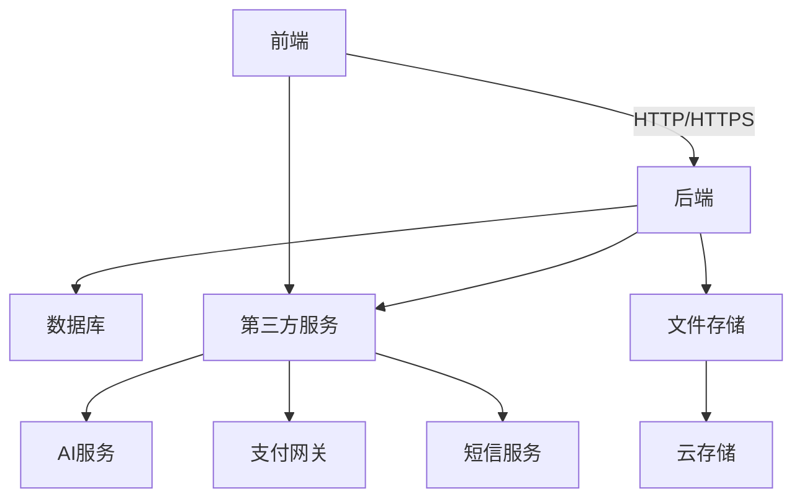

# 系统概述

<cite>
**本文档引用的文件**
- [k.yyup.com/package.json](file://k.yyup.com/package.json)
- [unified-tenant-system/package.json](file://unified-tenant-system/package.json)
- [k.yyup.com/Dockerfile](file://k.yyup.com/Dockerfile)
- [unified-tenant-system/Dockerfile](file://unified-tenant-system/Dockerfile)
- [k.yyup.com/.env](file://k.yyup.com/.env)
- [unified-tenant-system/.env](file://unified-tenant-system/.env)
- [k.yyup.com/server/tsconfig.json](file://k.yyup.com/server/tsconfig.json)
- [unified-tenant-system/server/tsconfig.json](file://unified-tenant-system/server/tsconfig.json)
- [k.yyup.com/client/package.json](file://k.yyup.com/client/package.json)
- [unified-tenant-system/client/package.json](file://unified-tenant-system/client/package.json)
</cite>

## 目录
1. [简介](#简介)
2. [项目结构](#项目结构)
3. [核心子系统](#核心子系统)
4. [技术架构](#技术架构)
5. [多租户架构](#多租户架构)
6. [权限体系](#权限体系)
7. [AI助手功能](#ai助手功能)
8. [系统上下文图](#系统上下文图)

## 简介

kyyupgame全栈应用是一个为幼儿园设计的综合管理解决方案，旨在通过数字化手段优化幼儿园的运营管理。系统覆盖了招生、教学、人事、财务等关键业务模块，为幼儿园管理者提供了一站式的管理平台。本系统采用前后端分离架构，前端基于Vue3框架，后端基于Express框架，使用TypeScript作为主要开发语言，确保了代码的可维护性和类型安全性。

该系统由两个主要子系统组成：k.yyup.com主管理系统和unified-tenant-system统一租户系统。这两个子系统协同工作，共同构成了完整的幼儿园管理解决方案。系统支持多租户模式，允许不同幼儿园作为独立租户使用系统，同时提供了基于角色的访问控制(RBAC)权限体系，确保数据安全和权限隔离。

**Section sources**
- [k.yyup.com/package.json](file://k.yyup.com/package.json)
- [unified-tenant-system/package.json](file://unified-tenant-system/package.json)

## 项目结构

kyyupgame项目的目录结构清晰地反映了系统的模块化设计。项目根目录下包含两个主要子系统：k.yyup.com和unified-tenant-system。每个子系统都遵循类似的结构，包含client（前端）、server（后端）、config（配置）、docker（Docker配置）等目录。

k.yyup.com作为主管理系统，包含了完整的幼儿园管理功能，而unified-tenant-system作为统一租户系统，负责管理多个租户的注册、配置和隔离。两个系统都使用TypeScript进行开发，并通过package.json文件管理依赖关系。Dockerfile文件表明系统支持容器化部署，便于在不同环境中快速部署和扩展。

**Section sources**
- [k.yyup.com/package.json](file://k.yyup.com/package.json)
- [unified-tenant-system/package.json](file://unified-tenant-system/package.json)
- [k.yyup.com/Dockerfile](file://k.yyup.com/Dockerfile)
- [unified-tenant-system/Dockerfile](file://unified-tenant-system/Dockerfile)

## 核心子系统

kyyupgame系统由两个核心子系统组成：k.yyup.com主管理系统和unified-tenant-system统一租户系统。k.yyup.com是主要的业务管理系统，负责处理幼儿园的日常运营，包括招生管理、教学管理、人事管理和财务管理等核心功能。该系统为幼儿园管理员、教师、家长等不同角色提供定制化的界面和功能。

unified-tenant-system是统一租户系统，负责管理多个幼儿园租户的注册、配置和隔离。该系统通过多租户模式支持多个幼儿园同时使用系统，每个租户都有独立的数据空间和配置。两个子系统通过API进行通信，k.yyup.com向unified-tenant-system注册租户信息，并获取租户特定的配置。

**Section sources**
- [k.yyup.com/.env](file://k.yyup.com/.env)
- [unified-tenant-system/.env](file://unified-tenant-system/.env)

## 技术架构

kyyupgame系统采用前后端分离的架构设计，前端基于Vue3框架，后端基于Express框架，使用TypeScript作为主要开发语言。这种技术栈的选择为系统提供了良好的开发体验和运行性能。

前端使用Vue3作为UI框架，结合Vite作为构建工具，提供了快速的开发服务器和高效的生产构建。Vue3的组合式API使得代码组织更加灵活，便于维护和扩展。Pinia作为状态管理库，提供了简洁的API来管理应用状态。Element Plus和Vant等UI组件库为系统提供了丰富的界面组件。

后端使用Express框架构建RESTful API，处理前端请求并与数据库交互。TypeScript的使用增强了代码的可读性和可维护性，减少了运行时错误。系统使用MySQL作为主要数据库，通过Sequelize ORM进行数据访问，简化了数据库操作。

**Section sources**
- [k.yyup.com/package.json](file://k.yyup.com/package.json)
- [unified-tenant-system/package.json](file://unified-tenant-system/package.json)
- [k.yyup.com/client/package.json](file://k.yyup.com/client/package.json)
- [unified-tenant-system/client/package.json)

## 多租户架构

kyyupgame系统采用多租户架构，支持多个幼儿园作为独立租户使用系统。unified-tenant-system统一租户系统负责管理租户的注册、配置和隔离。每个租户都有独立的数据库实例或数据模式，确保数据的隔离性和安全性。

系统通过租户ID来区分不同租户的数据，在数据库查询中自动添加租户过滤条件。这种设计既保证了数据隔离，又便于系统的扩展和维护。当新幼儿园注册时，系统会自动为其创建独立的数据空间，并配置相应的访问权限。

**Section sources**
- [unified-tenant-system/.env](file://unified-tenant-system/.env)
- [k.yyup.com/server/tsconfig.json](file://k.yyup.com/server/tsconfig.json)
- [unified-tenant-system/server/tsconfig.json](file://unified-tenant-system/server/tsconfig.json)

## 权限体系

系统采用基于角色的访问控制(RBAC)权限体系，为不同用户角色分配相应的权限。权限体系包括管理员、教师、家长等角色，每个角色都有预定义的权限集合。管理员可以管理系统的全局设置，教师可以管理班级和学生，家长可以查看孩子的信息。

权限配置通过数据库中的权限表进行管理，支持动态调整。系统在用户登录时加载其权限信息，并在每次请求时进行权限验证，确保用户只能访问其权限范围内的资源。这种设计既保证了系统的安全性，又提供了灵活的权限管理能力。

**Section sources**
- [k.yyup.com/package.json](file://k.yyup.com/package.json)
- [unified-tenant-system/package.json](file://unified-tenant-system/package.json)

## AI助手功能

kyyupgame系统集成了AI助手功能，为用户提供智能化的服务。AI助手可以回答用户关于系统使用的问题，提供操作指导，甚至可以执行一些简单的任务。该功能通过自然语言处理技术实现，能够理解用户的意图并给出相应的响应。

AI助手的实现基于Model Context Protocol(MCP)技术，通过@modelcontextprotocol/sdk和@modelcontextprotocol/server-puppeteer等依赖包提供支持。系统通过Playwright进行端到端测试，确保AI助手的功能稳定可靠。

**Section sources**
- [k.yyup.com/package.json](file://k.yyup.com/package.json)
- [unified-tenant-system/package.json](file://unified-tenant-system/package.json)

## 系统上下文图

**Diagram sources**
- [k.yyup.com/package.json](file://k.yyup.com/package.json)
- [unified-tenant-system/package.json](file://unified-tenant-system/package.json)

**Section sources**
- [k.yyup.com/package.json](file://k.yyup.com/package.json)
- [unified-tenant-system/package.json](file://unified-tenant-system/package.json)