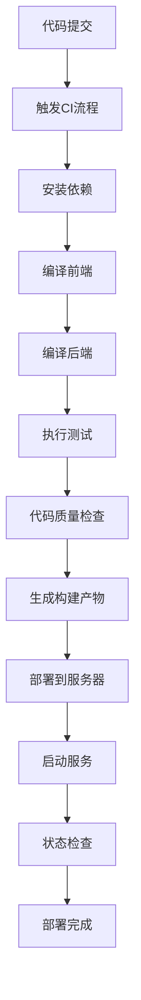
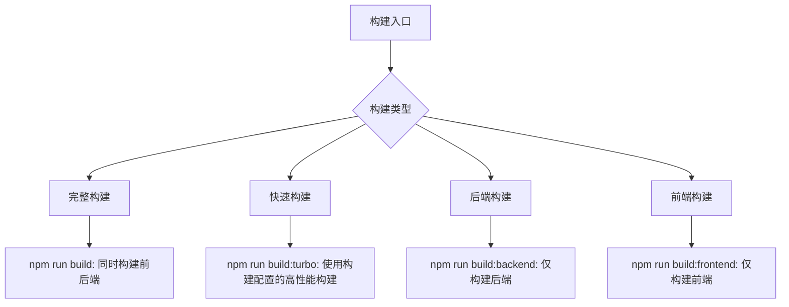
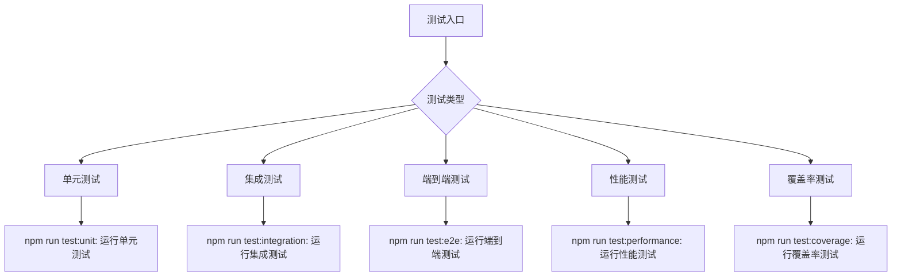
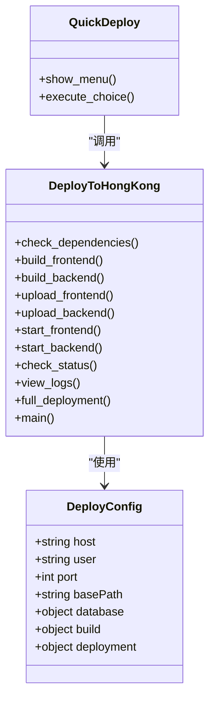
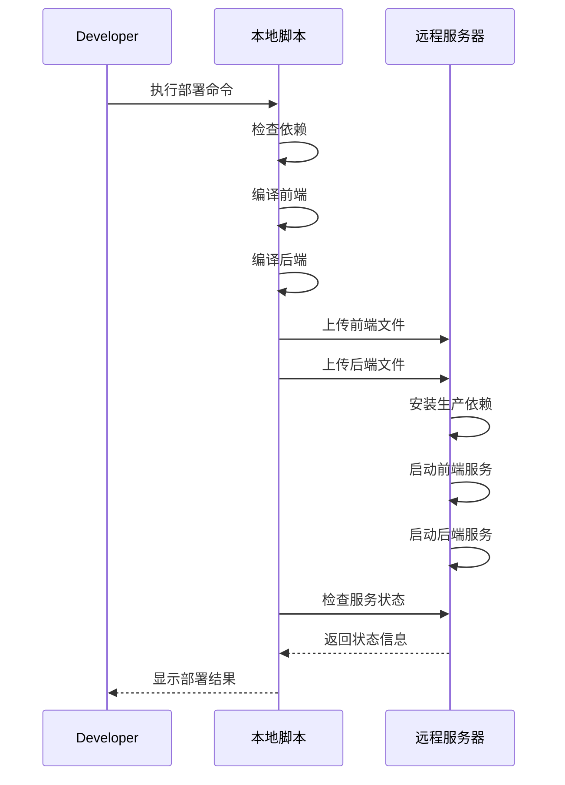
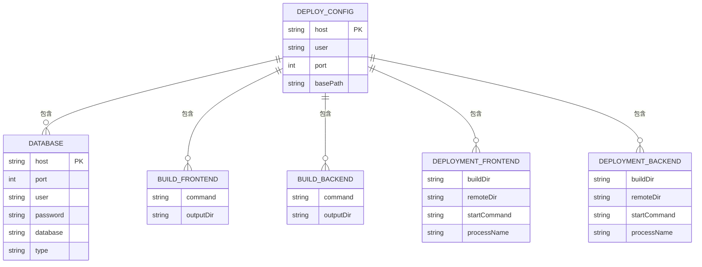
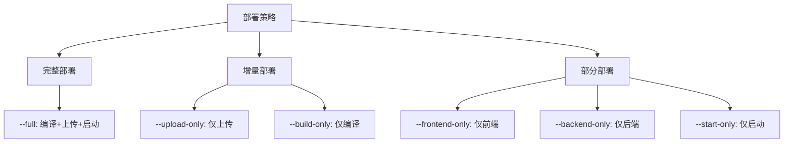
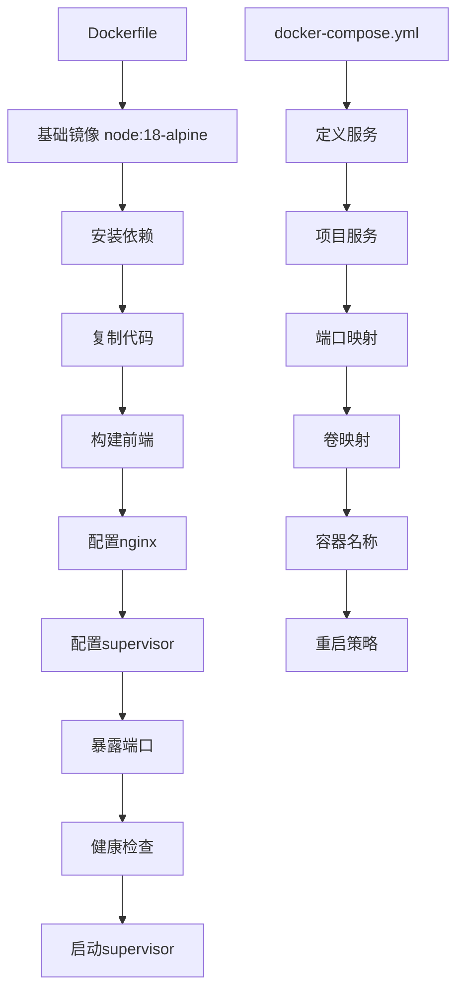
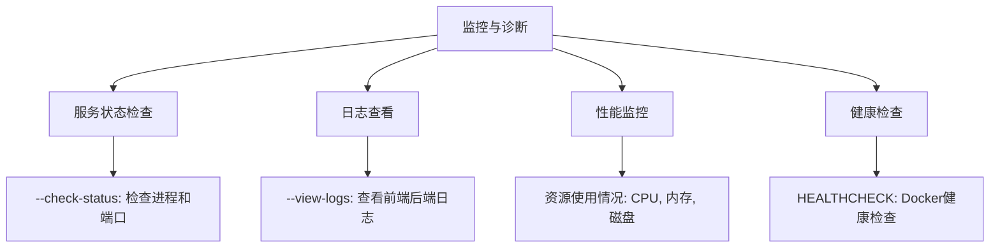
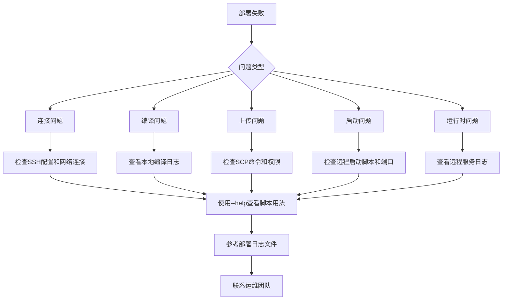

# CI/CD流程

<cite>
**本文档引用的文件**  
- [package.json](file://k.yyup.com/package.json)
- [deploy-to-hong-kong.sh](file://k.yyup.com/deployment-scripts/deploy-to-hong-kong.sh)
- [quick-deploy.sh](file://k.yyup.com/deployment-scripts/quick-deploy.sh)
- [deploy-config.json](file://k.yyup.com/deployment-scripts/deploy-config.json)
- [Dockerfile](file://k.yyup.com/Dockerfile)
- [docker-compose.yml](file://k.yyup.com/docker-compose.yml)
- [docker-compose.simple.yml](file://k.yyup.com/docker-compose.simple.yml)
</cite>

## 目录
1. [简介](#简介)
2. [项目结构](#项目结构)
3. [CI/CD流程概述](#cicd流程概述)
4. [GitHub Actions工作流配置](#github-actions工作流配置)
5. [构建与测试流程](#构建与测试流程)
6. [部署脚本实现逻辑](#部署脚本实现逻辑)
7. [部署策略实现](#部署策略实现)
8. [流程监控与故障排查](#流程监控与故障排查)
9. [最佳实践建议](#最佳实践建议)

## 简介
本文档详细介绍了k.yyupgame项目的CI/CD自动化流水线，涵盖从代码提交到生产部署的完整流程。文档重点分析了部署脚本的实现、构建流程、部署策略以及监控机制，为开发团队提供全面的参考指南。

## 项目结构
k.yyupgame项目采用前后端分离的架构，主要包含以下核心目录：
- `client/`: 前端应用，基于Vue 3 + Vite构建
- `server/`: 后端服务，基于Express.js框架
- `deployment-scripts/`: 部署相关脚本和配置
- `.github/workflows/`: GitHub Actions工作流配置（未在文件系统中找到具体文件）
- `docker/`: Docker相关配置文件

**Section sources**
- [package.json](file://k.yyup.com/package.json)

## CI/CD流程概述
k.yyupgame项目的CI/CD流程主要由本地构建脚本和部署脚本组成，虽然未发现GitHub Actions工作流文件，但项目通过npm脚本和shell脚本实现了完整的自动化流程。

流程主要包括以下阶段：
1. 代码提交触发CI流程
2. 依赖安装与代码编译
3. 测试执行与代码质量检查
4. 构建产物生成
5. 部署到目标服务器
6. 服务启动与状态检查

**Diagram sources**
- [package.json](file://k.yyup.com/package.json)
- [deploy-to-hong-kong.sh](file://k.yyup.com/deployment-scripts/deploy-to-hong-kong.sh)

## GitHub Actions工作流配置
尽管项目目录中存在`.github/workflows/`目录，但未找到具体的GitHub Actions工作流文件。项目可能使用其他CI/CD工具或尚未完全配置GitHub Actions。

根据项目结构和脚本，理想的GitHub Actions工作流应包含以下步骤：
- 代码检出
- Node.js环境设置
- 依赖安装
- 构建执行
- 测试运行
- 代码质量检查
- 部署到生产环境

**Section sources**
- [.github/workflows/](file://k.yyup.com/.github/workflows/)

## 构建与测试流程
项目的构建与测试流程主要通过`package.json`中的npm脚本定义，形成了完整的开发和测试工作流。

### 构建流程
项目提供了多种构建脚本，支持不同的构建需求：

**Diagram sources**
- [package.json](file://k.yyup.com/package.json)

### 测试流程
项目实现了全面的测试体系，包括单元测试、集成测试和端到端测试：

**Diagram sources**
- [package.json](file://k.yyup.com/package.json)

## 部署脚本实现逻辑
项目的部署主要通过`deployment-scripts/`目录下的shell脚本实现，核心脚本包括`deploy-to-hong-kong.sh`和`quick-deploy.sh`。

### 部署脚本架构

**Diagram sources**
- [deploy-to-hong-kong.sh](file://k.yyup.com/deployment-scripts/deploy-to-hong-kong.sh)
- [quick-deploy.sh](file://k.yyup.com/deployment-scripts/quick-deploy.sh)
- [deploy-config.json](file://k.yyup.com/deployment-scripts/deploy-config.json)

### 部署流程
部署脚本实现了完整的部署流程，包括环境准备、编译、上传和启动：

**Diagram sources**
- [deploy-to-hong-kong.sh](file://k.yyup.com/deployment-scripts/deploy-to-hong-kong.sh)

### 部署配置
部署配置通过`deploy-config.json`文件管理，包含服务器、数据库和构建配置：

**Diagram sources**
- [deploy-config.json](file://k.yyup.com/deployment-scripts/deploy-config.json)

## 部署策略实现
项目通过脚本参数支持多种部署策略，虽然未实现蓝绿部署或滚动更新等高级策略，但提供了灵活的部署选项。

### 部署策略类型

**Diagram sources**
- [deploy-to-hong-kong.sh](file://k.yyup.com/deployment-scripts/deploy-to-hong-kong.sh)

### Docker部署支持
项目提供了Docker支持，通过Dockerfile和docker-compose文件实现容器化部署：

**Diagram sources**
- [Dockerfile](file://k.yyup.com/Dockerfile)
- [docker-compose.yml](file://k.yyup.com/docker-compose.yml)
- [docker-compose.simple.yml](file://k.yyup.com/docker-compose.simple.yml)

## 流程监控与故障排查
项目提供了完善的监控和故障排查机制，帮助开发人员快速定位和解决问题。

### 监控与诊断功能

**Diagram sources**
- [deploy-to-hong-kong.sh](file://k.yyup.com/deployment-scripts/deploy-to-hong-kong.sh)
- [Dockerfile](file://k.yyup.com/Dockerfile)

### 故障排查指南
当部署出现问题时，可按以下步骤进行排查：

**Section sources**
- [deploy-to-hong-kong.sh](file://k.yyup.com/deployment-scripts/deploy-to-hong-kong.sh)
- [quick-deploy.sh](file://k.yyup.com/deployment-scripts/quick-deploy.sh)

## 最佳实践建议
基于对项目CI/CD流程的分析，提出以下最佳实践建议：

### CI/CD流程优化
1. **完善GitHub Actions配置**：创建完整的GitHub Actions工作流，实现真正的持续集成
2. **引入环境隔离**：建立开发、测试、预发布和生产等多套环境
3. **增强安全性**：避免在脚本中硬编码密码，使用环境变量或密钥管理服务
4. **实现高级部署策略**：引入蓝绿部署或滚动更新，减少部署对用户的影响

### 部署脚本改进
1. **模块化设计**：将通用功能提取为独立模块，提高代码复用性
2. **错误处理**：增强错误处理机制，提供更详细的错误信息
3. **自动化回滚**：实现自动回滚机制，在部署失败时自动恢复到上一版本
4. **部署验证**：在部署后自动执行健康检查，确保服务正常运行

### 监控与可观测性
1. **集中日志管理**：使用ELK或类似方案集中管理日志
2. **性能监控**：引入APM工具监控应用性能
3. **告警机制**：设置关键指标告警，及时发现和响应问题
4. **部署指标**：收集部署成功率、部署时长等指标，持续优化流程

**Section sources**
- [deploy-to-hong-kong.sh](file://k.yyup.com/deployment-scripts/deploy-to-hong-kong.sh)
- [package.json](file://k.yyup.com/package.json)
- [Dockerfile](file://k.yyup.com/Dockerfile)