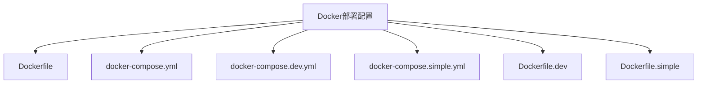
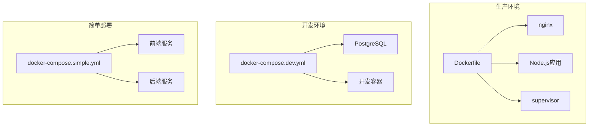
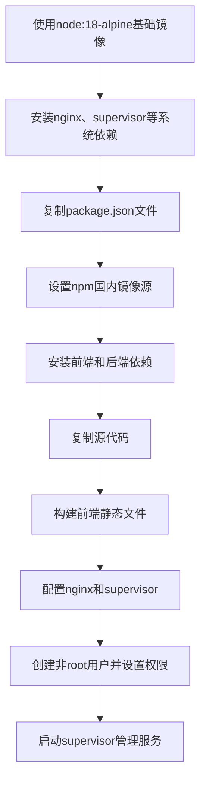
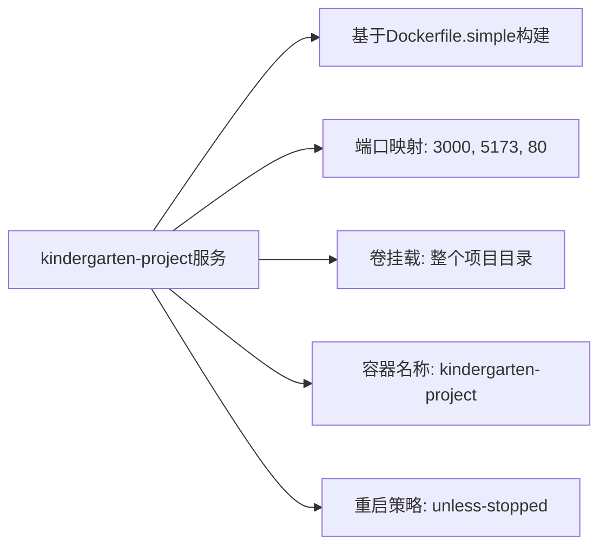
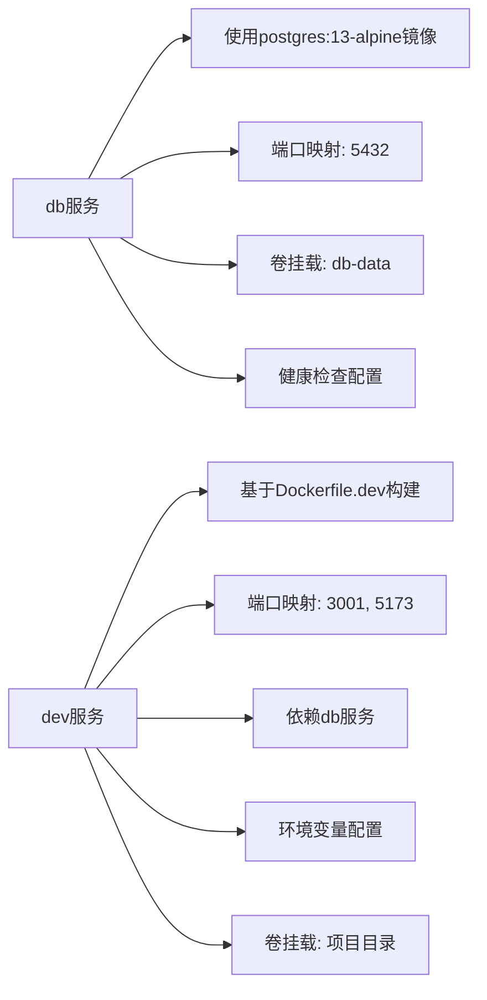
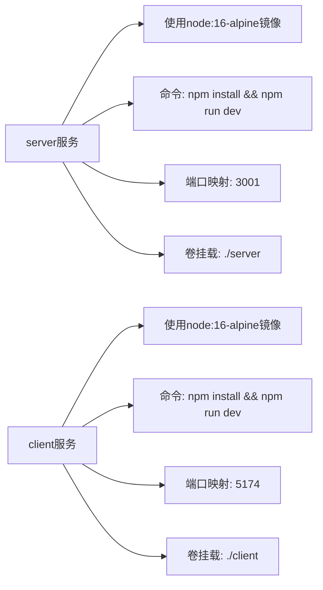
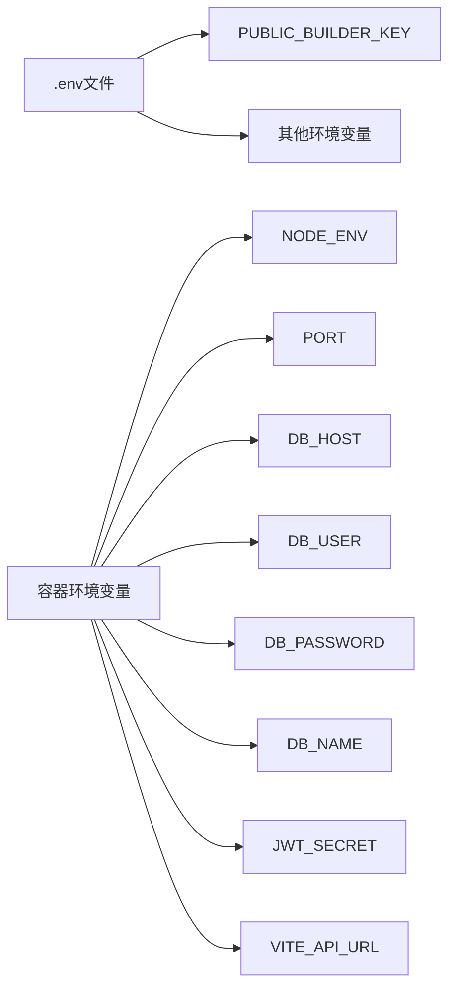
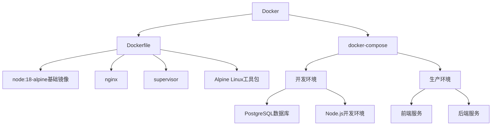

# Docker部署

<cite>
**本文档引用的文件**
- [Dockerfile](file://k.yyup.com/Dockerfile)
- [docker-compose.yml](file://k.yyup.com/docker-compose.yml)
- [docker-compose.dev.yml](file://k.yyup.com/docker-compose.dev.yml)
- [docker-compose.simple.yml](file://k.yyup.com/docker-compose.simple.yml)
- [Dockerfile.dev](file://k.yyup.com/Dockerfile.dev)
- [Dockerfile.simple](file://k.yyup.com/Dockerfile.simple)
- [entrypoint.sh](file://k.yyup.com/entrypoint.sh)
- [.env](file://k.yyup.com/.env)
</cite>

## 目录
1. [简介](#简介)
2. [项目结构](#项目结构)
3. [核心组件](#核心组件)
4. [架构概述](#架构概述)
5. [详细组件分析](#详细组件分析)
6. [依赖分析](#依赖分析)
7. [性能考虑](#性能考虑)
8. [故障排除指南](#故障排除指南)
9. [结论](#结论)

## 简介
本文档详细介绍了k.yyupgame项目的Docker容器化部署方案，重点阐述了多阶段构建策略、不同环境下的Compose配置差异以及完整的部署操作指南。文档涵盖了从基础镜像选择到生产环境优化的各个方面，为开发、测试和运维团队提供全面的Docker部署参考。

## 项目结构
k.yyupgame项目采用模块化设计，包含前端、后端、数据库等多个组件。Docker部署方案通过不同的Dockerfile和docker-compose配置文件支持多种部署场景，包括开发、测试和生产环境。

**图示来源**
- [Dockerfile](file://k.yyup.com/Dockerfile)
- [docker-compose.yml](file://k.yyup.com/docker-compose.yml)
- [docker-compose.dev.yml](file://k.yyup.com/docker-compose.dev.yml)

**本节来源**
- [Dockerfile](file://k.yyup.com/Dockerfile)
- [docker-compose.yml](file://k.yyup.com/docker-compose.yml)
- [docker-compose.dev.yml](file://k.yyup.com/docker-compose.dev.yml)
- [docker-compose.simple.yml](file://k.yyup.com/docker-compose.simple.yml)

## 核心组件
项目的核心Docker组件包括主Dockerfile、多个docker-compose配置文件以及特定环境的Dockerfile变体。这些组件共同构成了灵活的容器化部署体系，支持从开发到生产的完整生命周期管理。

**本节来源**
- [Dockerfile](file://k.yyup.com/Dockerfile)
- [docker-compose.yml](file://k.yyup.com/docker-compose.yml)
- [Dockerfile.dev](file://k.yyup.com/Dockerfile.dev)

## 架构概述
k.yyupgame项目的Docker部署采用分层架构设计，通过不同的配置文件满足不同环境的需求。生产环境使用多服务集成的部署方式，开发环境则侧重于快速迭代和调试便利性。

**图示来源**
- [Dockerfile](file://k.yyup.com/Dockerfile)
- [docker-compose.dev.yml](file://k.yyup.com/docker-compose.dev.yml)
- [docker-compose.simple.yml](file://k.yyup.com/docker-compose.simple.yml)

## 详细组件分析

### 多阶段构建策略分析
项目的主Dockerfile采用了优化的多阶段构建策略，确保了镜像的安全性和效率。

**图示来源**
- [Dockerfile](file://k.yyup.com/Dockerfile#L1-L83)

**本节来源**
- [Dockerfile](file://k.yyup.com/Dockerfile#L1-L83)

### Docker Compose配置分析
项目提供了多个docker-compose配置文件，以适应不同的部署需求。

#### 生产环境Compose配置

**图示来源**
- [docker-compose.yml](file://k.yyup.com/docker-compose.yml#L1-L14)

#### 开发环境Compose配置

**图示来源**
- [docker-compose.dev.yml](file://k.yyup.com/docker-compose.dev.yml#L1-L55)

#### 简单部署Compose配置

**图示来源**
- [docker-compose.simple.yml](file://k.yyup.com/docker-compose.simple.yml#L1-L29)

**本节来源**
- [docker-compose.yml](file://k.yyup.com/docker-compose.yml#L1-L42)
- [docker-compose.dev.yml](file://k.yyup.com/docker-compose.dev.yml#L1-L55)
- [docker-compose.simple.yml](file://k.yyup.com/docker-compose.simple.yml#L1-L29)

### 环境配置分析
项目通过.env文件和环境变量配置实现了灵活的环境管理。

**图示来源**
- [.env](file://k.yyup.com/.env#L1-L3)
- [docker-compose.dev.yml](file://k.yyup.com/docker-compose.dev.yml#L32-L39)

**本节来源**
- [.env](file://k.yyup.com/.env#L1-L3)
- [docker-compose.dev.yml](file://k.yyup.com/docker-compose.dev.yml#L32-L39)

## 依赖分析
项目的Docker部署方案依赖于多个关键组件，这些组件之间存在明确的依赖关系。

**图示来源**
- [Dockerfile](file://k.yyup.com/Dockerfile#L2)
- [docker-compose.dev.yml](file://k.yyup.com/docker-compose.dev.yml#L6)
- [docker-compose.simple.yml](file://k.yyup.com/docker-compose.simple.yml#L3)

**本节来源**
- [Dockerfile](file://k.yyup.com/Dockerfile#L1-L83)
- [docker-compose.yml](file://k.yyup.com/docker-compose.yml#L1-L42)
- [docker-compose.dev.yml](file://k.yyup.com/docker-compose.dev.yml#L1-L55)
- [docker-compose.simple.yml](file://k.yyup.com/docker-compose.simple.yml#L1-L29)

## 性能考虑
在Docker部署中，项目通过多种方式优化性能和资源利用率。

1. **基础镜像选择**：使用Alpine Linux作为基础镜像，显著减小了镜像体积
2. **依赖安装优化**：分阶段安装依赖，充分利用Docker缓存机制
3. **多服务管理**：使用supervisor统一管理nginx和Node.js服务
4. **健康检查**：配置了完善的健康检查机制，确保服务稳定性
5. **卷挂载策略**：合理使用卷挂载，平衡开发便利性和生产安全性

**本节来源**
- [Dockerfile](file://k.yyup.com/Dockerfile#L73-L74)
- [docker-compose.dev.yml](file://k.yyup.com/docker-compose.dev.yml#L15-L19)

## 故障排除指南
### 常见问题及解决方案

| 问题现象 | 可能原因 | 解决方案 |
|--------|--------|--------|
| 容器启动失败 | 依赖安装错误 | 检查网络连接，确认国内镜像源配置 |
| 端口无法访问 | 端口映射配置错误 | 检查docker-compose中的端口映射配置 |
| 数据库连接失败 | 环境变量配置错误 | 确认DB_HOST、DB_USER等环境变量 |
| 前端资源加载失败 | nginx配置错误 | 检查docker/nginx.conf配置文件 |
| 权限问题 | 用户权限配置不当 | 检查Dockerfile中的用户创建和权限设置 |

### 调试建议
1. 使用`docker logs`命令查看容器日志
2. 进入容器内部检查文件系统和配置
3. 验证环境变量是否正确传递
4. 检查网络连接和端口占用情况
5. 确认卷挂载路径的正确性

**本节来源**
- [Dockerfile](file://k.yyup.com/Dockerfile#L56-L57)
- [docker-compose.yml](file://k.yyup.com/docker-compose.yml#L7-L9)
- [docker-compose.dev.yml](file://k.yyup.com/docker-compose.dev.yml#L27-L28)

## 结论
k.yyupgame项目的Docker部署方案设计合理，通过多阶段构建和多种Compose配置文件满足了不同环境的需求。方案注重安全性、性能和可维护性，为项目的持续集成和部署提供了坚实的基础。建议在生产环境中使用主Dockerfile进行构建，而在开发环境中使用docker-compose.dev.yml以获得最佳的开发体验。