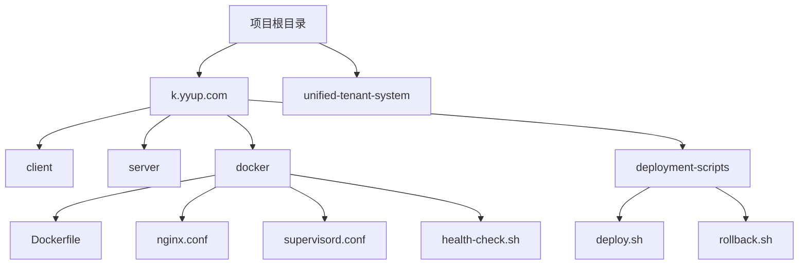
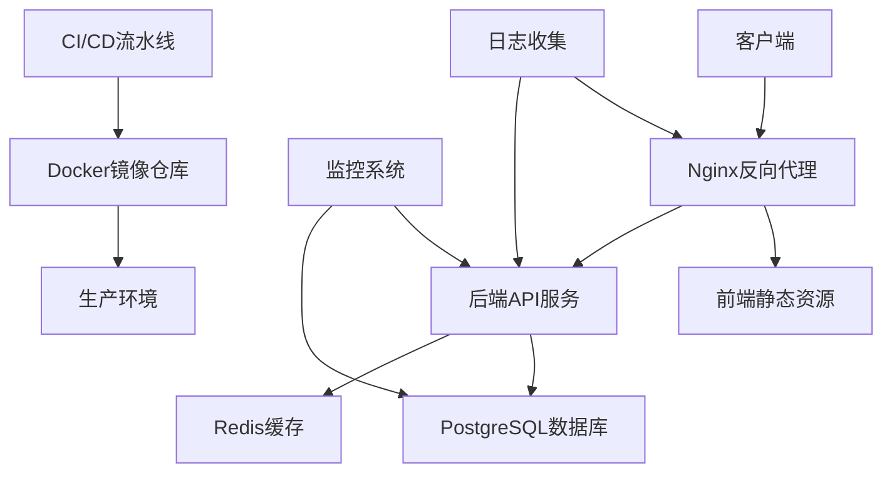

# 部署架构

<cite>
**本文档引用的文件**
- [Dockerfile](file://k.yyup.com/Dockerfile)
- [docker-compose.yml](file://k.yyup.com/docker-compose.yml)
- [docker-compose.dev.yml](file://k.yyup.com/docker-compose.dev.yml)
- [docker-compose.simple.yml](file://k.yyup.com/docker-compose.simple.yml)
- [nginx.conf](file://k.yyup.com/docker/nginx.conf)
- [supervisord.conf](file://k.yyup.com/docker/supervisord.conf)
- [health-check.sh](file://k.yyup.com/docker/health-check.sh)
- [.env.production](file://k.yyup.com/.env.production)
- [start.sh](file://k.yyup.com/docker/start.sh)
- [package.json](file://k.yyup.com/package.json)
</cite>

## 目录
1. [项目结构](#项目结构)
2. [Docker容器化方案](#docker容器化方案)
3. [Docker Compose编排配置](#docker-compose编排配置)
4. [生产环境架构](#生产环境架构)
5. [CI/CD流程](#cicd流程)
6. [监控和日志收集方案](#监控和日志收集方案)
7. [高可用和灾备策略](#高可用和灾备策略)
8. [部署指南](#部署指南)

## 项目结构

本项目采用微服务架构，主要包含前端、后端和数据库三个核心组件。项目根目录下包含多个关键文件和目录，其中`k.yyup.com`目录是主要的应用代码目录，包含前端`client`、后端`server`以及部署相关的`docker`和`deployment-scripts`目录。



**Diagram sources**
- [k.yyup.com](file://k.yyup.com)

**Section sources**
- [k.yyup.com](file://k.yyup.com)

## Docker容器化方案

### Dockerfile构建指令

项目的Docker容器化基于`Dockerfile`文件，采用多阶段构建策略，确保生产环境的轻量化和安全性。

```dockerfile
# 使用Node.js 18作为基础镜像
FROM node:18-alpine

# 设置工作目录
WORKDIR /app

# 安装nginx、supervisor和必要工具（Alpine Linux包名）
RUN apk add --no-cache nginx python3 py3-pip \
    && apk add --no-cache --virtual .build-deps \
        build-base \
        python3-dev \
        make \
        g++ \
    && pip3 install supervisor

# 首先复制package.json文件以利用Docker缓存
COPY client/package*.json ./client/
COPY server/package*.json ./server/

# 设置npm国内镜像源
RUN npm config set registry https://registry.npmmirror.com/

# 安装前端依赖（需要devDependencies用于vite构建）
WORKDIR /app/client
RUN npm ci --ignore-scripts

# 安装后端依赖，需要ts-node运行TypeScript
WORKDIR /app/server
RUN npm ci --ignore-scripts || npm install --ignore-scripts

# 复制源代码
WORKDIR /app
COPY client/ ./client/
COPY server/ ./server/
COPY docker/ ./docker/

# 构建前端
WORKDIR /app/client
RUN npm run build

# 构建后端 - 只需要复制TypeScript文件，无需复杂编译
WORKDIR /app/server

# 配置nginx
COPY docker/nginx.conf /etc/nginx/nginx.conf
COPY docker/default.conf /etc/nginx/http.d/default.conf

# 配置supervisor
COPY docker/supervisord.conf /etc/supervisor/conf.d/supervisord.conf

# 创建运行目录
RUN mkdir -p /run/nginx /var/log/supervisor /var/log/nginx

# 复制健康检查脚本
COPY docker/health-check.sh /usr/local/bin/health-check.sh
RUN chmod +x /usr/local/bin/health-check.sh

# 安装curl用于健康检查
RUN apk add --no-cache curl

# 创建非root用户（可选，增强安全性）
RUN addgroup -g 1001 -S nodejs && \
    adduser -S app -u 1001

# 设置文件权限
RUN chown -R app:nodejs /app /var/log/supervisor /var/log/nginx /run/nginx

# 暴露端口
EXPOSE 80

# 健康检查
HEALTHCHECK --interval=30s --timeout=10s --start-period=60s --retries=3 \
    CMD /usr/local/bin/health-check.sh

# 设置工作目录为项目根目录
WORKDIR /app

# 切换到非root用户（如果不需要可以注释掉）
# USER app

# 启动supervisor管理所有服务
CMD ["/usr/bin/supervisord", "-c", "/etc/supervisor/conf.d/supervisord.conf"]
```

**Section sources**
- [Dockerfile](file://k.yyup.com/Dockerfile)

### 多阶段构建策略

项目采用了优化的多阶段构建策略，通过分步执行来最大化Docker缓存的利用率：

1. **依赖安装阶段**：首先复制`package.json`文件并安装依赖，利用Docker缓存机制，只有当`package.json`文件发生变化时才重新安装依赖
2. **代码复制阶段**：在依赖安装完成后，才复制完整的源代码，避免因代码修改导致依赖重新安装
3. **构建阶段**：分别构建前端和后端应用
4. **配置阶段**：复制Nginx和Supervisor配置文件
5. **安全加固阶段**：创建非root用户，设置适当的文件权限

这种策略显著减少了构建时间，特别是在开发迭代过程中，只有代码变更时才需要重新构建，而依赖安装可以充分利用缓存。

## Docker Compose编排配置

### 服务依赖配置

项目提供了多个Docker Compose配置文件，以适应不同的环境需求：

- `docker-compose.yml`：生产环境配置
- `docker-compose.dev.yml`：开发环境配置
- `docker-compose.simple.yml`：简化开发环境配置

```yaml
version: '3.8'

services:
  # 数据库服务
  db:
    image: postgres:13-alpine
    environment:
      POSTGRES_PASSWORD: postgres
      POSTGRES_USER: postgres
      POSTGRES_DB: kindergarten
    ports:
      - "5432:5432"
    volumes:
      - db-data:/var/lib/postgresql/data
    healthcheck:
      test: ["CMD", "pg_isready", "-U", "postgres"]
      interval: 5s
      timeout: 5s
      retries: 5

  # 统一开发环境
  dev:
    build:
      context: .
      dockerfile: Dockerfile.dev
    ports:
      - "3001:3001"  # 后端端口
      - "5173:5173"  # 前端开发端口
    depends_on:
      db:
        condition: service_healthy
    environment:
      NODE_ENV: development
      DB_HOST: db
      DB_USER: postgres
      DB_PASSWORD: postgres
      DB_NAME: kindergarten
      JWT_SECRET: test-secret-key
      VITE_API_URL: http://localhost:3001/api
      # 避免代理问题
      NO_PROXY: localhost,127.0.0.1,db,0.0.0.0
    volumes:
      # 挂载整个项目目录
      - .:/workspace
      # 排除node_modules以避免权限问题
      - /workspace/node_modules
      - /workspace/server/node_modules
      - /workspace/client/node_modules
    working_dir: /workspace
    # 保持容器运行
    stdin_open: true
    tty: true

volumes:
  db-data:
```

**Section sources**
- [docker-compose.yml](file://k.yyup.com/docker-compose.yml)
- [docker-compose.dev.yml](file://k.yyup.com/docker-compose.dev.yml)
- [docker-compose.simple.yml](file://k.yyup.com/docker-compose.simple.yml)

### 网络设置

Docker Compose配置中定义了服务间的网络通信：

1. **端口映射**：
   - 前端开发端口：5173
   - 后端API端口：3001
   - 数据库端口：5432
   - 生产环境HTTP端口：80

2. **服务发现**：通过Docker内部DNS，服务间通过服务名称进行通信，如后端服务通过`db`主机名访问数据库

3. **健康检查依赖**：使用`condition: service_healthy`确保数据库服务完全启动并健康后，才启动应用服务

### 卷挂载配置

卷挂载配置支持开发环境的实时代码同步和数据持久化：

1. **开发环境卷挂载**：
   - 项目源码：`./:/workspace` - 实现代码修改的实时同步
   - 排除`node_modules`：避免容器内外node_modules权限冲突

2. **生产环境数据持久化**：
   - 数据库数据：`db-data:/var/lib/postgresql/data` - 确保数据库数据在容器重启后不丢失
   - 日志文件：挂载到宿主机，便于日志收集和分析

## 生产环境架构

### 架构概览

生产环境采用容器化部署，通过Docker和Docker Compose管理服务，架构包含以下核心组件：



**Diagram sources**
- [Dockerfile](file://k.yyup.com/Dockerfile)
- [docker-compose.yml](file://k.yyup.com/docker-compose.yml)
- [nginx.conf](file://k.yyup.com/docker/nginx.conf)

### 服务组件

1. **Nginx反向代理**：
   - 静态资源服务
   - API请求代理
   - HTTPS终止
   - 负载均衡（在多实例部署时）

2. **前端应用**：
   - 基于Vue3的单页应用
   - 通过Vite构建
   - 静态资源由Nginx直接服务

3. **后端API服务**：
   - 基于Node.js和Express
   - TypeScript编写
   - 通过ts-node运行

4. **数据库**：
   - PostgreSQL作为主数据库
   - 支持多租户架构

### 配置管理

生产环境配置通过环境变量和配置文件进行管理：

```env
# 生产环境配置
VITE_API_BASE_URL=https://k.yyup.cc
VITE_WS_URL=wss://k.yyup.cc
VITE_APP_URL=https://k.yyup.cc
```

**Section sources**
- [.env.production](file://k.yyup.com/.env.production)
- [Dockerfile](file://k.yyup.com/Dockerfile)
- [nginx.conf](file://k.yyup.com/docker/nginx.conf)

## CI/CD流程

### 流水线设计

CI/CD流程从代码提交开始，经过自动化测试，最终部署到生产环境：


**Diagram sources**
- [package.json](file://k.yyup.com/package.json)
- [Dockerfile](file://k.yyup.com/Dockerfile)

### 构建脚本

项目通过`package.json`中的脚本定义了完整的构建流程：

```json
{
  "scripts": {
    "build": "npm run build:backend && npm run build:frontend",
    "build:backend": "cd server && npm run build",
    "build:frontend": "cd client && npm run build:prod",
    "test": "node scripts/integrated-test-runner.cjs",
    "ci": "npm run install:all && npm run validate && npm run build",
    "ci:test": "npm run install:all && npm run test:all",
    "ci:full": "npm run install:all && npm run validate && npm run test:all && npm run build"
  }
}
```

**Section sources**
- [package.json](file://k.yyup.com/package.json)

### 部署流程

1. **代码提交**：开发者提交代码到Git仓库
2. **CI触发**：GitHub Actions或类似CI工具自动触发构建
3. **代码检查**：执行lint、typecheck等静态分析
4. **测试执行**：运行单元测试、集成测试和端到端测试
5. **镜像构建**：构建Docker镜像并推送到私有镜像仓库
6. **预发布部署**：部署到预发布环境进行最终验证
7. **生产部署**：通过审批后部署到生产环境

## 监控和日志收集方案

### 错误追踪

系统实现了多层次的错误追踪机制：

1. **前端错误监控**：
   - 全局错误捕获
   - Promise拒绝捕获
   - Vue错误处理

2. **后端错误监控**：
   - Express错误处理中间件
   - 异步错误捕获
   - 数据库操作错误处理

3. **健康检查**：
   ```bash
   #!/bin/sh
   
   # 健康检查脚本
   echo "正在进行健康检查..."
   
   # 检查nginx是否运行
   if ! pgrep nginx > /dev/null; then
       echo "❌ Nginx未运行"
       exit 1
   fi
   
   # 检查后端服务是否响应
   if ! curl -f http://localhost:3000/api/health > /dev/null 2>&1; then
       echo "❌ 后端服务无响应"
       exit 1
   fi
   
   # 检查前端是否可访问
   if ! curl -f http://localhost:80 > /dev/null 2>&1; then
       echo "❌ 前端服务无响应"
       exit 1
   fi
   
   echo "✅ 所有服务运行正常"
   exit 0
   ```

**Section sources**
- [health-check.sh](file://k.yyup.com/docker/health-check.sh)
- [supervisord.conf](file://k.yyup.com/docker/supervisord.conf)

### 性能监控

1. **Nginx监控**：
   - 访问日志和错误日志
   - 请求响应时间
   - 并发连接数

2. **应用性能监控**：
   - API响应时间
   - 数据库查询性能
   - 内存使用情况

3. **基础设施监控**：
   - CPU使用率
   - 内存使用率
   - 磁盘I/O

### 日志聚合

日志收集和聚合方案：

1. **日志位置**：
   - Nginx访问日志：`/var/log/nginx/access.log`
   - Nginx错误日志：`/var/log/nginx/error.log`
   - 应用日志：`/var/log/supervisor/*.log`

2. **日志格式**：
   ```nginx
   log_format main '$remote_addr - $remote_user [$time_local] "$request" '
                   '$status $body_bytes_sent "$http_referer" '
                   '"$http_user_agent" "$http_x_forwarded_for"';
   ```

3. **日志轮转**：通过Supervisor和Nginx内置机制实现日志轮转

## 高可用和灾备策略

### 负载均衡

虽然当前Docker Compose配置为单实例部署，但架构支持水平扩展：

1. **Nginx负载均衡**：可通过配置Nginx作为负载均衡器，分发请求到多个应用实例
2. **会话管理**：使用Redis存储会话，支持无状态扩展
3. **健康检查**：自动剔除不健康的实例

### 自动伸缩

自动伸缩策略基于监控指标：

1. **CPU使用率**：当CPU持续高于80%时，自动增加实例
2. **内存使用率**：当内存使用超过阈值时，触发伸缩
3. **请求延迟**：当平均响应时间超过阈值时，增加实例

### 数据备份

数据备份和恢复策略：

1. **数据库备份**：
   - 定时备份：每天凌晨执行完整备份
   - 事务日志备份：每小时执行一次
   - 备份存储：异地存储，保留30天

2. **备份验证**：
   - 定期恢复测试
   - 备份完整性检查
   - 备份可用性验证

3. **灾难恢复**：
   - 多区域部署
   - 数据库主从复制
   - 快速恢复流程

## 部署指南

### 环境准备

1. **系统要求**：
   - 操作系统：Linux（推荐Ubuntu 20.04+）
   - Docker版本：20.10+
   - Docker Compose版本：2.0+

2. **依赖安装**：
   ```bash
   # 安装Docker
   curl -fsSL https://get.docker.com -o get-docker.sh
   sudo sh get-docker.sh
   
   # 安装Docker Compose
   sudo curl -L "https://github.com/docker/compose/releases/download/v2.20.0/docker-compose-$(uname -s)-$(uname -m)" -o /usr/local/bin/docker-compose
   sudo chmod +x /usr/local/bin/docker-compose
   ```

### 部署步骤

1. **克隆代码仓库**：
   ```bash
   git clone https://github.com/yyupcompany/k.yyup.com.git
   cd k.yyup.com
   ```

2. **配置环境变量**：
   ```bash
   cp .env.production .env
   # 编辑.env文件，配置生产环境参数
   ```

3. **构建和启动服务**：
   ```bash
   # 构建镜像
   docker-compose build
   
   # 启动服务
   docker-compose up -d
   ```

4. **验证部署**：
   ```bash
   # 检查容器状态
   docker-compose ps
   
   # 查看日志
   docker-compose logs
   
   # 运行健康检查
   docker-compose exec kindergarten-project /usr/local/bin/health-check.sh
   ```

### 健康检查

系统提供了自动化的健康检查机制：

1. **Docker健康检查**：
   - 每30秒执行一次
   - 超时时间为10秒
   - 启动等待期为60秒
   - 重试3次

2. **健康检查内容**：
   - Nginx进程是否运行
   - 后端API服务是否响应
   - 前端页面是否可访问

3. **手动健康检查**：
   ```bash
   # 进入容器执行健康检查
   docker exec kindergarten-project /usr/local/bin/health-check.sh
   ```

### 运维操作

1. **服务重启**：
   ```bash
   docker-compose restart
   ```

2. **日志查看**：
   ```bash
   docker-compose logs -f
   ```

3. **备份数据库**：
   ```bash
   docker-compose exec db pg_dump -U postgres kindergarten > backup.sql
   ```

4. **恢复数据库**：
   ```bash
   cat backup.sql | docker-compose exec -T db psql -U postgres kindergarten
   ```

**Section sources**
- [Dockerfile](file://k.yyup.com/Dockerfile)
- [docker-compose.yml](file://k.yyup.com/docker-compose.yml)
- [health-check.sh](file://k.yyup.com/docker/health-check.sh)
- [start.sh](file://k.yyup.com/docker/start.sh)
- [supervisord.conf](file://k.yyup.com/docker/supervisord.conf)