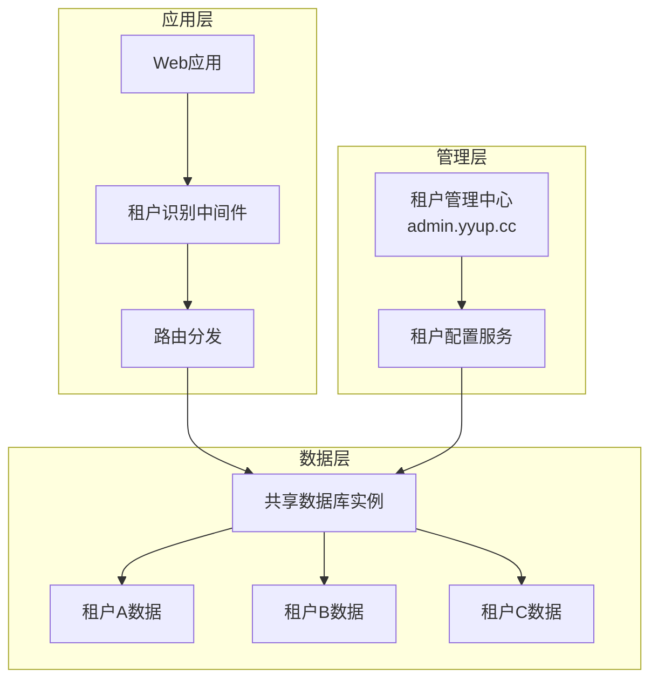
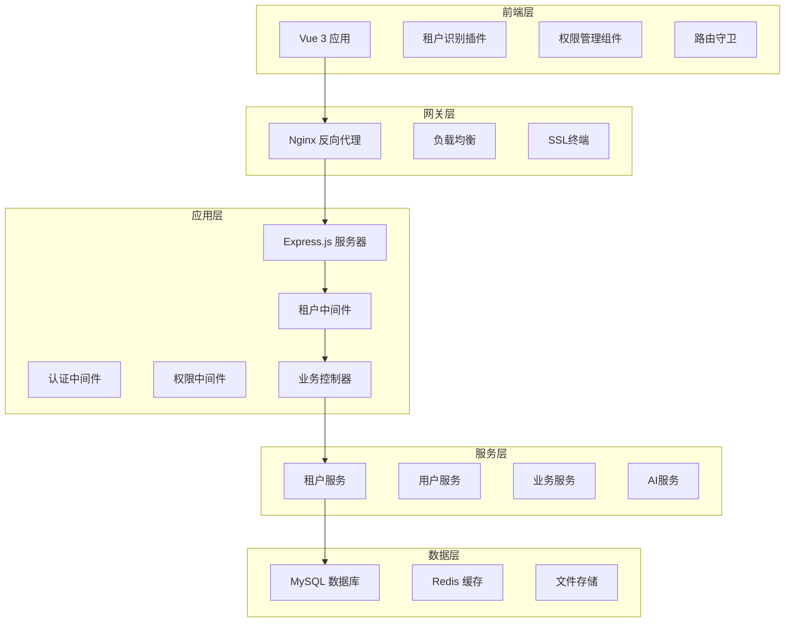
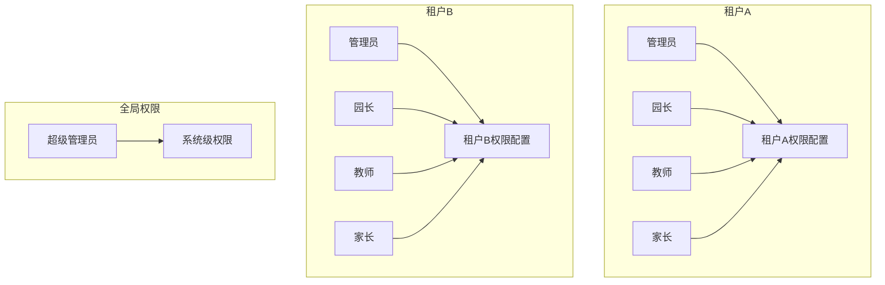

# 多租户架构设计

## 概述

幼儿园统一租户管理系统采用先进的多租户架构设计，支持多个幼儿园在同一个系统中独立运营，实现数据隔离、权限分离和个性化配置。

## 架构模式

### 租户隔离策略

系统采用**共享数据库、独立数据模式**的多租户架构：



### 核心设计原则

1. **数据隔离**：通过tenant_id字段实现行级数据隔离
2. **配置分离**：每个租户拥有独立的业务配置
3. **权限隔离**：基于租户的权限管理体系
4. **扩展性**：支持水平扩展和租户数量增长
5. **安全性**：租户间数据完全隔离，防止数据泄露

## 技术架构

### 整体架构图



### 租户识别机制

#### 域名识别策略

```typescript
// 租户代码提取逻辑
interface TenantExtraction {
  // 生产环境：从子域名提取
  extractFromDomain(domain: string): string;

  // 开发环境：从环境变量获取
  extractFromEnv(): string;

  // API模式：从请求头获取
  extractFromHeader(headers: any): string;
}

class TenantResolver {
  extractTenantCode(req: Request): string {
    // 1. 生产环境：k001.yyup.cc -> k001
    const domain = req.hostname;
    const subdomain = domain.split('.')[0];

    // 2. 开发环境：使用默认配置
    if (process.env.NODE_ENV === 'development') {
      return process.env.DEFAULT_TENANT_CODE || 'k001';
    }

    // 3. API调用：从Header获取
    const headerTenant = req.headers['x-tenant-code'];
    if (headerTenant) {
      return headerTenant;
    }

    return subdomain;
  }
}
```

#### 数据库连接机制

```typescript
// 数据库配置管理
class DatabaseManager {
  private connections: Map<string, Sequelize> = new Map();

  async getTenantConnection(tenantCode: string): Promise<Sequelize> {
    // 1. 检查现有连接
    if (this.connections.has(tenantCode)) {
      return this.connections.get(tenantCode)!;
    }

    // 2. 获取租户配置
    const tenantConfig = await this.getTenantConfig(tenantCode);

    // 3. 创建数据库连接
    const connection = await this.createConnection(tenantConfig);

    // 4. 缓存连接
    this.connections.set(tenantCode, connection);

    return connection;
  }

  private async getTenantConfig(tenantCode: string): Promise<TenantConfig> {
    // 调用admin.yyup.cc获取租户配置
    const response = await axios.get(`${ADMIN_API}/tenants/${tenantCode}`);
    return response.data.databaseConfig;
  }
}
```

## 数据隔离设计

### 数据库设计模式

#### 1. 共享表结构设计

```sql
-- 租户基础表
CREATE TABLE tenants (
    id INT PRIMARY KEY AUTO_INCREMENT,
    tenant_code VARCHAR(50) UNIQUE NOT NULL,
    name VARCHAR(200) NOT NULL,
    domain VARCHAR(200),
    database_config JSON,
    status ENUM('active', 'suspended', 'deleted') DEFAULT 'active',
    created_at TIMESTAMP DEFAULT CURRENT_TIMESTAMP,
    updated_at TIMESTAMP DEFAULT CURRENT_TIMESTAMP ON UPDATE CURRENT_TIMESTAMP
);

-- 业务数据表（以用户表为例）
CREATE TABLE users (
    id INT PRIMARY KEY AUTO_INCREMENT,
    tenant_id INT NOT NULL,
    username VARCHAR(100) NOT NULL,
    email VARCHAR(200),
    password_hash VARCHAR(255),
    real_name VARCHAR(100),
    status ENUM('active', 'inactive') DEFAULT 'active',
    created_at TIMESTAMP DEFAULT CURRENT_TIMESTAMP,
    updated_at TIMESTAMP DEFAULT CURRENT_TIMESTAMP ON UPDATE CURRENT_TIMESTAMP,

    FOREIGN KEY (tenant_id) REFERENCES tenants(id),
    UNIQUE KEY unique_tenant_username (tenant_id, username),
    INDEX idx_tenant_id (tenant_id)
);
```

#### 2. 数据隔离中间件

```typescript
class TenantIsolationMiddleware {
  async use(req: Request, res: Response, next: NextFunction) {
    try {
      // 1. 提取租户代码
      const tenantCode = this.tenantResolver.extractTenantCode(req);

      // 2. 获取租户信息
      const tenant = await this.tenantService.getByCode(tenantCode);
      if (!tenant || tenant.status !== 'active') {
        return res.status(404).json({
          success: false,
          error: { code: 'TENANT_NOT_FOUND', message: '租户不存在' }
        });
      }

      // 3. 设置租户上下文
      req.tenant = tenant;
      req.tenantId = tenant.id;

      // 4. 设置数据库查询作用域
      this.setDataQueryScope(req);

      next();
    } catch (error) {
      next(error);
    }
  }

  private setDataQueryScope(req: Request) {
    // 为所有查询添加租户过滤条件
    const originalQuery = req.db.query;
    req.db.query = (sql: string, options?: any) => {
      // 自动添加 tenant_id 条件
      if (options && !sql.includes('tenant_id')) {
        options.where = {
          ...options.where,
          tenant_id: req.tenantId
        };
      }
      return originalQuery.call(req.db, sql, options);
    };
  }
}
```

## 权限隔离设计

### 多租户权限模型



### 权限数据结构

```sql
-- 角色定义表（租户隔离）
CREATE TABLE roles (
    id INT PRIMARY KEY AUTO_INCREMENT,
    tenant_id INT NOT NULL,
    code VARCHAR(100) NOT NULL,
    name VARCHAR(200) NOT NULL,
    description TEXT,
    is_system BOOLEAN DEFAULT FALSE,
    created_at TIMESTAMP DEFAULT CURRENT_TIMESTAMP,

    FOREIGN KEY (tenant_id) REFERENCES tenants(id),
    UNIQUE KEY unique_tenant_role (tenant_id, code)
);

-- 权限定义表（全局共享）
CREATE TABLE permissions (
    id INT PRIMARY KEY AUTO_INCREMENT,
    module VARCHAR(100) NOT NULL,
    resource VARCHAR(100) NOT NULL,
    action VARCHAR(100) NOT NULL,
    description TEXT,
    created_at TIMESTAMP DEFAULT CURRENT_TIMESTAMP,

    UNIQUE KEY unique_permission (module, resource, action)
);

-- 角色权限关联表（租户隔离）
CREATE TABLE role_permissions (
    id INT PRIMARY KEY AUTO_INCREMENT,
    tenant_id INT NOT NULL,
    role_id INT NOT NULL,
    permission_id INT NOT NULL,
    created_at TIMESTAMP DEFAULT CURRENT_TIMESTAMP,

    FOREIGN KEY (tenant_id) REFERENCES tenants(id),
    FOREIGN KEY (role_id) REFERENCES roles(id),
    FOREIGN KEY (permission_id) REFERENCES permissions(id),
    UNIQUE KEY unique_role_permission (role_id, permission_id)
);
```

## 配置隔离设计

### 租户配置管理

```typescript
interface TenantConfiguration {
  // 基础配置
  basic: {
    name: string;
    logo: string;
    theme: string;
    language: string;
  };

  // 业务配置
  business: {
    enrollmentEnabled: boolean;
    classCapacity: number;
    teachingSchedule: object;
    gradingSystem: object;
  };

  // 系统配置
  system: {
    features: string[];
    integrations: object;
    customSettings: object;
  };

  // 数据库配置
  database: {
    host: string;
    port: number;
    database: string;
    username: string;
    password: string;
  };
}

class TenantConfigurationService {
  async getConfiguration(tenantId: number): Promise<TenantConfiguration> {
    // 1. 获取基础配置
    const basic = await this.getBasicConfig(tenantId);

    // 2. 获取业务配置
    const business = await this.getBusinessConfig(tenantId);

    // 3. 获取系统配置
    const system = await this.getSystemConfig(tenantId);

    // 4. 获取数据库配置
    const database = await this.getDatabaseConfig(tenantId);

    return { basic, business, system, database };
  }
}
```

## 性能优化

### 连接池管理

```typescript
class TenantConnectionPool {
  private pools: Map<string, Sequelize> = new Map();
  private readonly maxConnections = 10;
  private readonly minConnections = 2;

  async getConnection(tenantCode: string): Promise<Sequelize> {
    let connection = this.pools.get(tenantCode);

    if (!connection) {
      const config = await this.getTenantConfig(tenantCode);
      connection = new Sequelize({
        ...config,
        pool: {
          max: this.maxConnections,
          min: this.minConnections,
          acquire: 30000,
          idle: 10000
        }
      });

      this.pools.set(tenantCode, connection);
    }

    return connection;
  }
}
```

### 缓存策略

```typescript
class TenantCacheManager {
  private redis: Redis;

  async getTenantConfig(tenantCode: string): Promise<TenantConfig | null> {
    const cacheKey = `tenant:config:${tenantCode}`;
    const cached = await this.redis.get(cacheKey);

    if (cached) {
      return JSON.parse(cached);
    }

    const config = await this.fetchTenantConfig(tenantCode);
    await this.redis.setex(cacheKey, 3600, JSON.stringify(config));

    return config;
  }

  async invalidateTenantCache(tenantCode: string): Promise<void> {
    const pattern = `tenant:*:${tenantCode}`;
    const keys = await this.redis.keys(pattern);

    if (keys.length > 0) {
      await this.redis.del(...keys);
    }
  }
}
```

## 安全设计

### 租户数据隔离检查

```typescript
class TenantSecurityMiddleware {
  async use(req: Request, res: Response, next: NextFunction) {
    // 1. 验证租户权限
    if (!this.validateTenantAccess(req)) {
      return res.status(403).json({
        success: false,
        error: { code: 'TENANT_ACCESS_DENIED', message: '租户访问被拒绝' }
      });
    }

    // 2. SQL注入防护
    this.preventSQLInjection(req);

    // 3. 数据泄露防护
    this.preventDataLeakage(req);

    next();
  }

  private validateTenantAccess(req: Request): boolean {
    // 检查用户是否有权限访问当前租户
    const userTenantId = req.user?.tenantId;
    const requestTenantId = req.tenantId;

    return userTenantId === requestTenantId || req.user?.isSuperAdmin;
  }
}
```

## 监控与日志

### 租户监控

```typescript
class TenantMonitoring {
  async collectTenantMetrics(tenantCode: string): Promise<TenantMetrics> {
    return {
      activeUsers: await this.getActiveUserCount(tenantCode),
      apiRequests: await this.getApiRequestCount(tenantCode),
      storageUsage: await this.getStorageUsage(tenantCode),
      errorRate: await this.getErrorRate(tenantCode),
      responseTime: await this.getAverageResponseTime(tenantCode)
    };
  }

  async logTenantActivity(tenantCode: string, activity: ActivityLog) {
    const logEntry = {
      tenantCode,
      timestamp: new Date(),
      activity: activity.type,
      details: activity.details,
      userId: activity.userId
    };

    await this.logger.log(logEntry);
  }
}
```

## 总结

多租户架构设计为幼儿园管理系统提供了：

1. **数据隔离**：确保租户间数据安全
2. **配置灵活**：支持个性化业务配置
3. **权限分离**：细粒度的权限控制
4. **性能优化**：高效的资源利用
5. **扩展性强**：支持租户数量增长
6. **运维友好**：统一的管理和监控

通过这种架构设计，系统能够为多个幼儿园提供独立、安全、高效的管理服务。