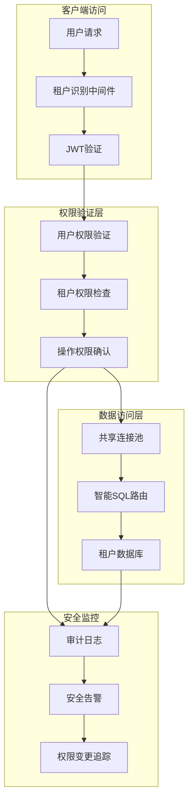
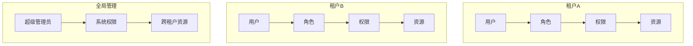

# 幼儿园租户系统权限与安全管理

## 📋 概述

基于**共享连接池架构**的幼儿园统一租户系统权限与安全模块，提供企业级的多租户权限控制、数据安全隔离和审计追踪功能。系统采用RBAC（Role-Based Access Control）模型与智能租户识别相结合，确保在共享数据库架构下的完整安全保障。

### 🎯 核心安全特性

- **租户级隔离**: 基于数据库级别的完全数据隔离
- **智能权限验证**: 结合租户识别的统一权限控制
- **安全数据访问**: 通过共享连接池的安全SQL路由
- **完整审计追踪**: 租户级别的操作审计和安全日志
- **高性能安全**: 优化的权限缓存和查询策略

### 🛡️ 安全架构



### 🔐 多重安全机制

1. **域名级租户识别**: 确保请求来自合法租户
2. **JWT令牌验证**: 用户身份认证和会话管理
3. **RBAC权限控制**: 细粒度的功能权限管理
4. **数据隔离机制**: 数据库级别的租户隔离
5. **操作审计追踪**: 完整的安全操作记录
6. **实时安全监控**: 异常行为检测和告警

## 权限模型设计

### RBAC 模型架构



### 三级权限层次

#### 权限层次结构

```
1. 一级权限（模块级）- 9个主要功能模块
   ├── 招生管理
   ├── 教学管理
   ├── 人员管理
   ├── 财务管理
   ├── 活动管理
   ├── 营销管理
   ├── 系统管理
   ├── 报表分析
   └── AI智能服务

2. 二级权限（页面级）- 74个功能页面
   ├── 招生计划管理
   ├── 招生申请处理
   ├── 学生信息管理
   ├── 教师信息管理
   ├── 班级信息管理
   ├── 财务收费管理
   ├── 活动计划管理
   ├── 家长信息管理
   └── ...其他页面

3. 三级权限（组件级）- 2个细粒度组件
   ├── 数据导出组件
   └── 批量操作组件
```

## 🔐 租户识别与权限验证

### 1. 共享连接池架构下的安全中间件

#### 租户识别 + 权限验证中间件

```typescript
// middleware/tenant-resolver-shared-pool.ts
export const tenantResolverSharedPoolMiddleware = async (
  req: RequestWithTenant,
  res: Response,
  next: NextFunction
): Promise<void> => {
  try {
    // 1. 获取请求域名
    const domain = req.get('Host') || req.hostname;

    // 2. 提取租户代码
    const tenantCode = extractTenantCode(domain);
    if (!tenantCode) {
      logger.warn('[安全警告] 无法识别的租户域名', {
        domain,
        ip: req.ip,
        userAgent: req.get('User-Agent')
      });
      return ApiResponse.error(res, '无法识别的租户域名', 'INVALID_TENANT_DOMAIN');
    }

    // 3. 验证租户合法性
    const tenantInfo = await validateTenant(tenantCode);
    if (!tenantInfo) {
      logger.warn('[安全警告] 租户不存在或未激活', {
        tenantCode,
        domain,
        ip: req.ip
      });
      ApiResponse.error(res, '租户不存在或未激活', 'TENANT_NOT_FOUND');
      return;
    }

    // 4. 设置租户上下文
    req.tenant = {
      code: tenantCode,
      domain: domain,
      databaseName: `tenant_${tenantCode}`
    };

    // 5. 获取共享数据库连接
    req.tenantDb = tenantDatabaseSharedPoolService.getGlobalConnection();

    // 6. 记录租户访问日志
    logger.info('[租户访问]', {
      tenantCode,
      domain,
      ip: req.ip,
      path: req.path,
      method: req.method,
      timestamp: new Date()
    });

    next();
  } catch (error) {
    logger.error('[安全错误] 租户识别失败', {
      error: error.message,
      domain: req.get('Host'),
      ip: req.ip
    });
    ApiResponse.error(res, '租户识别失败', 'TENANT_RESOLVER_ERROR');
  }
};
```

### 2. 权限验证中间件

```typescript
// middleware/permission-shared-pool.ts
export const permissionMiddlewareSharedPool = (requiredPermissions: string[]) => {
  return async (req: RequestWithTenant, res: Response, next: NextFunction): Promise<void> => {
    try {
      // 1. 检查租户识别是否完成
      if (!req.tenant || !req.tenantDb) {
        return ApiResponse.error(res, '租户识别未完成', 'TENANT_NOT_RESOLVED');
      }

      // 2. 提取JWT令牌
      const token = extractToken(req);
      if (!token) {
        return ApiResponse.error(res, '缺少认证令牌', 'TOKEN_MISSING');
      }

      // 3. 验证JWT令牌并检查租户匹配
      const payload = verifyJWT(token);
      if (payload.tenantCode !== req.tenant.code) {
        logger.warn('[安全警告] 令牌租户不匹配', {
          tokenTenant: payload.tenantCode,
          requestTenant: req.tenant.code,
          ip: req.ip
        });
        return ApiResponse.error(res, '令牌租户不匹配', 'TENANT_MISMATCH');
      }

      // 4. 检查用户权限（在租户数据库中）
      const hasPermissions = await checkUserPermissionsInTenant(
        req.tenant.code,
        payload.userId,
        requiredPermissions
      );

      if (!hasPermissions) {
        logger.warn('[权限拒绝] 用户权限不足', {
          tenantCode: req.tenant.code,
          userId: payload.userId,
          requiredPermissions,
          path: req.path,
          method: req.method,
          ip: req.ip
        });
        return ApiResponse.error(res, '权限不足', 'PERMISSION_DENIED');
      }

      // 5. 设置用户信息到请求对象
      req.user = {
        id: payload.userId,
        tenantCode: payload.tenantCode,
        roles: payload.roles,
        permissions: payload.permissions
      };

      // 6. 记录权限验证日志
      logger.debug('[权限验证成功]', {
        tenantCode: req.tenant.code,
        userId: payload.userId,
        permissions: requiredPermissions,
        path: req.path
      });

      next();
    } catch (error) {
      handlePermissionError(error, res, req);
    }
  };
};
```

### 3. 租户级权限检查实现

```typescript
// service/permission-checker.service.ts
export class PermissionCheckerService {
  /**
   * 在租户数据库中检查用户权限
   */
  async checkUserPermissionsInTenant(
    tenantCode: string,
    userId: number,
    requiredPermissions: string[]
  ): Promise<boolean> {
    try {
      const databaseName = `tenant_${tenantCode}`;

      // 查询用户权限SQL（自动添加租户数据库名前缀）
      const sql = `
        SELECT COUNT(*) as permission_count
        FROM user_roles ur
        JOIN roles r ON ur.role_id = r.id
        JOIN role_permissions rp ON r.id = rp.role_id
        JOIN permissions p ON rp.permission_id = p.id
        WHERE ur.user_id = :userId
          AND ur.status = 'active'
          AND p.code IN (:permissions)
      `;

      const result = await tenantDatabaseSharedPoolService.queryTenantDatabase(
        tenantCode, sql, {
          replacements: {
            userId,
            permissions: requiredPermissions
          }
        }
      );

      return result[0].permission_count > 0;
    } catch (error) {
      logger.error('[权限检查错误]', {
        tenantCode,
        userId,
        requiredPermissions,
        error: error.message
      });
      return false;
    }
  }

  /**
   * 批量检查多个权限
   */
  async checkMultiplePermissions(
    tenantCode: string,
    userId: number,
    permissionMap: Record<string, string[]>
  ): Promise<Record<string, boolean>> {
    const results: Record<string, boolean> = {};

    for (const [resource, permissions] of Object.entries(permissionMap)) {
      results[resource] = await this.checkUserPermissionsInTenant(
        tenantCode, userId, permissions
      );
    }

    return results;
  }
}
```

### 4. 安全事件监控

```typescript
// service/security-monitor.service.ts
export class SecurityMonitorService {
  /**
   * 记录安全事件
   */
  async logSecurityEvent(
    event: 'tenant_recognition' | 'permission_check' | 'data_access',
    data: {
      tenantCode: string;
      userId?: number;
      ip: string;
      userAgent?: string;
      path?: string;
      method?: string;
      success: boolean;
      reason?: string;
    }
  ) {
    try {
      // 在租户数据库中记录安全日志
      const sql = `
        INSERT INTO security_logs (
          event_type, tenant_code, user_id, ip_address,
          user_agent, path, method, success, reason, created_at
        ) VALUES (
          :eventType, :tenantCode, :userId, :ipAddress,
          :userAgent, :path, :method, :success, :reason, NOW()
        )
      `;

      await tenantDatabaseSharedPoolService.queryTenantDatabase(
        data.tenantCode, sql, {
          replacements: {
            eventType: event,
            tenantCode: data.tenantCode,
            userId: data.userId,
            ipAddress: data.ip,
            userAgent: data.userAgent,
            path: data.path,
            method: data.method,
            success: data.success ? 1 : 0,
            reason: data.reason
          }
        }
      );

      // 检查是否需要触发安全告警
      await this.checkSecurityAlerts(event, data);
    } catch (error) {
      logger.error('[安全日志记录失败]', error);
    }
  }

  /**
   * 检查安全告警条件
   */
  private async checkSecurityAlerts(event: string, data: any) {
    // 检测异常访问模式
    const alerts = [];

    // 1. 检测同IP大量失败访问
    if (!data.success) {
      const failureCount = await this.getRecentFailureCount(data.ip, 300); // 5分钟内
      if (failureCount > 10) {
        alerts.push({
          type: 'multiple_failures',
          severity: 'high',
          message: `检测到IP ${data.ip} 在5分钟内连续失败 ${failureCount} 次`,
          data
        });
      }
    }

    // 2. 检测异常租户访问
    const suspiciousTenant = await this.checkSuspiciousTenantAccess(data.tenantCode);
    if (suspiciousTenant) {
      alerts.push({
        type: 'suspicious_tenant_access',
        severity: 'medium',
        message: `租户 ${data.tenantCode} 出现异常访问模式`,
        data
      });
    }

    // 发送告警
    for (const alert of alerts) {
      await this.sendSecurityAlert(alert);
    }
  }
}
```

### 5. 数据访问安全

```typescript
// service/secure-data-access.service.ts
export class SecureDataAccessService {
  /**
   * 安全的数据查询（自动应用租户隔离和权限过滤）
   */
  async secureQuery(
    tenantCode: string,
    userId: number,
    tableName: string,
    queryOptions: any = {}
  ) {
    // 1. 验证表名安全性
    if (!this.isValidTableName(tableName)) {
      throw new Error('无效的表名');
    }

    // 2. 自动添加租户隔离条件
    let whereClause = queryOptions.where || {};

    // 3. 根据用户权限添加额外过滤条件
    const userPermissions = await this.getUserPermissions(tenantCode, userId);
    whereClause = this.applyPermissionFilters(tableName, whereClause, userPermissions);

    // 4. 构建安全的SQL查询
    const sql = this.buildSecureSQL(tableName, {
      ...queryOptions,
      where: whereClause
    });

    // 5. 执行查询并记录访问日志
    const result = await tenantDatabaseSharedPoolService.queryTenantDatabase(
      tenantCode, sql
    );

    await this.logDataAccess(tenantCode, userId, tableName, 'read', result.length);

    return result;
  }

  /**
   * 应用权限过滤条件
   */
  private applyPermissionFilters(
    tableName: string,
    whereClause: any,
    permissions: string[]
  ): any {
    // 根据用户权限级别应用不同的数据过滤
    if (this.hasPermission(permissions, `${tableName}.manage`)) {
      // 管理权限：无额外限制
      return whereClause;
    } else if (this.hasPermission(permissions, `${tableName}.read`)) {
      // 只读权限：只能查看自己的数据
      if (['users', 'students', 'teachers'].includes(tableName)) {
        return {
          ...whereClause,
          created_by: userId // 只能查看自己创建的数据
        };
      }
    }

    return whereClause;
  }

  /**
   * 记录数据访问日志
   */
  private async logDataAccess(
    tenantCode: string,
    userId: number,
    tableName: string,
    operation: string,
    recordCount: number
  ) {
    const sql = `
      INSERT INTO data_access_logs (
        tenant_code, user_id, table_name, operation,
        record_count, access_time
      ) VALUES (?, ?, ?, ?, ?, NOW())
    `;

    await tenantDatabaseSharedPoolService.queryTenantDatabase(
      tenantCode, sql, {
        replacements: [tenantCode, userId, tableName, operation, recordCount]
      }
    );
  }
}
```

## 数据模型

基于共享连接池架构，每个租户拥有独立的数据库，包含完整的安全相关表结构。

### 租户数据库安全表结构

#### 1. 用户表 (users)

```sql
CREATE TABLE users (
    id INT PRIMARY KEY AUTO_INCREMENT,
    tenant_id INT NOT NULL COMMENT '租户ID',
    username VARCHAR(100) NOT NULL COMMENT '用户名',
    email VARCHAR(200) COMMENT '邮箱',
    phone VARCHAR(20) COMMENT '手机号',
    password_hash VARCHAR(255) NOT NULL COMMENT '密码哈希',
    real_name VARCHAR(100) COMMENT '真实姓名',

    -- 状态信息
    status ENUM('active', 'inactive', 'locked') DEFAULT 'active',
    last_login_at TIMESTAMP NULL COMMENT '最后登录时间',
    last_login_ip VARCHAR(45) COMMENT '最后登录IP',

    -- 安全信息
    email_verified BOOLEAN DEFAULT FALSE,
    phone_verified BOOLEAN DEFAULT FALSE,
    two_factor_enabled BOOLEAN DEFAULT FALSE,
    password_updated_at TIMESTAMP DEFAULT CURRENT_TIMESTAMP,

    created_at TIMESTAMP DEFAULT CURRENT_TIMESTAMP,
    updated_at TIMESTAMP DEFAULT CURRENT_TIMESTAMP ON UPDATE CURRENT_TIMESTAMP,

    FOREIGN KEY (tenant_id) REFERENCES tenants(id) ON DELETE CASCADE,
    UNIQUE KEY unique_tenant_username (tenant_id, username),
    INDEX idx_tenant_id (tenant_id),
    INDEX idx_status (status),
    INDEX idx_phone (phone)
);
```

### 角色表 (roles)

```sql
CREATE TABLE roles (
    id INT PRIMARY KEY AUTO_INCREMENT,
    tenant_id INT NOT NULL COMMENT '租户ID',
    code VARCHAR(100) NOT NULL COMMENT '角色代码',
    name VARCHAR(200) NOT NULL COMMENT '角色名称',
    description TEXT COMMENT '角色描述',

    -- 类型标识
    is_system BOOLEAN DEFAULT FALSE COMMENT '是否系统角色',
    is_default BOOLEAN DEFAULT FALSE COMMENT '是否默认角色',
    level INT DEFAULT 1 COMMENT '角色等级',

    -- 统计信息
    permission_count INT DEFAULT 0 COMMENT '权限数量',
    user_count INT DEFAULT 0 COMMENT '用户数量',

    created_at TIMESTAMP DEFAULT CURRENT_TIMESTAMP,
    updated_at TIMESTAMP DEFAULT CURRENT_TIMESTAMP ON UPDATE CURRENT_TIMESTAMP,

    FOREIGN KEY (tenant_id) REFERENCES tenants(id) ON DELETE CASCADE,
    UNIQUE KEY unique_tenant_role (tenant_id, code),
    INDEX idx_tenant_id (tenant_id),
    INDEX idx_is_system (is_system)
);
```

### 权限表 (permissions)

```sql
CREATE TABLE permissions (
    id INT PRIMARY KEY AUTO_INCREMENT,
    module VARCHAR(100) NOT NULL COMMENT '模块名称',
    resource VARCHAR(100) NOT NULL COMMENT '资源名称',
    action VARCHAR(100) NOT NULL COMMENT '操作名称',
    name VARCHAR(200) NOT NULL COMMENT '权限名称',
    description TEXT COMMENT '权限描述',

    -- 层级信息
    level TINYINT DEFAULT 1 COMMENT '权限级别：1-模块，2-页面，3-组件',
    parent_id INT COMMENT '父权限ID',
    sort_order INT DEFAULT 0 COMMENT '排序顺序',

    -- 类型标识
    is_system BOOLEAN DEFAULT TRUE COMMENT '是否系统权限',
    is_menu BOOLEAN DEFAULT FALSE COMMENT '是否菜单权限',

    created_at TIMESTAMP DEFAULT CURRENT_TIMESTAMP,

    FOREIGN KEY (parent_id) REFERENCES permissions(id),
    UNIQUE KEY unique_permission (module, resource, action),
    INDEX idx_module (module),
    INDEX idx_level (level),
    INDEX idx_parent_id (parent_id)
);
```

### 用户角色关联表 (user_roles)

```sql
CREATE TABLE user_roles (
    id INT PRIMARY KEY AUTO_INCREMENT,
    tenant_id INT NOT NULL COMMENT '租户ID',
    user_id INT NOT NULL COMMENT '用户ID',
    role_id INT NOT NULL COMMENT '角色ID',
    assigned_by INT COMMENT '分配者ID',
    assigned_at TIMESTAMP DEFAULT CURRENT_TIMESTAMP COMMENT '分配时间',
    expires_at TIMESTAMP NULL COMMENT '过期时间',

    status ENUM('active', 'expired', 'revoked') DEFAULT 'active',

    FOREIGN KEY (tenant_id) REFERENCES tenants(id) ON DELETE CASCADE,
    FOREIGN KEY (user_id) REFERENCES users(id) ON DELETE CASCADE,
    FOREIGN KEY (role_id) REFERENCES roles(id) ON DELETE CASCADE,
    UNIQUE KEY unique_user_role (user_id, role_id),
    INDEX idx_tenant_id (tenant_id),
    INDEX idx_user_id (user_id),
    INDEX idx_role_id (role_id)
);
```

### 角色权限关联表 (role_permissions)

```sql
CREATE TABLE role_permissions (
    id INT PRIMARY KEY AUTO_INCREMENT,
    tenant_id INT NOT NULL COMMENT '租户ID',
    role_id INT NOT NULL COMMENT '角色ID',
    permission_id INT NOT NULL COMMENT '权限ID',

    -- 权限条件（可选）
    conditions JSON COMMENT '权限条件限制',
    created_at TIMESTAMP DEFAULT CURRENT_TIMESTAMP,

    FOREIGN KEY (tenant_id) REFERENCES tenants(id) ON DELETE CASCADE,
    FOREIGN KEY (role_id) REFERENCES roles(id) ON DELETE CASCADE,
    FOREIGN KEY (permission_id) REFERENCES permissions(id) ON DELETE CASCADE,
    UNIQUE KEY unique_role_permission (role_id, permission_id),
    INDEX idx_tenant_id (tenant_id),
    INDEX idx_role_id (role_id),
    INDEX idx_permission_id (permission_id)
);
```

## 系统角色定义

### 默认角色配置

#### 1. 超级管理员 (super_admin)

```javascript
const superAdminRole = {
  code: 'super_admin',
  name: '超级管理员',
  description: '系统超级管理员，拥有所有权限',
  level: 0,
  isSystem: true,
  permissions: [
    // 系统管理
    'system.admin',
    'system.config',
    'system.monitor',

    // 租户管理
    'tenant.create',
    'tenant.update',
    'tenant.delete',
    'tenant.manage',

    // 用户管理
    'user.create',
    'user.update',
    'user.delete',
    'user.manage',

    // 所有模块的完全权限
    '*.*'
  ]
};
```

#### 2. 管理员 (admin)

```javascript
const adminRole = {
  code: 'admin',
  name: '管理员',
  description: '租户管理员，管理租户内所有业务',
  level: 1,
  isSystem: true,
  permissions: [
    // 用户管理
    'user.create',
    'user.update',
    'user.read',
    'user.delete',

    // 角色权限管理
    'role.create',
    'role.update',
    'role.read',
    'role.delete',
    'permission.assign',

    // 业务管理
    'enrollment.manage',
    'student.manage',
    'teacher.manage',
    'class.manage',
    'finance.manage',
    'activity.manage',

    // 报表分析
    'report.read',
    'analytics.read'
  ]
};
```

#### 3. 园长 (principal)

```javascript
const principalRole = {
  code: 'principal',
  name: '园长',
  description: '幼儿园园长，管理幼儿园日常运营',
  level: 2,
  isSystem: true,
  permissions: [
    // 招生管理
    'enrollment.plan.create',
    'enrollment.plan.update',
    'enrollment.plan.read',
    'enrollment.application.approve',

    // 教学管理
    'class.create',
    'class.update',
    'class.read',
    'student.create',
    'student.update',
    'student.read',
    'teacher.assign',

    // 财务管理
    'finance.tuition.read',
    'finance.report.read',
    'finance.approve',

    // 活动管理
    'activity.create',
    'activity.update',
    'activity.read',
    'activity.approve',

    // 报表分析
    'report.read',
    'dashboard.read'
  ]
};
```

#### 4. 教师 (teacher)

```javascript
const teacherRole = {
  code: 'teacher',
  name: '教师',
  description: '班级教师，管理班级和学生',
  level: 3,
  isSystem: true,
  permissions: [
    // 班级管理
    'class.read',
    'class.students.read',

    // 学生管理
    'student.read',
    'student.attendance.update',
    'student.performance.update',
    'student.notes.create',

    // 教学管理
    'teaching.schedule.read',
    'teaching.material.create',
    'teaching.material.update',

    // 活动管理
    'activity.read',
    'activity.registration.create',
    'activity.checkin.create',

    // 家长沟通
    'parent.contact.create',
    'parent.message.create',
    'notification.create'
  ]
};
```

#### 5. 家长 (parent)

```javascript
const parentRole = {
  code: 'parent',
  name: '家长',
  description: '学生家长，查看孩子相关信息',
  level: 4,
  isSystem: true,
  permissions: [
    // 学生信息查看
    'student.info.read',
    'student.attendance.read',
    'student.performance.read',
    'student.schedule.read',

    // 班级信息
    'class.info.read',
    'class.activities.read',
    'class.notices.read',

    // 活动参与
    'activity.read',
    'activity.registration.create',
    'activity.payment.create',

    // 财务查看
    'finance.fees.read',
    'finance.payment.read',

    // 沟通功能
    'message.create',
    'message.read',
    'notification.read'
  ]
};
```

## 权限控制机制

### 1. 前端权限控制

#### 路由权限守卫

```typescript
// router/permission.ts
import { Router } from 'vue-router';
import { useUserStore } from '@/stores/user';

export function setupPermissionGuard(router: Router) {
  router.beforeEach(async (to, from, next) => {
    const userStore = useUserStore();

    // 检查是否已登录
    if (!userStore.isAuthenticated && to.path !== '/login') {
      return next('/login');
    }

    // 检查页面权限
    if (to.meta.requiresAuth) {
      const hasPermission = await userStore.hasPermission(to.meta.permission as string);

      if (!hasPermission) {
        return next('/403');
      }
    }

    next();
  });
}
```

#### 动态路由生成

```typescript
// router/dynamic-routes.ts
export async function generateDynamicRoutes() {
  const userStore = useUserStore();
  const permissions = await userStore.getUserPermissions();

  // 生成路由树
  const routeTree = buildRouteTree(permissions);

  // 注册动态路由
  routeTree.forEach(route => {
    router.addRoute('Layout', route);
  });

  return routeTree;
}

function buildRouteTree(permissions: Permission[]) {
  const routeMap = new Map();

  // 构建路由映射
  permissions.forEach(permission => {
    const route = {
      path: permission.route,
      name: permission.name,
      component: () => import(`@/views/${permission.component}.vue`),
      meta: {
        title: permission.title,
        icon: permission.icon,
        permission: permission.code,
        requiresAuth: true
      }
    };

    routeMap.set(permission.code, route);
  });

  return Array.from(routeMap.values());
}
```

#### 按钮级权限控制

```vue
<!-- 权限指令示例 -->
<template>
  <div>
    <!-- 使用 v-permission 指令 -->
    <el-button v-permission="'user.create'" type="primary">
      创建用户
    </el-button>

    <!-- 使用权限判断 -->
    <el-button
      v-if="hasPermission('user.update')"
      type="warning"
    >
      编辑用户
    </el-button>

    <!-- 权限组合判断 -->
    <el-button
      v-if="hasAnyPermission(['user.delete', 'user.batch_delete'])"
      type="danger"
    >
      删除用户
    </el-button>
  </div>
</template>

<script setup lang="ts">
import { useUserStore } from '@/stores/user';

const userStore = useUserStore();

// 权限检查函数
const hasPermission = (permission: string) => {
  return userStore.hasPermission(permission);
};

const hasAnyPermission = (permissions: string[]) => {
  return userStore.hasAnyPermission(permissions);
};
</script>
```

### 2. 后端权限控制

#### 权限中间件

```typescript
// middleware/permission.ts
import { Request, Response, NextFunction } from 'express';
import { UserService } from '../services/user.service';

export class PermissionMiddleware {
  static checkPermission(permission: string) {
    return async (req: Request, res: Response, next: NextFunction) => {
      try {
        const userId = req.user?.id;
        const tenantId = req.tenantId;

        if (!userId || !tenantId) {
          return res.status(401).json({
            success: false,
            error: { code: 'UNAUTHORIZED', message: '未授权访问' }
          });
        }

        const userService = new UserService();
        const hasPermission = await userService.checkPermission(
          userId,
          tenantId,
          permission
        );

        if (!hasPermission) {
          return res.status(403).json({
            success: false,
            error: {
              code: 'PERMISSION_DENIED',
              message: '权限不足',
              details: { required: permission }
            }
          });
        }

        next();
      } catch (error) {
        next(error);
      }
    };
  }

  static checkAnyPermission(permissions: string[]) {
    return async (req: Request, res: Response, next: NextFunction) => {
      try {
        const userId = req.user?.id;
        const tenantId = req.tenantId;

        const userService = new UserService();
        const hasAnyPermission = await userService.checkAnyPermission(
          userId,
          tenantId,
          permissions
        );

        if (!hasAnyPermission) {
          return res.status(403).json({
            success: false,
            error: {
              code: 'PERMISSION_DENIED',
              message: '权限不足',
              details: { required: permissions.join(' or ') }
            }
          });
        }

        next();
      } catch (error) {
        next(error);
      }
    };
  }
}
```

#### 数据访问权限控制

```typescript
// service/user.service.ts
export class UserService {
  async findUsers(tenantId: number, userId: number, query: any) {
    // 检查用户是否有查看用户列表的权限
    const canReadUsers = await this.checkPermission(userId, tenantId, 'user.read');
    if (!canReadUsers) {
      throw new Error('权限不足');
    }

    // 自动添加租户过滤条件
    const whereClause = {
      tenant_id: tenantId,
      ...query.where
    };

    // 应用数据访问权限过滤
    if (query.role) {
      const canManageRole = await this.checkPermission(userId, tenantId, `role.manage.${query.role}`);
      if (!canManageRole) {
        delete whereClause.role_id;
      }
    }

    return await User.findAll({
      where: whereClause,
      ...query.options
    });
  }

  async checkPermission(userId: number, tenantId: number, permission: string): Promise<boolean> {
    // 1. 检查用户是否为超级管理员
    const user = await User.findOne({
      where: { id: userId, tenant_id: tenantId },
      include: [{
        model: Role,
        include: [{
          model: Permission,
          where: { code: permission }
        }]
      }]
    });

    if (!user) return false;

    // 2. 检查是否有超级管理员角色
    const hasSuperAdmin = user.roles.some(role => role.code === 'super_admin');
    if (hasSuperAdmin) return true;

    // 3. 检查具体权限
    return user.roles.some(role =>
      role.permissions.some(p => p.code === permission)
    );
  }
}
```

## 权限管理API

### 1. 用户权限查询

#### 获取用户权限列表

```http
GET /api/permissions/user-permissions
Authorization: Bearer {token}
```

**响应示例**：
```json
{
  "success": true,
  "data": {
    "userId": 123,
    "permissions": [
      {
        "id": 1,
        "module": "enrollment",
        "resource": "plan",
        "action": "create",
        "code": "enrollment.plan.create",
        "name": "创建招生计划",
        "level": 2,
        "isMenu": true
      },
      {
        "id": 2,
        "module": "student",
        "resource": "info",
        "action": "read",
        "code": "student.info.read",
        "name": "查看学生信息",
        "level": 2,
        "isMenu": true
      }
    ],
    "roles": [
      {
        "id": 1,
        "code": "teacher",
        "name": "教师",
        "level": 3
      }
    ]
  }
}
```

#### 获取动态路由

```http
GET /api/permissions/dynamic-routes
Authorization: Bearer {token}
```

**响应示例**：
```json
{
  "success": true,
  "data": {
    "routes": [
      {
        "path": "/dashboard",
        "name": "Dashboard",
        "component": "dashboard/index",
        "meta": {
          "title": "仪表板",
          "icon": "Dashboard",
          "permission": "dashboard.read"
        },
        "children": []
      },
      {
        "path": "/students",
        "name": "Students",
        "component": "students/index",
        "meta": {
          "title": "学生管理",
          "icon": "User",
          "permission": "student.manage"
        },
        "children": [
          {
            "path": "/students/list",
            "name": "StudentList",
            "component": "students/list",
            "meta": {
              "title": "学生列表",
              "permission": "student.list.read"
            }
          }
        ]
      }
    ]
  }
}
```

#### 权限检查

```http
POST /api/permissions/check-permission
Authorization: Bearer {token}
Content-Type: application/json

{
  "permission": "student.create"
}
```

**响应示例**：
```json
{
  "success": true,
  "data": {
    "hasPermission": true,
    "permission": "student.create",
    "checkedAt": "2024-11-29T10:30:00.000Z"
  }
}
```

### 2. 角色管理API

#### 创建角色

```http
POST /api/roles
Authorization: Bearer {token}
Content-Type: application/json

{
  "code": "custom_role",
  "name": "自定义角色",
  "description": "自定义角色描述",
  "level": 3,
  "permissions": [
    "student.read",
    "student.update",
    "class.read"
  ]
}
```

#### 分配角色权限

```http
PUT /api/roles/{roleId}/permissions
Authorization: Bearer {token}
Content-Type: application/json

{
  "permissions": [
    {
      "permissionId": 1,
      "conditions": {
        "own_class_only": true
      }
    }
  ]
}
```

#### 用户角色分配

```http
POST /api/users/{userId}/roles
Authorization: Bearer {token}
Content-Type: application/json

{
  "roleIds": [1, 2],
  "expiresAt": "2024-12-31T23:59:59.000Z"
}
```

## 权限缓存策略

### 1. Redis 权限缓存

```typescript
// service/permission-cache.service.ts
export class PermissionCacheService {
  private redis: Redis;
  private readonly CACHE_TTL = 3600; // 1小时

  async getUserPermissions(userId: number, tenantId: number): Promise<string[]> {
    const cacheKey = `user:${userId}:${tenantId}:permissions`;
    const cached = await this.redis.get(cacheKey);

    if (cached) {
      return JSON.parse(cached);
    }

    // 从数据库查询权限
    const permissions = await this.queryUserPermissions(userId, tenantId);

    // 缓存权限列表
    await this.redis.setex(
      cacheKey,
      this.CACHE_TTL,
      JSON.stringify(permissions)
    );

    return permissions;
  }

  async invalidateUserCache(userId: number, tenantId: number): Promise<void> {
    const cacheKey = `user:${userId}:${tenantId}:permissions`;
    await this.redis.del(cacheKey);
  }

  async invalidateTenantCache(tenantId: number): Promise<void> {
    const pattern = `user:*:${tenantId}:permissions`;
    const keys = await this.redis.keys(pattern);

    if (keys.length > 0) {
      await this.redis.del(...keys);
    }
  }
}
```

### 2. 内存权限缓存

```typescript
// service/permission-memory-cache.ts
export class PermissionMemoryCache {
  private cache = new Map<string, { permissions: string[], timestamp: number }>();
  private readonly CACHE_TTL = 300000; // 5分钟

  get(userId: number, tenantId: number): string[] | null {
    const key = `${userId}:${tenantId}`;
    const cached = this.cache.get(key);

    if (!cached) return null;

    // 检查是否过期
    if (Date.now() - cached.timestamp > this.CACHE_TTL) {
      this.cache.delete(key);
      return null;
    }

    return cached.permissions;
  }

  set(userId: number, tenantId: number, permissions: string[]): void {
    const key = `${userId}:${tenantId}`;
    this.cache.set(key, {
      permissions,
      timestamp: Date.now()
    });
  }

  invalidate(userId: number, tenantId: number): void {
    const key = `${userId}:${tenantId}`;
    this.cache.delete(key);
  }

  clear(): void {
    this.cache.clear();
  }
}
```

## 安全最佳实践

### 1. 密码安全

```typescript
// utils/password.ts
import bcrypt from 'bcryptjs';
import crypto from 'crypto';

export class PasswordUtils {
  private static readonly SALT_ROUNDS = 12;
  private static readonly MIN_LENGTH = 8;

  static async hash(password: string): Promise<string> {
    // 密码强度检查
    this.validatePassword(password);

    return bcrypt.hash(password, this.SALT_ROUNDS);
  }

  static async verify(password: string, hash: string): Promise<boolean> {
    return bcrypt.compare(password, hash);
  }

  static generateResetToken(): string {
    return crypto.randomBytes(32).toString('hex');
  }

  private static validatePassword(password: string): void {
    if (password.length < this.MIN_LENGTH) {
      throw new Error(`密码长度至少${this.MIN_LENGTH}位`);
    }

    if (!/(?=.*[a-z])(?=.*[A-Z])(?=.*\d)/.test(password)) {
      throw new Error('密码必须包含大小写字母和数字');
    }
  }
}
```

### 2. 会话管理

```typescript
// middleware/auth.ts
export class AuthMiddleware {
  static async authenticate(req: Request, res: Response, next: NextFunction) {
    try {
      const token = this.extractToken(req);

      if (!token) {
        return res.status(401).json({
          success: false,
          error: { code: 'TOKEN_MISSING', message: '缺少认证令牌' }
        });
      }

      // 验证 JWT 令牌
      const payload = JwtUtils.verify(token);

      // 检查会话是否有效
      const session = await SessionService.validateSession(payload.sessionId);
      if (!session || session.status !== 'active') {
        return res.status(401).json({
          success: false,
          error: { code: 'SESSION_EXPIRED', message: '会话已过期' }
        });
      }

      // 检查用户状态
      const user = await User.findById(payload.userId);
      if (!user || user.status !== 'active') {
        return res.status(401).json({
          success: false,
          error: { code: 'USER_INACTIVE', message: '用户已被禁用' }
        });
      }

      // 设置请求上下文
      req.user = {
        id: payload.userId,
        tenantId: payload.tenantId,
        sessionId: payload.sessionId
      };

      // 更新会话活跃时间
      await SessionService.updateLastActive(payload.sessionId);

      next();
    } catch (error) {
      if (error.name === 'JsonWebTokenError') {
        return res.status(401).json({
          success: false,
          error: { code: 'TOKEN_INVALID', message: '无效的认证令牌' }
        });
      }

      next(error);
    }
  }

  private static extractToken(req: Request): string | null {
    const authHeader = req.headers.authorization;

    if (authHeader && authHeader.startsWith('Bearer ')) {
      return authHeader.substring(7);
    }

    return null;
  }
}
```

### 3. 审计日志

```typescript
// service/audit-log.service.ts
export class AuditLogService {
  async logPermissionCheck(
    userId: number,
    tenantId: number,
    permission: string,
    result: boolean,
    context: any
  ) {
    await AuditLog.create({
      tenant_id: tenantId,
      user_id: userId,
      action: 'permission_check',
      resource: permission,
      result: result ? 'success' : 'denied',
      ip_address: context.ip,
      user_agent: context.userAgent,
      details: {
        permission,
        result,
        path: context.path,
        method: context.method
      }
    });
  }

  async logRoleAssignment(
    userId: number,
    tenantId: number,
    targetUserId: number,
    roleId: number,
    action: 'assign' | 'revoke'
  ) {
    await AuditLog.create({
      tenant_id: tenantId,
      user_id: userId,
      action: 'role_assignment',
      resource: 'user_role',
      result: 'success',
      details: {
        targetUserId,
        roleId,
        action
      }
    });
  }
}
```

## 性能优化

### 1. 权限查询优化

```typescript
// service/permission.service.ts
export class PermissionService {
  // 使用 JOIN 查询优化
  async getUserPermissionsOptimized(userId: number, tenantId: number) {
    return await Permission.findAll({
      attributes: ['code', 'name', 'level'],
      include: [{
        model: Role,
        include: [{
          model: User,
          where: { id: userId, tenant_id: tenantId },
          attributes: []
        }]
      }],
      where: {
        '$roles.users.id$': userId,
        '$roles.users.tenant_id$': tenantId
      },
      raw: true
    });
  }

  // 批量权限检查
  async checkMultiplePermissions(
    userId: number,
    tenantId: number,
    permissions: string[]
  ): Promise<Map<string, boolean>> {
    const userPermissions = await this.getUserPermissions(userId, tenantId);
    const permissionSet = new Set(userPermissions.map(p => p.code));

    const result = new Map<string, boolean>();
    permissions.forEach(permission => {
      result.set(permission, permissionSet.has(permission));
    });

    return result;
  }
}
```

### 2. 数据库索引优化

```sql
-- 用户角色关联表索引
CREATE INDEX idx_user_roles_user_status ON user_roles(user_id, status);
CREATE INDEX idx_user_roles_role_status ON user_roles(role_id, status);

-- 角色权限关联表索引
CREATE INDEX idx_role_permissions_role ON role_permissions(role_id);
CREATE INDEX idx_role_permissions_permission ON role_permissions(permission_id);

-- 权限表索引
CREATE INDEX idx_permissions_module_level ON permissions(module, level);
CREATE INDEX idx_permissions_parent ON permissions(parent_id);
```

## 测试策略

### 1. 权限单元测试

```typescript
// tests/permission.test.ts
describe('PermissionService', () => {
  let permissionService: PermissionService;
  let testUser: User;
  let testTenant: Tenant;

  beforeEach(async () => {
    permissionService = new PermissionService();
    testTenant = await Tenant.create({ code: 'test', name: 'Test Tenant' });
    testUser = await User.create({
      tenant_id: testTenant.id,
      username: 'testuser',
      password_hash: 'hashedpassword'
    });
  });

  it('should check user permission correctly', async () => {
    // 创建角色和权限
    const role = await Role.create({
      tenant_id: testTenant.id,
      code: 'teacher',
      name: '教师'
    });

    const permission = await Permission.create({
      module: 'student',
      resource: 'info',
      action: 'read',
      name: '查看学生信息'
    });

    // 分配角色和权限
    await UserRole.create({
      tenant_id: testTenant.id,
      user_id: testUser.id,
      role_id: role.id
    });

    await RolePermission.create({
      tenant_id: testTenant.id,
      role_id: role.id,
      permission_id: permission.id
    });

    // 测试权限检查
    const hasPermission = await permissionService.checkPermission(
      testUser.id,
      testTenant.id,
      'student.info.read'
    );

    expect(hasPermission).toBe(true);
  });
});
```

### 2. 权限集成测试

```typescript
// tests/permission-integration.test.ts
describe('Permission Integration', () => {
  it('should protect API endpoints without permission', async () => {
    const response = await request(app)
      .post('/api/students')
      .set('Authorization', `Bearer ${userToken}`)
      .send(studentData)
      .expect(403);

    expect(response.body.error.code).toBe('PERMISSION_DENIED');
  });

  it('should allow access with correct permission', async () => {
    // 分予权限
    await UserRole.create({
      tenant_id: tenant.id,
      user_id: user.id,
      role_id: teacherRole.id
    });

    const response = await request(app)
      .get('/api/students')
      .set('Authorization', `Bearer ${userToken}`)
      .expect(200);

    expect(response.body.success).toBe(true);
  });
});
```

## 总结

用户权限管理系统提供了完整的多租户权限控制方案：

1. **RBAC模型**：基于角色的访问控制，支持三级权限层次
2. **多租户隔离**：租户级别的权限隔离和数据安全
3. **动态权限**：支持运行时权限分配和回收
4. **性能优化**：多层缓存策略，提高权限检查效率
5. **安全机制**：密码安全、会话管理、审计日志
6. **扩展性**：支持自定义角色和权限条件

通过这套权限管理系统，确保了幼儿园管理系统的安全性、可控性和可扩展性。