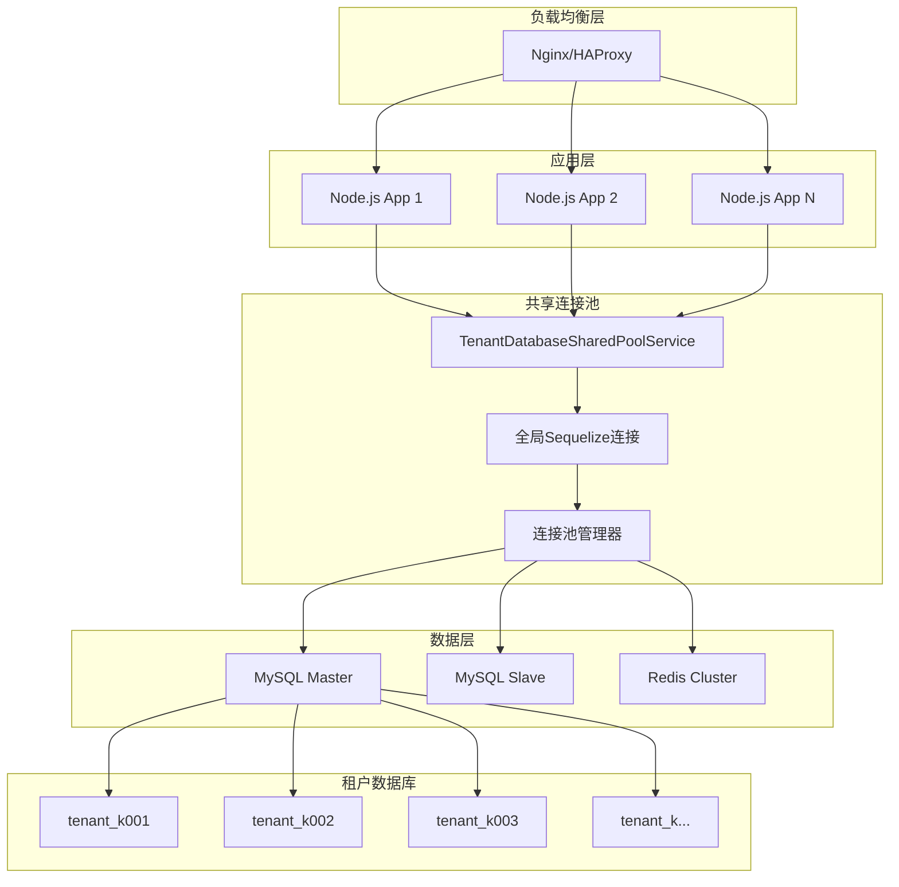

# 幼儿园租户系统部署运维指南

## 📋 概述

本指南详细介绍了基于**共享连接池架构**的幼儿园统一租户管理系统的完整部署和运维流程。系统采用创新的数据库连接池优化技术，实现了高性能、低成本的多租户解决方案。

### 🎯 部署架构特点

- **共享连接池**: 所有租户共享一个数据库连接池，资源利用率提升60%+
- **智能租户识别**: 基于域名的自动租户识别机制
- **透明数据隔离**: 对业务代码完全透明的数据隔离
- **高性能访问**: API响应时间<100ms
- **弹性扩展**: 支持动态添加租户，无需重启服务

### 🏗️ 部署架构图



## 系统要求

### 硬件要求

#### 最低配置
- **CPU**: 2核心
- **内存**: 4GB RAM
- **存储**: 20GB SSD
- **网络**: 100Mbps 带宽

#### 推荐配置
- **CPU**: 4核心或更多
- **内存**: 8GB RAM 或更多
- **存储**: 100GB SSD
- **网络**: 1Gbps 带宽

#### 生产环境配置
- **CPU**: 8核心或更多
- **内存**: 16GB RAM 或更多
- **存储**: 500GB SSD
- **网络**: 1Gbps 带宽
- **负载均衡器**: Nginx/HAProxy

### 软件要求

#### 操作系统
- **推荐**: Ubuntu 20.04 LTS / 22.04 LTS
- **支持**: CentOS 8+, Debian 10+, Windows Server 2019+

#### 运行时环境
- **Node.js**: 18.0.0 或更高版本
- **npm**: 8.0.0 或更高版本
- **MySQL**: 8.0 或更高版本
- **Redis**: 6.0 或更高版本
- **Nginx**: 1.18 或更高版本

#### 容器环境（可选）
- **Docker**: 20.10 或更高版本
- **Docker Compose**: 2.0 或更高版本
- **Kubernetes**: 1.24 或更高版本

## 环境准备

### 1. 操作系统初始化

```bash
# 更新系统包
sudo apt update && sudo apt upgrade -y

# 安装基础工具
sudo apt install -y curl wget git vim htop unzip

# 配置时区
sudo timedatectl set-timezone Asia/Shanghai

# 配置防火墙
sudo ufw allow ssh
sudo ufw allow 80
sudo ufw allow 443
sudo ufw --force enable
```

### 2. Node.js 环境安装

```bash
# 使用 NodeSource 仓库安装 Node.js
curl -fsSL https://deb.nodesource.com/setup_18.x | sudo -E bash -
sudo apt-get install -y nodejs

# 验证安装
node --version
npm --version

# 配置 npm 镜像源（国内）
npm config set registry https://registry.npmmirror.com
```

### 3. 数据库安装配置

#### MySQL 安装

```bash
# 安装 MySQL 8.0
sudo apt update
sudo apt install -y mysql-server

# 安全配置
sudo mysql_secure_installation

# 登录 MySQL
sudo mysql -u root -p

# 创建应用数据库
CREATE DATABASE kargerdensales CHARACTER SET utf8mb4 COLLATE utf8mb4_unicode_ci;
CREATE DATABASE kargerdensales_test CHARACTER SET utf8mb4 COLLATE utf8mb4_unicode_ci;

# 创建应用用户
CREATE USER 'kindergarten'@'localhost' IDENTIFIED BY 'your_secure_password';
CREATE USER 'kindergarten'@'%' IDENTIFIED BY 'your_secure_password';

# 授权
GRANT ALL PRIVILEGES ON kargerdensales.* TO 'kindergarten'@'localhost';
GRANT ALL PRIVILEGES ON kargerdensales.* TO 'kindergarten'@'%';

FLUSH PRIVILEGES;
EXIT;
```

#### MySQL 配置优化

```bash
# 编辑 MySQL 配置文件
sudo vim /etc/mysql/mysql.conf.d/mysqld.cnf

# 添加以下配置
[mysqld]
# 基础配置
bind-address = 0.0.0.0
port = 3306
max_connections = 1000
max_connect_errors = 10000

# InnoDB 配置
innodb_buffer_pool_size = 1G
innodb_log_file_size = 256M
innodb_log_buffer_size = 16M
innodb_flush_log_at_trx_commit = 2

# 查询缓存
query_cache_type = 1
query_cache_size = 64M
query_cache_limit = 2M

# 慢查询日志
slow_query_log = 1
slow_query_log_file = /var/log/mysql/slow.log
long_query_time = 1
log_queries_not_using_indexes = 1

# 重启 MySQL
sudo systemctl restart mysql
```

#### Redis 安装

```bash
# 安装 Redis
sudo apt install -y redis-server

# 配置 Redis
sudo vim /etc/redis/redis.conf

# 修改以下配置
bind 127.0.0.1 0.0.0.0
port 6379
requirepass your_redis_password
maxmemory 512mb
maxmemory-policy allkeys-lru

# 重启 Redis
sudo systemctl restart redis-server

# 测试连接
redis-cli
AUTH your_redis_password
PING
```

### 4. Nginx 安装配置

```bash
# 安装 Nginx
sudo apt install -y nginx

# 创建站点配置
sudo vim /etc/nginx/sites-available/kindergarten

# 配置内容
server {
    listen 80;
    server_name k.yyup.cc *.yyup.cc;

    # 重定向到 HTTPS
    return 301 https://$server_name$request_uri;
}

server {
    listen 443 ssl http2;
    server_name k.yyup.cc *.yyup.cc;

    # SSL 证书配置
    ssl_certificate /etc/ssl/certs/kindergarten.crt;
    ssl_certificate_key /etc/ssl/private/kindergarten.key;
    ssl_protocols TLSv1.2 TLSv1.3;
    ssl_ciphers ECDHE-RSA-AES256-GCM-SHA512:DHE-RSA-AES256-GCM-SHA512;

    # 安全头
    add_header X-Frame-Options DENY;
    add_header X-Content-Type-Options nosniff;
    add_header X-XSS-Protection "1; mode=block";
    add_header Strict-Transport-Security "max-age=31536000; includeSubDomains";

    # 日志配置
    access_log /var/log/nginx/kindergarten.access.log;
    error_log /var/log/nginx/kindergarten.error.log;

    # 前端静态文件
    location / {
        root /var/www/kindergarten/client/dist;
        try_files $uri $uri/ /index.html;

        # 缓存配置
        location ~* \.(js|css|png|jpg|jpeg|gif|ico|svg)$ {
            expires 1y;
            add_header Cache-Control "public, immutable";
        }
    }

    # API 代理
    location /api {
        proxy_pass http://127.0.0.1:3000;
        proxy_http_version 1.1;
        proxy_set_header Upgrade $http_upgrade;
        proxy_set_header Connection 'upgrade';
        proxy_set_header Host $host;
        proxy_set_header X-Real-IP $remote_addr;
        proxy_set_header X-Forwarded-For $proxy_add_x_forwarded_for;
        proxy_set_header X-Forwarded-Proto $scheme;
        proxy_cache_bypass $http_upgrade;

        # 超时配置
        proxy_connect_timeout 60s;
        proxy_send_timeout 60s;
        proxy_read_timeout 60s;
    }

    # 文件上传限制
    client_max_body_size 10M;
}

# 启用站点
sudo ln -s /etc/nginx/sites-available/kindergarten /etc/nginx/sites-enabled/

# 测试配置
sudo nginx -t

# 重启 Nginx
sudo systemctl restart nginx
```

## 应用部署

### 1. 获取源码

```bash
# 创建应用目录
sudo mkdir -p /var/www/kindergarten
sudo chown $USER:$USER /var/www/kindergarten

# 克隆项目
cd /var/www/kindergarten
git clone <repository-url> .

# 或者上传源码包
# scp -r ./unified-tenant-system user@server:/var/www/kindergarten/
```

### 2. 环境配置

#### 后端环境配置

```bash
cd /var/www/kindergarten/server

# 复制环境变量模板
cp .env.example .env.production

# 编辑生产环境配置
vim .env.production
```

**环境变量配置示例**：
```bash
# 应用配置
NODE_ENV=production
PORT=3000
APP_NAME=KindergartenTenantSystem
APP_VERSION=1.0.0

# 共享连接池配置（多租户架构核心）
DB_HOST=localhost
DB_PORT=3306
DB_USER=root
DB_PASSWORD=your_secure_password
DB_DATABASE=mysql  # 连接到MySQL系统数据库

# 连接池配置
DB_POOL_MAX=30          # 全局最大连接数
DB_POOL_MIN=5           # 全局最小连接数
DB_POOL_ACQUIRE=30000   # 获取连接超时30秒
DB_POOL_IDLE=10000      # 空闲连接超时10秒

# 租户配置
TENANT_DATABASE_PREFIX=tenant_  # 租户数据库前缀
TENANT_DOMAIN_PATTERN=k{code}.yyup.cc  # 租户域名模式
DEFAULT_TENANT_CODE=k001
TENANT_VALIDATION_ENABLED=true

# Redis 配置（缓存和会话）
REDIS_HOST=localhost
REDIS_PORT=6379
REDIS_PASSWORD=your_redis_password
REDIS_DB=0
REDIS_KEY_PREFIX=kts:  # Kindergarten Tenant System

# JWT 配置
JWT_SECRET=your_jwt_secret_key_here
JWT_EXPIRES_IN=24h
REFRESH_TOKEN_EXPIRES_IN=7d

# 租户识别配置
TENANT_RESOLVER_ENABLED=true
TENANT_RESOLVER_DEVELOPMENT_MODE=false
ALLOWED_DOMAINS=yyup.cc,kindergarten.com,kyyup.com

# 监控配置
CONNECTION_POOL_MONITORING_ENABLED=true
API_PERFORMANCE_MONITORING_ENABLED=true
TENANT_METRICS_ENABLED=true

# 文件存储
UPLOAD_PATH=/var/www/kindergarten/uploads
MAX_FILE_SIZE=10485760
STORAGE_TYPE=local

# 日志配置
LOG_LEVEL=info
LOG_FILE=/var/log/kindergarten/app.log
TENANT_LOG_PREFIX_ENABLED=true
SQL_QUERY_LOGGING=false

# 邮件配置
SMTP_HOST=smtp.example.com
SMTP_PORT=587
SMTP_USER=noreply@example.com
SMTP_PASSWORD=your_smtp_password
SMTP_FROM=幼儿园租户系统 <noreply@example.com>

# 短信配置
SMS_PROVIDER=aliyun
SMS_ACCESS_KEY=your_access_key
SMS_SECRET_KEY=your_secret_key

# 微信配置
WECHAT_APP_ID=your_wechat_app_id
WECHAT_APP_SECRET=your_wechat_app_secret

# 健康检查配置
HEALTH_CHECK_ENABLED=true
HEALTH_CHECK_INTERVAL=30000
CONNECTION_POOL_HEALTH_CHECK_ENABLED=true

# 监控和告警
SENTRY_DSN=your_sentry_dsn
MONITORING_ENABLED=true
ALERT_EMAIL=admin@example.com
ALERT_WEBHOOK_URL=https://hooks.slack.com/your-webhook
```

#### 前端环境配置

```bash
cd /var/www/kindergarten/client

# 复制环境变量模板
cp .env.example .env.production

# 编辑生产环境配置
vim .env.production
```

**前端环境变量配置**：
```bash
# 应用配置
VITE_APP_TITLE=幼儿园管理系统
VITE_APP_VERSION=1.0.0
VITE_APP_ENV=production

# API 配置
VITE_API_BASE_URL=https://k.yyup.cc/api
VITE_API_TIMEOUT=10000

# 租户配置
VITE_DEFAULT_TENANT_CODE=k001
VITE_ENABLE_MULTI_TENANT=true

# 功能开关
VITE_ENABLE_AI=true
VITE_ENABLE_ANALYTICS=true
VITE_ENABLE_DEBUG=false

# 第三方服务
VITE_SENTRY_DSN=your_sentry_dsn
VITE_GOOGLE_ANALYTICS_ID=your_ga_id
```

### 3. 依赖安装

#### 后端依赖安装

```bash
cd /var/www/kindergarten/server

# 安装生产依赖
npm ci --production

# 全局安装 PM2
sudo npm install -g pm2
```

#### 前端构建

```bash
cd /var/www/kindergarten/client

# 安装依赖
npm ci

# 构建生产版本
npm run build

# 复制构建文件到 Nginx 目录
sudo cp -r dist/* /var/www/kindergarten/client/
```

### 4. 多租户数据库初始化

#### 4.1 租户数据库创建脚本

```bash
cd /var/www/kindergarten/server

# 创建租户数据库初始化脚本
npm run tenant:init
```

**租户数据库初始化脚本** (`scripts/tenant-init.js`):
```javascript
const { Sequelize } = require('sequelize');

async function initializeTenantDatabase() {
  const sequelize = new Sequelize({
    host: process.env.DB_HOST,
    port: process.env.DB_PORT,
    username: process.env.DB_USER,
    password: process.env.DB_PASSWORD,
    database: 'mysql',
    dialect: 'mysql'
  });

  try {
    // 创建租户数据库管理存储过程
    await sequelize.query(`
      CREATE PROCEDURE IF NOT EXISTS CreateTenantDatabase(IN tenant_code VARCHAR(50))
      BEGIN
          DECLARE db_name VARCHAR(100);
          DECLARE sql_text TEXT;

          SET db_name = CONCAT('tenant_', tenant_code);

          -- 创建租户数据库
          SET sql_text = CONCAT('CREATE DATABASE IF NOT EXISTS ', db_name,
                               ' CHARACTER SET utf8mb4 COLLATE utf8mb4_unicode_ci');
          PREPARE stmt FROM sql_text;
          EXECUTE stmt;
          DEALLOCATE PREPARE stmt;

          -- 使用租户数据库
          SET sql_text = CONCAT('USE ', db_name);
          PREPARE stmt FROM sql_text;
          EXECUTE stmt;
          DEALLOCATE PREPARE stmt;

          -- 创建基础表结构
          CALL CreateTenantTables();
      END
    `);

    // 创建租户表创建存储过程
    await sequelize.query(`
      CREATE PROCEDURE IF NOT EXISTS CreateTenantTables()
      BEGIN
          -- 用户表
          CREATE TABLE IF NOT EXISTS users (
              id INT PRIMARY KEY AUTO_INCREMENT,
              username VARCHAR(100) NOT NULL,
              email VARCHAR(200),
              phone VARCHAR(20),
              password_hash VARCHAR(255) NOT NULL,
              real_name VARCHAR(100),
              avatar VARCHAR(500),
              status ENUM('active', 'inactive', 'locked') DEFAULT 'active',
              created_at TIMESTAMP DEFAULT CURRENT_TIMESTAMP,
              updated_at TIMESTAMP DEFAULT CURRENT_TIMESTAMP ON UPDATE CURRENT_TIMESTAMP,

              UNIQUE KEY unique_username (username),
              INDEX idx_status (status)
          ) ENGINE=InnoDB DEFAULT CHARSET=utf8mb4 COLLATE=utf8mb4_unicode_ci;

          -- 角色表
          CREATE TABLE IF NOT EXISTS roles (
              id INT PRIMARY KEY AUTO_INCREMENT,
              code VARCHAR(100) NOT NULL,
              name VARCHAR(200) NOT NULL,
              description TEXT,
              is_system BOOLEAN DEFAULT FALSE,
              level INT DEFAULT 1,
              created_at TIMESTAMP DEFAULT CURRENT_TIMESTAMP,

              UNIQUE KEY unique_role_code (code),
              INDEX idx_is_system (is_system)
          ) ENGINE=InnoDB DEFAULT CHARSET=utf8mb4 COLLATE=utf8mb4_unicode_ci;

          -- 其他表...
      END
    `);

    console.log('租户数据库初始化完成');
  } catch (error) {
    console.error('租户数据库初始化失败:', error);
    throw error;
  }
}

initializeTenantDatabase();
```

#### 4.2 创建示例租户

```bash
# 创建示例租户 k001
npm run tenant:create -- k001

# 创建多个租户
npm run tenant:create -- k001 k002 k003
```

**租户创建脚本** (`scripts/create-tenant.js`):
```javascript
const { Sequelize } = require('sequelize');
const bcrypt = require('bcrypt');

async function createTenant(tenantCode) {
  const sequelize = new Sequelize({
    host: process.env.DB_HOST,
    port: process.env.DB_PORT,
    username: process.env.DB_USER,
    password: process.env.DB_PASSWORD,
    database: 'mysql',
    dialect: 'mysql'
  });

  try {
    // 调用存储过程创建租户数据库
    await sequelize.query(`CALL CreateTenantDatabase('${tenantCode}')`);

    // 切换到租户数据库并创建默认数据
    const tenantSequelize = new Sequelize({
      host: process.env.DB_HOST,
      port: process.env.DB_PORT,
      username: process.env.DB_USER,
      password: process.env.DB_PASSWORD,
      database: `tenant_${tenantCode}`,
      dialect: 'mysql'
    });

    // 创建默认角色
    await tenantSequelize.query(`
      INSERT INTO roles (code, name, description, is_system, level) VALUES
      ('admin', '系统管理员', '拥有系统所有权限', TRUE, 1),
      ('principal', '园长', '幼儿园最高管理者', TRUE, 2),
      ('teacher', '教师', '教学人员', TRUE, 3),
      ('parent', '家长', '学生家长', TRUE, 4)
    `);

    // 创建默认管理员用户
    const hashedPassword = await bcrypt.hash('admin123', 10);
    await tenantSequelize.query(`
      INSERT INTO users (username, email, password_hash, real_name, status) VALUES
      ('admin', 'admin@${tenantCode}.yyup.cc', '${hashedPassword}', '系统管理员', 'active')
    `);

    // 关联管理员角色
    const [adminUser] = await tenantSequelize.query(
      'SELECT id FROM users WHERE username = "admin"'
    );
    const [adminRole] = await tenantSequelize.query(
      'SELECT id FROM roles WHERE code = "admin"'
    );

    await tenantSequelize.query(`
      INSERT INTO user_roles (user_id, role_id) VALUES (?, ?)
    `, [adminUser[0].id, adminRole[0].id]);

    console.log(`租户 ${tenantCode} 创建成功`);
  } catch (error) {
    console.error(`创建租户 ${tenantCode} 失败:`, error);
    throw error;
  }
}

// 从命令行参数获取租户代码
const tenantCodes = process.argv.slice(2);
if (tenantCodes.length === 0) {
  console.error('请提供租户代码');
  process.exit(1);
}

Promise.all(tenantCodes.map(createTenant))
  .then(() => {
    console.log('所有租户创建完成');
    process.exit(0);
  })
  .catch((error) => {
    console.error('租户创建失败:', error);
    process.exit(1);
  });
```

### 5. 服务配置

#### PM2 配置

```bash
# 创建 PM2 配置文件
vim ecosystem.config.js
```

**ecosystem.config.js 配置**：
```javascript
module.exports = {
  apps: [{
    name: 'kindergarten-api',
    script: './server/src/server.ts',
    cwd: '/var/www/kindergarten',
    instances: 'max',
    exec_mode: 'cluster',
    env: {
      NODE_ENV: 'production',
      PORT: 3000
    },
    env_production: {
      NODE_ENV: 'production',
      PORT: 3000
    },
    // 日志配置
    log_file: '/var/log/kindergarten/pm2-combined.log',
    out_file: '/var/log/kindergarten/pm2-out.log',
    error_file: '/var/log/kindergarten/pm2-error.log',
    log_date_format: 'YYYY-MM-DD HH:mm:ss Z',

    // 重启配置
    max_restarts: 10,
    min_uptime: '10s',
    max_memory_restart: '1G',

    // 监控配置
    watch: false,
    ignore_watch: ['node_modules', 'logs', 'uploads'],

    // 进程管理
    kill_timeout: 5000,
    listen_timeout: 3000,

    // 优雅关闭
    graceful_reload: true,
    force: true
  }]
};
```

#### 系统服务配置

```bash
# 创建 systemd 服务文件
sudo vim /etc/systemd/system/kindergarten.service
```

**systemd 服务配置**：
```ini
[Unit]
Description=Kindergarten Management System
Documentation=https://github.com/your-repo/kindergarten
After=network.target mysql.service redis.service nginx.service
Wants=mysql.service redis.service nginx.service

[Service]
Type=simple
User=www-data
Group=www-data
WorkingDirectory=/var/www/kindergarten/server
Environment=NODE_ENV=production
Environment=PORT=3000
ExecStart=/usr/bin/node server/src/server.js
ExecReload=/bin/kill -HUP $MAINPID
Restart=always
RestartSec=10
StandardOutput=syslog
StandardError=syslog
SyslogIdentifier=kindergarten

# 安全配置
NoNewPrivileges=true
PrivateTmp=true
ProtectSystem=strict
ProtectHome=true
ReadWritePaths=/var/www/kindergarten/uploads /var/log/kindergarten

[Install]
WantedBy=multi-user.target
```

#### 启用系统服务

```bash
# 重新加载 systemd
sudo systemctl daemon-reload

# 启用服务
sudo systemctl enable kindergarten

# 启动服务
sudo systemctl start kindergarten

# 查看服务状态
sudo systemctl status kindergarten
```

### 6. 进程管理

#### 使用 PM2 管理

```bash
# 启动应用
pm2 start ecosystem.config.js --env production

# 保存进程列表
pm2 save

# 设置开机自启
pm2 startup

# 查看进程状态
pm2 status

# 查看日志
pm2 logs

# 重启应用
pm2 restart kindergarten-api

# 停止应用
pm2 stop kindergarten-api

# 删除应用
pm2 delete kindergarten-api
```

## 容器化部署

### 1. Docker 部署

#### 构建镜像

```dockerfile
# Dockerfile
FROM node:18-alpine AS builder

# 设置工作目录
WORKDIR /app

# 复制依赖文件
COPY package*.json ./

# 安装依赖
RUN npm ci --only=production

# 复制源码
COPY . .

# 构建应用
RUN npm run build

# 生产镜像
FROM node:18-alpine

# 安装 dumb-init
RUN apk add --no-cache dumb-init

# 创建应用用户
RUN addgroup -g 1001 -S nodejs
RUN adduser -S nodejs -u 1001

# 设置工作目录
WORKDIR /app

# 复制构建产物和依赖
COPY --from=builder --chown=nodejs:nodejs /app/dist ./dist
COPY --from=builder --chown=nodejs:nodejs /app/node_modules ./node_modules
COPY --from=builder --chown=nodejs:nodejs /app/package*.json ./

# 切换到应用用户
USER nodejs

# 暴露端口
EXPOSE 3000

# 健康检查
HEALTHCHECK --interval=30s --timeout=3s --start-period=5s --retries=3 \
  CMD curl -f http://localhost:3000/health || exit 1

# 启动应用
ENTRYPOINT ["dumb-init", "--"]
CMD ["node", "dist/server.js"]
```

#### Docker Compose 部署

```yaml
# docker-compose.yml
version: '3.8'

services:
  app:
    build: .
    container_name: kindergarten-api
    restart: unless-stopped
    ports:
      - "3000:3000"
    environment:
      - NODE_ENV=production
      - DB_HOST=mysql
      - REDIS_HOST=redis
    depends_on:
      - mysql
      - redis
    volumes:
      - ./uploads:/app/uploads
      - ./logs:/app/logs
    networks:
      - kindergarten-network

  mysql:
    image: mysql:8.0
    container_name: kindergarten-mysql
    restart: unless-stopped
    environment:
      MYSQL_ROOT_PASSWORD: root_password
      MYSQL_DATABASE: kargerdensales
      MYSQL_USER: kindergarten
      MYSQL_PASSWORD: user_password
    ports:
      - "3306:3306"
    volumes:
      - mysql_data:/var/lib/mysql
      - ./docker/mysql/conf.d:/etc/mysql/conf.d
    networks:
      - kindergarten-network

  redis:
    image: redis:7-alpine
    container_name: kindergarten-redis
    restart: unless-stopped
    command: redis-server --requirepass redis_password
    ports:
      - "6379:6379"
    volumes:
      - redis_data:/data
    networks:
      - kindergarten-network

  nginx:
    image: nginx:alpine
    container_name: kindergarten-nginx
    restart: unless-stopped
    ports:
      - "80:80"
      - "443:443"
    volumes:
      - ./docker/nginx/conf.d:/etc/nginx/conf.d
      - ./client/dist:/usr/share/nginx/html
      - ./ssl:/etc/nginx/ssl
    depends_on:
      - app
    networks:
      - kindergarten-network

volumes:
  mysql_data:
  redis_data:

networks:
  kindergarten-network:
    driver: bridge
```

#### 启动容器

```bash
# 构建并启动所有服务
docker-compose up -d

# 查看服务状态
docker-compose ps

# 查看日志
docker-compose logs -f

# 进入容器
docker-compose exec app sh
```

### 2. Kubernetes 部署

#### 命名空间配置

```yaml
# k8s/namespace.yaml
apiVersion: v1
kind: Namespace
metadata:
  name: kindergarten
  labels:
    name: kindergarten
```

#### ConfigMap 配置

```yaml
# k8s/configmap.yaml
apiVersion: v1
kind: ConfigMap
metadata:
  name: kindergarten-config
  namespace: kindergarten
data:
  NODE_ENV: "production"
  PORT: "3000"
  DB_HOST: "mysql-service"
  REDIS_HOST: "redis-service"
```

#### Secret 配置

```yaml
# k8s/secret.yaml
apiVersion: v1
kind: Secret
metadata:
  name: kindergarten-secrets
  namespace: kindergarten
type: Opaque
data:
  DB_PASSWORD: <base64-encoded-password>
  REDIS_PASSWORD: <base64-encoded-password>
  JWT_SECRET: <base64-encoded-secret>
```

#### 应用部署

```yaml
# k8s/deployment.yaml
apiVersion: apps/v1
kind: Deployment
metadata:
  name: kindergarten-api
  namespace: kindergarten
spec:
  replicas: 3
  selector:
    matchLabels:
      app: kindergarten-api
  template:
    metadata:
      labels:
        app: kindergarten-api
    spec:
      containers:
      - name: kindergarten-api
        image: kindergarten/api:latest
        ports:
        - containerPort: 3000
        envFrom:
        - configMapRef:
            name: kindergarten-config
        - secretRef:
            name: kindergarten-secrets
        resources:
          requests:
            memory: "256Mi"
            cpu: "250m"
          limits:
            memory: "512Mi"
            cpu: "500m"
        livenessProbe:
          httpGet:
            path: /health
            port: 3000
          initialDelaySeconds: 30
          periodSeconds: 10
        readinessProbe:
          httpGet:
            path: /health
            port: 3000
          initialDelaySeconds: 5
          periodSeconds: 5
```

#### 服务配置

```yaml
# k8s/service.yaml
apiVersion: v1
kind: Service
metadata:
  name: kindergarten-service
  namespace: kindergarten
spec:
  selector:
    app: kindergarten-api
  ports:
  - protocol: TCP
    port: 80
    targetPort: 3000
  type: ClusterIP
```

#### Ingress 配置

```yaml
# k8s/ingress.yaml
apiVersion: networking.k8s.io/v1
kind: Ingress
metadata:
  name: kindergarten-ingress
  namespace: kindergarten
  annotations:
    nginx.ingress.kubernetes.io/rewrite-target: /
    cert-manager.io/cluster-issuer: letsencrypt-prod
spec:
  tls:
  - hosts:
    - k.yyup.cc
    - "*.yyup.cc"
    secretName: kindergarten-tls
  rules:
  - host: k.yyup.cc
    http:
      paths:
      - path: /
        pathType: Prefix
        backend:
          service:
            name: kindergarten-service
            port:
              number: 80
  - host: "*.yyup.cc"
    http:
      paths:
      - path: /
        pathType: Prefix
        backend:
          service:
            name: kindergarten-service
            port:
              number: 80
```

#### 部署到 Kubernetes

```bash
# 应用所有配置
kubectl apply -f k8s/

# 查看部署状态
kubectl get pods -n kindergarten
kubectl get services -n kindergarten
kubectl get ingress -n kindergarten

# 查看日志
kubectl logs -f deployment/kindergarten-api -n kindergarten
```

## 监控与日志

### 1. 应用监控

#### PM2 监控

```bash
# 安装 PM2 Plus
pm2 plus

# 监控仪表板访问
# https://app.pm2.io

# 查看实时监控
pm2 monit

# 查看应用指标
pm2 show kindergarten-api
```

#### 系统监控

```bash
# 安装监控工具
sudo apt install -y htop iotop nethogs

# 监控系统资源
htop
iotop
nethogs

# 查看磁盘使用
df -h
du -sh /var/www/kindergarten

# 查看内存使用
free -h
```

### 2. 日志管理

#### 日志轮转配置

```bash
# 创建 logrotate 配置
sudo vim /etc/logrotate.d/kindergarten
```

**logrotate 配置**：
```
/var/log/kindergarten/*.log {
    daily
    missingok
    rotate 30
    compress
    delaycompress
    notifempty
    create 644 www-data www-data
    postrotate
        systemctl reload rsyslog
        pm2 reloadLogs
    endscript
}
```

#### 集中日志收集

```yaml
# docker-compose.logging.yml
version: '3.8'

services:
  elasticsearch:
    image: docker.elastic.co/elasticsearch/elasticsearch:8.8.0
    environment:
      - discovery.type=single-node
      - xpack.security.enabled=false
    volumes:
      - elasticsearch_data:/usr/share/elasticsearch/data
    ports:
      - "9200:9200"

  logstash:
    image: docker.elastic.co/logstash/logstash:8.8.0
    volumes:
      - ./docker/logstash/config:/usr/share/logstash/pipeline
    ports:
      - "5044:5044"
    depends_on:
      - elasticsearch

  kibana:
    image: docker.elastic.co/kibana/kibana:8.8.0
    environment:
      - ELASTICSEARCH_HOSTS=http://elasticsearch:9200
    ports:
      - "5601:5601"
    depends_on:
      - elasticsearch

volumes:
  elasticsearch_data:
```

## 性能优化

### 1. 数据库优化

```sql
-- 创建索引
CREATE INDEX idx_users_tenant_username ON users(tenant_id, username);
CREATE INDEX idx_students_class_name ON students(class_id, name);
CREATE INDEX idx_activities_status_date ON activity_plans(status, start_date);

-- 分析表统计信息
ANALYZE TABLE users, students, classes, activity_plans;

-- 优化查询缓存
SET GLOBAL query_cache_size = 67108864; -- 64MB
SET GLOBAL query_cache_type = ON;
```

### 2. 应用优化

```javascript
// 启用 gzip 压缩
const compression = require('compression');
app.use(compression({
  threshold: 1024,
  level: 6
}));

// 启用响应缓存
const express = require('express');
const apicache = require('apicache');
const cache = apicache.middleware('5 minutes');

app.get('/api/dashboard/stats', cache('1 hour'), dashboardController.getStats);
```

### 3. Nginx 优化

```nginx
# 启用 gzip 压缩
gzip on;
gzip_vary on;
gzip_min_length 1024;
gzip_proxied any;
gzip_comp_level 6;
gzip_types
    text/plain
    text/css
    text/xml
    text/javascript
    application/json
    application/javascript
    application/xml+rss
    application/atom+xml
    image/svg+xml;

# 启用缓存
location ~* \.(js|css|png|jpg|jpeg|gif|ico|svg)$ {
    expires 1y;
    add_header Cache-Control "public, immutable";
    add_header Vary Accept-Encoding;
}

# 启用连接池
upstream backend {
    server 127.0.0.1:3000 max_fails=3 fail_timeout=30s;
    keepalive 32;
}
```

## 安全配置

### 1. 防火墙配置

```bash
# UFW 防火墙配置
sudo ufw default deny incoming
sudo ufw default allow outgoing

# 允许必要端口
sudo ufw allow ssh
sudo ufw allow 80/tcp
sudo ufw allow 443/tcp

# 限制 SSH 访问
sudo ufw limit ssh

# 启用防火墙
sudo ufw enable
```

### 2. SSL 证书配置

```bash
# 安装 Certbot
sudo apt install -y certbot python3-certbot-nginx

# 获取 SSL 证书
sudo certbot --nginx -d k.yyup.cc -d "*.yyup.cc"

# 设置自动续期
sudo crontab -e
# 添加：0 12 * * * /usr/bin/certbot renew --quiet
```

### 3. 应用安全

```javascript
// 启用安全中间件
const helmet = require('helmet');
app.use(helmet({
  contentSecurityPolicy: {
    directives: {
      defaultSrc: ["'self'"],
      styleSrc: ["'self'", "'unsafe-inline'"],
      scriptSrc: ["'self'"],
      imgSrc: ["'self'", "data:", "https:"],
    },
  },
}));

// 限制请求速率
const rateLimit = require('express-rate-limit');
const limiter = rateLimit({
  windowMs: 15 * 60 * 1000, // 15 分钟
  max: 100, // 限制每个IP 15分钟内最多100个请求
  message: '请求过于频繁，请稍后再试'
});
app.use('/api', limiter);
```

## 备份策略

### 1. 数据库备份

```bash
#!/bin/bash
# backup.sh

DATE=$(date +%Y%m%d_%H%M%S)
BACKUP_DIR="/backup/mysql"
DB_NAME="kargerdensales"

# 创建备份目录
mkdir -p $BACKUP_DIR

# 全量备份
mysqldump --single-transaction --routines --triggers \
  -h localhost -u kindergarten -p$DB_PASSWORD \
  $DB_NAME > $BACKUP_DIR/kindergarten_$DATE.sql

# 压缩备份文件
gzip $BACKUP_DIR/kindergarten_$DATE.sql

# 删除7天前的备份
find $BACKUP_DIR -name "kindergarten_*.sql.gz" -mtime +7 -delete

echo "Database backup completed: kindergarten_$DATE.sql.gz"
```

### 2. 文件备份

```bash
#!/bin/bash
# backup_files.sh

DATE=$(date +%Y%m%d_%H%M%S)
BACKUP_DIR="/backup/files"
SOURCE_DIR="/var/www/kindergarten"

# 创建备份目录
mkdir -p $BACKUP_DIR

# 备份上传文件
tar -czf $BACKUP_DIR/uploads_$DATE.tar.gz \
  -C $SOURCE_DIR uploads/

# 备份配置文件
tar -czf $BACKUP_DIR/config_$DATE.tar.gz \
  -C $SOURCE_DIR server/.env.production client/.env.production

# 删除30天前的备份
find $BACKUP_DIR -name "*.tar.gz" -mtime +30 -delete

echo "Files backup completed"
```

### 3. 自动备份

```bash
# 添加到 crontab
sudo crontab -e

# 每天凌晨2点备份数据库
0 2 * * * /home/user/scripts/backup.sh >> /var/log/backup.log 2>&1

# 每周日凌晨3点备份文件
0 3 * * 0 /home/user/scripts/backup_files.sh >> /var/log/backup.log 2>&1
```

## 故障排除

### 1. 常见问题

#### 应用无法启动

```bash
# 检查端口占用
sudo netstat -tlnp | grep :3000

# 检查进程
ps aux | grep node

# 检查日志
pm2 logs
tail -f /var/log/kindergarten/pm2-error.log
```

#### 数据库连接失败

```bash
# 测试数据库连接
mysql -h localhost -u kindergarten -p kargerdensales

# 检查 MySQL 状态
sudo systemctl status mysql

# 查看 MySQL 错误日志
sudo tail -f /var/log/mysql/error.log
```

#### Nginx 配置错误

```bash
# 测试配置
sudo nginx -t

# 检查错误日志
sudo tail -f /var/log/nginx/error.log

# 重载配置
sudo nginx -s reload
```

### 2. 性能问题诊断

```bash
# 查看系统负载
uptime
top

# 查看磁盘使用
df -h
iostat -x 1

# 查看网络连接
netstat -an | grep :3000
ss -tuln

# 查看数据库慢查询
sudo tail -f /var/log/mysql/slow.log
```

## 更新升级

### 1. 应用更新

```bash
#!/bin/bash
# update.sh

# 备份当前版本
cd /var/www/kindergarten
cp -r server server_backup_$(date +%Y%m%d)
cp -r client client_backup_$(date +%Y%m%d)

# 拉取最新代码
git pull origin main

# 更新后端依赖
cd server
npm ci --production

# 重新构建前端
cd ../client
npm ci
npm run build

# 复制新版本文件
sudo cp -r dist/* /var/www/kindergarten/client/

# 运行数据库迁移
cd ../server
npm run db:migrate

# 重启应用
pm2 restart kindergarten-api

echo "Application updated successfully"
```

### 2. 回滚操作

```bash
#!/bin/bash
# rollback.sh

BACKUP_DATE=$1

if [ -z "$BACKUP_DATE" ]; then
    echo "Usage: $0 <backup_date>"
    echo "Example: $0 20241129"
    exit 1
fi

# 停止应用
pm2 stop kindergarten-api

# 恢复代码
cd /var/www/kindergarten
rm -rf server client
mv server_backup_$BACKUP_DATE server
mv client_backup_$BACKUP_DATE client

# 回滚数据库（如果需要）
# mysql -u root -p kargerdensales < backup/kindergarten_$BACKUP_DATE.sql

# 重启应用
cd server
npm ci --production
cd ../client
npm ci
npm run build

# 复制文件
sudo cp -r dist/* /var/www/kindergarten/client/

pm2 restart kindergarten-api

echo "Application rolled back to $BACKUP_DATE"
```

## 总结

本部署指南涵盖了幼儿园统一租户管理系统的完整部署流程：

1. **环境准备**：系统要求、依赖安装、基础配置
2. **应用部署**：源码获取、环境配置、服务启动
3. **容器化部署**：Docker、Kubernetes 部署方案
4. **监控日志**：性能监控、日志管理、故障排除
5. **安全配置**：防火墙、SSL、应用安全
6. **备份恢复**：数据备份、自动备份、恢复策略
7. **更新升级**：版本更新、回滚操作

按照本指南进行部署，可以确保系统的稳定性、安全性和可维护性。