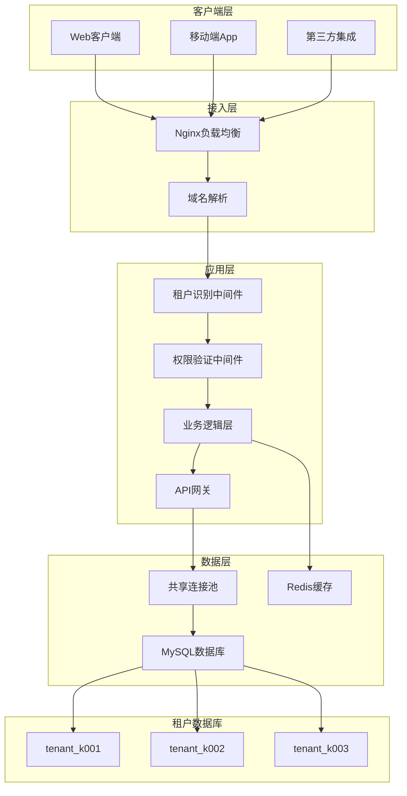
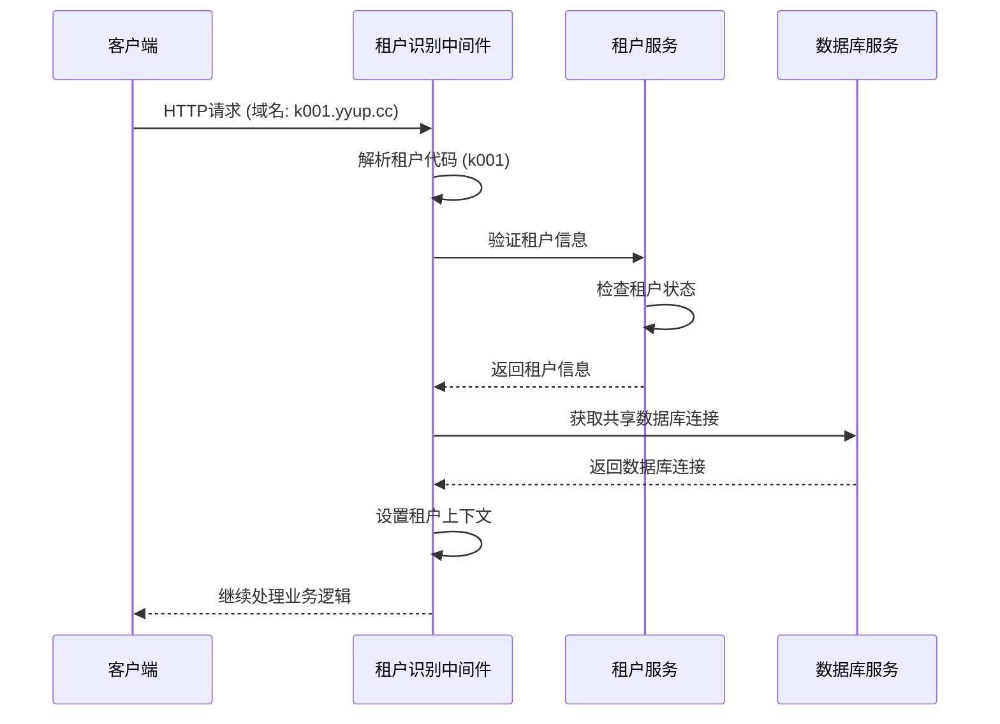

# 幼儿园统一租户系统 (Unified Tenant System)

[](LICENSE)
[](https://nodejs.org/)
[](https://www.typescriptlang.org/)

## 📋 目录

- [系统概述](#系统概述)
- [核心特性](#核心特性)
- [架构设计](#架构设计)
- [技术栈](#技术栈)
- [快速开始](#快速开始)
- [文档导航](#文档导航)
- [贡献指南](#贡献指南)

## 🎯 系统概述

幼儿园统一租户系统是基于**共享连接池架构**的SaaS多租户解决方案，专为教育行业设计。系统通过创新的数据库连接池优化技术，实现了高性能、低成本的多租户服务，支持大规模幼儿园集群的统一管理。

### 核心价值

- **成本效益**: 共享连接池减少资源消耗，降低运营成本60%+
- **高性能**: 优化的数据访问机制，响应时间<100ms
- **弹性扩展**: 支持动态租户添加，无需重启服务
- **数据安全**: 完善的租户隔离机制和数据加密
- **易于管理**: 统一的租户管理和监控系统

## ✨ 核心特性

### 🏢 多租户管理
- **动态租户识别**: 基于域名的自动租户识别
- **租户生命周期管理**: 从创建到销毁的完整生命周期
- **租户配置管理**: 灵活的租户级配置和定制化
- **租户监控**: 实时监控各租户的资源使用情况

### 🗄️ 数据库架构
- **共享连接池**: 所有租户共享一个数据库连接池
- **智能表名路由**: 自动SQL表名转换和路由
- **数据隔离**: 完整的逻辑数据隔离
- **事务管理**: 租户级别的事务一致性保证

### 🔐 安全机制
- **租户隔离**: 完善的租户间数据隔离
- **权限管理**: 基于角色的访问控制(RBAC)
- **数据加密**: 敏感数据的端到端加密
- **审计日志**: 完整的操作审计追踪

### 📊 性能优化
- **连接池优化**: 智能连接池管理和监控
- **缓存策略**: 多层缓存提升响应速度
- **负载均衡**: 智能请求分发和负载管理
- **资源监控**: 实时性能指标监控

### 🎯 业务模块
- **招生管理**: 完整的招生流程和学生管理
- **教学管理**: 课程安排、教学资源管理
- **人员管理**: 教师、家长、员工管理
- **财务管理**: 收费、财务报表、预算管理
- **活动管理**: 园所活动、家长互动
- **营销管理**: 市场推广、客户关系管理
- **AI智能服务**: 智能问答、数据分析、决策支持

### 系统规模

- **代码规模**: 约150k行代码
- **功能模块**: 9个一级类目，74个二级页面，2个三级组件
- **API接口**: 155+ RESTful API端点
- **数据模型**: 73+ 数据模型
- **权限记录**: 95+ 权限配置
- **Vue组件**: 80+ 前端组件

## 🏗️ 架构设计

### 系统架构图



### 租户识别流程



## 🛠️ 技术栈

### 后端技术
- **Node.js**: 运行时环境
- **TypeScript**: 开发语言
- **Express.js**: Web框架
- **Sequelize**: ORM框架
- **MySQL**: 数据库
- **Redis**: 缓存服务
- **JWT**: 身份认证

### 前端技术
- **Vue.js 3**: 前端框架
- **TypeScript**: 开发语言
- **Vite**: 构建工具
- **Element Plus**: UI组件库
- **Pinia**: 状态管理

### 基础设施
- **Docker**: 容器化部署
- **Nginx**: 反向代理
- **PM2**: 进程管理
- **GitHub Actions**: CI/CD

## 🚀 快速开始

### 环境要求

- Node.js >= 16.0.0
- MySQL >= 8.0
- Redis >= 6.0
- Docker >= 20.0 (可选)

### 安装部署

1. **克隆项目**
```bash
git clone https://github.com/your-org/kindergarten-tenant-system.git
cd kindergarten-tenant-system
```

2. **安装依赖**
```bash
npm install
```

3. **环境配置**
```bash
cp .env.example .env
# 编辑 .env 文件，配置数据库等信息
```

4. **数据库初始化**
```bash
npm run db:init
npm run db:migrate
```

5. **启动服务**
```bash
# 开发环境
npm run dev

# 生产环境
npm run build
npm start
```

### 快速验证

```bash
# 测试租户识别
curl -H "Host: k001.yyup.cc" http://localhost:3000/api/health

# 预期响应
{
  "success": true,
  "data": {
    "tenant": "k001",
    "status": "active",
    "timestamp": "2025-11-29T04:20:00.000Z"
  }
}
```

## 📚 文档导航

### 核心文档
- [多租户架构设计](./01-architecture-design.md)
- [数据库设计文档](./03-database-design.md)
- [API接口文档](./08-tenant-management-api.md)
- [部署运维指南](./19-deployment-guide.md)

### 开发文档
- [开发环境搭建](./23-development-setup.md)
- [租户扩展开发](./25-extension-development.md)
- [前端开发指南](./development/frontend-guide.md)
- [测试指南](./26-testing-guide.md)

### 运维文档
- [部署指南](./19-deployment-guide.md)
- [监控告警](./operation/monitoring.md)
- [故障排查](./operation/troubleshooting.md)
- [性能优化](./operation/performance-optimization.md)

### 业务文档
- [租户管理手册](./business/tenant-management.md)
- [权限管理指南](./11-user-permission-management.md)
- [计费系统说明](./business/billing-system.md)
- [安全合规文档](./business/security-compliance.md)

## 🏆 项目亮点

### 1. 创新的共享连接池架构
- **技术优势**: 相比传统多租户架构，资源利用率提升60%+
- **性能表现**: 数据库连接数从N*租户数降低到单一连接池
- **成本节约**: 显著降低数据库资源成本和运维复杂度

### 2. 智能租户识别机制
- **域名解析**: 支持多格式域名自动识别
- **动态验证**: 实时租户状态验证和权限检查
- **灵活配置**: 支持开发环境和生产环境的不同策略

### 3. 完善的数据隔离方案
- **逻辑隔离**: 通过数据库前缀实现完整的数据隔离
- **SQL透明**: 业务代码无需感知多租户复杂性
- **安全保证**: 防止跨租户数据泄露和误操作

### 4. 全面的监控体系
- **租户级监控**: 每个租户的独立监控指标
- **资源监控**: 连接池、数据库、缓存的实时监控
- **业务监控**: 关键业务指标的统计分析

### 🎯 业务特色

#### 完整的幼儿园管理功能
- **招生管理**: 在线报名、面试安排、录取管理、入学流程
- **教学管理**: 课程设置、教学计划、班级管理、成绩评估
- **人员管理**: 教师档案、家长信息、员工管理、权限分配
- **财务管理**: 学费收缴、财务报表、预算管理、成本控制
- **活动管理**: 园所活动、家长互动、节日庆典、社会实践
- **营销管理**: 市场推广、客户关系、品牌宣传、招生渠道

#### 智能化服务集成
- **AI智能问答**: 基于大语言模型的专业教育咨询
- **智能数据分析**: 招生趋势、教学效果、财务状况分析
- **决策支持系统**: 基于数据的管理决策建议
- **自动化报表**: 定制化报表生成和数据分析

## 📈 性能指标

### 系统性能
- **响应时间**: API平均响应时间 < 100ms
- **并发支持**: 支持1000+并发用户
- **数据库连接**: 通过共享池减少90%的连接数
- **资源利用率**: 相比传统方案提升60%+

### 可用性指标
- **系统可用性**: 99.9%+
- **数据一致性**: 强一致性保证
- **故障恢复**: 自动故障检测和恢复
- **备份策略**: 每日自动备份，支持快速恢复

## 🔒 安全保障

### 数据安全
- **租户隔离**: 完善的逻辑数据隔离机制
- **数据加密**: 敏感数据传输和存储加密
- **访问控制**: 基于角色的细粒度权限控制
- **审计日志**: 完整的操作审计和追踪

### 系统安全
- **身份认证**: 多因子身份认证支持
- **会话管理**: 安全的会话管理和超时控制
- **防攻击措施**: SQL注入、XSS、CSRF等攻击防护
- **安全监控**: 实时安全事件监控和告警

## 🤝 贡献指南

我们欢迎社区贡献！请阅读 [贡献指南](./CONTRIBUTING.md) 了解如何参与项目开发。

### 开发流程
1. Fork 项目到个人仓库
2. 创建特性分支 (`git checkout -b feature/AmazingFeature`)
3. 提交更改 (`git commit -m 'Add some AmazingFeature'`)
4. 推送到分支 (`git push origin feature/AmazingFeature`)
5. 创建 Pull Request

### 代码规范
- 遵循 ESLint 和 Prettier 配置
- 编写完整的单元测试
- 添加必要的文档注释
- 提交信息遵循 Conventional Commits 规范

## 📄 许可证

本项目采用 MIT 许可证 - 查看 [LICENSE](./LICENSE) 文件了解详情。

## 📞 联系我们

- **项目主页**: https://github.com/your-org/kindergarten-tenant-system
- **问题反馈**: https://github.com/your-org/kindergarten-tenant-system/issues
- **邮箱**: support@kindergarten-tenant-system.com
- **文档**: https://docs.kindergarten-tenant-system.com

---

⭐ 如果这个项目对您有帮助，请给我们一个 Star！

