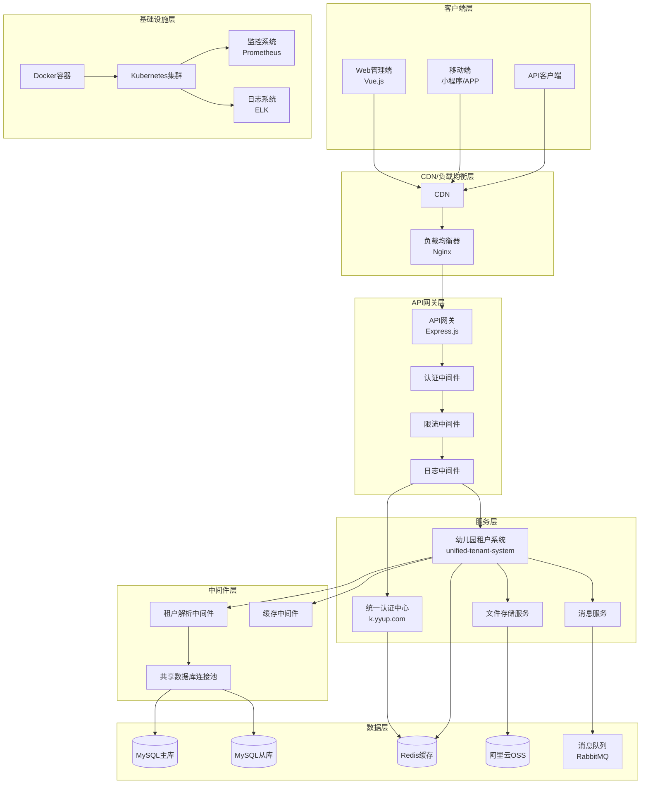
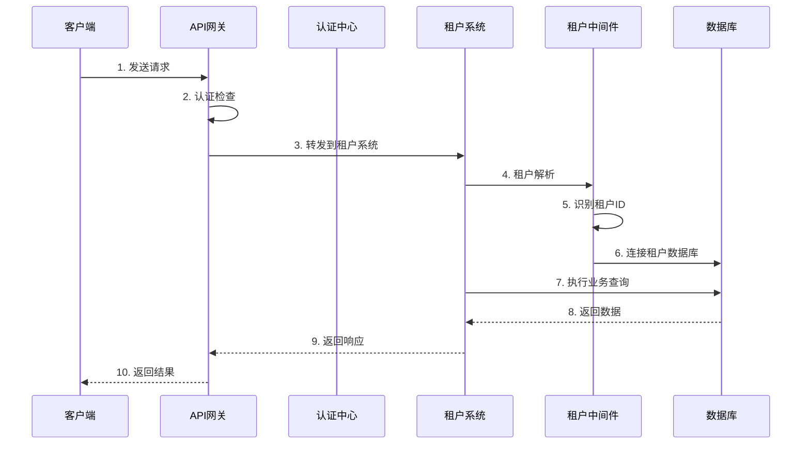
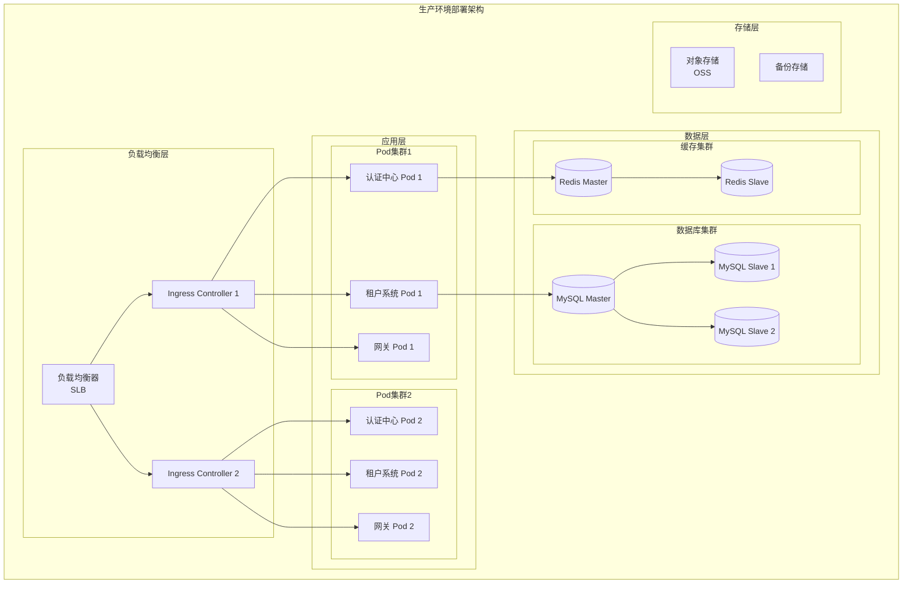

# 统一幼儿园管理系统 - 系统整体架构

## 目录
- [系统概述](#系统概述)
- [架构总览](#架构总览)
- [核心组件](#核心组件)
- [技术栈](#技术栈)
- [系统架构图](#系统架构图)
- [数据流架构](#数据流架构)
- [部署架构](#部署架构)
- [安全架构](#安全架构)
- [性能架构](#性能架构)

## 系统概述

统一幼儿园管理系统是一个基于微服务架构的综合性SaaS平台，包含统一认证中心和幼儿园租户系统两大核心模块。系统采用多租户架构，支持多个幼儿园独立使用，同时共享底层基础设施。

### 核心特性
- **多租户架构**: 支持多幼儿园独立使用，数据隔离
- **统一认证**: 集中式用户身份验证和授权
- **微服务架构**: 模块化设计，易于扩展和维护
- **高可用性**: 支持负载均衡和故障转移
- **可扩展性**: 支持水平扩展和垂直扩展
- **安全可靠**: 多层安全防护机制

## 架构总览

系统采用分层架构设计，从底层到顶层分为基础设施层、数据层、服务层、业务层和表现层。

### 分层架构
```
┌─────────────────────────────────────────────────────────────┐
│                    表现层 (Presentation Layer)                │
├─────────────────────────┬───────────────────────────────────┤
│   Web客户端 (Vue.js)    │       移动端 (小程序/APP)          │
└─────────────────────────┴───────────────────────────────────┘
┌─────────────────────────────────────────────────────────────┐
│                     API网关层 (Gateway Layer)                 │
├─────────────────────────┬───────────────────────────────────┤
│     路由转发             │         认证授权                   │
│     负载均衡             │         限流熔断                   │
│     监控日志             │         缓存管理                   │
└─────────────────────────┴───────────────────────────────────┘
┌─────────────────────────────────────────────────────────────┐
│                     业务层 (Business Layer)                   │
├─────────────────────────┬───────────────────────────────────┤
│   统一认证中心           │       幼儿园租户系统               │
│   - 用户管理             │       - 幼儿管理                   │
│   - 角色权限             │       - 班级管理                   │
│   - JWT服务             │       - 教师管理                   │
│                        │       - 课程管理                   │
│                        │       - 考勤管理                   │
└─────────────────────────┴───────────────────────────────────┘
┌─────────────────────────────────────────────────────────────┐
│                     服务层 (Service Layer)                    │
├─────────────────────────┬───────────────────────────────────┤
│   租户解析中间件         │       共享数据库连接池             │
│   认证中间件             │       文件存储服务                 │
│   日志中间件             │       消息队列服务                 │
│   异常处理中间件         │       缓存服务                     │
└─────────────────────────┴───────────────────────────────────┘
┌─────────────────────────────────────────────────────────────┐
│                      数据层 (Data Layer)                      │
├─────────────────────────┬───────────────────────────────────┤
│   MySQL主库             │       MySQL从库                   │
│   Redis缓存             │       文件存储(OSS)               │
│   消息队列              │       日志存储                   │
└─────────────────────────┴───────────────────────────────────┘
┌─────────────────────────────────────────────────────────────┐
│                  基础设施层 (Infrastructure Layer)             │
├─────────────────────────┬───────────────────────────────────┤
│   Docker容器            │       Kubernetes集群              │
│   监控告警              │       日志收集                   │
│   配置中心              │       服务发现                   │
└─────────────────────────┴───────────────────────────────────┘
```

## 核心组件

### 1. 统一认证中心 (k.yyup.com)
负责整个系统的用户认证和授权管理。

**主要功能:**
- 用户注册、登录、注销
- JWT令牌生成和验证
- 角色权限管理
- 多租户用户隔离
- 第三方登录集成

**技术实现:**
- Node.js + Express + TypeScript
- JWT认证机制
- BCrypt密码加密
- Redis会话存储

### 2. 幼儿园租户系统 (unified-tenant-system)
核心业务系统，为每个幼儿园提供完整的园所管理功能。

**主要功能:**
- 幼儿信息管理
- 班级管理
- 教师管理
- 课程安排
- 考勤管理
- 家长互动
- 照片相册
- 成绩评估

**技术实现:**
- Node.js + NestJS + TypeScript
- Vue.js 3 + TypeScript + Ant Design Vue
- 多租户数据库设计
- 共享连接池优化

### 3. API网关
系统的统一入口，处理所有外部请求。

**主要功能:**
- 请求路由转发
- 负载均衡
- 认证授权
- 限流熔断
- 监控日志

### 4. 共享数据库连接池
优化数据库连接管理，提高系统性能。

**主要特性:**
- 连接池管理
- 读写分离
- 租户数据隔离
- 连接监控

### 5. 租户解析中间件
自动识别请求所属租户，实现多租户数据隔离。

**主要功能:**
- 域名解析
- 请求头解析
- 租户上下文设置
- 数据库切换

## 技术栈

### 后端技术栈
- **运行时**: Node.js 18+
- **语言**: TypeScript 5+
- **框架**: Express.js, NestJS
- **数据库**: MySQL 8.0
- **缓存**: Redis 7.0
- **认证**: JWT, BCrypt
- **ORM**: TypeORM, Prisma
- **消息队列**: RabbitMQ, Redis
- **文件存储**: 阿里云OSS

### 前端技术栈
- **框架**: Vue.js 3
- **语言**: TypeScript 5+
- **UI库**: Ant Design Vue
- **状态管理**: Pinia
- **路由**: Vue Router 4
- **构建工具**: Vite
- **移动端**: uni-app

### 基础设施
- **容器化**: Docker
- **编排**: Kubernetes
- **反向代理**: Nginx
- **监控**: Prometheus + Grafana
- **日志**: ELK Stack
- **CI/CD**: GitHub Actions

## 系统架构图



## 数据流架构



## 部署架构

### 开发环境
- 单机Docker部署
- 本地数据库
- 热重载开发

### 测试环境
- Docker Compose部署
- 模拟生产环境配置
- 自动化测试

### 生产环境
- Kubernetes集群部署
- 高可用数据库集群
- 负载均衡和自动扩缩容



## 安全架构

### 认证授权
- JWT令牌认证
- RBAC角色权限控制
- 多租户数据隔离
- API访问控制

### 数据安全
- 数据传输加密(HTTPS)
- 数据库连接加密
- 敏感数据脱敏
- 定期安全审计

### 网络安全
- 防火墙配置
- DDoS防护
- API限流
- 安全头设置

## 性能架构

### 缓存策略
- Redis分布式缓存
- 本地缓存
- CDN缓存
- 数据库查询缓存

### 数据库优化
- 读写分离
- 索引优化
- 连接池管理
- 慢查询监控

### 应用优化
- 异步处理
- 消息队列
- 负载均衡
- 自动扩缩容

---

*本文档持续更新中，最后更新时间: 2025-11-29*