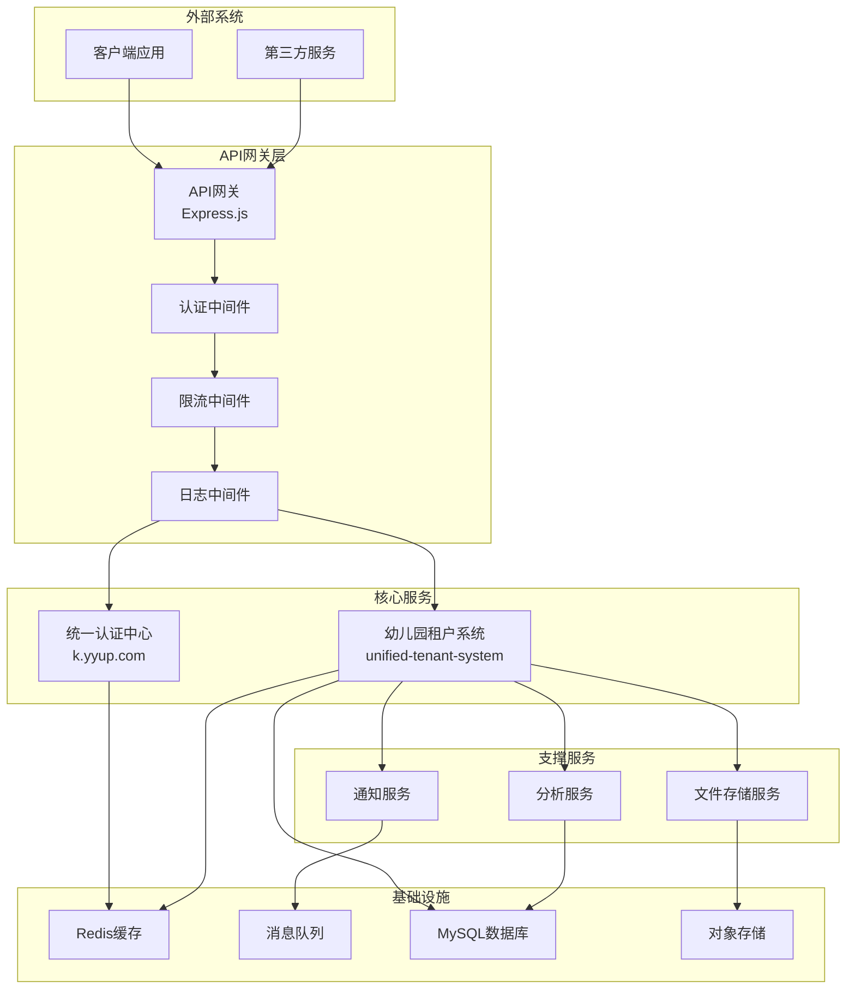
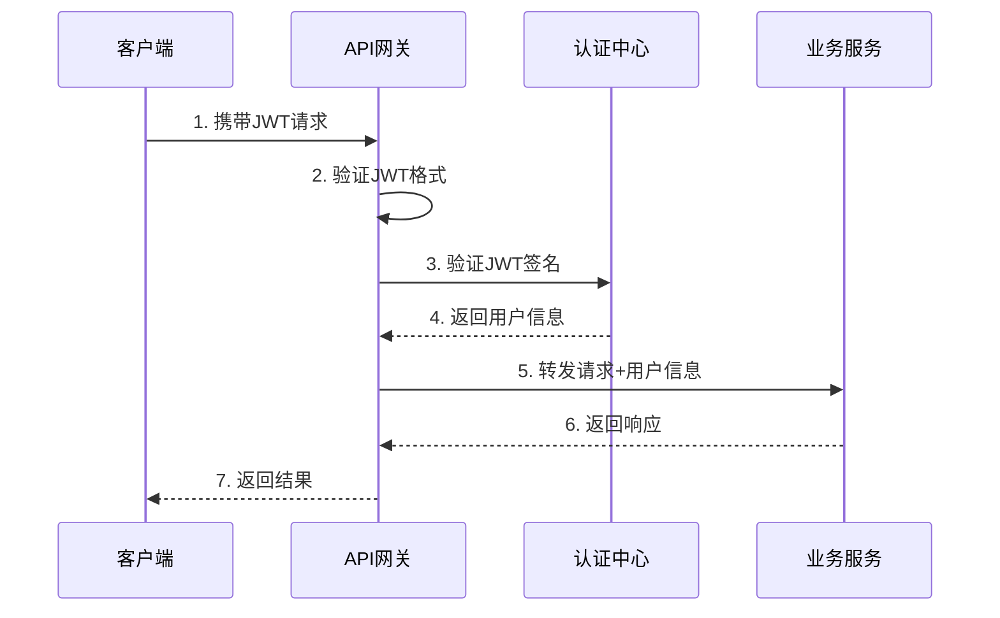
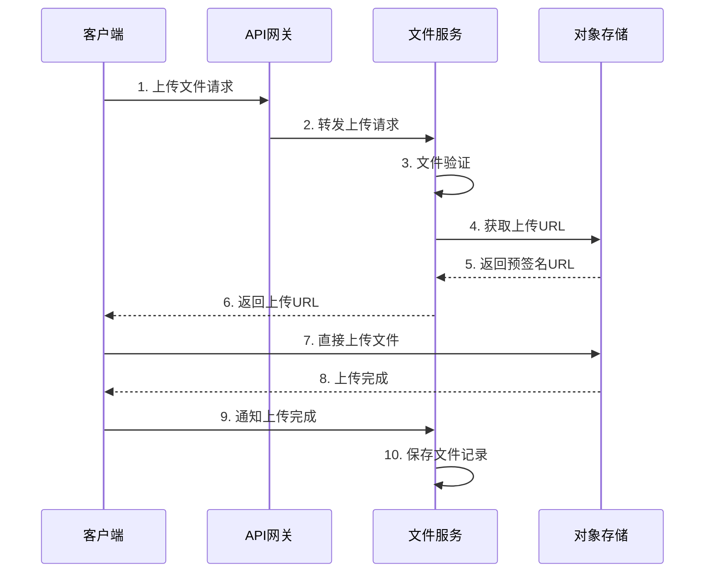

# 系统间集成和通信机制

## 目录
- [集成架构总览](#集成架构总览)
- [服务间通信协议](#服务间通信协议)
- [认证授权机制](#认证授权机制)
- [租户数据隔离](#租户数据隔离)
- [API网关集成](#api网关集成)
- [消息队列集成](#消息队列集成)
- [缓存集成机制](#缓存集成机制)
- [文件存储集成](#文件存储集成)
- [日志和监控集成](#日志和监控集成)
- [错误处理和重试机制](#错误处理和重试机制)
- [服务发现和注册](#服务发现和注册)

## 集成架构总览

统一幼儿园管理系统采用微服务架构，各个服务之间通过API网关进行统一管理，实现松耦合、高内聚的分布式系统。

### 服务关系图



## 服务间通信协议

### 1. HTTP/HTTPS RESTful API
主要用于同步请求响应场景。

**特点:**
- 标准HTTP协议
- JSON数据格式
- 统一响应结构
- 状态码规范

**请求格式:**
```typescript
// 请求头
{
  "Content-Type": "application/json",
  "Authorization": "Bearer <jwt_token>",
  "X-Tenant-ID": "tenant_123",
  "X-Request-ID": "req_abc123"
}

// 请求体
{
  "data": {
    // 业务数据
  },
  "meta": {
    "timestamp": 1701234567890,
    "version": "v1"
  }
}
```

**响应格式:**
```typescript
// 成功响应
{
  "success": true,
  "code": 200,
  "message": "操作成功",
  "data": {
    // 响应数据
  },
  "meta": {
    "timestamp": 1701234567890,
    "requestId": "req_abc123",
    "duration": 150
  }
}

// 错误响应
{
  "success": false,
  "code": 400,
  "message": "请求参数错误",
  "error": {
    "type": "ValidationError",
    "details": [
      {
        "field": "email",
        "message": "邮箱格式不正确"
      }
    ]
  },
  "meta": {
    "timestamp": 1701234567890,
    "requestId": "req_abc123"
  }
}
```

### 2. WebSocket实时通信
用于实时数据推送场景，如考勤状态、消息通知等。

**连接建立:**
```typescript
// 客户端连接
const ws = new WebSocket('wss://api.example.com/ws');

// 连接参数
ws.send(JSON.stringify({
  type: 'auth',
  token: 'jwt_token',
  tenantId: 'tenant_123'
}));

// 服务端响应
{
  "type": "auth_success",
  "userId": "user_456",
  "tenantId": "tenant_123"
}
```

**消息格式:**
```typescript
// 心跳消息
{
  "type": "ping",
  "timestamp": 1701234567890
}

// 业务消息
{
  "type": "attendance_update",
  "data": {
    "studentId": "student_789",
    "status": "present",
    "timestamp": 1701234567890
  },
  "tenantId": "tenant_123"
}
```

### 3. 消息队列异步通信
用于解耦服务和异步处理场景。

**消息格式:**
```typescript
// 生产者消息
{
  "id": "msg_123456",
  "type": "notification.email",
  "timestamp": 1701234567890,
  "tenantId": "tenant_123",
  "data": {
    "to": "parent@example.com",
    "subject": "考勤通知",
    "template": "attendance_notification",
    "variables": {
      "studentName": "张三",
      "status": "present"
    }
  },
  "retry": 3,
  "delay": 0
}
```

## 认证授权机制

### 1. JWT令牌认证

**JWT结构:**
```typescript
// Header
{
  "alg": "HS256",
  "typ": "JWT"
}

// Payload
{
  "sub": "user_123456",
  "iat": 1701234567,
  "exp": 1701238167,
  "tenantId": "tenant_789",
  "roles": ["teacher", "admin"],
  "permissions": ["student.read", "class.write"]
}
```

**令牌验证流程:**


### 2. 权限控制模型

**RBAC模型:**
```typescript
interface User {
  id: string;
  tenantId: string;
  roles: Role[];
  permissions: Permission[];
}

interface Role {
  id: string;
  name: string;
  permissions: Permission[];
}

interface Permission {
  id: string;
  resource: string;
  action: string;
  condition?: string;
}
```

**权限检查中间件:**
```typescript
// 检查用户权限
const checkPermission = (resource: string, action: string) => {
  return async (req, res, next) => {
    const user = req.user;
    const hasPermission = user.permissions.some(
      p => p.resource === resource && p.action === action
    );

    if (!hasPermission) {
      return res.status(403).json({
        success: false,
        code: 403,
        message: '权限不足'
      });
    }

    next();
  };
};

// 使用示例
router.get('/students',
  authenticate(),
  checkPermission('student', 'read'),
  getStudents
);
```

## 租户数据隔离

### 1. 多租户架构模式

**数据库隔离策略:**
- **共享数据库，独立Schema**: 每个租户使用独立的数据库Schema
- **独立数据库**: 每个租户使用完全独立的数据库
- **共享数据库，共享表**: 通过tenant_id字段区分数据

**当前采用方案:** 共享数据库连接池 + 租户字段隔离

### 2. 租户解析中间件

**实现原理:**
```typescript
// 租户解析中间件
const tenantResolver = async (req, res, next) => {
  // 从域名解析租户
  const tenantFromDomain = req.hostname.split('.')[0];

  // 从请求头解析租户
  const tenantFromHeader = req.headers['x-tenant-id'];

  // 从JWT令牌解析租户
  const tenantFromToken = req.user?.tenantId;

  // 优先级：Header > Token > Domain
  const tenantId = tenantFromHeader || tenantFromToken || tenantFromDomain;

  if (!tenantId) {
    return res.status(400).json({
      success: false,
      code: 400,
      message: '租户信息缺失'
    });
  }

  // 验证租户是否存在
  const tenant = await tenantService.getTenantById(tenantId);
  if (!tenant) {
    return res.status(404).json({
      success: false,
      code: 404,
      message: '租户不存在'
    });
  }

  // 设置租户上下文
  req.tenantId = tenantId;
  req.tenant = tenant;

  // 设置数据库连接
  req.dbConnection = await dbPool.getConnection(tenantId);

  next();
};
```

### 3. 数据库访问控制

**Repository模式:**
```typescript
// 租户感知的数据访问层
export class TenantAwareRepository<T> {
  constructor(
    private entity: new () => T,
    private tenantId: string
  ) {}

  async findById(id: string): Promise<T> {
    return this.entity.findOne({
      where: {
        id,
        tenantId: this.tenantId
      }
    });
  }

  async findAll(options?: FindManyOptions<T>): Promise<T[]> {
    return this.entity.find({
      where: {
        tenantId: this.tenantId,
        ...options?.where
      },
      ...options
    });
  }

  async create(data: Partial<T>): Promise<T> {
    const entity = new this.entity();
    Object.assign(entity, {
      ...data,
      tenantId: this.tenantId
    });
    return this.entity.save(entity);
  }
}
```

## API网关集成

### 1. 路由配置

**路由规则:**
```typescript
// API网关路由配置
const routes = [
  // 认证相关路由
  {
    path: '/api/auth/**',
    service: 'auth-service',
    methods: ['GET', 'POST', 'PUT', 'DELETE'],
    auth: false,
    rateLimit: {
      windowMs: 15 * 60 * 1000, // 15分钟
      max: 100 // 最多100次请求
    }
  },

  // 租户系统路由
  {
    path: '/api/tenant/**',
    service: 'tenant-service',
    methods: ['GET', 'POST', 'PUT', 'DELETE'],
    auth: true,
    rateLimit: {
      windowMs: 15 * 60 * 1000,
      max: 1000
    }
  },

  // 文件上传路由
  {
    path: '/api/files/**',
    service: 'file-service',
    methods: ['POST', 'GET', 'DELETE'],
    auth: true,
    rateLimit: {
      windowMs: 60 * 1000, // 1分钟
      max: 50 // 文件上传限制
    }
  }
];
```

### 2. 请求转发

**转发逻辑:**
```typescript
class APIGateway {
  async forwardRequest(req, res) {
    const route = this.findRoute(req.path, req.method);

    if (!route) {
      return res.status(404).json({
        success: false,
        code: 404,
        message: '接口不存在'
      });
    }

    try {
      // 应用中间件
      await this.applyMiddlewares(req, res, route);

      // 转发请求
      const serviceUrl = this.getServiceUrl(route.service);
      const response = await axios({
        method: req.method,
        url: `${serviceUrl}${req.path}`,
        headers: {
          ...req.headers,
          'X-Request-ID': req.id,
          'X-Forwarded-For': req.ip
        },
        data: req.body,
        params: req.query,
        timeout: 30000
      });

      // 返回响应
      res.status(response.status).json(response.data);

    } catch (error) {
      this.handleError(error, res);
    }
  }
}
```

### 3. 服务发现

**服务注册与发现:**
```typescript
// 服务注册
class ServiceRegistry {
  constructor() {
    this.services = new Map();
    this.healthCheck = new Map();
  }

  register(serviceName, instance) {
    if (!this.services.has(serviceName)) {
      this.services.set(serviceName, []);
    }

    this.services.get(serviceName).push({
      ...instance,
      registeredAt: Date.now(),
      lastHealthCheck: Date.now()
    });

    // 启动健康检查
    this.startHealthCheck(serviceName, instance);
  }

  discover(serviceName) {
    const instances = this.services.get(serviceName) || [];
    const healthyInstances = instances.filter(instance =>
      instance.status === 'healthy'
    );

    // 负载均衡算法
    return this.loadBalance(healthyInstances);
  }

  // 轮询负载均衡
  loadBalance(instances) {
    if (instances.length === 0) return null;

    const index = this.roundRobinCounter++ % instances.length;
    return instances[index];
  }
}
```

## 消息队列集成

### 1. 消息队列架构

**RabbitMQ配置:**
```typescript
// 消息队列配置
const rabbitmqConfig = {
  url: process.env.RABBITMQ_URL,
  exchanges: {
    default: { name: 'kindergarten.direct', type: 'direct' },
    fanout: { name: 'kindergarten.fanout', type: 'fanout' },
    topic: { name: 'kindergarten.topic', type: 'topic' }
  },
  queues: {
    notification: 'notification.queue',
    attendance: 'attendance.queue',
    analytics: 'analytics.queue',
    email: 'email.queue',
    sms: 'sms.queue'
  }
};
```

### 2. 消息生产者

**消息发送:**
```typescript
class MessageProducer {
  constructor(private channel: Channel) {}

  async sendNotification(message: NotificationMessage) {
    await this.channel.publish(
      rabbitmqConfig.exchanges.default.name,
      'notification',
      Buffer.from(JSON.stringify(message)),
      {
        persistent: true,
        messageId: generateId(),
        timestamp: Date.now(),
        headers: {
          tenantId: message.tenantId,
          userId: message.userId
        }
      }
    );
  }

  async sendAttendanceUpdate(data: AttendanceData) {
    await this.channel.publish(
      rabbitmqConfig.exchanges.fanout.name,
      '',
      Buffer.from(JSON.stringify({
        type: 'attendance.update',
        data,
        timestamp: Date.now()
      }))
    );
  }
}
```

### 3. 消息消费者

**消息处理:**
```typescript
class MessageConsumer {
  constructor(private channel: Channel) {}

  async consumeNotifications() {
    await this.channel.consume(
      rabbitmqConfig.queues.notification,
      async (msg) => {
        if (!msg) return;

        try {
          const message = JSON.parse(msg.content.toString());

          // 根据消息类型处理
          switch (message.type) {
            case 'email':
              await this.sendEmail(message.data);
              break;
            case 'sms':
              await this.sendSMS(message.data);
              break;
            case 'push':
              await this.sendPushNotification(message.data);
              break;
          }

          this.channel.ack(msg);
        } catch (error) {
          console.error('消息处理失败:', error);
          this.channel.nack(msg, false, true); // 重新入队
        }
      }
    );
  }
}
```

## 缓存集成机制

### 1. 多级缓存架构

**缓存层次:**
1. **本地缓存**: 应用内存缓存 (LRU)
2. **分布式缓存**: Redis集群
3. **CDN缓存**: 静态资源缓存

### 2. 缓存策略

**缓存中间件:**
```typescript
class CacheMiddleware {
  constructor(private redis: Redis) {}

  // 缓存读取
  async get(key: string): Promise<any> {
    try {
      // 先查本地缓存
      const localCache = this.getLocalCache(key);
      if (localCache) {
        return localCache;
      }

      // 再查Redis缓存
      const cached = await this.redis.get(key);
      if (cached) {
        const data = JSON.parse(cached);
        this.setLocalCache(key, data, 60); // 本地缓存1分钟
        return data;
      }

      return null;
    } catch (error) {
      console.error('缓存读取失败:', error);
      return null;
    }
  }

  // 缓存写入
  async set(key: string, value: any, ttl: number = 3600): Promise<void> {
    try {
      const serialized = JSON.stringify(value);

      // 写入Redis
      await this.redis.setex(key, ttl, serialized);

      // 写入本地缓存
      this.setLocalCache(key, value, Math.min(ttl, 300)); // 本地缓存最多5分钟
    } catch (error) {
      console.error('缓存写入失败:', error);
    }
  }

  // 缓存失效
  async invalidate(pattern: string): Promise<void> {
    try {
      // 删除本地缓存
      this.clearLocalCache(pattern);

      // 删除Redis缓存
      const keys = await this.redis.keys(pattern);
      if (keys.length > 0) {
        await this.redis.del(...keys);
      }
    } catch (error) {
      console.error('缓存失效失败:', error);
    }
  }
}
```

### 3. 缓存键命名规范

**命名规则:**
```
格式: {service}:{tenant_id}:{resource}:{id}:{version}

示例:
- auth:tenant_123:user:user_456:v1
- tenant:tenant_789:student:student_001:v1
- common:config:system_settings:v1
```

## 文件存储集成

### 1. 文件上传流程



### 2. 文件存储配置

**阿里云OSS集成:**
```typescript
import OSS from 'ali-oss';

class FileStorageService {
  private client: OSS;

  constructor() {
    this.client = new OSS({
      region: process.env.OSS_REGION,
      accessKeyId: process.env.OSS_ACCESS_KEY_ID,
      accessKeySecret: process.env.OSS_ACCESS_KEY_SECRET,
      bucket: process.env.OSS_BUCKET
    });
  }

  // 生成预签名上传URL
  async generateUploadUrl(filename: string, contentType: string): Promise<string> {
    const key = this.generateFileKey(filename);

    return this.client.signatureUrl(key, {
      method: 'PUT',
      'Content-Type': contentType,
      expires: 3600 // 1小时有效期
    });
  }

  // 生成文件访问URL
  async getFileUrl(key: string): Promise<string> {
    return this.client.signatureUrl(key, {
      expires: 3600 * 24 // 24小时有效期
    });
  }

  // 生成文件键
  private generateFileKey(filename: string): string {
    const ext = path.extname(filename);
    const name = path.basename(filename, ext);
    const timestamp = Date.now();
    const random = Math.random().toString(36).substring(2);

    return `uploads/${timestamp}/${name}_${random}${ext}`;
  }
}
```

## 日志和监控集成

### 1. 统一日志格式

**日志结构:**
```typescript
interface LogEntry {
  timestamp: string;
  level: 'debug' | 'info' | 'warn' | 'error';
  service: string;
  tenantId?: string;
  userId?: string;
  requestId?: string;
  message: string;
  data?: any;
  error?: {
    name: string;
    message: string;
    stack: string;
  };
  duration?: number;
  metadata?: Record<string, any>;
}
```

### 2. 日志收集

**ELK集成:**
```typescript
class Logger {
  constructor(private winston: Winston.Logger) {}

  info(message: string, data?: any) {
    this.winston.info(message, {
      service: process.env.SERVICE_NAME,
      tenantId: CurrentTenant.getId(),
      userId: CurrentUser.getId(),
      requestId: CurrentRequest.getId(),
      data
    });
  }

  error(message: string, error?: Error, data?: any) {
    this.winston.error(message, {
      service: process.env.SERVICE_NAME,
      tenantId: CurrentTenant.getId(),
      userId: CurrentUser.getId(),
      requestId: CurrentRequest.getId(),
      error: {
        name: error?.name,
        message: error?.message,
        stack: error?.stack
      },
      data
    });
  }
}
```

### 3. 监控指标

**Prometheus指标:**
```typescript
import { register, Counter, Histogram, Gauge } from 'prom-client';

// 请求计数器
const httpRequestsTotal = new Counter({
  name: 'http_requests_total',
  help: 'Total HTTP requests',
  labelNames: ['method', 'route', 'status_code', 'tenant_id']
});

// 请求延迟
const httpRequestDuration = new Histogram({
  name: 'http_request_duration_seconds',
  help: 'HTTP request duration',
  labelNames: ['method', 'route', 'tenant_id'],
  buckets: [0.1, 0.5, 1, 2, 5]
});

// 活跃连接数
const activeConnections = new Gauge({
  name: 'active_connections',
  help: 'Number of active connections',
  labelNames: ['type']
});

register.registerMetric(httpRequestsTotal);
register.registerMetric(httpRequestDuration);
register.registerMetric(activeConnections);
```

## 错误处理和重试机制

### 1. 统一错误处理

**错误类型定义:**
```typescript
enum ErrorCode {
  VALIDATION_ERROR = 'VALIDATION_ERROR',
  AUTHENTICATION_ERROR = 'AUTHENTICATION_ERROR',
  AUTHORIZATION_ERROR = 'AUTHORIZATION_ERROR',
  NOT_FOUND = 'NOT_FOUND',
  CONFLICT = 'CONFLICT',
  INTERNAL_ERROR = 'INTERNAL_ERROR',
  SERVICE_UNAVAILABLE = 'SERVICE_UNAVAILABLE'
}

class AppError extends Error {
  constructor(
    public code: ErrorCode,
    message: string,
    public statusCode: number = 500,
    public details?: any
  ) {
    super(message);
    this.name = 'AppError';
  }
}
```

### 2. 重试机制

**指数退避重试:**
```typescript
class RetryHandler {
  async execute<T>(
    operation: () => Promise<T>,
    options: {
      maxRetries?: number;
      baseDelay?: number;
      maxDelay?: number;
      backoffFactor?: number;
    } = {}
  ): Promise<T> {
    const {
      maxRetries = 3,
      baseDelay = 1000,
      maxDelay = 30000,
      backoffFactor = 2
    } = options;

    let lastError: Error;

    for (let attempt = 0; attempt <= maxRetries; attempt++) {
      try {
        return await operation();
      } catch (error) {
        lastError = error;

        if (attempt === maxRetries) {
          break;
        }

        // 计算延迟时间
        const delay = Math.min(
          baseDelay * Math.pow(backoffFactor, attempt),
          maxDelay
        );

        console.warn(`操作失败，${delay}ms后重试 (${attempt + 1}/${maxRetries})`, error);
        await this.sleep(delay);
      }
    }

    throw lastError;
  }

  private sleep(ms: number): Promise<void> {
    return new Promise(resolve => setTimeout(resolve, ms));
  }
}
```

## 服务发现和注册

### 1. 服务注册中心

**基于Redis的服务发现:**
```typescript
class ServiceRegistry {
  constructor(private redis: Redis) {}

  // 注册服务
  async register(service: ServiceInfo): Promise<void> {
    const key = `service:${service.name}:${service.id}`;
    const serviceData = {
      ...service,
      registeredAt: Date.now(),
      lastHeartbeat: Date.now(),
      status: 'healthy'
    };

    await this.redis.hset(key, serviceData);
    await this.redis.expire(key, 60); // 60秒过期

    // 添加到服务列表
    await this.redis.sadd(`services:${service.name}`, service.id);
  }

  // 发现服务
  async discover(serviceName: string): Promise<ServiceInfo[]> {
    const serviceIds = await this.redis.smembers(`services:${serviceName}`);

    const services = await Promise.all(
      serviceIds.map(async id => {
        const key = `service:${serviceName}:${id}`;
        const service = await this.redis.hgetall(key);

        return service.status === 'healthy' ? service : null;
      })
    );

    return services.filter(Boolean);
  }

  // 心跳检测
  async heartbeat(serviceName: string, serviceId: string): Promise<void> {
    const key = `service:${serviceName}:${serviceId}`;
    await this.redis.hset(key, 'lastHeartbeat', Date.now());
    await this.redis.expire(key, 60);
  }
}
```

### 2. 健康检查

**健康检查中间件:**
```typescript
class HealthChecker {
  checks: Map<string, HealthCheck> = new Map();

  addCheck(name: string, check: HealthCheck): void {
    this.checks.set(name, check);
  }

  async checkHealth(): Promise<HealthStatus> {
    const results = new Map<string, CheckResult>();

    for (const [name, check] of this.checks) {
      try {
        const startTime = Date.now();
        await check.execute();
        const duration = Date.now() - startTime;

        results.set(name, {
          status: 'healthy',
          duration,
          timestamp: Date.now()
        });
      } catch (error) {
        results.set(name, {
          status: 'unhealthy',
          error: error.message,
          timestamp: Date.now()
        });
      }
    }

    const allHealthy = Array.from(results.values())
      .every(result => result.status === 'healthy');

    return {
      status: allHealthy ? 'healthy' : 'unhealthy',
      checks: Object.fromEntries(results),
      timestamp: Date.now()
    };
  }
}
```

---

*本文档持续更新中，最后更新时间: 2025-11-29*