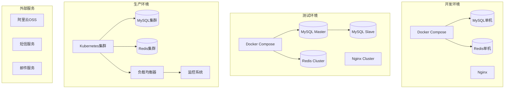

# 系统部署指南

## 目录
- [部署概述](#部署概述)
- [环境要求](#环境要求)
- [开发环境部署](#开发环境部署)
- [测试环境部署](#测试环境部署)
- [生产环境部署](#生产环境部署)
- [Docker部署](#docker部署)
- [Kubernetes部署](#kubernetes部署)
- [CI/CD自动化部署](#cicd自动化部署)
- [部署脚本和工具](#部署脚本和工具)
- [部署验证和测试](#部署验证和测试)
- [回滚和故障恢复](#回滚和故障恢复)

## 部署概述

统一幼儿园管理系统支持多环境部署，包括开发环境、测试环境和生产环境。每个环境都有特定的配置要求和部署策略。

### 部署架构图



## 环境要求

### 最低硬件要求

| 环境 | CPU | 内存 | 存储 | 网络 |
|------|-----|------|------|------|
| 开发 | 2核 | 4GB | 50GB | 100Mbps |
| 测试 | 4核 | 8GB | 100GB | 1Gbps |
| 生产 | 8核 | 16GB | 500GB | 10Gbps |

### 软件依赖

**基础环境:**
- 操作系统: Linux (Ubuntu 20.04+ / CentOS 8+)
- Docker: 20.10+
- Docker Compose: 2.0+
- Node.js: 18.0+ (开发环境)
- Git: 2.30+

**数据库:**
- MySQL: 8.0+
- Redis: 7.0+

**容器编排 (生产环境):**
- Kubernetes: 1.24+
- Helm: 3.8+

**监控和日志:**
- Prometheus: 2.40+
- Grafana: 9.0+
- ELK Stack: 7.17+

## 开发环境部署

### 1. 环境准备

**安装Docker和Docker Compose:**
```bash
# Ubuntu/Debian
curl -fsSL https://get.docker.com -o get-docker.sh
sudo sh get-docker.sh
sudo usermod -aG docker $USER

# 安装Docker Compose
sudo curl -L "https://github.com/docker/compose/releases/latest/download/docker-compose-$(uname -s)-$(uname -m)" -o /usr/local/bin/docker-compose
sudo chmod +x /usr/local/bin/docker-compose
```

**克隆项目代码:**
```bash
git clone https://github.com/your-org/kindergarten-system.git
cd kindergarten-system
```

### 2. 配置环境变量

**创建环境配置文件:**
```bash
# 创建开发环境配置
cp .env.example .env.development
```

**`.env.development` 配置:**
```env
# 应用配置
NODE_ENV=development
PORT=3000
API_VERSION=v1

# 数据库配置
DB_HOST=localhost
DB_PORT=3306
DB_USERNAME=root
DB_PASSWORD=root123
DB_DATABASE=kindergarten_dev

# Redis配置
REDIS_HOST=localhost
REDIS_PORT=6379
REDIS_PASSWORD=

# JWT配置
JWT_SECRET=your-jwt-secret-key-for-development
JWT_EXPIRES_IN=24h

# 文件存储配置
OSS_REGION=oss-cn-beijing
OSS_BUCKET=dev-kindergarten-files
OSS_ACCESS_KEY_ID=your-oss-access-key
OSS_ACCESS_KEY_SECRET=your-oss-secret

# 第三方服务
SMS_ACCESS_KEY=your-sms-access-key
SMS_SECRET_KEY=your-sms-secret-key

# 开发模式配置
DEBUG=true
LOG_LEVEL=debug
HOT_RELOAD=true
```

### 3. 启动开发环境

**使用Docker Compose启动:**
```yaml
# docker-compose.dev.yml
version: '3.8'

services:
  # MySQL数据库
  mysql:
    image: mysql:8.0
    container_name: kindergarten-mysql-dev
    environment:
      MYSQL_ROOT_PASSWORD: root123
      MYSQL_DATABASE: kindergarten_dev
    ports:
      - "3306:3306"
    volumes:
      - mysql_data:/var/lib/mysql
      - ./database/init:/docker-entrypoint-initdb.d
    networks:
      - kindergarten-network

  # Redis缓存
  redis:
    image: redis:7.0-alpine
    container_name: kindergarten-redis-dev
    ports:
      - "6379:6379"
    volumes:
      - redis_data:/data
    networks:
      - kindergarten-network

  # 认证中心
  auth-service:
    build:
      context: ./k.yyup.com
      dockerfile: Dockerfile.dev
    container_name: auth-service-dev
    environment:
      - NODE_ENV=development
    ports:
      - "3001:3000"
    volumes:
      - ./k.yyup.com:/app
      - /app/node_modules
    depends_on:
      - mysql
      - redis
    networks:
      - kindergarten-network
    command: npm run dev

  # 租户系统
  tenant-service:
    build:
      context: ./unified-tenant-system
      dockerfile: Dockerfile.dev
    container_name: tenant-service-dev
    environment:
      - NODE_ENV=development
    ports:
      - "3002:3000"
    volumes:
      - ./unified-tenant-system:/app
      - /app/node_modules
    depends_on:
      - mysql
      - redis
    networks:
      - kindergarten-network
    command: npm run dev

  # 前端开发服务器
  frontend:
    build:
      context: ./unified-tenant-system/client
      dockerfile: Dockerfile.dev
    container_name: frontend-dev
    ports:
      - "8080:8080"
    volumes:
      - ./unified-tenant-system/client:/app
      - /app/node_modules
    networks:
      - kindergarten-network
    command: npm run dev

volumes:
  mysql_data:
  redis_data:

networks:
  kindergarten-network:
    driver: bridge
```

**启动命令:**
```bash
# 启动所有服务
docker-compose -f docker-compose.dev.yml up -d

# 查看服务状态
docker-compose -f docker-compose.dev.yml ps

# 查看日志
docker-compose -f docker-compose.dev.yml logs -f
```

### 4. 数据库初始化

**运行数据库迁移:**
```bash
# 进入认证中心容器
docker-compose -f docker-compose.dev.yml exec auth-service bash

# 运行认证中心数据库迁移
npm run migration:run

# 进入租户系统容器
docker-compose -f docker-compose.dev.yml exec tenant-service bash

# 运行租户系统数据库迁移
npm run migration:run

# 初始化基础数据
npm run seed
```

## 测试环境部署

### 1. 环境配置

**`.env.testing` 配置:**
```env
# 应用配置
NODE_ENV=testing
PORT=3000
API_VERSION=v1

# 数据库配置
DB_HOST=mysql-test
DB_PORT=3306
DB_USERNAME=app_user
DB_PASSWORD=app_password
DB_DATABASE=kindergarten_test

# Redis配置
REDIS_HOST=redis-test
REDIS_PORT=6379
REDIS_PASSWORD=redis_password

# JWT配置
JWT_SECRET=your-jwt-secret-key-for-testing
JWT_EXPIRES_IN=8h

# 监控配置
PROMETHEUS_ENABLED=true
METRICS_PORT=9090
```

### 2. Docker Compose配置

**`docker-compose.test.yml`:**
```yaml
version: '3.8'

services:
  # MySQL主库
  mysql-master:
    image: mysql:8.0
    container_name: mysql-master-test
    environment:
      MYSQL_ROOT_PASSWORD: root123
      MYSQL_DATABASE: kindergarten_test
      MYSQL_USER: app_user
      MYSQL_PASSWORD: app_password
    ports:
      - "3307:3306"
    volumes:
      - mysql_master_data:/var/lib/mysql
      - ./database/init:/docker-entrypoint-initdb.d
      - ./config/mysql/master.cnf:/etc/mysql/conf.d/master.cnf
    networks:
      - test-network

  # MySQL从库
  mysql-slave:
    image: mysql:8.0
    container_name: mysql-slave-test
    environment:
      MYSQL_ROOT_PASSWORD: root123
      MYSQL_DATABASE: kindergarten_test
      MYSQL_USER: app_user
      MYSQL_PASSWORD: app_password
    ports:
      - "3308:3306"
    volumes:
      - mysql_slave_data:/var/lib/mysql
      - ./config/mysql/slave.cnf:/etc/mysql/conf.d/slave.cnf
    depends_on:
      - mysql-master
    networks:
      - test-network

  # Redis主节点
  redis-master:
    image: redis:7.0-alpine
    container_name: redis-master-test
    command: redis-server --requirepass redis_password --appendonly yes
    ports:
      - "6380:6379"
    volumes:
      - redis_master_data:/data
    networks:
      - test-network

  # Redis从节点
  redis-slave:
    image: redis:7.0-alpine
    container_name: redis-slave-test
    command: redis-server --requirepass redis_password --appendonly yes --slaveof redis-master 6379 --masterauth redis_password
    ports:
      - "6381:6379"
    volumes:
      - redis_slave_data:/data
    depends_on:
      - redis-master
    networks:
      - test-network

  # API网关
  gateway:
    build:
      context: ./gateway
      dockerfile: Dockerfile
    container_name: gateway-test
    ports:
      - "80:80"
      - "443:443"
    volumes:
      - ./config/nginx:/etc/nginx/conf.d
      - ./ssl:/etc/nginx/ssl
    depends_on:
      - auth-service
      - tenant-service
    networks:
      - test-network

  # 认证中心
  auth-service:
    build:
      context: ./k.yyup.com
      dockerfile: Dockerfile
    container_name: auth-service-test
    environment:
      - NODE_ENV=testing
    expose:
      - "3000"
    depends_on:
      - mysql-master
      - redis-master
    networks:
      - test-network

  # 租户系统
  tenant-service:
    build:
      context: ./unified-tenant-system
      dockerfile: Dockerfile
    container_name: tenant-service-test
    environment:
      - NODE_ENV=testing
    expose:
      - "3000"
    depends_on:
      - mysql-master
      - redis-master
    networks:
      - test-network

  # 前端应用
  frontend:
    build:
      context: ./unified-tenant-system/client
      dockerfile: Dockerfile
    container_name: frontend-test
    expose:
      - "80"
    networks:
      - test-network

  # Prometheus监控
  prometheus:
    image: prom/prometheus:latest
    container_name: prometheus-test
    ports:
      - "9090:9090"
    volumes:
      - ./config/prometheus/prometheus.yml:/etc/prometheus/prometheus.yml
      - prometheus_data:/prometheus
    networks:
      - test-network

  # Grafana仪表板
  grafana:
    image: grafana/grafana:latest
    container_name: grafana-test
    ports:
      - "3003:3000"
    environment:
      - GF_SECURITY_ADMIN_PASSWORD=admin123
    volumes:
      - grafana_data:/var/lib/grafana
      - ./config/grafana:/etc/grafana/provisioning
    networks:
      - test-network

volumes:
  mysql_master_data:
  mysql_slave_data:
  redis_master_data:
  redis_slave_data:
  prometheus_data:
  grafana_data:

networks:
  test-network:
    driver: bridge
```

### 3. 部署命令

```bash
# 构建和启动测试环境
docker-compose -f docker-compose.test.yml up -d --build

# 等待服务启动
sleep 30

# 运行数据库迁移
docker-compose -f docker-compose.test.yml exec auth-service npm run migration:run
docker-compose -f docker-compose.test.yml exec tenant-service npm run migration:run

# 初始化测试数据
docker-compose -f docker-compose.test.yml exec tenant-service npm run seed:test

# 运行健康检查
docker-compose -f docker-compose.test.yml exec gateway curl -f http://localhost/health
```

## 生产环境部署

### 1. Kubernetes集群准备

**命名空间创建:**
```yaml
# namespace.yaml
apiVersion: v1
kind: Namespace
metadata:
  name: kindergarten
  labels:
    name: kindergarten
    environment: production
```

### 2. ConfigMap配置

```yaml
# configmap.yaml
apiVersion: v1
kind: ConfigMap
metadata:
  name: kindergarten-config
  namespace: kindergarten
data:
  NODE_ENV: "production"
  API_VERSION: "v1"
  DB_HOST: "mysql-service"
  DB_PORT: "3306"
  REDIS_HOST: "redis-service"
  REDIS_PORT: "6379"
  LOG_LEVEL: "info"
  PROMETHEUS_ENABLED: "true"
```

### 3. Secret配置

```yaml
# secret.yaml
apiVersion: v1
kind: Secret
metadata:
  name: kindergarten-secrets
  namespace: kindergarten
type: Opaque
data:
  DB_PASSWORD: <base64-encoded-password>
  JWT_SECRET: <base64-encoded-jwt-secret>
  OSS_ACCESS_KEY_ID: <base64-encoded-oss-key>
  OSS_ACCESS_KEY_SECRET: <base64-encoded-oss-secret>
```

### 4. 数据库部署

**MySQL StatefulSet:**
```yaml
# mysql-statefulset.yaml
apiVersion: apps/v1
kind: StatefulSet
metadata:
  name: mysql
  namespace: kindergarten
spec:
  serviceName: mysql-service
  replicas: 3
  selector:
    matchLabels:
      app: mysql
  template:
    metadata:
      labels:
        app: mysql
    spec:
      containers:
      - name: mysql
        image: mysql:8.0
        env:
        - name: MYSQL_ROOT_PASSWORD
          valueFrom:
            secretKeyRef:
              name: kindergarten-secrets
              key: DB_PASSWORD
        ports:
        - containerPort: 3306
        volumeMounts:
        - name: mysql-storage
          mountPath: /var/lib/mysql
        - name: mysql-config
          mountPath: /etc/mysql/conf.d
  volumeClaimTemplates:
  - metadata:
      name: mysql-storage
    spec:
      accessModes: ["ReadWriteOnce"]
      resources:
        requests:
          storage: 100Gi
      storageClassName: fast-ssd
```

### 5. 应用服务部署

**认证中心Deployment:**
```yaml
# auth-deployment.yaml
apiVersion: apps/v1
kind: Deployment
metadata:
  name: auth-service
  namespace: kindergarten
  labels:
    app: auth-service
spec:
  replicas: 3
  selector:
    matchLabels:
      app: auth-service
  template:
    metadata:
      labels:
        app: auth-service
    spec:
      containers:
      - name: auth-service
        image: registry.example.com/kindergarten/auth-service:latest
        ports:
        - containerPort: 3000
        envFrom:
        - configMapRef:
            name: kindergarten-config
        - secretRef:
            name: kindergarten-secrets
        resources:
          requests:
            memory: "256Mi"
            cpu: "250m"
          limits:
            memory: "512Mi"
            cpu: "500m"
        livenessProbe:
          httpGet:
            path: /health
            port: 3000
          initialDelaySeconds: 30
          periodSeconds: 10
        readinessProbe:
          httpGet:
            path: /ready
            port: 3000
          initialDelaySeconds: 5
          periodSeconds: 5

---
apiVersion: v1
kind: Service
metadata:
  name: auth-service
  namespace: kindergarten
spec:
  selector:
    app: auth-service
  ports:
  - protocol: TCP
    port: 80
    targetPort: 3000
  type: ClusterIP
```

**租户系统Deployment:**
```yaml
# tenant-deployment.yaml
apiVersion: apps/v1
kind: Deployment
metadata:
  name: tenant-service
  namespace: kindergarten
  labels:
    app: tenant-service
spec:
  replicas: 5
  selector:
    matchLabels:
      app: tenant-service
  template:
    metadata:
      labels:
        app: tenant-service
    spec:
      containers:
      - name: tenant-service
        image: registry.example.com/kindergarten/tenant-service:latest
        ports:
        - containerPort: 3000
        envFrom:
        - configMapRef:
            name: kindergarten-config
        - secretRef:
            name: kindergarten-secrets
        resources:
          requests:
            memory: "512Mi"
            cpu: "500m"
          limits:
            memory: "1Gi"
            cpu: "1000m"
        livenessProbe:
          httpGet:
            path: /health
            port: 3000
          initialDelaySeconds: 30
          periodSeconds: 10
        readinessProbe:
          httpGet:
            path: /ready
            port: 3000
          initialDelaySeconds: 5
          periodSeconds: 5

---
apiVersion: v1
kind: Service
metadata:
  name: tenant-service
  namespace: kindergarten
spec:
  selector:
    app: tenant-service
  ports:
  - protocol: TCP
    port: 80
    targetPort: 3000
  type: ClusterIP
```

### 6. Ingress配置

```yaml
# ingress.yaml
apiVersion: networking.k8s.io/v1
kind: Ingress
metadata:
  name: kindergarten-ingress
  namespace: kindergarten
  annotations:
    kubernetes.io/ingress.class: nginx
    cert-manager.io/cluster-issuer: letsencrypt-prod
    nginx.ingress.kubernetes.io/rate-limit: "100"
    nginx.ingress.kubernetes.io/rate-limit-window: "1m"
spec:
  tls:
  - hosts:
    - k.yyup.com
    - api.kindergarten.com
    - app.kindergarten.com
    secretName: kindergarten-tls
  rules:
  - host: k.yyup.com
    http:
      paths:
      - path: /
        pathType: Prefix
        backend:
          service:
            name: auth-service
            port:
              number: 80
  - host: api.kindergarten.com
    http:
      paths:
      - path: /
        pathType: Prefix
        backend:
          service:
            name: api-gateway
            port:
              number: 80
  - host: app.kindergarten.com
    http:
      paths:
      - path: /
        pathType: Prefix
        backend:
          service:
            name: frontend-service
            port:
              number: 80
```

### 7. 生产环境部署命令

```bash
# 应用所有配置
kubectl apply -f k8s/namespace.yaml
kubectl apply -f k8s/configmap.yaml
kubectl apply -f k8s/secret.yaml
kubectl apply -f k8s/mysql-statefulset.yaml
kubectl apply -f k8s/redis-deployment.yaml
kubectl apply -f k8s/auth-deployment.yaml
kubectl apply -f k8s/tenant-deployment.yaml
kubectl apply -f k8s/frontend-deployment.yaml
kubectl apply -f k8s/ingress.yaml

# 等待部署完成
kubectl rollout status deployment/auth-service -n kindergarten
kubectl rollout status deployment/tenant-service -n kindergarten

# 检查服务状态
kubectl get pods -n kindergarten
kubectl get services -n kindergarten
kubectl get ingress -n kindergarten
```

## Docker部署

### 1. 多阶段构建Dockerfile

**认证中心Dockerfile:**
```dockerfile
# k.yyup.com/Dockerfile
FROM node:18-alpine AS builder

WORKDIR /app

# 复制package文件
COPY package*.json ./
COPY tsconfig.json ./

# 安装依赖
RUN npm ci --only=production

# 复制源代码
COPY src/ ./src/

# 构建应用
RUN npm run build

# 生产镜像
FROM node:18-alpine AS production

# 创建应用用户
RUN addgroup -g 1001 -S nodejs
RUN adduser -S nodejs -u 1001

WORKDIR /app

# 复制构建产物和依赖
COPY --from=builder --chown=nodejs:nodejs /app/dist ./dist
COPY --from=builder --chown=nodejs:nodejs /app/node_modules ./node_modules
COPY --from=builder --chown=nodejs:nodejs /app/package*.json ./

# 切换到非root用户
USER nodejs

# 暴露端口
EXPOSE 3000

# 健康检查
HEALTHCHECK --interval=30s --timeout=3s --start-period=5s --retries=3 \
  CMD curl -f http://localhost:3000/health || exit 1

# 启动应用
CMD ["node", "dist/index.js"]
```

### 2. 构建和推送镜像

```bash
# 构建认证中心镜像
docker build -t kindergarten/auth-service:latest ./k.yyup.com

# 构建租户系统镜像
docker build -t kindergarten/tenant-service:latest ./unified-tenant-system

# 构建前端镜像
docker build -t kindergarten/frontend:latest ./unified-tenant-system/client

# 标记版本
docker tag kindergarten/auth-service:latest registry.example.com/kindergarten/auth-service:v1.0.0
docker tag kindergarten/tenant-service:latest registry.example.com/kindergarten/tenant-service:v1.0.0
docker tag kindergarten/frontend:latest registry.example.com/kindergarten/frontend:v1.0.0

# 推送到镜像仓库
docker push registry.example.com/kindergarten/auth-service:v1.0.0
docker push registry.example.com/kindergarten/tenant-service:v1.0.0
docker push registry.example.com/kindergarten/frontend:v1.0.0
```

## Kubernetes部署

### 1. Helm Chart结构

```
helm/kindergarten/
├── Chart.yaml
├── values.yaml
├── values-dev.yaml
├── values-test.yaml
├── values-prod.yaml
└── templates/
    ├── configmap.yaml
    ├── secret.yaml
    ├── deployment.yaml
    ├── service.yaml
    ├── ingress.yaml
    ├── hpa.yaml
    └── pdb.yaml
```

### 2. Helm Chart配置

**Chart.yaml:**
```yaml
apiVersion: v2
name: kindergarten
description: 统一幼儿园管理系统
type: application
version: 1.0.0
appVersion: "1.0.0"

dependencies:
  - name: mysql
    version: 9.4.4
    repository: https://charts.bitnami.com/bitnami
    condition: mysql.enabled
  - name: redis
    version: 17.3.7
    repository: https://charts.bitnami.com/bitnami
    condition: redis.enabled
```

**values.yaml:**
```yaml
# 默认配置
global:
  imageRegistry: registry.example.com
  imagePullSecrets:
    - name: registry-secret

# 认证中心配置
authService:
  enabled: true
  image:
    repository: kindergarten/auth-service
    tag: "v1.0.0"
    pullPolicy: IfNotPresent

  replicaCount: 3

  resources:
    limits:
      cpu: 500m
      memory: 512Mi
    requests:
      cpu: 250m
      memory: 256Mi

  autoscaling:
    enabled: true
    minReplicas: 3
    maxReplicas: 10
    targetCPUUtilizationPercentage: 70

# 租户系统配置
tenantService:
  enabled: true
  image:
    repository: kindergarten/tenant-service
    tag: "v1.0.0"
    pullPolicy: IfNotPresent

  replicaCount: 5

  resources:
    limits:
      cpu: 1000m
      memory: 1Gi
    requests:
      cpu: 500m
      memory: 512Mi

  autoscaling:
    enabled: true
    minReplicas: 5
    maxReplicas: 20
    targetCPUUtilizationPercentage: 70

# 前端配置
frontend:
  enabled: true
  image:
    repository: kindergarten/frontend
    tag: "v1.0.0"
    pullPolicy: IfNotPresent

  replicaCount: 3

  resources:
    limits:
      cpu: 200m
      memory: 256Mi
    requests:
      cpu: 100m
      memory: 128Mi

# Ingress配置
ingress:
  enabled: true
  className: nginx
  annotations:
    cert-manager.io/cluster-issuer: letsencrypt-prod
    nginx.ingress.kubernetes.io/rate-limit: "100"
  hosts:
    - host: k.yyup.com
      paths:
        - path: /
          pathType: Prefix
          service: authService
    - host: api.kindergarten.com
      paths:
        - path: /
          pathType: Prefix
          service: tenantService
    - host: app.kindergarten.com
      paths:
        - path: /
          pathType: Prefix
          service: frontend
  tls:
    - secretName: kindergarten-tls
      hosts:
        - k.yyup.com
        - api.kindergarten.com
        - app.kindergarten.com

# MySQL配置
mysql:
  enabled: true
  architecture: replication
  primary:
    persistence:
      enabled: true
      size: 100Gi
  secondary:
    replicaCount: 2
    persistence:
      enabled: true
      size: 100Gi

# Redis配置
redis:
  enabled: true
  architecture: replication
  master:
    persistence:
      enabled: true
      size: 20Gi
  replica:
    replicaCount: 2
    persistence:
      enabled: true
      size: 20Gi
```

### 3. Helm部署命令

```bash
# 添加依赖
helm dependency update helm/kindergarten/

# 部署到开发环境
helm install kindergarten-dev helm/kindergarten/ \
  --namespace kindergarten-dev \
  --create-namespace \
  --values helm/kindergarten/values-dev.yaml

# 部署到测试环境
helm install kindergarten-test helm/kindergarten/ \
  --namespace kindergarten-test \
  --create-namespace \
  --values helm/kindergarten/values-test.yaml

# 部署到生产环境
helm install kindergarten-prod helm/kindergarten/ \
  --namespace kindergarten-prod \
  --create-namespace \
  --values helm/kindergarten/values-prod.yaml

# 更新部署
helm upgrade kindergarten-prod helm/kindergarten/ \
  --namespace kindergarten-prod \
  --values helm/kindergarten/values-prod.yaml
```

## CI/CD自动化部署

### 1. GitHub Actions工作流

**`.github/workflows/deploy.yml`:**
```yaml
name: Build and Deploy

on:
  push:
    branches: [main, develop]
  pull_request:
    branches: [main]

env:
  REGISTRY: registry.example.com
  IMAGE_NAME: kindergarten

jobs:
  test:
    runs-on: ubuntu-latest
    steps:
      - uses: actions/checkout@v3

      - name: Setup Node.js
        uses: actions/setup-node@v3
        with:
          node-version: '18'
          cache: 'npm'

      - name: Install dependencies
        run: |
          cd k.yyup.com && npm ci
          cd ../unified-tenant-system && npm ci

      - name: Run tests
        run: |
          cd k.yyup.com && npm test
          cd ../unified-tenant-system && npm test

  build:
    needs: test
    runs-on: ubuntu-latest
    if: github.ref == 'refs/heads/main'

    steps:
      - uses: actions/checkout@v3

      - name: Log in to Docker Hub
        uses: docker/login-action@v2
        with:
          registry: ${{ env.REGISTRY }}
          username: ${{ secrets.DOCKER_USERNAME }}
          password: ${{ secrets.DOCKER_PASSWORD }}

      - name: Extract metadata
        id: meta
        uses: docker/metadata-action@v4
        with:
          images: ${{ env.REGISTRY }}/${{ env.IMAGE_NAME }}

      - name: Build and push auth service
        uses: docker/build-push-action@v4
        with:
          context: ./k.yyup.com
          push: true
          tags: ${{ env.REGISTRY }}/kindergarten/auth-service:${{ github.sha }}
          labels: ${{ steps.meta.outputs.labels }}

      - name: Build and push tenant service
        uses: docker/build-push-action@v4
        with:
          context: ./unified-tenant-system
          push: true
          tags: ${{ env.REGISTRY }}/kindergarten/tenant-service:${{ github.sha }}
          labels: ${{ steps.meta.outputs.labels }}

      - name: Build and push frontend
        uses: docker/build-push-action@v4
        with:
          context: ./unified-tenant-system/client
          push: true
          tags: ${{ env.REGISTRY }}/kindergarten/frontend:${{ github.sha }}
          labels: ${{ steps.meta.outputs.labels }}

  deploy:
    needs: build
    runs-on: ubuntu-latest
    if: github.ref == 'refs/heads/main'

    steps:
      - uses: actions/checkout@v3

      - name: Setup kubectl
        uses: azure/setup-kubectl@v3
        with:
          version: 'v1.24.0'

      - name: Configure kubectl
        run: |
          echo "${{ secrets.KUBECONFIG }}" | base64 -d > kubeconfig
          export KUBECONFIG=kubeconfig

      - name: Deploy to production
        run: |
          export KUBECONFIG=kubeconfig

          # 更新镜像标签
          sed -i "s|image: .*auth-service:.*|image: ${{ env.REGISTRY }}/kindergarten/auth-service:${{ github.sha }}|" k8s/auth-deployment.yaml
          sed -i "s|image: .*tenant-service:.*|image: ${{ env.REGISTRY }}/kindergarten/tenant-service:${{ github.sha }}|" k8s/tenant-deployment.yaml
          sed -i "s|image: .*frontend:.*|image: ${{ env.REGISTRY }}/kindergarten/frontend:${{ github.sha }}|" k8s/frontend-deployment.yaml

          # 应用配置
          kubectl apply -f k8s/ -n kindergarten-prod

          # 等待部署完成
          kubectl rollout status deployment/auth-service -n kindergarten-prod
          kubectl rollout status deployment/tenant-service -n kindergarten-prod
          kubectl rollout status deployment/frontend -n kindergarten-prod
```

### 2. 部署脚本

**`scripts/deploy.sh`:**
```bash
#!/bin/bash

set -e

# 配置变量
ENVIRONMENT=${1:-development}
VERSION=${2:-latest}
NAMESPACE="kindergarten-${ENVIRONMENT}"

echo "开始部署到 ${ENVIRONMENT} 环境，版本: ${VERSION}"

# 检查环境
case $ENVIRONMENT in
  development|testing|production)
    ;;
  *)
    echo "错误: 不支持的环境 ${ENVIRONMENT}"
    echo "支持的环境: development, testing, production"
    exit 1
    ;;
esac

# 创建命名空间
kubectl create namespace ${NAMESPACE} --dry-run=client -o yaml | kubectl apply -f -

# 部署配置
echo "部署ConfigMap和Secret..."
kubectl apply -f k8s/configmap-${ENVIRONMENT}.yaml -n ${NAMESPACE}
kubectl apply -f k8s/secret.yaml -n ${NAMESPACE}

# 部署数据库
echo "部署数据库..."
kubectl apply -f k8s/mysql-${ENVIRONMENT}.yaml -n ${NAMESPACE}
kubectl apply -f k8s/redis-${ENVIRONMENT}.yaml -n ${NAMESPACE}

# 等待数据库就绪
echo "等待数据库就绪..."
kubectl wait --for=condition=ready pod -l app=mysql -n ${NAMESPACE} --timeout=300s
kubectl wait --for=condition=ready pod -l app=redis -n ${NAMESPACE} --timeout=300s

# 运行数据库迁移
echo "运行数据库迁移..."
kubectl run migration-${ENVIRONMENT} \
  --image=registry.example.com/kindergarten/tenant-service:${VERSION} \
  --restart=Never \
  --env-from=configmap/kindergarten-config \
  --env-from=secret/kindergarten-secrets \
  -n ${NAMESPACE} \
  -- npm run migration:run

# 等待迁移完成
kubectl wait --for=condition=complete job/migration-${ENVIRONMENT} -n ${NAMESPACE} --timeout=600s

# 部署应用服务
echo "部署应用服务..."
kubectl apply -f k8s/deployment.yaml -n ${NAMESPACE}

# 等待部署完成
echo "等待服务部署完成..."
kubectl rollout status deployment/auth-service -n ${NAMESPACE} --timeout=600s
kubectl rollout status deployment/tenant-service -n ${NAMESPACE} --timeout=600s
kubectl rollout status deployment/frontend -n ${NAMESPACE} --timeout=600s

# 部署Ingress
echo "部署Ingress..."
kubectl apply -f k8s/ingress-${ENVIRONMENT}.yaml -n ${NAMESPACE}

# 验证部署
echo "验证部署状态..."
kubectl get pods -n ${NAMESPACE}
kubectl get services -n ${NAMESPACE}
kubectl get ingress -n ${NAMESPACE}

# 运行健康检查
echo "运行健康检查..."
for service in auth-service tenant-service frontend; do
  kubectl exec -n ${NAMESPACE} deployment/gateway -- curl -f http://${service}/health || {
    echo "错误: ${service} 健康检查失败"
    exit 1
  }
done

echo "部署完成!"
```

## 部署验证和测试

### 1. 健康检查

**健康检查脚本:**
```bash
#!/bin/bash

# health-check.sh
NAMESPACE=${1:-kindergarten-production}

echo "开始健康检查..."

# 检查Pod状态
echo "检查Pod状态..."
kubectl get pods -n ${NAMESPACE} | grep -E "(Running|Ready)" | wc -l

# 检查服务状态
echo "检查服务状态..."
kubectl get services -n ${NAMESPACE}

# 检查API健康状态
echo "检查API健康状态..."
kubectl exec -n ${NAMESPACE} deployment/gateway -- curl -f http://auth-service/health
kubectl exec -n ${NAMESPACE} deployment/gateway -- curl -f http://tenant-service/health

# 检查数据库连接
echo "检查数据库连接..."
kubectl exec -n ${NAMESPACE} deployment/tenant-service -- npm run health:db

# 检查Redis连接
echo "检查Redis连接..."
kubectl exec -n ${NAMESPACE} deployment/tenant-service -- npm run health:redis

echo "健康检查完成"
```

### 2. 自动化测试

**端到端测试:**
```bash
#!/bin/bash

# e2e-test.sh
BASE_URL=${1:-https://api.kindergarten.com}

echo "开始端到端测试..."

# API测试
curl -f ${BASE_URL}/health || exit 1
curl -f ${BASE_URL}/api/auth/health || exit 1
curl -f ${BASE_URL}/api/tenant/health || exit 1

# 功能测试
curl -X POST ${BASE_URL}/api/auth/login \
  -H "Content-Type: application/json" \
  -d '{"username":"test@example.com","password":"password"}' || exit 1

echo "端到端测试通过"
```

## 回滚和故障恢复

### 1. 回滚策略

**快速回滚脚本:**
```bash
#!/bin/bash

# rollback.sh
NAMESPACE=${1:-kindergarten-production}
REVISION=${2:-previous}

echo "开始回滚到版本: ${REVISION}"

# 回滚部署
kubectl rollout undo deployment/auth-service -n ${NAMESPACE} --to-revision=${REVISION}
kubectl rollout undo deployment/tenant-service -n ${NAMESPACE} --to-revision=${REVISION}
kubectl rollout undo deployment/frontend -n ${NAMESPACE} --to-revision=${REVISION}

# 等待回滚完成
kubectl rollout status deployment/auth-service -n ${NAMESPACE}
kubectl rollout status deployment/tenant-service -n ${NAMESPACE}
kubectl rollout status deployment/frontend -n ${NAMESPACE}

echo "回滚完成"
```

### 2. 灾难恢复

**备份恢复脚本:**
```bash
#!/bin/bash

# disaster-recovery.sh
BACKUP_FILE=${1:-latest-backup.sql}
NAMESPACE=${2:-kindergarten-production}

echo "开始灾难恢复..."

# 停止应用服务
kubectl scale deployment auth-service --replicas=0 -n ${NAMESPACE}
kubectl scale deployment tenant-service --replicas=0 -n ${NAMESPACE}

# 恢复数据库
kubectl exec -i mysql-0 -n ${NAMESPACE} -- mysql -uroot -p${DB_PASSWORD} ${DB_DATABASE} < ${BACKUP_FILE}

# 重启应用服务
kubectl scale deployment auth-service --replicas=3 -n ${NAMESPACE}
kubectl scale deployment tenant-service --replicas=5 -n ${NAMESPACE}

# 验证恢复
./scripts/health-check.sh ${NAMESPACE}

echo "灾难恢复完成"
```

---

*本文档持续更新中，最后更新时间: 2025-11-29*