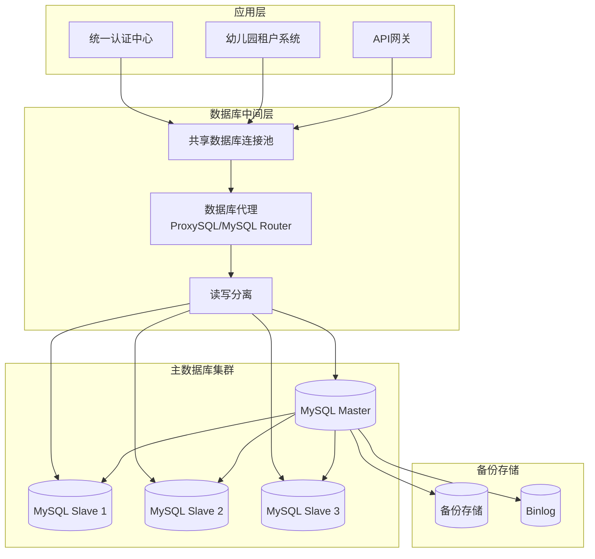
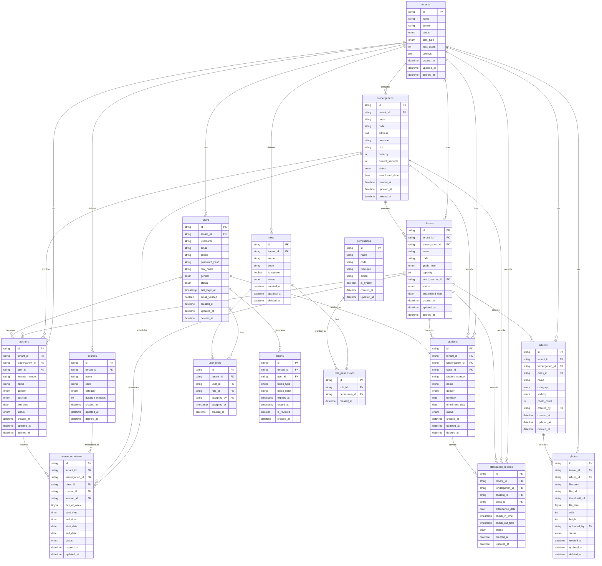

# 数据库设计和迁移指南

## 目录
- [数据库架构概述](#数据库架构概述)
- [多租户数据库设计](#多租户数据库设计)
- [统一认证中心数据库设计](#统一认证中心数据库设计)
- [幼儿园租户系统数据库设计](#幼儿园租户系统数据库设计)
- [数据库关系图](#数据库关系图)
- [索引设计](#索引设计)
- [数据分区策略](#数据分区策略)
- [数据库迁移](#数据库迁移)
- [数据库备份和恢复](#数据库备份和恢复)
- [性能优化](#性能优化)
- [数据安全](#数据安全)

## 数据库架构概述

### 架构原则

统一幼儿园管理系统采用多租户数据库架构，基于以下设计原则：

1. **数据隔离**: 每个租户的数据完全隔离，确保数据安全性
2. **共享资源**: 通过共享数据库连接池提高资源利用率
3. **水平扩展**: 支持数据库的水平扩展和读写分离
4. **高可用性**: 主从复制和故障转移机制
5. **性能优化**: 合理的索引设计和查询优化

### 数据库集群架构



## 多租户数据库设计

### 租户隔离策略

系统采用**共享数据库，共享表，租户字段隔离**的策略：

```sql
-- 所有业务表都包含租户ID字段
tenant_id VARCHAR(32) NOT NULL COMMENT '租户ID',
created_at TIMESTAMP DEFAULT CURRENT_TIMESTAMP COMMENT '创建时间',
updated_at TIMESTAMP DEFAULT CURRENT_TIMESTAMP ON UPDATE CURRENT_TIMESTAMP COMMENT '更新时间',
deleted_at TIMESTAMP NULL COMMENT '软删除时间'

-- 租户ID作为复合索引的第一列
INDEX idx_tenant_id (tenant_id),
INDEX idx_tenant_created (tenant_id, created_at)
```

### 租户表结构

**租户信息表:**
```sql
CREATE TABLE tenants (
    id VARCHAR(32) PRIMARY KEY COMMENT '租户ID',
    name VARCHAR(100) NOT NULL COMMENT '租户名称',
    domain VARCHAR(100) UNIQUE COMMENT '域名',
    status ENUM('active', 'inactive', 'suspended') DEFAULT 'active' COMMENT '状态',
    plan_type ENUM('basic', 'premium', 'enterprise') DEFAULT 'basic' COMMENT '套餐类型',
    max_users INT DEFAULT 100 COMMENT '最大用户数',
    max_storage INT DEFAULT 1073741824 COMMENT '最大存储空间(字节)',
    settings JSON COMMENT '租户配置',
    contact_email VARCHAR(100) COMMENT '联系邮箱',
    contact_phone VARCHAR(20) COMMENT '联系电话',
    expire_date DATETIME COMMENT '到期时间',
    created_at TIMESTAMP DEFAULT CURRENT_TIMESTAMP,
    updated_at TIMESTAMP DEFAULT CURRENT_TIMESTAMP ON UPDATE CURRENT_TIMESTAMP,
    deleted_at TIMESTAMP NULL,

    INDEX idx_domain (domain),
    INDEX idx_status (status),
    INDEX idx_expire_date (expire_date)
) ENGINE=InnoDB DEFAULT CHARSET=utf8mb4 COLLATE=utf8mb4_unicode_ci COMMENT='租户信息表';
```

## 统一认证中心数据库设计

### 用户管理

**用户表 (users):**
```sql
CREATE TABLE users (
    id VARCHAR(32) PRIMARY KEY COMMENT '用户ID',
    tenant_id VARCHAR(32) NOT NULL COMMENT '租户ID',
    username VARCHAR(50) NOT NULL COMMENT '用户名',
    email VARCHAR(100) NOT NULL COMMENT '邮箱',
    phone VARCHAR(20) COMMENT '手机号',
    password_hash VARCHAR(255) NOT NULL COMMENT '密码哈希',
    salt VARCHAR(32) NOT NULL COMMENT '密码盐值',
    avatar_url VARCHAR(255) COMMENT '头像URL',
    real_name VARCHAR(50) COMMENT '真实姓名',
    gender ENUM('male', 'female', 'unknown') DEFAULT 'unknown' COMMENT '性别',
    birthday DATE COMMENT '生日',
    status ENUM('active', 'inactive', 'locked') DEFAULT 'active' COMMENT '状态',
    last_login_at TIMESTAMP NULL COMMENT '最后登录时间',
    last_login_ip VARCHAR(45) COMMENT '最后登录IP',
    login_count INT DEFAULT 0 COMMENT '登录次数',
    email_verified BOOLEAN DEFAULT FALSE COMMENT '邮箱是否验证',
    phone_verified BOOLEAN DEFAULT FALSE COMMENT '手机是否验证',
    two_factor_enabled BOOLEAN DEFAULT FALSE COMMENT '是否启用双因子认证',
    two_factor_secret VARCHAR(32) COMMENT '双因子认证密钥',
    created_at TIMESTAMP DEFAULT CURRENT_TIMESTAMP,
    updated_at TIMESTAMP DEFAULT CURRENT_TIMESTAMP ON UPDATE CURRENT_TIMESTAMP,
    deleted_at TIMESTAMP NULL,

    UNIQUE KEY uk_tenant_username (tenant_id, username),
    UNIQUE KEY uk_tenant_email (tenant_id, email),
    UNIQUE KEY uk_phone (phone),
    INDEX idx_tenant_id (tenant_id),
    INDEX idx_status (status),
    INDEX idx_last_login (last_login_at)
) ENGINE=InnoDB DEFAULT CHARSET=utf8mb4 COLLATE=utf8mb4_unicode_ci COMMENT='用户表';
```

### 角色权限管理

**角色表 (roles):**
```sql
CREATE TABLE roles (
    id VARCHAR(32) PRIMARY KEY COMMENT '角色ID',
    tenant_id VARCHAR(32) NOT NULL COMMENT '租户ID',
    name VARCHAR(50) NOT NULL COMMENT '角色名称',
    code VARCHAR(50) NOT NULL COMMENT '角色代码',
    description TEXT COMMENT '角色描述',
    is_system BOOLEAN DEFAULT FALSE COMMENT '是否系统角色',
    sort_order INT DEFAULT 0 COMMENT '排序',
    status ENUM('active', 'inactive') DEFAULT 'active' COMMENT '状态',
    created_at TIMESTAMP DEFAULT CURRENT_TIMESTAMP,
    updated_at TIMESTAMP DEFAULT CURRENT_TIMESTAMP ON UPDATE CURRENT_TIMESTAMP,
    deleted_at TIMESTAMP NULL,

    UNIQUE KEY uk_tenant_code (tenant_id, code),
    INDEX idx_tenant_id (tenant_id),
    INDEX idx_status (status)
) ENGINE=InnoDB DEFAULT CHARSET=utf8mb4 COLLATE=utf8mb4_unicode_ci COMMENT='角色表';
```

**权限表 (permissions):**
```sql
CREATE TABLE permissions (
    id VARCHAR(32) PRIMARY KEY COMMENT '权限ID',
    name VARCHAR(100) NOT NULL COMMENT '权限名称',
    code VARCHAR(100) NOT NULL UNIQUE COMMENT '权限代码',
    resource VARCHAR(50) NOT NULL COMMENT '资源',
    action VARCHAR(50) NOT NULL COMMENT '操作',
    description TEXT COMMENT '权限描述',
    module VARCHAR(50) COMMENT '所属模块',
    is_system BOOLEAN DEFAULT FALSE COMMENT '是否系统权限',
    created_at TIMESTAMP DEFAULT CURRENT_TIMESTAMP,
    updated_at TIMESTAMP DEFAULT CURRENT_TIMESTAMP ON UPDATE CURRENT_TIMESTAMP,

    INDEX idx_resource_action (resource, action),
    INDEX idx_module (module)
) ENGINE=InnoDB DEFAULT CHARSET=utf8mb4 COLLATE=utf8mb4_unicode_ci COMMENT='权限表';
```

**用户角色关联表 (user_roles):**
```sql
CREATE TABLE user_roles (
    id VARCHAR(32) PRIMARY KEY COMMENT '关联ID',
    tenant_id VARCHAR(32) NOT NULL COMMENT '租户ID',
    user_id VARCHAR(32) NOT NULL COMMENT '用户ID',
    role_id VARCHAR(32) NOT NULL COMMENT '角色ID',
    assigned_by VARCHAR(32) COMMENT '分配人ID',
    assigned_at TIMESTAMP DEFAULT CURRENT_TIMESTAMP COMMENT '分配时间',
    expires_at TIMESTAMP NULL COMMENT '过期时间',
    created_at TIMESTAMP DEFAULT CURRENT_TIMESTAMP,

    UNIQUE KEY uk_user_role (user_id, role_id),
    FOREIGN KEY (user_id) REFERENCES users(id) ON DELETE CASCADE,
    FOREIGN KEY (role_id) REFERENCES roles(id) ON DELETE CASCADE,
    INDEX idx_tenant_id (tenant_id),
    INDEX idx_user_id (user_id),
    INDEX idx_role_id (role_id)
) ENGINE=InnoDB DEFAULT CHARSET=utf8mb4 COLLATE=utf8mb4_unicode_ci COMMENT='用户角色关联表';
```

**角色权限关联表 (role_permissions):**
```sql
CREATE TABLE role_permissions (
    id VARCHAR(32) PRIMARY KEY COMMENT '关联ID',
    role_id VARCHAR(32) NOT NULL COMMENT '角色ID',
    permission_id VARCHAR(32) NOT NULL COMMENT '权限ID',
    created_at TIMESTAMP DEFAULT CURRENT_TIMESTAMP,

    UNIQUE KEY uk_role_permission (role_id, permission_id),
    FOREIGN KEY (role_id) REFERENCES roles(id) ON DELETE CASCADE,
    FOREIGN KEY (permission_id) REFERENCES permissions(id) ON DELETE CASCADE,
    INDEX idx_role_id (role_id),
    INDEX idx_permission_id (permission_id)
) ENGINE=InnoDB DEFAULT CHARSET=utf8mb4 COLLATE=utf8mb4_unicode_ci COMMENT='角色权限关联表';
```

### JWT令牌管理

**令牌表 (tokens):**
```sql
CREATE TABLE tokens (
    id VARCHAR(32) PRIMARY KEY COMMENT '令牌ID',
    tenant_id VARCHAR(32) NOT NULL COMMENT '租户ID',
    user_id VARCHAR(32) NOT NULL COMMENT '用户ID',
    token_type ENUM('access', 'refresh', 'reset_password', 'email_verify') NOT NULL COMMENT '令牌类型',
    token_hash VARCHAR(255) NOT NULL COMMENT '令牌哈希',
    expires_at TIMESTAMP NOT NULL COMMENT '过期时间',
    issued_at TIMESTAMP DEFAULT CURRENT_TIMESTAMP COMMENT '签发时间',
    last_used_at TIMESTAMP NULL COMMENT '最后使用时间',
    device_info JSON COMMENT '设备信息',
    ip_address VARCHAR(45) COMMENT 'IP地址',
    user_agent TEXT COMMENT '用户代理',
    is_revoked BOOLEAN DEFAULT FALSE COMMENT '是否已撤销',
    revoked_at TIMESTAMP NULL COMMENT '撤销时间',
    revoked_reason VARCHAR(100) COMMENT '撤销原因',
    created_at TIMESTAMP DEFAULT CURRENT_TIMESTAMP,

    FOREIGN KEY (user_id) REFERENCES users(id) ON DELETE CASCADE,
    INDEX idx_tenant_id (tenant_id),
    INDEX idx_user_id (user_id),
    INDEX idx_token_type (token_type),
    INDEX idx_expires_at (expires_at),
    INDEX idx_token_hash (token_hash)
) ENGINE=InnoDB DEFAULT CHARSET=utf8mb4 COLLATE=utf8mb4_unicode_ci COMMENT='令牌表';
```

## 幼儿园租户系统数据库设计

### 园所管理

**幼儿园信息表 (kindergartens):**
```sql
CREATE TABLE kindergartens (
    id VARCHAR(32) PRIMARY KEY COMMENT '幼儿园ID',
    tenant_id VARCHAR(32) NOT NULL COMMENT '租户ID',
    name VARCHAR(100) NOT NULL COMMENT '幼儿园名称',
    code VARCHAR(50) NOT NULL COMMENT '幼儿园代码',
    license_number VARCHAR(50) COMMENT '办学许可证号',
    address TEXT COMMENT '地址',
    province VARCHAR(50) COMMENT '省份',
    city VARCHAR(50) COMMENT '城市',
    district VARCHAR(50) COMMENT '区县',
    longitude DECIMAL(10, 7) COMMENT '经度',
    latitude DECIMAL(10, 7) COMMENT '纬度',
    phone VARCHAR(20) COMMENT '联系电话',
    email VARCHAR(100) COMMENT '邮箱',
    principal_name VARCHAR(50) COMMENT '园长姓名',
    principal_phone VARCHAR(20) COMMENT '园长电话',
    capacity INT DEFAULT 0 COMMENT '容纳人数',
    current_students INT DEFAULT 0 COMMENT '在园人数',
    teachers_count INT DEFAULT 0 COMMENT '教师人数',
    classes_count INT DEFAULT 0 COMMENT '班级数',
    facilities JSON COMMENT '设施信息',
    photos JSON COMMENT '照片信息',
    description TEXT COMMENT '简介',
    status ENUM('active', 'inactive', 'pending') DEFAULT 'active' COMMENT '状态',
    established_date DATE COMMENT '成立日期',
    created_at TIMESTAMP DEFAULT CURRENT_TIMESTAMP,
    updated_at TIMESTAMP DEFAULT CURRENT_TIMESTAMP ON UPDATE CURRENT_TIMESTAMP,
    deleted_at TIMESTAMP NULL,

    UNIQUE KEY uk_tenant_code (tenant_id, code),
    INDEX idx_tenant_id (tenant_id),
    INDEX idx_status (status),
    INDEX idx_location (province, city, district)
) ENGINE=InnoDB DEFAULT CHARSET=utf8mb4 COLLATE=utf8mb4_unicode_ci COMMENT='幼儿园信息表';
```

### 班级管理

**班级表 (classes):**
```sql
CREATE TABLE classes (
    id VARCHAR(32) PRIMARY KEY COMMENT '班级ID',
    tenant_id VARCHAR(32) NOT NULL COMMENT '租户ID',
    kindergarten_id VARCHAR(32) NOT NULL COMMENT '幼儿园ID',
    name VARCHAR(50) NOT NULL COMMENT '班级名称',
    code VARCHAR(50) NOT NULL COMMENT '班级代码',
    grade_level ENUM('nursery', 'k1', 'k2', 'k3', 'mixed') NOT NULL COMMENT '年级',
    room_number VARCHAR(20) COMMENT '教室号',
    capacity INT DEFAULT 30 COMMENT '容纳人数',
    current_students INT DEFAULT 0 COMMENT '当前人数',
    head_teacher_id VARCHAR(32) COMMENT '班主任ID',
    assistant_teacher_id VARCHAR(32) COMMENT '助教ID',
    schedule JSON COMMENT '课程安排',
    age_range VARCHAR(20) COMMENT '年龄范围',
    tuition_fee DECIMAL(10, 2) COMMENT '学费',
    description TEXT COMMENT '班级描述',
    status ENUM('active', 'inactive', 'graduated') DEFAULT 'active' COMMENT '状态',
    established_date DATE COMMENT '开班日期',
    graduation_date DATE COMMENT '毕业日期',
    created_at TIMESTAMP DEFAULT CURRENT_TIMESTAMP,
    updated_at TIMESTAMP DEFAULT CURRENT_TIMESTAMP ON UPDATE CURRENT_TIMESTAMP,
    deleted_at TIMESTAMP NULL,

    UNIQUE KEY uk_tenant_kindergarten_code (tenant_id, kindergarten_id, code),
    FOREIGN KEY (kindergarten_id) REFERENCES kindergartens(id) ON DELETE CASCADE,
    INDEX idx_tenant_id (tenant_id),
    INDEX idx_kindergarten_id (kindergarten_id),
    INDEX idx_grade_level (grade_level),
    INDEX idx_head_teacher (head_teacher_id),
    INDEX idx_status (status)
) ENGINE=InnoDB DEFAULT CHARSET=utf8mb4 COLLATE=utf8mb4_unicode_ci COMMENT='班级表';
```

### 学生管理

**学生表 (students):**
```sql
CREATE TABLE students (
    id VARCHAR(32) PRIMARY KEY COMMENT '学生ID',
    tenant_id VARCHAR(32) NOT NULL COMMENT '租户ID',
    kindergarten_id VARCHAR(32) NOT NULL COMMENT '幼儿园ID',
    class_id VARCHAR(32) NOT NULL COMMENT '班级ID',
    student_number VARCHAR(20) NOT NULL COMMENT '学号',
    name VARCHAR(50) NOT NULL COMMENT '姓名',
    nickname VARCHAR(50) COMMENT '小名',
    gender ENUM('male', 'female') NOT NULL COMMENT '性别',
    birthday DATE NOT NULL COMMENT '生日',
    id_number VARCHAR(18) COMMENT '身份证号',
    blood_type ENUM('A', 'B', 'AB', 'O', 'unknown') DEFAULT 'unknown' COMMENT '血型',
    avatar_url VARCHAR(255) COMMENT '头像URL',
    address TEXT COMMENT '家庭地址',
    emergency_contact JSON COMMENT '紧急联系人',
    medical_info JSON COMMENT '医疗信息',
    allergies TEXT COMMENT '过敏史',
    special_needs TEXT COMMENT '特殊需求',
    enrollment_date DATE NOT NULL COMMENT '入学日期',
    graduation_date DATE COMMENT '毕业日期',
    status ENUM('active', 'inactive', 'graduated', 'transferred') DEFAULT 'active' COMMENT '状态',
    parent_ids JSON COMMENT '家长ID列表',
    notes TEXT COMMENT '备注',
    created_at TIMESTAMP DEFAULT CURRENT_TIMESTAMP,
    updated_at TIMESTAMP DEFAULT CURRENT_TIMESTAMP ON UPDATE CURRENT_TIMESTAMP,
    deleted_at TIMESTAMP NULL,

    UNIQUE KEY uk_tenant_student_number (tenant_id, student_number),
    FOREIGN KEY (kindergarten_id) REFERENCES kindergartens(id) ON DELETE CASCADE,
    FOREIGN KEY (class_id) REFERENCES classes(id) ON DELETE CASCADE,
    INDEX idx_tenant_id (tenant_id),
    INDEX idx_kindergarten_id (kindergarten_id),
    INDEX idx_class_id (class_id),
    INDEX idx_name (name),
    INDEX idx_gender (gender),
    INDEX idx_status (status),
    INDEX idx_enrollment_date (enrollment_date)
) ENGINE=InnoDB DEFAULT CHARSET=utf8mb4 COLLATE=utf8mb4_unicode_ci COMMENT='学生表';
```

### 教师管理

**教师表 (teachers):**
```sql
CREATE TABLE teachers (
    id VARCHAR(32) PRIMARY KEY COMMENT '教师ID',
    tenant_id VARCHAR(32) NOT NULL COMMENT '租户ID',
    kindergarten_id VARCHAR(32) NOT NULL COMMENT '幼儿园ID',
    user_id VARCHAR(32) NOT NULL COMMENT '关联用户ID',
    teacher_number VARCHAR(20) NOT NULL COMMENT '教师编号',
    name VARCHAR(50) NOT NULL COMMENT '姓名',
    gender ENUM('male', 'female') NOT NULL COMMENT '性别',
    birthday DATE COMMENT '生日',
    id_number VARCHAR(18) COMMENT '身份证号',
    phone VARCHAR(20) NOT NULL COMMENT '手机号',
    email VARCHAR(100) COMMENT '邮箱',
    avatar_url VARCHAR(255) COMMENT '头像URL',
    address TEXT COMMENT '地址',
    education ENUM('high_school', 'college', 'bachelor', 'master', 'doctor') COMMENT '学历',
    major VARCHAR(100) COMMENT '专业',
    qualification VARCHAR(100) COMMENT '教师资格证',
    experience_years INT DEFAULT 0 COMMENT '教学经验年限',
    specialties JSON COMMENT '专业特长',
    join_date DATE NOT NULL COMMENT '入职日期',
    position ENUM('teacher', 'head_teacher', 'director', 'principal', 'other') DEFAULT 'teacher' COMMENT '职位',
    department VARCHAR(50) COMMENT '部门',
    salary DECIMAL(10, 2) COMMENT '薪资',
    status ENUM('active', 'inactive', 'resigned') DEFAULT 'active' COMMENT '状态',
    resign_date DATE COMMENT '离职日期',
    performance_score DECIMAL(3, 1) DEFAULT 0.0 COMMENT '绩效评分',
    notes TEXT COMMENT '备注',
    created_at TIMESTAMP DEFAULT CURRENT_TIMESTAMP,
    updated_at TIMESTAMP DEFAULT CURRENT_TIMESTAMP ON UPDATE CURRENT_TIMESTAMP,
    deleted_at TIMESTAMP NULL,

    UNIQUE KEY uk_tenant_teacher_number (tenant_id, teacher_number),
    UNIQUE KEY uk_user_id (user_id),
    FOREIGN KEY (kindergarten_id) REFERENCES kindergartens(id) ON DELETE CASCADE,
    INDEX idx_tenant_id (tenant_id),
    INDEX idx_kindergarten_id (kindergarten_id),
    INDEX idx_name (name),
    INDEX idx_position (position),
    INDEX idx_status (status),
    INDEX idx_join_date (join_date)
) ENGINE=InnoDB DEFAULT CHARSET=utf8mb4 COLLATE=utf8mb4_unicode_ci COMMENT='教师表';
```

### 考勤管理

**考勤记录表 (attendance_records):**
```sql
CREATE TABLE attendance_records (
    id VARCHAR(32) PRIMARY KEY COMMENT '考勤记录ID',
    tenant_id VARCHAR(32) NOT NULL COMMENT '租户ID',
    kindergarten_id VARCHAR(32) NOT NULL COMMENT '幼儿园ID',
    student_id VARCHAR(32) NOT NULL COMMENT '学生ID',
    class_id VARCHAR(32) NOT NULL COMMENT '班级ID',
    attendance_date DATE NOT NULL COMMENT '考勤日期',
    check_in_time TIMESTAMP NULL COMMENT '签到时间',
    check_out_time TIMESTAMP NULL COMMENT '签退时间',
    check_in_method ENUM('manual', 'face', 'card', 'fingerprint', 'parent') COMMENT '签到方式',
    check_out_method ENUM('manual', 'face', 'card', 'fingerprint', 'parent') COMMENT '签退方式',
    check_in_by VARCHAR(32) COMMENT '签到操作人',
    check_out_by VARCHAR(32) COMMENT '签退操作人',
    status ENUM('present', 'absent', 'late', 'early_leave', 'sick_leave', 'personal_leave') NOT NULL COMMENT '考勤状态',
    late_minutes INT DEFAULT 0 COMMENT '迟到分钟数',
    early_leave_minutes INT DEFAULT 0 COMMENT '早退分钟数',
    leave_type ENUM('sick', 'personal', 'maternity', 'other') COMMENT '请假类型',
    leave_reason TEXT COMMENT '请假原因',
    leave_approved_by VARCHAR(32) COMMENT '请假批准人',
    temperature DECIMAL(3, 1) COMMENT '体温',
    health_status VARCHAR(100) COMMENT '健康状况',
    notes TEXT COMMENT '备注',
    created_at TIMESTAMP DEFAULT CURRENT_TIMESTAMP,
    updated_at TIMESTAMP DEFAULT CURRENT_TIMESTAMP ON UPDATE CURRENT_TIMESTAMP,

    UNIQUE KEY uk_student_date (student_id, attendance_date),
    FOREIGN KEY (student_id) REFERENCES students(id) ON DELETE CASCADE,
    FOREIGN KEY (class_id) REFERENCES classes(id) ON DELETE CASCADE,
    INDEX idx_tenant_id (tenant_id),
    INDEX idx_kindergarten_id (kindergarten_id),
    INDEX idx_class_id (class_id),
    INDEX idx_attendance_date (attendance_date),
    INDEX idx_status (status),
    INDEX idx_check_in_time (check_in_time)
) ENGINE=InnoDB DEFAULT CHARSET=utf8mb4 COLLATE=utf8mb4_unicode_ci COMMENT='考勤记录表';
```

### 课程管理

**课程表 (courses):**
```sql
CREATE TABLE courses (
    id VARCHAR(32) PRIMARY KEY COMMENT '课程ID',
    tenant_id VARCHAR(32) NOT NULL COMMENT '租户ID',
    name VARCHAR(100) NOT NULL COMMENT '课程名称',
    code VARCHAR(50) NOT NULL COMMENT '课程代码',
    category ENUM('language', 'math', 'science', 'art', 'music', 'sports', 'social', 'life', 'other') NOT NULL COMMENT '课程类别',
    description TEXT COMMENT '课程描述',
    duration_minutes INT DEFAULT 30 COMMENT '课程时长(分钟)',
    age_range VARCHAR(20) COMMENT '适用年龄',
    max_students INT DEFAULT 30 COMMENT '最大学生数',
    materials JSON COMMENT '教学材料',
    objectives JSON COMMENT '教学目标',
    activities JSON COMMENT '活动安排',
    assessment_criteria JSON COMMENT '评估标准',
    teacher_id VARCHAR(32) COMMENT '默认教师ID',
    color VARCHAR(7) COMMENT '课程颜色',
    icon_url VARCHAR(255) COMMENT '课程图标',
    status ENUM('active', 'inactive') DEFAULT 'active' COMMENT '状态',
    created_by VARCHAR(32) COMMENT '创建人',
    created_at TIMESTAMP DEFAULT CURRENT_TIMESTAMP,
    updated_at TIMESTAMP DEFAULT CURRENT_TIMESTAMP ON UPDATE CURRENT_TIMESTAMP,
    deleted_at TIMESTAMP NULL,

    UNIQUE KEY uk_tenant_code (tenant_id, code),
    INDEX idx_tenant_id (tenant_id),
    INDEX idx_category (category),
    INDEX idx_teacher_id (teacher_id),
    INDEX idx_status (status)
) ENGINE=InnoDB DEFAULT CHARSET=utf8mb4 COLLATE=utf8mb4_unicode_ci COMMENT='课程表';
```

**课程安排表 (course_schedules):**
```sql
CREATE TABLE course_schedules (
    id VARCHAR(32) PRIMARY KEY COMMENT '安排ID',
    tenant_id VARCHAR(32) NOT NULL COMMENT '租户ID',
    kindergarten_id VARCHAR(32) NOT NULL COMMENT '幼儿园ID',
    class_id VARCHAR(32) NOT NULL COMMENT '班级ID',
    course_id VARCHAR(32) NOT NULL COMMENT '课程ID',
    teacher_id VARCHAR(32) NOT NULL COMMENT '教师ID',
    day_of_week TINYINT NOT NULL COMMENT '星期几(1-7)',
    start_time TIME NOT NULL COMMENT '开始时间',
    end_time TIME NOT NULL COMMENT '结束时间',
    classroom VARCHAR(50) COMMENT '教室',
    semester VARCHAR(20) COMMENT '学期',
    start_date DATE NOT NULL COMMENT '开始日期',
    end_date DATE NOT NULL COMMENT '结束日期',
    is_recurring BOOLEAN DEFAULT TRUE COMMENT '是否循环',
    recurrence_pattern JSON COMMENT '循环模式',
    max_students INT DEFAULT 30 COMMENT '最大学生数',
    current_students INT DEFAULT 0 COMMENT '当前学生数',
    status ENUM('active', 'inactive', 'completed', 'cancelled') DEFAULT 'active' COMMENT '状态',
    notes TEXT COMMENT '备注',
    created_at TIMESTAMP DEFAULT CURRENT_TIMESTAMP,
    updated_at TIMESTAMP DEFAULT CURRENT_TIMESTAMP ON UPDATE CURRENT_TIMESTAMP,
    deleted_at TIMESTAMP NULL,

    FOREIGN KEY (class_id) REFERENCES classes(id) ON DELETE CASCADE,
    FOREIGN KEY (course_id) REFERENCES courses(id) ON DELETE CASCADE,
    FOREIGN KEY (teacher_id) REFERENCES teachers(id) ON DELETE CASCADE,
    INDEX idx_tenant_id (tenant_id),
    INDEX idx_kindergarten_id (kindergarten_id),
    INDEX idx_class_id (class_id),
    INDEX idx_course_id (course_id),
    INDEX idx_teacher_id (teacher_id),
    INDEX idx_day_time (day_of_week, start_time),
    INDEX idx_date_range (start_date, end_date),
    INDEX idx_status (status)
) ENGINE=InnoDB DEFAULT CHARSET=utf8mb4 COLLATE=utf8mb4_unicode_ci COMMENT='课程安排表';
```

### 照片相册管理

**相册表 (albums):**
```sql
CREATE TABLE albums (
    id VARCHAR(32) PRIMARY KEY COMMENT '相册ID',
    tenant_id VARCHAR(32) NOT NULL COMMENT '租户ID',
    kindergarten_id VARCHAR(32) NOT NULL COMMENT '幼儿园ID',
    class_id VARCHAR(32) COMMENT '班级ID',
    name VARCHAR(100) NOT NULL COMMENT '相册名称',
    description TEXT COMMENT '相册描述',
    cover_photo_url VARCHAR(255) COMMENT '封面照片',
    category ENUM('daily', 'activity', 'holiday', 'graduation', 'sports', 'art', 'other') DEFAULT 'daily' COMMENT '相册类别',
    visibility ENUM('public', 'class_only', 'teacher_only', 'private') DEFAULT 'public' COMMENT '可见性',
    allow_comments BOOLEAN DEFAULT TRUE COMMENT '允许评论',
    allow_download BOOLEAN DEFAULT TRUE COMMENT '允许下载',
    photo_count INT DEFAULT 0 COMMENT '照片数量',
    view_count INT DEFAULT 0 COMMENT '浏览次数',
    created_by VARCHAR(32) NOT NULL COMMENT '创建人ID',
    created_at TIMESTAMP DEFAULT CURRENT_TIMESTAMP,
    updated_at TIMESTAMP DEFAULT CURRENT_TIMESTAMP ON UPDATE CURRENT_TIMESTAMP,
    deleted_at TIMESTAMP NULL,

    FOREIGN KEY (class_id) REFERENCES classes(id) ON DELETE CASCADE,
    INDEX idx_tenant_id (tenant_id),
    INDEX idx_kindergarten_id (kindergarten_id),
    INDEX idx_class_id (class_id),
    INDEX idx_category (category),
    INDEX idx_created_by (created_by),
    INDEX idx_created_at (created_at)
) ENGINE=InnoDB DEFAULT CHARSET=utf8mb4 COLLATE=utf8mb4_unicode_ci COMMENT='相册表';
```

**照片表 (photos):**
```sql
CREATE TABLE photos (
    id VARCHAR(32) PRIMARY KEY COMMENT '照片ID',
    tenant_id VARCHAR(32) NOT NULL COMMENT '租户ID',
    album_id VARCHAR(32) NOT NULL COMMENT '相册ID',
    filename VARCHAR(255) NOT NULL COMMENT '文件名',
    original_filename VARCHAR(255) COMMENT '原始文件名',
    file_path VARCHAR(500) NOT NULL COMMENT '文件路径',
    file_url VARCHAR(500) NOT NULL COMMENT '访问URL',
    thumbnail_url VARCHAR(500) COMMENT '缩略图URL',
    file_size BIGINT COMMENT '文件大小(字节)',
    mime_type VARCHAR(50) COMMENT 'MIME类型',
    width INT COMMENT '图片宽度',
    height INT COMMENT '图片高度',
    exif JSON COMMENT 'EXIF信息',
    description TEXT COMMENT '照片描述',
    tags JSON COMMENT '标签',
    location JSON COMMENT '位置信息',
    camera_info JSON COMMENT '相机信息',
    taken_at TIMESTAMP NULL COMMENT '拍摄时间',
    uploaded_by VARCHAR(32) NOT NULL COMMENT '上传人ID',
    view_count INT DEFAULT 0 COMMENT '浏览次数',
    like_count INT DEFAULT 0 COMMENT '点赞次数',
    comment_count INT DEFAULT 0 COMMENT '评论次数',
    download_count INT DEFAULT 0 COMMENT '下载次数',
    status ENUM('processing', 'active', 'hidden', 'deleted') DEFAULT 'processing' COMMENT '状态',
    created_at TIMESTAMP DEFAULT CURRENT_TIMESTAMP,
    updated_at TIMESTAMP DEFAULT CURRENT_TIMESTAMP ON UPDATE CURRENT_TIMESTAMP,
    deleted_at TIMESTAMP NULL,

    FOREIGN KEY (album_id) REFERENCES albums(id) ON DELETE CASCADE,
    INDEX idx_tenant_id (tenant_id),
    INDEX idx_album_id (album_id),
    INDEX idx_uploaded_by (uploaded_by),
    INDEX idx_taken_at (taken_at),
    INDEX idx_status (status),
    INDEX idx_created_at (created_at)
) ENGINE=InnoDB DEFAULT CHARSET=utf8mb4 COLLATE=utf8mb4_unicode_ci COMMENT='照片表';
```

## 数据库关系图



## 索引设计

### 主要索引策略

1. **主键索引**: 所有表都有主键索引
2. **租户索引**: 所有表都有 tenant_id 索引作为复合索引的第一列
3. **外键索引**: 所有外键字段都有索引
4. **查询索引**: 根据常用查询条件创建复合索引
5. **时间索引**: 创建时间字段都有索引用于范围查询

### 具体索引设计

**用户表索引:**
```sql
-- 唯一索引
ALTER TABLE users ADD UNIQUE INDEX uk_tenant_username (tenant_id, username);
ALTER TABLE users ADD UNIQUE INDEX uk_tenant_email (tenant_id, email);

-- 复合索引
ALTER TABLE users ADD INDEX idx_tenant_status (tenant_id, status);
ALTER TABLE users ADD INDEX idx_tenant_last_login (tenant_id, last_login_at);

-- 单列索引
ALTER TABLE users ADD INDEX idx_phone (phone);
```

**学生表索引:**
```sql
-- 唯一索引
ALTER TABLE students ADD UNIQUE INDEX uk_tenant_student_number (tenant_id, student_number);

-- 复合索引
ALTER TABLE students ADD INDEX idx_class_status (class_id, status);
ALTER TABLE students ADD INDEX idx_tenant_kindergarten (tenant_id, kindergarten_id);
ALTER TABLE students ADD INDEX idx_name_gender (name, gender);

-- 时间索引
ALTER TABLE students ADD INDEX idx_enrollment_date (enrollment_date);
ALTER TABLE students ADD INDEX idx_birthday (birthday);
```

**考勤记录表索引:**
```sql
-- 唯一索引
ALTER TABLE attendance_records ADD UNIQUE INDEX uk_student_date (student_id, attendance_date);

-- 复合索引
ALTER TABLE attendance_records ADD INDEX idx_class_date_status (class_id, attendance_date, status);
ALTER TABLE attendance_records ADD INDEX idx_tenant_date (tenant_id, attendance_date);

-- 时间索引
ALTER TABLE attendance_records ADD INDEX idx_check_in_time (check_in_time);
ALTER TABLE attendance_records ADD INDEX idx_attendance_date (attendance_date);
```

## 数据分区策略

### 分区表设计

对于大数据量的表，采用分区策略提高查询性能：

**考勤记录表分区:**
```sql
-- 按月分区
ALTER TABLE attendance_records
PARTITION BY RANGE (YEAR(attendance_date) * 100 + MONTH(attendance_date)) (
    PARTITION p202401 VALUES LESS THAN (202402),
    PARTITION p202402 VALUES LESS THAN (202403),
    PARTITION p202403 VALUES LESS THAN (202404),
    PARTITION p202404 VALUES LESS THAN (202405),
    PARTITION p202405 VALUES LESS THAN (202406),
    PARTITION p202406 VALUES LESS THAN (202407),
    PARTITION p202407 VALUES LESS THAN (202408),
    PARTITION p202408 VALUES LESS THAN (202409),
    PARTITION p202409 VALUES LESS THAN (202410),
    PARTITION p202410 VALUES LESS THAN (202411),
    PARTITION p202411 VALUES LESS THAN (202412),
    PARTITION p202412 VALUES LESS THAN (202501),
    PARTITION p_future VALUES LESS THAN MAXVALUE
);
```

**照片表分区:**
```sql
-- 按月分区
ALTER TABLE photos
PARTITION BY RANGE (YEAR(created_at) * 100 + MONTH(created_at)) (
    PARTITION p202401 VALUES LESS THAN (202402),
    PARTITION p202402 VALUES LESS THAN (202403),
    PARTITION p202403 VALUES LESS THAN (202404),
    -- ... 更多分区
    PARTITION p_future VALUES LESS THAN MAXVALUE
);
```

## 数据库迁移

### TypeORM迁移文件

**迁移文件示例:**
```typescript
// src/migrations/001_CreateTenantsTable.ts
import { MigrationInterface, QueryRunner, Table, Index } from 'typeorm';

export class CreateTenantsTable1234567890 implements MigrationInterface {
    name = 'CreateTenantsTable1234567890';

    public async up(queryRunner: QueryRunner): Promise<void> {
        await queryRunner.createTable(
            new Table({
                name: 'tenants',
                columns: [
                    {
                        name: 'id',
                        type: 'varchar',
                        length: '32',
                        isPrimary: true,
                        comment: '租户ID'
                    },
                    {
                        name: 'name',
                        type: 'varchar',
                        length: '100',
                        comment: '租户名称'
                    },
                    {
                        name: 'domain',
                        type: 'varchar',
                        length: '100',
                        isUnique: true,
                        comment: '域名'
                    },
                    {
                        name: 'status',
                        type: 'enum',
                        enum: ['active', 'inactive', 'suspended'],
                        default: '"active"',
                        comment: '状态'
                    },
                    {
                        name: 'plan_type',
                        type: 'enum',
                        enum: ['basic', 'premium', 'enterprise'],
                        default: '"basic"',
                        comment: '套餐类型'
                    },
                    {
                        name: 'max_users',
                        type: 'int',
                        default: 100,
                        comment: '最大用户数'
                    },
                    {
                        name: 'settings',
                        type: 'json',
                        isNullable: true,
                        comment: '租户配置'
                    },
                    {
                        name: 'created_at',
                        type: 'timestamp',
                        default: 'CURRENT_TIMESTAMP',
                        comment: '创建时间'
                    },
                    {
                        name: 'updated_at',
                        type: 'timestamp',
                        default: 'CURRENT_TIMESTAMP ON UPDATE CURRENT_TIMESTAMP',
                        comment: '更新时间'
                    },
                    {
                        name: 'deleted_at',
                        type: 'timestamp',
                        isNullable: true,
                        comment: '软删除时间'
                    }
                ]
            }),
            true
        );

        // 创建索引
        await queryRunner.createIndex(
            'tenants',
            new Index('idx_domain', ['domain'])
        );

        await queryRunner.createIndex(
            'tenants',
            new Index('idx_status', ['status'])
        );
    }

    public async down(queryRunner: QueryRunner): Promise<void> {
        await queryRunner.dropTable('tenants');
    }
}
```

### 数据库初始化脚本

**init.sql:**
```sql
-- 创建数据库
CREATE DATABASE IF NOT EXISTS kindergarten CHARACTER SET utf8mb4 COLLATE utf8mb4_unicode_ci;

-- 使用数据库
USE kindergarten;

-- 创建用户
CREATE USER IF NOT EXISTS 'app_user'@'%' IDENTIFIED BY 'secure_password';
GRANT ALL PRIVILEGES ON kindergarten.* TO 'app_user'@'%';
FLUSH PRIVILEGES;

-- 创建只读用户
CREATE USER IF NOT EXISTS 'readonly_user'@'%' IDENTIFIED BY 'readonly_password';
GRANT SELECT ON kindergarten.* TO 'readonly_user'@'%';
FLUSH PRIVILEGES;

-- 设置时区
SET time_zone = '+8:00';
```

### 数据填充脚本

**seeds/001_system_data.sql:**
```sql
-- 插入系统权限
INSERT INTO permissions (id, name, code, resource, action, module, is_system) VALUES
-- 用户管理权限
('perm_001', '查看用户', 'user.read', 'user', 'read', 'user', TRUE),
('perm_002', '创建用户', 'user.create', 'user', 'create', 'user', TRUE),
('perm_003', '更新用户', 'user.update', 'user', 'update', 'user', TRUE),
('perm_004', '删除用户', 'user.delete', 'user', 'delete', 'user', TRUE),

-- 学生管理权限
('perm_005', '查看学生', 'student.read', 'student', 'read', 'student', TRUE),
('perm_006', '创建学生', 'student.create', 'student', 'create', 'student', TRUE),
('perm_007', '更新学生', 'student.update', 'student', 'update', 'student', TRUE),
('perm_008', '删除学生', 'student.delete', 'student', 'delete', 'student', TRUE),

-- 考勤管理权限
('perm_009', '查看考勤', 'attendance.read', 'attendance', 'read', 'attendance', TRUE),
('perm_010', '考勤签到', 'attendance.checkin', 'attendance', 'checkin', 'attendance', TRUE),
('perm_011', '考勤签退', 'attendance.checkout', 'attendance', 'checkout', 'attendance', TRUE),

-- 相册管理权限
('perm_012', '查看相册', 'album.read', 'album', 'read', 'album', TRUE),
('perm_013', '创建相册', 'album.create', 'album', 'create', 'album', TRUE),
('perm_014', '上传照片', 'photo.upload', 'photo', 'upload', 'album', TRUE);

-- 插入系统角色
INSERT INTO roles (id, tenant_id, name, code, description, is_system, status) VALUES
('role_admin', 'system', '系统管理员', 'admin', '系统管理员，拥有所有权限', TRUE, 'active'),
('role_teacher', 'system', '教师', 'teacher', '教师角色，可管理学生和考勤', TRUE, 'active'),
('role_parent', 'system', '家长', 'parent', '家长角色，可查看孩子信息', TRUE, 'active');

-- 分配权限给角色
INSERT INTO role_permissions (id, role_id, permission_id) VALUES
-- 管理员权限
('rp_001', 'role_admin', 'perm_001'), ('rp_002', 'role_admin', 'perm_002'),
('rp_003', 'role_admin', 'perm_003'), ('rp_004', 'role_admin', 'perm_004'),
('rp_005', 'role_admin', 'perm_005'), ('rp_006', 'role_admin', 'perm_006'),
('rp_007', 'role_admin', 'perm_007'), ('rp_008', 'role_admin', 'perm_008'),
('rp_009', 'role_admin', 'perm_009'), ('rp_010', 'role_admin', 'perm_010'),
('rp_011', 'role_admin', 'perm_011'), ('rp_012', 'role_admin', 'perm_012'),
('rp_013', 'role_admin', 'perm_013'), ('rp_014', 'role_admin', 'perm_014'),

-- 教师权限
('rp_015', 'role_teacher', 'perm_005'), ('rp_016', 'role_teacher', 'perm_006'),
('rp_017', 'role_teacher', 'perm_007'), ('rp_018', 'role_teacher', 'perm_009'),
('rp_019', 'role_teacher', 'perm_010'), ('rp_020', 'role_teacher', 'perm_011'),
('rp_021', 'role_teacher', 'perm_012'), ('rp_022', 'role_teacher', 'perm_013'),
('rp_023', 'role_teacher', 'perm_014'),

-- 家长权限
('rp_024', 'role_parent', 'perm_005'), ('rp_025', 'role_parent', 'perm_009'),
('rp_026', 'role_parent', 'perm_012');
```

### 迁移执行脚本

**scripts/migrate.sh:**
```bash
#!/bin/bash

set -e

# 配置
DB_HOST=${DB_HOST:-localhost}
DB_PORT=${DB_PORT:-3306}
DB_USERNAME=${DB_USERNAME:-app_user}
DB_PASSWORD=${DB_PASSWORD:-secure_password}
DB_DATABASE=${DB_DATABASE:-kindergarten}

# 构建数据库连接字符串
DB_URL="mysql://${DB_USERNAME}:${DB_PASSWORD}@${DB_HOST}:${DB_PORT}/${DB_DATABASE}"

echo "开始数据库迁移..."

# 运行TypeORM迁移
npm run migration:run

# 运行数据填充
if [ "$ENVIRONMENT" = "development" ] || [ "$ENVIRONMENT" = "testing" ]; then
    echo "运行数据填充..."
    npm run seed
fi

echo "数据库迁移完成"
```

## 数据库备份和恢复

### 备份策略

1. **全量备份**: 每日凌晨进行全量备份
2. **增量备份**: 每小时进行增量备份
3. **Binlog备份**: 实时备份二进制日志
4. **异地备份**: 定期同步到异地存储

### 备份脚本

**scripts/backup.sh:**
```bash
#!/bin/bash

set -e

# 配置
DB_HOST=${DB_HOST:-localhost}
DB_PORT=${DB_PORT:-3306}
DB_USERNAME=${DB_USERNAME:-app_user}
DB_PASSWORD=${DB_PASSWORD:-secure_password}
DB_DATABASE=${DB_DATABASE:-kindergarten}
BACKUP_DIR=${BACKUP_DIR:-/backup/mysql}
DATE=$(date +%Y%m%d_%H%M%S)
BACKUP_FILE="${DB_DATABASE}_${DATE}.sql"
RETENTION_DAYS=7

# 创建备份目录
mkdir -p ${BACKUP_DIR}

echo "开始备份数据库: ${DB_DATABASE}"

# 执行备份
mysqldump \
    --host=${DB_HOST} \
    --port=${DB_PORT} \
    --user=${DB_USERNAME} \
    --password=${DB_PASSWORD} \
    --single-transaction \
    --routines \
    --triggers \
    --events \
    --hex-blob \
    --default-character-set=utf8mb4 \
    ${DB_DATABASE} > ${BACKUP_DIR}/${BACKUP_FILE}

# 压缩备份文件
gzip ${BACKUP_DIR}/${BACKUP_FILE}

echo "备份完成: ${BACKUP_DIR}/${BACKUP_FILE}.gz"

# 清理旧备份
find ${BACKUP_DIR} -name "${DB_DATABASE}_*.sql.gz" -mtime +${RETENTION_DAYS} -delete

echo "清理完成，保留最近 ${RETENTION_DAYS} 天的备份"
```

### 恢复脚本

**scripts/restore.sh:**
```bash
#!/bin/bash

set -e

# 参数检查
if [ $# -ne 1 ]; then
    echo "用法: $0 <backup_file>"
    echo "示例: $0 /backup/mysql/kindergarten_20241201_020000.sql.gz"
    exit 1
fi

BACKUP_FILE=$1

# 配置
DB_HOST=${DB_HOST:-localhost}
DB_PORT=${DB_PORT:-3306}
DB_USERNAME=${DB_USERNAME:-app_user}
DB_PASSWORD=${DB_PASSWORD:-secure_password}
DB_DATABASE=${DB_DATABASE:-kindergarten}

# 检查备份文件
if [ ! -f ${BACKUP_FILE} ]; then
    echo "错误: 备份文件不存在: ${BACKUP_FILE}"
    exit 1
fi

echo "开始恢复数据库: ${DB_DATABASE}"
echo "备份文件: ${BACKUP_FILE}"

# 确认恢复
read -p "警告: 此操作将覆盖现有数据库，是否继续? (y/N): " confirm
if [ "${confirm}" != "y" ] && [ "${confirm}" != "Y" ]; then
    echo "恢复操作已取消"
    exit 1
fi

# 创建数据库备份
BACKUP_DB="${DB_DATABASE}_backup_$(date +%Y%m%d_%H%M%S)"
mysql -h${DB_HOST} -P${DB_PORT} -u${DB_USERNAME} -p${DB_PASSWORD} -e "CREATE DATABASE IF NOT EXISTS ${BACKUP_DB}"
mysqldump -h${DB_HOST} -P${DB_PORT} -u${DB_USERNAME} -p${DB_PASSWORD} ${DB_DATABASE} | mysql -h${DB_HOST} -P${DB_PORT} -u${DB_USERNAME} -p${DB_PASSWORD} ${BACKUP_DB}

echo "现有数据库已备份到: ${BACKUP_DB}"

# 删除现有数据库
mysql -h${DB_HOST} -P${DB_PORT} -u${DB_USERNAME} -p${DB_PASSWORD} -e "DROP DATABASE IF EXISTS ${DB_DATABASE}"

# 创建新数据库
mysql -h${DB_HOST} -P${DB_PORT} -u${DB_USERNAME} -p${DB_PASSWORD} -e "CREATE DATABASE ${DB_DATABASE} CHARACTER SET utf8mb4 COLLATE utf8mb4_unicode_ci"

# 恢复数据
if [[ ${BACKUP_FILE} == *.gz ]]; then
    gunzip -c ${BACKUP_FILE} | mysql -h${DB_HOST} -P${DB_PORT} -u${DB_USERNAME} -p${DB_PASSWORD} ${DB_DATABASE}
else
    mysql -h${DB_HOST} -P${DB_PORT} -u${DB_USERNAME} -p${DB_PASSWORD} ${DB_DATABASE} < ${BACKUP_FILE}
fi

echo "数据库恢复完成"
```

## 性能优化

### 查询优化

1. **避免全表扫描**: 确保查询使用索引
2. **优化JOIN查询**: 合理使用外键和索引
3. **分页查询**: 使用LIMIT进行分页
4. **缓存热点数据**: 使用Redis缓存常用数据

### 慢查询监控

**启用慢查询日志:**
```sql
-- 启用慢查询日志
SET GLOBAL slow_query_log = 'ON';
SET GLOBAL long_query_time = 2; -- 2秒以上的查询记录
SET GLOBAL slow_query_log_file = '/var/log/mysql/slow.log';
```

**分析慢查询:**
```bash
# 使用mysqldumpslow分析
mysqldumpslow /var/log/mysql/slow.log

# 使用pt-query-digest分析
pt-query-digest /var/log/mysql/slow.log > slow_report.txt
```

### 性能监控指标

```sql
-- 查看表状态
SHOW TABLE STATUS LIKE 'students';

-- 查看索引使用情况
SHOW INDEX FROM students;

-- 查看数据库连接
SHOW PROCESSLIST;

-- 查看慢查询
SELECT * FROM mysql.slow_log ORDER BY start_time DESC LIMIT 10;
```

## 数据安全

### 数据加密

1. **传输加密**: 使用SSL/TLS加密数据库连接
2. **存储加密**: 敏感字段加密存储
3. **备份加密**: 备份文件加密存储

### 访问控制

1. **最小权限原则**: 为不同应用创建不同权限的用户
2. **IP白名单**: 限制数据库访问IP
3. **密码策略**: 强密码和定期更换

### 数据审计

**启用审计日志:**
```sql
-- 启用审计插件
INSTALL PLUGIN audit_log SONAME 'audit_log.so';

-- 配置审计策略
SET GLOBAL audit_log_format = 'JSON';
SET GLOBAL audit_log_policy = 'ALL';
SET GLOBAL audit_log_rotations = 10;
```

---

*本文档持续更新中，最后更新时间: 2025-11-29*