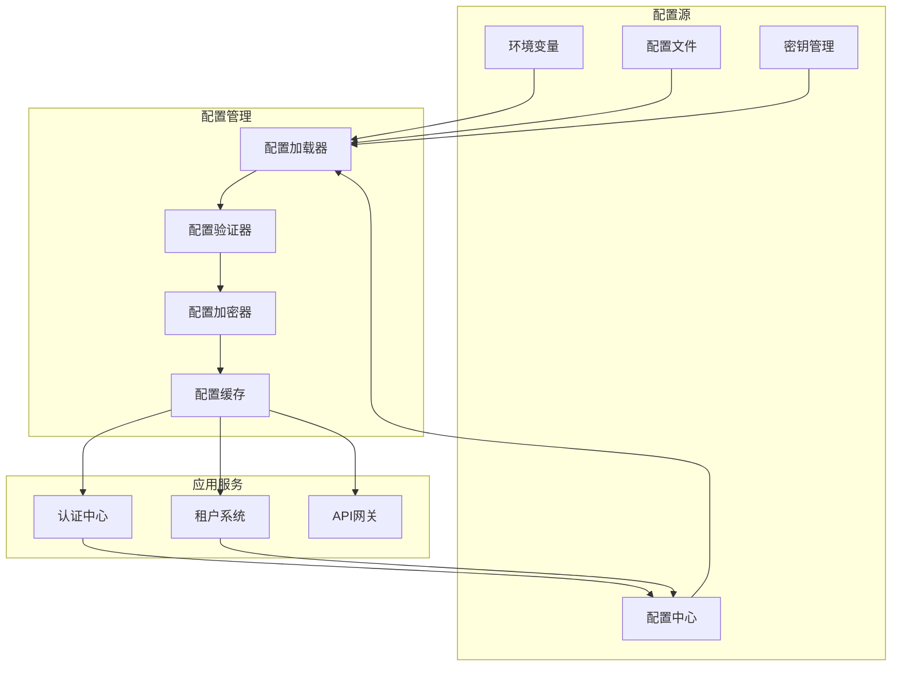

# 配置管理和环境变量说明

## 目录
- [配置管理概述](#配置管理概述)
- [环境分类](#环境分类)
- [配置文件结构](#配置文件结构)
- [环境变量说明](#环境变量说明)
- [配置中心集成](#配置中心集成)
- [配置热更新](#配置热更新)
- [敏感信息管理](#敏感信息管理)
- [配置验证](#配置验证)
- [配置最佳实践](#配置最佳实践)
- [配置故障排除](#配置故障排除)

## 配置管理概述

统一幼儿园管理系统采用分层配置管理策略，支持多环境配置、动态配置更新和安全的敏感信息管理。

### 配置管理原则

1. **环境隔离**: 不同环境使用不同的配置
2. **配置分层**: 基础配置 + 环境配置 + 用户配置
3. **敏感分离**: 敏感信息使用专用管理方式
4. **版本控制**: 配置变更可追踪和回滚
5. **验证机制**: 配置项有类型和格式验证

### 配置架构图



## 环境分类

系统支持以下环境：

| 环境 | 说明 | 域名模式 | 数据库 |
|------|------|----------|--------|
| development | 开发环境 | `localhost`, `dev.local` | 本地MySQL |
| testing | 测试环境 | `test.kindergarten.com` | 测试数据库 |
| staging | 预发布环境 | `staging.kindergarten.com` | 预发布数据库 |
| production | 生产环境 | `kindergarten.com` | 生产数据库 |

## 配置文件结构

### 项目配置目录结构

```
config/
├── default.json          # 默认配置
├── development.json      # 开发环境配置
├── testing.json          # 测试环境配置
├── staging.json          # 预发布环境配置
├── production.json       # 生产环境配置
├── local.json            # 本地配置(不提交版本控制)
└── schema.json           # 配置模式验证

src/
├── config/
│   ├── database.ts       # 数据库配置
│   ├── redis.ts          # Redis配置
│   ├── jwt.ts            # JWT配置
│   ├── oss.ts            # 文件存储配置
│   └── index.ts          # 配置入口
└── modules/
    └── config/
        ├── config.module.ts
        ├── config.service.ts
        └── config.controller.ts
```

### 默认配置文件

**config/default.json:**
```json
{
  "app": {
    "name": "统一幼儿园管理系统",
    "version": "1.0.0",
    "apiVersion": "v1",
    "description": "基于微服务架构的幼儿园管理系统",
    "author": "Kindergarten Team",
    "license": "MIT"
  },
  "server": {
    "port": 3000,
    "host": "0.0.0.0",
    "cors": {
      "origin": "*",
      "credentials": true,
      "methods": ["GET", "POST", "PUT", "DELETE", "OPTIONS"],
      "allowedHeaders": ["Content-Type", "Authorization", "X-Tenant-ID"]
    },
    "helmet": {
      "enabled": true,
      "contentSecurityPolicy": {
        "directives": {
          "defaultSrc": ["'self'"],
          "styleSrc": ["'self'", "'unsafe-inline'"],
          "scriptSrc": ["'self'"],
          "imgSrc": ["'self'", "data:", "https:"]
        }
      }
    }
  },
  "database": {
    "type": "mysql",
    "host": "localhost",
    "port": 3306,
    "username": "root",
    "password": "",
    "database": "kindergarten",
    "charset": "utf8mb4",
    "timezone": "+08:00",
    "synchronize": false,
    "logging": false,
    "entities": ["dist/**/*.entity{.ts,.js}"],
    "migrations": ["dist/migrations/*{.ts,.js}"],
    "subscribers": ["dist/subscribers/*{.ts,.js}"],
    "cli": {
      "entitiesDir": "src/entities",
      "migrationsDir": "src/migrations",
      "subscribersDir": "src/subscribers"
    },
    "pool": {
      "min": 5,
      "max": 20,
      "acquireTimeoutMillis": 60000,
      "idleTimeoutMillis": 30000,
      "createTimeoutMillis": 30000,
      "destroyTimeoutMillis": 5000,
      "reapIntervalMillis": 1000,
      "createRetryIntervalMillis": 100
    }
  },
  "redis": {
    "host": "localhost",
    "port": 6379,
    "password": "",
    "db": 0,
    "keyPrefix": "kindergarten:",
    "retryDelayOnFailover": 100,
    "maxRetriesPerRequest": 3,
    "lazyConnect": true,
    "keepAlive": true,
    "family": 4,
    "connectTimeout": 10000
  },
  "jwt": {
    "secret": "your-super-secret-jwt-key-change-in-production",
    "expiresIn": "24h",
    "refreshExpiresIn": "7d",
    "issuer": "kindergarten-system",
    "audience": "kindergarten-users",
    "algorithm": "HS256"
  },
  "fileStorage": {
    "provider": "aliyun-oss",
    "region": "oss-cn-beijing",
    "bucket": "",
    "endpoint": "",
    "accessKeyId": "",
    "accessKeySecret": "",
    "secure": true,
    "acl": "private",
    "maxFileSize": 10485760,
    "allowedTypes": ["image/jpeg", "image/png", "image/gif", "application/pdf"]
  },
  "sms": {
    "provider": "aliyun",
    "accessKeyId": "",
    "accessKeySecret": "",
    "signName": "幼儿园系统",
    "templateCode": {
      "verification": "SMS_123456789",
      "notification": "SMS_123456790",
      "attendance": "SMS_123456791"
    }
  },
  "email": {
    "provider": "aliyun",
    "host": "smtpdm.aliyun.com",
    "port": 587,
    "secure": false,
    "auth": {
      "user": "",
      "pass": ""
    },
    "from": "noreply@kindergarten.com",
    "templates": {
      "verification": "verification-template",
      "notification": "notification-template",
      "attendance": "attendance-template"
    }
  },
  "logging": {
    "level": "info",
    "format": "json",
    "file": {
      "enabled": true,
      "filename": "logs/app.log",
      "maxSize": "10m",
      "maxFiles": 5,
      "datePattern": "YYYY-MM-DD"
    },
    "console": {
      "enabled": true,
      "colorize": true
    }
  },
  "monitoring": {
    "prometheus": {
      "enabled": true,
      "path": "/metrics",
      "port": 9090
    },
    "healthCheck": {
      "enabled": true,
      "path": "/health",
      "timeout": 3000
    }
  },
  "cache": {
    "ttl": 3600,
    "maxAge": 86400,
    "prefix": "cache:",
    "compression": true
  },
  "rateLimit": {
    "windowMs": 900000,
    "max": 100,
    "message": "请求过于频繁，请稍后再试",
    "standardHeaders": true,
    "legacyHeaders": false
  },
  "security": {
    "bcryptRounds": 12,
    "passwordMinLength": 8,
    "passwordRequireSpecial": true,
    "sessionTimeout": 1800,
    "maxLoginAttempts": 5,
    "lockoutTime": 900
  }
}
```

### 开发环境配置

**config/development.json:**
```json
{
  "server": {
    "port": 3000,
    "cors": {
      "origin": ["http://localhost:3000", "http://localhost:8080"]
    }
  },
  "database": {
    "host": "localhost",
    "port": 3306,
    "username": "root",
    "password": "root123",
    "database": "kindergarten_dev",
    "synchronize": true,
    "logging": true
  },
  "redis": {
    "host": "localhost",
    "port": 6379,
    "db": 0
  },
  "jwt": {
    "secret": "dev-jwt-secret-key-not-for-production",
    "expiresIn": "24h"
  },
  "logging": {
    "level": "debug",
    "console": {
      "enabled": true,
      "colorize": true
    }
  },
  "monitoring": {
    "prometheus": {
      "enabled": false
    }
  },
  "cache": {
    "ttl": 300
  },
  "security": {
    "passwordMinLength": 6
  }
}
```

### 生产环境配置

**config/production.json:**
```json
{
  "server": {
    "port": 3000,
    "cors": {
      "origin": ["https://k.yyup.com", "https://app.kindergarten.com"]
    }
  },
  "database": {
    "host": "mysql-master.production.svc.cluster.local",
    "port": 3306,
    "username": "app_user",
    "password": "${DB_PASSWORD}",
    "database": "kindergarten",
    "synchronize": false,
    "logging": false,
    "ssl": {
      "ca": "${DB_SSL_CA}",
      "key": "${DB_SSL_KEY}",
      "cert": "${DB_SSL_CERT}"
    },
    "pool": {
      "min": 10,
      "max": 50,
      "acquireTimeoutMillis": 60000,
      "idleTimeoutMillis": 30000
    }
  },
  "redis": {
    "host": "redis-master.production.svc.cluster.local",
    "port": 6379,
    "password": "${REDIS_PASSWORD}",
    "db": 0,
    "tls": {
      "ca": "${REDIS_TLS_CA}"
    }
  },
  "jwt": {
    "secret": "${JWT_SECRET}",
    "expiresIn": "8h",
    "refreshExpiresIn": "7d"
  },
  "fileStorage": {
    "provider": "aliyun-oss",
    "region": "oss-cn-beijing",
    "bucket": "${OSS_BUCKET}",
    "accessKeyId": "${OSS_ACCESS_KEY_ID}",
    "accessKeySecret": "${OSS_ACCESS_KEY_SECRET}",
    "secure": true,
    "acl": "private"
  },
  "sms": {
    "accessKeyId": "${SMS_ACCESS_KEY_ID}",
    "accessKeySecret": "${SMS_ACCESS_KEY_SECRET}"
  },
  "email": {
    "auth": {
      "user": "${EMAIL_USER}",
      "pass": "${EMAIL_PASSWORD}"
    }
  },
  "logging": {
    "level": "warn",
    "console": {
      "enabled": false
    },
    "file": {
      "enabled": true
    }
  },
  "monitoring": {
    "prometheus": {
      "enabled": true
    }
  },
  "security": {
    "bcryptRounds": 14,
    "passwordMinLength": 8,
    "maxLoginAttempts": 3,
    "lockoutTime": 1800
  }
}
```

## 环境变量说明

### 应用环境变量

**.env.example:**
```env
# ====================================
# 应用基础配置
# ====================================
NODE_ENV=development
PORT=3000
HOST=0.0.0.0
API_VERSION=v1

# ====================================
# 数据库配置
# ====================================
DB_HOST=localhost
DB_PORT=3306
DB_USERNAME=root
DB_PASSWORD=root123
DB_DATABASE=kindergarten
DB_CHARSET=utf8mb4
DB_TIMEZONE=+08:00
DB_SSL=false
DB_SSL_CA=
DB_SSL_KEY=
DB_SSL_CERT=

# 数据库连接池配置
DB_POOL_MIN=5
DB_POOL_MAX=20
DB_POOL_ACQUIRE_TIMEOUT=60000
DB_POOL_IDLE_TIMEOUT=30000

# ====================================
# Redis配置
# ====================================
REDIS_HOST=localhost
REDIS_PORT=6379
REDIS_PASSWORD=
REDIS_DB=0
REDIS_PREFIX=kindergarten:
REDIS_TLS=false
REDIS_TLS_CA=

# ====================================
# JWT配置
# ====================================
JWT_SECRET=your-super-secret-jwt-key-change-in-production
JWT_EXPIRES_IN=24h
JWT_REFRESH_EXPIRES_IN=7d
JWT_ISSUER=kindergarten-system
JWT_AUDIENCE=kindergarten-users
JWT_ALGORITHM=HS256

# ====================================
# 文件存储配置 (阿里云OSS)
# ====================================
OSS_REGION=oss-cn-beijing
OSS_BUCKET=kindergarten-files
OSS_ACCESS_KEY_ID=your-oss-access-key-id
OSS_ACCESS_KEY_SECRET=your-oss-access-key-secret
OSS_ENDPOINT=
OSS_SECURE=true
OSS_ACL=private
OSS_MAX_FILE_SIZE=10485760

# ====================================
# 短信配置 (阿里云短信)
# ====================================
SMS_ACCESS_KEY_ID=your-sms-access-key-id
SMS_ACCESS_KEY_SECRET=your-sms-access-key-secret
SMS_SIGN_NAME=幼儿园系统
SMS_TEMPLATE_VERIFICATION=SMS_123456789
SMS_TEMPLATE_NOTIFICATION=SMS_123456790
SMS_TEMPLATE_ATTENDANCE=SMS_123456791

# ====================================
# 邮件配置 (阿里云邮件)
# ====================================
EMAIL_HOST=smtpdm.aliyun.com
EMAIL_PORT=587
EMAIL_SECURE=false
EMAIL_USER=noreply@kindergarten.com
EMAIL_PASSWORD=your-email-password
EMAIL_FROM=noreply@kindergarten.com

# ====================================
# 日志配置
# ====================================
LOG_LEVEL=info
LOG_FORMAT=json
LOG_FILE_ENABLED=true
LOG_FILE_PATH=logs/app.log
LOG_FILE_MAX_SIZE=10m
LOG_FILE_MAX_FILES=5
LOG_CONSOLE_ENABLED=true
LOG_CONSOLE_COLORIZE=true

# ====================================
# 监控配置
# ====================================
PROMETHEUS_ENABLED=false
PROMETHEUS_PATH=/metrics
PROMETHEUS_PORT=9090
HEALTH_CHECK_ENABLED=true
HEALTH_CHECK_PATH=/health
HEALTH_CHECK_TIMEOUT=3000

# ====================================
# 缓存配置
# ====================================
CACHE_TTL=3600
CACHE_MAX_AGE=86400
CACHE_PREFIX=cache:
CACHE_COMPRESSION=true

# ====================================
# 安全配置
# ====================================
BCRYPT_ROUNDS=12
PASSWORD_MIN_LENGTH=8
PASSWORD_REQUIRE_SPECIAL=true
SESSION_TIMEOUT=1800
MAX_LOGIN_ATTEMPTS=5
LOCKOUT_TIME=900

# ====================================
# 限流配置
# ====================================
RATE_LIMIT_WINDOW_MS=900000
RATE_LIMIT_MAX=100
RATE_LIMIT_MESSAGE=请求过于频繁，请稍后再试
RATE_LIMIT_STANDARD_HEADERS=true
RATE_LIMIT_LEGACY_HEADERS=false

# ====================================
# 第三方服务配置
# ====================================
# 微信小程序
WECHAT_APP_ID=your-wechat-app-id
WECHAT_APP_SECRET=your-wechat-app-secret

# 支付宝
ALIPAY_APP_ID=your-alipay-app-id
ALIPAY_PRIVATE_KEY=your-alipay-private-key
ALIPAY_PUBLIC_KEY=your-alipay-public-key

# 人脸识别 (百度AI)
BAIDU_AI_APP_ID=your-baidu-ai-app-id
BAIDU_AI_API_KEY=your-baidu-ai-api-key
BAIDU_AI_SECRET_KEY=your-baidu-ai-secret-key

# ====================================
# 服务发现配置
# ====================================
CONSUL_HOST=localhost
CONSUL_PORT=8500
CONSUL_ENABLED=false

ETCD_ENDPOINTS=http://localhost:2379
ETCD_ENABLED=false

# ====================================
# 消息队列配置
# ====================================
RABBITMQ_URL=amqp://localhost:5672
RABBITMQ_USERNAME=guest
RABBITMQ_PASSWORD=guest

KAFKA_BROKERS=localhost:9092
KAFKA_USERNAME=
KAFKA_PASSWORD=

# ====================================
# Kubernetes配置
# ====================================
KUBERNETES_NAMESPACE=default
KUBERNETES_IN_CLUSTER=false
KUBERNETES_CONFIG_PATH=
KUBERNETES_SERVICE_ACCOUNT=

# ====================================
# 开发调试配置
# ====================================
DEBUG=false
DEBUG_PORT=9229
HOT_RELOAD=true
TS_NODE_DEV=true

# ====================================
# 特性开关
# ====================================
FEATURE_TENANT_SYSTEM=true
FEATURE_MULTI_LANGUAGE=false
FEATURE_WECHAT_LOGIN=false
FEATURE_FACE_RECOGNITION=false
FEATURE_PAYMENT=false
FEATURE_NOTIFICATION=true
FEATURE_ANALYTICS=false

# ====================================
# 业务配置
# ====================================
# 租户配置
DEFAULT_TENANT_PLAN=basic
MAX_TENANT_USERS=100
MAX_TENANT_STORAGE=1073741824

# 文件上传配置
UPLOAD_MAX_SIZE=10485760
UPLOAD_ALLOWED_TYPES=image/jpeg,image/png,image/gif,application/pdf
UPLOAD_THUMBNAIL_WIDTH=200
UPLOAD_THUMBNAIL_HEIGHT=200

# 考勤配置
ATTENDANCE_CHECKIN_TIME=08:00
ATTENDANCE_CHECKOUT_TIME=17:00
ATTENDANCE_LATE_TOLERANCE=15
ATTENDANCE_AUTO_CHECKOUT=false

# ====================================
# 部署相关
# ====================================
DEPLOY_VERSION=1.0.0
DEPLOY_ENV=development
DEPLOY_REGION=beijing
DEPLOY_ZONE=beijing-a
CI_BUILD_NUMBER=
CI_COMMIT_SHA=
```

### Docker环境变量

**docker/.env.production:**
```env
# Docker特定配置
COMPOSE_PROJECT_NAME=kindergarten
COMPOSE_FILE=docker-compose.yml:docker-compose.prod.yml

# 镜像配置
IMAGE_TAG=latest
IMAGE_REGISTRY=registry.example.com
IMAGE_PULL_POLICY=Always

# 网络配置
NETWORK_NAME=kindergarten-network
SUBNET=172.20.0.0/16

# 存储配置
DATA_DIR=/data/kindergarten
LOG_DIR=/var/log/kindergarten
BACKUP_DIR=/backup/kindergarten

# SSL证书配置
SSL_CERT_PATH=/etc/ssl/certs/kindergarten.crt
SSL_KEY_PATH=/etc/ssl/private/kindergarten.key

# 外部服务
EXTERNAL_DB_HOST=mysql.external.com
EXTERNAL_REDIS_HOST=redis.external.com
EXTERNAL_MQ_HOST=rabbitmq.external.com
```

### Kubernetes环境变量

**k8s/production.env:**
```env
# Kubernetes配置
KUBERNETES_NAMESPACE=kindergarten-production
KUBERNETES_IN_CLUSTER=true
KUBERNETES_SERVICE_ACCOUNT=kindergarten-service-account

# Pod配置
POD_REPLICAS=3
POD_CPU_REQUEST=250m
POD_CPU_LIMIT=500m
POD_MEMORY_REQUEST=256Mi
POD_MEMORY_LIMIT=512Mi

# 服务配置
SERVICE_TYPE=ClusterIP
SERVICE_PORT=80
SERVICE_TARGET_PORT=3000

# Ingress配置
INGRESS_CLASS=nginx
INGRESS_HOST=kindergarten.com
INGRESS_TLS_SECRET=kindergarten-tls
INGRESS_ANNOTATIONS_RATE_LIMIT=100

# HPA配置
HPA_ENABLED=true
HPA_MIN_REPLICAS=3
HPA_MAX_REPLICAS=10
HPA_CPU_TARGET=70
HPA_MEMORY_TARGET=80

# 资源配置
RESOURCE_CPU_LIMIT=1000m
RESOURCE_MEMORY_LIMIT=1Gi
RESOURCE_CPU_REQUEST=500m
RESOURCE_MEMORY_REQUEST=512Mi
```

## 配置中心集成

### Nacos配置中心

**配置加载器:**
```typescript
// src/config/nacos.loader.ts
import { ConfigService } from '@nestjs/config';
import { NacosConfigClient } from 'nacos';

export class NacosConfigLoader {
  private client: NacosConfigClient;

  constructor(private configService: ConfigService) {
    this.client = new NacosConfigClient({
      serverAddr: this.configService.get<string>('NACOS_SERVER_ADDR'),
      namespace: this.configService.get<string>('NACOS_NAMESPACE'),
      username: this.configService.get<string>('NACOS_USERNAME'),
      password: this.configService.get<string>('NACOS_PASSWORD'),
    });
  }

  async loadConfig(): Promise<any> {
    const env = this.configService.get<string>('NODE_ENV');
    const appName = this.configService.get<string>('app.name');

    try {
      // 加载公共配置
      const commonConfig = await this.client.getConfig(
        `${appName}.common.json`,
        'DEFAULT_GROUP'
      );

      // 加载环境特定配置
      const envConfig = await this.client.getConfig(
        `${appName}.${env}.json`,
        'DEFAULT_GROUP'
      );

      const config = {
        ...JSON.parse(commonConfig || '{}'),
        ...JSON.parse(envConfig || '{}'),
      };

      return config;
    } catch (error) {
      console.error('加载Nacos配置失败:', error);
      return {};
    }
  }

  async watchConfig(callback: (config: any) => void): Promise<void> {
    const env = this.configService.get<string>('NODE_ENV');
    const appName = this.configService.get<string>('app.name');

    this.client.subscribe({
      dataId: `${appName}.${env}.json`,
      group: 'DEFAULT_GROUP',
    }, (content) => {
      try {
        const config = JSON.parse(content);
        callback(config);
      } catch (error) {
        console.error('解析配置变更失败:', error);
      }
    });
  }
}
```

### Apollo配置中心

**配置服务:**
```typescript
// src/modules/config/config.service.ts
import { Injectable } from '@nestjs/common';
import { ConfigService } from '@nestjs/config';
import { ApolloConfigService } from 'apollo-config';

@Injectable()
export class AppConfigService {
  constructor(
    private readonly configService: ConfigService,
    private readonly apolloConfig: ApolloConfigService,
  ) {}

  async getValue<T>(key: string, defaultValue?: T): Promise<T> {
    try {
      // 优先从Apollo获取配置
      const apolloValue = await this.apolloConfig.getValue(key);
      return apolloValue || this.configService.get<T>(key, defaultValue);
    } catch (error) {
      console.warn(`从Apollo获取配置失败 ${key}:`, error.message);
      return this.configService.get<T>(key, defaultValue);
    }
  }

  async watchConfig(key: string, callback: (value: any) => void): Promise<void> {
    try {
      await this.apolloConfig.watchConfig(key, callback);
    } catch (error) {
      console.warn(`监听配置变更失败 ${key}:`, error.message);
    }
  }
}
```

## 配置热更新

### 热更新实现

**配置更新处理器:**
```typescript
// src/modules/config/config-update.handler.ts
import { Injectable } from '@nestjs/common';
import { ConfigService } from '@nestjs/config';
import { EventEmitter2 } from '@nestjs/event-emitter';

@Injectable()
export class ConfigUpdateHandler {
  constructor(
    private readonly configService: ConfigService,
    private readonly eventEmitter: EventEmitter2,
  ) {}

  async handleConfigUpdate(configKey: string, newValue: any): Promise<void> {
    try {
      const oldValue = this.configService.get(configKey);

      // 验证配置值
      this.validateConfig(configKey, newValue);

      // 更新配置
      this.configService.set(configKey, newValue);

      // 发送配置更新事件
      this.eventEmitter.emit('config.updated', {
        key: configKey,
        oldValue,
        newValue,
        timestamp: new Date(),
      });

      console.log(`配置已更新: ${configKey} = ${newValue}`);
    } catch (error) {
      console.error(`配置更新失败 ${configKey}:`, error);
      throw error;
    }
  }

  private validateConfig(key: string, value: any): void {
    const schema = this.getConfigSchema(key);
    if (schema) {
      this.validateValue(value, schema);
    }
  }

  private getConfigSchema(key: string): any {
    // 返回配置项的验证模式
    const schemas = {
      'database.pool.max': {
        type: 'number',
        min: 1,
        max: 100,
      },
      'jwt.expiresIn': {
        type: 'string',
        pattern: /^\d+[smhd]$/,
      },
      'cache.ttl': {
        type: 'number',
        min: 0,
      },
    };
    return schemas[key];
  }

  private validateValue(value: any, schema: any): void {
    if (schema.type === 'number') {
      if (typeof value !== 'number') {
        throw new Error(`配置值必须是数字类型`);
      }
      if (schema.min !== undefined && value < schema.min) {
        throw new Error(`配置值不能小于 ${schema.min}`);
      }
      if (schema.max !== undefined && value > schema.max) {
        throw new Error(`配置值不能大于 ${schema.max}`);
      }
    }

    if (schema.type === 'string' && schema.pattern) {
      if (!schema.pattern.test(value)) {
        throw new Error(`配置值格式不正确`);
      }
    }
  }
}
```

### 配置变更监听器

**事件监听器:**
```typescript
// src/modules/config/config-listeners.ts
import { Injectable } from '@nestjs/common';
import { OnEvent } from '@nestjs/event-emitter';
import { RedisService } from '@nestjs-modules/ioredis';

@Injectable()
export class ConfigListeners {
  constructor(private readonly redisService: RedisService) {}

  @OnEvent('config.updated')
  async handleConfigUpdated(event: { key: string; oldValue: any; newValue: any }) {
    const { key, oldValue, newValue } = event;

    // 特定配置项的处理逻辑
    switch (key) {
      case 'cache.ttl':
        await this.updateCacheTTL(newValue);
        break;
      case 'jwt.secret':
        await this.rotateJWTSecret(newValue);
        break;
      case 'database.pool.max':
        await this.updateDatabasePool(newValue);
        break;
    }

    // 清除相关缓存
    await this.clearRelatedCache(key);
  }

  private async updateCacheTTL(ttl: number): Promise<void> {
    console.log(`更新缓存TTL为: ${ttl}秒`);
    // 通知所有实例更新缓存TTL
    await this.redisService.publish('config:cache:ttl', ttl.toString());
  }

  private async rotateJWTSecret(newSecret: string): Promise<void> {
    console.log('JWT密钥已轮换');
    // 标记现有令牌为无效
    await this.redisService.del('jwt:valid:*');
  }

  private async updateDatabasePool(maxConnections: number): Promise<void> {
    console.log(`数据库连接池最大连接数更新为: ${maxConnections}`);
    // 通知数据库连接池更新配置
    await this.redisService.publish('config:db:pool', maxConnections.toString());
  }

  private async clearRelatedCache(configKey: string): Promise<void> {
    const cacheKeys = await this.redisService.keys(`config:*${configKey}*`);
    if (cacheKeys.length > 0) {
      await this.redisService.del(...cacheKeys);
    }
  }
}
```

## 敏感信息管理

### 密钥管理服务

**加密服务:**
```typescript
// src/modules/security/encryption.service.ts
import { Injectable } from '@nestjs/common';
import * as crypto from 'crypto';

@Injectable()
export class EncryptionService {
  private readonly algorithm = 'aes-256-gcm';
  private readonly keyLength = 32;
  private readonly ivLength = 16;
  private readonly tagLength = 16;

  constructor() {
    // 从环境变量或密钥管理系统获取主密钥
    this.masterKey = this.getMasterKey();
  }

  private masterKey: Buffer;

  encrypt(plaintext: string): { encrypted: string; iv: string; tag: string } {
    const iv = crypto.randomBytes(this.ivLength);
    const cipher = crypto.createCipher(this.algorithm, this.masterKey);
    cipher.setAAD(Buffer.from('kindergarten-system'));

    let encrypted = cipher.update(plaintext, 'utf8', 'hex');
    encrypted += cipher.final('hex');

    const tag = cipher.getAuthTag();

    return {
      encrypted,
      iv: iv.toString('hex'),
      tag: tag.toString('hex'),
    };
  }

  decrypt(encrypted: string, iv: string, tag: string): string {
    const decipher = crypto.createDecipher(this.algorithm, this.masterKey);
    decipher.setAAD(Buffer.from('kindergarten-system'));
    decipher.setAuthTag(Buffer.from(tag, 'hex'));

    let decrypted = decipher.update(encrypted, 'hex', 'utf8');
    decrypted += decipher.final('utf8');

    return decrypted;
  }

  private getMasterKey(): Buffer {
    const keySource = process.env.MASTER_KEY_SOURCE || 'env';

    switch (keySource) {
      case 'env':
        const key = process.env.MASTER_KEY;
        if (!key) {
          throw new Error('MASTER_KEY环境变量未设置');
        }
        return Buffer.from(key, 'hex');

      case 'kms':
        return this.getKMSKey();

      case 'vault':
        return this.getVaultKey();

      default:
        throw new Error(`不支持的密钥源: ${keySource}`);
    }
  }

  private async getKMSKey(): Promise<Buffer> {
    // 从KMS获取密钥
    // 实现KMS集成逻辑
    return Buffer.from('kms-key-here', 'hex');
  }

  private async getVaultKey(): Promise<Buffer> {
    // 从HashiCorp Vault获取密钥
    // 实现Vault集成逻辑
    return Buffer.from('vault-key-here', 'hex');
  }
}
```

### 密钥轮换

**密钥轮换服务:**
```typescript
// src/modules/security/key-rotation.service.ts
import { Injectable, Logger } from '@nestjs/common';
import { Cron } from '@nestjs/schedule';
import { ConfigService } from '@nestjs/config';
import { EncryptionService } from './encryption.service';

@Injectable()
export class KeyRotationService {
  private readonly logger = new Logger(KeyRotationService.name);

  constructor(
    private readonly configService: ConfigService,
    private readonly encryptionService: EncryptionService,
  ) {}

  @Cron('0 0 1 * *') // 每月1号凌晨执行
  async rotateKeys(): Promise<void> {
    this.logger.log('开始执行密钥轮换...');

    try {
      await this.rotateJWTSecret();
      await this.rotateDatabaseCredentials();
      await this.rotateThirdPartyKeys();

      this.logger.log('密钥轮换完成');
    } catch (error) {
      this.logger.error('密钥轮换失败:', error);
      throw error;
    }
  }

  private async rotateJWTSecret(): Promise<void> {
    const newSecret = this.generateSecureKey();
    const encryptedSecret = this.encryptionService.encrypt(newSecret);

    // 更新配置中心中的JWT密钥
    await this.updateConfig('JWT_SECRET', encryptedSecret.encrypted);

    this.logger.log('JWT密钥已轮换');
  }

  private async rotateDatabaseCredentials(): Promise<void> {
    // 生成新的数据库密码
    const newPassword = this.generateSecurePassword();

    // 更新数据库密码
    await this.updateDatabasePassword(newPassword);

    this.logger.log('数据库密码已轮换');
  }

  private async rotateThirdPartyKeys(): Promise<void> {
    // 轮换第三方服务密钥
    const services = ['oss', 'sms', 'email'];

    for (const service of services) {
      await this.rotateServiceKey(service);
    }

    this.logger.log('第三方服务密钥已轮换');
  }

  private generateSecureKey(): string {
    return crypto.randomBytes(32).toString('hex');
  }

  private generateSecurePassword(): string {
    const length = 16;
    const charset = 'ABCDEFGHIJKLMNOPQRSTUVWXYZabcdefghijklmnopqrstuvwxyz0123456789!@#$%^&*';
    let password = '';

    for (let i = 0; i < length; i++) {
      password += charset.charAt(crypto.randomInt(0, charset.length));
    }

    return password;
  }

  private async updateConfig(key: string, value: string): Promise<void> {
    // 更新配置中心或环境变量
    // 实现配置更新逻辑
  }

  private async updateDatabasePassword(password: string): Promise<void> {
    // 更新数据库密码
    // 实现数据库密码更新逻辑
  }

  private async rotateServiceKey(service: string): Promise<void> {
    // 轮换特定服务的密钥
    // 实现服务密钥轮换逻辑
  }
}
```

## 配置验证

### 配置模式验证

**配置模式定义:**
```json
config/schema.json
{
  "$schema": "http://json-schema.org/draft-07/schema#",
  "type": "object",
  "properties": {
    "app": {
      "type": "object",
      "properties": {
        "name": { "type": "string", "minLength": 1 },
        "version": { "type": "string", "pattern": "^\\d+\\.\\d+\\.\\d+$" },
        "port": { "type": "integer", "minimum": 1, "maximum": 65535 }
      },
      "required": ["name", "version"]
    },
    "database": {
      "type": "object",
      "properties": {
        "host": { "type": "string", "minLength": 1 },
        "port": { "type": "integer", "minimum": 1, "maximum": 65535 },
        "username": { "type": "string", "minLength": 1 },
        "password": { "type": "string", "minLength": 1 },
        "database": { "type": "string", "minLength": 1 },
        "pool": {
          "type": "object",
          "properties": {
            "min": { "type": "integer", "minimum": 1 },
            "max": { "type": "integer", "minimum": 1 }
          }
        }
      },
      "required": ["host", "port", "username", "password", "database"]
    },
    "jwt": {
      "type": "object",
      "properties": {
        "secret": { "type": "string", "minLength": 32 },
        "expiresIn": { "type": "string", "pattern": "^\\d+[smhd]$" },
        "refreshExpiresIn": { "type": "string", "pattern": "^\\d+[smhd]$" }
      },
      "required": ["secret", "expiresIn"]
    },
    "redis": {
      "type": "object",
      "properties": {
        "host": { "type": "string", "minLength": 1 },
        "port": { "type": "integer", "minimum": 1, "maximum": 65535 }
      },
      "required": ["host", "port"]
    }
  },
  "required": ["app", "database", "jwt", "redis"]
}
```

### 配置验证服务

**验证器实现:**
```typescript
// src/modules/config/config-validator.service.ts
import { Injectable } from '@nestjs/common';
import * as Joi from 'joi';

@Injectable()
export class ConfigValidatorService {
  private readonly configSchema: Joi.ObjectSchema;

  constructor() {
    this.configSchema = this.buildConfigSchema();
  }

  validate(config: any): { valid: boolean; errors?: string[] } {
    const { error } = this.configSchema.validate(config, {
      abortEarly: false,
      allowUnknown: true,
      stripUnknown: false,
    });

    if (error) {
      return {
        valid: false,
        errors: error.details.map(detail => detail.message),
      };
    }

    return { valid: true };
  }

  private buildConfigSchema(): Joi.ObjectSchema {
    return Joi.object({
      app: Joi.object({
        name: Joi.string().required(),
        version: Joi.string().pattern(/^\d+\.\d+\.\d+$/).required(),
        port: Joi.number().port().default(3000),
        host: Joi.string().default('0.0.0.0'),
      }).required(),

      database: Joi.object({
        type: Joi.string().default('mysql'),
        host: Joi.string().required(),
        port: Joi.number().port().default(3306),
        username: Joi.string().required(),
        password: Joi.string().required(),
        database: Joi.string().required(),
        charset: Joi.string().default('utf8mb4'),
        timezone: Joi.string().default('+08:00'),
        synchronize: Joi.boolean().default(false),
        logging: Joi.boolean().default(false),
        pool: Joi.object({
          min: Joi.number().min(1).default(5),
          max: Joi.number().min(1).default(20),
          acquireTimeoutMillis: Joi.number().min(1000).default(60000),
          idleTimeoutMillis: Joi.number().min(1000).default(30000),
        }).default(),
      }).required(),

      redis: Joi.object({
        host: Joi.string().required(),
        port: Joi.number().port().default(6379),
        password: Joi.string().allow('').default(''),
        db: Joi.number().min(0).max(15).default(0),
        keyPrefix: Joi.string().default('kindergarten:'),
        retryDelayOnFailover: Joi.number().min(0).default(100),
        maxRetriesPerRequest: Joi.number().min(0).default(3),
      }).required(),

      jwt: Joi.object({
        secret: Joi.string().min(32).required(),
        expiresIn: Joi.string().pattern(/^\d+[smhd]$/).default('24h'),
        refreshExpiresIn: Joi.string().pattern(/^\d+[smhd]$/).default('7d'),
        issuer: Joi.string().default('kindergarten-system'),
        audience: Joi.string().default('kindergarten-users'),
        algorithm: Joi.string().valid('HS256', 'HS384', 'HS512').default('HS256'),
      }).required(),

      fileStorage: Joi.object({
        provider: Joi.string().valid('aliyun-oss', 'aws-s3', 'local').required(),
        region: Joi.string().required(),
        bucket: Joi.string().required(),
        accessKeyId: Joi.string().required(),
        accessKeySecret: Joi.string().required(),
        secure: Joi.boolean().default(true),
        acl: Joi.string().valid('private', 'public-read', 'public-read-write').default('private'),
        maxFileSize: Joi.number().positive().default(10485760),
      }).required(),

      logging: Joi.object({
        level: Joi.string().valid('debug', 'info', 'warn', 'error').default('info'),
        format: Joi.string().valid('json', 'simple').default('json'),
        file: Joi.object({
          enabled: Joi.boolean().default(true),
          filename: Joi.string().default('logs/app.log'),
          maxSize: Joi.string().default('10m'),
          maxFiles: Joi.number().positive().default(5),
        }).default(),
        console: Joi.object({
          enabled: Joi.boolean().default(true),
          colorize: Joi.boolean().default(true),
        }).default(),
      }).default(),

      security: Joi.object({
        bcryptRounds: Joi.number().integer().min(10).max(15).default(12),
        passwordMinLength: Joi.number().integer().min(6).max(128).default(8),
        passwordRequireSpecial: Joi.boolean().default(true),
        sessionTimeout: Joi.number().positive().default(1800),
        maxLoginAttempts: Joi.number().integer().min(1).max(10).default(5),
        lockoutTime: Joi.number().positive().default(900),
      }).default(),
    });
  }
}
```

## 配置最佳实践

### 1. 环境变量命名规范

```env
# 命名格式: SERVICE_SECTION_SPECIFIC
# 示例:
DATABASE_HOST=mysql.example.com
DATABASE_PORT=3306
REDIS_HOST=redis.example.com
JWT_SECRET=your-jwt-secret
FILE_STORAGE_OSS_BUCKET=your-bucket
```

### 2. 配置层次结构

1. **默认配置**: 基础配置，所有环境通用
2. **环境配置**: 特定环境的配置覆盖
3. **运行时配置**: 动态配置，支持热更新
4. **用户配置**: 用户自定义配置

### 3. 敏感信息处理

- 使用加密存储敏感配置
- 定期轮换密钥和密码
- 使用专门的密钥管理服务
- 避免在代码中硬编码敏感信息

### 4. 配置文件管理

- 使用版本控制管理配置文件
- 配置文件添加适当的注释
- 提供配置示例和说明文档
- 使用配置模板和验证规则

## 配置故障排除

### 常见问题及解决方案

#### 1. 环境变量未设置

**问题**: 应用启动时提示环境变量缺失

**解决方案**:
```bash
# 检查环境变量
env | grep DATABASE_HOST

# 设置环境变量
export DATABASE_HOST=localhost

# 或使用.env文件
echo "DATABASE_HOST=localhost" >> .env
```

#### 2. 配置格式错误

**问题**: JSON配置文件格式错误

**解决方案**:
```bash
# 验证JSON格式
jq . config/production.json

# 格式化JSON文件
jq . config/production.json > config/production.json.tmp
mv config/production.json.tmp config/production.json
```

#### 3. 配置连接失败

**问题**: 无法连接到外部服务

**解决方案**:
```bash
# 测试数据库连接
mysql -h $DB_HOST -P $DB_PORT -u $DB_USERNAME -p$DB_PASSWORD

# 测试Redis连接
redis-cli -h $REDIS_HOST -p $REDIS_PORT ping

# 检查网络连通性
telnet $DB_HOST $DB_PORT
```

### 调试工具

**配置调试服务:**
```typescript
// src/modules/config/config-debug.service.ts
import { Injectable } from '@nestjs/common';
import { ConfigService } from '@nestjs/config';

@Injectable()
export class ConfigDebugService {
  constructor(private readonly configService: ConfigService) {}

  debugConfig(): void {
    console.log('=== 应用配置调试信息 ===');
    console.log('环境:', this.configService.get('NODE_ENV'));
    console.log('端口:', this.configService.get('PORT'));
    console.log('数据库主机:', this.configService.get('DB_HOST'));
    console.log('Redis主机:', this.configService.get('REDIS_HOST'));
    console.log('JWT过期时间:', this.configService.get('JWT_EXPIRES_IN'));

    // 检查必需配置
    const requiredKeys = [
      'DB_HOST',
      'DB_USERNAME',
      'DB_PASSWORD',
      'DB_DATABASE',
      'REDIS_HOST',
      'JWT_SECRET',
    ];

    console.log('\n=== 必需配置检查 ===');
    for (const key of requiredKeys) {
      const value = this.configService.get(key);
      console.log(`${key}: ${value ? '✓' : '✗'}`);
    }
  }

  validateConnections(): void {
    console.log('\n=== 连接验证 ===');

    // 验证数据库连接
    this.validateDatabaseConnection();

    // 验证Redis连接
    this.validateRedisConnection();

    // 验证文件存储连接
    this.validateFileStorageConnection();
  }

  private async validateDatabaseConnection(): Promise<void> {
    try {
      // 实现数据库连接测试
      console.log('数据库连接: ✓');
    } catch (error) {
      console.log('数据库连接: ✗', error.message);
    }
  }

  private async validateRedisConnection(): Promise<void> {
    try {
      // 实现Redis连接测试
      console.log('Redis连接: ✓');
    } catch (error) {
      console.log('Redis连接: ✗', error.message);
    }
  }

  private async validateFileStorageConnection(): Promise<void> {
    try {
      // 实现文件存储连接测试
      console.log('文件存储连接: ✓');
    } catch (error) {
      console.log('文件存储连接: ✗', error.message);
    }
  }
}
```

---

*本文档持续更新中，最后更新时间: 2025-11-29*