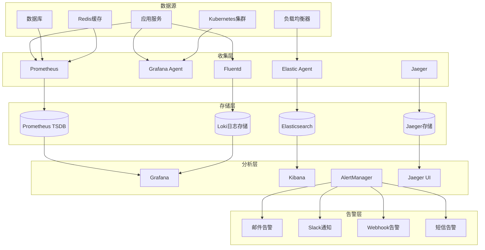

# 监控和日志管理指南

## 目录
- [监控体系概述](#监控体系概述)
- [日志管理架构](#日志管理架构)
- [应用监控](#应用监控)
- [基础设施监控](#基础设施监控)
- [业务监控](#业务监控)
- [告警管理](#告警管理)
- [日志收集和分析](#日志收集和分析)
- [性能监控](#性能监控)
- [安全监控](#安全监控)
- [监控仪表板](#监控仪表板)
- [故障诊断](#故障诊断)

## 监控体系概述

统一幼儿园管理系统采用全方位监控体系，涵盖基础设施、应用性能、业务指标和安全监控等多个维度。

### 监控架构图



### 监控目标

1. **系统可用性**: 监控服务可用性和响应时间
2. **性能指标**: 监控CPU、内存、网络等资源使用情况
3. **业务指标**: 监控用户活跃度、交易量等业务数据
4. **错误追踪**: 监控错误率、异常情况
5. **安全监控**: 监控安全事件和异常访问

## 日志管理架构

### 日志分类

| 日志类型 | 用途 | 格式 | 存储期限 |
|---------|------|------|----------|
| 应用日志 | 应用程序运行日志 | JSON | 30天 |
| 访问日志 | HTTP请求日志 | JSON | 7天 |
| 错误日志 | 错误和异常日志 | JSON | 90天 |
| 审计日志 | 用户操作审计 | JSON | 1年 |
| 系统日志 | 系统服务日志 | 文本 | 30天 |
| 安全日志 | 安全相关日志 | JSON | 1年 |

### 日志格式规范

**标准日志格式:**
```json
{
  "timestamp": "2024-12-01T10:30:45.123Z",
  "level": "info",
  "service": "auth-service",
  "version": "1.0.0",
  "tenantId": "tenant_123",
  "userId": "user_456",
  "requestId": "req_789",
  "traceId": "trace_abc",
  "spanId": "span_def",
  "message": "用户登录成功",
  "data": {
    "username": "admin@example.com",
    "ip": "192.168.1.100"
  },
  "error": null,
  "duration": 150,
  "metadata": {
    "userAgent": "Mozilla/5.0...",
    "method": "POST",
    "url": "/api/auth/login"
  }
}
```

### 日志收集配置

**Fluentd配置:**
```yaml
# fluentd/conf/fluent.conf
<source>
  @type tail
  @id app_logs
  path /var/log/app/*.log
  pos_file /var/log/fluentd/app.log.pos
  tag app.*
  read_from_head true
  <parse>
    @type json
    time_format %Y-%m-%dT%H:%M:%S.%NZ
    time_key timestamp
  </parse>
</source>

<source>
  @type tail
  @id access_logs
  path /var/log/nginx/access.log
  pos_file /var/log/fluentd/nginx.log.pos
  tag nginx.access
  format json
  time_format %Y-%m-%dT%H:%M:%S.%NZ
</source>

<filter app.**>
  @type record_transformer
  @id add_environment
  <record>
    environment "#{ENV['NODE_ENV']}"
    hostname "#{Socket.gethostname}"
  </record>
</filter>

<match app.**>
  @type loki
  @id loki_output
  url http://loki:3100/loki/api/v1/push
  username "#{ENV['LOKI_USERNAME']}"
  password "#{ENV['LOKI_PASSWORD']}"
  labels:
    service: ${record["service"]}
    level: ${record["level"]}
    tenantId: ${record["tenantId"]}
  <buffer>
    @type file
    path /var/log/fluentd/buffer
    flush_mode interval
    flush_interval 5s
  </buffer>
</match>
```

## 应用监控

### Prometheus指标配置

**指标收集配置:**
```typescript
// src/monitoring/metrics.service.ts
import { Injectable } from '@nestjs/common';
import { register, Counter, Histogram, Gauge, Registry } from 'prom-client';

@Injectable()
export class MetricsService {
  private readonly registry: Registry;

  // HTTP请求计数器
  private readonly httpRequestsTotal: Counter<string>;

  // HTTP请求延迟
  private readonly httpRequestDuration: Histogram<string>;

  // 活跃用户数
  private readonly activeUsers: Gauge<string>;

  // 数据库连接池
  private readonly dbConnectionsActive: Gauge<string>;

  // 业务指标
  private readonly userLoginsTotal: Counter<string>;
  private readonly attendanceRecordsTotal: Counter<string>;

  constructor() {
    this.registry = new Registry();
    this.setupMetrics();
  }

  private setupMetrics(): void {
    // HTTP指标
    this.httpRequestsTotal = new Counter({
      name: 'http_requests_total',
      help: 'Total HTTP requests',
      labelNames: ['method', 'route', 'status_code', 'tenant_id'],
      registers: [this.registry],
    });

    this.httpRequestDuration = new Histogram({
      name: 'http_request_duration_seconds',
      help: 'HTTP request duration',
      labelNames: ['method', 'route', 'tenant_id'],
      buckets: [0.1, 0.5, 1, 2, 5, 10],
      registers: [this.registry],
    });

    // 应用指标
    this.activeUsers = new Gauge({
      name: 'active_users_total',
      help: 'Number of active users',
      labelNames: ['tenant_id'],
      registers: [this.registry],
    });

    this.dbConnectionsActive = new Gauge({
      name: 'db_connections_active',
      help: 'Number of active database connections',
      registers: [this.registry],
    });

    // 业务指标
    this.userLoginsTotal = new Counter({
      name: 'user_logins_total',
      help: 'Total user logins',
      labelNames: ['tenant_id', 'status'],
      registers: [this.registry],
    });

    this.attendanceRecordsTotal = new Counter({
      name: 'attendance_records_total',
      help: 'Total attendance records',
      labelNames: ['tenant_id', 'status'],
      registers: [this.registry],
    });
  }

  // HTTP请求指标
  incrementHttpRequests(method: string, route: string, statusCode: number, tenantId?: string): void {
    this.httpRequestsTotal
      .labels(method, route, statusCode.toString(), tenantId || 'unknown')
      .inc();
  }

  observeHttpRequestDuration(method: string, route: string, duration: number, tenantId?: string): void {
    this.httpRequestDuration
      .labels(method, route, tenantId || 'unknown')
      .observe(duration / 1000); // 转换为秒
  }

  // 用户指标
  setActiveUsers(count: number, tenantId?: string): void {
    this.activeUsers.labels(tenantId || 'unknown').set(count);
  }

  incrementUserLogins(tenantId?: string, status: 'success' | 'failure' = 'success'): void {
    this.userLoginsTotal.labels(tenantId || 'unknown', status).inc();
  }

  // 考勤指标
  incrementAttendanceRecords(tenantId?: string, status: string = 'present'): void {
    this.attendanceRecordsTotal.labels(tenantId || 'unknown', status).inc();
  }

  // 数据库指标
  setDbConnections(count: number): void {
    this.dbConnectionsActive.set(count);
  }

  getRegistry(): Registry {
    return this.registry;
  }
}
```

### 自定义业务指标

**业务监控服务:**
```typescript
// src/monitoring/business-metrics.service.ts
import { Injectable, Logger } from '@nestjs/common';
import { Cron } from '@nestjs/schedule';
import { MetricsService } from './metrics.service';

@Injectable()
export class BusinessMetricsService {
  private readonly logger = new Logger(BusinessMetricsService.name);

  constructor(private readonly metricsService: MetricsService) {}

  @Cron('*/5 * * * *') // 每5分钟执行
  async collectBusinessMetrics(): Promise<void> {
    try {
      await this.collectUserMetrics();
      await this.collectTenantMetrics();
      await this.collectSystemMetrics();
    } catch (error) {
      this.logger.error('收集业务指标失败:', error);
    }
  }

  private async collectUserMetrics(): Promise<void> {
    // 收集用户活跃度指标
    const activeUsers = await this.getActiveUserCount();
    this.metricsService.setActiveUsers(activeUsers);

    // 收集新增用户指标
    const newUsersToday = await this.getNewUserCount('today');
    this.metricsService.incrementNewUsers(newUsersToday);

    this.logger.log(`用户指标收集完成: 活跃用户 ${activeUsers}, 新增用户 ${newUsersToday}`);
  }

  private async collectTenantMetrics(): Promise<void> {
    // 收集租户数量
    const tenantCount = await this.getTenantCount();
    this.metricsService.setTenantCount(tenantCount);

    // 收集各租户的数据量
    const tenantMetrics = await this.getTenantMetrics();
    for (const [tenantId, metrics] of Object.entries(tenantMetrics)) {
      this.metricsService.setTenantDataCount(tenantId, metrics.dataCount);
      this.metricsService.setTenantUserCount(tenantId, metrics.userCount);
    }

    this.logger.log(`租户指标收集完成: 租户数量 ${tenantCount}`);
  }

  private async collectSystemMetrics(): Promise<void> {
    // 收集数据库连接数
    const dbConnections = await this.getDatabaseConnectionCount();
    this.metricsService.setDbConnections(dbConnections);

    // 收集Redis连接数
    const redisConnections = await this.getRedisConnectionCount();
    this.metricsService.setRedisConnections(redisConnections);

    this.logger.log(`系统指标收集完成: DB连接 ${dbConnections}, Redis连接 ${redisConnections}`);
  }

  private async getActiveUserCount(): Promise<number> {
    // 实现获取活跃用户数的逻辑
    return 0;
  }

  private async getNewUserCount(period: string): Promise<number> {
    // 实现获取新增用户数的逻辑
    return 0;
  }

  private async getTenantCount(): Promise<number> {
    // 实现获取租户数量的逻辑
    return 0;
  }

  private async getTenantMetrics(): Promise<Record<string, any>> {
    // 实现获取租户指标的逻辑
    return {};
  }

  private async getDatabaseConnectionCount(): Promise<number> {
    // 实现获取数据库连接数的逻辑
    return 0;
  }

  private async getRedisConnectionCount(): Promise<number> {
    // 实现获取Redis连接数的逻辑
    return 0;
  }
}
```

## 基础设施监控

### Node Exporter配置

**Docker Compose配置:**
```yaml
# monitoring/docker-compose.yml
version: '3.8'

services:
  node-exporter:
    image: prom/node-exporter:latest
    container_name: node-exporter
    command:
      - '--path.rootfs=/host'
      - '--path.procfs=/host/proc'
      - '--path.sysfs=/host/sys'
      - '--collector.filesystem.mount-points-exclude=^/(sys|proc|dev|host|etc)($$|/)'
    volumes:
      - '/:/host:ro,rslave'
    ports:
      - '9100:9100'
    networks:
      - monitoring

  cadvisor:
    image: gcr.io/cadvisor/cadvisor:latest
    container_name: cadvisor
    command:
      - '--housekeeping_interval=30s'
      - '--storage_duration=1m'
    volumes:
      - '/:/rootfs:ro'
      - '/var/run:/var/run:ro'
      - '/sys:/sys:ro'
      - '/var/lib/docker/:/var/lib/docker:ro'
      - '/dev/disk/:/dev/disk:ro'
    ports:
      - '8080:8080'
    networks:
      - monitoring

  blackbox-exporter:
    image: prom/blackbox-exporter:latest
    container_name: blackbox-exporter
    volumes:
      - ./config/blackbox.yml:/etc/blackbox_exporter/config.yml
    ports:
      - '9115:9115'
    networks:
      - monitoring

  mysql-exporter:
    image: prom/mysqld-exporter:latest
    container_name: mysql-exporter
    environment:
      - DATA_SOURCE_NAME=user:password@(mysql:3306)/
    ports:
      - '9104:9104'
    networks:
      - monitoring
      - application

  redis-exporter:
    image: oliver006/redis_exporter:latest
    container_name: redis-exporter
    environment:
      - REDIS_ADDR=redis://redis:6379
    ports:
      - '9121:9121'
    networks:
      - monitoring
      - application

networks:
  monitoring:
    driver: bridge
  application:
    external: true
```

### Prometheus配置

**prometheus.yml:**
```yaml
global:
  scrape_interval: 15s
  evaluation_interval: 15s

rule_files:
  - "rules/*.yml"

alerting:
  alertmanagers:
    - static_configs:
        - targets:
          - alertmanager:9093

scrape_configs:
  # Prometheus自身监控
  - job_name: 'prometheus'
    static_configs:
      - targets: ['localhost:9090']

  # 应用服务监控
  - job_name: 'auth-service'
    static_configs:
      - targets: ['auth-service:3000']
    metrics_path: '/metrics'
    scrape_interval: 10s

  - job_name: 'tenant-service'
    static_configs:
      - targets: ['tenant-service:3000']
    metrics_path: '/metrics'
    scrape_interval: 10s

  # 基础设施监控
  - job_name: 'node-exporter'
    static_configs:
      - targets:
        - 'node-exporter:9100'
        - 'cadvisor:8080'

  - job_name: 'mysql-exporter'
    static_configs:
      - targets: ['mysql-exporter:9104']

  - job_name: 'redis-exporter'
    static_configs:
      - targets: ['redis-exporter:9121']

  # 黑盒监控
  - job_name: 'blackbox-http'
    metrics_path: /probe
    params:
      module: [http_2xx]
    static_configs:
      - targets:
        - https://k.yyup.com/health
        - https://api.kindergarten.com/health
    relabel_configs:
      - source_labels: [__address__]
        target_label: __param_target
      - source_labels: [__param_target]
        target_label: instance
      - target_label: __address__
        replacement: blackbox-exporter:9115

  # Kubernetes监控
  - job_name: 'kubernetes-apiservers'
    kubernetes_sd_configs:
      - role: endpoints
    scheme: https
    tls_config:
      ca_file: /var/run/secrets/kubernetes.io/serviceaccount/ca.crt
    bearer_token_file: /var/run/secrets/kubernetes.io/serviceaccount/token
    relabel_configs:
      - source_labels: [__meta_kubernetes_namespace, __meta_kubernetes_service_name, __meta_kubernetes_endpoint_port_name]
        action: keep
        regex: default;kubernetes;https

  - job_name: 'kubernetes-nodes'
    kubernetes_sd_configs:
      - role: node
    relabel_configs:
      - action: labelmap
        regex: __meta_kubernetes_node_label_(.+)

  - job_name: 'kubernetes-pods'
    kubernetes_sd_configs:
      - role: pod
    relabel_configs:
      - source_labels: [__meta_kubernetes_pod_annotation_prometheus_io_scrape]
        action: keep
        regex: true
      - source_labels: [__meta_kubernetes_pod_annotation_prometheus_io_path]
        action: replace
        target_label: __metrics_path__
        regex: (.+)
      - source_labels: [__address__, __meta_kubernetes_pod_annotation_prometheus_io_port]
        action: replace
        regex: ([^:]+)(?::\d+)?;(\d+)
        replacement: $1:$2
        target_label: __address__
```

## 业务监控

### 业务指标定义

**核心业务指标:**

1. **用户活跃度指标**
   - 日活跃用户数 (DAU)
   - 周活跃用户数 (WAU)
   - 月活跃用户数 (MAU)
   - 用户留存率

2. **系统使用指标**
   - 登录成功率
   - 考勤记录数
   - 照片上传数
   - API调用次数

3. **租户指标**
   - 活跃租户数
   - 新增租户数
   - 租户数据量
   - 租户存储使用量

### 业务监控实现

**业务监控服务:**
```typescript
// src/monitoring/business-metrics.collector.ts
import { Injectable, Logger } from '@nestjs/common';
import { Cron } from '@nestjs/schedule';
import { InjectRepository } from '@nestjs/typeorm';
import { Repository } from 'typeorm';
import { User } from '../entities/user.entity';
import { Student } from '../entities/student.entity';
import { AttendanceRecord } from '../entities/attendance-record.entity';
import { Photo } from '../entities/photo.entity';

@Injectable()
export class BusinessMetricsCollector {
  private readonly logger = new Logger(BusinessMetricsCollector.name);

  constructor(
    @InjectRepository(User)
    private readonly userRepository: Repository<User>,
    @InjectRepository(Student)
    private readonly studentRepository: Repository<Student>,
    @InjectRepository(AttendanceRecord)
    private readonly attendanceRepository: Repository<AttendanceRecord>,
    @InjectRepository(Photo)
    private readonly photoRepository: Repository<Photo>,
  ) {}

  @Cron('0 0 * * *') // 每天午夜执行
  async collectDailyMetrics(): Promise<void> {
    this.logger.log('开始收集每日业务指标...');

    try {
      const metrics = await Promise.all([
        this.collectUserMetrics(),
        this.collectStudentMetrics(),
        this.collectAttendanceMetrics(),
        this.collectPhotoMetrics(),
      ]);

      // 发送指标到监控系统
      await this.sendMetrics(metrics);

      this.logger.log('每日业务指标收集完成');
    } catch (error) {
      this.logger.error('收集每日业务指标失败:', error);
    }
  }

  private async collectUserMetrics(): Promise<any> {
    const now = new Date();
    const yesterday = new Date(now.getTime() - 24 * 60 * 60 * 1000);
    const lastWeek = new Date(now.getTime() - 7 * 24 * 60 * 60 * 1000);
    const lastMonth = new Date(now.getTime() - 30 * 24 * 60 * 60 * 1000);

    const [
      totalUsers,
      activeToday,
      activeLastWeek,
      activeLastMonth,
      newUsersToday,
    ] = await Promise.all([
      this.userRepository.count({ where: { deletedAt: null } }),
      this.userRepository.count({
        where: {
          deletedAt: null,
          lastLoginAt: yesterday,
        },
      }),
      this.userRepository.count({
        where: {
          deletedAt: null,
          lastLoginAt: lastWeek,
        },
      }),
      this.userRepository.count({
        where: {
          deletedAt: null,
          lastLoginAt: lastMonth,
        },
      }),
      this.userRepository.count({
        where: {
          deletedAt: null,
          createdAt: yesterday,
        },
      }),
    ]);

    return {
      totalUsers,
      activeToday,
      activeLastWeek,
      activeLastMonth,
      newUsersToday,
    };
  }

  private async collectStudentMetrics(): Promise<any> {
    const [totalStudents, activeStudents, newStudentsToday] = await Promise.all([
      this.studentRepository.count({ where: { deletedAt: null } }),
      this.studentRepository.count({
        where: {
          deletedAt: null,
          status: 'active',
        },
      }),
      this.studentRepository.count({
        where: {
          deletedAt: null,
          createdAt: new Date(Date.now() - 24 * 60 * 60 * 1000),
        },
      }),
    ]);

    return {
      totalStudents,
      activeStudents,
      newStudentsToday,
    };
  }

  private async collectAttendanceMetrics(): Promise<any> {
    const today = new Date();
    const yesterday = new Date(today.getTime() - 24 * 60 * 60 * 1000);

    const [
      totalRecords,
      todayRecords,
      presentToday,
      absentToday,
      lateToday,
    ] = await Promise.all([
      this.attendanceRepository.count(),
      this.attendanceRepository.count({
        where: { attendanceDate: today },
      }),
      this.attendanceRepository.count({
        where: {
          attendanceDate: today,
          status: 'present',
        },
      }),
      this.attendanceRepository.count({
        where: {
          attendanceDate: today,
          status: 'absent',
        },
      }),
      this.attendanceRepository.count({
        where: {
          attendanceDate: today,
          status: 'late',
        },
      }),
    ]);

    return {
      totalRecords,
      todayRecords,
      presentToday,
      absentToday,
      lateToday,
    };
  }

  private async collectPhotoMetrics(): Promise<any> {
    const [totalPhotos, photosToday, totalSize] = await Promise.all([
      this.photoRepository.count({ where: { deletedAt: null } }),
      this.photoRepository.count({
        where: {
          deletedAt: null,
          createdAt: new Date(Date.now() - 24 * 60 * 60 * 1000),
        },
      }),
      this.photoRepository
        .createQueryBuilder('photo')
        .select('SUM(photo.fileSize)', 'total')
        .where('photo.deletedAt IS NULL')
        .getRawOne(),
    ]);

    return {
      totalPhotos,
      photosToday,
      totalSize: totalSize?.total || 0,
    };
  }

  private async sendMetrics(metrics: any[]): Promise<void> {
    // 发送指标到监控系统
    // 可以是Prometheus、InfluxDB等
    this.logger.log('业务指标已发送:', metrics);
  }
}
```

## 告警管理

### AlertManager配置

**alertmanager.yml:**
```yaml
global:
  smtp_smarthost: 'smtp.gmail.com:587'
  smtp_from: 'alerts@kindergarten.com'
  smtp_auth_username: 'alerts@kindergarten.com'
  smtp_auth_password: 'your-email-password'

route:
  group_by: ['alertname', 'cluster', 'service']
  group_wait: 10s
  group_interval: 10s
  repeat_interval: 1h
  receiver: 'default'
  routes:
    - match:
        severity: critical
      receiver: 'critical-alerts'
    - match:
        severity: warning
      receiver: 'warning-alerts'
    - match:
        service: auth-service
      receiver: 'auth-service-alerts'

receivers:
  - name: 'default'
    email_configs:
      - to: 'admin@kindergarten.com'
        subject: '[Kindergarten] 告警: {{ .GroupLabels.alertname }}'
        body: |
          {{ range .Alerts }}
          告警名称: {{ .Annotations.summary }}
          告警描述: {{ .Annotations.description }}
          告警级别: {{ .Labels.severity }}
          开始时间: {{ .StartsAt }}
          结束时间: {{ .EndsAt }}
          {{ end }}

  - name: 'critical-alerts'
    email_configs:
      - to: 'oncall@kindergarten.com'
        subject: '[CRITICAL] 严重告警: {{ .GroupLabels.alertname }}'
    slack_configs:
      - api_url: 'https://hooks.slack.com/services/YOUR/SLACK/WEBHOOK'
        channel: '#alerts-critical'
        title: '严重告警'
        text: '{{ range .Alerts }}{{ .Annotations.description }}{{ end }}'
    webhook_configs:
      - url: 'https://api.telegram.org/bot{token}/sendMessage'
        send_resolved: true

  - name: 'warning-alerts'
    email_configs:
      - to: 'devops@kindergarten.com'
        subject: '[WARNING] 警告告警: {{ .GroupLabels.alertname }}'
    slack_configs:
      - api_url: 'https://hooks.slack.com/services/YOUR/SLACK/WEBHOOK'
        channel: '#alerts-warning'

  - name: 'auth-service-alerts'
    email_configs:
      - to: 'auth-team@kindergarten.com'
        subject: '[Auth Service] 认证服务告警: {{ .GroupLabels.alertname }}'

inhibit_rules:
  - source_match:
      severity: 'critical'
    target_match:
      severity: 'warning'
    equal: ['alertname', 'cluster', 'service']
```

### 告警规则定义

**rules/business-alerts.yml:**
```yaml
groups:
  - name: business.rules
    rules:
      # 用户登录失败率过高
      - alert: HighLoginFailureRate
        expr: |
          (
            sum(rate(user_logins_total{status="failure"}[5m])) /
            sum(rate(user_logins_total[5m]))
          ) > 0.1
        for: 2m
        labels:
          severity: warning
          service: auth-service
        annotations:
          summary: "用户登录失败率过高"
          description: "用户登录失败率 {{ $value | humanizePercentage }}，超过10%阈值"

      # 服务响应时间过长
      - alert: HighResponseTime
        expr: |
          histogram_quantile(0.95,
            rate(http_request_duration_seconds_bucket[5m])
          ) > 2
        for: 5m
        labels:
          severity: warning
        annotations:
          summary: "服务响应时间过长"
          description: "95%分位响应时间为 {{ $value }}秒，超过2秒阈值"

      # 服务错误率过高
      - alert: HighErrorRate
        expr: |
          (
            sum(rate(http_requests_total{status=~"5.."}[5m])) /
            sum(rate(http_requests_total[5m]))
          ) > 0.05
        for: 2m
        labels:
          severity: critical
        annotations:
          summary: "服务错误率过高"
          description: "服务5xx错误率为 {{ $value | humanizePercentage }}，超过5%阈值"

      # 数据库连接数过高
      - alert: HighDatabaseConnections
        expr: db_connections_active > 15
        for: 3m
        labels:
          severity: warning
        annotations:
          summary: "数据库连接数过高"
          description: "当前活跃数据库连接数为 {{ $value }}，接近连接池上限"

      # 考勤记录异常
      - alert: AttendanceAnomaly
        expr: |
          (
            sum(rate(attendance_records_total{status="absent"}[1h])) /
            sum(rate(attendance_records_total[1h]))
          ) > 0.3
        for: 10m
        labels:
          severity: warning
          service: tenant-service
        annotations:
          summary: "考勤异常"
          description: "缺勤率为 {{ $value | humanizePercentage }}，超过30%阈值"

      # 磁盘空间不足
      - alert: DiskSpaceLow
        expr: |
          (
            node_filesystem_avail_bytes / node_filesystem_size_bytes
          ) < 0.1
        for: 5m
        labels:
          severity: critical
        annotations:
          summary: "磁盘空间不足"
          description: "磁盘剩余空间 {{ $value | humanizePercentage }}，低于10%"

      # 内存使用率过高
      - alert: HighMemoryUsage
        expr: |
          (
            (node_memory_MemTotal_bytes - node_memory_MemAvailable_bytes) /
            node_memory_MemTotal_bytes
          ) > 0.9
        for: 5m
        labels:
          severity: critical
        annotations:
          summary: "内存使用率过高"
          description: "内存使用率为 {{ $value | humanizePercentage }}，超过90%"

      # CPU使用率过高
      - alert: HighCPUUsage
        expr: |
          100 - (avg by(instance) (rate(node_cpu_seconds_total{mode="idle"}[5m])) * 100) > 80
        for: 5m
        labels:
          severity: warning
        annotations:
          summary: "CPU使用率过高"
          description: "CPU使用率为 {{ $value }}%，超过80%"

      # 服务不可用
      - alert: ServiceDown
        expr: up == 0
        for: 1m
        labels:
          severity: critical
        annotations:
          summary: "服务不可用"
          description: "服务 {{ $labels.instance }} 已停止响应超过1分钟"
```

## 日志收集和分析

### ELK Stack配置

**Elasticsearch配置:**
```yaml
# elasticsearch.yml
cluster.name: "kindergarten-logs"
node.name: "es-node-1"
path.data: /usr/share/elasticsearch/data
path.logs: /usr/share/elasticsearch/logs
network.host: 0.0.0.0
http.port: 9200
discovery.type: single-node

# 索引模板
indices.lifecycle.poll_interval: 1m

# 索引设置
action.auto_create_index: true
action.destructive_requires_name: true

# 内存设置
bootstrap.memory_lock: true
```

**Logstash配置:**
```ruby
# logstash/pipeline/logstash.conf
input {
  beats {
    port => 5044
  }
}

filter {
  # 解析JSON格式日志
  if [message] {
    json {
      source => "message"
      target => "parsed"
    }

    # 如果解析成功，使用解析后的数据
    if ![parsed][timestamp] {
      # 如果JSON解析失败，使用原始消息
      mutate {
        add_field => { "parse_error" => "JSON parsing failed" }
      }
    } else {
      mutate {
        replace => { "message" => "%{[parsed][message]}" }
        add_field => {
          "level" => "%{[parsed][level]}"
          "service" => "%{[parsed][service]}"
          "tenantId" => "%{[parsed][tenantId]}"
          "userId" => "%{[parsed][userId]}"
          "requestId" => "%{[parsed][requestId]}"
          "timestamp" => "%{[parsed][timestamp]}"
        }
      }
    }
  }

  # 时间戳处理
  date {
    match => [ "timestamp", "ISO8601" ]
    target => "@timestamp"
  }

  # 添加地理位置信息（如果有IP地址）
  if [client_ip] {
    geoip {
      source => "client_ip"
      target => "geoip"
    }
  }

  # 删除不需要的字段
  mutate {
    remove_field => [ "host", "agent", "ecs", "input", "log", "parsed" ]
  }
}

output {
  elasticsearch {
    hosts => ["elasticsearch:9200"]
    index => "kindergarten-logs-%{+YYYY.MM.dd}"
    template_name => "kindergarten"
    template => "/usr/share/logstash/templates/kindergarten-template.json"
    template_overwrite => true
  }

  # 调试输出（可选）
  stdout {
    codec => rubydebug
  }
}
```

### 日志分析查询

**Kibana查询示例:**

1. **错误日志分析**
```json
{
  "query": {
    "bool": {
      "must": [
        { "term": { "level": "error" } },
        { "range": { "@timestamp": { "gte": "now-1h" } } }
      ]
    }
  },
  "aggs": {
    "errors_by_service": {
      "terms": {
        "field": "service"
      },
      "aggs": {
        "error_count": {
          "value_count": {
            "field": "message"
          }
        }
      }
    }
  }
}
```

2. **用户行为分析**
```json
{
  "query": {
    "bool": {
      "must": [
        { "term": { "service": "auth-service" } },
        { "term": { "message": "用户登录成功" } }
      ]
    }
  },
  "aggs": {
    "logins_by_hour": {
      "date_histogram": {
        "field": "@timestamp",
        "interval": "1h"
      }
    }
  }
}
```

## 性能监控

### 应用性能监控(APM)

**Jaeger配置:**
```yaml
# jaeger-config.yml
collector:
  zipkin:
    host-port: :9411

storage:
  type: elasticsearch
  elasticsearch:
    server-urls: http://elasticsearch:9200
    index-prefix: jaeger

query:
  base-path: /
```

**链路追踪实现:**
```typescript
// src/tracing/tracing.module.ts
import { Module } from '@nestjs/common';
import { JaegerModule } from 'nestjs-jaeger-tracing';

@Module({
  imports: [
    JaegerModule.forRoot({
      serviceName: 'auth-service',
      agentHost: 'jaeger-agent',
      agentPort: 6831,
      sampler: {
        type: 'const',
        param: 1,
      },
      logger: console,
    }),
  ],
})
export class TracingModule {}

// src/middleware/tracing.middleware.ts
import { Injectable, NestMiddleware, Logger } from '@nestjs/common';
import { Request, Response, NextFunction } from 'express';
import { Span, SpanContext, FORMAT_HTTP_HEADERS } from 'opentracing';

@Injectable()
export class TracingMiddleware implements NestMiddleware {
  private readonly logger = new Logger(TracingMiddleware.name);

  use(req: Request, res: Response, next: NextFunction): void {
    const tracer = global._tracer;
    if (!tracer) {
      return next();
    }

    const headers: any = req.headers;
    const parentSpanContext: SpanContext | null = tracer.extract(
      FORMAT_HTTP_HEADERS,
      headers,
    );

    const span: Span = tracer.startSpan(req.path, {
      childOf: parentSpanContext,
    });

    span.setTag('http.method', req.method);
    span.setTag('http.url', req.url);
    span.setTag('user.id', req.user?.id);
    span.setTag('tenant.id', req.tenantId);

    // 在响应对象上添加span引用，用于在响应结束时完成span
    res.locals.span = span;

    // 添加响应事件监听器
    res.on('finish', () => {
      span.setTag('http.status_code', res.statusCode);

      if (res.statusCode >= 400) {
        span.setTag('error', true);
        span.log({
          event: 'error',
          message: `HTTP ${res.statusCode}`,
        });
      }

      span.finish();
    });

    next();
  }
}
```

## 安全监控

### 安全事件监控

**安全监控服务:**
```typescript
// src/security/security-monitoring.service.ts
import { Injectable, Logger } from '@nestjs/common';
import { Cron } from '@nestjs/schedule';
import { InjectRepository } from '@nestjs/typeorm';
import { Repository } from 'typeorm';
import { AuditLog } from '../entities/audit-log.entity';

@Injectable()
export class SecurityMonitoringService {
  private readonly logger = new Logger(SecurityMonitoringService.name);

  constructor(
    @InjectRepository(AuditLog)
    private readonly auditLogRepository: Repository<AuditLog>,
  ) {}

  @Cron('*/10 * * * *') // 每10分钟执行
  async monitorSecurityEvents(): Promise<void> {
    try {
      await this.checkFailedLogins();
      await this.checkUnauthorizedAccess();
      await this.checkSuspiciousActivity();
      await this.checkDataExfiltration();
    } catch (error) {
      this.logger.error('安全监控检查失败:', error);
    }
  }

  private async checkFailedLogins(): Promise<void> {
    const tenMinutesAgo = new Date(Date.now() - 10 * 60 * 1000);

    const failedAttempts = await this.auditLogRepository.count({
      where: {
        action: 'login_failed',
        createdAt: tenMinutesAgo,
      },
    });

    // 如果10分钟内失败登录超过100次，触发告警
    if (failedAttempts > 100) {
      await this.triggerSecurityAlert('HIGH_LOGIN_FAILURES', {
        count: failedAttempts,
        timeWindow: '10分钟',
      });
    }
  }

  private async checkUnauthorizedAccess(): Promise<void> {
    const tenMinutesAgo = new Date(Date.now() - 10 * 60 * 1000);

    const unauthorizedAttempts = await this.auditLogRepository.count({
      where: {
        action: 'access_denied',
        createdAt: tenMinutesAgo,
      },
    });

    // 如果10分钟内未授权访问超过50次，触发告警
    if (unauthorizedAttempts > 50) {
      await this.triggerSecurityAlert('HIGH_UNAUTHORIZED_ACCESS', {
        count: unauthorizedAttempts,
        timeWindow: '10分钟',
      });
    }
  }

  private async checkSuspiciousActivity(): Promise<void> {
    // 检查异常的API调用模式
    const suspiciousPatterns = await this.auditLogRepository
      .createQueryBuilder('audit')
      .select('audit.userId', 'userId')
      .addSelect('COUNT(*)', 'count')
      .where('audit.createdAt >= :tenMinutesAgo', { tenMinutesAgo: new Date(Date.now() - 10 * 60 * 1000) })
      .groupBy('audit.userId')
      .having('COUNT(*) > :threshold', { threshold: 1000 })
      .getRawMany();

    for (const pattern of suspiciousPatterns) {
      await this.triggerSecurityAlert('SUSPICIOUS_API_USAGE', {
        userId: pattern.userId,
        count: pattern.count,
        timeWindow: '10分钟',
      });
    }
  }

  private async checkDataExfiltration(): Promise<void> {
    // 检查大量数据导出
    const largeExports = await this.auditLogRepository
      .createQueryBuilder('audit')
      .where('audit.action = :action', { action: 'data_export' })
      .andWhere('audit.createdAt >= :oneHourAgo', { oneHourAgo: new Date(Date.now() - 60 * 60 * 1000) })
      .andWhere('JSON_EXTRACT(audit.metadata, "$.recordCount") > :threshold', { threshold: 10000 })
      .getMany();

    for (const exportLog of largeExports) {
      await this.triggerSecurityAlert('LARGE_DATA_EXPORT', {
        userId: exportLog.userId,
        recordCount: exportLog.metadata?.recordCount,
      });
    }
  }

  private async triggerSecurityAlert(alertType: string, details: any): Promise<void> {
    this.logger.warn(`安全告警: ${alertType}`, details);

    // 发送安全告警到监控系统
    // 可以集成SIEM系统或安全运营中心
  }
}
```

## 监控仪表板

### Grafana仪表板配置

**应用性能仪表板:**
```json
{
  "dashboard": {
    "title": "幼儿园管理系统 - 应用性能",
    "tags": ["kindergarten", "application"],
    "timezone": "browser",
    "panels": [
      {
        "title": "请求速率",
        "type": "graph",
        "targets": [
          {
            "expr": "sum(rate(http_requests_total[5m])) by (service)",
            "legendFormat": "{{service}}"
          }
        ],
        "gridPos": { "x": 0, "y": 0, "w": 12, "h": 8 }
      },
      {
        "title": "错误率",
        "type": "singlestat",
        "targets": [
          {
            "expr": "sum(rate(http_requests_total{status=~\"5..\"}[5m])) / sum(rate(http_requests_total[5m]))",
            "legendFormat": "错误率"
          }
        ],
        "gridPos": { "x": 12, "y": 0, "w": 12, "h": 8 },
        "valueMaps": [
          { "value": "null", "text": "N/A" },
          { "from": 0, "to": 0.01, "text": "正常", "color": "green" },
          { "from": 0.01, "to": 0.05, "text": "警告", "color": "yellow" },
          { "from": 0.05, "to": null, "text": "严重", "color": "red" }
        ]
      },
      {
        "title": "响应时间分布",
        "type": "heatmap",
        "targets": [
          {
            "expr": "rate(http_request_duration_seconds_bucket[5m])",
            "legendFormat": "{{le}}"
          }
        ],
        "gridPos": { "x": 0, "y": 8, "w": 24, "h": 8 }
      },
      {
        "title": "活跃用户数",
        "type": "stat",
        "targets": [
          {
            "expr": "sum(active_users_total)",
            "legendFormat": "活跃用户"
          }
        ],
        "gridPos": { "x": 0, "y": 16, "w": 8, "h": 8 }
      },
      {
        "title": "数据库连接",
        "type": "stat",
        "targets": [
          {
            "expr": "db_connections_active",
            "legendFormat": "活跃连接"
          }
        ],
        "gridPos": { "x": 8, "y": 16, "w": 8, "h": 8 }
      },
      {
        "title": "考勤记录数",
        "type": "stat",
        "targets": [
          {
            "expr": "sum(rate(attendance_records_total[5m]))",
            "legendFormat": "考勤速率"
          }
        ],
        "gridPos": { "x": 16, "y": 16, "w": 8, "h": 8 }
      }
    ]
  }
}
```

## 故障诊断

### 故障诊断工具

**诊断服务:**
```typescript
// src/monitoring/diagnostic.service.ts
import { Injectable, Logger } from '@nestjs/common';
import { exec } from 'child_process';
import { promisify } from 'util';

const execAsync = promisify(exec);

@Injectable()
export class DiagnosticService {
  private readonly logger = new Logger(DiagnosticService.name);

  async performHealthCheck(): Promise<DiagnosticResult> {
    const result: DiagnosticResult = {
      timestamp: new Date(),
      overall: 'healthy',
      checks: {},
    };

    try {
      // 系统资源检查
      result.checks.system = await this.checkSystemResources();

      // 数据库连接检查
      result.checks.database = await this.checkDatabase();

      // Redis连接检查
      result.checks.redis = await this.checkRedis();

      // 外部服务检查
      result.checks.external = await this.checkExternalServices();

      // 应用状态检查
      result.checks.application = await this.checkApplication();

      // 计算总体状态
      result.overall = this.calculateOverallStatus(result.checks);

    } catch (error) {
      this.logger.error('健康检查失败:', error);
      result.overall = 'unhealthy';
      result.error = error.message;
    }

    return result;
  }

  private async checkSystemResources(): Promise<any> {
    try {
      const { stdout: memoryInfo } = await execAsync('free -m');
      const { stdout: cpuInfo } = await execAsync("top -bn1 | grep 'Cpu(s)'");
      const { stdout: diskInfo } = await execAsync('df -h /');

      return {
        memory: this.parseMemoryInfo(memoryInfo),
        cpu: this.parseCpuInfo(cpuInfo),
        disk: this.parseDiskInfo(diskInfo),
        status: 'healthy',
      };
    } catch (error) {
      return {
        status: 'unhealthy',
        error: error.message,
      };
    }
  }

  private async checkDatabase(): Promise<any> {
    try {
      // 实现数据库连接检查
      const connectionTime = await this.measureDatabaseConnection();

      return {
        connectionTime,
        status: connectionTime < 1000 ? 'healthy' : 'degraded',
      };
    } catch (error) {
      return {
        status: 'unhealthy',
        error: error.message,
      };
    }
  }

  private async checkRedis(): Promise<any> {
    try {
      // 实现Redis连接检查
      const connectionTime = await this.measureRedisConnection();

      return {
        connectionTime,
        status: connectionTime < 100 ? 'healthy' : 'degraded',
      };
    } catch (error) {
      return {
        status: 'unhealthy',
        error: error.message,
      };
    }
  }

  private async checkExternalServices(): Promise<any> {
    const services = ['oss', 'sms', 'email'];
    const results = {};

    for (const service of services) {
      try {
        const responseTime = await this.measureServiceResponse(service);
        results[service] = {
          responseTime,
          status: responseTime < 5000 ? 'healthy' : 'degraded',
        };
      } catch (error) {
        results[service] = {
          status: 'unhealthy',
          error: error.message,
        };
      }
    }

    return results;
  }

  private async checkApplication(): Promise<any> {
    try {
      // 检查应用关键指标
      const metrics = await this.getApplicationMetrics();

      return {
        uptime: metrics.uptime,
        memoryUsage: metrics.memoryUsage,
        cpuUsage: metrics.cpuUsage,
        activeConnections: metrics.activeConnections,
        status: 'healthy',
      };
    } catch (error) {
      return {
        status: 'unhealthy',
        error: error.message,
      };
    }
  }

  private calculateOverallStatus(checks: any): string {
    const statuses = Object.values(checks).flat().map((check: any) => {
      if (typeof check === 'object' && check.status) {
        return check.status;
      }
      return 'unknown';
    });

    if (statuses.includes('unhealthy')) {
      return 'unhealthy';
    }

    if (statuses.includes('degraded')) {
      return 'degraded';
    }

    return 'healthy';
  }

  private parseMemoryInfo(output: string): any {
    // 解析内存信息
    return { /* parsed memory data */ };
  }

  private parseCpuInfo(output: string): any {
    // 解析CPU信息
    return { /* parsed CPU data */ };
  }

  private parseDiskInfo(output: string): any {
    // 解析磁盘信息
    return { /* parsed disk data */ };
  }

  private async measureDatabaseConnection(): Promise<number> {
    // 测量数据库连接时间
    const start = Date.now();
    // 执行数据库查询
    return Date.now() - start;
  }

  private async measureRedisConnection(): Promise<number> {
    // 测量Redis连接时间
    const start = Date.now();
    // 执行Redis操作
    return Date.now() - start;
  }

  private async measureServiceResponse(service: string): Promise<number> {
    // 测量外部服务响应时间
    const start = Date.now();
    // 调用外部服务API
    return Date.now() - start;
  }

  private async getApplicationMetrics(): Promise<any> {
    // 获取应用指标
    return {
      uptime: process.uptime(),
      memoryUsage: process.memoryUsage(),
      cpuUsage: process.cpuUsage(),
      activeConnections: 0, // 实现获取活跃连接数
    };
  }
}

interface DiagnosticResult {
  timestamp: Date;
  overall: 'healthy' | 'degraded' | 'unhealthy';
  checks: any;
  error?: string;
}
```

---

*本文档持续更新中，最后更新时间: 2025-11-29*