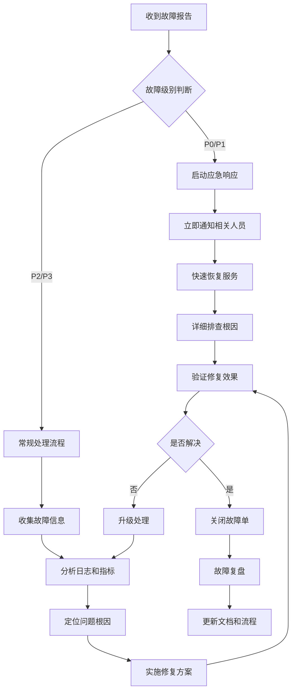

# 故障排除和维护手册

## 目录
- [故障排除概述](#故障排除概述)
- [常见故障类型](#常见故障类型)
- [故障诊断流程](#故障诊断流程)
- [应用层故障排除](#应用层故障排除)
- [数据库故障排除](#数据库故障排除)
- [网络故障排除](#网络故障排除)
- [缓存故障排除](#缓存故障排除)
- [文件存储故障排除](#文件存储故障排除)
- [系统维护指南](#系统维护指南)
- [性能优化建议](#性能优化建议)
- [应急预案](#应急预案)

## 故障排除概述

### 故障分类

| 故障级别 | 影响范围 | 响应时间 | 解决时间 |
|---------|---------|---------|---------|
| P0 - 严重 | 全系统不可用 | 5分钟 | 2小时 |
| P1 - 高 | 核心功能受影响 | 15分钟 | 4小时 |
| P2 - 中 | 部分功能受影响 | 1小时 | 24小时 |
| P3 - 低 | 轻微影响 | 4小时 | 72小时 |

### 故障排除原则

1. **快速响应**: 优先恢复服务，再排查根因
2. **最小影响**: 尽量减少对用户的影响
3. **数据安全**: 保护用户数据不丢失
4. **记录完整**: 详细记录故障处理过程
5. **复盘改进**: 故障后进行复盘和改进

## 常见故障类型

### 1. 应用服务故障

**症状表现:**
- 服务无法启动
- 响应超时
- 500内部错误
- 内存溢出
- CPU占用过高

**常见原因:**
- 代码错误
- 配置问题
- 资源不足
- 依赖服务故障
- 数据库连接问题

### 2. 数据库故障

**症状表现:**
- 连接超时
- 查询缓慢
- 死锁
- 数据损坏
- 主从同步异常

**常见原因:**
- 连接池耗尽
- 慢查询
- 磁盘空间不足
- 网络问题
- 配置错误

### 3. 缓存故障

**症状表现:**
- 缓存失效
- 连接失败
- 内存占用过高
- 数据不一致

**常见原因:**
- Redis宕机
- 网络问题
- 内存不足
- 配置错误

## 故障诊断流程

### 标准诊断流程图



### 故障诊断检查清单

**1. 初步检查**
- [ ] 确认故障范围和影响用户
- [ ] 检查服务状态和健康检查
- [ ] 查看最近的部署和配置变更
- [ ] 检查系统资源使用情况

**2. 深入分析**
- [ ] 分析应用日志和错误信息
- [ ] 检查数据库连接和查询性能
- [ ] 查看网络连通性
- [ ] 分析监控指标变化趋势

**3. 问题定位**
- [ ] 确定问题模块和组件
- [ ] 分析依赖关系
- [ ] 检查配置和环境变量
- [ ] 复现问题场景

## 应用层故障排除

### 服务启动失败

**排查步骤:**

1. **检查启动日志**
```bash
# 查看容器启动日志
docker logs auth-service

# 查看系统日志
journalctl -u auth-service -f

# 查看应用日志
tail -f /var/log/app/auth-service.log
```

2. **检查端口占用**
```bash
# 检查端口是否被占用
netstat -tlnp | grep 3000

# 检查进程状态
ps aux | grep node

# 杀死占用端口的进程
sudo kill -9 <PID>
```

3. **检查配置文件**
```bash
# 验证配置文件语法
node -e "console.log(JSON.parse(require('fs').readFileSync('config/production.json')))"

# 检查环境变量
printenv | grep -E "(DATABASE|REDIS|JWT)"
```

4. **检查依赖服务**
```bash
# 测试数据库连接
mysql -h $DB_HOST -P $DB_PORT -u $DB_USERNAME -p$DB_PASSWORD

# 测试Redis连接
redis-cli -h $REDIS_HOST -p $REDIS_PORT ping
```

**常见解决方案:**

1. **端口冲突**
```yaml
# docker-compose.yml - 修改端口映射
ports:
  - "3001:3000"  # 改为其他端口
```

2. **内存不足**
```yaml
# docker-compose.yml - 增加内存限制
deploy:
  resources:
    limits:
      memory: 1G
```

3. **配置错误**
```bash
# 重新生成配置文件
cp .env.example .env
vim .env  # 编辑配置
```

### 响应超时

**排查步骤:**

1. **检查服务状态**
```bash
# 健康检查
curl -f http://localhost:3000/health

# 检查进程CPU和内存
top -p $(pgrep node)

# 检查网络连接
netstat -an | grep 3000
```

2. **分析慢请求**
```sql
-- 查看慢查询
SELECT * FROM mysql.slow_log ORDER BY start_time DESC LIMIT 10;

-- 分析查询执行计划
EXPLAIN SELECT * FROM students WHERE tenant_id = 'xxx' AND name LIKE '%张%';
```

3. **检查线程池状态**
```typescript
// 监控代码示例
console.log('Event loop delay:', process.hrtime.bigint());

// 检查事件循环延迟
setInterval(() => {
  const start = process.hrtime.bigint();
  setImmediate(() => {
    const delay = Number(process.hrtime.bigint() - start) / 1000000;
    if (delay > 10) {
      console.warn(`Event loop delay: ${delay}ms`);
    }
  });
}, 1000);
```

**解决方案:**

1. **优化数据库查询**
```sql
-- 添加索引
CREATE INDEX idx_tenant_name ON students(tenant_id, name);

-- 分页查询优化
SELECT * FROM students
WHERE tenant_id = 'xxx'
LIMIT 20 OFFSET 0;
```

2. **增加缓存**
```typescript
// Redis缓存示例
async function getStudents(tenantId: string) {
  const cacheKey = `students:${tenantId}`;
  let students = await redis.get(cacheKey);

  if (!students) {
    students = await this.studentRepository.find({ tenantId });
    await redis.setex(cacheKey, 300, JSON.stringify(students));
  }

  return JSON.parse(students);
}
```

3. **异步处理**
```typescript
// 使用消息队列处理耗时任务
async function processAttendance(data) {
  await this.messageQueue.add('process-attendance', data);
}
```

## 数据库故障排除

### 连接问题

**症状表现:**
- 数据库连接超时
- 连接池耗尽
- 认证失败

**排查步骤:**

1. **检查数据库状态**
```bash
# MySQL状态检查
mysqladmin -h $DB_HOST -P $DB_PORT -u $DB_USERNAME -p$DB_PASSWORD status

# 检查进程列表
mysql -h $DB_HOST -P $DB_PORT -u $DB_USERNAME -p$DB_PASSWORD -e "SHOW PROCESSLIST;"

# 检查连接数
mysql -h $DB_HOST -P $DB_PORT -u $DB_USERNAME -p$DB_PASSWORD -e "SHOW STATUS LIKE 'Threads_connected';"
```

2. **检查网络连通性**
```bash
# 测试端口连通性
telnet $DB_HOST $DB_PORT

# 检查防火墙
sudo ufw status
iptables -L

# 检查DNS解析
nslookup $DB_HOST
```

3. **检查配置文件**
```sql
-- 检查最大连接数
SHOW VARIABLES LIKE 'max_connections';

-- 检查超时设置
SHOW VARIABLES LIKE 'wait_timeout';
SHOW VARIABLES LIKE 'interactive_timeout';
```

**解决方案:**

1. **增加连接池大小**
```typescript
// TypeORM配置
{
  type: 'mysql',
  pool: {
    min: 10,
    max: 50,
    acquireTimeoutMillis: 60000,
    idleTimeoutMillis: 30000,
  }
}
```

2. **优化连接超时设置**
```sql
-- 增加超时时间
SET GLOBAL wait_timeout = 28800;
SET GLOBAL interactive_timeout = 28800;
```

3. **配置读写分离**
```typescript
// 读写分离配置
{
  type: 'mysql',
  replication: {
    master: {
      host: 'mysql-master',
      port: 3306,
      username: 'user',
      password: 'password',
    },
    slaves: [
      {
        host: 'mysql-slave-1',
        port: 3306,
        username: 'user',
        password: 'password',
      }
    ]
  }
}
```

### 查询性能问题

**排查步骤:**

1. **识别慢查询**
```sql
-- 启用慢查询日志
SET GLOBAL slow_query_log = 'ON';
SET GLOBAL long_query_time = 2;

-- 查看慢查询
SELECT * FROM mysql.slow_log
WHERE start_time > DATE_SUB(NOW(), INTERVAL 1 HOUR)
ORDER BY query_time DESC;

-- 使用pt-query-digest分析
pt-query-digest /var/log/mysql/mysql-slow.log > slow_report.txt
```

2. **分析执行计划**
```sql
-- 分析查询执行计划
EXPLAIN FORMAT=JSON
SELECT s.*, c.name as class_name
FROM students s
JOIN classes c ON s.class_id = c.id
WHERE s.tenant_id = 'xxx'
AND s.status = 'active';

-- 查看索引使用情况
SHOW INDEX FROM students;
```

3. **检查锁等待**
```sql
-- 查看锁等待
SELECT * FROM INFORMATION_SCHEMA.INNODB_LOCKS;

-- 查看锁等待关系
SELECT * FROM INFORMATION_SCHEMA.INNODB_LOCK_WAITS;

-- 杀死长时间运行的查询
KILL <query_id>;
```

**优化方案:**

1. **添加合适的索引**
```sql
-- 复合索引
CREATE INDEX idx_tenant_status_class ON students(tenant_id, status, class_id);

-- 覆盖索引
CREATE INDEX idx_attendance_cover ON attendance_records(student_id, attendance_date, status);
```

2. **重写查询语句**
```sql
-- 避免使用SELECT *
SELECT id, name, class_id
FROM students
WHERE tenant_id = 'xxx'
AND status = 'active';

-- 使用分页
SELECT * FROM students
WHERE tenant_id = 'xxx'
ORDER BY id
LIMIT 20 OFFSET 0;
```

3. **使用缓存**
```typescript
// 查询结果缓存
async function getStudentsByClass(classId: string) {
  const cacheKey = `students:class:${classId}`;
  let result = await redis.get(cacheKey);

  if (!result) {
    result = await this.studentRepository.find({ classId });
    await redis.setex(cacheKey, 600, JSON.stringify(result));
  }

  return JSON.parse(result);
}
```

## 网络故障排除

### 连通性问题

**排查步骤:**

1. **基本网络测试**
```bash
# ping测试
ping 8.8.8.8
ping mysql-host

# 端口测试
telnet mysql-host 3306
nc -zv redis-host 6379

# 路由跟踪
traceroute mysql-host

# DNS解析
nslookup mysql-host
dig mysql-host
```

2. **防火墙检查**
```bash
# Ubuntu/Debian
sudo ufw status
sudo ufw allow 3306

# CentOS/RHEL
sudo iptables -L -n
sudo iptables -I INPUT -p tcp --dport 3306 -j ACCEPT

# Docker网络检查
docker network ls
docker network inspect kindergarten-network
```

3. **容器网络检查**
```bash
# 检查容器网络
docker exec auth-service ip addr
docker exec auth-service netstat -tlnp

# 容器间连通性测试
docker exec auth-service ping mysql
docker exec auth-service telnet mysql 3306
```

**解决方案:**

1. **修复防火墙规则**
```bash
# 开放必要端口
sudo ufw allow 22    # SSH
sudo ufw allow 80    # HTTP
sudo ufw allow 443   # HTTPS
sudo ufw allow 3000  # App
sudo ufw allow 3306  # MySQL
sudo ufw allow 6379  # Redis

# 重启防火墙
sudo ufw reload
```

2. **重建Docker网络**
```bash
# 删除现有网络
docker network rm kindergarten-network

# 创建新网络
docker network create --driver bridge kindergarten-network

# 重新启动服务
docker-compose up -d
```

3. **配置DNS解析**
```yaml
# docker-compose.yml
services:
  auth-service:
    depends_on:
      - mysql
    networks:
      - app-network
    dns:
      - 8.8.8.8
      - 8.8.4.4

networks:
  app-network:
    driver: bridge
```

## 缓存故障排除

### Redis连接问题

**排查步骤:**

1. **检查Redis服务状态**
```bash
# 检查Redis进程
ps aux | grep redis

# 检查Redis状态
redis-cli ping
redis-cli info server

# 检查Redis配置
redis-cli config get "*"
```

2. **检查内存使用**
```bash
# 查看内存信息
redis-cli info memory

# 查看键空间信息
redis-cli info keyspace

# 检查大键
redis-cli --bigkeys
```

3. **检查连接数**
```bash
# 查看客户端连接
redis-cli client list

# 查看连接统计
redis-cli info clients
```

**解决方案:**

1. **增加Redis内存**
```yaml
# docker-compose.yml
services:
  redis:
    image: redis:7.0
    command: redis-server --maxmemory 1gb --maxmemory-policy allkeys-lru
    mem_limit: 1g
```

2. **优化内存使用**
```bash
# 设置内存策略
redis-cli config set maxmemory-policy allkeys-lru

# 清理过期键
redis-cli --scan --pattern "*" | xargs redis-cli del

# 启用压缩
redis-cli config set rdbcompression yes
```

3. **配置Redis集群**
```yaml
# redis-cluster.yml
version: '3.8'
services:
  redis-master:
    image: redis:7.0
    command: redis-server --appendonly yes

  redis-slave:
    image: redis:7.0
    command: redis-server --slaveof redis-master 6379 --appendonly yes
    depends_on:
      - redis-master
```

## 文件存储故障排除

### OSS上传失败

**排查步骤:**

1. **检查OSS配置**
```typescript
// 验证配置
const OSS = require('ali-oss');
const client = new OSS({
  region: process.env.OSS_REGION,
  accessKeyId: process.env.OSS_ACCESS_KEY_ID,
  accessKeySecret: process.env.OSS_ACCESS_KEY_SECRET,
  bucket: process.env.OSS_BUCKET,
});

// 测试连接
async function testOSS() {
  try {
    const result = await client.listBuckets();
    console.log('OSS连接成功:', result.buckets);
  } catch (error) {
    console.error('OSS连接失败:', error);
  }
}
```

2. **检查权限设置**
```bash
# 使用OSS CLI测试
ossutil ls oss://your-bucket

# 检查bucket权限
ossutil bucket-policy --bucket your-bucket
```

3. **检查网络连通性**
```bash
# 测试OSS域名解析
nslookup oss-cn-beijing.aliyuncs.com

# 测试端口连通性
telnet oss-cn-beijing.aliyuncs.com 80
telnet oss-cn-beijing.aliyuncs.com 443
```

**解决方案:**

1. **修复配置问题**
```typescript
// 检查并修复配置
const config = {
  region: process.env.OSS_REGION,
  accessKeyId: process.env.OSS_ACCESS_KEY_ID,
  accessKeySecret: process.env.OSS_ACCESS_KEY_SECRET,
  bucket: process.env.OSS_BUCKET,
  secure: true,  // 使用HTTPS
  timeout: 60000, // 超时时间
};

if (!config.region || !config.accessKeyId || !config.accessKeySecret) {
  throw new Error('OSS配置不完整');
}
```

2. **实现重试机制**
```typescript
async function uploadWithRetry(file, maxRetries = 3) {
  for (let i = 0; i < maxRetries; i++) {
    try {
      const result = await client.put(file.name, file);
      return result;
    } catch (error) {
      console.warn(`上传失败，第${i + 1}次重试:`, error.message);
      if (i === maxRetries - 1) throw error;
      await new Promise(resolve => setTimeout(resolve, 1000 * (i + 1)));
    }
  }
}
```

3. **配置本地备份**
```typescript
// 上传到OSS前先保存到本地
import * as fs from 'fs';
import * as path from 'path';

async function uploadWithBackup(file) {
  const localPath = path.join('/tmp/backup', file.name);

  try {
    // 保存到本地
    fs.writeFileSync(localPath, file.buffer);

    // 上传到OSS
    const result = await client.put(file.name, file);

    // 删除本地文件
    fs.unlinkSync(localPath);

    return result;
  } catch (error) {
    console.error('上传失败，文件已保存到本地:', localPath);
    throw error;
  }
}
```

## 系统维护指南

### 日常维护任务

**每日维护:**
- [ ] 检查系统健康状态
- [ ] 查看错误日志
- [ ] 监控资源使用情况
- [ ] 备份关键数据
- [ ] 检查安全告警

**每周维护:**
- [ ] 更新安全补丁
- [ ] 清理日志文件
- [ ] 优化数据库性能
- [ ] 检查备份完整性
- [ ] 分析监控趋势

**每月维护:**
- [ ] 系统版本更新
- [ ] 容量规划评估
- [ ] 安全漏洞扫描
- [ ] 灾备演练
- [ ] 性能基准测试

### 数据库维护

**日常维护脚本:**
```bash
#!/bin/bash
# db-maintenance.sh

# 数据库备份
mysqldump -h $DB_HOST -u $DB_USERNAME -p$DB_PASSWORD \
  --single-transaction --routines --triggers \
  $DB_DATABASE | gzip > /backup/mysql/$(date +%Y%m%d).sql.gz

# 清理过期数据
mysql -h $DB_HOST -u $DB_USERNAME -p$DB_PASSWORD $DB_DATABASE <<EOF
-- 清理30天前的日志
DELETE FROM audit_logs WHERE created_at < DATE_SUB(NOW(), INTERVAL 30 DAY);

-- 清理过期的token
DELETE FROM tokens WHERE expires_at < NOW();

-- 优化表
OPTIMIZE TABLE users, students, attendance_records;
EOF

# 分析表统计信息
mysql -h $DB_HOST -u $DB_USERNAME -p$DB_PASSWORD $DB_DATABASE \
  -e "ANALYZE TABLE users, students, classes, attendance_records;"
```

### 日志维护

**日志清理脚本:**
```bash
#!/bin/bash
# log-cleanup.sh

LOG_DIR="/var/log"
RETENTION_DAYS=30

# 清理应用日志
find $LOG_DIR/app -name "*.log" -mtime +$RETENTION_DAYS -delete
find $LOG_DIR/app -name "*.log.*" -mtime +$RETENTION_DAYS -delete

# 清理Nginx日志
find $LOG_DIR/nginx -name "*.log" -mtime +$RETENTION_DAYS -delete
find $LOG_DIR/nginx -name "*.log.*" -mtime +$RETENTION_DAYS -delete

# 压缩大日志文件
find $LOG_DIR -name "*.log" -size +100M -exec gzip {} \;

# 清理Docker日志
docker system prune -f
docker volume prune -f
```

### 系统更新

**更新流程:**
```bash
#!/bin/bash
# system-update.sh

set -e

echo "开始系统更新..."

# 备份当前版本
kubectl get deployment -o yaml > /backup/deployment-$(date +%Y%m%d).yaml

# 更新镜像
docker pull registry.example.com/kindergarten/auth-service:latest
docker pull registry.example.com/kindergarten/tenant-service:latest

# 滚动更新
kubectl set image deployment/auth-service \
  auth-service=registry.example.com/kindergarten/auth-service:latest

kubectl set image deployment/tenant-service \
  tenant-service=registry.example.com/kindergarten/tenant-service:latest

# 等待更新完成
kubectl rollout status deployment/auth-service --timeout=300s
kubectl rollout status deployment/tenant-service --timeout=300s

# 验证更新
kubectl get pods -l app=auth-service
kubectl get pods -l app=tenant-service

echo "系统更新完成"
```

## 性能优化建议

### 应用层优化

1. **代码优化**
```typescript
// 使用连接池
const pool = mysql.createPool({
  connectionLimit: 20,
  host: process.env.DB_HOST,
  user: process.env.DB_USERNAME,
  password: process.env.DB_PASSWORD,
  database: process.env.DB_DATABASE,
});

// 批量操作
async function createStudents(students: Student[]) {
  const chunks = _.chunk(students, 100);
  for (const chunk of chunks) {
    await this.studentRepository.insert(chunk);
  }
}

// 使用缓存
const cache = new Map();

async function getUser(id: string) {
  if (cache.has(id)) {
    return cache.get(id);
  }

  const user = await this.userRepository.findOne(id);
  cache.set(id, user);
  return user;
}
```

2. **异步处理**
```typescript
// 使用Promise.all
async function processUsers(userIds: string[]) {
  const promises = userIds.map(id => this.processUser(id));
  const results = await Promise.all(promises);
  return results;
}

// 使用消息队列
async function sendNotification(user: User, message: string) {
  await this.queue.add('send-notification', { user, message });
}
```

### 数据库优化

1. **索引优化**
```sql
-- 分析查询模式
EXPLAIN SELECT * FROM students WHERE tenant_id = 'xxx' AND status = 'active';

-- 添加复合索引
CREATE INDEX idx_tenant_status ON students(tenant_id, status);

-- 删除无用索引
DROP INDEX idx_unused ON students;
```

2. **查询优化**
```sql
-- 避免SELECT *
SELECT id, name, email FROM users WHERE id = 1;

-- 使用LIMIT
SELECT * FROM logs ORDER BY created_at DESC LIMIT 100;

-- 使用JOIN替代子查询
SELECT u.*, p.profile
FROM users u
LEFT JOIN user_profiles p ON u.id = p.user_id
WHERE u.tenant_id = 'xxx';
```

3. **表结构优化**
```sql
-- 分区表
CREATE TABLE attendance_records (
    id VARCHAR(32) PRIMARY KEY,
    tenant_id VARCHAR(32) NOT NULL,
    attendance_date DATE NOT NULL,
    -- 其他字段
    INDEX idx_tenant_date (tenant_id, attendance_date)
) PARTITION BY RANGE (YEAR(attendance_date) * 100 + MONTH(attendance_date)) (
    PARTITION p202401 VALUES LESS THAN (202402),
    PARTITION p202402 VALUES LESS THAN (202403),
    -- 更多分区
);

-- 垂直拆分
CREATE TABLE user_profiles (
    user_id VARCHAR(32) PRIMARY KEY,
    bio TEXT,
    avatar_url VARCHAR(255),
    -- 大字段
);
```

## 应急预案

### 服务不可用应急预案

**P0级别故障处理流程:**

1. **立即响应 (5分钟内)**
```bash
# 快速重启服务
kubectl rollout restart deployment/auth-service
kubectl rollout restart deployment/tenant-service

# 检查服务状态
kubectl get pods -l app=auth-service
kubectl get pods -l app=tenant-service

# 查看最近日志
kubectl logs -l app=auth-service --tail=100
```

2. **故障定位 (15分钟内)**
```bash
# 检查系统资源
kubectl top pods
kubectl top nodes

# 检查数据库连接
kubectl exec -it mysql-pod -- mysql -uroot -p -e "SHOW PROCESSLIST;"

# 检查网络连接
kubectl exec -it auth-service -- ping mysql
kubectl exec -it auth-service -- telnet mysql 3306
```

3. **恢复服务 (30分钟内)**
```bash
# 回滚到上一个版本
kubectl rollout undo deployment/auth-service
kubectl rollout undo deployment/tenant-service

# 扩容服务
kubectl scale deployment auth-service --replicas=10
kubectl scale deployment tenant-service --replicas=10

# 启用只读模式
kubectl patch deployment auth-service -p '{"spec":{"template":{"spec":{"containers":[{"name":"auth-service","env":[{"name":"READ_ONLY","value":"true"}]}]}}}}'
```

### 数据丢失应急预案

**数据恢复流程:**

1. **评估损失**
```bash
# 检查备份文件
ls -la /backup/mysql/
ls -la /backup/redis/

# 验证备份完整性
gzip -t /backup/mysql/$(date +%Y%m%d).sql.gz
```

2. **恢复数据**
```bash
# 恢复数据库备份
gunzip < /backup/mysql/20241201.sql.gz | \
mysql -h $DB_HOST -u $DB_USERNAME -p$DB_PASSWORD $DB_DATABASE

# 恢复Redis数据
redis-cli --rdb /backup/redis/dump.rdb
```

3. **数据验证**
```bash
# 检查数据完整性
mysql -h $DB_HOST -u $DB_USERNAME -p$DB_PASSWORD $DB_DATABASE \
  -e "SELECT COUNT(*) FROM users; SELECT COUNT(*) FROM students;"

# 验证关键业务数据
mysql -h $DB_HOST -u $DB_USERNAME -p$DB_PASSWORD $DB_DATABASE \
  -e "SELECT COUNT(*) FROM students WHERE status = 'active';"
```

### 安全事件应急预案

**安全事件响应:**

1. **隔离受影响系统**
```bash
# 断开可疑连接
kubectl scale deployment auth-service --replicas=0
kubectl scale deployment tenant-service --replicas=0

# 更改数据库密码
mysql -h $DB_HOST -u root -p \
  -e "ALTER USER 'app_user'@'%' IDENTIFIED BY 'new_password';"

# 更改Redis密码
redis-cli CONFIG SET requirepass new_password
```

2. **收集证据**
```bash
# 导出审计日志
kubectl logs -l app=auth-service --since=1h > security-incident.log

# 导出网络连接
netstat -an > network-connections.log

# 导出进程信息
ps aux > process-list.log
```

3. **修复漏洞**
```bash
# 更新系统包
apt update && apt upgrade -y

# 重建容器镜像
docker build -t kindergarten/auth-service:secure .
docker push registry.example.com/kindergarten/auth-service:secure

# 重新部署
kubectl set image deployment/auth-service \
  auth-service=registry.example.com/kindergarten/auth-service:secure
```

### 故障复盘流程

**故障复盘检查清单:**

1. **故障基本信息**
   - [ ] 故障发生时间
   - [ ] 故障持续时间
   - [ ] 影响范围和用户数
   - [ ] 故障级别判定

2. **根本原因分析**
   - [ ] 直接原因
   - [ ] 间接原因
   - [ ] 系统设计缺陷
   - [ ] 流程问题

3. **处理过程回顾**
   - [ ] 响应时间
   - [ ] 处理步骤
   - [ ] 决策过程
   - [ ] 沟通协调

4. **改进措施**
   - [ ] 技术改进
   - [ ] 流程优化
   - [ ] 监控告警
   - [ ] 培训需求

5. **预防措施**
   - [ ] 系统架构优化
   - [ ] 代码质量提升
   - [ ] 测试覆盖率
   - [ ] 容灾备份

**故障报告模板:**
```markdown
# 故障报告

## 基本信息
- 故障ID: INC-2024-001
- 故障级别: P0
- 发生时间: 2024-12-01 10:30:00
- 恢复时间: 2024-12-01 12:45:00
- 影响用户数: 5000

## 故障描述
[详细描述故障现象和用户影响]

## 时间线
- 10:30 监控告警触发
- 10:35 运维团队响应
- 10:45 开始故障排查
- 11:30 定位问题根因
- 12:00 实施修复方案
- 12:45 服务恢复正常

## 根本原因
[分析故障的根本原因]

## 处理过程
[详细记录故障处理过程]

## 影响评估
[评估故障对业务的影响]

## 改进措施
1. 技术改进
2. 流程优化
3. 监控告警
4. 培训计划

## 预防措施
[制定预防类似故障的措施]
```

---

*本文档持续更新中，最后更新时间: 2025-11-29*